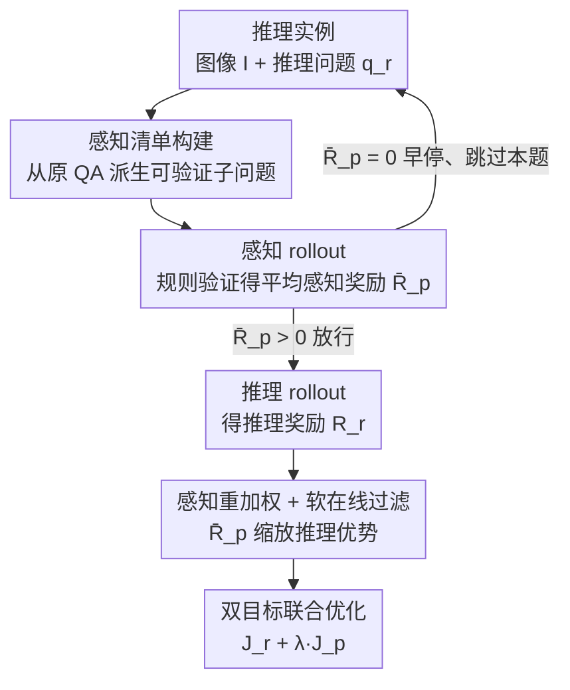

# Perceptual-Evidence Anchored Reinforced Learning for Multimodal Reasoning

**会议**: CVPR 2026  
**论文**: [CVF Open Access](https://openaccess.thecvf.com/content/CVPR2026/html/Zhang_Perceptual-Evidence_Anchored_Reinforced_Learning_for_Multimodal_Reasoning_CVPR_2026_paper.html)  
**代码**: https://github.com/MiliLab/PEARL  
**领域**: 多模态VLM / LLM推理 / 强化学习  
**关键词**: RLVR, 视觉语言模型, 感知-推理协同, 奖励黑客, 多模态推理

## 一句话总结
针对 RLVR 训练视觉语言模型时「只验证文本答案、放任上游视觉感知出错」的缺陷，PEARL 用一份从原题派生的「感知清单」给每道推理题加一组可验证的感知子问题，把感知奖励既当作直接监督信号、又当作放行推理更新的「保真门控」，从而在 MathVerse 等 6 个多模态推理基准上相对 baseline 平均提升约 +9.7%。

## 研究背景与动机

**领域现状**：带可验证奖励的强化学习（RLVR，如 GRPO、DAPO）在大语言模型上显著提升了推理能力，近来被迁移到视觉语言模型（VLM）做多模态数学/逻辑推理。其标准做法是：给定图文问题，模型采样一组候选回答，规则验证器只看最终文本答案对不对来发奖励。

**现有痛点**：这种「只看结果」的奖励完全忽略了推理链最底层的一步——视觉感知是否正确。作者做了一个诊断实验：用 GRPO 微调一个领先 VLM，再按「感知错误（看错了图里的物体/数值/图表元素）」和「推理错误（逻辑或计算错）」两类拆解失败模式。结果很说明问题——GRPO 大幅降低了推理错误，但感知错误率几乎纹丝不动。

**核心矛盾**：当模型靠「看错的视觉前提 + 逻辑上看似合理的步骤」也能蒙对最终答案时，奖励照样发放，于是模型学会了生成「建立在错误感知之上的伪推理链」。这正是 reward hacking 与视觉幻觉的根源——感知与推理被错误地纠缠在一起，给性能和可靠性设了一道硬天花板。

**本文目标**：让强化学习信号既能直接奖励「看得对」，又能阻止模型在「没看对」时去强化推理，把感知正确性变成推理更新的前置门槛。

**切入角度**：作者提出一个朴素但关键的反问——「模型在推理之前，到底有没有把图看对？」要回答它，就需要一种**可验证、低噪声**的感知信号。已有「describe-then-reason」方案让模型先生成图像描述再由外部奖励模型/LLM 打分，但自由文本描述的「正确性」本身模糊、奖励噪声大、还要额外的判分模型，容易引发感知层面的 reward hacking。

**核心 idea**：把「自由文本描述」换成「从原 QA 派生、答案可规则验证的感知子问题清单」，用它产出的感知奖励同时充当①直接感知监督和②放行推理更新的保真门控——只有「看对了」才允许「学推理」。

## 方法详解

### 整体框架
PEARL 是一个建立在 GRPO 之上的双路径（感知路径 + 推理路径）协同强化学习框架。输入是一道多模态推理实例 $(Q_r, A_r)$（图像 $I$ + 推理问题 $q_r$ + 标准答案）；输出是经过感知-推理协同优化后的策略。其核心是在每个训练步给推理题挂上一份感知清单，先跑一组「感知 rollout」算出平均感知奖励 $\bar R_p$，再用它决定推理路径是否放行、以及推理梯度该被放大还是抑制。整条流水线是：从原题派生感知清单 → 感知 rollout 得到 $\bar R_p$ 当保真门控 → 仅当门控通过才跑推理 rollout → 用感知奖励重加权推理优势、配合在线过滤，最后用双目标联合优化。

### 关键设计

**1. QA 锚定的感知清单构建：把模糊的「描述对不对」换成可规则验证的子问题**

这是 PEARL 区别于 describe-then-reason 路线的根。给定一道推理题，作者不让模型生成长篇图像描述，而是按一套「操作指南」从原 QA 里派生若干**答案简短、可规则验证**（如一个数字或标签）的感知子问题。派生沿两个维度展开：内容来源维度有四种模式——直接抽取（图/题里明写的事实）、模式归纳（提炼解题所需的显著区域或结构线索）、派生计算（基于视觉模式做一步推断/计算）、答案反推（把原答案当约束，反推隐含的计数或关系）；技能维度则规定子问题考察哪种低层感知能力（识别物体、读趋势、计数、辨认几何排布等）。这样生成的子问题天然与原任务逻辑绑定，能充当核验模型「该看懂的关键视觉证据有没有看懂」的清单，而非随意的视觉问答。论文用 GPT-4.1 构建清单，并通过人评验证：QA 锚定清单的错误率仅 5.13%、无关率 5.53%，而对照的「描述增强稠密清单」无关率高达 60.78%（⚠️ 具体百分比以原文 Tab.5 为准）。

**2. 感知保真门控 + 早停过滤：没看对就不许学推理，顺带省算力**

把感知奖励变成放行推理更新的「闸门」是全文最关键的机制。每个训练步先把清单里 $K$ 个感知子问题串成一条紧凑提示 $\tilde Q_p = (I, Q_p^1, \dots, Q_p^K)$，让 VLM 直接作答（不走中间推理），采样 $G$ 组输出，规则验证器给每个子问题打分，单条输出奖励为 $R_p^i = \frac{1}{K}\sum_{j=1}^{K} R_p^{i,j}$，再对 $G$ 组取平均得到 $\bar R_p$。这个 $\bar R_p$ 既度量模型对该图的感知水平，又当保真门控：若 $\bar R_p = 0$，认为模型当前缺乏支撑该推理题的感知能力，**直接早停、跳过推理 rollout 进入下一步**；只有 $\bar R_p > 0$（视为「感知通过」实例）才允许推理 rollout 继续以获得推理奖励 $R_r$。它直接阻断了「在错误前提上强化伪推理链」这一 reward hacking 通路；同时随训练推进、感知变好，更多实例满足门控，模型自然地从「先学会看」过渡到「再啃难推理」，相当于一条无需人工设计的隐式课程。

**3. 感知-推理协同优化：用感知奖励重加权推理梯度，并放宽在线过滤**

光有门控只能「拦」，作者进一步让感知信号**调制**推理优化。其一是感知重加权：把组内归一化的推理优势 $\hat A_r$ 重塑为 $\hat A_r \leftarrow \hat A_r \cdot \min(\bar R_p, 0.5)$，即用感知奖励当一个软可靠性先验来缩放推理梯度——感知扎实就放大该条推理的更新、感知可疑就压制，从而把优化偏向「既答对又看对」的策略，削弱纯靠虚假线索蒙对的解的竞争力。其二是软在线过滤：原始在线过滤只保留 $\bar R_r \notin \{0,1\}$ 的样本以避免零方差无梯度，但这会误丢掉「推理奖励已饱和、可感知信号仍有用」的样本，于是放宽为 $\bar R_r \notin \{0,1\} \;\lor\; \bar R_p \notin \{0,1\}$，只要任一路径还有非平凡信号就保留。最后把两路并进双目标：$J_{\text{dual}}(\theta) = J_{\text{GRPO}}(\theta; \hat A_r) + \lambda J_{\text{GRPO}}(\theta; \hat A_p)$，$\lambda$（论文取 0.1）控制感知路径的相对贡献。

### 损失函数 / 训练策略
基础目标沿用 GRPO 的裁剪式目标 $J_{\text{GRPO}}$，优势按组归一化 $\hat A_i = (r_i - \text{mean}\{r\}) / \text{std}\{r\}$。在此之上 PEARL 用式 (5) 的双目标做联合更新。实现基于 EasyR1，AdamW，恒定学习率 $1\times10^{-6}$，全局 batch 128，每实例各跑 1 条推理 + 1 条感知 rollout、每条采 5 个回答，最大回答长度 2048，$\lambda=0.1$。基座为 Qwen2.5-VL-3B / 7B，主实验在 ViRL39K 上训练。值得注意的是组件消融（Tab.4）显示「移除 KL 正则」也是有效配置之一。

## 实验关键数据

### 主实验
在 OpenCompass 多模态推理榜的 6 个数据集上，PEARL 在 3B 与 7B 两个基座上的平均准确率都超过所有监督与 RLVR baseline。

| 基座 | 方法 | MathVerse | MathVision | MathVista | WeMath | 平均 |
|------|------|-----------|-----------|-----------|--------|------|
| 3B | Base | 31.2 | 21.9 | 61.2 | 22.9 | 31.8 |
| 3B | GRPO | 34.9 | 26.8 | 64.7 | 26.9 | 34.8 |
| 3B | PAPOD（最强 baseline） | 40.1 | 27.0 | 67.0 | 34.9 | 39.2 |
| 3B | **PEARL** | **40.5** | **27.8** | **67.1** | **36.3** | **39.8** |
| 7B | Base | 41.1 | 25.4 | 68.1 | 36.2 | 40.1 |
| 7B | GRPO | 46.4 | 30.5 | 74.2 | 40.9 | 44.2 |
| 7B | DAPO | 45.7 | 30.9 | 75.9 | 40.7 | 45.1 |
| 7B | **PEARL** | **50.8** | **31.8** | **76.9** | **45.5** | **47.9** |

7B 上相对 base 在 MathVerse 提升 +9.7（50.8 vs 41.1）、相对 GRPO +6.6（50.8 vs 44.2）。相比 PAPO、Vision-SR1 等感知增强方法在不同数据集上波动较大，PEARL 在所有基准和两个基座上提升更均匀，说明其探针式设计跨场景迁移更稳。

### 消融实验
组件路线图消融（7B，从 GRPO 起逐项叠加）：

| 配置 | MathVerse | LogicVista | WeMath | 平均 |
|------|-----------|-----------|--------|------|
| GRPO | 46.4 | 47.9 | 40.9 | 44.2 |
| + 感知清单 | 47.6 | 50.2 | 44.1 | 45.8 |
| + 软在线过滤并移除 KL | 47.8 | 54.0 | 42.7 | 46.7 |
| + 感知重加权与早停（完整 PEARL） | 50.8 | 51.9 | 45.5 | 47.9 |

感知清单设计消融（Tab.3，7B）：QA 锚定清单平均 47.9，远高于「描述增强稠密清单」的 45.5。

### 关键发现
- **「对齐与保真」胜过「数量与覆盖」**：稠密清单虽探针更多更细，却引入大量任务无关干扰项（人评 60%+ 无关），反而拖累 RL 奖励；QA 锚定清单噪声极低，性能更好。
- **感知奖励本身就是有用的推理信号**：泛化实验（Tab.2）中即便只用感知奖励训练（Perception-Only），在 Geo3K/MMK12 上也能比纯推理 baseline 带来非平凡增益（7B 上 +2.4/+2.5），印证「看得对」是「想得对」的前置条件；但单独用感知不够，必须与推理优化耦合。
- **几何/图表密集任务收益最大**：WeMath、LogicVista 这类需细粒度视觉细节的任务提升最显著，说明强制感知正确能让模型真正利用视觉结构而非走文本捷径。

## 亮点与洞察
- **「保真门控」是一个朴素却有力的杠杆**：用一个标量 $\bar R_p$ 同时干三件事——直接监督感知、闸断错误前提下的推理更新、并隐式形成「先学看再学推」的课程，一个机制串起三重收益，设计极简。
- **把模糊奖励问题转成可规则验证问题**：describe-then-reason 的痛点在于自由文本难打分，PEARL 用「答案是数字/标签的子问题」绕开外部奖励模型，既省算力又降噪声——这种「把难评的生成换成易验的判别」的思路可迁移到其他需要中间过程监督的 RLVR 任务。
- **即插即用**：PEARL 可无缝接到 GRPO / DAPO 之上，作为补充信号而非替换框架，落地成本低。

## 局限与展望
- 感知清单依赖强外部模型（GPT-4.1）离线构建，清单质量与覆盖受生成器能力影响；论文也坦言 QA 锚定清单只覆盖原 QA 引用到的视觉细节，可能漏掉图中其他信息（但实验显示「更全」并不等于「更好」）。
- 评测集中在数学/逻辑类多模态推理基准，对开放域、长链条或非数理类多模态推理的有效性未充分验证。
- 门控用硬阈值 $\bar R_p > 0$ 放行、重加权用 $\min(\bar R_p, 0.5)$ 截断，这些阈值的敏感性与最优设定缺乏系统扫描；早停虽省算力，也可能让最难（始终感知不过关）的样本长期得不到训练。

## 相关工作与启发
- **vs GRPO / DAPO**：它们只用最终文本答案发奖励，对上游感知错误「盲视」；PEARL 在其之上加一条感知路径与保真门控，把感知正确性变成推理更新的前提，因此在感知密集任务上提升更稳。
- **vs PAPO / Vision-SR1（感知增强 RL）**：这类方法通过掩码扰动、感知-推理一致性约束等隐式对齐感知与推理，但跨数据集波动较大；PEARL 用显式、可验证的探针奖励，跨基准/基座增益更均匀。
- **vs describe-then-reason / caption-based**：后者让模型先生成图像描述再由外部奖励模型打分，奖励噪声大、需额外判分模型；PEARL 用答案可规则验证的子问题清单替代自由文本，噪声更低、无需额外奖励模型。

## 评分
- 新颖性: ⭐⭐⭐⭐⭐ 「感知保真门控 + QA 锚定可验证清单」把感知正确性变成推理更新前提，切口清晰且诊断实验有力。
- 实验充分度: ⭐⭐⭐⭐ 6 基准 × 2 基座 + 泛化/组件/清单设计多重消融与人评，扎实；但阈值敏感性、非数理任务覆盖不足。
- 写作质量: ⭐⭐⭐⭐ 动机—诊断—方法—消融逻辑顺畅，公式与图表清楚。
- 价值: ⭐⭐⭐⭐⭐ 即插即用接 GRPO/DAPO，直击 VLM 推理的视觉幻觉/reward hacking 痛点，落地性强。

<!-- RELATED:START -->

## 相关论文

- [\[CVPR 2026\] CARE What Fails: Contrastive Anchored-REflection for Verifiable Multimodal Reasoning](care_what_fails_contrastive_anchored-reflection_for_verifiable_multimodal_reason.md)
- [\[CVPR 2026\] See Less, See Right: Bi-directional Perceptual Shaping For Multimodal Reasoning](see_less_see_right_bi-directional_perceptual_shaping_for_multimodal_reasoning.md)
- [\[CVPR 2026\] Conan: Progressive Learning to Reason Like a Detective over Multi-Scale Visual Evidence](conan_progressive_learning_to_reason_like_a_detective_over_multi-scale_visual_ev.md)
- [\[CVPR 2026\] R-C2: Cycle-Consistent Reinforcement Learning Improves Multimodal Reasoning](r-c2_cycle-consistent_reinforcement_learning_improves_multimodal_reasoning.md)
- [\[CVPR 2026\] Stable and Efficient Single-Rollout RL for Multimodal Reasoning](stable_and_efficient_single-rollout_rl_for_multimodal_reasoning.md)

<!-- RELATED:END -->
