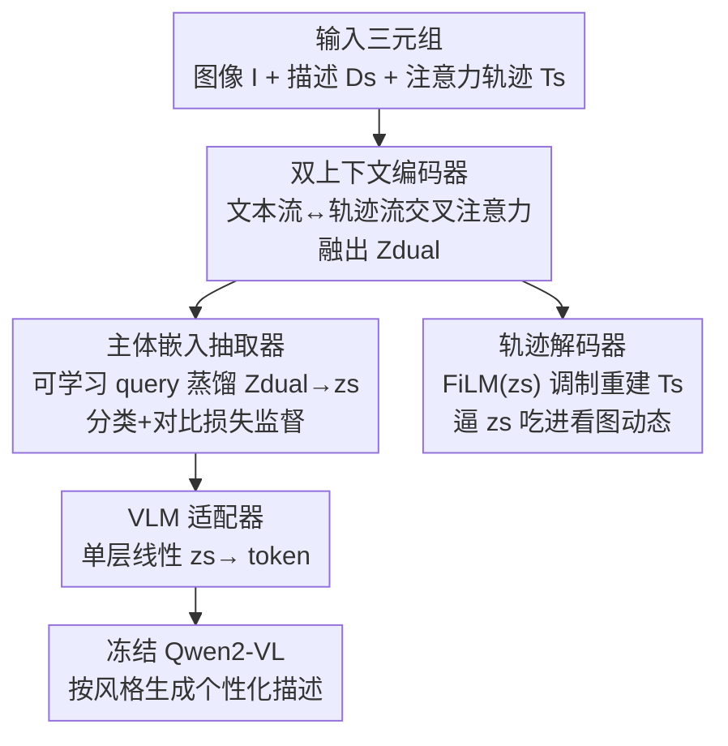

# Personalized Image Descriptions from Attention Sequences

**会议**: CVPR 2026  
**论文**: [CVF Open Access](https://openaccess.thecvf.com/content/CVPR2026/html/Xue_Personalized_Image_Descriptions_from_Attention_Sequences_CVPR_2026_paper.html)  
**代码**: https://github.com/cvlab-stonybrook/Personalized-Image-Description  
**领域**: 多模态VLM  
**关键词**: 个性化图像描述, 人类注意力轨迹, 主体嵌入, 少样本个性化, 冻结VLM

## 一句话总结
DEPER 第一次把"每个人怎么看图"（注意力扫视轨迹）当成个性化信号，蒸馏出一个跨图像稳定的主体嵌入，再用一个轻量 adapter 把它注入冻结的 Qwen2-VL，让模型在不需要测试时注视数据、不需要逐人微调的情况下，生成符合个人风格的图像描述，四个数据集平均提升约 24%。

## 研究背景与动机
**领域现状**：个性化图像描述（personalized image captioning）的目标是让生成"取决于谁在描述"，而不只是"图里有什么"。从 CSMN 开始，主流做法是用 TF–IDF 统计用户历史发帖里的高频词，把"最常用的词"当成一个人的个性表征；后续工作（MHTN、UMCap 等）换了架构、加了长短期记忆，但个性的内核仍然停留在"高频用词"上。另一条线是风格可控描述，用"sweet""dramatic"这类显式文本标签去条件化生成。

**现有痛点**：这些方法只盯着**语言风格**——用什么词、什么语气——却完全忽略了一个人**怎么看图**。认知科学早就指出，每个人的视觉注意力模式是稳定且独特的：有人先扫大物体再跳到下一个，有人逐个细看；有人偏好背景，有人盯着前景人物。这些"看的顺序、看哪里、看多久"直接决定了"先说什么、说多细、提到哪些物体"。把注意力丢掉，个性化就丢了半边天。另一条用注意力的工作（attention-controlled captioning）虽然吃注视信号，但它们只是把注意力当成**单张图的、群体层面的**条件输入，测试时还得现场给注视数据，无法泛化成"这个人跨图像的稳定偏好"，大规模部署不现实。

**核心矛盾**：人类注意力是**噪声大、连续、行为多样**的信号，而且强烈依赖图像内容——你看这张图的轨迹里，既有"你这个人固有的看图习惯"，也有"这张图本身长这样所以你不得不看那里"。要把**稳定的个人特质**从**图像特定的内容线索**里解耦出来，本身很难。叠加第二个矛盾：图像描述模型通常参数很重，给新用户只有几个样本时直接微调极易过拟合。

**本文目标**：(1) 学一个跨图像一致、跨人有区分度的主体表征，把注意力习惯和语言风格一起编码进去；(2) 让这个表征能在不重训、少样本的情况下迁移到全新用户；(3) 推理时不再依赖注视数据。

**核心 idea**：用一句话概括——**"理解一个人怎么看图，就能预测他会怎么说"**。把（图像、描述、注意力轨迹）三元组喂进一个 persona 编码器，蒸馏出内容无关的主体嵌入 $z_s$，再用一个 `<subj>` token + 轻量 adapter 把它塞进冻结 VLM 的 prompt 空间。

## 方法详解

### 整体框架
DEPER（DEscription-PERception persona encoder）的核心产物是一个主体嵌入 $z_s$：一个把"某人怎么看图、怎么描述图"压缩成的向量，要求它对同一个人跨图像保持一致、对不同人有区分度。整条管线分两段：前半段（DEPER 网络）从三元组 $(I, D_s, T_s)$ ——图像、该主体的描述、他的注意力轨迹——里提炼 $z_s$；后半段把 $z_s$ 通过 adapter 投到冻结 VLM 的 token 空间，用 prompt "Write a description of this photo in the style of `<subj>`" 触发个性化生成。轨迹 $T_s = \{(b_i, \tau_i)\}_{i=1}^{M}$ 是一串带停留时长 $\tau_i$ 的注视框序列（鼠标移动或眼动仪采集）。

DEPER 内部由三个互补模块串起来：双上下文编码器把视觉/语言/注意力三股流融成 $Z_{dual}$；主体嵌入抽取器在判别监督下把 $Z_{dual}$ 蒸馏成紧凑的 $z_s$；轨迹解码器用一个辅助的"重建注意力轨迹"任务，逼着 $z_s$ 真的吃进了看图动态而不只是语言风格。

### 关键设计

**1. 双上下文编码器：让"看图轨迹"和"语言风格"互相交换信息**

痛点是注意力和语言不能各编各的——一个人"先看人再看背景"的扫视习惯，和他"喜欢用细节性词汇"的语言习惯，本来就是耦合在一起的。DEPER 用两条流交替做自注意力和交叉注意力：文本 token 流去注意图像和轨迹上下文，轨迹 token 流去注意图像和文本上下文，形式为

$$T_{\ell+1} = \mathrm{FFN}_\ell^T\!\big(\mathrm{Cross}_\ell^T(\mathrm{Self}_\ell^T(T_\ell),\,[V; L_\ell])\big),\qquad L_{\ell+1} = \mathrm{FFN}_\ell^L\!\big(\mathrm{Cross}_\ell^L(\mathrm{Self}_\ell^L(L_\ell),\,[V; T_\ell])\big),$$

其中 $V$ 是图像 patch 特征，$[\,;\,]$ 是拼接，重复 $\ell$ 层。轨迹特征里特别用正弦位置编码把每个注视框的**停留时长和扫视次序**编进去，这样模型才区分得出"快速扫过"和"长久凝视"。重复几层后得到融合表征 $Z_{dual} = [L'; T']$，它天然同时携带了这个人的语言风格和注意力行为——这是后面所有蒸馏的原料。

**2. 主体嵌入抽取器：把跨图像稳定的个人特质蒸出来、还不能塌缩**

直接拿 $Z_{dual}$ 当个性表征不行，因为它还混着大量单张图的内容信息。抽取器用一个**可学习的主体 query** $q_s$ 去交叉注意 $Z_{dual}$，把"这个人区别于他人的看图与描述模式"选择性地聚合成稳定的 $z_s$。光这样还会塌缩到一个公共子空间（所有人都长得差不多），所以加了一个联合判别目标：一个分类头从 $z_s$ 预测主体 ID，用交叉熵 $L_{cls}$ 强制**人与人之间可分**；再叠一个监督对比损失 $L_{con}$（SupCon），把同一人的嵌入拉近、不同人的推开。分类保证有判别力，对比保证不塌缩，两者合起来才让 $z_s$ 既稳定又有区分度——消融里去掉对比损失 BLEU-4 从 0.312 掉到 0.228，掉得很狠。

**3. 轨迹解码器：用"重建注意力轨迹"这个辅助任务，逼主体嵌入真的吃进看图习惯**

只用分类/对比损失，$z_s$ 很可能只学到了语言风格、把注意力当噪声扔了。为了强制把看图动态留在 $z_s$ 里，作者引入一个解码器去**重建该实例的注意力轨迹** $T_s$。它先用一个轨迹 query $q_{traj}$ 从 $Z_{dual}$ 里抽出实例级的轨迹隐变量 $z_{traj}$，再初始化 $M$ 个框 query，把 $z_{traj}$ 广播给每个 query 作为全局先验，逐层做自注意力 + 对 $z_{traj}$ 的交叉注意力：$Q_\ell = \mathrm{Cross}_\ell(\mathrm{Self}_\ell(Q_\ell), z_{traj})$。关键一步是用 **FiLM** 拿主体嵌入 $z_s$ 去调制每个解码块，让重建"以个性化的方式"进行：

$$Q_{\ell+1} = \mathrm{FFN}_\ell\!\big(\mathrm{FiLM}(\mathrm{Cross}_\ell(Q_\ell, [V; L_0]),\, z_s)\big).$$

最后线性头预测框坐标 $\hat{B}$ 和有效位 $\hat{V}$，用带掩码的 smooth L1（框）+ BCE（有效位）监督 $L_{traj} = L_{box} + L_{valid}$。这里 $z_{traj}$ 负责吸收实例特定的重建细节，从而**让 $z_s$ 专注于稳定的个人看图模式而不是死记某张图**——去掉这个重建目标，性能进一步下滑，证明它确实把注意力信息钉进了 $z_s$。

**4. VLM 适配器：用一个 `<subj>` token 把个性注入冻结的大模型，换来少样本免微调**

有了 $z_s$，怎么让大 VLM 用上它而不动它的参数？作者在 VLM 词表里加入主体 token `<subj_x>`，用一个**单层线性 adapter**（如 LLaVA 的做法）把 384 维的 $z_s$ 映到 VLM 的 token 维度，然后在 embedding 层把 prompt 里 `<subj_x>` 的 embedding **直接替换**成这个适配向量。VLM 其余部分全部冻结，它只是把这个主体向量当成输入序列的一部分照常生成。为避免信息泄漏（DEPER 输入里有描述），训练时让 VLM 条件在**同一主体的另一对** $(I', D'_s)$ 上。这个设计的回报很大：因为个性全压在一个连续向量里，面对新用户只需用其 5 个支持样本算出嵌入并平均，**无需逐人微调**就能即时适配，内存和时间都友好。

### 损失函数 / 训练策略
两阶段训练。**Stage 1**：$L_{stage1} = \lambda L_{con} + L_{traj} + L_{cls}$，让主体嵌入做到图像无关且个性感知，同时 $L_{traj}$ 逼双上下文编码器学会视觉动态。**Stage 2**：冻结已训练好的双上下文编码器，只训主体嵌入抽取器和 VLM adapter，$L_{stage2} = L_{des} + \lambda L_{con} + L_{cls}$，把主体嵌入对齐到 VLM 空间，其中 $L_{des}$ 是标准的有监督微调描述损失。$\lambda=0.1$，backbone 为 Qwen2-VL-2B-Instruct，图像编码器为 DINOv3（ConvNeXt-Tiny），隐藏维 384。

## 实验关键数据

### 主实验
四个数据集（COCO-LN、Flickr30k-LN、Kollenda et al.、He et al.），覆盖鼠标轨迹/眼动两种注意力采集、简短与详细两种描述。人类一致性 HC（m-BLEU-4）都极低（0.037–0.061），说明同图不同人描述差异巨大，个性化空间很大。下表为 seen 主体上的代表结果（Flickr30k-LN）：

| 方法 | B4 | CIDEr | OSS | CLS | 说明 |
|------|------|-------|------|------|------|
| Qwen Zero-shot | 0.024 | 0.004 | 0.133 | – | 群体级、无个性化 |
| MITR-FT | 0.101 | 0.094 | 0.224 | 0.427 | 逐人微调的注意力描述模型 |
| CSMN | 0.010 | 0.003 | 0.070 | 0.459 | 唯一有公开代码的个性化基线 |
| Qwen+PT | 0.135 | 0.498 | 0.320 | 0.563 | prompt tuning |
| **Qwen+DEPER (本文)** | **0.312** | **0.789** | **0.408** | **0.796** | 全模型 |

跨四数据集平均：seen 主体上 BLEU-4 提升 62%、CIDEr 提升 28%、OSS 提升 13.0%、CLS 提升 15.4%；摘要口径的平均提升约 24%。其中 OSS（Object Sequence Score）是本文为个性化新提的指标——从预测和参考里抽出**有序名词**，用 Needleman–Wunsch 做带"精确/词干/同义"加权的序列对齐，专门衡量"提到哪些物体、按什么顺序"这种个性化叙事对齐；CLS 是 top-1 分类准确率，衡量"同一张图下，某人的生成描述能否被区分出来"。

unseen（少样本、免微调）主体上同样稳健：

| 数据集 | 方法 | B4 | CIDEr | OSS | CLS |
|--------|------|------|-------|------|------|
| COCO-LN | Qwen few-shot | 0.071 | 0.077 | 0.142 | 0.406 |
| COCO-LN | **Ours** | **0.164** | **0.453** | **0.330** | **0.445** |
| Flickr30k-LN | Qwen+PT | 0.074 | 0.338 | 0.278 | 0.479 |
| Flickr30k-LN | **Ours** | **0.202** | **0.382** | **0.329** | **0.625** |
| Kollenda et al. | Qwen few-shot | 0.063 | 0.538 | 0.272 | 0.151 |
| Kollenda et al. | **Ours** | **0.143** | **1.053** | **0.380** | **0.157** |

### 消融实验
注意力分量消融（Flickr30k-LN，Tab. 4）：

| 配置 | B4 | CIDEr | OSS | CLS |
|------|------|-------|------|------|
| 仅文本输入（无注意力） | 0.222 | 0.770 | 0.379 | 0.649 |
| + 轨迹输入 + 重建（无动态） | 0.276 | 0.748 | 0.378 | 0.731 |
| + 轨迹 + 动态（无重建） | 0.230 | 0.774 | 0.381 | 0.724 |
| 全模型 | **0.312** | **0.789** | **0.408** | **0.796** |

模块消融（Tab. 5）：

| 配置 | B4 | CIDEr | OSS | CLS | 说明 |
|------|------|-------|------|------|------|
| w/o Dual-Context | 0.229 | 0.729 | 0.380 | 0.731 | 去掉双上下文编码器 |
| w/o Traj Latent | 0.272 | 0.745 | 0.391 | 0.750 | 直接用 $z_s$ 重建轨迹 |
| w/o Contrast | 0.228 | 0.743 | 0.386 | 0.722 | 关掉对比损失 |
| w/o FiLM | 0.270 | 0.723 | 0.394 | 0.768 | 解码器不用 $z_s$ 调制 |
| Full | **0.312** | **0.789** | **0.408** | **0.796** | 完整模型 |

### 关键发现
- **注意力是核心信号，不是点缀**：完全去掉注意力轨迹（仅文本）BLEU-4 从 0.312 掉到 0.222；只加轨迹但去掉时长/次序动态，性能只回到一半（0.276），说明"看多久、按什么顺序"这些动态本身就携带个性，不能只用静态注视点位。
- **双上下文编码器贡献最大**：去掉它 BLEU-4 掉到 0.229，是单模块里掉得最多的，印证"语言×注意力跨模态融合"是整套方法的地基。
- **对比损失防塌缩**：关掉对比损失 CLS 从 0.796 掉到 0.722、BLEU-4 掉到 0.228，说明判别监督对"人与人可分"至关重要。
- **数据效率高**：每人仅 100 个样本（共 2700 条）时 DEPER 已可比肩用全量数据训练的基线，62% 数据量下性能仅轻微下降——这对医疗、辅助视觉等数据稀缺场景很有价值。

## 亮点与洞察
- **把"怎么看"当成个性化的一等信号**：这是第一篇把人类注意力轨迹（而非只有语言风格、高频词）纳入个性化图像描述的工作，理念干净——"理解人怎么看，就能预测人怎么说"，而且实验上确实兑现。
- **辅助重建任务是把动态钉进嵌入的巧妙手段**：直接监督主体嵌入很难逼它学注意力，作者反其道用"重建轨迹"做辅助任务，再靠 $z_{traj}$/$z_s$ 分工（实例细节 vs 稳定个性）避免死记硬背，这个解耦思路可迁移到任何"想把某种行为序列压进稳定表征"的任务。
- **单 token + 冻结 VLM 换来真·少样本**：把全部个性塞进一个连续 `<subj>` 向量、VLM 全冻结，新用户只要平均几个支持样本的嵌入即可免微调上线，工程上非常轻——这套"persona token + adapter"范式可直接搬到个性化对话、个性化检索。
- **OSS 这个评测设计本身有借鉴价值**：用 Needleman–Wunsch 对齐有序名词来量化"提到什么、什么顺序"，比单纯 BLEU/CIDEr 更贴个性化的本质，可复用到任何关心叙事顺序的生成评测。

## 局限与展望
- **依赖注意力标注训练**：虽然推理时不需要注视数据，但训练阶段强依赖鼠标轨迹/眼动这类昂贵标注；作者把"无人工注意力时的替代方案"放进了补充材料，正文未展开，实际可获得性存疑。
- **数据集规模与人数偏小**：He et al. 只有 5 个主体，因人数太少直接放弃了 unseen 评测；Kollenda 的 30-way 分类 CLS 绝对值仍很低（0.157），说明在难数据集上"把人区分开"远未解决。
- **CIDEr 在个别设置不升反降**：消融里加轨迹输入时 CIDEr 偶有小幅下降（如 0.770→0.748），不同指标间存在张力，OSS/CLS 涨而 n-gram 指标未必同步涨，横向比较需谨慎。
- **个性的可解释性有限**：主体嵌入是黑盒向量，论文用聚类/轨迹可视化佐证它"学到了东西"，但具体编码了哪些可解释的个人特质（偏好前景？偏好细节？）仍不透明，离"可控调节某个人的描述风格"还有距离。

## 相关工作与启发
- **vs CSMN / TF–IDF 系**：他们用用户历史高频词当个性，只抓语言风格；本文用注意力轨迹抓"看图习惯"，把个性从"用什么词"扩展到"看哪里、按什么顺序、说多细"，且消融证明注意力分量独立有效。
- **vs 注意力可控描述（attention-controlled captioning）**：他们把注意力当单图、群体级的条件输入，测试时必须现场喂注视数据；本文把注意力学成**跨图像、主体级、可迁移**的偏好，推理时无需注视输入，可大规模部署。
- **vs 身份 token 类 VLM 个性化（DreamBooth / Yo'LLaVA）**：它们把"识别某个具体实体（宠物 bo、某人外貌）"当个性化，强调外观与显式属性；本文个性化的是**观看者潜在的看图模式 + 语言倾向**，对象不是图里的实体而是描述图的人，是另一种正交的 personalization。

## 评分
- 新颖性: ⭐⭐⭐⭐⭐ 首次把人类注意力轨迹作为个性化图像描述的核心信号，理念新且自洽。
- 实验充分度: ⭐⭐⭐⭐ 四数据集 + 两类注意力采集 + 完整消融/数据效率分析，但部分数据集人数偏小、难集上绝对指标仍低。
- 写作质量: ⭐⭐⭐⭐ 动机—挑战—方法链条清晰，图文对应好；个别公式与符号偏密需对照补充材料。
- 价值: ⭐⭐⭐⭐ persona token + 辅助重建解耦的范式可迁移，少样本免微调对辅助视觉/医疗等数据稀缺场景实用。

<!-- RELATED:START -->

## 相关论文

- [\[CVPR 2026\] Unified Personalized Understanding, Generating and Editing](unified_personalized_understanding_generating_and_editing.md)
- [\[CVPR 2026\] PersonaVLM: Long-Term Personalized Multimodal LLMs](personavlm_long_term_personalized_multimodal_llms.md)
- [\[ACL 2026\] What Do Vision-Language Models Encode for Personalized Image Aesthetics Assessment?](../../ACL2026/multimodal_vlm/what_do_vision-language_models_encode_for_personalized_image_aesthetics_assessme.md)
- [\[ICLR 2026\] Constructive Distortion: Improving MLLMs with Attention-Guided Image Warping](../../ICLR2026/multimodal_vlm/constructive_distortion_improving_mllms_with_attention-guided_image_warping.md)
- [\[ECCV 2024\] Attention Prompting on Image for Large Vision-Language Models](../../ECCV2024/multimodal_vlm/attention_prompting_on_image_for_large_visionlanguage_models.md)

<!-- RELATED:END -->
