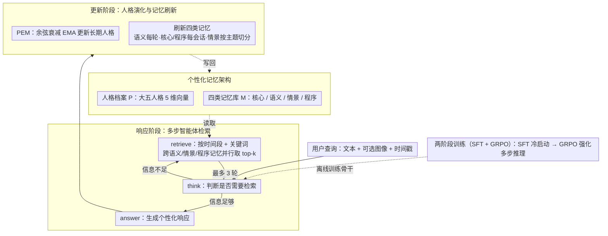

# PersonaVLM: Long-Term Personalized Multimodal LLMs

**会议**: CVPR 2026  
**arXiv**: [2604.13074](https://arxiv.org/abs/2604.13074)  
**代码**: [项目主页](https://PersonaVLM.github.io)  
**领域**: 多模态VLM  
**关键词**: 个性化, 长期记忆, 多模态助手, 大五人格, 智能体框架

## 一句话总结
本文提出 PersonaVLM，一个面向长期个性化的多模态智能体框架，通过主动记忆管理（四类记忆数据库）、多步推理检索和动量式人格演化机制，将通用 MLLM 转化为能适应用户偏好变化的个性化助手，在 128K 上下文下超越 GPT-4o 5.2%。

## 研究背景与动机

1. **领域现状**：多模态大语言模型正被数百万用户用作助手、创作伙伴和伴侣。用户期望正从通用问题解决转向个性化、有同理心的长期体验。现有个性化方法分为三类：基于适配的（Yo'LLaVA, MyVLM 等微调方法）、基于增强的（RAP 等检索方法）和基于对齐的（ALIGNXPERT, PAS 等偏好方法）。
2. **现有痛点**：适配方法需要为每个新概念微调，无法捕捉偏好演变；增强方法使用预定义数据库，缺乏主动管理和更新机制；对齐方法假设静态用户特征，无法适应随时间变化的人格。所有方法都为静态交互设计，无法处理偏好漂移（如从喜欢雪碧转为可乐）和人格演化。
3. **核心矛盾**：用户的偏好和人格本质上是多样且动态的，但现有方法在模型端使用固定窗口和"一刀切"范式，在用户端无法追踪持续演化的特征。
4. **本文目标**：设计一个统一框架，同时实现三个核心能力——记忆（主动提取和管理多模态记忆）、推理（基于检索的多轮推理）、对齐（根据演化的人格调整输出）。
5. **切入角度**：借鉴认知科学的记忆分类（核心/语义/情景/程序记忆）和心理学的大五人格模型，构建结构化的个性化记忆架构。
6. **核心 idea**：通过四类记忆数据库提供"知道用户的什么"，通过 PEM 动量更新机制提供"了解用户是什么样的人"，二者协同实现真正的长期个性化。

## 方法详解

### 整体框架
PersonaVLM 想解决的是：通用 MLLM 把每个用户都当成同一个陌生人，记不住你说过什么、也察觉不到你的喜好在变。它以 Qwen2.5-VL-7B 为骨干，在模型外面挂一套个性化记忆架构——一份大五人格档案加上四类记忆数据库，再让模型围绕这套外部存储循环运转。每来一轮对话都走两个阶段：响应阶段先从记忆里检索相关片段、推理后生成贴合用户的回答；更新阶段再回看这轮交互，把新出现的事实写进记忆、把人格向量往用户最新的表现上挪一点。这样"知道用户的什么"由记忆库承载、"用户是什么样的人"由人格档案承载，两者随交互不断刷新，模型本身的权重则在 SFT + GRPO 两阶段训练后固定下来。

### 关键设计

**1. 个性化记忆架构：把"用户画像"拆成可增删改查的四类记忆**

针对的痛点是旧方法要么用固定窗口、要么用预定义且不更新的数据库，存不下一个会随时间长大的用户画像。PersonaVLM 把画像拆成两块：一份人格档案 $\mathcal{P}$（大五维度的定量向量，开放性、尽责性、外向性、宜人性、神经质各 1–5 分），和一套多类型记忆库 $\mathcal{M}$。记忆库借认知科学的分类切成四种——核心记忆存基本属性（如姓名、职业，仅保留最新版本）、语义记忆存与具体事件无关的抽象知识（实体、关系、多模态概念）、情景记忆存带时间戳的原子事件（含摘要、对话轮次、关键词）、程序记忆存计划/目标/习惯行为。四类都支持 CRUD 操作：情景和语义记忆按时间线追加存储，核心和程序记忆则只留最新一版。这样划分的好处是覆盖了从"用户是谁"到"用户做过什么"再到"用户习惯什么"的完整光谱，而不是把所有信息塞进一个无结构的长文本里——后者在 128K 上下文下检索效率反而更低。

**2. 响应阶段：多步智能体检索——让模型自己决定要不要查、查什么、查哪段**

用户的查询往往高度依赖上下文、还带指代（"上次聊的那个东西"），直接做一次语义检索很容易抓偏；像"今天早上"这类时间线索，单纯改写 query 也照顾不到。响应阶段于是把"取记忆"做成模型与记忆系统之间的多轮智能体交互：每轮模型先拿到指令、短期上下文和一份合并档案（核心记忆 + 人格），输出一段推理和一个 `action`；若判断信息不足，就按预定义模板吐出检索条件——`time period`（时间段）和 `keywords`（关键词）。智能体据此先把记忆按时间段圈定，再到语义、情景、程序三类记忆里并行检索、各取 top-$k$ 回填给模型，进入下一轮推理；如此迭代直到模型输出最终响应 $\mathcal{R}_m$（每条轨迹最多 3 次检索）。这套设计的价值在于让模型不只决定"查什么"，还决定"要不要查、从什么时候查"——比固定窗口或一次性语义检索都更精准、更省 token。

**3. 更新阶段：人格演化（PEM）与记忆刷新——空闲期把这轮交互沉淀回画像**

响应生成后、用户空闲时，更新阶段自动回看这轮交互 $U(\mathcal{Q}_m, \mathcal{R}_m, \mathcal{M}_{m-1})$，做两件事。其一是人格演化机制（PEM）：静态人格假设处理不了"用户一开始表现外向、聊久了又流露内向"这种渐变。PEM 维护一个长期人格向量 $\mathbf{p} \in \mathbb{R}^5$，每轮先从当前查询推断一个瞬时人格 $\mathbf{p}'_m$，再用指数移动平均把它融进长期向量：

$$\mathbf{p}_m \leftarrow \lambda \cdot \mathbf{p}_{m-1} + (1-\lambda) \cdot \mathbf{p}'_m$$

关键不在 EMA 本身，而在 $\lambda$ 走余弦衰减调度：对话早期 $\lambda$ 小，新观测权重大、人格快速适应；交互攒多了之后 $\lambda$ 增大，长期画像权重大、不再被单轮波动带偏。这把"冷启动多学、稳定后少动"的直觉写进了调度曲线，省去了手调学习率；更新后的数值向量再被翻译成一段文字描述，供下一轮响应阶段当条件。其二是按类型刷新四类记忆，各有各的节奏：语义记忆每轮都抽取（用户偏好、多模态概念、显式记忆请求，带时间戳和关键词存下）；核心与程序记忆在每个会话结束时，由智能体分析整段对话做自动 CRUD；情景记忆则把对话按主题切成片段，每条含摘要、关键词和涉及的对话轮次。

**4. 两阶段训练（SFT + GRPO）：先学会管记忆，再学会策略性地检索**

仅靠监督微调，模型学得会记忆的读写格式，却学不会"该不该查、查什么、从哪个时间段查"这类决策。所以训练分两步：SFT 阶段用 78K 合成样本打底，灌进两类能力——记忆机制（人格推断 + 四类记忆的 CRUD）和带完整多步推理轨迹的 QA，给后续 RL 一个靠谱的冷启动。RL 阶段再用 GRPO 强化多轮推理，强制输出遵循 `<think>` → `<retrieve>` / `<answer>` 的结构（正是响应阶段那套检索决策的显式落地），让模型在思考后明确选择继续检索还是直接作答。奖励函数

$$r_i = f_{\text{acc}} \cdot f_{\text{cons}} + 0.5 \cdot f_{\text{format}}$$

把准确性 $f_{\text{acc}}$ 与推理-答案一致性 $f_{\text{cons}}$ 相乘（两者都好才得高分），再加半权的格式合规项 $f_{\text{format}}$；其中 $f_{\text{acc}}$、$f_{\text{cons}}$ 由 Qwen3-30B-A3B 充当 LLM 评判器零样本打分。训练数据由 PersonaHub 采样 500 个用户画像、模拟出 30K+ 长期多模态交互，正好补上个性化训练数据稀缺的缺口。

### 一个完整示例：偏好从雪碧漂移到可乐

> ⚠️ 下面是按论文描述的机制构造的示意流程，具体数值为说明用途，**以原文为准**。

设某用户早期多次表示喜欢雪碧，情景记忆里已积累若干"点了雪碧"的事件，核心记忆中"偏好饮料=雪碧"。某轮用户发来一张可乐图并说"最近改喝这个了"。**响应阶段**：模型先 `<think>` 判断需要个性化信息，发出 `<retrieve>` 去情景记忆按关键词"饮料/雪碧"拉回历史事件，发现旧偏好与当前图文冲突，于是 `<answer>` 给出贴合"口味在变"的回应（最多允许 3 次检索来定位证据）。**更新阶段**：模型分析这轮交互，对核心记忆执行 update——把"偏好饮料"从雪碧改写为可乐，同时在情景记忆里 append 一条新事件；人格那边推断这轮的瞬时向量 $\mathbf{p}'_m$（比如"开放性"略升），按当前 $\lambda$ 融进长期 $\mathbf{p}_m$。因为此时交互已积累较多、$\lambda$ 偏大，这次单轮变化只让人格小幅移动，画像保持稳定而非被一张图带跑。下一轮再问饮料时，检索到的就是更新后的可乐偏好。

### 损失函数 / 训练策略
SFT 使用标准交叉熵损失。GRPO 使用组内标准化的优势函数，奖励中的准确性与一致性分数由 Qwen3-30B-A3B 充当 LLM 评判器给出；每条推理轨迹的检索尝试上限为 3 次。

## 实验关键数据

### 主实验

**Persona-MME 基准（128K 上下文）**：

| 模型 | Overall | Memory | Intent | Preference | Behavior | Growth |
|------|---------|--------|--------|------------|----------|--------|
| GPT-4o | 72.35% | 86.99 | 83.87 | 63.12 | 57.14 | 73.87 |
| Qwen2.5-VL-7B (基线) | 64.84% | 66.13 | 66.85 | 59.75 | 59.24 | 70.69 |
| **PersonaVLM** | **77.5%** | — | — | — | — | — |

**对比 GPT-4o**：

| 基准 | PersonaVLM | GPT-4o | 提升 |
|------|-----------|--------|------|
| Persona-MME (128K) | 77.5% | 72.35% | +5.2% |
| PERSONAMEM (128K) | ~49% | 39.20% | +9.8% |

### 消融实验

| 配置 | Persona-MME | 说明 |
|------|------------|------|
| PersonaVLM (SFT+RL) | 77.5% | 完整方法 |
| 仅 SFT | ~72% | RL 提升约 5% |
| 无 PEM | ~73% | 人格演化机制贡献约 4% |
| Full context (无 RAG) | 较低 | 长上下文下信息利用效率低 |
| RAG 模式 | 较高 | 结构化检索优于直接长上下文 |

### 关键发现
- **7B 模型超越 GPT-4o**：PersonaVLM 在 Persona-MME 和 PERSONAMEM 上分别超过 GPT-4o 5.2% 和 9.8%，证明了专门化训练对个性化的价值
- **128K 上下文下优势更大**：长期交互积累更多记忆，结构化记忆架构的优势更加显著
- **RL 对推理策略至关重要**：GRPO 训练让模型学会何时检索和如何选择推理路径

## 亮点与洞察
- **记忆架构的认知科学灵感**非常有说服力：四类记忆（核心/语义/情景/程序）直接映射到人类认知中的记忆分类，设计合理且功能互补
- **PEM 的余弦衰减设计**巧妙地解决了"初始快速学习 vs 长期稳定"的矛盾：不需要手动调整学习率，自然适应交互生命周期
- **数据合成流水线**是一个被低估的贡献：500 个用户画像、30K+ 多模态交互的合成数据集解决了个性化训练数据稀缺的核心问题

## 局限与展望
- 人格建模基于大五模型，可能无法覆盖所有文化和个体差异
- 合成训练数据与真实用户交互可能存在分布差异
- 仅在 Qwen2.5-VL-7B 上验证，未测试更大规模模型
- 记忆的 CRUD 操作可能引入错误（如错误删除重要记忆），缺乏纠错机制
- 未来可探索隐私保护的个性化（联邦学习）和多用户共享记忆

## 相关工作与启发
- **vs Yo'LLaVA/MyVLM**: 这些方法通过微调嵌入学习用户特定视觉概念，但无法管理和更新记忆。PersonaVLM 的智能体架构支持动态 CRUD 操作
- **vs MemGPT**: MemGPT 提供了类操作系统的记忆管理，但仅限文本且依赖商用模型。PersonaVLM 自包含、支持多模态、且有明确的个性化目标

## 评分
- 新颖性: ⭐⭐⭐⭐⭐ 首个面向长期动态个性化的多模态智能体框架，PEM 设计原创
- 实验充分度: ⭐⭐⭐⭐⭐ 自建基准 Persona-MME，10+ 模型对比，多维度消融
- 写作质量: ⭐⭐⭐⭐ 框架描述全面，但组件较多需要仔细跟读
- 价值: ⭐⭐⭐⭐⭐ 为 MLLM 个性化开辟了长期动态交互的新方向

<!-- RELATED:START -->

## 相关论文

- [\[CVPR 2026\] Explore with Long-term Memory: A Benchmark and Multimodal LLM-based Reinforcement Learning Framework for Embodied Exploration](explore_with_long-term_memory_a_benchmark_and_multimodal_llm-based_reinforcement.md)
- [\[CVPR 2026\] Customized Visual Storytelling with Unified Multimodal LLMs](customized_visual_storytelling_with_unified_multimodal_llms.md)
- [\[AAAI 2026\] URaG: Unified Retrieval and Generation in Multimodal LLMs for Efficient Long Document Understanding](../../AAAI2026/multimodal_vlm/urag_unified_retrieval_and_generation_in_multimodal_llms_for.md)
- [\[CVPR 2026\] TimeLens: Rethinking Video Temporal Grounding with Multimodal LLMs](timelens_rethinking_video_temporal_grounding_with_multimodal_llms.md)
- [\[CVPR 2026\] Dictionary-Aligned Concept Control for Safeguarding Multimodal LLMs](dictionary_aligned_concept_control_for_safeguarding_multimodal_llms.md)

<!-- RELATED:END -->
