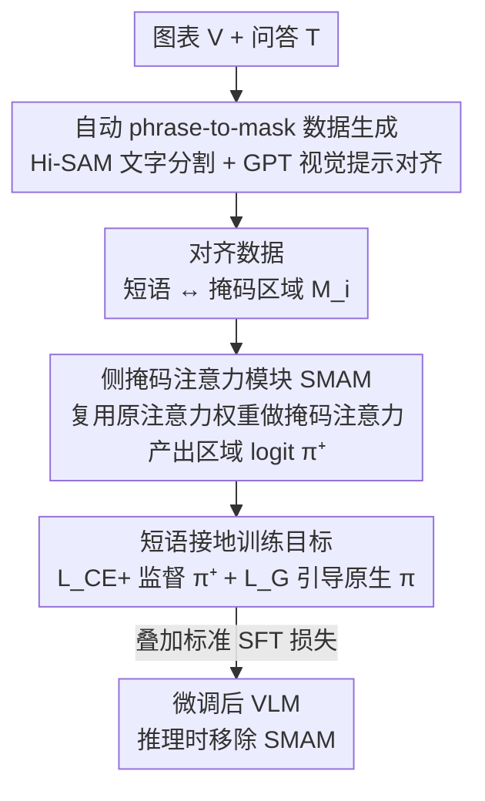

# Phrase-Grounding-Aware Supervised Fine-Tuning for Chart Recognition via Side-Masked Attention

**会议**: CVPR 2026  
**论文**: [CVF Open Access](https://openaccess.thecvf.com/content/CVPR2026/html/Ito_Phrase-Grounding-Aware_Supervised_Fine-Tuning_for_Chart_Recognition_via_Side-Masked_Attention_CVPR_2026_paper.html)  
**代码**: https://github.com/jaxa/PGA-SFT （论文称即将开源）  
**领域**: 多模态VLM  
**关键词**: 图表识别, 短语定位, 监督微调, 掩码注意力, logit 贡献

## 一句话总结
在 VLM 微调阶段插入一个无新增参数的"侧掩码注意力模块"(SMAM)，把答案里每个短语对齐到图表上的文字区域、监督该区域的 logit 贡献，从而让模型在做图表问答时把生成"接地"到正确的视觉区域，在 ChartQA / C2T 等多个基准上稳定超过标准 SFT。

## 研究背景与动机
**领域现状**：图表识别（bar/line chart 上的 VQA）现在的主流做法是把表格抽取、问答等多个相关任务统一进一个框架，对 VLM 做监督微调（SFT）；增强手段大多是"喂更多文本信息"——给中间推理链（CoT）、用表格抽取任务做预训练等。

**现有痛点**：这些做法都只在**文本侧**做文章，不利用显式的**空间标注**。另一条线（带 LLM 的目标检测）已经证明：在 SFT 之外联合学习 phrase grounding（把文本短语和图像区域对齐）不仅提升检测，还能改善细粒度生成质量。但把 phrase grounding 搬到图表领域几乎没人做，因为**缺少短语-区域对齐的数据集**——ChartQA 这类只给 bounding box、不给短语级对应。

**核心矛盾**：另一类"换更强视觉编码器"的图表 VLM 路线虽然有效，但需要重新预训练 vision-language connector，**算力和人力代价高**；而现实场景里图表领域数据往往很少。于是真正需要的是：**只在 SFT 阶段、不做额外预训练**就能把空间接地塞进模型的方法。

**切入角度**：作者借用 Ferrando 等人提出的 **logit contribution** 分析——量化每个输入 token 对输出 token logit 的直接贡献。他们把这套原本针对文本 token 的工具**外推到视觉 patch token**，先做了个观察：现有 VLM 在预测某个答案 token 时，高贡献的视觉区域往往**已经**落在相关图表区域上，说明模型已隐含某种 grounding（图 1 热力图）。

**核心 idea**：既然模型已隐含 grounding，那就**显式监督**它——把短语对齐区域的 logit 贡献抽出来、监督它、并用它当"参考信号"去引导模型原生的输出概率，让接地更忠实。整套机制只在微调时启用，推理时完全移除，因此可直接套到各种预训练 VLM。

## 方法详解

### 整体框架
方法分两大块：先用一条**自动数据生成 pipeline** 给现有图表数据集补上"短语→掩码区域"的对齐标注；再用**SMAM**（Side-Masked Attention Module）在微调时对这些对齐 token 施加 grounding 约束。输入是一张图表 $V$ 和一组问答文本 $T$，pipeline 产出"答案中的每个短语 ↔ 图表上对应文字区域掩码 $M_i$"的对齐数据；训练时 SMAM 接在每层 transformer 注意力块旁边，对掩码内 token 做一次辅助前向，产出一个额外 logit，用两个 grounding 损失把它和标准 SFT 目标一起优化。关键是：掩码输入和 SMAM **只在训练时存在**，推理时整个拿掉，模型退回原始架构。

### 关键设计

**1. 自动短语-到-掩码数据生成：把"缺对齐数据"这个拦路石绕过去**

phrase grounding 在图表领域做不起来的根本障碍是没有短语级对齐标注，这个设计就是用现成工具拼出一条自动标注流水线。给定图像 $V$ 和问答对 $T$，先用 Hi-SAM（一个为文字分割微调过的 SAM 变体）抽出一组**文字区域掩码** $M=\{M_i\}$。作者特意只分割文字区域、不去分割坐标轴/柱子/折线这类语义元素——因为图表里这些元素粒度差异极大，连 GPT 都难以在非自然图像上稳定分割；而"短语只有在其确切文字形态出现在图中时才算被接地"，所以文字区域能给出**稳定**的对应。接着把每个掩码以 alpha 混合方式贴回图像并打上唯一标号，得到 $V_\alpha$，再喂给 GPT-o4-mini，利用其视觉提示能力让它在 $T$ 中把对应每个标号区域的短语用 `<MARK ID>...</MARK ID>` 包起来，得到带标记文本 $T'$，从而拿到显式的短语-掩码对齐。注意 $V_\alpha$ 和 $T'$ 只用于生成阶段，真正训练时模型看到的还是原始的 $V$ 和 $T$。

**2. Side-Masked Attention Module (SMAM)：零新增参数地抽出"区域 logit"作为接地参考**

有了对齐数据，怎么让模型"盯着"正确区域？作者不想引入新模块或新增参数，于是设计 SMAM——在每层 transformer 的原注意力块**旁边**并联一条辅助通路。对一个带掩码 $M_t$ 的 token $x_t^{l-1}$，SMAM 直接**复用原注意力块算好的**注意力权重 $A^l$、value 状态 $V^l$、输出投影 $W_O^l$，做一次 Mask2Former 式的掩码注意力：

$$z^{l,+}_t = W_O^l\Big(\sum\nolimits_{j=1}^{t} \mathrm{softmax}(\hat{M}_t + A^l)_{t,j}\,V^l_j\Big)$$

其中把空间掩码 $M_t$ 扩展成注意力掩码 $\hat{M}_t\in\{0,-\infty\}$：对语言 token 和掩码内的视觉 patch 赋 0、对掩码外视觉 patch 赋 $-\infty$，于是注意力被限制在"语言 token + 区域内视觉 patch"。保留语言 token 很关键——输出 token 不只依赖视觉 patch 还依赖语言上下文，且保留它能让 $z^{l,+}_t$ 与原 LLM 的表示对齐，从而可以直接被模型**原参数**继续处理。把各层 $z^{l,+}_t$ 沿残差连接展开累加得到 $x_t^{L,+}$，再过原归一化层 $L_N$ 和逆嵌入矩阵 $U$、softmax，就得到 SMAM 在区域内算出的输出概率 $\pi^+_{w_t}$。整条通路不引入任何可学习参数（全是复用），可端到端训练；推理时整体移除。论文同时定义把视觉 token 的 0/$-\infty$ 翻转得到 $z^{l,-}_t$、$\pi^-_{w_t}$，但这个反掩码版本只用于消融与评估。

**3. 双项短语接地损失：监督区域概率 + 用它当"接地参考"拉高原生预测**

光有 $\pi^+_{w_t}$ 还不够，要把它变成训练信号。第一项是交叉熵 $\mathcal{L}_{\mathrm{CE}^+}=-\log(\pi^+_{w_t})$，直接监督区域内算出的概率对准正确答案 token $w_t$。第二项 $\mathcal{L}_{\mathrm G}$ 才是核心——它不去单独优化区域概率，而是把 $\pi^+_{w_t}$ 当成一个"来自短语区域的局部接地证据"，去引导模型**原生**输出概率 $\pi_{w_t}$：

$$\mathcal{L}_{\mathrm G} = -\log\sigma\big(\beta(\log\pi_{w_t}-\log\pi^+_{w_t})\big),\quad \beta=0.1$$

这个形式借自 DPO，但被重新解读为对**同一个 token 的两条计算路径**的比较：VLM 原生概率 $\pi_{w_t}$ 与 SMAM 区域概率 $\pi^+_{w_t}$。目标是鼓励 $\log\pi_{w_t}$ 超过 $\log\pi^+_{w_t}$——也就是让模型在用上区域内关键证据的同时，还能借助图像其余上下文把预测做得**比只看区域更好**。最终加到标准 SFT 上的辅助损失为

$$\mathcal{L}_{\mathrm{aux}} = \sum\nolimits_{x_t\in\mathcal{X}}\big(\gamma\mathcal{L}_{\mathrm G} + \alpha\mathcal{L}_{\mathrm{CE}^+}\big)$$

其中 $\mathcal{X}$ 是与掩码对齐的 token 集合，$\alpha=0.1$ 固定（$\mathcal{L}_{\mathrm{CE}^+}$ 兼作正则，因为 $\mathcal{L}_{\mathrm G}$ 会压低 $\pi^+_{w_t}$），$\gamma$ 平衡两项、按模型设定（LLaVA 用 2.0、Qwen 用 0.5）。$\mathcal{L}_{\mathrm{aux}}$ 只作用在对齐 token 上，而标准 SFT 目标仍覆盖所有答案 token 的全词表。

### 损失函数 / 训练策略
总目标 = 标准 SFT 损失 + $\mathcal{L}_{\mathrm{aux}}$。超参 $\beta=0.1$、$\alpha=0.1$、$\gamma$ 按模型（LLaVA 2.0 / Qwen 0.5）。Qwen 系列每个任务只训 1 个 epoch（多 epoch 反而掉点），LLaVA 训多个 epoch；ChartQA 全局 batch=96、其余任务=48，且全程固定 batch 以保证与 baseline 公平对比（作者发现 batch 大小会影响性能）。

## 实验关键数据

### 主实验
在 C2T（表格抽取，F1）和 ChartQA（Relaxed Accuracy）上对比标准 SFT、文字定位 baseline（TL.，输出 `<box>...` 坐标）和分割 baseline（Seg.，GLaMM）。Ours 在多种 VLM 上平均都优于各 baseline：

| 模型 | 方法 | C2T Avg (F1) | ChartQA Avg (RA) | ChartQA Hum. |
|------|------|------|------|------|
| LLaVA-7B | SFT | 72.4 | 50.2 | 36.5 |
| LLaVA-7B | TL. | 36.0 | 50.9 | 37.1 |
| LLaVA-7B | **Ours** | **74.1** | **51.9** | **38.6** |
| Qwen2.5VL-3B | SFT | 91.9 | 82.0 | 69.5 |
| Qwen2.5VL-3B | **Ours** | **93.2** | **83.0** | **71.1** |
| Qwen2.5VL-7B | SFT | 93.3 | 85.6 | 76.2 |
| Qwen2.5VL-7B | **Ours** | 93.4* | **86.5** | **90.2 (Hum F1)** |

> ⚠️ Qwen7B 的 C2T Avg 在原表中部分数字被换行截断，以原文 Tab. 2 为准；表中"90.2"为 Qwen7B-Ours 在 C2T Hum. 的 F1。专用模型 UniChart、ChartInstruct 用 Ours 也分别从 SFT 的 66.2/58.5 提到 67.7/60.4（ChartQA Avg）。

Seg. 表现最差（在仅约 25k 样本的 SFT 设置下额外训练分割模型难优化，且自然图→图表存在域差）；TL. 在只需定位单个区域的 ChartQA 上与 SFT 持平，但在需要定位多目标的 C2T 上明显退化（LLaVA 尤甚）。

### QA-CoT 与定位精度
| 模型 | 方法 | QA-CoT Hum. | logit 定位 Acc (Aug./Hum.) |
|------|------|------|------|
| Qwen3B | SFT | 78.9 | 62.7 / 57.9 |
| Qwen3B | Ours | **79.9** | **64.5 / 60.7** |
| Qwen7B | SFT | 82.5 | 54.4 / 53.0 |
| Qwen7B | Ours | **83.8** | **57.5 / 57.0** |

Tab. 4 用"热力图峰值是否落在 GT 掩码内"算 Acc、用热力图与掩码的对应算 AUC，Ours 在每个模型内都同时提升两者，说明定位变准与生成变好是相关的。

### 消融实验
ChartQA 上对两损失项及系数 $\gamma,\alpha$ 做消融（Qwen7B / LLaVA Hum. 列）：

| 配置 | $\mathcal{L}_{\mathrm G}$ | $\mathcal{L}_{\mathrm{CE}^+}$ | Qwen7B Hum. | LLaVA Hum. |
|------|------|------|------|------|
| SFT | – | – | 76.2 | 36.5 |
| #1 | – | ✓ | 76.8 | 36.2 |
| #2/#3（α=0） | ✓ | – | 76.4 | 37.0 |
| #4 (γ=0.5,α=0.1) | ✓ | ✓ | **77.1** | 37.8 |
| #5 (γ=2.0,α=0.1) | ✓ | ✓ | 76.7 | **38.6** |

### 关键发现
- 只用 $\mathcal{L}_{\mathrm{CE}^+}$（#1）或令 $\alpha=0$（#2/#3）增益都很有限，**两项必须同时启用**且 $\gamma$ 平衡得当才有效。
- 最优 $\gamma$ 随模型不同：LLaVA 偏好大 $\gamma$（2.0）、Qwen 偏好小 $\gamma$（0.5），作者把这归因于 LLaVA grounding 更"表层"、需要更强的接地约束。
- 提升集中在 ChartQA 的 **Hum.（多步推理）split**——这部分更难、留有改进空间；Aug. split 在 SFT 下已接近饱和，增益较小。
- 方法在 C2T 这种"标注的是柱/饼/折线等非文字组件"的协议下也有效，说明它不局限于文字区域标注。

## 亮点与洞察
- **零新增参数的辅助通路**：SMAM 不引入任何可学习参数，全靠复用原注意力块的 $A^l/V^l/W_O^l$ 和逆嵌入矩阵，因此能端到端训练、推理时干净移除——这是"只在 SFT 阶段加 grounding、可移植到任意预训练 VLM"承诺能成立的工程关键。
- **把 logit-contribution 从文本外推到视觉 patch**：先用热力图证明"模型已隐含 grounding"，再据此设计显式监督，动机链条扎实而非拍脑袋。
- **DPO 形式的复用很巧**：原本比较两条输出序列优劣的相对约束，被改造成比较"同一 token 的两条计算路径"，让原生预测被区域证据"拉一把"又不被锁死在区域内，这种 trick 可迁移到其他"想用局部证据引导全局预测"的任务。

## 局限与展望
- 数据生成只对齐**文字区域**，对没有显式文字的视觉元素（坐标轴刻度、纯图形趋势）覆盖有限；作者承认连 GPT 都难稳定分割这些元素，故主动回避，但这也限制了能接地的短语类型。
- 增益在已接近饱和的 Aug. split 上较小，方法的收益高度依赖任务"还有多少改进空间"。
- 训练阶段每个 token 要多走一次 SMAM 前向、还要算 logit 贡献，带来额外训练开销；作者也因算力原因放弃了 Ferrando 原文中能进一步提升的 ALTI 组件。
- $\gamma$ 需按模型逐一调（LLaVA 2.0 vs Qwen 0.5），缺少自动选取策略。

## 相关工作与启发
- **vs 文本增强类图表 SFT（CoT 推理链、表格抽取预训练）**：它们只在文本侧加信息做"间接 grounding"，本文直接用空间标注做显式短语-区域接地，且可叠加在 CoT 数据之上。
- **vs 文字定位 / bounding-box 输出（mPLUG-DocOwl、RefChartQA）**：TL. 要让模型生成坐标 token、拉长输出，多目标（C2T）时难度陡增而退化；SMAM 不产生坐标 token，只对对齐 token 加监督。
- **vs 分割式 grounding（GLaMM/SAM 接入）**：Seg. 需额外训练分割模型，在小样本 SFT + 图表域差下难优化；SMAM 无额外模块、复用现有权重。
- **vs 换强视觉编码器的图表 VLM**：那条路要重训 vision-language connector、代价高；本文坚持只在 SFT 阶段做文章，更适配真实场景的小数据。

## 评分
- 新颖性: ⭐⭐⭐⭐ 把 logit-contribution 外推到视觉 patch 并设计零参数 SMAM，将 phrase grounding 首次系统引入图表识别 SFT。
- 实验充分度: ⭐⭐⭐⭐ 覆盖 5 个 VLM、3 类任务、定位精度评估与损失项消融，但部分增益偏小、缺更大规模数据验证。
- 写作质量: ⭐⭐⭐⭐ 动机链条清晰、公式完整；表格在 CVF 文本版有换行截断需对照原文。
- 价值: ⭐⭐⭐⭐ 提供一条"不重训只微调即可加空间接地"的可移植方案，对数据稀缺的图表领域实用。

<!-- RELATED:START -->

## 相关论文

- [\[CVPR 2026\] TRivia: Self-supervised Fine-tuning of Vision-Language Models for Table Recognition](trivia_self-supervised_fine-tuning_of_vision-language_models_for_table_recogniti.md)
- [\[CVPR 2026\] CoVFT: Context-aware Visual Fine-tuning for Multimodal Large Language Models](covft_context-aware_visual_fine-tuning_for_multimodal_large_language_models.md)
- [\[CVPR 2026\] Concept-wise Attention for Fine-grained Concept Bottleneck Models](coat_cbm_concept_wise_attention.md)
- [\[CVPR 2026\] SketchVL: Policy Optimization via Fine-Grained Credit Assignment for Chart Understanding and More](sketchvl_policy_optimization_via_fine-grained_credit_assignment_for_chart_unders.md)
- [\[CVPR 2026\] Chart-FR1: Visual Focus-Driven Fine-Grained Reasoning on Dense Charts](chart-fr1_visual_focus-driven_fine-grained_reasoning_on_dense_charts.md)

<!-- RELATED:END -->
