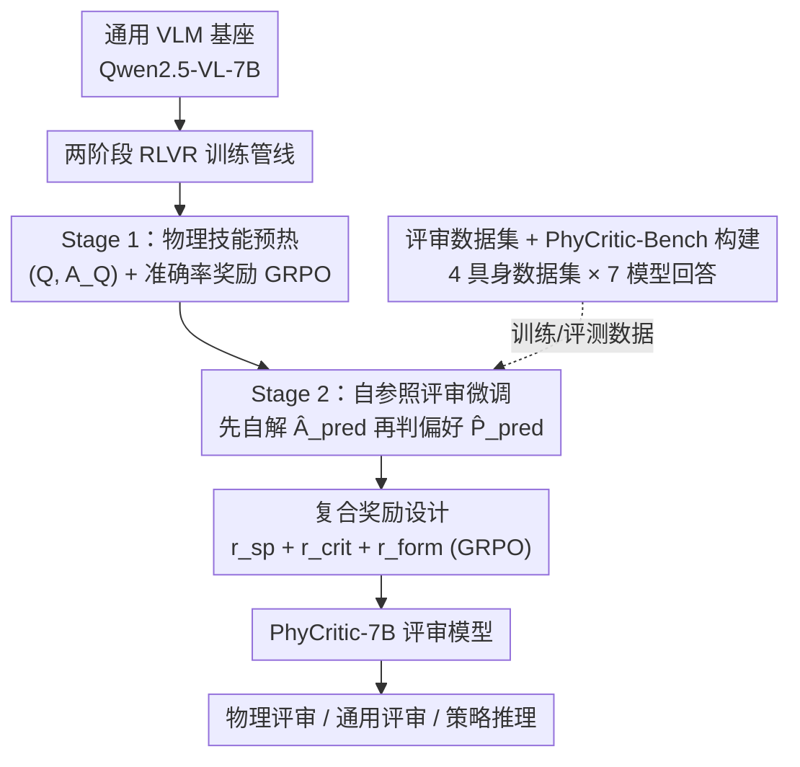

# PhyCritic: Multimodal Critic Models for Physical AI

**会议**: CVPR 2026  
**论文**: [CVF Open Access](https://openaccess.thecvf.com/content/CVPR2026/html/Xiong_PhyCritic_Multimodal_Critic_Models_for_Physical_AI_CVPR_2026_paper.html)  
**代码**: 项目页 https://research.nvidia.com/labs/lpr/phycritic/  
**领域**: 多模态VLM  
**关键词**: 多模态评审模型, 物理AI, RLVR, GRPO, 自参照评审

## 一句话总结
PhyCritic 用「物理技能预热 + 自参照评审微调」两阶段 RLVR 管线，把一个 7B 多模态模型训成专评物理 AI（感知/因果/规划）任务的评审模型——核心是让评审模型「先自己解题、再拿自解当参照去判两个回答谁更好」，在新建的 PhyCritic-Bench 上拿到开源 7B/8B 最佳，同时作为策略模型也提升了物理推理能力。

## 研究背景与动机

**领域现状**：随着多模态大模型（MLLM）爆发，评审/裁判模型（critic / judge model）成了开放式评测和偏好对齐的关键组件——它要对模型生成的回答给出成对偏好、数值打分和文字解释。但现有评审模型几乎都训练在通用视觉域（看图说话、图像问答、STEM 推理）。

**现有痛点**：物理 AI 任务（机器人操作、具身交互、自动驾驶）的评测和通用域根本不是一回事：评审模型必须判断推理是否因果有效、视觉解释是否符合真实物理配置、最终答案是否遵守时间/空间/动力学约束。作者指出现有评审模型有三个硬伤——（1）缺乏物理意识，常常分不清「视觉上连贯但物理上不可能」的推理；（2）训练数据偏通用，缺少操作、可供性（affordance）、具身 3D 交互场景；（3）判决不锚定到自己对问题的物理理解，导致结论不一致或流于表面。

**核心矛盾**：评审模型的判决质量，受限于它自身对物理问题的理解深度——一个连题都解不对的模型，凭什么去裁决别人的回答对不对？现有评审模型直接「看两个回答选一个」，跳过了自己求解这一步，于是容易被表面措辞带偏。

**本文目标**：构造一类专为物理 AI 设计的多模态评审模型，要求其判决是**有依据的（grounded）、稳定的、物理正确的**；同时配套一个能严格衡量物理评审能力的基准。

**切入角度**：作者类比「专家人类评委」——评判别人之前，先自己把题解一遍。这个直觉指向「自参照」机制：让评审模型先生成自己的推理和预测，再把这个自预测当作参照去评判候选回答。

**核心 idea**：用「solve before judge（先解题再判决）」的自参照评审，配两阶段 RLVR（先物理技能预热、再评审微调），把评审判决锚定到模型自身的物理理解上。

## 方法详解

### 整体框架
PhyCritic 从一个通用 VLM（Qwen2.5-VL-7B-Instruct）出发，跑两阶段强化微调。**Stage 1（物理技能预热）**用只含 $(Q, A_Q)$ 的可验证物理 QA 数据、配准确率奖励做标准 GRPO，把基座模型的物理感知与推理能力先拉起来——这是为复杂评审任务打地基。**Stage 2（自参照评审微调）**用完整的 $(Q, L_A, L_B, A_Q, P)$ 元组训练：模型被要求**先对问题 $Q$ 生成自己的内部预测 $\hat{A}_{pred}$，再扮演评审、显式地以这个自预测为参照去判断候选回答对 $(L_A, L_B)$ 的偏好** $\hat{P}_{pred}$，用复合奖励（自预测奖励 + 评审奖励 + 格式奖励）经 GRPO 优化。训练数据来自四个机器人/具身数据集的视频 + Cosmos-Reason1 的物理 QA，配上七个不同档次模型的回答。

其中训练元组定义为 $(Q, L_A, L_B, A_Q, P)$：$Q$ 是含视觉输入的多模态提示，$L_A/L_B$ 是两个候选回答（评审对象），$A_Q$ 是问题真值答案，$P\in\{A,B\}$ 是哪个回答更优的二元偏好标签。

### 关键设计

**1. 两阶段 RLVR 训练管线：先把物理底子打牢，再学评审**

针对痛点「现有评审模型缺物理意识、数据偏通用」，作者不直接上评审任务，而是先做一个 **Stage 1 物理技能预热**：只用 $(Q, A_Q)$ 形式的可验证物理 QA，奖励就是答案是否正确 $r = \mathbb{I}(\hat{A}_{pred}(Q) = A_Q)$，跑标准 GRPO 把模型对齐到「能产出准确可靠的物理预测 $\hat{A}_{pred}$」。这一步的意义在消融里很清楚：Stage 1 单独能把物理推理（CosmosReason1-Bench）提 +7.5，但对评审能力只提 +2.0——它不是来直接提分的，而是给 Stage 2 提供一个「会解题」的起点。然后 **Stage 2** 才在这个基础上学评审。作者强调全管线只需 $80+300$ 个 RL step、共 4,058 条训练样本，相比依赖数百万条监督蒸馏轨迹的路线（如 Cosmos-Reason1）数据效率高得多。

**2. 自参照评审微调：判决前先自己解一遍，把判决锚定到自解上**

这是全文核心，针对「评审不锚定自身理解、结论流于表面」。Stage 2 让策略 $\pi_\theta$ 并发完成两件事：先做**自预测**——对提示 $Q$ 生成自己的内部推理和答案 $\hat{A}_{pred}$（包在 `<pred_think>` / `<pred>` 里）；再做**偏好判决**——以刚才的自预测为显式参照，对 $(Q, L_A, L_B)$ 输出偏好 $\hat{P}_{pred}$（推理包在 `<think>`、结论用 `\boxed{}`）。评审提示模板（论文 Tab.1）明确要求模型「先生成自己的推理和答案，再用自解作为参照点逐条比对两个回答」。作者用卡方检验验证了这条因果链：模型自答的对错与其下游判决质量强正相关，且自参照微调把这种依赖进一步加强（Stage 1 模型 $\chi^2=51.07$，最终模型 $\chi^2=161.76$，$p$ 值都极小），支撑了「solve before judge」能避免虚假相关和无依据结论的前提。⚠️ 卡方统计量数值以原文为准。

**3. 复合奖励设计：自预测奖励 + 评审奖励 + 格式奖励，用 GRPO 联合优化**

为了同时逼模型「解得对」和「判得准」，总奖励拆成准确率奖励和格式奖励两块：$r_{total} = r_{acc} + \alpha_{form}\cdot r_{form}$。其中准确率奖励又由两部分加权而成：

$$r_{acc} = \alpha_{sp}\, r_{sp} + \alpha_{crit}\, r_{crit}$$

自预测奖励 $r_{sp} = \mathbb{I}(\hat{A}_{pred} = A_Q)$ 检验自解是否对，逼模型先成为一个可靠的解题者；评审奖励 $r_{crit} = \mathbb{I}(\hat{P}_{pred}(Q, L_A, L_B) = P)$ 检验判决是否命中真值偏好。格式奖励 $r_{form}$ 是阶梯式的：四个标签（`<pred_think>`、`<pred>`、`<think>`、`\boxed{}`）齐全给 1.0，只有 `<think>` 和 `\boxed{}` 给 0.5，否则 0——用来稳住自参照的输出结构。优化算法用 GRPO（源自 DeepSeek-R1）：免去 PPO 的价值网络，靠组内多条采样轨迹算相对优势 $A_o = (r_o - \bar{r})/\mathrm{std}(r)$。实测权重 $\alpha_{sp}=0.2,\ \alpha_{crit}=0.7,\ \alpha_{form}=0.1$，消融显示去掉自参照过程掉 −3.6，去掉 $r_{sp}$ 掉 −2.2，证明自预测奖励和自参照结构都是必要的。

**4. PhyCritic-Bench 与评审训练数据集构建：把物理评审做成可验证的成对偏好**

针对痛点「缺物理 AI 评审数据/基准」，作者两头都自建。**训练集**从 RoboVQA、BridgeData V2、HoloAssist、AgiBot World 四个机器人/具身数据集取视频（含第一/第三人称、抓取/堆叠/折叠/装配等多种操作），问题建在 Cosmos-Reason1 RL 数据集的 800 条高质量物理 QA 上；候选回答采自七个跨档次模型（GPT-4o、Gemini-2.5-Flash、Qwen2.5-VL-72B、InternVL3-38B、Cosmos-Reason1-7B、Video-R1、MiMo-VL-7B），全用 CoT 产出带显式推理的回答；偏好标签用简单的准确率法——GPT-4o 拿真值核对每个回答给二元分（1 选中 / 0 拒绝），配成「一对一错」的回答对，平衡长度与分布后得 3,258 条。**PhyCritic-Bench** 含 225 条评测样本，覆盖机器人（RoboVQA/Bridge/HoloAssist/AgiBot/RoboFail，问题改自 CosmosReason1-Bench）和自动驾驶（LingoQA）两类物理场景，沿用 JudgeBench 流程构造成对偏好元组 $(x, l_a, l_b, p)$，评测指标是评审与真值偏好的一致率 $\mathrm{Acc} = \mathbb{I}(\mathrm{VLM}(q, l_a, l_b) = p)$。

## 实验关键数据

### 主实验
基座 Qwen2.5-VL-7B-Instruct，veRL 框架；预热 80 step、评审微调 300 step，batch 128，lr $1\times10^{-6}$，KL 系数 0.01。下表为评审性能对比（PhyCritic-Bench + 两个通用奖励基准），单位为偏好一致率（%，越高越好）：

| 模型 | PhyCritic-Bench overall | VL-RewardBench overall | Multimodal-RewardBench overall |
|------|------|------|------|
| Gemini-2.5-Pro（闭源） | 78.2 | 74.9 | 85.4 |
| GPT-4o（闭源） | 64.7 | 65.8 | 71.5 |
| Eagle-2.5-8B | 56.0 | 50.2 | 64.4 |
| Qwen2.5-VL-7B（基座） | 51.6 | 53.2 | 64.0 |
| RoboBrain2.0-7B | 54.7 | 42.4 | 50.5 |
| Cosmos-R1-7B | 51.1 | 44.8 | 54.8 |
| **PhyCritic-7B（本文）** | **68.0** | **57.3** | **65.9** |

PhyCritic-7B 在开源 7B/8B 中取得 PhyCritic-Bench 最佳 68.0，超基座 Qwen2.5-VL-7B（+16.4）、Eagle-2.5-8B（+12.0）、RoboBrain2.0（+13.3）、Cosmos-R1（+16.9）；虽只在物理域训练，却在通用域 VL-RewardBench（+4.1）与 Multimodal-RewardBench（+1.9）上也超基座，泛化良好。

作为策略模型，PhyCritic-7B 在 CosmosReason1-Bench 拿到开源最佳 63.9（超 Cosmos-R1-7B +0.9，而后者训练用了数百万条蒸馏轨迹），CV-Bench 取得第二好均值 79.7、最佳 3D 分 83.9，EgoPlanBench2 总体第二（42.3）。

### 消融实验
RL 策略消融（Tab.4，s1=80 step，s2=300 step）与自参照消融（Tab.5）：

| 配置 | PhyCritic-B. overall | CosmosR1-B. overall | VL-Reward. overall | 说明 |
|------|------|------|------|------|
| Qwen2.5-VL-7B（基座） | 51.6 | 54.3 | 53.2 | 起点 |
| 仅 physical RL (s1) | 53.6 | 61.8 | 52.0 | 提推理不提评审 |
| 仅 critic RL (s1+s2) | 62.2 | 57.1 | 54.0 | 直接评审，无物理预热 |
| mixed RL (s1+s2) | 66.7 | 60.2 | 55.5 | 混合 |
| **Two-stage RL（本文）** | **68.0** | **63.9** | **57.3** | 完整管线 |
| w/o 自参照过程 | 64.4 | 62.6 | 56.6 | 评审 −3.6 |
| w/o 自预测奖励 $r_{sp}$ | 65.8 | 63.5 | 56.5 | 评审 −2.2 |

### 关键发现
- **两阶段分工明确且互补**：Stage 1 主提物理推理（CosmosR1-Bench +7.5），评审仅 +2.0；Stage 2 主提评审（PhyCritic-Bench +14.4），还顺带把推理再提 +2.1。光做物理 RL 不做评审 RL，评审分几乎不动。
- **自参照是涨分主力**：去掉自参照过程掉 −3.6，去掉自预测奖励掉 −2.2，两者都不可省。
- **「自解越准、判决越准」有统计支撑**：卡方检验显示自答对错与判决质量强正相关，且自参照微调把这种依赖从 $\chi^2=51.07$ 拉到 $\chi^2=161.76$。
- **数据效率高**：全程 4,058 样本、380 个 RL step，就超过了吃数百万监督轨迹的对手。

## 亮点与洞察
- **「solve before judge」把评审能力锚定到模型自身求解能力**：这是个很可迁移的元思路——评审模型不该是黑箱打分器，先让它自己解一遍、把自解当参照，判决就更稳更有据。可推广到代码评审、数学解答评审等任何「评审者本身也能解题」的场景。
- **用阶梯式格式奖励稳住结构化输出**：四标签全齐 1.0 / 只有两个 0.5 / 否则 0，比硬性二元格式奖励更平滑，给模型一个渐进学会自参照结构的梯度。
- **物理域训练能反哺通用域评审**：只在物理场景训练却在通用奖励基准上也涨分，暗示「物理感知 + 因果 + 规划」的评审训练学到的是更普适的判决能力，而非过拟合物理。
- **评审模型反过来当策略模型也变强**：学会严格评判后，模型自己解物理题也更准，说明评审与生成两种能力在 RLVR 下能互相强化。

## 局限与展望
- 作者承认自参照评审微调虽有效，但（原文 Limitations 段被缓存截断）⚠️ 具体局限表述以原文为准——从方法看，自参照要求模型先能把题解对，对模型本身物理能力下限有依赖，若基座太弱自解全错，自参照反而可能引入噪声。
- 偏好标签靠 GPT-4o 用真值核对自动打，标签质量受 GPT-4o 判断力上限制约；「一对一错」的成对构造也简化了真实评测中两个回答都部分对/都错的复杂情形。
- 基准规模偏小（PhyCritic-Bench 仅 225 样本），且物理场景集中在机器人 + 自动驾驶两类，覆盖面有限。
- 改进方向：把自参照扩到多候选（>2 个回答）打分、引入更细粒度的过程级奖励而非只看最终答案对错、把自动标注换成更可靠的可验证管线。

## 相关工作与启发
- **vs DriveCritic**：DriveCritic 用 LMM 评审自动驾驶里的轨迹对，是物理域评审的早期尝试，但只盯轨迹、不覆盖多样的具身文本回答；PhyCritic 把评审能力拓宽到机器人感知/操作/规划的通用物理 AI 域。
- **vs 通用多模态评审（如 BT 式标量头 / 生成式 judge）**：现有评审多在看图说话、STEM、VQA 等通用域，缺物理意识；PhyCritic 用 RLVR + 自参照专攻物理因果与可供性推理。
- **vs Cosmos-Reason1**：Cosmos-Reason1 靠数百万条监督蒸馏 + RL 做物理推理策略；PhyCritic 只用几千条可验证 QA + 自参照评审信号，数据效率高得多，且既能评审又能当策略。
- **vs 标准 GRPO 直接训评审**：直接 critic RL（无物理预热）只到 62.2，两阶段补上物理底子后到 68.0，说明「先打物理地基」对评审是有效的前置。

## 评分
- 新颖性: ⭐⭐⭐⭐⭐ 「先自解再判决」的自参照评审 + 两阶段 RLVR，把评审质量锚定到模型自身求解能力，思路新且可迁移。
- 实验充分度: ⭐⭐⭐⭐ 评审/推理/通用三类基准 + 完整 RL 策略与自参照消融 + 卡方因果验证，较扎实；但基准规模偏小、场景集中。
- 写作质量: ⭐⭐⭐⭐ 动机—方法—验证链条清晰，奖励/数据集定义到位；部分表格与 Limitations 在缓存中略有截断。
- 价值: ⭐⭐⭐⭐ 给物理 AI 提供了首个专用评审模型 + 基准，数据高效，评审与策略双收益，对具身/驾驶评测实用。

<!-- RELATED:START -->

## 相关论文

- [\[CVPR 2026\] PAI-Bench: A Comprehensive Benchmark for Physical AI](pai-bench_a_comprehensive_benchmark_for_physical_ai.md)
- [\[CVPR 2026\] EMMA: Extracting Multiple physical parameters from Multimodal Data](emma_extracting_multiple_physical_parameters_from_multimodal_data.md)
- [\[CVPR 2026\] IPR-1: Interactive Physical Reasoner](ipr-1_interactive_physical_reasoner.md)
- [\[CVPR 2026\] LifeEval: A Multimodal Benchmark for Assistive AI in Egocentric Daily Life Tasks](lifeeval_a_multimodal_benchmark_for_assistive_ai_in_egocentric_daily_life_tasks.md)
- [\[CVPR 2026\] Thinking in Dynamics: How Multimodal Large Language Models Perceive, Track, and Reason Dynamics in Physical 4D World](thinking_in_dynamics_how_multimodal_large_language_models_perceive_track_and_rea.md)

<!-- RELATED:END -->
