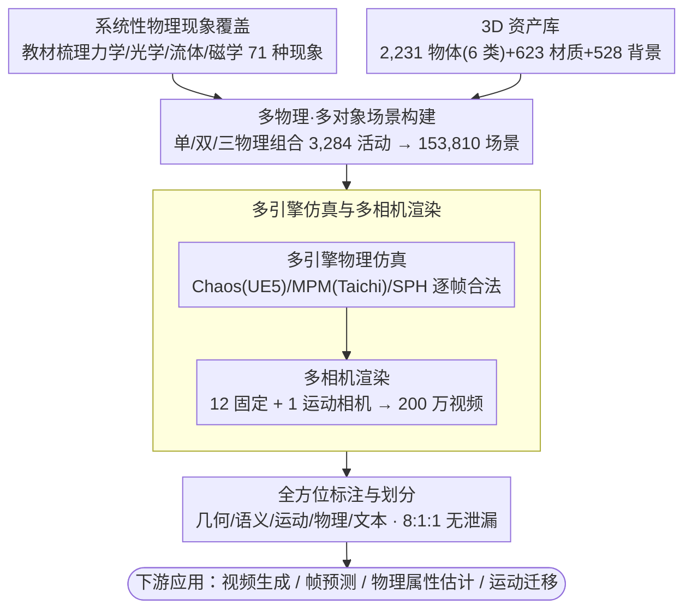

# PhysInOne: Visual Physics Learning and Reasoning in One Suite

**会议**: CVPR 2026  
**arXiv**: [2604.09415](https://arxiv.org/abs/2604.09415)  
**代码**: [https://vlar-group.github.io/PhysInOne.html](https://vlar-group.github.io/PhysInOne.html)  
**领域**: 多模态VLM/物理推理  
**关键词**: 物理学习, 合成数据集, 世界模型, 视频生成, 物理推理

## 一句话总结

PhysInOne是一个包含153,810个动态3D场景和200万个标注视频的大规模合成数据集，覆盖力学、光学、流体动力学和磁学的71种基本物理现象，为物理感知的世界模型建立了新基准。

## 研究背景与动机

**领域现状**：当前AI模型在物理世界理解上严重不足——AI生成的视频频繁违反基本物理定律（物体向上坠落、突然变速等）。已有物理数据集规模极小（几百到几千样本），限制了物理学习的进展。

**现有痛点**：缺乏大规模、高质量的训练数据来覆盖各种物理对象、场景和物理现象。现有数据集要么仅涉及单一物理现象（如碰撞），要么使用简单几何体，无法反映真实世界的复杂性。

**核心矛盾**：物理感知AI需要在多样化场景中学习多种物理现象的联合效果，但数据集规模不足以支撑。

**本文目标**：创建一个比现有数据集大数个数量级的合成物理数据集，覆盖日常生活中的绝大多数物理现象。

**切入角度**：基于大学物理教材系统性地识别71种关键物理现象，使用物理引擎生成严格遵循物理定律的动态3D场景。

**核心idea**：规模化合成物理数据+多对象复杂交互+完整的真值标注，为物理感知世界模型提供数据基础设施。

## 方法详解

### 整体框架

PhysInOne 的构建是一条六阶段的合成数据流水线：(1) 以大学物理教材为提纲，系统梳理力学、光学、流体动力学、磁学四大领域的 71 种基本物理现象及其支配定律；(2) 收集 2,231 个常见 3D 物体（按刚体、可交互、可破坏、可形变、颗粒、液体 6 类组织）、623 种材质、528 个背景，搭成构建场景的素材库；(3) 把基本现象按单/双/三物理组合成 3,284 种"物理活动"，再为每种活动放入多个物体、设置背景、变换材质，实例化出 153,810 个多对象 3D 场景；(4) 用 Chaos Physics (UE5)、MPM (Taichi)、SPH 三套引擎分别仿真刚体、形变/颗粒、液体的动力学，保证每一帧严格满足物理定律；(5) 每个场景架 12 个固定相机 + 1 个运动相机渲染，得到 200 万段视频；(6) 人工撰写文本描述并自动导出几何、语义、运动、物理属性等多维真值标注，按 8:1:1 划分且保证资产不跨集泄漏。

### 关键设计

**1. 系统性物理现象覆盖：用教材当"现象清单"，把数据集的覆盖面从个位数顶到 71 种**

前人数据集最大的短板是只盯着 1-9 种现象（CLEVRER 只有碰撞），训出来的模型一换场景就失效。PhysInOne 的做法是不靠拍脑袋挑现象，而是直接以《Fundamentals of Physics》教材和相关研究为提纲，系统性地梳理力学、光学、流体动力学、磁学四大领域，逐条对照教材把重力、反射、浮力、磁引力等 71 种基本现象全部纳入。热力学和声学被显式排除——前者无法用视觉直接观测、后者需要额外的传感数据，留在视频数据集里只会引入无法验证的噪声。这样一来覆盖面不是某个作者的主观选择，而是有外部教材体系背书，接近"日常视觉物理"的完整集合。

**2. 多物理·多对象场景构建：用素材库把抽象现象组合、再实例化成 15 万个耦合场景**

只识别出 71 种现象还只是概念清单，要变成可训练的数据得"长出"具体场景。PhysInOne 先备好素材：2,231 个常见物体（按刚体、可交互如可转风扇、可破坏如玻璃、可形变、颗粒、液体 6 类组织）、623 种材质、528 个室内外背景，且都允许商用。再做两件事把素材"组装"成场景。其一是**多物理组合**——真实世界里物理现象很少单独出现（球滚下斜坡同时还在反光、还可能掉进水里激起涟漪），所以把基本现象按单/双/三物理组合：71 种单物理 + 人工筛掉无意义组合后保留的 943 种双物理 + 2270 种三物理 = 3,284 种"物理活动"。其二是**场景实例化**——为每种活动放入多个物体、设置背景、变换材质，平均每种活动衍生 46.84 个场景，最终得到 153,810 个多对象 3D 场景，且复杂度随组合上升（单/双/三物理场景平均含 3.9/6.3/7.8 个物体）。这样让多种现象在同一场景耦合发生、用复杂物体替代简单基元，既逼模型学联合规律，又让视觉分布更接近真实数据。

**3. 多引擎仿真与多相机渲染：分材质类型选引擎保物理合法，多视角把场景放大成 200 万视频**

场景搭好后只是静态摆设，要让它"动起来且动得对"，关键在仿真求解器的选择。PhysInOne 按物体物理类型分派最合适的引擎：绝大多数日常现象交给 UE5 内置的 Chaos Physics，可形变物体和颗粒（如沙子）用 Taichi 实现的 MPM，液体（水、奶油等）用 Doriflow 的 SPH——这样牛顿定律、质量守恒、（角）动量守恒、胡克定律等约束才能逐帧成立，生成的每一帧都物理合法（也是关键设计 1、2 里"严格遵循物理定律"承诺的落地处）。仿真完成后再为每个场景架 12 个固定相机（上半球 30°~60° 仰角均匀分布）+ 1 个沿轨迹环绕的运动单目相机，统一 1120×1120@30FPS 渲染（含激光的 8780 个场景用 60FPS），平均时长 5.2 秒。正是这"一个场景 13 段视频"的多视角放大，把 153,810 个场景撑成 200 万段视频，构成数据规模数量级跃升的直接来源。

**4. 全方位标注与划分：把数据集同时做成训练资源和评估基准**

只有像素和文本描述的数据集，下游能用的任务很有限。PhysInOne 给每个场景配齐了 3D 网格、运动轨迹、2D 掩码、材质属性、深度图、相机姿态、文本描述等多层标注，覆盖几何、语义、运动、物理属性、文本五个维度；其中文本由人工撰写、并用 Qwen3 校对语法（平均每场景约 64 个英文词），其余真值在渲染时自动导出。数据按 8:1:1 划分训练/验证/留出测试集，并保证同一 3D 资产只出现在一个划分里以杜绝数据泄漏。200 万段视频的标注规模比已有任何物理数据集大数个数量级，这意味着它不只是"喂数据"的训练集——有了真值轨迹和物理属性，就能直接量化评估一个模型到底有没有学懂物理，从而同时承担训练数据和能力基准两个角色。

### 损失函数 / 训练策略

PhysInOne本身是数据集而非模型。论文展示了在四个应用上的微调效果，使用各任务对应的标准训练策略。

## 实验关键数据

### 主实验

| 应用 | 模型 | PhysInOne微调后 | 效果 |
|------|------|----------------|------|
| 物理感知视频生成 | SVD/CogVideoX/WAN | 物理合理性显著提升 | 运动更符合物理定律 |
| 未来帧预测 | TiNeuVox/DefGS等 | 预测质量提升 | 时空一致性增强 |
| 物理属性估计 | 多种模型 | 暴露关键差距 | 内在属性估计仍困难 |
| 运动迁移 | 多种模型 | 效果提升 | 物理合理的运动转移 |

### 消融实验

| 配置 | 关键指标 | 说明 |
|------|---------|------|
| 无PhysInOne微调 | 物理违反频繁 | 基础模型缺乏物理知识 |
| 少量子集微调 | 部分提升 | 数据量与物理理解正相关 |
| 完整微调 | 最优 | 大规模数据显著增益 |

### 关键发现

- 在PhysInOne上微调显著提升了视频生成的物理合理性，证明了规模化合成物理数据的价值
- 基础模型在内在物理属性（质量、摩擦力等）的估计上仍然存在根本性差距
- 复杂多物理现象场景是当前模型最困难的场景，单一现象训练不足以泛化

## 亮点与洞察

- **数量级的规模优势**：153K场景/200万视频，比最大的前人数据集大几个数量级
- **系统性的物理覆盖**：71种现象覆盖日常物理的绝大部分，可作为物理AI的标准化训练数据
- **暴露关键差距**：实验同时展示了基础模型在物理推理上的进步和根本局限，为未来研究指明方向

## 局限与展望

- 合成数据与真实物理仍存在域差距
- 排除了热力学和声学，非视觉物理现象未覆盖
- 文本描述为人工标注，可能成为扩展瓶颈

## 相关工作与启发

- **vs CLEVRER**: CLEVRER仅覆盖碰撞一种现象，10K场景。PhysInOne覆盖71种现象，15万场景
- **vs Physion++**: Physion++覆盖9种现象但使用简单对象，PhysInOne使用复杂几何和多对象交互

## 评分

- 新颖性: ⭐⭐⭐⭐ 规模和覆盖范围的突破性提升
- 实验充分度: ⭐⭐⭐⭐ 四种应用任务的全面验证
- 写作质量: ⭐⭐⭐⭐ 组织清晰，动机充分
- 价值: ⭐⭐⭐⭐⭐ 作为物理AI的基础设施级贡献

<!-- RELATED:START -->

## 相关论文

- [\[ICCV 2025\] Physics Context Builders: A Modular Framework for Physical Reasoning in Vision-Language Models](../../ICCV2025/multimodal_vlm/physics_context_builders_a_modular_framework_for_physical_reasoning_in_vision-la.md)
- [\[AAAI 2026\] ClearAIR: A Human-Visual-Perception-Inspired All-in-One Image Restoration](../../AAAI2026/multimodal_vlm/clearair_a_human-visual-perception-inspired_all-in-one_image_restoration.md)
- [\[ICML 2026\] Learning GUI Grounding with Spatial Reasoning from Visual Feedback](../../ICML2026/multimodal_vlm/learning_gui_grounding_with_spatial_reasoning_from_visual_feedback.md)
- [\[CVPR 2026\] DeepSketcher: Internalizing Visual Manipulation for Multimodal Reasoning](deepsketcher_internalizing_visual_manipulation_for_multimodal_reasoning.md)
- [\[CVPR 2026\] ReHARK: Refined Hybrid Adaptive RBF Kernels for Robust One-Shot Vision-Language Adaptation](rehark_refined_hybrid_adaptive_rbf_kernels_for_robust_one-shot_vision-language_a.md)

<!-- RELATED:END -->
