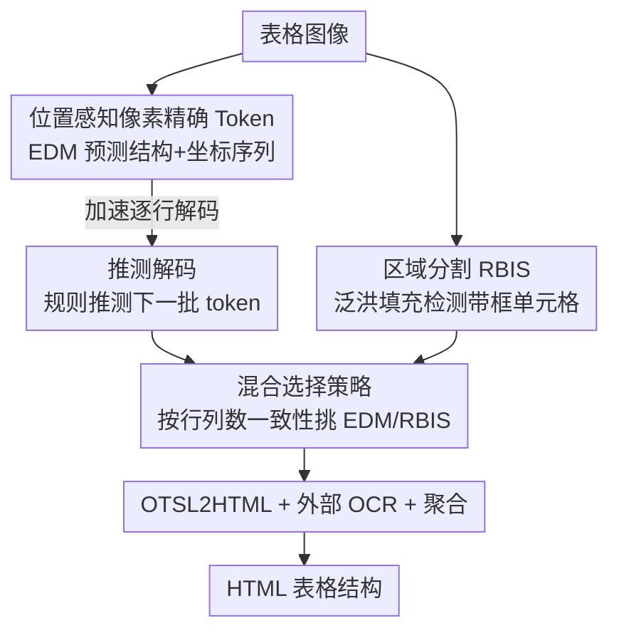

# PIX-TAB: Efficient PIXel-Precise TABle Structure Recognition Approach with Speculative Decoding and Region-Based Image Segmentation

**会议**: CVPR 2026  
**论文**: [CVF Open Access](https://openaccess.thecvf.com/content/CVPR2026/html/Zaytsev_PIX-TAB_Efficient_PIXel-Precise_TABle_Structure_Recognition_Approach_with_Speculative_Decoding_CVPR_2026_paper.html)  
**代码**: 无  
**领域**: 多模态VLM / 文档智能 / 表格结构识别  
**关键词**: 表格结构识别, 像素精确token, 推测解码, 泛洪填充分割, 端侧部署

## 一句话总结
PIX-TAB 用一套把行列像素坐标直接编进序列的"位置感知像素精确 token"，让一个轻量编码器-解码器模型既输出表格结构又能确定性地还原每个单元格框，再配上规则化的推测解码和基于泛洪填充的区域分割，做到精度持平 SOTA、速度翻倍、可在手机上跑的表格结构识别。

## 研究背景与动机

**领域现状**：表格结构识别（TSR）是文档智能的基础环节——要从一张表格图里恢复行、列、单元格以及合并关系。深度学习时代主流是 transformer 架构，比如把结构预测成 HTML 标签序列，或用 OTSL（只有 5 个 token 的精简表格语言）做序列预测；也有 MTL-TabNet 这类多任务学习框架，用共享编码器同时做结构识别、单元格框检测、字符识别。

**现有痛点**：现有方法有三类问题。其一，很多模型把检测、结构解析、内容识别拆成独立子任务，形成"碎片化流水线"，误差逐级累积、算力开销大。其二，大视觉语言模型（UniTable、OmniParser 等）效果不错但架构太重，根本没法在边缘设备上跑。其三，主流方法重度依赖大规模标注数据，而公开数据集（FinTabNet、PubTabNet）表格结构偏简单、风格单一、单元格框标注还常缺失。此外，自回归解码长表格时一个一个 token 吐，延迟很高。

**核心矛盾**：精度、速度、可部署性三者很难兼得——要精度就上大模型，要可部署就得砍模型，而砍了模型长表格的逐 token 解码又慢。同时，把单元格框交给一个独立 bbox 解码器，推理时既增加了模块又引入新的误差源。

**本文目标**：用一个小到能在手机上跑的模型，做到像素级精确的结构恢复，同时把解码加速、并且对识别语言无依赖（换 OCR 模型就能换语言，不动核心结构模型）。

**切入角度**：作者注意到 OTSL 序列在行与行之间高度规律，而且如果把每条横线/竖线的像素坐标直接塞进 token，单元格框就能从序列里解析出来、不再需要单独的框解码器。规律性可以拿来做无需草稿模型的解码加速。

**核心 idea**：用"位置感知像素精确 token（PAPP）"把几何坐标编进结构序列，让一个轻量 EDM 同时给出结构和框；再用规则推测解码吃掉解码步数，用泛洪填充的区域分割兜底带边框的复杂大表。

## 方法详解

### 整体框架

PIX-TAB 由四个部件串成：①一个编码器-解码器模型（EDM），预测 PAPP token + OTSL 结构 token；②一个区域分割模块（RBIS），用泛洪填充对带完整边框的表格直接检测单元格；③一个外部 OCR 模型，识别单元格文本；④一个聚合模块，用"混合选择策略"在 EDM 和 RBIS 两路输出里挑更可信的那个，最后经 OTSL2HTML 拼成 HTML。EDM 是主路，RBIS 对 EDM 不擅长的大而密的带框表格并行兜底，OCR 与结构识别解耦——这正是"换语言只换 OCR"的来源。

EDM 内部沿用 MTL-TabNet 的骨架并做了改造：编码器是改了 block 配置（4 个残差阶段分别含 1/2/5/3 个 basic block）、嵌入全局上下文块（GCB）的 ResNet-31-D，后接正弦位置编码；之上是一个两层共享解码器，再分叉成预测 PAPP/OTSL token 的 StructDecoder 和**仅训练时使用**的轻量 BboxDecoder。训练损失是结构损失与框损失之和 $\mathcal{L}_{\text{total}} = \mathcal{L}_{\text{structure}} + \mathcal{L}_{\text{bbox}}$，其中结构损失是标准的 teacher-forcing 交叉熵 $\mathcal{L}_{\text{structure}} = -\frac{1}{T}\sum_{t=1}^{T}\log P(y_t\mid x, y_{<t})$，框损失是按目标坐标和归一化的 L1（让误差量级对框尺度不敏感）。关键在于：推理时 BboxDecoder 被整个去掉——因为坐标已经在 StructDecoder 吐的 token 里了。

### 关键设计

**1. 位置感知像素精确 Token（PAPP）：把几何坐标编进结构序列，干掉框解码器**

痛点很直白：要单元格框就得额外训一个 bbox 解码器，推理时多一个模块、多一处误差。作者的做法是扩展 OTSL 表示，为归一化到 $X\times Y$ 的表格图加两类位置 token——行起始 token `<rYYY>`（$YYY\in[0,Y)$，标每条横线的纵向像素坐标）和列边界 token `<cXXX>`（$XXX\in[0,X)$，标每条竖线的横向像素坐标），再和四个 OTSL 结构 token 混在一起：`C`（单元格）、`L`（左看，向左合并）、`U`（上看，向上合并）、`X`（交叉合并），序列以 `</table>` 结尾。原 OTSL 的换行 token `NL` 被省掉，因为 `<rYYY>` 本身就标了新行的开始。举例：单行表、横线在 $y=20,40$、竖线在 $x=10,30,50,70$，序列就是 `<r020><c010><c030><c050><c070><r040>CCC</table>`。因为像素坐标显式写在 token 里，全部单元格框可以直接从序列解析出来，推理时无需框解码器；这套表示比等价 HTML 紧凑得多（论文示例 50 vs 95 token），只比纯 OTSL 略长一点（多了首行坐标 token），却为后面的加速打下基础。

**2. 解析式推测解码：利用行间规律性，无草稿模型地批量跳过解码步**

逐 token 自回归在长表格上是延迟主因。作者注意到 PAPP–OTSL 序列跨行高度规律：第一行之后不再出现 `<cXXX>`，每个新行都以 `<rYYY>` 开头、后接一串 OTSL token，于是可以**用纯规则**而非另一个神经网络来推测未来 token（区别于经典推测解码要训练 draft model）。算法（Alg.1）这样构造推测块：拿当前最后一行 $L$ 去历史行里回溯找前缀匹配的参考行 $A$，找到就用 $A$ 的剩余部分补全当前行、再拼上 $K=10$ 份 $A$ 的拷贝；找不到就用补齐后的最后一行重复 $K$ 次。行起始坐标则用稳定的行间距 $step$（在 $\pm\tau$，$\tau=4$px 容差内估计）外推。解码时把推测块拼到前缀后做**一次**前向，在推测段里逐 token 校验：匹配就接受（`<rYYY>` 容许 ±1 像素偏差），遇到第一个不匹配就停下、丢掉剩余推测尾。推测本身是纯 token 级操作，每次触发开销 $O(K\times N_{cols})$，相比一个解码步可忽略，却能对规律表格一次省掉大量步数。

**3. 区域分割 + 混合选择：对带框大表兜底，按一致性挑更可信的一路**

EDM 在企业文档里那种又大又复杂的表格上常翻车。作者补了一条并行路 RBIS（Alg.2）：对灰度图做泛洪填充（BFS，8 邻域，强度差阈值内的相邻像素归为同区），分三步——区域检测、区域分析（边新建框边累计像素数，密度 $\rho=\eta/A_{box}$ 衡量区域紧实度）、质量过滤（只保留密度 $\ge\rho_{min}$ 且宽高都超过训练集最小单元格尺寸的区域）；时间和空间复杂度都是 $O(n\times m)$，每个像素只访问一次。两路都输出 HTML 后，混合选择策略 $\Psi$ 按行列数一致性挑结果：当 RBIS 的行数和列数都明显多于 EDM（$N_r^{\text{RBIS}} > \gamma\cdot N_r^{\text{EDM}}$ 且 $N_c^{\text{RBIS}} > \gamma\cdot N_c^{\text{EDM}}$，经验阈值 $\gamma=0.7$）时选 RBIS，否则选 EDM。这样把 EDM 的鲁棒性与 RBIS 的几何精度结合起来，专治带清晰边框的密集大表。

### 损失函数 / 训练策略

训练用 $\mathcal{L}_{\text{structure}}+\mathcal{L}_{\text{bbox}}$（见上），框损失只对"开启新单元格"的 token 计算且用坐标和归一化。优化器是 Ranger（RAdam + LookAhead + 梯度中心化），$\beta_1=0.9,\beta_2=0.95$，权重衰减 0.1，全局 batch size 128，最大学习率 0.001、跑到 64% epoch 时降 10 倍、200 步 warm-up，约 50 epoch。为缓解数据稀缺，作者还提出一套合成数据管线：扩展 Wikipedia HTML 表格、改 CSS 制造视觉多样性、截全分辨率图并缩放到统一高度（600–1000px），自动生成超百万张配 HTML/结构/坐标的合成表（记作 Synth），并据此扩出 PubTabNetSynth、FinTabNetSynth 等训练集。

## 实验关键数据

### 主实验

在 FinTabNet / PubTabNet 上评估，并对比加入不同合成数据的效果（指标越高越好）：

| 训练集 | 测试集 | TEDSstruct / TEDS | TEDSstruct100 / TEDS100 |
|--------|--------|-------------------|--------------------------|
| FinTabNet | FinTabNet | 98.71 / 89.69 | 97.60 / 77.30 |
| FinTabNet + SynthTabNet | FinTabNet | 98.69 / 89.79 | 97.60 / 77.41 |
| FinTabNet + **Synth(本文)** | FinTabNet | **98.72 / 89.83** | **97.62 / 77.51** |
| PubTabNet | PubTabNet | 97.20 / 77.73 | 96.62 / 70.49 |
| PubTabNet + **Synth(本文)** | PubTabNet | 97.26 / 77.79 | 96.63 / **70.60** |

和近期纯图像输入方法在 FinTabNet 上的精度/速度对比（FPS 在单张 A100 40GB 上测）：

| 方法 | 图像尺寸 | Norm.FPS | TEDSstruct |
|------|----------|----------|------------|
| RobusTabNet | 1024 | 5.19 | 97.00 |
| VAST | 608 | 1.38 | 98.63 |
| UniTable | - | - | 98.89 |
| TABLET | 960 | 18.01 | 98.71 |
| **PIX-TAB (✔RBIS)** | 480 | 7.23 | 98.65 |
| **PIX-TAB (✗RBIS)** | 480 | 7.96 | 98.72 |

PIX-TAB 在仅 480 输入下精度与 SOTA 持平（98.72），FPS 优于多数同类，且模型小到能上手机。

### 消融实验

推测解码（SD）与区域分割（RBIS）各部件的贡献：

| RBIS | SD | 测试集 | TEDS / TEDS100 | FPS |
|------|----|--------|----------------|-----|
| ✗ | ✗ | FinTabNet | 97.62 / 77.50 | 3.80 |
| ✗ | ✔ | FinTabNet | 97.62 / 77.51 | **7.96** |
| ✗ | ✗ | PubTabNet | 96.68 / 70.60 | 3.36 |
| ✗ | ✔ | PubTabNet | 96.63 / 70.60 | **8.54** |

RBIS 在带完整边框的密集表（SynthTabNet 的 MarketingStyle 子集）上的增益：

| 测试集 | RBIS | TEDSstruct100 | TEDS100 |
|--------|------|---------------|---------|
| MarketingStyle | ✗ | 56.14 | 35.08 |
| MarketingStyle | ✔ | **57.59** | **45.61** |

### 关键发现

- **推测解码几乎白送速度**：开启 SD 后 FinTabNet 从 3.80→7.96 FPS（约 1.5×）、PubTabNet 从 3.36→8.54 FPS（约 2.5–3×），而 TEDS 精度几乎不动——因为它只是用规则跳过冗余解码步、再逐 token 校验。
- **RBIS 专治密集带框表**：在 MarketingStyle 上 TEDS100 从 35.08→45.61（+10 个百分点以上），代价只是少量计算开销；但对普通 FinTabNet/PubTabNet 反而略微拉低精度（98.72→98.65），所以它靠混合选择策略只在该兜底时才生效。
- **合成数据稳定增益**：本文 Synth 比公开 SynthTabNet 略好，PubTabNet 上 TEDSstruct 95.2→95.5、TEDS 89.3→89.6。
- **端侧可用**：手机端（Samsung Fold 5 / Snapdragon 8 Gen 2）上优化版从 19.9s 降到 6.6s（约 3×），精度仅微降（TEDS 96.63→96.01），仍优于对比的 NCGM（95.4 / 9.1s）。

## 亮点与洞察

- **把"框检测"折叠进"序列预测"**：PAPP token 让坐标成为结构序列的一部分，推理时直接删掉 bbox 解码器，是"减模块还涨精度"的典型——这个"几何信息 token 化"的思路可迁移到版面分析、图表解析等需要同时出结构和坐标的任务。
- **推测解码不需要草稿模型**：因为表格行间规律性强，作者用纯解析规则生成推测块，省掉了训练/维护 draft model 的成本；凡是输出序列高度结构化、可被规则部分预测的任务（如代码、结构化文档生成）都值得借鉴。
- **混合选择是务实的工程智慧**：不强求单一模型通吃，而是让神经网络主路 + 经典 CV 兜底路并行、按行列数一致性挑结果，既保鲁棒又保几何精度。
- **OCR 与结构解耦**：换语言只换 OCR、核心结构模型不动，这种解耦让产品落地多语言时成本极低。

## 局限与展望

- 作者承认：整体精度高度依赖外部 OCR 的质量，框预测错了会连累结构识别。
- RBIS 只对几何边界清晰的表格有效，遇到极不规则/复杂版面会失灵。
- 推测解码的收益依赖"行模式重复"——若每行都独一无二，本文形式的推测就没意义（甚至可能反而触发无效推测）。
- ⚠️ 部分公式（如混合选择 $\Psi$、TEDS100 的归一化项）在 CVF 文本里 OCR 断裂较多，定义以原文为准；TEDS100 公式中"$N$ 为测试集元素总数"的措辞疑似应为"样本总数"，存疑。
- 可改进方向：把 RBIS 的泛洪填充换成可学习的轻量分割头，或让推测解码自适应判断"该表是否值得推测"，避免无规律表上的空转。

## 相关工作与启发

- **vs OTSL / SPRINT**：都用精简表格语言做序列预测，但本文在 OTSL 上加了像素坐标 token，使框可从序列直接重建、并解锁了规则推测解码；OTSL 原版没有几何坐标，也无法这样加速。
- **vs MTL-TabNet**：本文沿用其共享编码器 + 任务分支的多任务骨架，但把 bbox 头降级为"仅训练时"使用、推理时丢弃，避免了独立框解码器在推理期的误差与开销。
- **vs UniTable / OmniParser 等 VLM**：大 VLM 精度高但架构重、上不了边缘设备；PIX-TAB 用 480 输入的小模型在精度持平的前提下做到端侧 3× 加速，定位差异明显。
- **vs 经典推测解码（draft-then-verify）**：经典做法需要一个草稿模型生成候选；本文利用 TSR 序列规律性用解析规则生成候选，零额外模型调用。

## 评分
- 新颖性: ⭐⭐⭐⭐ PAPP token + 解析式推测解码 + 泛洪填充兜底的组合很巧，单项创新偏工程整合。
- 实验充分度: ⭐⭐⭐⭐ 主结果/速度/消融/端侧/合成数据都覆盖，但部分对比缺 FPS、复杂表评测放在补充材料。
- 写作质量: ⭐⭐⭐ 思路清晰、图示到位，但 CVF 版公式 OCR 断裂、TEDS100 表述略含糊。
- 价值: ⭐⭐⭐⭐ 端侧可部署、语言无关的表格识别有明确落地价值，工程可复用点多。

<!-- RELATED:START -->

## 相关论文

- [\[ICLR 2026\] Grasp Any Region: Towards Precise, Contextual Pixel Understanding for Multimodal LLMs](../../ICLR2026/multimodal_vlm/grasp_any_region_towards_precise_contextual_pixel_understanding_for_multimodal_l.md)
- [\[CVPR 2026\] Twin-T & TwintVQA: A Reliable Structure-Detail Separating VLM and a Comprehensive Benchmark for Chart and Table Tasks](twin-t_twintvqa_a_reliable_structure-detail_separating_vlm_and_a_comprehensive_b.md)
- [\[CVPR 2026\] TRivia: Self-supervised Fine-tuning of Vision-Language Models for Table Recognition](trivia_self-supervised_fine-tuning_of_vision-language_models_for_table_recogniti.md)
- [\[CVPR 2026\] RetFormer: Multimodal Retrieval for Enhancing Image Recognition](retformer_multimodal_retrieval_for_enhancing_image_recognition.md)
- [\[NeurIPS 2025\] ViSpec: Accelerating Vision-Language Models with Vision-Aware Speculative Decoding](../../NeurIPS2025/multimodal_vlm/vispec_accelerating_vision-language_models_with_vision-aware_speculative_decodin.md)

<!-- RELATED:END -->
