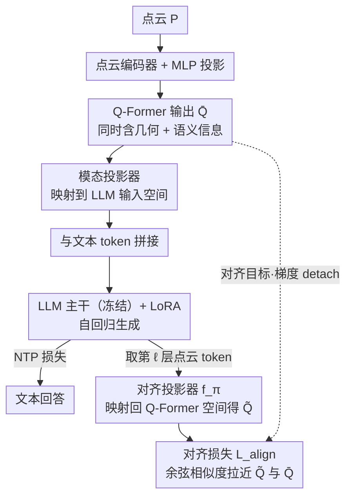

# PointAlign: Feature-Level Alignment Regularization for 3D Vision-Language Models

**会议**: CVPR 2026  
**arXiv**: [2603.00412](https://arxiv.org/abs/2603.00412)  
**代码**: [https://github.com/yharoldsu0627/PointAlign](https://github.com/yharoldsu0627/PointAlign)  
**领域**: 多模态VLM  
**关键词**: 3D点云理解, 视觉语言模型, 特征对齐, 几何信息保持, 正则化

## 一句话总结
提出 PointAlign，在 3D VLM 的 LLM 中间层对点云 token 施加特征级对齐正则化（与 Q-Former 输出对齐），仅训练轻量对齐投影器和 LoRA 适配器，即可有效防止几何信息在语言建模过程中退化，在开放词汇分类上提升 7.50pp。

## 研究背景与动机
**领域现状**：3D 视觉语言模型（3D VLM）对机器人、自动驾驶、AR 等应用至关重要，但受限于 3D-文本配对数据的稀缺。

**现有痛点**：现有方法（PointLLM、ShapeLLM、MiniGPT-3D）仅靠 next-token prediction 损失训练，只有语言 token 提供监督信号，导致：
   - 有限的 3D 数据利用效率低
   - 中间表示中有价值的几何信息在 LLM 不同层传播时逐步退化和丢失

**核心矛盾**：语言建模目标只奖励直接有助于预测下一个 token 的几何特征，而对空间推理有用但与当前语言任务无关的结构性线索会在训练中被丢弃。

**本文目标**：在不增加推理开销的前提下，显式监督 LLM 中间层的点云 token 以保持细粒度 3D 几何-语义信息。

**切入角度**：观察到 Q-Former 输出的特征既包含几何信息又包含语义信息（因为经过了 point cloud-text 配对训练），可以作为理想的内部监督目标。

**核心idea**：用 consistency loss 将 LLM 中间层的点云 token 与冻结的 Q-Former 输出对齐，通过轻量对齐投影器实现，推理时丢弃投影器零额外开销。

## 方法详解

### 整体框架
PointAlign 想解决的是 3D VLM 里几何信息在 LLM 各层传播时逐步退化丢失的问题。它在两阶段训练上做文章：Stage 1 是 MiniGPT-3D 预训练；Stage 2 冻结编码器/Q-Former/投影器，只训练 LoRA 和一个额外的对齐投影器，用余弦对齐损失把 LLM 中间层的点云 token 拉向冻结的 Q-Former 输出。前向主干（点云 → 编码器 → Q-Former → 模态投影器 → LLM）保持 MiniGPT-3D 不变，PointAlign 只在 LLM 第 $\ell$ 层旁挂出一条对齐支路：取出该层的点云 token，经对齐投影器映射回 Q-Former 空间后，与冻结的 Q-Former 输出算余弦相似度对齐。关键在于对齐投影器只在训练时挂着、推理时直接丢弃，所以这套正则化零额外推理开销。

### 关键设计

**1. 对齐目标选 Q-Former 输出 $\bar{Q}$：它同时保留几何和语义信息**

为什么是 Q-Former 而不是别的？点云编码器输出只捕捉几何特征、缺语义；LLM 深层表示又可能已经把 3D 信息丢了。Q-Former 经过 point cloud-text 配对训练、在直接监督下保留了最多的几何 + 语义信息，因此是最理想的内部监督目标——这一点也被消融验证（对齐到 Q-Former 71.00，对齐到编码器仅 67.50，对齐到深层 68.25）。

**2. 对齐投影器 $f_\pi$：3 层轻量映射，训练时挂、推理时丢**

中间层点云 token 和 Q-Former 特征不在同一空间，需要一个桥。$f_\pi$ 由 3 层 Linear + SiLU 构成，把 LLM 第 $\ell$ 层的点云 token $T_{pc}^{(\ell)}$ 映射到 Q-Former 特征空间，结构为 $\mathbb{R}^C \to \mathbb{R}^{d_h} \to \mathbb{R}^{d_h} \to \mathbb{R}^{D_1}$，仅 8.39M 参数。推理时完全丢弃，零推理开销——这种"辅助头只在训练时用"的模式类似知识蒸馏。

**3. 对齐损失：余弦相似度 + Q-Former 梯度 detach**

把点云 token 拉向 Q-Former 输出时，关注方向比关注幅度更适合跨空间对齐，所以用余弦相似度损失：

$$\mathcal{L}_{align} = -\frac{1}{o}\sum_{i=1}^{o} \frac{\tilde{Q}_i^\top \bar{Q}_i}{\|\tilde{Q}_i\|_2 \|\bar{Q}_i\|_2}$$

Q-Former 输出 $\bar{Q}$ 的梯度被 detach，避免反向传播改变冻结模块；总损失为 $\mathcal{L}_{total} = \mathcal{L}_{ntp} + \lambda \mathcal{L}_{align}$，让语言建模目标和几何保持目标并行优化。

### 损失函数 / 训练策略
Stage 2 用 $\mathcal{L}_{total} = \mathcal{L}_{ntp} + \lambda \mathcal{L}_{align}$ 联合训练 LoRA 和对齐投影器。仅更新极少参数。

## 实验关键数据

### 主实验（3D 物体分类）

| 模型 | LLM大小 | ModelNet40 Avg | Objaverse Avg | Overall Avg |
|------|---------|:---------:|:---------:|:---------:|
| PointLLM-7B | 7B | 50.85 | 62.50 | 56.68 |
| PointLLM-13B | 13B | 52.19 | 62.25 | 57.22 |
| MiniGPT-3D (Baseline) | 2.7B | 61.24 | 66.75 | 64.00 |
| **PointAlign (Ours)** | **2.7B** | **61.17** | **71.00** | **66.08** |

### 消融实验

| 配置 | Objaverse Avg | 说明 |
|------|:----------:|------|
| Baseline (MiniGPT-3D) | 66.75 | 无对齐正则化 |
| + 对齐到编码器特征 | 67.50 | 仅几何信息，帮助有限 |
| + 对齐到 Q-Former 输出 | **71.00** | 几何+语义信息，效果最优 |
| + 对齐到深层 LLM 特征 | 68.25 | 已丢失部分3D信息 |

### 关键发现
- 在最具挑战性的开放词汇 Objaverse 分类上提升 **7.50pp**（66.75→71.00 on 2-prompt avg），在 3D captioning 上提升 **4.88pp**
- ModelNet40 上基本持平（-0.07pp），说明对齐正则化主要在困难/开放场景下发挥作用
- 用 2.7B 参数的模型超过了 13B 的 PointLLM，体现了方法的数据效率
- 对齐层 $\ell$ 的选择：中间层效果最好，过浅或过深都不理想

## 亮点与洞察
- **零推理开销的训练技巧**：对齐投影器仅训练时使用、推理时丢弃，这种设计模式值得在其他 VLM 中借鉴（类似于知识蒸馏中辅助头的用法）
- **对 2D VLM 研究的 3D 延伸**：2D VLM 中已有研究表明视觉表示在网络深层退化（缺乏显式视觉监督时），本文将这一发现扩展到 3D 点云领域并给出了解决方案
- **数据高效**：在 3D 数据极度稀缺的条件下，通过内部对齐正则化最大化利用有限数据

## 局限与展望
- 以 MiniGPT-3D 为基座，较小的模型规模可能限制上限
- 对齐层 $\ell$ 需要调参选择，不同模型架构可能需要不同设置
- 仅验证了单物体理解，场景级多物体 3D 理解未涉及
- 可尝试多层对齐（不仅对齐一个中间层，而是多个层），或动态选择对齐层

## 相关工作与启发
- **vs PointLLM**：PointLLM 通过全模型微调实现 3D-text 对齐，计算成本高（200+ GPU-hours）；PointAlign 仅训练少量参数即超越其性能
- **vs 2D VLM 的表示监督方法**：2D 中的重建式方法（恢复视觉输入来监督中间表示）捕捉低层纹理；3D 需要捕捉结构关系和几何配置，直接对齐 Q-Former 语义特征更合适

## 补充分析
- 对齐投影器仅 8.39M 参数，与 MiniGPT-3D 的 2.7B 参数量相比几乎可忽略
- Stage 2 训练中 Q-Former 输出 $\bar{Q}$ 梯度被 detach，这是关键设计——如果不 detach 则对齐损失会通过梯度反传改变 Q-Former
- 在 Objaverse 的开放词汇分类中，Instruction-based 提升更大（65→72.5，+7.5pp），说明对齐正则化对理解自由形式指令更有帮助
- 论文通过 feature similarity 可视化证明了：baseline 中间层的点云 token 与 Q-Former 输出的相似度随层数增加而下降，而 PointAlign 保持稳定
- 方法基于 MiniGPT-3D 的 Q-Former 架构，迁移到其他 3D VLM（如 PointLLM 的直接投影方案）需要适配对齐目标

## 评分
- 新颖性: ⭐⭐⭐ 思路清晰但技术创新幅度适中
- 实验充分度: ⭐⭐⭐⭐ 消融分析充分，特征质量可视化有说服力
- 写作质量: ⭐⭐⭐⭐ 结构清晰，动机阐述得当
- 价值: ⭐⭐⭐⭐ 对3D VLM社区有实用指导意义

<!-- RELATED:START -->

## 相关论文

- [\[CVPR 2026\] Proxy3D: Efficient 3D Representations for Vision-Language Models via Semantic Clustering and Alignment](proxy3d_efficient_3d_representations_for_vision-language_models_via_semantic_clu.md)
- [\[CVPR 2026\] HiSpatial: Taming Hierarchical 3D Spatial Understanding in Vision-Language Models](hispatial_taming_hierarchical_3d_spatial_understanding_in_vision-language_models.md)
- [\[CVPR 2026\] Predictive Regularization Against Visual Representation Degradation in Multimodal Large Language Models](predictive_regularization_against_visual_representation_degradation_in_multimoda.md)
- [\[CVPR 2026\] HOG-Layout: Hierarchical 3D Scene Generation, Optimization and Editing via Vision-Language Models](hog_layout_hierarchical_3d_scene_generation_optimization_and_editing.md)
- [\[CVPR 2026\] AGFT: Alignment-Guided Fine-Tuning for Zero-Shot Adversarial Robustness of Vision-Language Models](agft_alignment-guided_fine-tuning_for_zero-shot_adversarial_robustness_of_vision.md)

<!-- RELATED:END -->
