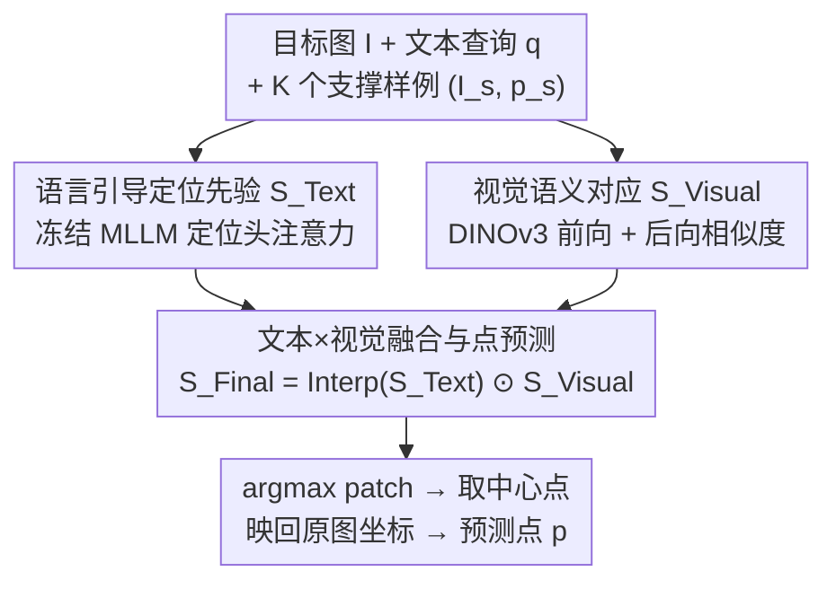

# Pointing at Parts: Training-Free Few-Shot Grounding in Multimodal LLMs

**会议**: CVPR 2026  
**论文**: [CVF Open Access](https://openaccess.thecvf.com/content/CVPR2026/html/Tsai_Pointing_at_Parts_Training-Free_Few-Shot_Grounding_in_Multimodal_LLMs_CVPR_2026_paper.html)  
**代码**: 待确认  
**领域**: 多模态VLM  
**关键词**: 部件级指点, 免训练, 少样本, 注意力图, 视觉语义对应

## 一句话总结
POP 是一个免训练、即插即用的方法，把 MLLM 的语言引导注意力图（提供语义和指代能力但粗糙）和 DINOv3 自监督特征的双向视觉对应（精确但多目标时分不清）做逐元素相乘融合，让 MLLM 在少样本下实现**部件级**（如「笔记本的键盘」）而非仅实例级的精确指点，1-shot 在三个数据集上平均涨最多 8.9 分、3-shot 涨 16.4 分，连本来不会指点的 MLLM 也能涨最多 30.9 分。

## 研究背景与动机

**领域现状**：指点（pointing，精确空间定位）是最普适的非语言沟通方式，一个会指点的模型能让具身智能体导航/操作、给 GUI agent 直接点按钮。近期 MLLM（Molmo、Qwen2.5-VL、Ovis2.5）已能用文本生成像素坐标实现指点。

**现有痛点**：现有 MLLM 大多只在**实例级**指点表现好（指向整个物体），到**部件级**（指向「笔记本的键盘」「瓶子的颈部」这种具体区域）就力不从心。部件级指点能解锁可供性——机器人抓取要点到正确的功能区、细粒度图像/视频编辑、缺陷检测、解剖结构标注等都依赖它。

**核心矛盾**：从实例级到部件级更难，原因有二——（1）目标从整个物体缩到一个具体区域，更细粒度；（2）部件的概念和边界本就模糊（瓶子的「颈」和「肩」空间相邻、难区分）。而单一信号都不够：作者观察到，MLLM 注意力图（来自定位头 localization heads）能给出语义和指代能力，但定位粗糙——查询「neckband」时正确区域被激活，可最高分却落在「body」上；纯视觉的 DINOv3 patch 对应能捕捉细粒度部件信息，却缺指代能力——出现两件相似毛衣时所有对应区域都被同时点亮，无法消歧。

**本文目标**：在不做任何后训练（post-training）的前提下，让 MLLM 在少样本设置下完成精确的部件级指点。

**切入角度**：既然 MLLM 注意力图（语义 + 指代）和 DINOv3 视觉对应（精确局部匹配）是**互补**的，那就把两者融合——前者负责「指对哪个物体的哪类部件」，后者负责「精确定到那块 patch」。用少样本范例（support image + point）来桥接，避免穷举标注或精确术语。

**核心 idea**：免训练地把语言引导定位先验 $S_{Text}$ 和双向视觉语义对应 $S_{Visual}$ 逐元素相乘，得到既准又语义一致的部件级定位图，再取最高分 patch 中心当预测点。

## 方法详解

### 整体框架
POP 解决 $K$-shot 部件级指点：每个 episode 给一张目标图 $I$、一句描述目标部件的文本查询 $q$（如「mug 的 handle」）、以及 $K$ 个支撑样例 $(I_s, p_s)$（支撑图 + 标注点），要预测 $I$ 坐标系下符合 $q$ 的一个点 $p$。流程是两条并行支路 + 一次融合：左路从冻结 MLLM 的定位头抽**语言引导定位先验** $S_{Text}$（语义粗定位）；右路用 DINOv3 在支撑图与目标图之间算**双向视觉语义对应** $S_{Visual}$（精确局部匹配）；两图分辨率对齐后逐元素相乘成最终图 $S_{Final}$，取最高分 patch 中心、映回原图坐标即为预测点。整个过程不更新任何权重。

### 关键设计

**1. 语言引导定位先验 $S_{Text}$：用 MLLM 定位头注意力给出语义粗定位**

针对痛点「纯视觉对应缺指代能力、分不清是哪个物体」，POP 先从冻结 MLLM 拿语义信号。沿用前人发现——MLLM 里存在一小撮**定位头（localization heads）**，会持续把注意力放在最能描述查询文本的视觉 token 上。具体做法：取最后一个查询 token 对所有图像 token 的注意力（用选出的 top-3 定位头），reshape 成 $R^{H_l\times W_l}$、用高斯滤波平滑，再逐元素求和聚合成语言引导定位分图 $S_{Text}\in R^{H_l\times W_l}$。这条支路的价值在于它带**语义和指代能力**——知道查询说的是哪个物体的哪类部件；但它定位粗糙（前面「neckband」却高分在「body」的例子），所以只能当先验，需要视觉支路来精修。消融（Tab.5）显示注意力聚合方式很关键：用定位头给 55.8，用平均池化只 53.1，用最大池化反而掉到 49.8（低于不加的 51.2）。

**2. 双向视觉语义对应 $S_{Visual}$：用 DINOv3 前向+后向相似度做精确局部匹配**

针对痛点「MLLM 注意力图定位粗」，POP 用 DINOv3 在支撑图和目标图之间建 patch 级对应。先用视觉编码器把两图编成 patch 特征 $z_s, z_t\in R^{H_vW_v\times d_v}$，算 patch 间余弦相似度矩阵 $A_{ij} = \frac{z_s^i\cdot z_t^j}{\|z_s^i\|\|z_t^j\|}$。**前向相似度**：设 $i_s$ 为支撑图中含标注点 $p_s$ 的 patch 索引，$S^{Visual\text{-}fwd}_j = A_{i_s j}$，即「支撑点那块 patch 和目标图每块 patch 有多像」。**后向相似度**：对目标图每块 patch $z_t^j$，先找它在支撑图里最像的 patch $m(j) = \arg\max_i A_{ij}$，再量这块匹配 patch 和含 $p_s$ 的 patch 的相似度 $S^{Visual\text{-}bwd}_j = \frac{z_s^{i_s}\cdot z_s^{m(j)}}{\|z_s^{i_s}\|\|z_s^{m(j)}\|}$——直觉是「若目标 patch 真属于该部件，则它在支撑图里最像的 patch 也该落在同一部件上」，这利用了自监督编码器强自相关的性质。两者逐元素相乘融合 $S_{Visual} = S^{Visual\text{-}fwd}\odot S^{Visual\text{-}bwd}$，让部件区域更突出。消融（Tab.6）证明双向缺一不可：只前向 54.5、只后向 51.8、双向 55.8。这条支路精确但缺指代（多个相似物体会全亮），所以需要文本支路来选对物体。

**3. 文本×视觉融合与点预测：逐元素相乘合二为一，再取最高分 patch 中心**

针对「单一信号都不够」，POP 把两条支路的互补优势相乘合并。由于两图分辨率不同（$S_{Visual}$ 通常更高），先把 $S_{Text}$ 双线性插值到 $S_{Visual}$ 尺寸，再逐元素相乘得最终图：

$$S_{Final} = \mathrm{Interp}(S_{Text})\odot S_{Visual}$$

少样本时简单扩展——把文本图分别和每张支撑图的视觉图相乘。用相乘（而非相加）的好处是：只有两条支路**都**给高分的区域才会被保留，等于让「语义对（文本）」和「局部匹配准（视觉）」做逻辑与，自动滤掉「语义对但不精确」和「精确但物体认错」的假阳性。最后对 $S_{Final}$ 再双线性上采 2 倍以减小量化误差，取最高分 patch 中心当预测点，按编码前的缩放映回原图坐标。

### 一个例子：定位「红毛衣的 neckband」
输入目标图（含两件相似毛衣）+ 查询「红毛衣的 neckband」+ 一个支撑样例。文本支路 $S_{Text}$ 把红毛衣大致区域点亮，但最高分错落在衣身（body）；视觉支路 $S_{Visual}$ 经前向+后向把两件毛衣的 neckband 都精确点亮（精确但歧义）。两图相乘后，只有「红毛衣 + neckband」这块同时在两图高分的区域存活——文本帮选对是哪件毛衣、视觉帮定准是 neckband，$S_{Final}$ 给出干净的单点。argmax 取中心、映回原图即得预测点。

## 实验关键数据

### 主实验
把三个部件分割数据集（PACO-LVIS、InstructPart、PartImageNet++）改造成部件级指点任务；指标：预测点落在真值部件 mask 内记 1 否则 0，报五个随机种子均值。下表为可指点 MLLM 的部件指点准确率（%），0/1/3-shot：

| 数据集 / 方法 | Qwen2.5-VL 0→1→3shot | Ovis2.5 0→1→3shot | Molmo 0→1→3shot |
|------|------|------|------|
| 原始 MLLM（注意力 0-shot） | 47.7 | 47.5 | 51.2 |
| **POP（本文）** | **51.6 → 61.7** | **53.0 → 61.8** | 55.8 → 62.4 |
| 纯视觉 DINOv3 | 41.5 → 55.6 | 84.2 → 91.8（InstructPart）⚠️ | 77.3 → 87.0（PartImageNet++）⚠️ |

⚠️ 上表 DINOv3 行的部分数字跨数据集错位（缓存表格 OCR 串行），以原文 Tab.1 为准。要点：POP 1-shot 一致超原始 MLLM 的 0-shot 零样本指点，三数据集平均涨 Qwen2.5-VL +8.9 / Ovis2.5 +6.5 / Molmo +5.5；3-shot 进一步涨 +16.4 / +13.1 / +10.6。POP 也超过部件专精的零样本分割模型（VL-Part）和少样本基线（Matcher、GF-SAM、in-context learning）；作者发现 ICL 有时反而掉点，推测多图输入引入分布偏移。

对**本不会指点的 MLLM**（InternVL-3-8B、Kimi-VL-A3B），POP 三数据集平均涨 +25.3 / +30.9，1-shot 即可逼近可指点 MLLM 的零样本水平，说明冻结的通用 MLLM 也能当指点基座。

### 消融实验

| 配置 | 关键指标（Molmo-7B-D, PACO Acc%） | 说明 |
|------|------|------|
| Molmo 原始 | 51.2 | 起点 |
| POP w/ 最大池化聚合 | 49.8 | 聚合方式选错反掉点 |
| POP w/ 平均池化聚合 | 53.1 | 次优 |
| POP w/ 定位头聚合（本文） | 55.8 | 最优 |
| POP 仅前向相似度 | 54.5 | 缺后向掉 1.3 |
| POP 仅后向相似度 | 51.8 | 缺前向掉 4.0 |
| POP 双向（本文） | 55.8 | 完整 |

### 关键发现
- **两条支路互补，融合才赢**：文本支路提供语义/指代但粗，视觉支路精确但歧义，逐元素相乘后才既准又一致——这是全文核心观察。
- **双向相似度都需要**：只前向 54.5、只后向 51.8、双向 55.8；前向贡献更大（缺它掉 4.0），但后向能进一步收紧。
- **注意力聚合方式敏感**：定位头 > 平均池化 > 最大池化，最大池化甚至低于不加，说明「用对注意力头」比「用全部注意力」重要。
- **场景越复杂，语言越关键**：在含多物体的复杂真实图（PACO）上，纯 DINOv3 明显落后，联合语言+视觉优势最大；在简单图（InstructPart/PartImageNet++）上随样例增多两者差距收窄。
- **支撑样例质量有用**：用 DINO 的 [CLS] token 检索语义相似支撑（而非随机选），各模型各数据集都能再涨（如 Ovis2.5 在 PACO 从 53.0 → 57.0）。

## 亮点与洞察
- **「语义负责选对、视觉负责定准」的分工融合**：把 MLLM 注意力（带指代能力）和自监督视觉对应（带精确局部匹配）用逐元素相乘做逻辑与，是个干净又通用的免训练融合范式，可迁移到其他需要「先指对再定准」的细粒度定位任务。
- **完全免训练、即插即用**：不更新任何权重，对五个不同家族 MLLM 一致涨分，连零指点能力的模型都能用，落地成本极低。
- **后向相似度的设计很巧**：不只看「支撑点像哪些目标 patch」，还反过来验「目标 patch 在支撑图里最像的 patch 是否也落在该部件上」，利用自监督特征的自相关性收紧匹配，是个可复用的 trick。
- **相乘比相加更对**：用乘法做融合天然滤掉「单支路高分」的假阳性，比简单加权更契合「两条证据都成立才信」的逻辑。

## 局限与展望
- 部件概念本身模糊（颈 vs 肩），数据集 mask 边界也有歧义，落点是否「在部件内」的二值评测对边界附近的点不够细。
- 依赖支撑样例质量：随机选样例时性能有波动（报五种子均值），用 [CLS] 检索能改善但需额外检索步骤。
- 强依赖两个外部基座（MLLM 定位头 + DINOv3）的现成能力，定位头识别和 DINOv3 特征质量决定上限；论文用 top-3 定位头、DINOv3-ViT-L/16@1024，换基座或分辨率的鲁棒性未充分展开。
- 改进方向：自适应加权两条支路（复杂场景多信语言、简单场景多信视觉）、扩到视频/3D 部件指点、把单点支撑扩成更丰富的部件提示。

## 相关工作与启发
- **vs F-LMM / Kang et al.（注意力定位）**：他们用冻结 MLLM 注意力图做实例级 grounding（F-LMM 加轻量精修模块、Kang et al. 识别定位头免训练出框）；POP 沿用定位头但补上少样本视觉对应，专攻更难的部件级。
- **vs Matcher / GF-SAM（免训练少样本分割）**：两者用 DINOv2 + SAM 做 patch 对应分割，但纯视觉、缺语言指代，且要全 support mask；POP 只用单个 support point、并融入语言，部件指点上更优。
- **vs Molmo / Qwen2.5-VL / RoboPoint（指点 MLLM）**：这些靠后训练学实例级指点；POP 免训练、即插即用地补上部件级，且能赋能本无指点能力的 MLLM。
- **vs in-context learning（ICL）基线**：直接把样例塞进上下文有时反而掉点（多图分布偏移）；POP 通过显式视觉对应而非上下文堆图来用样例，更稳更准。

## 评分
- 新颖性: ⭐⭐⭐⭐ 免训练融合 MLLM 注意力 + DINOv3 双向对应做部件级指点，组合新颖、观察扎实；单个组件多为已有技术。
- 实验充分度: ⭐⭐⭐⭐⭐ 三数据集 × 五个 MLLM × 0/1/3-shot + 注意力聚合/双向相似度/CoT-MT/支撑选择多组消融，非常充分。
- 写作质量: ⭐⭐⭐⭐ 动机与互补性观察讲得清楚，公式完整；缓存中部分结果表 OCR 错位需对原文。
- 价值: ⭐⭐⭐⭐ 免训练即插即用、对弱基座也有效，对机器人抓取/细粒度编辑等部件级交互很实用。

<!-- RELATED:START -->

## 相关论文

- [\[CVPR 2026\] PAS: A Training-Free Stabilizer for Temporal Encoding in Video LLMs](pas_a_training-free_stabilizer_for_temporal_encoding_in_video_llms.md)
- [\[CVPR 2026\] STiTch: Semantic Transition and Transportation in Collaboration for Training-Free Zero-Shot Composed Image Retrieval](stitch_semantic_transition_and_transportation_in_collaboration_for_training-free.md)
- [\[CVPR 2026\] DRS-GUI: Dynamic Region Search for Training-Free GUI Grounding](drs-gui_dynamic_region_search_for_training-free_gui_grounding.md)
- [\[CVPR 2026\] Training-Only Heterogeneous Image-Patch-Text Graph Supervision for Advancing Few-Shot Learning Adapters](training-only_heterogeneous_image-patch-text_graph_supervision_for_advancing_few.md)
- [\[CVPR 2026\] Mind the Discriminability Trap in Source-Free Cross-domain Few-shot Learning](mind_the_discriminability_trap_in_source-free_cross-domain_few-shot_learning.md)

<!-- RELATED:END -->
