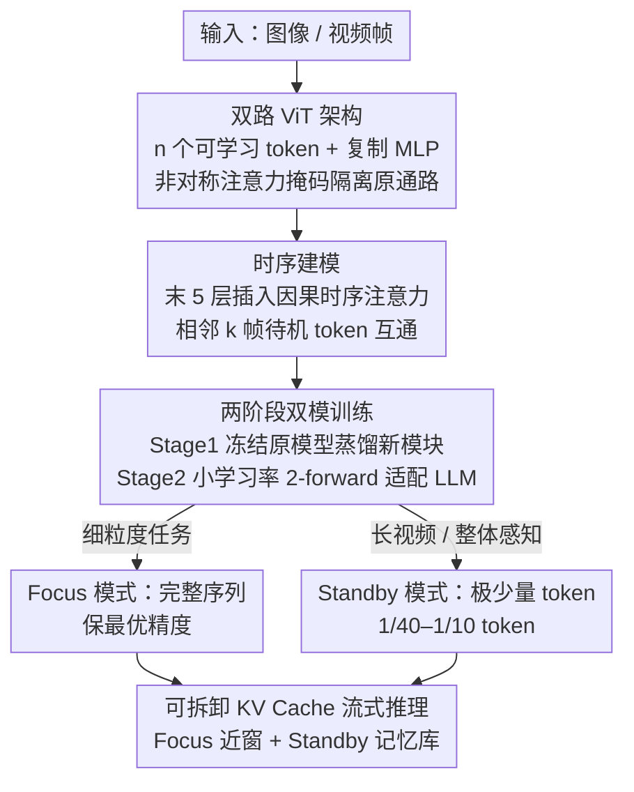

# POINTS-Long: Adaptive Dual-Mode Visual Reasoning in MLLMs

**会议**: CVPR 2026  
**论文**: [CVF Open Access](https://openaccess.thecvf.com/content/CVPR2026/html/Wang_POINTS-Long_Adaptive_Dual-Mode_Visual_Reasoning_in_MLLMs_CVPR_2026_paper.html)  
**代码**: 论文称模型与代码将开源（原文 "available at Link"，⚠️ 具体地址以原文为准）  
**领域**: 多模态VLM  
**关键词**: 视觉 token 压缩、长视频理解、双模推理、可拆卸 KV Cache、流式视频

## 一句话总结
POINTS-Long 给一个训练好的多模态大模型（MLLM）加装一个"待机模式"：用一小撮可学习 token 把整段视觉序列蒸馏成 1/40–1/10 的长度，在长视频理解上保留 97.7%–99.7% 的原始精度，同时完全保留原模型的高保真"专注模式"，并借可拆卸 KV Cache 支持超长流式视频，端到端解码吞吐提升最高 6.2×。

## 研究背景与动机

**领域现状**：MLLM 处理图像/视频时，视觉内容先被切成大量 visual token 再喂给 LLM。视频越长 token 越多，LLM 的 prefill 计算和 KV Cache 显存随序列长度二次增长，长视频（上千帧）很快撞上上下文上限。社区因此做了大量视觉 token 压缩工作（pixel-shuffle、pooling、Q-Former、resampler 等）。

**现有痛点**：作者指出现有压缩方案在落地时卡在三道坎——（1）**压缩率不够**：要在不掉点的前提下把上千帧压到可用规模很难；（2）**缺乏通用性**：模型往往被迫二选一，要么是牺牲细粒度推理的"长视频专家"，要么是无法 scale 的"强推理模型"，做不到一个模型通吃；（3）**部署困难**：很多方法（要显式注意力矩阵、或破坏 KV Cache 的整齐块结构）与 FlashAttention、vLLM、SGLang 等现代推理框架不兼容，理论加速落不到地。

**核心矛盾**：MLLM 设计里"效率"和"细粒度"长期被当成一个**固定的 trade-off**——压得狠就掉精度，要精度就压不动。压缩比例一旦在训练时定死，模型就被锁死在某个折中点上。

**本文目标**：让"压不压、压多少"从一个被训练定死的 trade-off，变成推理时**可自由切换的选择**；且加装这种能力时不能损伤原模型已有的细粒度能力，还要兼容主流推理框架。

**切入角度**：作者从人类视觉系统取经——人脑天然有两种模式：高保真的**专注（focus）**模式处理当下细节，低功耗的**待机（standby）**模式维持长时的概略感知；记忆也分精确的即时回放、模糊的短期记忆和语义化的长期归档。这启发出一个架构：当下用精确缓冲、近期用压缩缓存、长期用概念归档。

**核心 idea**：在一个训练好的 MLLM 上原生加装"双模视觉系统"——Focus Mode 用完整视觉序列保最优精度，Standby Mode 用极少量蒸馏 token 做整体感知；两模通过可拆卸 KV Cache 组合出"高保真当下 + 压缩短期"的类人记忆，从而在一个模型里同时拿到细粒度推理与长视频可扩展性。

## 方法详解

### 整体框架
POINTS-Long 基于 POINTS1.5-8B-Instruct（一个与 Qwen2.5-VL 同档的 MLLM，ViT 用 Qwen2-VL-ViT、LLM 用 Qwen3-8B-base 初始化）。它的做法是：在视觉骨干（ViT）和投影层（projector）里插入一组新模块，把原始视觉序列蒸馏进 $n$ 个"待机 token"，并保证原始推理通路一字不动；再用两阶段后训练把这个新模式接进 LLM。最终模型可在推理时按任务在 Focus / Standby 间切换，并借可拆卸 KV Cache 天然支持流式长视频。

整体可拆成四步贡献：**双路 ViT 架构**把待机 token 与原始 token 物理隔离地并行处理；**时序建模**让相邻帧的待机 token 互通信息以压得更狠；**两阶段双模训练**先蒸馏新模块、再用 2-forward 把 LLM 适配到双模而不伤原能力；**可拆卸 KV Cache 流式推理**把近帧的完整缓存和远帧的压缩缓存分开管理，实现超长记忆。

### 关键设计

**1. 双路 ViT 架构：让"待机 token"既能蒸馏全局信息、又不污染原始通路**

痛点直白说：想塞一组可学习 token 去概括整张图，会陷入两难——冻住 ViT 只训这些 token，拟合力不够、压完掉点很多；解冻 ViT 又会改变训练动力学，把原"专注模式"的精度搞坏。作者借鉴 CLIP 在 patch 序列后追加 $n$ 个可学习 token（$n$ 远小于平均视觉序列长度）作为压缩表示，并仿照 MoT 给 ViT 的**每个 MLP 复制一份**：原始 patch token 走原 MLP，新可学习 token 专走复制出来的新 MLP，投影层也照此镜像；两条路唯一的交互点是**共享的注意力块**。

为了让原始通路彻底不受影响，关键是一个**非对称注意力掩码**：原始 patch token 只在彼此间算注意力（掩掉所有可学习 token），从而保证它们的表示与原模型完全一致；而可学习 token 被允许 attend 到整条序列，得以聚合全局视觉信息。这个掩码与 FlashAttention 完全兼容。可学习 token 的位置编码则通过对原始 2D RoPE 均匀采样得到，鼓励不同 token 各自专注图像不同空间区域。这样既满足"原通路不变（P1）"和"易部署（P3）"，新增参数又把待机模式的表达力顶上去（P2）。

**2. 时序建模：把逐帧独立压缩升级为跨帧联合压缩**

只继承图像编码器的话，方法只处理了帧内空间冗余，却忽略了视频里更要命的**时序冗余**——朴素做法是把每帧独立压成 $n$ 个 token 再拼起来，信息保真度不高。作者在 ViT **最后 5 层**的 attention 与 MLP 之间插入一个时序注意力模块，且**只作用于压缩后的可学习 token 序列**：它把相邻 $k$ 帧的可学习 token 拼成一条新序列，用 1D RoPE 做位置编码并施加**因果注意力**。

因果（而非双向）是刻意的设计——它保证与流式视频编码场景兼容（新帧只能看历史帧）。通过这一层，相邻帧的压缩表示得以交换、refine 信息，显著抬高了最终待机序列在视频理解上的信息保留上限。注意该模块只对"图像编码器当 ViT"的 MLLM 必要，原生视频编码器则不需要。

**3. 两阶段双模训练：先蒸馏新模块、再用 2-forward 把 LLM 适配到双模且不伤专注能力**

新模块装好后还要让 LLM"读得懂"压缩序列，作者用两阶段后训练。**Stage 1（视觉蒸馏与对齐）**：冻结原 POINTS1.5 全部参数（ViT、projector、LLM），只训新增的可学习 token、复制 MLP、复制 projector 和时序注意力层；此阶段 LLM 只喂压缩后的 token 序列，作用类似 MLLM 的 alignment 阶段，逼新模块把视觉精华蒸进紧凑序列。**Stage 2（LLM 模式适配）**：解冻 LLM、用很小的学习率（1e-5）与 Stage 1 参数联合微调，让它学会解读这种新格式。

Stage 2 有个隐患：即便低学习率微调，也可能拖累 LLM 在原 Focus 模式上的表现。作者用 **2-forward 训练**化解：每步做两次前向——Pass 1（Standby）喂短的可学习 token 序列、Pass 2（Focus）喂完整序列（可学习 token + 原始 token），两次 loss 取平均后回传。这个联合目标强迫 LLM 在适配待机模式的同时守住专注模式的能力（Tab. 4/6 证实 Focus 精度无损、Standby 大涨）。相比 resampler / Q-Former 因随机初始化导致训练不稳，本文所有新模块都从预训练权重初始化、训练更稳，且并行 MLP 比串行 cross-attention 计算并行性更好。

**4. 可拆卸 KV Cache 流式推理：用"近窗 Focus + 远端 Standby 记忆库"维持超长视觉记忆**

普通 MLLM 做流式视频会撞墙：新帧不断 prefill，上下文/KV Cache 预算一满就丢掉最早的帧缓存，记忆窗口很短（如 480p、2fps、32K 上下文只能记约 50 秒）。POINTS-Long 天然适配流式：把最近若干帧用 Focus 模式放进"local window"（短+全序列 prefill），更早的帧只保留其 **Standby 短序列 KV Cache** 放进"memory bank"。当 local window 满了，**只丢弃庞大的全序列缓存**，把对应的紧凑待机缓存迁移进长期记忆库。

举例：在 32K 预算下分配 4K 局部窗口 + 28K 记忆库，可同时维持约 6 秒的完整当下视觉（Focus）与最长 30 分钟的压缩视觉记忆（Standby），记忆时长最高提升约 40×。由于待机序列大幅缩短，单样本 KV Cache 占用骤降，推理系统能在同显存下批更多并发解码请求，直接带来吞吐提升。

### 损失函数 / 训练策略
图像压成 $n \in \{8,16,32\}$ 个 token，时序 $k=8$。Stage 1 用 POINTS1.5 的 alignment 数据 + 部分 pretrain 数据，新参数学习率 5e-5；Stage 2 用 pretrain/SFT 阶段的高质量数据，LLM 解冻、学习率 1e-5，并启用 2-forward（Standby + Focus 双前向、loss 取平均）。两阶段训练约耗 25,000 H20 GPU·小时；所有评测均在 SGLang 推理框架下完成。

## 实验关键数据

### 主实验
所有视频实验固定 64 帧。Standby 模式在 OpenCompass 视频榜上以 2.5%–10% 的 token 量保住 97.7%–99.7% 的原模型平均分；Focus 模式则与原模型持平甚至略好。

| 模型 | 每帧 token | 总 token | OpenCompass 视频 Avg | 说明 |
|------|-----------|----------|---------------------|------|
| POINTS1.5-8B（baseline/Focus） | 324 | ≈20K | 65.0 | 原模型，全序列 |
| POINTS1.5-8B（低分辨率） | 32 | 2048 | 59.2 | 朴素降 token，掉 5.8 |
| POINTS1.5-8B（pooling 压缩） | 32 | 2048 | 更低 ⚠️ | 朴素 pooling，进一步掉点 |
| POINTS-Long（Standby，完整模型） | — | 极少量 | 63.5 | 仅用 1/40–1/10 token，保留 97.7%–99.7% |

Focus 模式在 OpenCompass 图像榜上同样无损（下表），还能借可学习 token 做免训练剪枝：

| 模型 | 图像榜 Avg | 说明 |
|------|-----------|------|
| POINTS1.5-8B（baseline） | 69.5 | 原模型 |
| POINTS-Long（Focus） | 69.7 | 双模训练对细粒度无害，反略升 |
| POINTS-Long + Attn-prune 50% | 68.7 | 用可学习 token 注意力做免训练剪枝 |
| POINTS-Long + Avg-pooling 50% | 66.7 | 同压缩率下，注意力剪枝远好于均值池化 |

流式场景（Tab. 5）：baseline 受 64 帧滑窗限制、远端信息丢失，POINTS-Long 用"8 帧 Focus 局部窗 + 全程 Standby 记忆库"在多个长视频/流式榜上全面占优（如 248+8 帧、8 token/帧配置下平均 56.5，明显高于 POINTS1.5-8B-online 的 51.9）。

### 消融实验
固定 64 帧，逐项验证设计（指标为视频榜 Avg）：

| 配置 | 复制 MLP | 时序注意力 | Stage 2 | 视频 Avg | 说明 |
|------|---------|-----------|---------|----------|------|
| 仅可学习 token | × | × | × | 58.1 | 拟合力不足，最弱 |
| + 复制 MLP + 时序 | ✓ | ✓ | × | 61.0 | 缺 LLM 适配，仍偏低 |
| + 复制 MLP + Stage2 | ✓ | × | ✓ | 62.6 | 缺时序建模 |
| 完整模型 | ✓ | ✓ | ✓ | 63.5 | 各组件缺一不可 |

效率（Tab. 7，H20 + SGLang）：Standby 把 LLM 计算降 30–40×；256 帧、8 token/帧时 LLM prefill 延迟从 8.95s 降到 0.41s（4.6%），生成吞吐从 240 token/s 升到 1494 token/s（约 6.2×）。

### 关键发现
- **复制 MLP 是拟合力关键**：仅训可学习 token（58.1）到加复制 MLP/时序（61.0）涨 2.9，说明并行新通路给待机模式补上了表达力。
- **Stage 2 的 2-forward 是"既要又要"的核心**：它既大涨 Standby（62.6→63.5）又守住 Focus 不掉点，是双模能共存的关键。
- **瓶颈在 LLM 而非 ViT**：长视频里 ViT 计算随帧数线性增长，LLM prefill 却二次增长成主导成本，所以压缩 LLM 侧序列收益巨大；ViT 计算还能与 LLM 重叠（类 PD 解耦部署）。
- **注意力剪枝优于池化**：免训练地用可学习 token 的注意力权重 top-m% 选 token，同压缩率下比 avg-pooling / Folder 等即插即用法保留更多性能。

## 亮点与洞察
- **把 trade-off 变成 choice**：最"啊哈"的点是不再训练时锁死压缩比，而是把 Focus/Standby 做进一个模型、推理时按需切换——这是范式层面的转变而非增量调参。
- **非对称注意力掩码是"无损加装"的灵魂**：让原始 token 看不见新 token、新 token 能看全局，一招就保证了原通路表示逐位不变，且与 FlashAttention 兼容，可直接迁移到任何同构 MLLM 上做"无损扩展"。
- **可拆卸 KV Cache 把双模能力转成系统级红利**：丢全序列缓存、留压缩缓存的"迁移"操作，把模型能力直接换成 40× 记忆时长和 6.2× 吞吐，是少见的"算法设计直接对接推理基础设施"的范例。
- **训练-free 剪枝是白送的副产物**：可学习 token 的注意力天然是一张"重要性图"，顺手就能做免训练的视觉 token 剪枝，迁移到任何想加速 Focus 模式的场景。

## 局限与展望
- **模式切换靠人工预设**：作者承认当前 Focus/Standby 的选择是推理时手动定的，理想情况应让模型自己学会"哪段视频该扫一眼（Standby）、哪段该细看（Focus）"，即其提出的 "Thinking with Videos"，留待未来工作。
- **复现门槛高**：方法主要面向有大规模专有训练数据的 MLLM 预训练团队，25,000 H20 GPU·小时的成本与数据规模强相关，学术界难直接复现（作者自己也标注了这点）。
- **时序模块有适用边界**：显式时序注意力只对"图像编码器当 ViT"的 MLLM 必要，原生视频编码器场景需另行设计。
- **自身实现尚未充分优化**：作者称当前 SGLang 实现是初步版本，效率红利还有进一步压榨空间——反过来说当前 6.2× 可能是保守下界。

## 相关工作与启发
- **vs 视觉 token 压缩（pooling / pixel-shuffle / Q-Former / resampler）**：它们在训练时把压缩比定死、形成固定 trade-off，且常因随机初始化训练不稳；POINTS-Long 把压缩做成可切换的待机模式、新模块全部从预训练权重初始化，更稳也更灵活。
- **vs 长视频专家 / 流式专用模型**：那些模型为长视频牺牲细粒度图像推理，或为流式牺牲当下细节，高度专用化；本文用双模 + 可拆卸 KV Cache 在一个模型里同时拿到长记忆与高保真。
- **vs 训练-free 注意力剪枝法**：很多只停留在算法层、与现代推理框架不兼容；本文的非对称掩码与剪枝都对 FlashAttention/SGLang 友好，理论效率能真正落地。

## 评分
- 新颖性: ⭐⭐⭐⭐⭐ 把"效率 vs 细粒度"从固定 trade-off 重构为推理时可切换的双模选择，并配套可拆卸 KV Cache，是范式级而非增量贡献。
- 实验充分度: ⭐⭐⭐⭐ 图像/视频/流式/效率多维覆盖、消融完整；但代码地址与部分压缩对比数值在缓存中略含糊（⚠️ 以原文为准）。
- 写作质量: ⭐⭐⭐⭐⭐ 从人类视觉类比一路推到架构与系统设计，动机—方法—部署的逻辑闭环非常清晰。
- 价值: ⭐⭐⭐⭐⭐ 直接面向长视频/流式 MLLM 的真实部署痛点，40× 记忆时长与 6.2× 吞吐的落地收益对工业界很有吸引力。

<!-- RELATED:START -->

## 相关论文

- [\[CVPR 2026\] R-4B: Incentivizing General-Purpose Auto-Thinking in MLLMs via Bi-Mode Annealing and Reinforce Learning](r-4b_incentivizing_general-purpose_auto-thinking_in_mllms_via_bi-mode_annealing_.md)
- [\[CVPR 2026\] Boosting Visual Reprogramming for CLIP with Dual Granularity Alignment](boosting_visual_reprogramming_for_clip_with_dual_granularity_alignment.md)
- [\[CVPR 2026\] TimeViper: A Hybrid Mamba-Transformer Vision-Language Model for Efficient Long Video Understanding](timeviper_a_hybrid_mamba-transformer_vision-language_model_for_efficient_long_vi.md)
- [\[CVPR 2026\] REVISOR: Beyond Textual Reflection, Towards Multimodal Introspective Reasoning in Long-Form Video Understanding](revisor_beyond_textual_reflection_towards_multimodal_introspective_reasoning_in_.md)
- [\[CVPR 2026\] Scaling the Long Video Understanding of Multimodal Large Language Models via Visual Memory Mechanism](scaling_the_long_video_understanding_of_multimodal_large_language_models_via_vis.md)

<!-- RELATED:END -->
