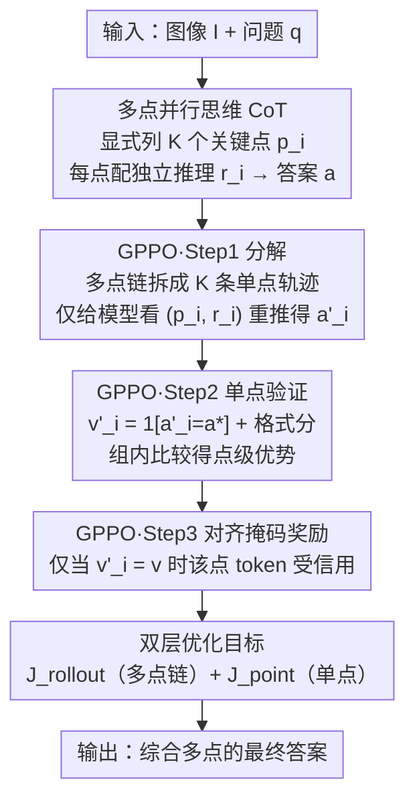

# PointThinker: Point-Incentivized Parallel Thinking for Multimodal Large Language Model

**会议**: CVPR 2026  
**论文**: [CVF Open Access](https://openaccess.thecvf.com/content/CVPR2026/html/Hu_PointThinker_Point-Incentivized_Parallel_Thinking_for_Multimodal_Large_Language_Model_CVPR_2026_paper.html)  
**代码**: 待确认（缓存未给出仓库地址，⚠️ 以原文为准）  
**领域**: 多模态VLM  
**关键词**: 并行思维、多模态推理、强化学习、密集奖励、信用分配

## 一句话总结
PointThinker 让多模态大模型（MLLM）在推理时先显式列出图像里的多个"关键点"、再围绕每个点独立展开一条推理路径，从而把并行思维的多样性放大；并配套一种点级密集奖励 RL 方法 GPPO，给同一条思维链里"有用的点"和"无效的点"分配不同奖励，在 HallusionBench 等难基准上把 Qwen2.5-VL-7B 提升 +4~6 个点。

## 研究背景与动机

**领域现状**：思维链（CoT）推理已被验证能提升 LLM 与 MLLM 能力，于是"并行思维"成了热门方向——不依赖单一推理链，而是同时探索多条路径（如 Tree-of-Thoughts、Self-Consistency、Parallel-R1），靠多路探索提升鲁棒性、减少单条路径失败带来的错误。

**现有痛点**：作者观察到两件事。其一，并行思维在 **MLLM 领域几乎还没人探索**，是个有价值的空白。其二，直接让模型生成多条并行推理链，实践中**路径高度冗余**——不同路径反复绕同一个角度（比如都在讲位置、都在讲天气），多样性其实很有限，并行的好处被浪费。

**核心矛盾**：并行思维理论上靠"多视角"取胜，但模型自由生成的多条链往往**收敛到相似视角**，既缺乏真正的多样性，又让 RL 难以判断"到底是哪一步推理立了功"。更糟的是，主流 RL 方法 GRPO 只给最终答案对错一个**稀疏奖励**，再均匀摊到所有 token 上——一条链里有的点是对答案有帮助的、有的点是无关甚至误导的，却拿到一样的奖励，导致无效推理被错误强化、有效推理被淹没。

**本文目标**：（1）让并行的多条路径真正探索**不同**的问题侧面，而不是换皮重复；（2）让 RL 能区分同一条链内不同推理片段的贡献，做**细粒度信用分配**。

**切入角度**：作者的关键观察是——如果每条路径都被强制"先认领一个具体的关键点、再围绕它推理"，那么路径天然被锚到不同侧面、冗余自然减少；而且每个关键点可以被**独立评估**，这就为密集奖励打开了口子。

**核心 idea**：用"关键点"同时解决多样性和奖励两件事——以点开路（point-incentivized）强制多视角，并以点为单位（point-wise）做密集奖励，把答案对错的信用精确分配到对应关键点的 token 上。

## 方法详解

### 整体框架
PointThinker 以 Qwen2.5-VL-7B-Instruct 为底座，全靠强化学习训练（消融显示额外的 SFT 冷启动没有收益、因此省去）。推理时，模型先针对图像 $I$ 和问题 $q$ 生成一条**多点思维链**：显式列出 $K$ 个关键点 $p_i$、为每个点配一段独立推理 $r_i$，最后综合所有点给出答案 $a$。训练时，核心是 **GPPO**——它把这条多点链拆成多条单点轨迹独立验证，得到点级信号，再把信号传回原链做对齐掩码式的细粒度奖励，并用 rollout 级与 point 级双层目标联合优化。

### 关键设计

**1. 多点并行思维（Multi-point CoT）：用"先列点再推理"逼出真正的多视角**

针对"并行路径换皮重复、多样性虚高"这个痛点，PointThinker 强制模型先显式列出一组关键点、再为每个点独立推理。形式化地，模型 $\pi_\theta$ 对输入 $(I, q)$ 生成多点链 $C = \{(p_1, r_1), (p_2, r_2), \dots, (p_K, r_K), a\}$，其中 $p_i$ 是描述问题某个具体侧面的关键点、$r_i$ 是围绕它的推理、$a$ 是综合所有路径得到的最终答案。结构用 XML 标签落地：关键点包在 `
...
`、推理包在 `<r>...</r>`、整段思考包在 `<think>...</think>`、最终答案放在 `<answer>...</answer>`。

为什么这样有效：显式列点干了两件事——一是**激励模型去识别问题的不同方面**，先把多样的探索方向立住；二是因为每条路径都被绑定到一个具体关键点，模型会**聚焦该点视角推理、避免漂移到别人已覆盖的角度**。论文的案例（如判断比赛时间）显示，标准 CoT 会绕去天气/光照等无关内容，朴素并行思维则多条路径重复讲同一个角度，而 PointThinker 的每条路径锚定不同关键点（天空色彩梯度、球场灯光），探索更全面、更可解释。

**2. GPPO 点级密集奖励：用"单点自验证 + 对齐掩码"把信用精确分到关键点**

针对"GRPO 稀疏奖励均匀摊、无法区分有效/无效点"的痛点，作者提出 **Group Points Policy Optimization（GPPO）**，分三步算点级奖励。**Step 1 分解**：把多点链 $C$ 拆成 $K$ 条单点轨迹——对每个 $(p_i, r_i)$，只把原输入 $(I,q)$ 加上这一对点-推理喂回模型（看不到其他点），让它独立生成答案 $a'_i$（用 `<pointanswer>` 标签），即 $T_i: (I, q, p_i, r_i) \to a'_i$。**Step 2 验证**：算每个点的验证信号 $v'_i = \mathbb{1}[a'_i = a^*] + F_{single,i}$（答案对错 + 格式合规），把同一 rollout 内 $\{v'_1, \dots, v'_K\}$ 分组比较，得到点级优势 $A^{point}_i$，鼓励模型生成"能独立答对"的点。

**Step 3 对齐掩码奖励**是 GPPO 的灵魂。先按标准 GRPO 用整条链的奖励 $v$ 算出 rollout 级优势 $A^{rollout}$，但不再均匀摊给所有 token，而是按点级信号做**选择性掩码**：

$$M(s_t) = \begin{cases} A^{rollout} & \text{若 } s_t \in \{p_i, r_i\} \text{ 且 } v'_i = v \\ 0 & \text{否则} \end{cases}$$

直观讲：当整条链答对时（$v$ 表示成功），**只有那些自己也能答对的点**拿到正优势，强化有用推理；当整条链答错时，**只有那些自己也答错的点**吃到负信号，压制一贯无效的推理。这样就把"是哪个点立了功/惹了祸"的信用精确分配下去，而不是好坏不分一起奖惩。

**3. 双层优化目标：rollout 级与 point 级联合，且免 SFT 冷启动**

GPPO 把两个层面的优化拼到一起。**rollout 级目标** $J_{rollout}$ 用掩码后的优势 $M(s_{g,t})$ 优化多点链，本质是带选择性 token 掩码的 GRPO 目标：

$$J_{rollout}(\theta) = \mathbb{E}\Big[\frac{1}{G}\sum_{g=1}^{G}\frac{1}{|C_g|}\sum_{t=1}^{|C_g|}\min\big(\rho_{g,t} M(s_{g,t}),\ \text{clip}(\rho_{g,t}, 1-\varepsilon, 1+\varepsilon) M(s_{g,t})\big) - \beta D_{KL}(\pi_\theta \| \pi_{ref})\Big]$$

其中 $\rho_{g,t}$ 是重要性采样比。**point 级目标** $J_{point}$ 则直接优化单点轨迹：在单点输入 $(I, q, p_i, r_i)$ 条件下算策略比、用点级优势 $A^{point}_i$ 给生成答案的每个 token 加权，鼓励模型学会生成有效点、避开无效点。二者合一既保证多点链整体答对（$J_{rollout}$ + 对齐信用分配），又保证单点生成质量（$J_{point}$）。值得一提的是，消融发现先做 SFT 冷启动**没有收益**（甚至有时掉点），因此 PointThinker 直接纯 RL 训练即可。

### 一个例子：数棒球场上的球员
问题问图中有几名球员（GT=6）。标准 CoT 绕去聊天气、光照、庆祝氛围，最后估"约 5 名"答错；朴素并行思维生成两条路径，但两条都在重复"按颜色数球衣"的同一角度，仍答 5。PointThinker 则先列两个**不同**关键点：Point 1"系统性清点所有人形"——从前景到背景逐一数出 7 个人形，再剔除一名穿黑衣、无队服的疑似裁判，得 6；Point 2"区分球员与非球员"——识别 7 人中 6 人穿带号码球衣、1 人穿黑衣无装备属裁判，同样得 6。两条互相印证、收敛到正确答案 6。这正体现"每条路径锚定不同侧面 → 减少冗余 → 多视角自洽"的设计意图。

## 实验关键数据

### 主实验
底座 Qwen2.5-VL-7B-Instruct，训练数据为从 MM-Eureka、WeThink 随机采的 102K 样本（视频另采 30K Video-R1 数据），RL 框架用 Easy-R1，判分用 DeepSeek-V3 作 LLM-as-judge。图像 7 基准上 PointThinker-7B 全面超越底座与同底座 SOTA：

| 基准 | Qwen2.5-VL-7B（底座） | WeThink-VL-7B | PointThinker-7B | 相对底座提升 |
|------|----------------------|---------------|-----------------|------------|
| HallusionBench | 52.9 | 55.8 | **58.7** | +5.8 |
| MMVet | 67.1 | 71.7 | **73.4** | +6.3 |
| MathVista | 69.1 | 71.6 | **74.2** | +5.1 |
| MathVerse | 41.1 | 45.1 | **45.9** | +4.8 |
| MathVision | 25.9 | 26.7 | **28.1** | +2.2 |
| 7 基准平均 | 54.0 | 56.4 | **58.1** | +4.1 |

视频理解（Tab. 2，follow Video-R1 协议）同样泛化良好：64 帧时 PointThinker-7B 在 VSI-Bench 37.7、VideoMMMU 53.0、MVBench 66.2 等多榜领先或持平 Video-R1，相对底座在 VSI-Bench、VideoMMMU 分别 +8.7、+4.1。

### 消融实验
固定底座 Qwen2.5-VL-7B，逐项加组件：

| 配置 | Point 结构 | GPPO | HallusionBench | MMVet | 说明 |
|------|-----------|------|----------------|-------|------|
| 底座 | × | × | 52.9 | 67.1 | Qwen2.5-VL-7B |
| + Point | ✓ | × | 56.8 | 71.2 | 点结构 + 均匀奖励，Hallusion +3.9 |
| + Point + GPPO | ✓ | ✓ | **58.7** | **73.4** | 再加密集奖励，额外 +1.9 |

另一组对照（Tab. 3）直接比"朴素并行 vs 点激励并行"：底座 61.0 → +Parallel 63.5 → +Point 64.9（Hallusion/MathVista 平均），说明"以点开路"比单纯并行多探出 +1.4。小模型 Qwen2.5-VL-3B 上 PointThinker-3B 同样在 HallusionBench +3.2、MathVista +4.1，验证方法可迁移到更小规模。

### 关键发现
- **点结构贡献最大**：仅加点结构就在 HallusionBench 带来 +3.9，是主要增益来源——说明"显式拆点"本身就显著提升了推理的全面性与多样性。
- **GPPO 再加一脚**：在点结构之上，密集奖励额外 +1.9，证明单点轨迹确实能提供有意义的验证信号、且"对齐掩码"（只奖惩与最终答案对错一致的点）的细粒度信用分配是必要的。
- **纯 RL 优于 SFT+RL**（Fig. 4）：四种设置对比中，直接 RL 全面最好；SFT 单独有时反而掉点，再加 RL 才恢复——支持作者省去昂贵 SFT 冷启动的决定。
- **泛化跨模态**：方法在图像数学/通用推理与视频理解上都涨，且 3B/7B 两个规模都见效，说明"点激励 + 点级奖励"是较通用的推理增强范式。

## 亮点与洞察
- **一石二鸟的"点"**：最巧的是把"关键点"同时当作多样性约束和奖励单元——以点开路逼出多视角、以点为单位做密集奖励，两个老大难（路径冗余 + 信用分配）被同一个设计一起解决。
- **对齐掩码奖励很优雅**：$v'_i = v$ 的对齐条件让"答对时只奖能独立答对的点、答错时只罚一贯失败的点"，避免了 GRPO 把对错信号一股脑摊给所有 token 的粗糙做法，这套思路可迁移到任何结构化多步推理的 RL 训练。
- **拆链重推的自验证范式**：把多点链拆成单点轨迹、只给模型看一个点去重推，是一种轻量的"自验证"机制，不需额外奖励模型就能拿到点级监督信号，迁移性强。
- **免冷启动省成本**：用消融证明纯 RL 即可、不必 SFT，对训练预算友好，也提示"结构化推理格式"可直接由 RL 习得。

## 局限与展望
- **依赖额外验证开销**：GPPO 每步要把多点链拆成 $K$ 条单点轨迹独立重推一遍，训练时的前向次数随关键点数 $K$ 增长，成本明显高于普通 GRPO（作者未在缓存片段中给出量化开销，⚠️ 以原文为准）。
- **关键点质量受底座限制**：方法本质是引导模型"列好点"，若底座本身识别错关键点（如把无关物体当关键点），下游推理同样会被带偏，论文未深入讨论错误点的鲁棒性。
- **点数 $K$ 的设定**：$K$ 是超参，过少则多样性不足、过多则验证成本与冗余上升，缓存片段未充分给出 $K$ 的敏感性分析。
- **判分依赖外部 LLM**：部分数据用 DeepSeek-V3 作 judge，judge 的偏差可能影响奖励信号质量与可复现性。

## 相关工作与启发
- **vs GRPO**：GRPO 只给最终答案稀疏奖励、均匀摊到所有 token；GPPO 在其上加点级自验证与对齐掩码，做到 token 级细粒度信用分配，是对 GRPO 的精细化扩展。
- **vs 朴素并行思维（Tree-of-Thoughts / Self-Consistency / Parallel-R1）**：它们多条路径常视角重复、且多用于纯文本 LLM；PointThinker 用显式列点逼出真多样性，并首次把并行思维系统性引入 MLLM。
- **vs WeThink / Video-R1 等同底座 RL 方法**：同样基于 Qwen2.5-VL-7B，PointThinker 在 MathVista（+2.6 over WeThink）、HallusionBench 等上更优，且在视频上与 Video-R1 竞争或超越，体现点结构带来的额外增益。

## 评分
- 新颖性: ⭐⭐⭐⭐ "以点开路 + 点级密集奖励"把多样性与信用分配一并解决，思路清新；但建立在并行思维与 GRPO 已有框架之上，属精致改良而非全新范式。
- 实验充分度: ⭐⭐⭐⭐ 图像/视频多基准 + 点结构与 GPPO 分项消融 + 3B/7B 双规模，较完整；GPPO 额外训练开销缺量化（⚠️ 以原文为准）。
- 写作质量: ⭐⭐⭐⭐⭐ 动机—方法—公式—案例衔接清晰，对齐掩码与双层目标讲得很透，案例图直观。
- 价值: ⭐⭐⭐⭐ 在难基准上对强底座仍有 +4~6 的稳定提升、且可迁移到视频与小模型，对多模态推理增强有实用参考价值。

<!-- RELATED:START -->

## 相关论文

- [\[CVPR 2026\] Thinking with Programming Vision: Towards a Unified View for Thinking with Images](thinking_with_programming_vision_towards_a_unified_view_for_thinking_with_images.md)
- [\[CVPR 2026\] Parallel In-context Learning for Large Vision Language Models](parallel_in-context_learning_for_large_vision_language_models.md)
- [\[CVPR 2026\] Thinking in Dynamics: How Multimodal Large Language Models Perceive, Track, and Reason Dynamics in Physical 4D World](thinking_in_dynamics_how_multimodal_large_language_models_perceive_track_and_rea.md)
- [\[CVPR 2026\] MUPO: All Roads Lead to Rome - Incentivizing Divergent Thinking in Vision-Language Models](mupo_all_roads_lead_to_rome_incentivizing_divergent_thinking_in_vlms.md)
- [\[CVPR 2026\] Grounding Everything in Tokens for Multimodal Large Language Models](grounding_everything_in_tokens_for_multimodal_large_language_models.md)

<!-- RELATED:END -->
