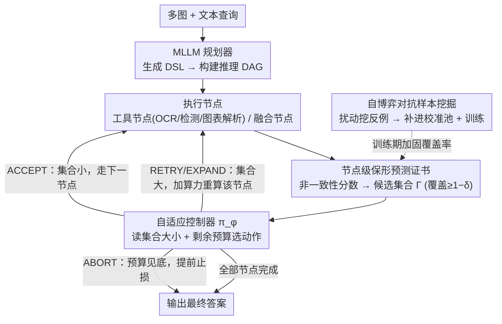

# Proof-of-Perception: Certified Tool-Using Multimodal Reasoning with Compositional Conformal Guarantees

**会议**: CVPR 2026  
**arXiv**: [2603.00324](https://arxiv.org/abs/2603.00324)  
**代码**: [https://github.com/AryaFayyazi/PoP](https://github.com/AryaFayyazi/PoP)  
**领域**: 多模态推理 / 可靠AI  
**关键词**: 保形预测, 工具使用, 多模态推理, 不确定性量化, 自适应计算

## 一句话总结
提出 Proof-of-Perception (PoP)，将多模态推理建模为可执行的有向无环图(DAG)，每个感知/逻辑节点输出带有保形预测证书的集合值（提供逐步可靠性保证），并用轻量控制器基于这些证书在计算预算内自适应分配算力，在文档、图表和多图QA基准上超越CoT、ReAct和PoT基线。

## 研究背景与动机

**领域现状**：多模态LLM在文档理解、图表推理等任务上取得进展，但通常将细粒度感知（OCR、检测、图表解析）和符号推理混在单次前向传播中。工具使用和结构化提示（CoT、ReAct、PoT）部分缓解了这一问题。

**现有痛点**：(1) 中间步骤输出单一猜测值，静默传播错误；(2) 计算分配靠启发式（固定重试次数、未校准阈值），无法做准确率-成本权衡；(3) 校准（如果有的话）仅在最终答案上，中间步骤的逐步可靠性无保证。

**核心矛盾**：现有方法在中间感知步骤"单点提交"——一旦OCR错了一个字、检测漏了一个框，后续推理就被迫在错误基础上合理化。而且何时该扩展推理（多工具调用）、何时该提前停止，缺乏原则性判据。

**本文目标** 如何为多步多模态推理的每个中间步骤提供可靠性保证，并将不确定性转化为计算分配策略？

**切入角度**：保形预测（Conformal Prediction）提供无分布假设的有限样本覆盖保证。将其应用到推理DAG的每个节点，输出的不再是单点值而是有覆盖保证的集合。

**核心 idea**：在推理DAG的每个感知/逻辑节点上用保形预测输出校准的集合值，控制器基于集合大小和预算决定是接受、重试还是扩展。

## 方法详解

### 整体框架
PoP 想解决的是多步多模态推理"一步错、步步错"的问题：传统做法把 OCR、检测、图表解析和符号推理塞进一次前向传播，中间每步只吐一个最可能的猜测，一旦猜错就静默往下传。PoP 把整个推理过程拆成一张可执行的有向无环图 $G=(V,E)$——先由 MLLM 规划器读入多图加文本查询、生成一段 DSL 程序来定义这张图，图里的工具节点调用外部感知工具（OCR / 检测 / 图表解析），融合节点则在 MLLM 内部把上游结果汇总成新结论。关键区别在于：每个节点都不再输出单点值，而是挂一个"证书头"算出非一致性分数，经 split-conformal 校准后吐出一个**带覆盖保证的候选集合**（设计 1）。一个轻量控制器一边走图一边盯着每个节点的证书和剩余预算，逐节点决定是接受、重试、扩展还是中止，把"不确定性"直接翻译成"算力怎么分"（设计 2）。训练期另有一个自博弈对手专挑让证书失效的扰动样本，补进校准池给"覆盖保证"加固（设计 3）。

### 关键设计

**1. 节点级保形预测证书：让中间每一步都带可靠性保证，而不是只在最后兜底**

痛点很直接——OCR 错一个字、检测漏一个框，后面的推理就被迫在错误地基上自圆其说，而传统校准（如果有的话）只管最终答案，中间步骤的对错无从追溯。PoP 给每一类节点 $t$（OCR / 检测 / 图表解析 / 逻辑融合）各配一个非一致性函数 $s^{(t)}(x_v, z)$，度量候选输出 $z$ 有多"反常"。在一个校准集上把这些分数排序，取第 $k=\lceil(n_t+1)(1-\delta)\rceil$ 个分位作为阈值：

$$\tau_\delta^{(t)} = \alpha_{(k)}^{(t)}, \qquad \Gamma_\delta^{(t)}(x_v) = \{\, z : s^{(t)}(x_v, z) \leq \tau_\delta^{(t)} \,\}$$

节点最终交出的就是这个集合 $\Gamma_\delta^{(t)}$，它在无分布假设下保证真值被包含的概率 $\geq 1-\delta$。这样一来，中间步骤遇到歧义时不再被迫"单点提交"，而是把多个校准候选一起留着，等下游证据把歧义消掉再收窄——错误级联自然就被切断了。

**2. 自适应控制器：把集合大小当成"还要不要再算"的信号**

有了证书，下一个问题是何时该多花算力、何时该见好就收——传统方法靠固定重试次数或未校准阈值这种启发式，做不出准确率与成本的权衡。PoP 训了一个轻量策略网络 $\pi_\phi$，输入是每个节点的证书状态 $c_v$（阈值、集合大小、节点类型）加全局剩余预算 $b$，输出四选一的动作 $a_v \in \{\text{ACCEPT, RETRY, EXPAND, ABORT}\}$：ACCEPT 直接保留当前集合，RETRY 用更高精度重跑同一节点（比如换高分辨率裁剪），EXPAND 临时加一个子节点补证据（比如再调一次 OCR），ABORT 则在预算见底时提前止损。控制器用策略梯度去最大化

$$R(x) = -C_{err}(x) - \beta\, C_{comp}(x)$$

即在错误代价 $C_{err}$ 和计算代价 $C_{comp}$ 之间按 $\beta$ 折中。其核心 insight 是：不确定性不该只是事后打个分，而该主动指挥算力——集合大（说明还很犹豫）就 EXPAND 多看，集合小（已经很笃定）就 ACCEPT 早停。

**3. 自博弈对抗样本挖掘：堵住分布偏移下证书失效的口子**

保形预测的覆盖保证建立在"可交换性"假设上，可现实里测试分布一旦偏移，校准阈值就可能名不副实、覆盖率掉下来。PoP 在训练里放一个冻结的对手，让它对输入做可控扰动（裁剪、仿射变换、注入 OCR 噪声）并照常跑一遍推理图，专挑那些让预测出错、或让非一致性分数异常偏大的样本当反例。这批反例有两个用处：一是喂给学生继续训练、逼它在扰动下仍维持覆盖率；二是追加进校准池，让阈值 $\tau_\delta^{(t)}$ 反映真实的失败模式而非干净数据上的理想情况。相当于用自博弈给"可交换性假设"打了一层补丁，让证书在对抗扰动下仍站得住。

### 一个完整示例
拿一道多图文档 QA 走一遍：查询要求"从这张发票里读出总金额并核对是否等于各行小计之和"。规划器先生成 DAG——一个 OCR 节点读总金额栏、若干 OCR 节点读各行小计、一个逻辑融合节点做加总比对。OCR 总金额节点跑下来非一致性分数偏高，证书集合给出 $\{\,\$1{,}280,\ \$1{,}288\,\}$ 两个候选（"8"和"0"在低分辨率下难分），集合大小为 2；控制器看到集合未收敛且预算还充足，发出 RETRY，对该栏位换高分辨率裁剪重读，这次集合收窄到 $\{\,\$1{,}280\,\}$，控制器改判 ACCEPT。各行小计节点本就清晰、集合大小都是 1，逐一 ACCEPT。最后融合节点把小计加总得 $\$1{,}280$、与总金额一致，输出"核对通过"。整条链路里，证书让那个易错的"8/0"歧义没有被静默吞掉，控制器把额外算力**只**花在了真正犹豫的那一个节点上，其余笃定的节点一次过——这正是 PoP 想要的"按需分配算力"。

### 损失函数 / 训练策略
总损失把四项目标合在一起：

$$\mathcal{L} = \mathcal{L}_{task} + \gamma_{plan}\mathcal{L}_{plan} + \gamma_{cert}\mathcal{L}_{cert} + \gamma_{ctrl}\mathcal{L}_{ctrl}$$

其中 $\mathcal{L}_{task}$ 监督最终答案准确率，$\mathcal{L}_{plan}$ 是程序生成序列的交叉熵（管规划器吐对 DSL），$\mathcal{L}_{cert}$ 是边距约束、用来保证证书头的覆盖率达标，$\mathcal{L}_{ctrl}$ 则是控制器的策略梯度项、负责把准确率-成本权衡学进去。

## 实验关键数据

### 主实验

| 方法 | DocVQA | TextVQA | InfoVQA | ChartQA | MultiDoc2Dial |
|------|--------|---------|---------|---------|---------------|
| CoT (GPT-4V) | 74.2 | 68.1 | 51.3 | 71.8 | 42.5 |
| ReAct | 76.8 | 70.3 | 54.1 | 74.2 | 45.7 |
| PoT | 78.1 | 71.5 | 56.4 | 76.9 | 47.2 |
| **PoP** | **82.3** | **75.8** | **61.2** | **80.5** | **52.8** |

### 消融实验

| 配置 | DocVQA | 计算成本(归一化) |
|------|--------|------------------|
| PoP (full) | 82.3 | 1.0x |
| w/o Conformal (单点预测) | 77.5 | 0.8x |
| w/o Controller (固定扩展) | 80.1 | 1.6x |
| w/o Self-Play | 80.8 | 1.0x |

### 关键发现
- PoP在所有5个基准上超越CoT、ReAct、PoT基线，DocVQA提升4.2%，ChartQA提升3.6%
- 去掉保形证书（退化为单点预测）性能大幅下降，验证了集合值中间输出的价值
- 去掉控制器后计算成本增加60%但性能仅提升微弱，说明控制器有效减少不必要计算
- 自博弈挖掘贡献1.5%的性能提升，增强了分布偏移下的鲁棒性

## 亮点与洞察
- **将不确定性从"被动评分"变为"主动计算策略"**是核心insight——保形集合大→分配更多计算（EXPAND），集合小→提前终止（ACCEPT）
- 组合式的保形保证（每步覆盖 $1-\delta$）比仅在最终答案做校准更有意义，可追溯错误到具体步骤
- 框架高度模块化，工具集和节点类型可灵活扩展

## 局限与展望
- 保形预测假设可交换性，虽然自博弈部分缓解，但严格的分布偏移下覆盖保证可能失效
- 候选集大小受限于beam search或采样的候选数 $K_{max}$，可能遗漏正确答案
- 控制器的离散动作空间（4种）可能过于简单，更细粒度的计算分配策略有探索空间

## 相关工作与启发
- **vs CoT/ReAct**: 单点中间输出+启发式计算控制，无可靠性保证；PoP每步有覆盖保证且计算分配有据
- **vs 传统保形预测**: 通常只用于最终预测，PoP将其嵌入多步推理管线的每个节点
- **vs ViperGPT/VisualProg**: 程序化推理但中间步骤无不确定性量化

## 评分
- 新颖性: ⭐⭐⭐⭐⭐ 保形预测+工具使用+自适应计算控制的组合在多模态推理中首次提出
- 实验充分度: ⭐⭐⭐⭐ 五个基准、完整消融、成本分析
- 写作质量: ⭐⭐⭐⭐ 理论严谨，形式化完整
- 价值: ⭐⭐⭐⭐⭐ 对可靠AI推理有深远影响，保形证书+计算控制的范式可广泛迁移

<!-- RELATED:START -->

## 相关论文

- [\[CVPR 2026\] Perception Programs: Unlocking Visual Tool Reasoning in Language Models](perception_programs_visual_tool_reasoning.md)
- [\[CVPR 2026\] Don't Show Pixels, Show Cues: Unlocking Visual Tool Reasoning in Language Models via Perception Programs](dont_show_pixels_show_cues_unlocking_visual_tool_reasoning_in_language_models_vi.md)
- [\[CVPR 2026\] Multimodal Learning on Low-Quality Data with Conformal Predictive Self-Calibration](multimodal_learning_on_low-quality_data_with_conformal_predictive_self-calibrati.md)
- [\[CVPR 2026\] Thinking With Videos: Multimodal Tool-Augmented Reinforcement Learning for Long Video Reasoning](thinking_with_videos_multimodal_tool-augmented_reinforcement_learning_for_long_v.md)
- [\[CVPR 2026\] Visual Reasoning through Tool-supervised Reinforcement Learning](visual_reasoning_through_tool-supervised_reinforcement_learning.md)

<!-- RELATED:END -->
