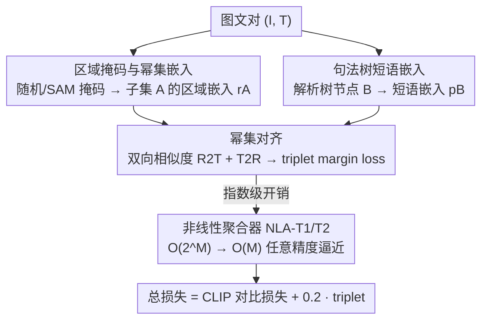

# PowerCLIP: Powerset Alignment for Contrastive Pre-Training

**会议**: CVPR 2026  
**论文**: [CVF Open Access](https://openaccess.thecvf.com/content/CVPR2026/html/Kawamura_PowerCLIP_Powerset_Alignment_for_Contrastive_Pre-Training_CVPR_2026_paper.html)  
**代码**: 作者声明将开源（论文未给出仓库链接）  
**领域**: 多模态VLM  
**关键词**: 对比预训练, 局部到全局对齐, 幂集, 句法树, 组合性

## 一句话总结
PowerCLIP 把"图像区域子集的幂集"和"文本句法树短语"做穷举的局部到全局对齐，再用线性复杂度的非线性聚合器（NLA）把幂集对齐的指数级开销降到 $O(M)$，在 28 个零样本基准上 22 个超过现有 CLIP 类方法，尤其在组合性与鲁棒性上提升明显。

## 研究背景与动机
**领域现状**：CLIP 这类图文对比预训练把整张图和整句话映射到共享语义空间，已成为视觉-语言理解的基座。为了提升细粒度理解，近期工作分两条路线改进——局部对齐（如 SPARC、FineLIP）把文本 token 对到图像 patch，全局对齐（如 A-CLIP、CLIP-PGS）用掩码强调信息量大的图像区域。

**现有痛点**：这两条路线都建立在"单区域"或"被掩码的单区域"目标上，本质上只能处理"一个文本片段 ↔ 一块图像区域"的对应，难以刻画**跨多个图像区域才能表达的组合语义**（比如"a dog sitting on a red chair"里"狗 + 椅子 + 红色"这种需要多个区域协同的关系）。

**核心矛盾**：要捕捉组合语义，最直接的做法是穷举图像区域的所有子集（即幂集）去和文本短语对齐，但 $M$ 个区域掩码的幂集有 $2^M$ 个子集，组合爆炸让朴素实现完全不可行——表达力与计算可行性之间存在直接冲突。

**本文目标**：(1) 设计一个能穷举"区域组合 ↔ 文本短语"对应的对齐目标；(2) 把它的指数级复杂度压回线性，使其能真正用于从零开始的大规模预训练。

**切入角度**：作者注意到文本本身天然带层级结构——句法解析树（constituency parse tree）把句子拆成 NP / VP / PP 等不同粒度的短语节点；如果让图像区域的幂集去匹配解析树上的短语节点，就能在"短语—区域组合"这个层面做局部到全局的细粒度对齐。

**核心 idea**：用"图像区域幂集 × 文本句法树短语"的双向 triplet 对齐取代单区域对齐，并用可证明任意精度逼近的非线性聚合器把 $O(2^M)$ 降到 $O(M)$。

## 方法详解

### 整体框架
PowerCLIP 输入是图文对，输出是带组合性约束的 CLIP 编码器。整体分三步：先对每张图生成一组区域掩码并构造其幂集、抽取区域子集嵌入；再对文本解析出句法树、抽取各短语节点的嵌入；最后在"区域子集 ↔ 短语节点"之间做双向相似度聚合并用 triplet margin loss 优化。由于幂集对齐天然指数级，训练时不直接计算幂集，而是用两类非线性聚合器（NLA-T1、NLA-T2）从叶节点级相似度张量出发线性地逼近真实损失。

### 关键设计

**1. 幂集对齐：区域子集 × 句法树短语的穷举局部到全局对齐**

这是论文的核心，直接针对"单区域目标无法刻画跨区域组合语义"的痛点。具体做法分两侧：图像侧，对每张图在 patch 网格上随机采样 $M$ 个边界框（中心、宽高均匀采样）得到区域掩码集合 $\mathcal{M}=\{R_m\}_{m=1}^M$，再构造幂集 $2^{\mathcal{M}}=\{A\subseteq\mathcal{M}\}$，每个子集 $A$ 的区域嵌入定义为该子集内各掩码加权视觉嵌入之和并 L2 归一化，即 $r_A=\sum_{R_m\in A}\phi(I\mid R_m)$，其中 $\phi(I\mid R_m)=r_m/\lVert r_m\rVert_2$、$r_m=\sum_n R_{mn} v_n$（直接在整图视觉嵌入上打掩码，避免逐区域独立编码）；文本侧，对每句话用句法解析器得到成分句法树 $\mathcal{T}$，叶节点用 token 掩码 $P_{m'}$ 表示，非叶节点 $B$ 的短语嵌入 $p_B=\sum_{P_{m'}\in B}\psi(T\mid P_{m'})$ 由其覆盖叶节点聚合而来。两侧嵌入之间做内积得到细粒度相似度 $Q_{i,j,A,B}=\langle r_A^{(i)}, p_B^{(j)}\rangle$。相比 SPARC 这类 token-to-token 对齐，它在"区域组合 × 短语"这个更大的候选空间上穷举匹配，因此能学到组合性。

**2. 双向 R2T / T2R 聚合与 triplet margin loss**

幂集对齐要把海量 $(A,B)$ 相似度聚合成图文对级别的矩阵，作者用两个互补方向。R2T（region-set-to-tree）对每个区域子集找最匹配的短语再平均：$Q^{\rightarrow}_{i,j}=\frac{1}{2^M}\sum_{A\subseteq\mathcal{M}_i}\max_{B\in\mathcal{T}_j}Q_{i,j,A,B}$，强调"区域覆盖"；T2R（tree-to-region）对每个短语找最匹配的区域子集再平均：$Q^{\leftarrow}_{i,j}=\frac{1}{|\mathcal{T}_j|}\sum_{B\in\mathcal{T}_j}\max_{A\subseteq\mathcal{M}_i}Q_{i,j,A,B}$，强调"短语接地（grounding）"。两者相加得 $\bar{Q}=Q^{\rightarrow}+Q^{\leftarrow}$。训练用 triplet margin loss 而非 InfoNCE：$\ell_\delta(X)=\frac{1}{C}\sum_i\max(\max_{j\neq i}X_{i,j}-X_{i,i}+\delta,\,0)$，对 $\bar{Q}$ 及其转置各算一次。最终损失是 CLIP 对比损失加权 triplet：$L_{total}=L_{CLIP}+\lambda L_{triplet}$，$\lambda=0.2$。消融显示去掉 triplet 损失分类直接从 42.2 掉到 35.1（退化回 CLIP 基线水平），是贡献最大的单项。

**3. 非线性聚合器 NLA：把 $O(2^M)$ 幂集对齐压到 $O(M)$**

设计 2 的 $\frac{1}{2^M}\sum_{A\subseteq\mathcal{M}}$ 与 $\max$ 操作都在幂集上，直接算就是指数级，这一项专门解决可行性。NLA 由三层"聚合+激活"组成，输入是叶节点级相似度张量 $S^{(0)}_{i,j,m,m'}=\langle\phi(I_i\mid R_m),\psi(T_j\mid P_{m'})\rangle$，三层分别在短语内叶节点、区域掩码、树节点维度上做求和并配激活函数，从而**绕开对幂集的显式求和/取最大**，复杂度降到 $O(M)$。两个变体各有理论保证：NLA-T1（用于 T2R，激活取 Softplus）在 Theorem 1 中被证明可任意精度逼近 $Q^{\leftarrow}$，温度 $\tau\to 0$（ReLU）时退化为精确的硬分配（Corollary 1），实践取小正温度 $\tau\approx0.001$ 的软分配反而更好；NLA-T2（用于 R2T，激活取 tanh，并用残差反导数 $\Lambda_\zeta$）在上下界之间用超参 $\zeta\in[0,1]$ 插值，Theorem 2 证明可任意逼近 $Q^{\rightarrow}$。软分配除了线性复杂度，还顺带改善了 max 硬分配带来的训练不稳定。

### 损失函数 / 训练策略
最终用 NLA 近似的相似度 $\bar{S}=\text{NLA-T1}(S^{(0)})+\text{NLA-T2}(S^{(0)})$ 代入 triplet 损失，与 CLIP 对比损失相加。训练用 CC12M、ViT-B/16 图像编码器、12 层 Transformer 文本编码器，32 epoch、AdamW、初始学习率 $10^{-3}$、batch 4096，掩码数 $M=10$，NLA-T2 取 $\zeta=0.75$。两个变体：PowerCLIP-R 用随机掩码，PowerCLIP-S 用从 SAM2 生成的掩码里随机选。

## 实验关键数据

### 主实验
17 个数据集的零样本分类平均 Top-1（%）与图文检索平均 R@1（%）：

| 任务 | 指标 | CLIP | C-PGS（前SOTA全局） | SPARC（前SOTA局部） | PowerCLIP-R | PowerCLIP-S |
|------|------|------|------|------|------|------|
| 零样本分类 | 17 数据集平均 Acc | 35.1 | 39.5 | 37.8 | 41.5 | **42.2** |
| 图文检索 | 6 设置平均 R@1 | 42.7 | 45.1 | 42.3 | 45.8 | **47.0** |
| 鲁棒性 | 6×ImageNet 总平均 | 31.0 | 32.9 | 32.0 | 34.7 | **35.1** |

PowerCLIP-S 在分类上比 C-PGS / SPARC 分别高 +2.7 / +4.4，在 17 个数据集里 14 个领先；细粒度数据集提升尤其大（Food101 +8.9、Cars +6.5、RESISC45 +7.4）。组合性方面，Winoground 的图像检索子项 +8.0、SugarCrepe 物体子项 +2.2，与"显式短语-区域对齐增强组合理解"的动机吻合。

### 消融实验
关键组件消融（指标为分类 / 检索平均）：

| 配置 | 分类 | 检索 | 说明 |
|------|------|------|------|
| Full（PowerCLIP-S） | 42.2 | 47.0 | 完整模型 |
| w/o 区域子集 | 41.1 | 45.7 | 用单区域替代区域子集 |
| w/o 句法树 | 41.1 | 45.4 | 用单 token 替代解析树短语 |
| w/o R2T 聚合 | 40.8 | 45.3 | 去掉区域→树方向 |
| w/o T2R 聚合 | 41.8 | 45.4 | 去掉树→区域方向 |
| w/o Triplet 损失 | 35.1 | 42.7 | 退回 CLIP 基线水平 |

掩码生成消融：SAM 掩码整体优于随机掩码，$M=10$ 最佳（42.2 / 47.0）；随机掩码在掩码数足够时也不崩，说明方法对掩码策略与数量都较鲁棒。激活函数消融：NLA-T1 用 Softplus、NLA-T2 用 tanh 最优，与理论选择一致。

### 关键发现
- triplet 损失是贡献最大的单项：去掉后分类直接掉到与 CLIP 持平（42.2→35.1），说明 margin-based 区分是组合性收益的关键载体。
- 区域子集与句法树短语两者各自都带来约 +1 的分类提升，去掉任一都退化，证明"组合 × 短语"两侧穷举是互补的。
- SAM 掩码相比随机掩码只带来"温和"增益（PowerCLIP-S vs -R 分类 +0.7），意味着方法本身不强依赖高质量分割器。

## 亮点与洞察
- **把组合语义形式化为"幂集 × 句法树"对齐**：用文本天然的层级结构（解析树）去匹配图像区域组合，这个建模角度比单纯堆 token-to-token 对齐更贴近"组合性"的本质，是很可迁移的思路。
- **理论与工程双解**：幂集对齐看似不可行，作者没有退而用启发式近似，而是设计了可证明任意精度逼近、且复杂度线性的 NLA，并给硬/软分配之间的关系（温度 → ReLU 退化为精确）做了清晰刻画，这种"先理论保证再落地"的处理很扎实。
- **软分配顺带稳训练**：把 max 硬分配换成 Softplus/tanh 软分配，既是为了线性复杂度，也改善了训练稳定性，一举两得。

## 局限与展望
- 区域掩码靠均匀随机采样边界框（或从 SAM2 抽取），随机掩码本身并不保证语义对齐，方法的组合性收益在多大程度上来自"恰好覆盖了语义实体"仍不完全清楚。
- 实验固定在 CC12M + ViT-B/16 规模，是否能 scale 到 LAION 级数据与更大模型、NLA 的逼近误差在更大 $M$ 下是否仍可控，论文未充分验证。
- ⚠️ 缓存 OCR 对部分公式符号（如 $\Lambda_\zeta$、残差反导数、$\zeta$ 的具体形式 $\log\cosh$）存在乱码，相关定义以原文 Definition 1/2 及附录证明为准。

## 相关工作与启发
- **vs SPARC / FILIP（token-to-token 局部对齐）**：它们在单 token ↔ 单 patch 层面做细粒度对齐，PowerCLIP 把候选空间扩到"区域子集 × 短语节点"，因此能表达跨区域组合，分类平均高出 SPARC +4.4。
- **vs A-CLIP / CLIP-PGS（掩码全局对齐）**：它们用掩码强调信息区域但仍是单（被掩码）区域目标，PowerCLIP 做的是局部到全局的组合对齐，鲁棒性（ImageNet-R +5.9、Sketch +4.0）更强。
- **vs TripletCLIP（triplet 思路来源）**：作者借鉴了 triplet 对比增强组合性的思想，但没有引入合成硬负样本，而是把 triplet margin loss 用在双向相似度矩阵上，保持与其他方法的公平对比。

## 评分
- 新颖性: ⭐⭐⭐⭐⭐ "幂集 × 句法树"的穷举局部到全局对齐 + 线性化 NLA，建模角度和理论处理都很有原创性
- 实验充分度: ⭐⭐⭐⭐ 28 个基准、消融完整，但只在 CC12M / ViT-B 单一规模验证，缺 scale 实验
- 写作质量: ⭐⭐⭐⭐ 动机—方法—理论链条清晰，定理与近似关系交代到位
- 价值: ⭐⭐⭐⭐ 给"组合性对比预训练"提供了可证明、可落地的新范式，对 VLM 细粒度对齐有借鉴意义

<!-- RELATED:START -->

## 相关论文

- [\[ICCV 2025\] SCAN: Bootstrapping Contrastive Pre-training for Data Efficiency](../../ICCV2025/multimodal_vlm/scan_bootstrapping_contrastive_pre-training_for_data_efficiency.md)
- [\[CVPR 2026\] VITAL: Vision-Encoder-centered Pre-training for LMMs in Visual Quality Assessment](vital_vision-encoder-centered_pre-training_for_lmms_in_visual_quality_assessment.md)
- [\[CVPR 2026\] β-CLIP: Text-Conditioned Contrastive Learning for Multi-Granular Vision-Language Alignment](b-clip_text-conditioned_contrastive_learning_for_multi-granular_vision-language_.md)
- [\[CVPR 2026\] From Observation to Action: Latent Action-based Primitive Segmentation for VLA Pre-training in Industrial Settings](from_observation_to_action_latent_action-based_primitive_segmentation_for_vla_pr.md)
- [\[ICML 2026\] Deep Pre-Alignment for VLMs](../../ICML2026/multimodal_vlm/deep_pre-alignment_for_vlms.md)

<!-- RELATED:END -->
