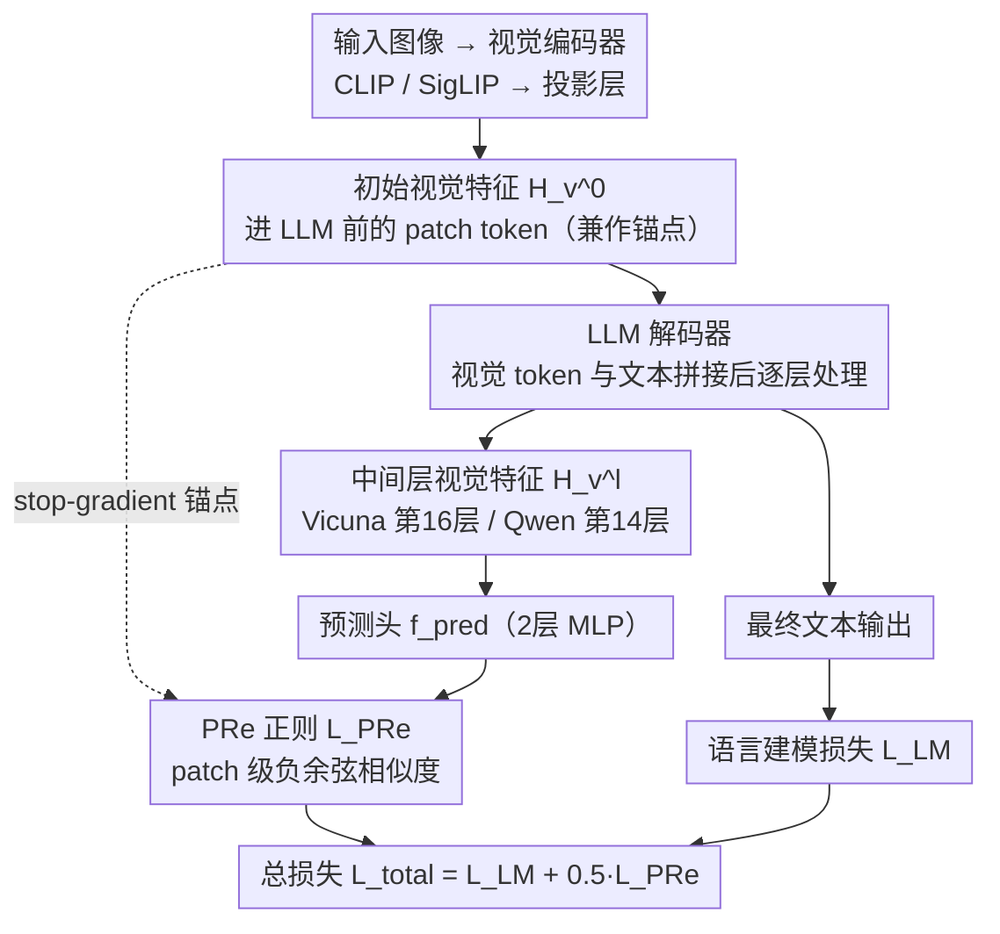

# Predictive Regularization Against Visual Representation Degradation in Multimodal Large Language Models

**会议**: CVPR 2026  
**arXiv**: [2603.20808](https://arxiv.org/abs/2603.20808)  
**代码**: 无  
**领域**: 多模态VLM  
**关键词**: 视觉表征退化、多模态大语言模型、预测正则化、自监督、视觉保真度

## 一句话总结
本文系统诊断了MLLM中LLM中间层视觉表征在全局功能和patch语义结构两个层面的退化现象，揭示其本质是纯文本生成目标下的"视觉牺牲"，并提出Predictive Regularization (PRe) 通过让退化的中间层特征预测初始视觉特征来缓解退化，在多个VL基准上取得一致提升。

## 研究背景与动机

1. **领域现状**：当前MLLM的主流架构是"视觉编码器 + 投影层 + LLM"，训练目标完全由语言建模（next-token prediction）驱动。视觉表征在LLM内部被逐层变换以服务于最终的文本生成任务。
2. **现有痛点**：已有工作主要关注视觉特征在跨模态任务中的功能性（如它如何帮助回答问题），但忽视了一个关键问题：这种纯语言驱动的训练对视觉表征本身的内在质量造成了什么代价？
3. **核心矛盾**：MLLM的训练中不存在直接的视觉监督信号。在单一文本生成目标下，模型会牺牲视觉保真度来优化语言能力。中间层视觉表征的线性分类性能显著下降，patch级别的语义边界变模糊——这就是"视觉退化"。
4. **本文目标** (1) 系统量化并解释MLLM中视觉退化的现象和机制；(2) 设计一种轻量方法来缓解退化而不干扰语言能力。
5. **切入角度**：受预测编码（Predictive Coding）理论启发——高效的神经系统应当持续预测自身底层信号以维持连贯的世界模型。作者将这一原则重新语境化为正则器。
6. **核心 idea**：用一个轻量预测头让LLM中间层的退化视觉特征去预测初始输入视觉特征，以"视觉自预测"正则化来锚定中间表征的视觉保真度。

## 方法详解

### 整体框架
这篇论文先回答一个被忽视的问题——MLLM 在纯文本目标下训练，它内部的视觉表征到底付出了什么代价——然后给出一个最小干预的补救方案。前半程是**诊断 + 归因**（对应关键设计 1、2）：逐层量化视觉退化、再把退化解释成"视觉牺牲"。后半程是**开药**（对应关键设计 3 PRe）：整条 pipeline 沿用标准的"视觉编码器 + 投影层 + LLM"，唯一的改动是挂一条旁路——从 LLM 某个中间层抽出视觉 token 的 hidden states，过一个轻量 MLP 预测头，去预测这些 token 在进入 LLM 之前的初始特征（该锚点做 stop-gradient），用 patch 级负余弦相似度当正则项，和原来的语言建模损失一起优化。不加数据、不改架构。下图画的就是 PRe 这条训练数据流（诊断/归因是分析、不在 pipeline 上）：

### 关键设计

**1. 视觉退化的多层次诊断：先把"退化"这件事量出来**

要缓解退化，得先证明它真的存在、并且量到它有多严重。作者从宏观和微观两个层面取证。宏观上，逐层取出视觉表征做全局平均池化，再训一个线性分类器做 linear probing；结果是中间层相对初始层分类精度明显掉下来，说明全局可分性在退化。微观上，借 COCO-stuff 的分割 mask 把 patch 分到各自的目标，计算同目标内部的 intra-object cohesion 和跨目标之间的 inter-object coupling——发现 coupling 涨得比 cohesion 快，于是 semantic contrast ratio（二者之比）随层数下降，对应可视化里一个 patch 的相似度会"溢出"到不相干的目标上。两条证据合起来：全局功能在退、patch 间的语义边界也在糊。

**2. 退化归因：把退化解释成"视觉牺牲"而非噪声**

诊断之后要回答"为什么会退"，否则解法就是盲猜。作者分析中间层表征的统计特性，发现它恰好是 PCA 有效维度最高、特征相关性最低的一层——也就是中间层在做"展开和解耦"，把表示空间重排成更适合语言生成的形态。再把视角拉到训练过程：追踪预训练期间 VQA 性能和线性探测精度的动态，两条曲线呈明显负相关，语言能力一路涨、视觉保真度一路掉。这就把退化坐实为单一文本目标下的系统性副产品——模型主动牺牲视觉质量去换语言能力，而不是随机扰动。这条因果链直接指向解法：缺什么补什么，给中间层一个视觉锚点。

**3. Predictive Regularization (PRe)：让退化的中间层特征回头预测自己的初始视觉特征**

既然退化是因为中间层为了语言生成把视觉信息冲淡了，那就在这一层加一个"别忘了原来的样子"的约束。具体做法借了预测编码（Predictive Coding）的思路：取 LLM 中间层（如 Vicuna 第 16 层）的视觉 hidden states $\mathbf{H}_v^l$，过一个 2 层 MLP 预测头，去对齐进入 LLM 之前的初始视觉特征 $\mathbf{H}_v^0$，用负余弦相似度作损失。

$$\mathcal{L}_{\text{PRe}} = -\frac{1}{N_p}\sum_{i=1}^{N_p} \mathcal{D}\big(f_{pred}(\mathbf{h}_{v,i}^l),\ \text{stopgrad}(\mathbf{h}_{v,i}^0)\big)$$

$$\mathcal{L}_{\text{total}} = \mathcal{L}_{\text{LM}} + \lambda\,\mathcal{L}_{\text{PRe}},\quad \lambda=0.5$$

三个细节决定了它为什么管用。锚点选 Pre-LLM 的内部特征而不是 DINOv2 之类外部模型，是为了避开表示空间不匹配——同源特征对齐起来没有空间错位。监督放在 patch 级而非全局池化级，因为 patch 级保留了更细的空间结构，监督信号比一个聚合向量丰富得多。锚点 $\mathbf{H}_v^0$ 做 stop-gradient，是防止预测头反过来把锚点也带着一起退化，从而保证它一直是个干净的"参照系"。

### 损失函数 / 训练策略
- 标准 LLaVA 两阶段训练（预训练 558K + 指令微调 665K），不引入额外数据
- 总损失 = 语言建模损失 + $0.5 \times$ PRe 正则化损失
- 正则只加在中间层（Vicuna 第 16 层、Qwen 第 14 层），**不**加在最后层——最后层的视觉 token 已被模型主动"静默"成高频无意义 token，这里强行保视觉结构反而有害

## 实验关键数据

### 主实验

| 配置 (Encoder + LLM) | PRe | GQA | MMMU | AI2D | MMStar | TextVQA | OCRbench | RWQA | MMVP |
|---|---|---|---|---|---|---|---|---|---|
| CLIP* + Vicuna-7B | ✗ | 62.0 | 35.7 | 55.4 | 30.3 | 45.5 | 318 | 54.8 | 20.0 |
| CLIP* + Vicuna-7B | ✓ | **62.7** | **36.1** | **57.1** | **34.6** | **46.6** | **329** | **55.4** | **22.0** |
| SigLIP2 + Qwen2.5-7B | ✗ | 63.5 | 45.8 | 68.9 | 48.0 | 59.2 | 413 | 60.3 | 46.0 |
| SigLIP2 + Qwen2.5-7B | ✓ | **64.4** | **46.2** | **69.5** | 47.8 | **59.7** | **428** | **61.9** | **46.7** |

### 消融实验

| 配置 | GQA | MMMU | TextVQA | RWQA | MMVP |
|------|-----|------|---------|------|------|
| Baseline (CLIP* + Vicuna) | 62.0 | 35.7 | 45.5 | 54.8 | 20.0 |
| PRe @ mid-layer | **62.7** | **36.1** | **46.6** | **55.4** | 22.0 |
| PRe @ last-layer | 62.4 | 35.6 | 45.7 | 54.5 | **25.3** |
| 锚点: Pre-LLM (默认) | 62.7 | **36.1** | 46.6 | **55.4** | 22.0 |
| 锚点: Pre-Proj | 62.7 | 35.1 | 46.4 | 54.4 | **32.7** |
| 锚点: DINOv2 | 62.8 | 35.9 | 46.5 | 54.6 | 28.7 |

### 关键发现
- **中间层 vs 最后层**：PRe应用在中间层效果最好。最后层的视觉token已被模型主动坍缩为高频无意义token（如 '_in', '.', '<<0x0A>>'），此时强制保留视觉结构反而有害。
- **锚点选择**：Pre-LLM内部特征作为锚点综合效果最好，既不存在维度对齐困难（patch merging后的问题），也不存在表示空间不匹配（如DINOv2）。Pre-Proj在MMVP上特别好（+12.7），但有实用性限制。
- **Patch级 vs 全局级**：patch级别正则化全面优于全局正则化，因为能保留更细粒度的空间结构信息。
- **跨架构通用性**：PRe在CLIP/SigLIP编码器 × Vicuna/Qwen LLM × 冻结/可训练编码器的6种配置中均有效。

## 亮点与洞察
- **诊断→归因→解决方案的完整研究范式**：从现象发现到因果分析到解法设计，逻辑链非常完整。这种"先理解再解决"的方式比直接堆模块更有说服力。
- **"视觉退化"这一概念本身**：揭示了MLLM训练的一个被忽视的系统性问题——表征退化是语言优化的代价。这个insight可以启发后续工作设计更好的多目标训练策略。
- **轻量且通用**：PRe只需一个2层MLP + 一个余弦损失，零额外数据，零架构修改，可即插即用到各种MLLM上。这种"最小干预"的设计理念值得学习。

## 局限与展望
- 目前只在7B规模LLM上验证，更大规模模型（如70B）的退化模式和PRe效果未知
- 只选了单一中间层做正则化，多层级联或渐进式正则可能效果更好
- PRe的锚点是静态的初始输入特征，但这些特征本身（来自冻结的CLIP/SigLIP）不一定是最优的视觉表示——是否可以用一个动态更新的"理想视觉锚"？
- 视觉退化的量化指标（线性探测精度）较为间接，是否存在更直接反映"视觉保真度"的指标？

## 相关工作与启发
- **vs JEPA/SimSiam**: PRe将自监督学习中的预测编码原则从"预训练目标"重新语境化为"训练正则器"，这种跨领域借鉴很巧妙
- **vs FastV/Token pruning类方法**: 那些方法通过减少视觉token来加速推理，但可能加剧退化；PRe的思路正好互补——先保住视觉质量再做裁剪
- **vs 多模态幻觉缓解方法**: 视觉退化可能是幻觉的一个底层原因，PRe从表征层面补救，和输出层面的校准方法是互补的

## 评分

- 新颖性: ⭐⭐⭐⭐ 诊断视觉退化现象本身很有价值，PRe方法朴素但切中要害
- 实验充分度: ⭐⭐⭐⭐⭐ 6种架构配置、9个benchmark、详细消融，非常全面
- 写作质量: ⭐⭐⭐⭐⭐ 逻辑清晰，从分析到方法到实验层层递进
- 价值: ⭐⭐⭐⭐ 揭示的退化现象对MLLM社区有广泛启示，方法简单实用

<!-- RELATED:START -->

## 相关论文

- [\[CVPR 2026\] Unleashing the Intrinsic Visual Representation Capability of Multimodal Large Language Models](unleashing_the_intrinsic_visual_representation_capability_of_multimodal_large_la.md)
- [\[CVPR 2026\] Taxonomy-Aware Representation Alignment for Hierarchical Visual Recognition with Large Multimodal Models](taxonomy-aware_representation_alignment_for_hierarchical_visual_recognition_with.md)
- [\[CVPR 2026\] PointAlign: Feature-Level Alignment Regularization for 3D Vision-Language Models](pointalign_feature-level_alignment_regularization_for_3d_vision-language_models.md)
- [\[CVPR 2026\] Multimodal Learning on Low-Quality Data with Conformal Predictive Self-Calibration](multimodal_learning_on_low-quality_data_with_conformal_predictive_self-calibrati.md)
- [\[CVPR 2026\] ReMoRa: Multimodal Large Language Model based on Refined Motion Representation for Long-Video Understanding](remora_multimodal_large_language_model_based_on_refined_motion_representation_fo.md)

<!-- RELATED:END -->
