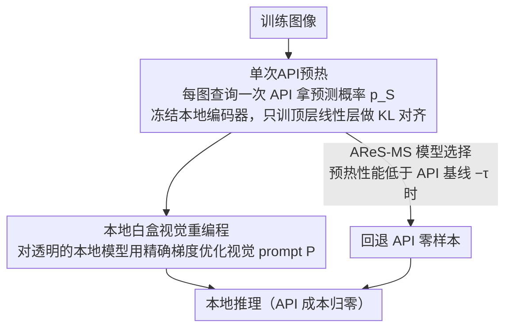

# Prime Once, then Reprogram Locally: An Efficient Alternative to Black-Box Service Model Adaptation

**会议**: CVPR 2026  
**arXiv**: [2604.01474](https://arxiv.org/abs/2604.01474)  
**代码**: [https://github.com/yunbeizhang/AReS](https://github.com/yunbeizhang/AReS)  
**领域**: 多模态VLM  
**关键词**: 模型即服务, 黑盒适配, 视觉重编程, 零阶优化, API高效利用

## 一句话总结

本文提出AReS方法，用单次API查询预热本地编码器代替传统零阶优化（ZOO）的持续API调用，在GPT-4o上获得+27.8%提升（ZOO方法几乎无效），同时将API调用量减少99.99%以上，实现了无成本推理。

## 研究背景与动机

1. **领域现状**：Model-as-a-Service（MaaS）是部署SOTA模型的主流范式，用户只能通过API获取输入-输出的预测结果。闭盒视觉重编程（如BAR、BlackVIP）通过零阶优化修改输入图像来适配API模型。
2. **现有痛点**：ZOO方法面临三重困境：(1)需要海量API调用（约10^8次），训练和推理成本极高；(2)梯度估计不稳定，优化过程缓慢且不可靠；(3)现代强大API（如GPT-4o）对输入扰动具有鲁棒性，ZOO依赖的微小输入扰动被模型忽略，导致几乎无法获得性能提升。
3. **核心矛盾**：ZOO方法的根本假设是"通过扰动输入可以影响模型输出"，但现代模型越强大，对扰动越鲁棒，使得这一假设逐渐失效。
4. **本文目标** 如何在最严格的闭盒设定下（仅有输入-预测概率访问）高效适配服务模型，尤其当ZOO方法对现代API无效时。
5. **切入角度**：与其在闭盒模型上持续做代价昂贵的零阶优化，不如进行一次性API交互获取知识，在本地模型上做高效的白盒优化。
6. **核心 idea**：单次查询API预热本地编码器，然后在本地完成全部视觉重编程和推理，彻底消除后续API依赖。

## 方法详解

### 整体框架

AReS要解决的核心问题是：在最严格的闭盒设定下（只能拿到API的输入-预测概率），怎样高效适配一个服务模型，又不被海量API调用的成本拖垮。它的破局点是把"持续优化闭盒模型"换成"一次交互、本地优化"——分成前后两个阶段。第一阶段叫 **Prime Once（预热）**：对每张训练图只查询一次API拿到预测概率，用这些概率训练一个挂在本地编码器顶上的轻量线性层，让本地模型先学会"模仿"服务模型的反应方式。第二阶段叫 **Reprogram Locally（本地重编程）**：在这个已经预热好的本地模型上，用标准梯度下降优化视觉prompt，全程白盒、不再碰API。推理时只跑本地模型，API成本归零。此外 AReS-MS 在预热后插入一个几乎零成本的诊断闸门，决定这条本地路径到底值不值得走。

### 关键设计

**1. 单次API预热：用一次交互把服务模型的"感觉"搬到本地**

ZOO方法之所以贵又不稳，是因为它要靠成千上万次扰动输入、间接探测闭盒模型的反应来估梯度。AReS干脆换个思路：每张训练图只问API一次，把它返回的预测概率 $p_S(x_i)$ 当成"答案纸"，让本地模型一次性对齐过去。具体做法是冻结本地编码器主干，只训练顶层一个线性层 $\theta \in \mathbb{R}^{K^S \times (d_{enc}+1)}$，最小化本地输出与服务模型输出之间的KL散度 $\mathcal{L}_P(p_L, p_S) = -\sum_j p_{S,j} \log p_{L,j}$。

这里有个容易和知识蒸馏混淆、但其实关键的区别：预热**不要求标签空间一致**。哪怕API是在ImageNet标签空间上吐概率、而目标任务是Flowers，预热照样有效——因为它的目的不是产出一个直接能用的高性能模型，而是让本地模型对后续的重编程更"敏感"、更"可编程"。换句话说，蒸馏追求终点性能、必须对齐标签；预热只是把本地模型"调到对的状态"，让下一步的视觉prompt更容易撬动它。

**2. 本地白盒视觉重编程：把闭盒难题降级成白盒易题**

预热之后，真正的适配交给本地这一步。定义一个可学习的视觉prompt $\mathbf{P}$ 和输入变换 $g_{in}$，目标是

$$\mathbf{P}^* = \arg\min_{\mathbf{P}} \mathbb{E}_{(x,y)} \big[\ell(g_{out}(\mathcal{F}_L(g_{in}(x, \mathbf{P}); \theta^*)), y)\big]$$

由于本地模型对自己完全透明，这一步能拿到**精确梯度**、直接用Adam这类一阶优化器去优化prompt，而不是像ZOO那样靠近似梯度盲走。原本"扰动输入、探测闭盒、估梯度"的不稳定闭环，被整个挪到本地变成一个常规的白盒训练问题——收敛更快、也更稳。

**3. AReS-MS模型选择：让预热顺便当一次免费的"该不该用本地"诊断**

有个现实问题：输入级重编程并非对所有数据域都管用。作者发现在Food101、Cars这类数据集上，所有重编程方法（连白盒的也算）都干不过CLIP零样本，说明这些领域天生不吃"在输入上贴prompt"这一套。AReS-MS的应对是把预热阶段同时当成一个**几乎零成本的诊断探针**：如果本地模型预热后的性能落在API零样本基线的容忍度 $\tau$ 之内，就走高效的本地路径；否则就老实回退到零样本API。这样AReS不只是个适配方法，而是带了成本-性能权衡的决策框架，能自动避开那些"重编程注定吃亏"的场景。

### 损失函数 / 训练策略

预热阶段：KL散度损失，Adam优化器lr=0.001。重编程阶段：交叉熵损失，Adam优化器lr=0.01，padding-based视觉prompt。对于VM（标准视觉模型），需额外使用贝叶斯标签映射（BLM）来桥接源/目标标签空间差异。

## 实验关键数据

### 主实验（CLIP ViT-B/16作为服务模型, 16-shot）

| 方法 | Flowers | DTD | UCF | Food | GTSRB | EuroSAT | Pets | Cars | SUN | SVHN | Avg | API调用(M) | 时间(h) |
|------|---------|-----|-----|------|-------|---------|------|------|-----|------|-----|----------|--------|
| Zero-shot | 71.3 | 43.9 | 66.9 | 85.9 | 21.0 | 47.9 | 89.1 | 65.2 | 62.6 | 17.9 | 57.2 | 0.12 | 0 |
| BAR | 71.0 | 46.8 | 64.2 | 84.4 | 21.5 | 77.3 | 88.4 | 63.0 | 62.4 | 34.6 | 61.4 | 612.8 | 185.6 |
| BlackVIP | 70.6 | 45.3 | 68.7 | 85.9 | 21.3 | 73.3 | 89.1 | 65.4 | 64.5 | 44.4 | 62.9 | 754.2 | 197.5 |
| **AReS** | **86.6** | 48.2 | 67.1 | 68.8 | **39.4** | **85.7** | 88.9 | 43.2 | 62.8 | **63.2** | **65.4** | **0.02** | **3.7** |
| **AReS-MS** | **86.6** | 48.2 | 67.1 | **85.9** | **39.4** | **85.7** | 88.9 | **65.2** | 62.8 | **63.2** | **69.3** | 0.06 | 3.7 |

### 消融实验（真实API评估，EuroSAT 16-shot）

| 方法 | LLaVA Acc | GPT-4o Acc | GPT-4o 总费用($) | Clarifai Acc | Clarifai 总费用($) |
|------|-----------|-----------|----------------|-------------|-------------------|
| Zero-shot | 40.1 | 59.4 | 14.6 | - | - |
| BAR | 34.1 | 59.1 | 72.2 | 68.1 | 48.1 |
| BlackVIP | 39.4 | 60.1 | 101.0 | 72.1 | 67.3 |
| **AReS** | **73.1** | **87.2** | **0.3** | **83.2** | **0.2** |

### 关键发现

- **GPT-4o上的巨大优势**：AReS在GPT-4o上提升+27.8%（59.4→87.2），而BlackVIP仅提升+0.7%。这直接证实了ZOO方法在强鲁棒API面前失效的论断。
- **API调用减少99.99%以上**：AReS仅需0.02M次API调用（vs BlackVIP的754M），训练时间从197小时降至3.7小时。
- **组件分析**：仅预热（45.6%）< 仅本地VR（70.6%）< 仅本地LP（73.8%）< 本地VR+LP（80.1%）< AReS完整方案（85.7%），预热+重编程的协同效应显著。
- **额外无标签数据的利用**：预热阶段可利用无标签下游数据进一步提升性能，这是ZOO方法无法实现的优势。

## 亮点与洞察

- **范式转换**：从"在闭盒模型上持续优化"转向"一次交互+本地优化"，这是一个根本性的思路转变。关键洞察是：与其花大代价直接优化闭盒模型，不如用少量代价让本地模型变得更可编程。
- **预热≠蒸馏**：预热与知识蒸馏在机制上相似，但目的完全不同。蒸馏追求最终性能，需要标签空间对齐；预热只是"准备"，即使标签空间完全不同也能工作。这个区分非常巧妙。
- **理论保证**：通过$\epsilon$-忠实预热假设建立了性能界限 $\mathcal{R}_L(\mathcal{D}^T, \mathbf{P}^*) - \epsilon \leq \mathcal{R}_S(\mathcal{D}^T, \mathbf{Q}^*) \leq \mathcal{R}_L(\mathcal{D}^T, \mathbf{P}^*)$，将ZOO的不稳定优化转化为本地的稳定优化问题。

## 局限与展望

- 在Food101和Cars上，AReS（以及所有重编程方法）不如零样本CLIP，说明输入级视觉重编程对某些数据域有天然局限
- 预热阶段仍需对所有训练样本做一次API查询，在大规模数据集上可能成本不低
- 仅验证了图像分类任务，对检测、分割等需要密集预测的任务的适用性未知
- 本地编码器的选择对性能有较大影响（ViT-B/16 vs RN50差距明显），如何自动选择最佳本地编码器值得探索

## 相关工作与启发

- **vs BlackVIP**：BlackVIP用SPSA-GC估计梯度并引入Coordinator网络，但本质仍是ZOO。AReS通过预热彻底避开了闭盒优化。两者都假设有相同的本地编码器可用。
- **vs BAR**：BAR用随机无梯度(RGF)优化，API调用量更大（612M vs 754M BlackVIP），且在强API上效果更差。
- **vs 知识蒸馏**: 传统蒸馏需要标签空间对齐，目标是学生模型独立达到高性能。AReS的预热允许标签空间不匹配，且后续还有重编程步骤来弥补差距。

## 评分

- 新颖性: ⭐⭐⭐⭐⭐ 范式转换级别的创新，从持续闭盒优化到一次预热+本地优化
- 实验充分度: ⭐⭐⭐⭐⭐ 10个数据集+多种服务模型（CLIP/ViT/LLaVA/GPT-4o/Clarifai），真实费用对比
- 写作质量: ⭐⭐⭐⭐ 故事叙述流畅，实验设计精巧，但符号记法偶有重载
- 价值: ⭐⭐⭐⭐⭐ 解决了实际痛点（API成本），且在GPT-4o时代尤为重要

<!-- RELATED:START -->

## 相关论文

- [\[CVPR 2026\] Test-Time Distillation for Continual Model Adaptation](test-time_distillation_for_continual_model_adaptation.md)
- [\[CVPR 2026\] Parameter-Efficient Adaptation for MLLMs via Implicit Modality Decomposition](parameter-efficient_adaptation_for_mllms_via_implicit_modality_decomposition.md)
- [\[CVPR 2026\] Decoupled and Reusable Adaptation for Efficient Cross-Modal Transfer](decoupled_and_reusable_adaptation_for_efficient_cross-modal_transfer.md)
- [\[CVPR 2026\] Vision-Language Model Guided Source-Free Domain Adaptation via Optimal Transport](vision-language_model_guided_source-free_domain_adaptation_via_optimal_transport.md)
- [\[CVPR 2026\] Enhance-then-Balance Modality Collaboration for Robust Multimodal Sentiment Analysis](enhance-then-balance_modality_collaboration_for_robust_multimodal_sentiment_anal.md)

<!-- RELATED:END -->
