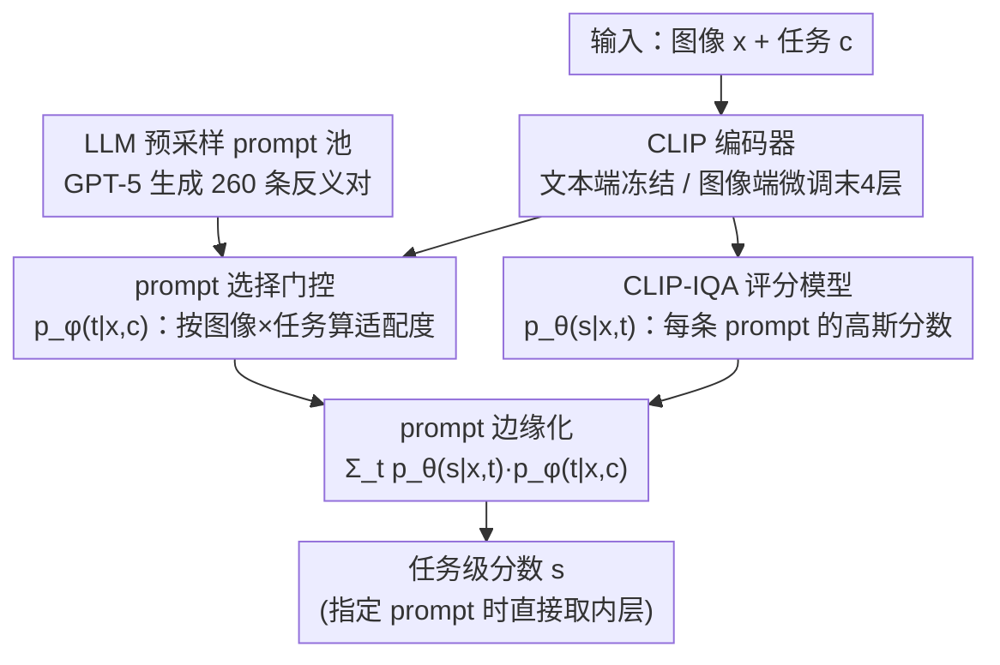

# Probabilistic Prompt Adaptation for Unified Image Aesthetics and Quality Assessment

**会议**: CVPR 2026  
**论文**: [CVF Open Access](https://openaccess.thecvf.com/content/CVPR2026/html/Hara_Probabilistic_Prompt_Adaptation_for_Unified_Image_Aesthetics_and_Quality_Assessment_CVPR_2026_paper.html)  
**代码**: 待确认  
**领域**: 多模态VLM  
**关键词**: 图像美学评估, 图像质量评估, CLIP, prompt 边缘化, 概率混合模型

## 一句话总结
PPA 把"用哪句文本 prompt 来评分"当成一个隐变量，对一池由 LLM 预采样的对立 prompt 做概率加权边缘化，从而在**只用 (任务, 图像, 分数) 三元组、不需要任何 prompt/属性标注**的情况下，同时学到一个高精度的任务打分器和一个可被任意文本 prompt 控制的通用美学/质量评估器。

## 研究背景与动机
**领域现状**：图像美学评估（IAA）和图像质量评估（IQA）已经从手工特征走到 CNN、ViT，再到用 CLIP 这类视觉-语言模型（VLM）做文本驱动的评分。CLIP-IQA 这类方法用一对反义 prompt（如 "Good photo." / "Bad photo."）算图文余弦相似度的 softmax，就能给图像打分，天然带来"用文字描述评价标准"的灵活性。

**现有痛点**：现有方法陷在一个二选一里。一头是 CLIP-IQA 这种零样本 prompt 评分，灵活但精度低——因为 CLIP 的嵌入是为语义对齐训练的，而非感知质量；另一头是把 CLIP 在 IAA/IQA 上微调的方法（UniQA、IAACLIP 等），精度高但牺牲了对任意 prompt 的响应能力，而且其"按文本评价"的能力被现有文本标注的数量和质量死死卡住。

**核心矛盾**：**高精度打分**与**评分维度的多样性/可控性**之间存在 trade-off。想精度高就得在固定任务上微调，想灵活就得放弃精度，二者很难兼得。

**本文目标**：做一个既能逼近 SOTA 精度、又能被任意文本 prompt 细粒度控制评分语义的统一 IAA/IQA 框架，且训练**不依赖** prompt 级或属性级标注。

**切入角度**：作者假设——评价一张图的"最优文字描述"同时取决于图像内容 $x$ 和当前任务 $c$（不同数据集 = 不同评价标准）。于是把文本 prompt 当作**隐语义变量**，对它建一个"prompt 适配度"的概率分布，再边缘化掉。

**核心 idea**：把分数预测写成"在一池 prompt 上的混合模型"$p(s\mid x,c)=\sum_t p_\theta(s\mid x,t)\,p_\phi(t\mid x,c)$，用任务级监督（只需分数）去最大化边缘似然，从而无标注地学到 prompt 选择 + 分数预测。

## 方法详解

### 整体框架
PPA 的输入是一张图像 $x$ 和一个任务 $c$（评价标准，每个数据集一个），输出是分数 $s$。整套框架分两层嵌套：内层是 **prompt-specific scoring**，给定图像 $x$ 和某个文本 prompt $t$ 算出分数分布 $p_\theta(s\mid x,t)$；外层是 **task-specific scoring**，把任务 $c$ 下所有候选 prompt 的分数按"适配度"$p_\phi(t\mid x,c)$ 加权求和（边缘化），得到任务级分数分布 $p(s\mid x,c)$。候选 prompt 不是学出来的，而是事先用 GPT-5 采样好的一池 260 条反义 prompt 对。训练时只给 (任务, 图像, 分数) 三元组，最小化负对数似然；推理时既可指定任务 $c$（走边缘化），也可直接给一句 prompt $t$（走内层），实现 prompt 可控评分。

### 关键设计

**1. LLM 预采样 prompt 池：把"无穷多种说法"压成可枚举的离散专家集**

混合模型 $\sum_{t\in\mathcal{T}}$ 理论上要对所有可能 prompt 求和，不可行。作者改成在一个由 GPT-5 预采样的子集 $\mathcal{T}_{\text{samp}}$ 上求和：美学侧取 11 个属性（趣味性、主体强调、光线、色彩和谐、鲜艳度、景深、动态模糊、三分法、平衡、重复图案、对称），质量侧取 9 个属性（模糊、色彩、对比度、压缩、噪声、过曝、量化、欠曝、局部异常），每个属性生成 4 对反义 prompt（"XXX photo." / "YYY photo." 形式）；再额外生成 100 条美学 + 80 条质量的无属性反义对，合计 **260 条** prompt。这一池 prompt 就是一组**固定、可解释的自然语言"专家"**，模型只需推断它们的权重，而不必去发明 prompt——这也是它和把 prompt 当连续向量学（CoOp 系）的根本区别。

**2. 图像×任务条件的 prompt 选择门控：决定"此图此任务该信哪句话"**

针对"最优描述依赖内容和任务"的假设，PPA 用一个选择模型 $p_\phi(t\mid x,c)$ 给每条候选 prompt 打权重。它把图像、prompt、任务各自嵌入：图像嵌入 $e_{\text{image}}=I(x)$ 来自 CLIP 图像编码器，文本嵌入 $e_{\text{text}}=T(t_{\text{pos}})-T(t_{\text{neg}})$ 取反义对之差，任务嵌入 $e_{\text{task}}$ 是每个任务一个可学习向量（维度 $C=4$）。两个两层 MLP 分别把 $e_{\text{image}}\oplus e_{\text{task}}$ 和 $e_{\text{text}}\oplus e_{\text{task}}$ 投到共享空间，得到 $f_{\phi_1}(x,c)$ 与 $g_{\phi_2}(t,c)$，再做 softmax：

$$p_\phi(t\mid x,c)=\frac{\exp\!\big(f_{\phi_1}(x,c)^\top g_{\phi_2}(t,c)\big)}{\sum_{t'\in\mathcal{T}_{\text{samp}}}\exp\!\big(f_{\phi_1}(x,c)^\top g_{\phi_2}(t',c)\big)}.$$

作者点明这在概念上像 MoE 的门控，但"专家"是固定可解释的自然语言 prompt，模型只学权重。

**3. 基于 CLIP-IQA 的高斯评分模型：把"相似度"变成可边缘化的分数分布**

内层 $p_\theta(s\mid x,t)$ 建成一个高斯分布，均值就是 CLIP-IQA 分数 $\bar s_\theta(x,t)$，方差是超参 $\sigma^2$（实验取 $\sigma=0.1$）。CLIP-IQA 分数本身定义为反义 prompt 对在 CLIP 空间里的相似度 softmax：

$$\bar s(x,t)=\frac{\exp\!\big(I(x)^\top T(t_{\text{pos}})\big)}{\exp\!\big(I(x)^\top T(t_{\text{pos}})\big)+\exp\!\big(I(x)^\top T(t_{\text{neg}})\big)}.$$

参数 $\theta$ 只是图像编码器中**被选中的若干层**（实验里微调末 4 个 block）的权重，文本编码器冻结。这样既增强感知对齐，又尽量保住预训练的语义对齐能力。把分数包成分布而非标量，是为了让外层能干净地做加权边缘化。

**4. prompt 边缘化 + 任务级 NLL 训练：用分数一项监督就同时学好两个模型**

把内外层串起来，分数分布写成混合：$p(s\mid x,c)=\sum_{t\in\mathcal{T}_{\text{samp}}} p_\theta(s\mid x,t)\,p_\phi(t\mid x,c)$。训练就是在三元组 $\{(x_i,c_i,s_i)\}$ 上最小化负对数似然：

$$\mathcal{L}=-\sum_{i=1}^N\log\!\sum_{t\in\mathcal{T}_{\text{samp}}}\exp\!\Big(-\tfrac{(s_i-\bar s_\theta(x_i,t))^2}{2\sigma^2}\Big)p_\phi(t\mid x_i,c_i)+\text{const.}$$

这一项监督会自动把权重压到"能让预测分数贴近真值"的 prompt 上，于是 $\theta$（打分）和 $\phi$（选 prompt）被联合学好，全程不需要任何 prompt/属性标注。推理时给定任务取期望 $\mathbb{E}[s]=\sum_t \bar s_\theta(x,t)\,p_\phi(t\mid x,c)$；若直接指定 prompt $t$，则取 $\bar s_\theta(x,t)$，实现任意文本可控评分。

> ⚠️ **框架↔关键设计一致性**：框架图自上而下的 4 个贡献节点（LLM 预采样 prompt 池 → prompt 选择门控 → CLIP-IQA 评分模型 → prompt 边缘化训练）与上面 4 个关键设计一一对应；CLIP 编码与输入/输出为脚手架节点，不单列设计。

## 实验关键数据

数据集：5 个 IAA（AVA、AADB、TAD66k、PARA、BAID）+ 7 个 IQA（KonIQ-10k、SPAQ、TID2013、KADID-10k、CSIQ、LIVE、LIVEC）。骨干 CLIP-B/16，Adam（lr=1e-5），单张 V100 32GB。两个变体：**PPA**（多数据集共享权重）、**PPA-T**（单数据集专用）。评测主指标 SRCC（Spearman 秩相关，衡量排序一致性）和 PLCC（Pearson 线性相关，衡量数值线性吻合），越高越好。

### 主实验
任务级精度（节选 IAA/IQA 代表数据集，SRCC）：

| 数据集 | 指标 | PPA | PPA-T | 代表对手 | 说明 |
|--------|------|------|-------|----------|------|
| PARA (IAA) | SRCC | 0.913 | **0.919** | 0.905 (Charm) | PPA-T 取得 SOTA |
| BAID (IAA) | SRCC | **0.497** | 0.385 | 0.473 (SAAN) | 共享权重版最佳 |
| SPAQ (IQA) | SRCC | 0.934 | **0.941** | 0.929 (Gamma+) | PPA-T 取得 SOTA |
| AVA (IAA) | SRCC | 0.737 | 0.780 | 0.791 (IAACLIP) | 落后但在 4% 内 |
| KonIQ-10k (IQA) | SRCC | 0.918 | 0.927 | 0.945 (Gamma-T) | 落后但在 4% 内 |

PPA/PPA-T 在 PARA、BAID、SPAQ 上拿到 SOTA，其余数据集相对最佳结果保持在约 4% 精度差以内——即在**保留 prompt 可控灵活性**的前提下，做到了与固定单分数 SOTA 方法相当的精度。

人评（Tab.1，757 名众包参与者，每条 prompt 300 次两两对比）显示：PPA 在**低层感知属性**（对焦、色彩干净度、对比平衡、边缘锐度、曝光控制）上对 CLIP-IQA / UniQA 的胜率显著占优（多条 p<0.001）；在抽象/情绪类美学 prompt（如 "warm and beautiful photo"）上优势减弱，作者归因于训练 prompt 池语义多样性有限。

### 消融实验
prompt 选择模型的条件化（12 数据集平均 SRCC/PLCC，Tab.7）：

| 配置 | SRCC | PLCC | 说明 |
|------|------|------|------|
| 固定均匀权重（不学权重） | 0.759 | 0.778 | prompt 等权平均 |
| 仅按任务条件 | 0.803 | 0.820 | 加任务条件 |
| 仅按图像条件 | 0.764 | 0.783 | 只看图像 |
| 任务 + 图像（完整） | **0.808** | **0.828** | 动态门控最优 |

prompt 数量（Tab.8，SRCC/PLCC）：

| 总数 | 属性 prompt | 无属性 prompt | SRCC | PLCC |
|------|-------------|---------------|------|------|
| 40 | 40 | 0 | 0.802 | 0.823 |
| 80 | 80 | 0 | 0.806 | 0.824 |
| 160 | 160 | 0 | 0.796 | 0.815 |
| **260** | 80 | 180 | **0.808** | **0.828** |
| 340 | 160 | 180 | 0.801 | 0.821 |

### 关键发现
- **动态门控是关键**：把 prompt 权重从均匀改为按"任务×图像"动态估计，SRCC 从 0.759 提到 0.808；其中任务条件贡献最大（单任务条件已达 0.803），图像条件再补一点。
- **prompt 多样性比数量更重要**：260 条（80 属性 + 180 无属性）最佳；把 prompt 集中在语义高度相似的窄区间反而掉点，说明覆盖广义的语义空间才有效。
- **PPA 擅长低层/构图线索**：属性级分析（AADB/SPAQ）显示动态模糊、三分法、重复图案、对比度、噪声等属性训练后增益最大；景深、主体强调这类局部/语义线索增益较小。
- **特征空间更可分**：t-SNE 显示训练后按分数高低分簇更清晰；Between/Within 方差比（BW，越大越可分）上 PPA 在 AADB/SPAQ 均高于"固定单 prompt 微调"基线。

## 亮点与洞察
- **把 prompt 选择问题转成"带固定专家的 MoE 门控"**：专家是人类可读的自然语言 prompt，模型只学权重——这让"无标注 + 可解释 + 可控"三者同时成立，是很巧的建模角度。
- **只用分数一项监督就同时训出选择器和打分器**：通过边缘化 + NLL，prompt 权重被"哪条 prompt 让分数更准"隐式监督，省掉了昂贵的 prompt/属性标注。
- **一个模型两种用法**：训练得到任务打分器的同时，副产物是一个可被任意 prompt 驱动的通用评估器，迁移性强——这套"隐变量边缘化"思路可迁到任何"标准依赖文本描述"的评分/检索任务（如可控图像检索、创作辅助）。

## 局限与展望
- 作者承认：对抽象/高层美学 prompt（情绪、氛围）一致性下降，部分源于 LLM 生成 prompt 池语义多样性不足；扩充更丰富语义的 prompt 池可能改善。
- 候选 prompt 是**离线固定**的 260 条，覆盖面受 GPT-5 一次性生成质量限制，无法在推理时按新需求动态扩展；未来与 MLLM 端到端做 prompt 精炼是方向。
- ⚠️ 评分依赖 CLIP-IQA 的图文相似度作为分数均值，其上限仍受 CLIP-B/16 表征能力约束；论文未在更大骨干上验证可扩展性。
- 推理需对整池 prompt 求和（260 条前向），相比单分数模型有额外开销，效率对比放在补充材料，正文未充分讨论。

## 相关工作与启发
- **vs CLIP-IQA**：CLIP-IQA 用固定反义 prompt 直接算相似度，零样本但精度受限；PPA 把多条 prompt 边缘化并微调图像编码器末层，精度大幅提升且保留 prompt 可控性。
- **vs UniQA / IAACLIP（特征对齐微调）**：它们靠人工/MLLM 标注的图文对做特征空间对齐，精度高但被标注量质卡住、灵活性弱；PPA 完全无 prompt/属性标注，靠概率边缘化获得灵活控制。
- **vs CoOp 系连续 prompt 学习**：CoOp 把 prompt 当可学习连续向量替代手工模板；PPA 反其道用**固定自然语言 prompt 当专家**、只学其权重分布，因此可解释、可被任意新 prompt 直接驱动。
- **vs ProDA / 多 prompt 分布方法**：同样建模"多 prompt 分布"，但 PPA 用任务级监督 + 显式边缘化，且把权重显式条件化在"图像×任务"上，更贴近 MoE 门控直觉。

## 评分
- 新颖性: ⭐⭐⭐⭐ 把 prompt 当隐变量边缘化 + 固定 NL 专家门控，建模角度新颖；但底座仍是 CLIP-IQA 框架的扩展。
- 实验充分度: ⭐⭐⭐⭐ 覆盖 12 个 IAA/IQA 数据集 + 大规模人评 + 多组消融，较充分；缺更大骨干与效率正文讨论。
- 写作质量: ⭐⭐⭐⭐ 公式与动机清晰，框架两层结构讲得明白。
- 价值: ⭐⭐⭐⭐ 给"高精度 + 可控评分"提供了一个无标注、可解释的统一范式，实用价值高。

<!-- RELATED:START -->

## 相关论文

- [\[CVPR 2026\] UARE: A Unified Vision-Language Model for Image Quality Assessment, Restoration, and Enhancement](uare_a_unified_vision-language_model_for_image_quality_assessment_restoration_an.md)
- [\[ICLR 2026\] VisJudge-Bench: Aesthetics and Quality Assessment of Visualizations](../../ICLR2026/multimodal_vlm/visjudge-bench_aesthetics_and_quality_assessment_of_visualizations.md)
- [\[CVPR 2026\] R4-CGQA: Retrieval-based Vision Language Models for Computer Graphics Image Quality Assessment](r4-cgqa_retrieval-based_vision_language_models_for_computer_graphics_image_quali.md)
- [\[CVPR 2026\] STAR: Test-Time Adaptation Can Enhance Universal Prompt Learning for Vision-Language Models](star_test-time_adaptation_can_enhance_universal_prompt_learning_for_vision-langu.md)
- [\[CVPR 2026\] FluoCLIP: Stain-Aware Focus Quality Assessment in Fluorescence Microscopy](fluoclip_stain-aware_focus_quality_assessment_in_fluorescence_microscopy.md)

<!-- RELATED:END -->
