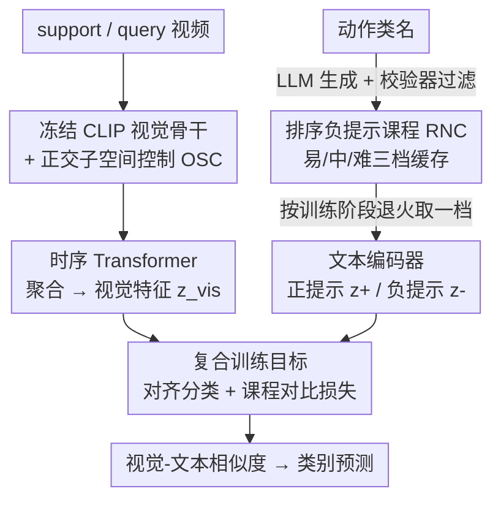

# Protect to Adapt: Orthogonal Subspace Control with Ranked Negative-Prompt Curriculum for Few-Shot Action Recognition

**会议**: CVPR 2026  
**论文**: [CVF Open Access](https://openaccess.thecvf.com/content/CVPR2026/html/Qi_Protect_to_Adapt_Orthogonal_Subspace_Control_with_Ranked_Negative-Prompt_Curriculum_CVPR_2026_paper.html)  
**代码**: 无  
**领域**: 多模态VLM  
**关键词**: 视觉语言模型适配, 参数高效微调, 正交子空间, 难负样本课程, 少样本动作识别

## 一句话总结
把 CLIP 适配到少样本动作识别（FSAR）时，作者用「正交子空间控制（OSC）」把 LoRA 更新约束到预训练权重主子空间的正交补里，避免破坏通用语义、抑制灾难性遗忘；再用「排序负提示课程（RNC）」让 LLM 生成由易到难、经校验器过滤的类内难负样本去拉大决策边界——只训 2% 参数就在 5 个 FSAR 基准上刷到 SOTA。

## 研究背景与动机
**领域现状**：少样本动作识别（FSAR）的主流早已从「设计 episodic 元学习/度量学习算法」转向「把强大的视觉语言模型（VLM，如 CLIP）适配过来」。代表作 CLIP-FSAR 直接全量微调 CLIP 视觉骨干，再加一层 prototype modulation 调整视频表征，效果不错。

**现有痛点**：全量微调（fully fine-tune）会把 CLIP 预训练学到的跨模态对齐结构改坏——零样本迁移能力退化、灾难性遗忘加剧，这在「依次适配多个数据集」的持续学习场景里尤其致命。反过来，冻结骨干只加轻量 adapter 虽然省参数，但在少样本下适配能力又不够。更隐蔽的一点是：FSAR 的每个 episode 里，一个 query 只对比一个正类 + 几个负类，文本编码器几乎见不到决策边界附近的难负样本，于是类间间隔（inter-class margin）很小、边界很糊。

**核心矛盾**：知识保留 vs 任务适配之间的两难。普通 LoRA 的低秩更新会不自觉地顺着预训练权重的主导方向走，把通用语义直接覆盖掉；而少样本对比信号又太弱，不足以撑起清晰的类间边界。

**本文目标**：在「只动很少参数」的前提下，既保住 VLM 的通用先验，又能学到任务专属判别力，同时把决策边界磨锐。

**切入角度**：作者把问题拆成两个互补的失败模式分别治理——一个在**参数层面**（更新该往哪个方向走），一个在**数据层面**（用什么样的负样本去监督）。

**核心 idea**：OSC 决定「适配在哪里发生」（约束到主语义子空间的正交补），RNC 决定「适配怎么用难负样本」（由易到难的负提示课程），二者一个管 where、一个管 how，组成 Protect-to-Adapt（P2A）。

## 方法详解

### 整体框架
P2A 在标准 N-way K-shot episodic 协议下工作：给定 support/query 视频，一个**冻结**的视觉骨干（CLIP ViT-B/16）配合 OSC 产出视觉 token $z_{vis}$；文本编码器同时给出正类提示嵌入 $z_{text}^+$ 和课程排序的负提示嵌入 $z_{text}^-$；视觉特征经时序 Transformer 聚合后，在共享嵌入空间里用视觉-文本相似度做预测。训练时只解冻 LoRA 的两个低秩分支（约占骨干 2% 参数），用「对齐分类损失 + 课程对比损失」的复合目标优化。

整条管线的两个核心模块分别作用在不同层面：OSC 是**参数级**的——对选定权重矩阵做 SVD、把 LoRA 增量投影到主子空间正交补；RNC 是**数据级**的——离线让 LLM 为每个动作类生成三档难度的负提示、经校验器过滤缓存后，按训练阶段由易到难地喂进对比损失。

### 关键设计

**1. 正交子空间控制 OSC：把低秩更新关进主语义子空间的「正交补」里**

针对「普通 LoRA 会顺着主导方向覆盖通用语义」这个痛点，OSC 的思路是：预训练权重里稳定、可迁移的知识集中在一个主导子空间 $S_p$，那就别在这个方向上乱动，只让适配发生在它的正交补 $S_p^\perp$（这些方向能量稀疏，正好留给任务专属可塑性）。

具体做法分两步。先做**主子空间识别**：对待微调权重 $W_0 \in \mathbb{R}^{d_1\times d_2}$ 做 SVD，$W_0 = U\Sigma V^\top = \sum_i \sigma_i u_i v_i^\top$，取左奇异向量 $U$ 的前 $k$ 列构成主子空间（之所以选 $U$ 而非 $V$，是因为 LoRA 的上投影分支 $B\in\mathbb{R}^{d_1\times r}$ 活在这个输出空间里）。保护秩 $k$ 不靠手调阈值，而是用**基于熵的有效秩**自适应：把奇异值归一化成概率 $p_i = \sigma_i / \sum_j \sigma_j$，再取

$$k = \left\lfloor \exp\!\Big(-\sum_{i=1}^{D} p_i \log p_i\Big) \right\rfloor.$$

它本质是奇异值能量分布的香农熵，尺度不变、无需阈值——谱越平（语义方向越分散）的层分到越大的保护子空间，谱越集中的层保护越少，自动在稳定性与可塑性之间平衡。

第二步是**子空间约束更新**：构造投影算子 $P_k^\perp = I_{d_1} - U_k U_k^\top$，把低秩增量 $BA$ 投到正交补，得到 $\Delta W = P_k^\perp BA = (I_{d_1} - U_k U_k^\top)\,BA$，并满足约束 $U_k^\top \Delta W = 0$。这个约束的几何含义很干净：对任意输入 $x$ 都有 $U_k^\top(W_0+\Delta W)x = U_k^\top W_0 x$，即预激活响应在主子空间上的投影**精确不变**——通用知识被「冻」住，新知识只能往正交补里长。工程上投影可吸收进 $B$ 分支（$B = P_k^\perp \tilde{B}$），参数量仍是 LoRA 的 $r(d_1+d_2)$，$U_k$ 只算一次截断 SVD 并缓存，每层每次前向额外开销仅 $O(d_1 k r)$。

**2. 排序负提示课程 RNC：让 LLM 造出由易到难的类内难负样本来磨锐边界**

针对「少样本 episode 里文本编码器见不到决策边界附近难负样本、类间间隔太小」的痛点，RNC 用 LLM 离线合成、按难度排序的负提示来补足。难度分三档：易（粗替换，如换成完全不同的动作）、中（语义反转，如「把大提琴放下」）、难（细粒度近似反例，如「拉大提琴但几乎没碰弦」「拉大提琴但突然停下」）。

关键在于**生成-校验闭环（Generator-Verifier Loop）**保证负样本可用且不泄题。先定义禁用 token 集合 $F$：在同一 tokenizer 下凡能匹配任何类名 $a_i$ 及其词形变体（屈折、常见改写）的 token 全部禁掉，防止负提示里直接出现正确类名。Generator 为每个类、每档难度生成 $M$ 个句子；Verifier 是**非生成式**的，只做 schema 检查、禁用 token 匹配、难度规则一致性、近重复过滤和长度检查，返回 JSON 决定：无违规返回 `status:OK`，否则返回 `status:Revise` 并把被拒 JSON 作为下一轮 Generator 提示，最多 $R_{max}=5$ 轮，超时则该类整体重启。一旦 OK 就把负样本缓存到磁盘，**训练期间不再调用 LLM**（省掉在线开销）。

得到缓存负样本后用**难度退火课程**喂入：每个 phase 只采一档难度以免信号冲突，按 epoch $t$ 在三档之间切换

$$S_{neg}(t) = \begin{cases} S_e & 0 < t \le T_e \\ S_m & T_e < t \le T_m \\ S_h & t > T_m \end{cases}$$

先用易负样本锁定粗边界，再用中/难负样本逐步收紧——这正是课程学习「先易后难」的判别力打磨思路，论文里取边界 $(T_e, T_m)=(4,6)$、$M=3$。

**3. 复合训练目标：对齐分类 + 课程对比，把难负样本接进损失**

OSC 管住了更新方向、RNC 备好了难负样本，最后要靠损失把它们用起来。总目标为 $L_{total} = L_{AC} + \alpha L_{CC}$（论文取 $\alpha=0.1$）。其中 $L_{AC}$ 是 episode 内的对齐分类损失，对 query logits 做标准 softmax 交叉熵。$L_{CC}$ 是课程对比损失，把视觉特征往正确类原型拉、往当前难度档的难负样本推：

$$L_{CC} = -\log \frac{e^{s_i^+}}{e^{s_i^+} + \sum_{m=1}^{M} e^{s_{im}^-}},$$

其中 $s_i^+ = \cos(v_i, p_{a_i})$ 是视觉嵌入与真值类原型的相似度，$s_{im}^- = \cos\big(v_i, \phi_{text}(s_{a_i}^{\ell(t),m})\big)$ 是与当前 epoch 难度档第 $m$ 个负提示的相似度。负样本集合随课程阶段 $\ell(t)$ 动态切换，使得对比信号越往后越「贴近边界」，这是 RNC 真正发力、拉大类间间隔的地方。

## 实验关键数据

### 主实验：五个 FSAR 基准（5-way，CLIP ViT-B/16）
P2A 在 10 个设置里 8 个拿到最高准确率，1-shot 下 HMDB51 比 CLIP-FSAR 高 6.5%、Kinetics-100 高 4.0%。

| 数据集(1-shot) | CLIP-FSAR | EMP-Net | P2A | 提升 vs CLIP-FSAR |
|--------|------|------|------|------|
| SSv2-Small | 54.5 | 57.1 | **58.5** | +4.0 |
| SSv2-Full | 61.9 | 63.1 | **63.8** | +1.9 |
| Kinetics-100 | 89.7 | 89.1 | **93.7** | +4.0 |
| HMDB51 | 75.8 | 76.8 | **82.3** | +6.5 |
| UCF101 | 96.6 | 94.3 | **96.9** | +0.3 |

### 参数效率对比（5-way 1-shot）
只训 3.1M（2.0%）参数即超过训 89M 的全层 CLIP-FSAR 与训 7.7M 的 EMP-Net，说明「适配位置比适配参数量更关键」。

| 方法 | 可训练参数 | HMDB51 | SSv2-S | SSv2-F | K-100 |
|------|------|------|------|------|------|
| CLIP-FSAR（全层） | 89M (58.2%) | 75.8 | 54.5 | 61.9 | 89.7 |
| EMP-Net | 7.7M (4.9%) | 76.8 | 57.1 | 63.1 | 89.1 |
| CLIP-FSAR + vanilla LoRA | 3.1M (2.0%) | 78.6 | 56.4 | 62.3 | 90.7 |
| **P2A** | 3.1M (2.0%) | **82.3** | **58.5** | **63.8** | **93.7** |

### 组件消融（5-way 1-shot，HMDB51 / Kinetics-100）
OSC 单独把 vanilla LoRA 从 78.6/90.7 抬到 79.9/91.8；叠加 RNC 后到最高，且 OSC 与 RNC 互补。

| 配置 | HMDB51 | Kinetics-100 | 说明 |
|------|------|------|------|
| CLIP-FSAR（全微调） | 75.8 | 89.7 | 基线 |
| +VL（vanilla LoRA） | 78.6 | 90.7 | 普通低秩适配 |
| +OSC | 79.9 | 91.8 | 加正交子空间约束 |
| +OSC +RNC(h) | 80.7 | 92.8 | 仅难负样本 |
| **+OSC +RNC +课程(CL)** | **82.3** | **93.7** | 完整 P2A |

### 持续学习（5-way 5-shot，无回放）
在 S→K→H 三任务序列上，P2A AvgAcc 78.0、BWT -5.8、FWT -7.7，遗忘明显小于 CLIP-FSAR（74.1 / -6.2 / -13.0）和 EMP-Net（70.5 / -14.4 / -13.8）。

### 关键发现
- **位置 > 数量**：同样 3.1M 参数，约束更新方向（OSC）的收益大于单纯堆更多可训练参数（EMP-Net 7.7M / AIM 14.3M 都被超过）。
- **熵有效秩自适应**比固定子空间维度 $K$ 更稳——逐层按谱集中度决定保护多少语义结构，比手调 $K\in\{1,2,4,16\}$ 都好。
- **保护高层比低层重要**：OSC 用在上层（6–11 层）和 $W_q W_k W_v$ 投影上效果最佳，说明保护高层语义方向、约束注意力形成最划算。
- **LLM 选型**：DeepSeek-R1 生成的负提示最好（HMDB51 82.3），但换任意 LLM（gpt-3.5 起）P2A 都稳超 CLIP-FSAR，说明增益主要来自机制而非某个特定 LLM。

## 亮点与洞察
- **「保护性适配」的几何刻画很干净**：$U_k^\top \Delta W = 0$ 这一条约束直接保证主子空间上的响应数学上精确不变，把「防遗忘」从经验正则变成了可证明的不变量，比起靠 KL/蒸馏软约束更硬核。
- **熵有效秩当保护秩**是个可复用的 trick：无需人工设阈值，自动让谱平的层多保护、谱尖的层少保护，可迁移到任何 LoRA-style PEFT 里决定「冻多少方向」。
- **离线生成-校验闭环**把 LLM 数据增强的成本一次性付清——训练期零 LLM 调用，且非生成式校验器 + 禁用 token 集合防止负提示泄题，这套「造难负样本」的工程范式可迁到其他对比学习任务。
- **难度退火课程接进 InfoNCE 分母**：负样本集合随训练阶段从易到难替换，等于让边界逐步收紧，是把课程学习和对比损失耦合的一个干净落点。

## 局限与展望
- **RNC 依赖外部 LLM 与人工定义的难度规则**：易/中/难三档的语义边界（粗替换/语义反转/近似反例）由 prompt 工程和校验规则界定，跨领域（如非日常动作的专业动作）能否稳定生成有意义的难负样本存疑 ⚠️。
- **FWT 绝对值仍为负**：相对冻结 CLIP 基线，持续学习的前向迁移依旧是负数，说明「适配早期任务反而拖累新任务初始表现」的问题只是缓解、未根治。
- **只验证了 CLIP ViT-B/16 + 动作识别**：OSC 的子空间保护对更大骨干、其他模态任务（如检索、分割）是否同样有效未测；论文也未给代码，复现细节（如时序 Transformer 结构、原型构造）需以原文为准。
- **改进思路**：可探索把保护子空间随训练动态更新（而非一次性 SVD 固定），或让难度课程的切换点 $(T_e,T_m)$ 自适应于验证集边界清晰度，而非固定 (4,6)。

## 相关工作与启发
- **vs CLIP-FSAR**：CLIP-FSAR 全量微调骨干（89M 参数）+ 只用正提示，易破坏跨模态对齐、引发遗忘；P2A 冻结骨干、只在正交补里训 3.1M 参数 + 引入难负样本课程，参数省 28× 还普遍更高。
- **vs vanilla LoRA**：普通 LoRA 忽略 $W_0$ 的谱结构、更新顺主导方向覆盖通用语义；OSC 把同样的低秩增量投到主子空间正交补，参数量不变但保护了预训练知识，消融里稳定 +1～1.3%。
- **vs adapter 类（ST-Adapter / AIM / EMP-Net）**：它们插可训练模块做高效视频适配，但不显式保护 VLM 的主导语义子空间，且不用 LLM 难负样本或持续学习协议；P2A 在更小参数预算下全面胜出，并额外给出跨数据集持续学习的评测。
- **vs 难负样本对比学习**：以往工作（如 hallucination-augmented 文本难负）多在图像分类、且不结合按难度排序的课程；RNC 把「类内反事实难负 + 难度课程」组合起来，是这条线在 FSAR 上的新落点。

## 评分
- 新颖性: ⭐⭐⭐⭐ 正交子空间约束 + 熵有效秩自适应保护秩 + LLM 难负提示课程的组合很清晰，单点不算颠覆但耦合得当
- 实验充分度: ⭐⭐⭐⭐⭐ 五基准 + 参数效率 + 跨域 + 持续学习 + 多 LLM/层/投影消融，覆盖很全
- 写作质量: ⭐⭐⭐⭐ 框架（where/how 二分）讲得明白，公式与几何含义到位
- 价值: ⭐⭐⭐⭐ 「保护性 PEFT」的几何约束和熵有效秩 trick 可迁移到更广的 VLM 适配场景

<!-- RELATED:START -->

## 相关论文

- [\[CVPR 2026\] SoC: Semantic Orthogonal Calibration for Test-Time Prompt Tuning](soc_semantic_orthogonal_calibration_for_test-time_prompt_tuning.md)
- [\[CVPR 2026\] Noise-Aware Few-Shot Learning through Bi-directional Multi-View Prompt Alignment](noise-aware_few-shot_learning_through_bi-directional_multi-view_prompt_alignment.md)
- [\[CVPR 2026\] Condensed Test-Time Adaptation of VLMs for Action Recognition](condensed_test-time_adaptation_of_vlms_for_action_recognition.md)
- [\[ICLR 2026\] Meta-Adaptive Prompt Distillation for Few-Shot Visual Question Answering](../../ICLR2026/multimodal_vlm/meta-adaptive_prompt_distillation_for_few-shot_visual_question_answering.md)
- [\[CVPR 2026\] Pointing at Parts: Training-Free Few-Shot Grounding in Multimodal LLMs](pointing_at_parts_training-free_few-shot_grounding_in_multimodal_llms.md)

<!-- RELATED:END -->
