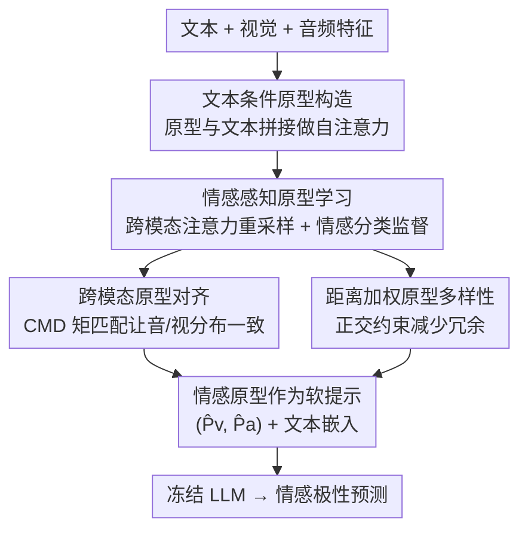

# Prototype-as-Prompt: Multimodal Sentiment Prototypes Endowing Large Language Models the Capability to Perform Multimodal Sentiment Analysis

**会议**: CVPR 2026  
**论文**: [CVF Open Access](https://openaccess.thecvf.com/content/CVPR2026/html/Zhao_Prototype-as-Prompt_Multimodal_Sentiment_Prototypes_Endowing_Large_Language_Models_the_Capability_CVPR_2026_paper.html)  
**代码**: 待确认  
**领域**: 多模态VLM  
**关键词**: 多模态情感分析, 情感原型, 软提示, 参数高效微调, 冻结大模型

## 一句话总结
这篇论文提出 Prototype-as-Prompt（PaP），把音视频模态压缩成一组**带显式情感语义**的"情感原型"当作软提示喂给冻结的 LLM 做多模态情感分析，靠情感监督、跨模态对齐和多样性约束让原型真正编码情感含义，仅用 0.09%–0.26% 的可训练参数就在四个数据集、三种 LLM 上超过此前 SOTA。

## 研究背景与动机
**领域现状**：多模态情感分析（MSA）要融合文本、语音、视觉来判断情感极性。随着 LLM 兴起，主流做法是用一组**可学习查询（learnable query）**把音视频表示压缩成少量 token，当作软提示送进 LLM。具体又分三类：投影式（把非文本特征投到 LLM 语义空间）、查询式（用 Q-Former 类重采样器压成可学习 token）、查询即提示式（用文本条件重采样器把非文本特征变成文本引导的提示）。

**现有痛点**：可学习查询是**隐式学习**的——没人告诉每个 query 应该编码什么情感语义。于是这些 query 缺乏明确的情感含义指引，提示设计往往是启发式的或基于低级特征，难以真正捕捉跨模态的情感语义对齐。投影式还要喂全长模态序列、计算冗余；查询式随模态增多参数暴涨；查询即提示式虽高效但仍依赖额外 adapter、且没显式编码情感。

**核心矛盾**：软提示"潜力大"（能高效引导冻结 LLM）与"语义空"（隐式 query 学不出明确情感含义）之间的矛盾——你想用少量 token 引导 LLM，但这些 token 自己都说不清代表哪种情感。

**本文目标**：让送进 LLM 的软提示**显式携带情感语义**，从而在冻结骨干、极少可训练参数的前提下赋予 LLM 多模态情感分析能力。

**切入角度**：与其用"语义空白"的可学习查询，不如用一组**固定数量、每个绑定一种情感类别**的"情感原型"当软提示——原型天然对应离散情感语义（如强负、负、弱负、中性、弱正、正、强正），再用监督显式把情感含义灌进去。

**核心 idea**：用"情感原型"替代"可学习查询"当软提示，并用情感监督 + 跨模态对齐 + 原型多样性三重约束，把显式情感语义绑定到原型上，去引导冻结的 LLM 做 MSA。

## 方法详解

### 整体框架
PaP 的输入是文本特征 $x_t$、视觉特征 $x_v$、音频特征 $x_a$，输出是情感极性预测；中间靠两大模块把音视频"翻译"成带情感语义的原型软提示。流程是：先做**文本条件原型构造**——把可学习的视觉/音频原型 $P_v,P_a$ 与文本拼接后做自注意力，得到文本条件原型 $\tilde P_v,\tilde P_a$；再做**情感感知原型学习**——用 $\tilde P_v,\tilde P_a$ 作 query 对原始音视频特征做跨模态注意力，重采样出携带模态信息的原型 $\hat P_v,\hat P_a$，并加情感监督让每个原型对应一种情感类别；同时施加**跨模态原型对齐**（让视觉/音频原型分布一致）与**距离加权原型多样性**（让同模态内不同原型彼此区分）两个约束。最后把 $\hat P_v,\hat P_a$ 连同文本嵌入一起作为提示送进**冻结的 LLM**，由它预测情感强度。整个过程只有 PaP 模块可训练，LLM 全程冻结。

### 关键设计

**1. 文本条件原型构造：把音视频信息"挂"到文本锚点上**

直接用音视频特征当提示存在跨模态语义鸿沟。PaP 引入一组可学习的视觉原型 $P_v\in\mathbb{R}^{K\times d}$ 与音频原型 $P_a\in\mathbb{R}^{K\times d}$（$K$ 为情感原型类别数）当作中介，把 LLM 的文本表示与非文本特征关联起来。做法是沿序列维把原型与文本拼接成 $H=[P_v;P_a;x_t]\in\mathbb{R}^{(T_t+2K)\times d}$，再用自注意力 $[\tilde P_v,\tilde P_a,\tilde x_t]=\mathrm{Softmax}\!\left(\frac{W_QH\,H^\top W_K^\top}{\sqrt d}\right)W_VH$ 让文本 token 与原型 token 建立相关性，得到**文本条件**的视觉/音频原型 $\tilde P_v,\tilde P_a$。这样原型一开始就以文本为锚点对齐，缓解了后续跨模态融合的语义鸿沟。

**2. 情感感知原型学习：给每个原型贴上明确的情感标签**

光有文本条件原型还不够，它们还没真正吸收音视频内容、也没绑定情感语义。PaP 先用 $\tilde P_v,\tilde P_a$ 作 query、对原始音视频特征 $x_v,x_a$ 作 value/key 做跨模态注意力，重采样出携带模态信息的伪 token $\hat P_v,\hat P_a$（如 $\hat P_v=\mathrm{Softmax}(\frac{W_Q\tilde P_v x_v^\top W_K^\top}{\sqrt d})W_V x_v$）。**关键一步**是让每个原型对应一个具体情感类别（如 MOSEI 上的 SN/N/WN/Neu/WP/P/SP 共 7 类），把 $\hat P_v,\hat P_a$ 过全连接 + 激活 $h=\sigma(W\hat P+b)$、再接 softmax 预测情感分布 $\hat y_v,\hat y_a$，用交叉熵 $L_{\text{semantic}}=-\sum_i y_i(\log\hat y_{vi}+\log\hat y_{ai})$ 显式监督。正是这个监督把"隐式 query 学不出情感语义"的痛点解决了——每个原型被强制对齐到一种情感含义，软提示因此真正可解释。

**3. 跨模态原型对齐：让视觉与音频说同一种"情感语言"**

视觉原型和音频原型如果各说各话，送进 LLM 的提示就会自相矛盾。PaP 用基于**中心矩差异（CMD）**的对齐损失 $L^{\text{inter}}_{\text{align}}=\mathrm{CMD}_K(\hat P_v,\hat P_a)$ 约束两者分布一致，其中 $\mathrm{CMD}_K$ 在区间上比较两分布的均值与 $2$ 到 $K$ 阶中心矩之差 $\frac{1}{|b-a|}\|E(X)-E(Y)\|_2+\sum_{k=2}^{K}\frac{1}{|b-a|^k}\|C_k(X)-C_k(Y)\|_2$（$C_k$ 为 $k$ 阶中心矩 ⚠️ 公式中幂次以原文为准）。损失越小、两个模态的原型在情感语义空间越一致，保证非文本模态传达的是一致的情感含义。

**4. 距离加权原型多样性：让相邻情感原型别"撞脸"**

同模态内若多个原型高度相似（如弱正、正、强正挤在一起），会产生冗余表示、削弱区分力。PaP 加正交约束 $L^{\text{intra}}_{\text{div}}=\sum_{m\in\{v,a\}}\lambda\,\|W\odot(\max(G_m,0)-I_K)\|_F$，其中 $G_m=\hat P_m\hat P_m^\top$ 是原型间的 Gram 矩阵、$I_K$ 为单位阵、$\lambda=\frac{1}{K(K-1)}$ 为归一化项、$W_{ij}=\frac{|i-j|}{K}$ 是**相对位置权重**——情感序上离得越远的原型对，越要被推开。$\max(\cdot,0)$ 保证只在余弦相似度为正时才施加分离，避免过度惩罚语义本就接近的相邻原型。这个设计让 7 个情感原型在语义空间里彼此正交、各自捕捉不同情感。

### 损失函数 / 训练策略
最终目标把四项联合优化：$L=\lambda_1 L_{\text{task}}+\lambda_2 L_{\text{semantic}}+\lambda_3 L^{\text{inter}}_{\text{align}}+\lambda_4 L^{\text{intra}}_{\text{div}}$，其中 $L_{\text{task}}=-\log p(y_i\mid I,\theta)$ 是 LLM 的下一 token 预测损失（输入 $I=(\tilde x_t,\hat P_v,\hat P_a)$）。论文设 $\lambda_1=1,\ \lambda_2=\lambda_3=10^{-1},\ \lambda_4=5\times10^{-2}$（⚠️ 缓存中 $\lambda$ 取值排列有 OCR 含糊，以原文为准）。骨干用 ChatGLM3-6B（C）/ Llama-2-7B（L）/ Qwen-1.5B（Q），全程冻结，只训 PaP 模块；V100-32GB 上 30 epoch 预热、验证 MAE 连续 10 轮不降则早停，5 个随机种子取均值。

## 实验关键数据

四个数据集：MOSEI（22,856 段 YouTube 影评，情感分 −3~3）、SIMS-V2（4,403 段中文视频，−1~1）、MELD（13,708 句对话，7 类情绪）、CHERMA（28,717 段中文影视片段，7 类情绪）。指标含二分类准确率 Acc-2、7 分类准确率 Acc-7、MAE、Pearson 相关 Corr、F1；SIMS-V2 额外用 **Acc2.w**（弱情感样本准确率，即情感强度落在 $[-0.4,0.4]$ 区间的样本上的准确率，专门考验对模糊情感的判别）。

### 主实验

MOSEI 与 SIMS-V2 对比（C/L/Q 分别为 ChatGLM-6B / Llama-2-7B / Qwen-1.5B）：

| 数据集 | 模型 | Acc-2 | F1 | Acc-7 / Acc2.w | MAE | Corr |
|--------|------|-------|-----|------|-----|------|
| MOSEI | MSE (L) [AAAI25] | 86.74 | 86.51 | 55.57 | 0.501 | 0.787 |
| MOSEI | **PaP (L) Ours** | **87.17** | **86.91** | **56.24** | **0.493** | 0.796 |
| MOSEI | MSE (C) [AAAI25] | 86.91 | 86.77 | 54.56 | 0.515 | 0.783 |
| MOSEI | **PaP (C) Ours** | 87.16 | 86.87 | 54.82 | 0.495 | **0.802** |
| SIMS-V2 | MSE (C) [AAAI25] | 83.77 | 83.76 | 75.24 | 0.296 | 0.720 |
| SIMS-V2 | **PaP (C) Ours** | **84.75** | **84.80** | **76.18** | **0.264** | **0.769** |

MELD / CHERMA 情绪识别对比（Acc / 加权 F1）：

| 模型 | MELD Acc | MELD WF1 | CHERMA Acc | CHERMA WF1 |
|------|----------|----------|------------|------------|
| MSE (C) [AAAI25] | 66.23 | 65.13 | 72.90 | 72.73 |
| **PaP (C) Ours** | **67.47** | **65.97** | **75.33** | **75.28** |

PaP 在三种 LLM × 四个数据集上**全面超过此前最强的 LLM-based 方法 MSE**，尤其在中文数据集 CHERMA 上 ChatGLM 版提升最明显（Acc +2.43、WF1 +2.55）。这验证了"把非文本模态映射成固定数量的情感原型当软提示"是赋予 LLM 多模态情感能力的有效路径。

### 消融实验（CHERMA，Table 4）

| 配置 | ChatGLM Acc / F1 | Llama Acc / F1 | Qwen Acc / F1 |
|------|------------------|----------------|---------------|
| PaP（完整） | 75.33 / 75.28 | 72.70 / 72.65 | 73.93 / 73.87 |
| w/o SPL（去情感感知学习） | 73.83 / 73.73 | 71.69 / 71.65 | 72.74 / 72.27 |
| w/o CPA（去跨模态对齐） | 74.01 / 73.74 | 72.01 / 72.30 | 73.00 / 73.07 |
| w/o PDR（去多样性正则） | 74.67 / 74.89 | 72.32 / 71.94 | 73.47 / 73.38 |

三个约束各有贡献：去掉跨模态对齐（CPA）在 ChatGLM 上 Acc/F1 掉 1.32/1.54，去掉情感感知学习（SPL）掉得也明显——没有显式情感监督，原型就学不出清晰语义；去掉多样性正则（PDR）同样退化，说明让原型彼此区分对鲁棒性与表达力是必要的。

### 关键发现
- **三个约束里 SPL/CPA 最关键**：情感监督（SPL）和跨模态对齐（CPA）去掉后掉点最多，前者保证原型有明确情感含义、后者保证音视频原型语义一致；多样性（PDR）贡献相对小但仍正向。
- **参数极致高效**：PaP 模块仅占总参数的 0.09%–0.26%（⚠️ 摘要写 0.09%–0.26%，正文 4.8 节写 0.09%–0.22%，区间上界以原文为准），却能全面超 SOTA；与同样轻量的 MSE 参数量相当，但性能更好，远低于 MAG/CHFN/QaP。
- **原型可视化验证有效性**：弱正样本的音视频模态都被映射到"弱正"原型且概率最高；音视频原型分布相似（验证跨模态对齐），不同原型分布差异大（验证多样性正则）；t-SNE 显示音视频原型高度交织（对齐成功）、正/负/中性边界清晰（语义可分）。

## 亮点与洞察
- **"原型"替"查询"是点睛之笔**：可学习查询语义空白，而情感原型天然对应离散情感类别、再加显式监督，软提示从"黑盒 token"变成"可解释情感锚点"——这个视角转换很优雅，也直接可迁移到其他有离散类别结构的多模态提示任务。
- **冻结 LLM + 极少参数**：0.09%–0.26% 可训练参数就超 SOTA，说明只要软提示设计得当，不必动 LLM 骨干就能注入领域能力，参数效率对落地非常友好。
- **三重约束协同**：情感监督管"有没有语义"、跨模态对齐管"模态间一致"、多样性正则管"模态内可分"，三者各司其职、可视化都给了直接证据，方法论上自洽完整。
- **CMD 对齐 + 相对位置加权正交**：用中心矩差异做分布对齐、用情感序的相对位置 $|i-j|$ 加权正交约束，这两个具体技巧都可复用到其他需要"分布对齐 + 类别区分"的表示学习场景。

## 局限与展望
- **依赖预定义情感类别数 $K$**：原型数量与情感粒度绑定（如 MOSEI 用 7 类），对类别体系不同或细粒度情绪的数据集需重设，泛化到开放情感空间不直接。
- **仅文本当 LLM 直接输入**：最终送进 LLM 的是文本特征 + 原型提示，音视频信息全靠原型压缩中转，极端情况下若原型容量不足可能丢失细粒度非文本线索。
- **跨数据集上界差异**：不同数据集/骨干的最优组合不同（如 SIMS-V2 上 Llama 版反而偏弱），横向比大小需谨慎，结论不宜直接跨设置外推。
- **参数比例口径不一致**：摘要与正文给出的可训练参数上界（0.26% vs 0.22%）有出入，建议以原文最终口径为准。
- **改进方向**：可探索自适应原型数量、把原型也反哺给非文本编码、或引入更细粒度的层次化情感原型。

## 相关工作与启发
- **vs MSE [AAAI25]（查询即提示式 SOTA）**：MSE 用文本特征过滤非文本特征当提示、骨干冻结，但提示不显式编码情感语义；PaP 改用带情感监督的原型当提示，在三种 LLM × 四数据集上全面超过 MSE，参数量相当。
- **vs 投影式 MLLM（如 MAG-BERT）**：投影式要喂全长模态序列、计算冗余、参数多；PaP 把非文本压成固定 $K$ 个原型，参数远少（图 6 显示 PaP 远低于 MAG/CHFN）、性能更高。
- **vs 查询式 MLLM（Q-Former 类）**：查询式参数随模态数增长、且 query 语义空白；PaP 用固定原型 + 显式情感绑定，既控参数又给语义。
- **vs 传统融合/表示学习（CMamba、AlignMamba、DiffuFuse 等）**：这些方法靠复杂融合网络或几何对齐损失优化表示，不借助冻结 LLM；PaP 走"轻量软提示驱动冻结 LLM"路线，在 MOSEI 上 Acc-2/Acc-7/MAE 多项更优。

## 评分
- 新颖性: ⭐⭐⭐⭐ "情感原型当软提示 + 显式情感监督"视角清晰新颖，但仍属"软提示 + 冻结 LLM"范式内的改进。
- 实验充分度: ⭐⭐⭐⭐⭐ 三种 LLM × 四个数据集 × 5 种子，外加消融、原型可视化、t-SNE、参数分析，证据链完整。
- 写作质量: ⭐⭐⭐⭐ 方法与公式清楚、图示直观；个别公式/参数处缓存有 OCR 含糊需对原文。
- 价值: ⭐⭐⭐⭐ 用 0.09%–0.26% 参数超 SOTA、且原型可解释，对参数高效多模态情感分析有实用价值。

<!-- RELATED:START -->

## 相关论文

- [\[CVPR 2026\] Factorize, Reconstruct, Enhance: A Unified Framework for Multimodal Sentiment Analysis](factorize_reconstruct_enhance_a_unified_framework_for_multimodal_sentiment_analy.md)
- [\[CVPR 2026\] Conflict-Aware Adaptive Cross-Reconstruction for Multimodal Sentiment Analysis](conflict-aware_adaptive_cross-reconstruction_for_multimodal_sentiment_analysis.md)
- [\[CVPR 2026\] Enhance-then-Balance Modality Collaboration for Robust Multimodal Sentiment Analysis](enhance-then-balance_modality_collaboration_for_robust_multimodal_sentiment_anal.md)
- [\[CVPR 2026\] EBMC: Enhance-then-Balance Modality Collaboration for Robust Multimodal Sentiment Analysis](ebmc_multimodal_sentiment_analysis.md)
- [\[CVPR 2026\] Multi-Metric Representation Learning Strategy Based on Clustering for Fine-Grained Multimodal Sentiment Analysis](multi-metric_representation_learning_strategy_based_on_clustering_for_fine-grain.md)

<!-- RELATED:END -->
