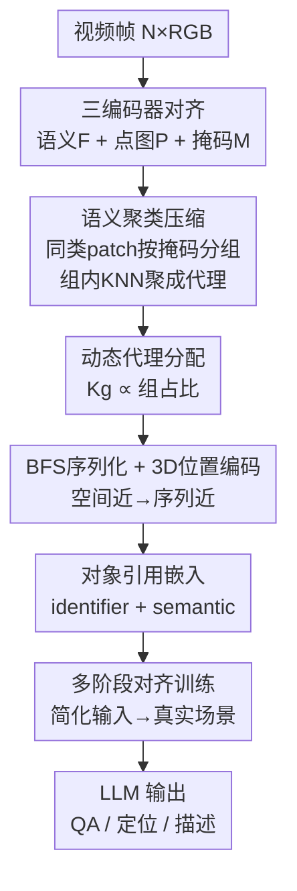

# Proxy3D: Efficient 3D Representations for Vision-Language Models via Semantic Clustering and Alignment

**会议**: CVPR 2026  
**arXiv**: [2605.08064](https://arxiv.org/abs/2605.08064)  
**代码**: https://wzzheng.net/Proxy3D (项目页)  
**领域**: 多模态VLM / 3D视觉  
**关键词**: 3D空间智能、视觉token压缩、语义聚类、表示对齐、多阶段训练

## 一句话总结
Proxy3D 把视频帧的语义特征 + 几何点云按"语义组"聚类成一组紧凑的 3D 代理（proxy）token，再用 SpaceSpan 数据集做多阶段对齐训练，让 VLM 仅用 700 个视觉 token（不到对手 1/10）就在 3D 问答、视觉定位、空间推理上做到与 SOTA 相当甚至更好的水平。

## 研究背景与动机

**领域现状**：让 VLM/MLLM 具备 3D 空间智能（理解"沙发在桌子左边""房间多大"）是当前热点。现有 3D-VLM 大致分两派：① **对应式（correspondence-based）**，如 3DRS、Video-3D-LLM、GPT4Scene，靠跨帧特征匹配隐式建立 3D 感知；② **表示式（representation-based）**，如 LLaVA-3D、Spatial-MLLM、LEO-VL，显式把 2D 特征抬升成点云/深度/3DGS 等几何表示再喂给 LLM。

**现有痛点**：对应式方法靠堆帧间相似度，训练数据利用率低、空间一致性差（只在自我视角附近形成"局部世界模型"而非全局统一模型），而且序列动辄 8000 个 token，算力开销巨大。表示式方法虽然带了几何先验，但把每个点/patch 直接拍平序列化会非常长（3000+ token），且朴素点云序列无法用 cross-attention 表达复杂空间关系；想做"统一表示"又往往要复杂的神经网络序列化模块。

**核心矛盾**：要给 MLLM 喂一段**既携带准确空间信息、又尽量短**的 token 序列——精度（保留几何与语义细节）和效率（序列长度）之间存在直接 trade-off。

**本文目标**：(1) 设计一种紧凑但信息完整的 3D 视觉表示；(2) 让这种压缩表示能和语言模型有效对齐；(3) 解决 3D 视觉-语言训练数据稀缺问题。

**切入角度**：作者观察到**编码后的视觉模态在语义上是稀疏分布的**——一个场景里大量 patch 其实属于少数几个物体/语义类别。既然语义冗余，就可以在隐空间里按语义做聚类压缩，而不必为每个 patch 都保留一个 token，也不必引入复杂的神经序列化网络。

**核心 idea**：用"**语义感知聚类得到的 3D 代理 token**"代替"逐 patch 的像素对齐 token"，把视觉序列从上万压到几百，再配套一套从简到难的多阶段对齐训练把它塞进 VLM。

## 方法详解

### 整体框架
Proxy3D 只吃视频帧（N 帧 RGB）作为输入，输出是一段很短的 3D proxy token 序列 $\mathbf{Z}\in\mathbb{R}^{K\times C}$（$K\ll L$），直接当作视觉 token 拼进 LLM 做自回归生成。整条流水线是：**特征抽取 →（语义/几何/掩码三元组对齐）→ 语义聚类压缩 → 代理分配 → BFS 序列化 + 3D 位置编码 → 多阶段对齐训练**。前半段把"一大堆 patch"塌缩成"一小撮代理"，后半段解决"LLM 怎么读懂这种新表示"。

具体地，每帧先过三个预训练编码器：2D 视觉编码器出语义特征图 $F_i$、几何预测器（VGGT）出点图 $P_i$、2D 分割模型（SAM 2）出掩码 $M_i$。三者按 patch 对齐成三元组 $\{\mathbf{f}_j,\mathbf{p}_j,\mathbf{m}_j\}_{j=1}^{L}$（$L=N\times H'\times W'$，每个 patch 的掩码标签取面积最大物体）。然后按掩码语义标签把同物体的 patch 分组、组内用 KNN 聚成 $K_g$ 个代理，组间按比例动态分配代理数；代理经 BFS 空间序列化、加 3D 位置编码后形成 $\mathbf{Z}$。最后用 SpaceSpan 数据集做 4 阶段渐进训练把 $\mathbf{Z}$ 与 Qwen2.5-VL 对齐。

### 关键设计

**1. 语义感知聚类：把"稀疏语义"塌缩成少量代理 token**

这是全文压缩的核心，直击"表示式方法序列太长"的痛点。作者先把三元组按掩码语义标签 $g$ 分组：$\mathcal{G}_g=\{\mathbf{f}_j,\mathbf{p}_j\mid\mathbf{m}_j=g\}$，即同一个物体/语义类别的所有 patch 归一组。然后在每组内**用 KNN 在 3D 坐标 $\mathbf{p}$ 上聚类**，得到 $K_g$ 个代理中心 $\{\mathcal{C}_{g,j}\}_{j=1}^{K_g}=\mathrm{KNN}(\mathcal{G}_g,\mathbf{p}_k)$，每个代理携带聚合后的视觉特征 $\mathbf{z}_{g,j}$ 与 3D 坐标 $\mathbf{c}_{g,j}$。

关键在"**先按语义分组、再在组内做几何聚类**"：如果像朴素方法那样直接对全场景点云聚类，不同物体的点会被混进同一簇，物体引用就不准（消融里这一步对视觉定位影响超过 20 分）。语义分组保证了每个代理只来自单一物体，几何 KNN 又让代理保留物体内部的空间分布。最终序列长度从 $L$（上万）压到 $K$（几百），且这个压缩**不需要训练任何神经序列化网络**——纯靠现成分割掩码 + KNN，简单且无额外学习成本。

**2. 动态代理分配：按语义组占比分配 token 预算，不漏小物体**

聚类时每组该分几个代理 $K_g$？平均分会让占画面大的墙地板浪费 token、小物体（杯子、遥控器）被淹没。作者让 $K_g\propto|\mathcal{G}_g|/L$，即按该语义组在整段序列中的 patch 占比正比分配；同时**给每个组一个非零的初始代理数**，确保即使占比极小的物体也至少有一个代理、不被整体忽略。Scan2Cap 消融显示每物体分 5 个代理最优：太少（2 个）描述不够细，太多（10 个）会稀释——单物体代理变得不再 informative、破坏多物体间的理解平衡。

**3. BFS 空间序列化 + 3D 位置编码：让"空间相邻"等于"序列相邻"**

代理是无序集合，但 LLM 读的是一维序列，怎么排顺序决定了它能否捕捉空间关系。作者对 3D 代理中心做**广度优先搜索（BFS）遍历**，从离原点最近的 3D 片段为根开始展开——这样空间上靠近的片段在序列里也是邻居，LLM 用 attention 时更容易抓到物体间的相对位置。

光有顺序还不够，还要注入绝对几何先验。作者用**混合 3D 位置编码**：垂直方向 $\mathcal{H}$ 用旋转位置编码 RoPE（捕捉物体在竖直维度的移动），水平面 $\{\mathcal{W}\times\mathcal{L}\}$ 用可学习的 Fourier 嵌入（由 MLP 学整体空间布局），二者相加叠到代理特征上：
$$\mathbf{z}_{g,j}'=R(\mathbf{c}_{g,j\in\mathcal{H}})\,\mathbf{z}_{g,j}+F(\mathbf{c}_{g,j\in\{\mathcal{W}\times\mathcal{L}\}})$$
排序 + 位置编码后拼成最终序列 $\mathbf{Z}=[\mathbf{Z}_1,\ldots,\mathbf{Z}_G]$。

**4. 对象引用嵌入：用 identifier + semantic 两类符号把物体"指给" LLM**

MLLM 几乎只在 2D 图像上训练过，直接读 3D 代理很难精确"指认"某个具体物体。作者引入两类间接表示作为桥梁：**identifier embedding**（标识符嵌入）是"嵌入-文本"对，把准确的物体引用与位置感知统一起来，用 `<OBJXXX>` 这种 token 格式对应（共 $m=100$ 个标识符）；**semantic embedding**（语义嵌入）描述一类物体（共 $n=213$ 个类别），由视觉编码器从简化语义符号里提取，符号图用 Stable Diffusion 生成、标识符图用数字字符绘制。引用方式为 $\mathbf{f}_j^{sem}=G_{sem}(n_j)$、$\mathbf{f}_j^{id}=G_{id}(m_j)$。作者把这套类比成"国际象棋的棋子/围棋的棋子"——模型能通过简化符号学会空间关系。这些标识符嵌入通过**加性融合**直接注入序列化的代理嵌入，等于把 2D 的 visual prompting 扩展到了 3D 特征空间，且不需要像 LEO-VL 那样引入可学习嵌入。

### 损失函数 / 训练策略
**多阶段渐进训练**：从易到难分 4 个阶段培养空间技能（对应训练耗时 2 / 2 / 3 / 55 小时，8×A6000）：
- **阶段 1（标识符/语义对齐）**：把代理嵌入直接换成融合嵌入 $\mathbf{f}_j^{sem}+\mathbf{f}_j^{id}$，用简化视觉输入模拟场景，让 MLLM 学会根据 `<OBJXXX>` token 指认物体。
- **阶段 2（坐标对齐）**：训练 3D RoPE 嵌入，让每个标识符嵌入具备空间尺寸感知；图 4 显示坐标判定能达到高精度。
- **阶段 3（空间探索）**：用 MMScan 的 115K 物体-物体属性数据，显式训练 MLLM 理解物体间空间关系与位置编码。
- **阶段 4（真实场景）**：换上真实 3D 场景代理作为视觉输入，用完整 318K SpaceSpan 数据，把知识从"简化输入"迁移到"真实场景"。

**训练目标**为标准自回归指令微调的负对数似然：
$$\mathcal{L}(\theta)=-\sum_{i=K+1}^{r}\log P_\theta(t_i\mid t_{<i},\mathbf{Z})$$
其中 $\mathbf{Z}$ 为 3D 代理序列，$r$ 为回答长度。Backbone 用 Qwen2.5-VL-7B，基线序列长度 $K=450$，输入 $N=32$ 帧、分辨率 512×512。

## 实验关键数据

### 主实验
3D QA / 视觉定位 / 密集描述（节选 Table 2，token 数为视觉序列长度）：

| 模型 | 视觉模态 | token数 | ScanRefer Acc@0.5 | Multi3DRefer F1@0.5 | ScanQA C | SQA3D EM |
|------|---------|--------|-------|-------|------|------|
| Video-3D-LLM | I | 8000 | 51.7 | 52.7 | 102.1 | 58.6 |
| 3DRS | I | 8000 | 56.1 | 54.9 | 104.8 | 60.6 |
| LLaVA-3D | D,I | 3096 | 42.4 | – | 91.7 | 55.6 |
| LEO-VL | D,I | 750 | – | – | 100.4 | 60.8 |
| **Proxy3D** | I | **700** | **54.1** | **57.5** | 93.6 | 57.5 |

要点：Proxy3D 用 **700 个 token（不到对应式 8000 的 1/10）** 在 ScanRefer/Multi3DRefer 视觉定位上拿到 SOTA 或次优；ScanQA/SQA3D 与对应式略有差距但远省算力；与同为表示式、序列相近（750）的 LEO-VL 性能几乎持平，而 LEO-VL 还额外用了 SceneDPO 后训练。Scan2Cap 密集描述是表示式方法的共同短板（Proxy3D C@0.5 仅 73.3，落后对应式），作者归因于"简洁性与语义性的 trade-off"。

VSI-Bench 空间推理（Table 3，Avg. 为 8 任务均值）：

| 模型 | token数 | Obj.Cnt | Abs.Dist | Obj.Size | Rel.Dist | Avg. | Rank |
|------|--------|---------|----------|----------|----------|------|------|
| Gemini-1.5 Pro | – | 56.2 | 30.9 | 64.1 | 51.3 | 45.4 | 3 |
| Qwen2.5-VL-7B | – | 40.9 | 14.8 | 43.4 | 38.6 | 33.0 | 9 |
| Spatial-MLLM-4B | 3096 | 65.3 | 34.8 | 63.1 | 41.3 | **48.4** | 1 |
| **Proxy3D** | 450 | 63.9 | **41.9** | **67.2** | 50.3 | 47.0 | 2 |

要点：Proxy3D 总分第 2，仅微弱落后 Spatial-MLLM（48.4 vs 47.0），但后者用 ~7× 的 token（3096 vs 450）且额外做了 GRPO 强化学习后训练。相比同 backbone 的 Qwen2.5-VL-7B（33.0），Proxy3D 把空间推理提了 14 分。物体计数/尺寸甚至接近或超人类，但外观顺序、路径规划仍远低于人类（这两项还是 zero-shot 未专门训练的）。

### 消融实验
（Table 4，32×42 分辨率 / 700 token 为完整配置）：

| 配置 | ScanQA C | ScanRefer Uni@0.5 | ScanRefer Acc@0.5 | 说明 |
|------|---------|-------|-------|------|
| Full（含语义分组+坐标对齐）| 93.6 | 84.0 | 54.1 | 完整模型 |
| w/o 语义分组（16×21,450）| 92.2 | 57.0 | 31.0 | 定位崩盘，掉 20+ 分 |
| w/o 坐标对齐 | 93.4 | 83.6 | 53.8 | 影响小，但 VSI 上明显 |
| w/o 帧间 cross attn | 93.1 | 83.2 | 53.8 | 几乎不掉，对流式鲁棒 |
| 450 token（更短）| 92.7 | 82.7 | 52.6 | 略降，换算力 |
| 1000 token（更长）| 94.3 | 84.7 | 53.8 | 略升，精度-算力可调 |

动态代理分配（Table 5，Scan2Cap，每物体代理数）：2 个→C 73.3；**5 个→C 74.9（最优）**；10 个→C 73.2。

### 关键发现
- **语义分组是定位任务的命门**：去掉后 ScanRefer 总精度从 54.1 暴跌到 31.0、Uni 从 84.0 跌到 57.0；朴素聚类不分语义会导致物体引用混乱。对 QA 类影响则较温和（ScanQA C 92.2→93.6）。
- **对帧间 cross-attention 高度鲁棒**：去掉帧间特征聚合几乎不掉点，说明 Proxy3D 靠"实例级特征"就能建场景理解，这与重度依赖帧间相似度的对应式方法形成鲜明对比——意味着它天然适合流式/逐帧场景。
- **坐标对齐主要利好"全局空间"任务**：对房间尺寸估计、路径规划、外观顺序提升明显（图 7），对局部 QA 影响有限。
- **序列长度是干净的精度-算力旋钮**：450/700/1000 token 与特征图分辨率单调影响性能，可按预算调。

## 亮点与洞察
- **"语义稀疏 → 语义聚类压缩"这一观察很值钱**：场景里多数 patch 语义冗余，按物体聚成几个代理就够 LLM 理解空间关系，省掉了复杂神经序列化模块，纯用现成分割掩码 + KNN 实现，几乎零额外训练成本——简单却有效。
- **"按语义分组再按几何聚类"的两段式压缩**可迁移：任何需要把密集 3D/点云喂给序列模型的任务（机器人、AR）都能借用——先用分割保证实例纯度、再用空间聚类控长度，比朴素 voxel/FPS 下采样更能保物体语义。
- **identifier/semantic 嵌入 = 把棋子符号思想搬进 3D**：用 `<OBJXXX>` + 简化语义符号当"中间语言"对齐物体，且通过加性融合注入而无需可学习嵌入，是一种轻量的 3D visual prompting，思路新颖。
- **多阶段"从简化符号到真实场景"的课程式训练**：先在干净的标识符/坐标上把空间技能学扎实，再切真实代理，缓解了 3D 视觉-语言数据稀缺；4 阶段耗时 2/2/3/55h 也说明前 3 个对齐阶段很轻量。

## 局限性 / 可改进方向
- **作者承认**：与人类空间推理仍有大差距，外观顺序、路径规划等任务严重落后；这两项还是未专门训练的 zero-shot 设定。VSI-Bench 总分被 Spatial-MLLM 微弱反超，作者指出对方靠 GRPO 后训练，暗示 Proxy3D 加奖励学习还能再涨。
- **密集描述是结构性短板**：Scan2Cap 上所有表示式方法（含 Proxy3D）都明显逊于对应式，压缩在细粒度描述任务上确实丢了信息。
- **重度依赖现成预训练模型**：VGGT（几何）、SAM 2（分割）、2D 视觉编码器三件套的质量直接决定代理质量；VGGT 只给归一化点图，还得额外估尺度因子，工程上不够干净。
- **聚类超参与场景耦合**：每物体最优代理数（如 Scan2Cap 的 5）依任务而定，缺少自适应机制；语义类别数固定为 213，开放场景泛化存疑。
- **改进思路**：引入 SceneDPO/GRPO 这类偏好/奖励后训练；让 $K_g$ 随任务/物体重要性自适应；探索端到端可学的语义聚类替代固定分割掩码。

## 相关工作与启发
- **vs 对应式（3DRS / Video-3D-LLM / GPT4Scene）**：它们靠跨帧匹配隐式建 3D、序列 8000 token；Proxy3D 显式聚类成 700 token，定位/推理相当甚至更好，且对帧间 attention 鲁棒、适合流式。优势是效率，劣势是密集描述偏弱。
- **vs LEO-VL**：架构组件相近、序列长度相近（750 vs 700），性能几乎持平。区别在 Proxy3D 主打"语义感知聚类压缩序列"，LEO-VL 多了一个 SceneDPO 正负答案对比的后训练阶段——后者的后训练正是 Proxy3D 可借鉴的涨点方向。
- **vs Spatial-MLLM**：VSI-Bench 上 Spatial-MLLM 微弱第 1，但它用 ~7× token（3096 vs 450）且靠 GRPO 强化后训练；Proxy3D 以极短序列拿到接近成绩，性价比更高。
- **vs Chat-Scene / Descrip3D（object-proposal 类）**：它们只是把各物体嵌入简单拼成序列；Proxy3D 在拼接之外多做了语义感知分组与压缩，因此在 ScanRefer/Multi3DRefer 上反超。

## 评分
- 新颖性: ⭐⭐⭐⭐ "语义稀疏→语义聚类压缩 3D 代理"的观察与无训练序列化方案有新意，但 3D-VLM 表示压缩整体是拥挤赛道。
- 实验充分度: ⭐⭐⭐⭐⭐ 覆盖 QA/定位/描述/VSI-Bench 四大类基准，消融把语义分组、坐标对齐、帧间 attention、token 数、代理分配逐项拆清。
- 写作质量: ⭐⭐⭐⭐ 方法叙述清晰、图示到位，但部分聚类/嵌入符号略密、细节需对照附录。
- 价值: ⭐⭐⭐⭐⭐ 用 1/10 token 达到 SOTA 级 3D 空间智能，对算力敏感的具身/AR 落地很有参考价值，SpaceSpan 数据集也是公开贡献。

<!-- RELATED:START -->

## 相关论文

- [\[CVPR 2026\] GaussianVision: Vision-Language Alignment from Compressed Image Representations using 2D Gaussian Splatting](gaussianvision_vision-language_alignment_from_compressed_image_representations_u.md)
- [\[CVPR 2026\] PointAlign: Feature-Level Alignment Regularization for 3D Vision-Language Models](pointalign_feature-level_alignment_regularization_for_3d_vision-language_models.md)
- [\[CVPR 2026\] Gravitation-Driven Semantic Alignment for Text Video Retrieval](gravitation-driven_semantic_alignment_for_text_video_retrieval.md)
- [\[CVPR 2026\] Uncertainty-guided Compositional Alignment with Part-to-Whole Semantic Representativeness in Hyperbolic Vision-Language Models](uncertainty-guided_compositional_alignment_with_part-to-whole_semantic_represent.md)
- [\[CVPR 2026\] SMAP: Semantic Route Planning with Map-Grounded Multimodal Alignment](smap_semantic_route_planning_with_map-grounded_multimodal_alignment.md)

<!-- RELATED:END -->
