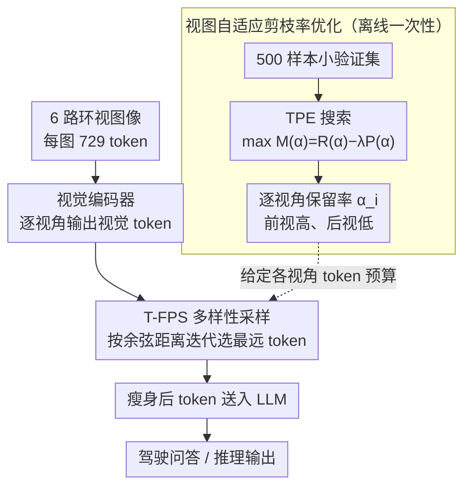

# Prune2Drive: A Plug-and-Play Framework for Accelerating Vision-Language Models in Autonomous Driving

**会议**: CVPR 2026  
**arXiv**: [2508.13305](https://arxiv.org/abs/2508.13305)  
**代码**: [https://github.com/MinhaoXiong/Prune2Drive](https://github.com/MinhaoXiong/Prune2Drive)  
**领域**: 多模态VLM  
**关键词**: 多视角VLM, 视觉Token剪枝, 最远点采样, 视图自适应, 自动驾驶加速  

## 一句话总结

首个面向多视角自动驾驶 VLM 的即插即用 token 剪枝框架，通过 T-FPS（token 级最远点采样）保持语义与空间多样性，配合视图自适应剪枝率优化自动分配各摄像头 token 预算，在 DriveLM 上仅保留 10% token 即实现 6.40× prefill 加速且性能仅降 3%。

## 背景与动机

1. **多视角 VLM 计算量爆炸**：自动驾驶 VLM（如 DriveMM）需处理 6 个环视摄像头输入，每图 729 tokens，总计 >4000 visual tokens，注意力复杂度 $O(n^2)$ 导致推理延迟不可接受
2. **现有剪枝方法仅针对单图设计**：FastV、SparseVLM 等忽视多视角的空间和语义多样性，直接应用会丢失关键视角信息
3. **依赖注意力权重的方法不兼容高效注意力**：FastV 等需读取注意力矩阵，与 FlashAttention 等高效实现不兼容
4. **存在位置偏差**：基于注意力分数的方法倾向于系统性保留特定位置的 token，忽视低注意力但语义重要的 token（如远处车辆）
5. **不同视角贡献不均等**：前视摄像头对驾驶决策远比后视重要，但现有方法对所有视角采用相同剪枝率
6. **实时性需求紧迫**：自动驾驶是延迟敏感场景，VLM 的高推理延迟直接影响安全性

## 方法详解

### 整体框架

Prune2Drive 想解决的是多视角自动驾驶 VLM 的 token 爆炸问题：6 路环视、每图 729 token、总量 4000+，注意力 $O(n^2)$ 让实时推理几乎不可能。它在视觉编码器输出后插入一道纯推理时的剪枝，先用 T-FPS 在 token 嵌入空间里挑出最有多样性的一小撮 token，再用一次离线搜索为每个摄像头定下各自的保留预算，最后把瘦身后的 token 送进 LLM。整套流程 training-free，不碰模型权重也不读注意力矩阵。整体可看成两条流：一条是**离线一次性**的视图自适应剪枝率搜索（产出每个摄像头各自的保留率 $\alpha_i$），另一条是**推理时**逐视角执行 T-FPS、按预算选 token 再喂给 LLM。

### 关键设计

**1. T-FPS：用最远点采样保住语义与空间多样性，而不是看注意力分数**

现有单图剪枝（FastV、SparseVLM）靠第二层注意力分数选 token，既有系统性的位置偏差，又因为要读注意力矩阵而和 FlashAttention 互斥；更糟的是低注意力但语义重要的物体（远处的车）会被直接丢掉。T-FPS 把点云处理里的最远点采样搬到 token 嵌入空间，只是把欧氏距离换成余弦距离：随机选一个初始 token 放进已选集合 $\mathcal{S}$，之后每一步计算所有未选 token 到 $\mathcal{S}$ 中最新 token 的余弦距离并更新各自的最小距离记录，再挑出“最小距离最大”的那个（离已选集合最远的）加入 $\mathcal{S}$，重复到凑满目标数量 $\mathcal{K}$。这样选出来的子集天然覆盖最广的语义+空间分布，不会因为注意力低就漏掉关键物体；而且它完全不依赖注意力，因此和 FlashAttention 兼容，计算开销也极低——$N=729$ 时只要 0.02s，占总 FLOPs 不到 0.1%。

**2. 视图自适应剪枝率：让前视摄像头自动拿到更多 token 预算**

各视角对驾驶决策的贡献并不均等（前视远比后视重要），但旧方法对 6 路一刀切用同一剪枝率。Prune2Drive 把每个视角的保留率 $\alpha_i$ 当作可优化变量，定义目标 $\mathcal{M}(\boldsymbol{\alpha}) = R(\boldsymbol{\alpha}) - \lambda P(\boldsymbol{\alpha})$：奖励项 $R(\boldsymbol{\alpha})$ 是模型输出和 ground truth 的语言相似度，惩罚项 $P(\boldsymbol{\alpha}) = \sum_{i=1}^{M} \alpha_i$ 是总保留量、鼓励稀疏，$\lambda$ 调二者的平衡。用 TPE（Tree-structured Parzen Estimator）在 500 样本的小验证集上搜索，仅 3 H100 GPU 小时即收敛。搜索结果自动印证了直觉：前视拿到更高保留率，后视和侧视适度收缩——这套预算分配是手工先验给不出来的。

**3. 理论保证：组合策略的误差界更紧**

论文进一步证明，T-FPS（k-center 贪心，近似最小化 Hausdorff 距离）配上按重要性加权分预算的视图自适应率，在 View-Weighted Lipschitz 连续性假设下，比“均匀随机采样 + 等比例剪枝”能给出更紧的误差上界：

$$\sum_{i=1}^{M} w_i \cdot d_H(V_i, S_{i,\text{Prune2Drive}}) \leq \sum_{i=1}^{M} w_i \cdot d_H(V_i, S_{i,\text{baseline}})$$

这给“多样性采样 + 视角加权”这套经验设计补上了为什么有效的理论说明。

**4. 即插即用：不重训、不读注意力**

整个框架 training-free，直接挂在视觉编码器输出之后，兼容 LLaVA-OneVision-7B（DriveMM）、InternVL2.5-8B（DriveLMM-o1）、LLaVA-1.5-7B 等多种 VLM，无需重训练或访问注意力矩阵。这让它能和任何现成或未来的自动驾驶 VLM 正交组合。

## 实验关键数据

### DriveLM benchmark（DriveMM 模型，保留 10% token）

| 方法 | Token/图 | Avg Score↑ | Prefill 加速 | FLOPs |
|------|:---:|:---:|:---:|:---:|
| Vanilla | 729 | 59.1 | 1× | 100% |
| FastV | 72 | 54.1 | 5.78× | 14.2% |
| SparseVLM | 72 | 55.9 | 4.06× | 14.4% |
| PACT | 72 | 56.8 | — | — |
| **Prune2Drive** | **72** | **57.4** | **6.40×** | **13.4%** |

### DriveLMM-o1 benchmark（保留 10% token）

| 方法 | Overall Reasoning↑ | Risk Accuracy↑ | Scene Understanding↑ |
|------|:---:|:---:|:---:|
| Vanilla（100%） | 74.2 | 73.01 | 75.99 |
| FastV | 65.3 | 65.37 | 66.43 |
| DART | 67.4 | 65.32 | 68.17 |
| **Prune2Drive** | **68.3** | **68.34** | **69.86** |

### 通用 VLM 和视频 AD benchmark

| 设置 | Prune2Drive | SparseVLM | FastV |
|------|:---:|:---:|:---:|
| LLaVA-1.5（128 tokens） | 97.3% 原始性能 | 96.2% | 92.8% |
| LLaVA-1.5（64 tokens） | 94.6% | 86.9% | 74.3% |
| OmniDrive（视频 AD） | 49.0 | 46.8 | 44.3 |

### 消融实验

| 消融项 | DriveLMM-o1 Overall↑ | 说明 |
|------|:---:|:---|
| cos 距离（默认） | 68.3 | 最优 |
| L1 距离 | 68.3 | 几乎等效 |
| L2 距离 | 67.7 | 略低 |
| min 距离（最近采样） | 63.0 | 严重退化 -5.3，验证了多样性原则 |
| TPE（默认） | 68.3 | 最优 HPO |
| Grid Search | 67.3 | 差 1.0 |
| Evolutionary | 67.6 | 差 0.7 |

**有趣发现**：DriveLM 25% token 保留时 Match Score 达 34.0，甚至超过原始模型 33.9——适度剪枝有正则化效果，去除冗余/干扰 token 可提升特定指标。

## 亮点

1. **首个多视角自动驾驶专用 token 剪枝**：不是简单迁移单图方法，而是系统解决多视角空间/语义多样性和视角贡献差异问题
2. **T-FPS 设计极其优雅**：将点云处理中的 FPS 思想迁移到 token 嵌入空间，用余弦距离保证语义多样性，仅 0.02s 计算开销
3. **视图自适应率优化自动发现前视 > 后视**：无需手工设计先验，TPE 搜索自动分配最优预算
4. **6.40× 加速有直接工业价值**：对实时自动驾驶系统的部署有实际意义

## 局限与展望

1. **大面积均匀纹理物体可能被欠采样**：如橙色公交车因 token 特征相似，T-FPS 可能保留过少 token，导致该物体信息损失
2. **T-FPS 依赖随机初始化**：初始 token 的随机选择可能引入轻微波动，论文未报告多次运行的方差
3. **仅验证 7B-8B 级别 VLM**：未在更大模型（70B+）上验证，剪枝比例和效果可能随模型规模变化
4. **视图自适应率是静态的**：对每个样本使用相同的剪枝率，未考虑不同驾驶场景（高速/拥堵/路口）可能需要不同的视角关注分配
5. **KV Cache 只在首次编码时减少**：decoding 阶段加速仅 1.04-1.09×，对长序列生成的加速有限

## 与相关工作的对比

### vs FastV / SparseVLM / PACT（单图 Token 剪枝）

FastV 依赖第二层注意力分数选 token，存在位置偏差且不兼容 FlashAttention。SparseVLM 用文本引导的跨模态注意力剪枝，同样需读取注意力。PACT 用渐进式多阶段剪枝。三者均为单图设计，不考虑多视角间的语义互补和贡献差异。Prune2Drive 的 T-FPS 完全不依赖注意力，且视图自适应率是专为多视角设计的。在 64 tokens 的极端压缩下，Prune2Drive (94.6%) 大幅领先 SparseVLM (86.9%) 和 FastV (74.3%)。

### vs DriveMM / DriveLMM-o1（自动驾驶 VLM）

DriveMM 和 DriveLMM-o1 是自动驾驶专用 VLM，Prune2Drive 作为即插即用模块直接应用于它们之上，不修改模型权重。这种正交的加速方式意味着 Prune2Drive 可与任何未来的自动驾驶 VLM 组合使用。

### vs 量化 / 蒸馏（其他加速方法）

量化（如 GPTQ）减少精度但不减少 token 数量，蒸馏需要额外训练。Prune2Drive 是 training-free 的 token 减少方法，与量化和蒸馏正交，可同时使用以获得更大加速。

## 评分

- 新颖性: ⭐⭐⭐⭐ — T-FPS 和视图自适应率的组合是新颖的，但 FPS 本身和 token 剪枝都是已有概念
- 实验充分度: ⭐⭐⭐⭐⭐ — 两个 AD benchmark + 通用 VLM + 视频 AD + 完备消融 + 效率分析 + 理论证明
- 写作质量: ⭐⭐⭐⭐ — 结构清晰，理论-实验-分析完整，公式推导严谨
- 价值: ⭐⭐⭐⭐ — 对多视角 VLM 加速有直接实用价值，6.40× 加速在工业界有吸引力

<!-- RELATED:START -->

## 相关论文

- [\[CVPR 2026\] Seeing Clearly, Reasoning Confidently: Plug-and-Play Remedies for Vision Language Model Blindness](seeing_clearly_reasoning_confidently_plug-and-play_remedies_for_vision_language_.md)
- [\[AAAI 2026\] Plug-and-Play Clarifier: A Zero-Shot Multimodal Framework for Egocentric Intent Disambiguation](../../AAAI2026/multimodal_vlm/plug-and-play_clarifier_a_zero-shot_multimodal_framework_for_egocentric_intent_d.md)
- [\[AAAI 2026\] LLMC+: Benchmarking Vision-Language Model Compression with a Plug-and-play Toolkit](../../AAAI2026/multimodal_vlm/llmc_benchmarking_vision-language_model_compression_with_a_plug-and-play_toolkit.md)
- [\[CVPR 2026\] TreeTeaming: Autonomous Red-Teaming of Vision-Language Models via Hierarchical Strategy Exploration](treeteaming_autonomous_red-teaming_of_vision-language_models_via_hierarchical_s.md)
- [\[ICCV 2025\] Fine-Grained Evaluation of Large Vision-Language Models in Autonomous Driving](../../ICCV2025/multimodal_vlm/fine-grained_evaluation_of_large_vision-language_models_in_autonomous_driving.md)

<!-- RELATED:END -->
