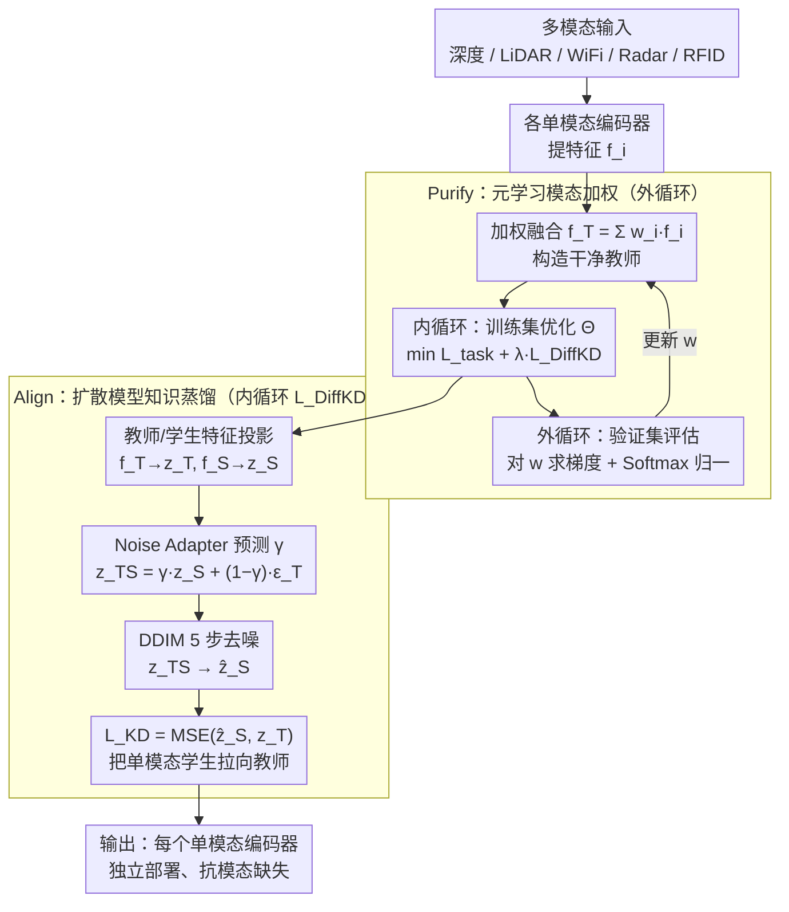

# Purify-then-Align: Towards Robust Human Sensing under Modality Missing with Knowledge Distillation from Noisy Multimodal Teacher

**会议**: CVPR 2026  
**arXiv**: [2604.05584](https://arxiv.org/abs/2604.05584)  
**代码**: [https://github.com/Vongolia11/PTA](https://github.com/Vongolia11/PTA)  
**领域**: 多模态VLM / 人体感知  
**关键词**: 模态缺失, 知识蒸馏, 元学习, 扩散对齐, 多模态融合

## 一句话总结

本文提出PTA（Purify-then-Align）框架，通过元学习驱动的模态加权机制先"净化"噪声多模态教师，再用扩散模型驱动的知识蒸馏"对齐"每个单模态学生，使单模态编码器在模态缺失场景下保持强鲁棒性，在MM-Fi和XRF55上实现SOTA。

## 研究背景与动机

1. **领域现状**：多模态人体感知（结合深度相机、LiDAR、WiFi等）是人机交互和智能医疗的基础技术，多模态融合能克服单传感器的局限性。

2. **现有痛点**：两个核心挑战——(a) **表示鸿沟(Representation Gap)**：不同传感器的数据表示差异巨大（如图像的网格像素 vs LiDAR的稀疏点云），直接融合导致信息损失；(b) **污染效应(Contamination Effect)**：低质量/高噪声的模态在融合时会污染高质量模态，降低整体性能。

3. **核心矛盾**：这两个问题是**因果关联**的——低质量模态的污染（Contamination）从根本上阻碍了异质表示间差距的缩小（Representation Gap）。现有方法（生成式重建、共享表示学习、简单融合、传统知识蒸馏）各自只解决一个方面，忽略了这一因果链。

4. **本文目标** 构建一个统一框架，先解决因（污染效应） → 再解决果（表示鸿沟），使每个单模态编码器都能独立工作且蕴含跨模态知识。

5. **切入角度**：教师-学生范式——多模态共识作为教师指导每个单模态学生。但教师本身可能被噪声模态污染，因此必须先"净化"教师（Purify），再用净化后的教师"对齐"学生（Align）。

6. **核心 idea**：元学习自适应权重解决教师端的模态污染，扩散模型知识蒸馏解决学生端的表示对齐。

## 方法详解

### 整体框架

PTA 想解决的是这样一件事：当多个传感器（深度相机、LiDAR、WiFi、雷达……）联合训练后，能不能让其中**任意一个单模态编码器单独拿出来也好用**，从而扛住推理时的模态缺失。难点在于直接做多模态融合会把低质量模态的噪声"传染"给好模态，蒸馏出来的单模态学生自然也带毒。于是论文把训练拆成一个嵌套循环：外循环先"净化"（Purify），用元学习在验证集上学出每个模态该占多大权重 $\mathbf{w}$，把噪声模态的话语权压下去；内循环再"对齐"（Align），固定 $\mathbf{w}$ 把加权融合出的"干净教师"通过扩散蒸馏灌进每个单模态学生，其中扩散去噪的起点由 Noise Adapter 按样本自适应决定。推理时不再需要教师和其他模态，每个学生编码器独立工作即可。

### 关键设计

**1. Purify 阶段——元学习模态加权：让网络自己决定该信任谁**

污染效应的根子在于：融合教师时如果对噪声模态一视同仁，它就会拖垮整个共识。最直接的对策（如 X-Fi）是手工给每个模态调 dropout 概率，但 WiFi、Radar、RFID 各自该丢多少（可能要 0.5、0.5、0.8 这种组合）全靠试，模态一多调参就崩。PTA 干脆把这件事交给元学习：内循环在训练集 $\mathcal{D}_{train}$ 上用当前固定的 $\mathbf{w}$ 优化模型参数 $\Theta$，最小化 $\mathcal{L}_{inner} = \mathcal{L}_{task} + \lambda\mathcal{L}_{DiffKD}$；外循环则在验证集 $\mathcal{D}_{val}$ 上评估这组参数的实际表现，反过来对权重求梯度 $\nabla_\mathbf{w}\mathcal{L}_{outer}$ 来更新 $\mathbf{w}$。权重经 Softmax 归一化保证稳定，训练时还会以均匀概率随机丢模态来模拟真实缺失。换句话说，"该信任哪个模态"不再是超参，而是被验证集性能这把尺子直接学出来的——噪声模态拿不到好的验证表现，权重自然被压低。

**2. Align 阶段——扩散模型知识蒸馏：把学生当成教师的"加噪版"去去噪**

净化出干净教师后，要把它的知识喂给单模态学生，但教师特征 $f_T = \sum_{i \in \mathcal{M}_{all}} \mathbf{w}_i f_i$（各模态加权和）和单模态学生特征 $f_S$ 之间隔着巨大的异质表示鸿沟，传统 KL/MSE 蒸馏一步到位地拉近这种差距很吃力。PTA 换了个视角：把 $f_T$、$f_S$ 都投影到压缩潜在空间得到 $z_T$、$z_S$，训练一个噪声预测网络 $\Phi_\phi$ 去学 $z_T$ 的分布（标准扩散损失 $\mathcal{L}_{Diff}$），然后**把信息量不足的 $z_S$ 看作 $z_T$ 的一个"噪声版本"**，用反向去噪过程一步步把 $z_S$ 精炼成更接近教师的 $\hat{z}_S$。总蒸馏损失把两部分拼起来：

$$\mathcal{L}_{DiffKD} = \mathcal{L}_{Diff} + \mathcal{L}_{KD}, \quad \mathcal{L}_{KD} = \mathrm{MSE}(\hat{z}_S, z_T)$$

这样跨模态的鸿沟不是硬拉，而是顺着扩散模型天然的"由粗到精"去噪轨迹渐进式地补齐，正好契合"从信息少的特征精炼到信息丰富的特征"这件事。

**3. Noise Adapter——自适应噪声匹配：每个样本该从多深的噪声起步并不一样**

扩散去噪有个隐藏前提：你得知道当前样本"噪声有多重"，才能选对去噪的起点时间步。但不同输入的 $z_S$ 与 $z_T$ 差距天差地别——有的学生特征已经很接近教师，有的差得很远，用固定时间步 $t$ 去套这种一对多映射会失配。Noise Adapter 是个轻量辅助网络（一个 Bottleneck + Global AvgPool + FC），针对每个样本预测一个融合系数 $\gamma \in [0,1]$，按它把学生特征和纯噪声混起来作为去噪起点：

$$z_{TS} = \gamma z_S + (1-\gamma)\,\epsilon_T$$

随后用 DDIM 从 $z_{TS}$ 出发做 5 步确定性去噪得到 $\hat{z}_S$。直觉很清楚：$z_S$ 已经接近 $z_T$ 时 $\gamma$ 取大、保留更多学生信息、少去噪；$z_S$ 很差时 $\gamma$ 取小、混入更多噪声给扩散模型更大的精炼空间。

### 一个完整示例：一个 WiFi 学生样本怎么被对齐

以 XRF55 上一个 WiFi 单模态样本为例。先看 Purify：外循环此前已学出 WiFi 因噪声大、验证表现差而拿到偏低的权重 $\mathbf{w}_{WiFi}$，于是融合教师 $f_T$ 主要由 Radar、RFID 撑起，WiFi 只占小份额——干净教师就此成形。再看 Align：这条 WiFi 样本的特征投影成 $z_S$，因为质量差，它离 $z_T$ 很远。Noise Adapter 一看差距大，预测出一个偏小的 $\gamma$，于是起点 $z_{TS} = \gamma z_S + (1-\gamma)\epsilon_T$ 里掺进大量噪声，给扩散模型留足精炼余地；接着 DDIM 跑 5 步确定性去噪，把这个含噪起点逐步推回到教师分布附近，得到 $\hat{z}_S$，最后用 $\mathrm{MSE}(\hat{z}_S, z_T)$ 把学生编码器往这个目标拉。训练收敛后，这个 WiFi 编码器单独部署时，特征里已经吸收了 Radar/RFID 教师的跨模态知识——这正是消融里 WiFi 单模态准确率从 X-Fi 的 55.7% 提升到 82.34% 的来源。

### 损失函数 / 训练策略

总内循环损失 $\mathcal{L}_{inner} = \mathcal{L}_{task} + \lambda\mathcal{L}_{DiffKD}$，$\lambda=0.1$；外循环损失 $\mathcal{L}_{outer} = \mathcal{L}_{task}(\Theta^*(\mathbf{w}))$。MM-Fi 上用 Adam（模型 lr=5e-4，元学习 lr=1e-2），batch=16；XRF55 上模型 lr=2e-4，batch=32。均在 RTX 3090 上训练。

## 实验关键数据

### 主实验

MM-Fi人体姿态估计（MPJPE mm ↓）：

| 模态 | Base.1 | Base.2 | X-Fi | **PTA (Ours)** | 提升 |
|------|--------|--------|------|----------------|------|
| Depth | 102.4 | 102.4 | 96.40 | **84.81** | +12.0% |
| LiDAR | 161.5 | 161.5 | 130.06 | **68.30** | +47.5% |
| WiFi | 227.1 | 227.1 | 210.12 | **182.18** | +13.3% |
| D+L | 111.7 | 108.0 | 89.41 | **64.68** | +27.7% |
| L+W | 167.1 | 206.2 | 111.15 | **74.74** | +32.8% |
| D+L+W | 130.7 | 154.6 | 87.59 | **68.86** | +21.4% |

XRF55动作识别（准确率% ↑）：

| 模态 | Baseline | X-Fi | **PTA (Ours)** | 提升 |
|------|----------|------|----------------|------|
| Radar | 82.1 | 83.9 | **90.03** | +6.13% |
| WiFi | 77.8 | 55.7 | **82.34** | +26.64% |
| RFID | 42.2 | 42.5 | **55.04** | +12.54% |
| R+W+RF | 70.6 | 89.8 | **95.87** | +6.07% |

### 消融实验

MM-Fi上的模块消融（MPJPE mm ↓）：

| 模态 | Full | w/o Diff | w/o Meta |
|------|------|----------|----------|
| Depth | **84.81** | 89.66 | 157.98 |
| LiDAR | **68.30** | 76.27 | 183.04 |
| WiFi | **182.18** | 187.92 | 236.99 |
| D+L | **64.68** | 78.12 | 148.65 |
| D+L+W | **68.86** | 76.79 | 160.34 |

### 关键发现

- **单模态性能提升巨大**：PTA的核心价值在于大幅增强单模态编码器——LiDAR单模态MPJPE从X-Fi的130.06降至68.30（+47.5%），说明扩散蒸馏有效地将跨模态知识注入到了单模态特征中
- **Purify stage是关键**：去掉元学习权重后性能灾难性崩溃（D+L从64.68暴涨到148.65），证明不净化教师直接蒸馏会传播噪声模态的负面影响
- **WiFi的污染效应**：WiFi单模态MPJPE=182.18远差于Depth(84.81)和LiDAR(68.30)，但PTA在L+W融合时（74.74）只比LiDAR单模态（68.30）轻微退化，说明meta权重成功抑制了WiFi的污染
- **同质模态融合增益更大**：XRF55上三种RF模态（Radar+WiFi+RFID）全融合达95.87%，因为同类射频信号的表示鸿沟较小，更容易对齐
- X-Fi需要敏感的dropout率手工调优（WiFi准确率在不同设置下从29.1%到55.7%波动），PTA用均匀dropout完全避免了这个问题

## 亮点与洞察

- **因果问题分解**：首次明确指出Contamination Effect和Representation Gap的因果链，并设计"先因后果"的两阶段解决方案。这种问题分析方式可迁移到所有多源信息融合场景（如多模态大模型训练中的数据质量问题）
- **扩散模型用于特征对齐**：将学生特征视为教师特征的"噪声版本"进行去噪精炼，是知识蒸馏的新范式。5步DDIM确保了效率，Noise Adapter解决了噪声水平未知的关键问题
- **元学习替代手工调参**：用meta-learning自动学习模态权重，彻底避免了多模态系统中per-modality dropout概率的调参噩梦。这个技巧在模态数量多时尤其有价值

## 局限与展望

- MPJPE vs PA-MPJPE的trade-off：PTA在全局定位（MPJPE）上很强，但在消除位置因素后的骨架结构（PA-MPJPE）上部分退化，说明扩散蒸馏可能让学生倾向于预测"均值姿态"而非精确的骨骼细节
- 扩散去噪在极低质量模态（WiFi/RFID）条件下可能引入生成伪影（消融中个别L+W/W+RF场景去掉扩散反而更好）
- 元学习的嵌套优化增加了训练复杂度（内外循环+验证集评估）
- 仅在人体感知任务上验证，向其他多模态融合任务的迁移尚未测试
- 模态缺失是随机均匀丢弃的模拟，未考虑更现实的系统性缺失模式（如某传感器长时间故障）

## 相关工作与启发

- **vs X-Fi**: X-Fi构建模态不变表示，但牺牲了单模态最大性能（LiDAR MPJPE 130.06 vs PTA的68.30），且需要敏感的per-modality dropout调参。PTA通过提升单模态底座实现了更好的整体性能
- **vs 生成式方法(VAE/GAN重建)**: 这些方法试图重建缺失模态的原始数据，训练不稳定且容易产生幻觉。PTA在特征空间对齐，避免了原始数据重建的困难
- **vs 传统KD**: 标准知识蒸馏（如MSE距离）难以跨越异质模态的巨大表示差距，扩散蒸馏提供了渐进式的特征精炼路径

## 评分

- 新颖性: ⭐⭐⭐⭐ 因果分析视角和Purify-then-Align范式原创性强，扩散蒸馏+元学习的组合也是新的
- 实验充分度: ⭐⭐⭐⭐ 两个大数据集，7种模态组合全覆盖，消融分析深入（含单模块消融和edge case分析）
- 写作质量: ⭐⭐⭐⭐ 因果关系的motivate非常有说服力，但符号较多需要仔细阅读
- 价值: ⭐⭐⭐⭐ 对多模态人体感知社区有重要贡献，Purify-then-Align范式可推广到更广泛的多模态学习场景

<!-- RELATED:START -->

## 相关论文

- [\[CVPR 2026\] EBMC: Enhance-then-Balance Modality Collaboration for Robust Multimodal Sentiment Analysis](ebmc_multimodal_sentiment_analysis.md)
- [\[CVPR 2026\] Disentangle-then-Align: Non-Iterative Hybrid Multimodal Image Registration via Cross-Scale Feature Disentanglement](disentangle-then-align_non-iterative_hybrid_multimodal_image_registration_via_cr.md)
- [\[CVPR 2026\] Uncertainty-Aware Knowledge Distillation for Multimodal Large Language Models](uncertainty-aware_knowledge_distillation_for_multimodal_large_language_models.md)
- [\[CVPR 2026\] BALM: A Model-Agnostic Framework for Balanced Multimodal Learning under Imbalanced Missing Rates](balm_a_model-agnostic_framework_for_balanced_multimodal_learning_under_imbalance.md)
- [\[CVPR 2026\] GTR-Turbo: Merged Checkpoint is Secretly a Free Teacher for Agentic VLM Training](gtr_turbo_merged_checkpoint_free_teacher.md)

<!-- RELATED:END -->
