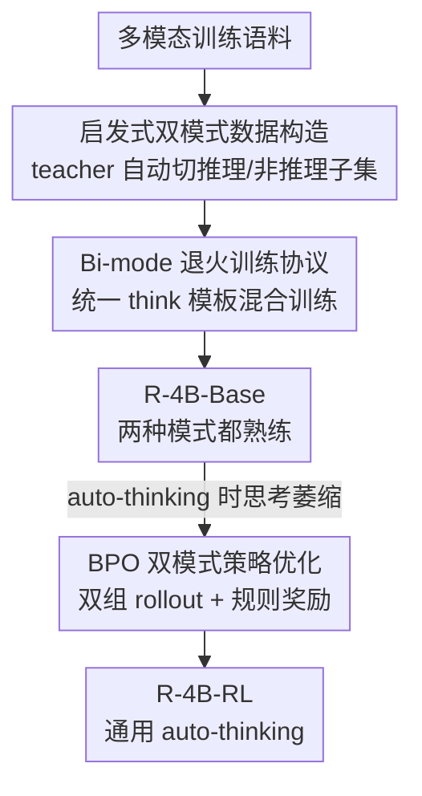

# R-4B: Incentivizing General-Purpose Auto-Thinking in MLLMs via Bi-Mode Annealing and Reinforce Learning

**会议**: CVPR 2026  
**论文**: [CVF Open Access](https://openaccess.thecvf.com/content/CVPR2026/html/Yang_R-4B_Incentivizing_General-Purpose_Auto-Thinking_in_MLLMs_via_Bi-Mode_Annealing_and_CVPR_2026_paper.html)  
**代码**: https://github.com/yannqi/R-4B  
**领域**: 多模态VLM  
**关键词**: 多模态大模型, 自适应推理, auto-thinking, 强化学习, GRPO

## 一句话总结
R-4B 让一个 4B 多模态大模型学会"该思考时才思考"：先用 **bi-mode 退火**把单个 backbone 同时练成"会推理"和"会直答"两种模式，再用 **双模式策略优化（BPO）**——对每条 query 强制同时采样思考/非思考两组回答并联合优化——只靠简单的数学规则奖励，就在 25 个 benchmark 上取得同规模 SOTA，推理任务追平甚至超过更大的模型，同时大幅省下冗余推理的 token。

## 研究背景与动机
**领域现状**：带显式 chain-of-thought（用 `<think>` 包住思考过程）的多模态大模型在数学、科学图表等复杂任务上表现强劲，已成为主流增强手段。

**现有痛点**：对所有 query 都强制"先思考再回答"代价高昂——像"这道菜叫什么名字"这种简单识别/检索问题根本不需要多步推理，却被迫生成一大段冗余思考链，白白消耗算力和 token。

**核心矛盾**：模型需要在**推理质量**和**推理成本**之间动态权衡，但现有 auto-thinking 方案要么靠用户手动切换开关（用户往往一直开着，等于没省）、要么靠人工标注每条样本的"复杂度"（如 Keye-VL，标注成本高、推理时还多花 token）、要么靠精心设计的任务专用奖励/数据（脆弱、难扩展、易 mode collapse）。

**本文目标**：造一个**免标注、省 token、通用**的多模态 auto-thinking 框架，让模型自己按输入内容的复杂度决定要不要思考。

**切入角度**：作者把问题拆成两步——先让一个 backbone **同时具备**两种模式的能力（否则后面根本无从选择），再单独教它**何时选哪种**。这样把"能力培养"和"策略学习"解耦，避免在一个阶段里既要学会推理又要学会克制。

**核心 idea**：用"双模式退火 + 双模式 rollout 的 RL"——退火阶段把推理数据和直答数据混合训练成 R-4B-Base，RL 阶段对每条 query 同时 rollout 思考组和非思考组做对比优化，只用规则化的数学奖励就让模型涌现出泛化的 auto-thinking 行为。

## 方法详解

### 整体框架
R-4B 的训练是一条两阶段串行流水线。**第一阶段 bi-mode 退火**解决"会不会两种模式"：先用一个强 teacher MLLM（Qwen2.5-VL-32B）把海量训练数据自动切成"需要推理"和"不需要推理"两个子集，再用统一的 `<think>` 模板把两类数据混合喂给 backbone，退火出一个两种模式都熟练的 **R-4B-Base**。**第二阶段 BPO（双模式策略优化）**解决"何时用哪种模式"：因为 R-4B-Base 在 auto-thinking 推理时会出现"思考萎缩"（倾向于偷懒直答，连复杂题也不思考），所以用一个基于 GRPO 的轻量 RL，对每条 query 强制采样思考、非思考两组回答放在同一个 group 里联合优化，用简单的数学规则奖励把"该思考的题才思考"这个策略逼出来，得到最终的 **R-4B-RL**。

### 关键设计

**1. 启发式双模式数据构造：免人工标注地把数据切成"该推理/不该推理"**

退火能成立的前提是有一批同时覆盖"推理密集"和"直接作答"两种行为的数据，但逐条人工标注复杂度成本高、还主观不一致。作者让一个强 teacher（Qwen2.5-VL-32B）当统一裁判，针对两类 query 用两套互补启发式自动划分：① **难度启发式**（针对主观/开放题，如创作类，对错难验证）——用 prompt-engineering 让 teacher 判断这条 query 要不要非平凡推理，复杂的归入推理子集；② **性能启发式**（针对客观题，如数学、选择题，答案可验证）——做"离线难样本挖掘"：对每条 query 让 teacher 采样 $N=8$ 个回答和 ground-truth 比对，**若 8 次全错就判为难样本→推理密集**，否则归入非推理子集。被判为推理密集的 query 再用多模态推理模型补上思考链，并做一致性校验、关键词过滤、去重等质检。这套全自动规则避免了人工标注的主观性，又能同时handle 主观题和客观题。

**2. Bi-mode 退火训练协议：用共享 `<think>` 模板把双模式塞进同一个 backbone**

切好数据后，关键是让模型对两类数据都用**统一的输入输出格式**，这样退火时模型从不直接看到"复杂度标注"，只是隐式学会两种行为。具体地，需要推理的 query 输出 `<think>推理步骤</think>答案`，适合直答的 query 输出 `<think> </think>答案`——两者共享同一个 `<think>` 模板，只是中间填不填思考内容的区别。这个共享模板是后续 RL 能无缝切换模式的关键。作者还发现：退火语料里**分配足够大比例的推理数据**既强化了思考模式，也因为两种模式共用 backbone 而提升了非思考模式的鲁棒性。消融证实，把推理与非推理数据**混合训练（Mixed-R）**显著优于只用推理数据或两阶段课程式训练（见实验）。

**3. BPO 双模式策略优化：用"双组 rollout + 规则奖励"逼出 auto-thinking 策略**

R-4B-Base 虽然两种模式都会，但 auto-thinking 推理时会"思考萎缩"——过度偏向直答，连复杂题都不思考，因为它缺少"何时该思考"的可靠策略。BPO 在 GRPO 框架上做了一个关键改动：**双模式采样**。对每条输入 prompt $q$，确定性地生成两组等大小的回答——思考组 $\{o_1,\dots,o_g\}$（输入后缀拼 `<think>\n` 触发）和非思考组 $\{\tilde o_1,\dots,\tilde o_g\}$（拼 `<think>\n\n</think>` 触发），强制 $|\text{Group}_\text{thinking}| = |\text{Group}_\text{non-thinking}| = g$，保证两种模式被均衡探索，从而防止策略坍缩成"永远思考"或"永远不思考"。两组合并成 $2g$ 个 rollout 在同一个 group 内计算相对优势，优化目标为：

$$\mathcal{J}^{\text{BPO}}(\theta) = \mathbb{E}_{q\sim P(Q)}\Big[\tfrac{1}{2g}\sum_{k=1}^{2g}\min\big(R_k A_k,\ \mathrm{clip}(R_k,1-\epsilon,1+\epsilon)A_k\big) - \beta\,\mathbb{D}_{\text{KL}}(\pi_\theta\,\|\,\pi_{\text{ref}})\Big]$$

其中策略比 $R_k$ 与优势 $A_k$ 按 GRPO 计算，$\epsilon$ 控制 clip 范围，$\beta$ 控制 KL 强度。奖励只是一个定义在**数学题上的简单规则化奖励**（看答案对不对），不需要复杂奖励工程或大规模专用数据。最妙的是这个纯数学奖励**泛化**到了非数学的多模态任务上——模型在 RL 中很快学到"对推理题思考能拿高 reward、对简单题思考几乎没回报"，于是自发把思考留给真正需要的题，这就是 BPO 的"四两拨千斤"。

### 损失函数 / 训练策略
退火阶段：用 16.3M 混合双模式数据训练 R-4B-Base。RL 阶段：BPO 在数学规则奖励上做双组 rollout 优化；评测用 greedy decoding（temperature=0），最大生成长度 8192 token，三种模式分别用不同特殊 token 触发——非思考 `<think>\n\n</think>`、思考 `<think>\n`、auto-thinking `<think>`。

## 实验关键数据

### 主实验
在 25 个公开 benchmark 上，R-4B-RL（auto-thinking 模式）在同规模模型里取得 SOTA，并在多项推理任务上追平/超过更大的模型。下表摘取代表性结果（N-T=非思考，T=思考，A-T=auto-thinking）：

| Benchmark | 能力 | Qwen2.5-VL-7B (N-T) | Kimi-VL-A3B-Thinking (T) | Keye-VL-8B (A-T) | R-4B-RL (A-T) |
|-----------|------|------|------|------|------|
| MMMU_val | 通用 VQA | 58.6 | 64.0 | 66.8 | **68.1** |
| MMStar | 通用 VQA | 64.1 | 70.4 | 72.8 | **73.1** |
| HallusionBench | 抗幻觉 | 55.7 | 57.2 | 57.3 | **58.9** |
| AI2D | 图表理解 | 83.9 | 82.7 | 85.8 | **86.2** |
| CharXiv (RQ) | 图表推理 | 42.5 | 47.7 | 40.0 | **56.8** |
| MathVerse-vision | 数学 | 41.2 | 57.4 | 40.8 | 64.9 |
| LogicVista | 逻辑 | 44.5 | 51.0 | 50.6 | **59.1** |
| DynaMath | 数学 | 20.1 | 27.1 | 35.3 | **39.5** |

R-4B-RL 在 CharXiv-RQ 上比 Kimi-VL-A3B-Thinking 高出 9 个点以上；R-4B-Base 还在 MMVet（85.9）、CountBench（92.6）上拿到新 SOTA。

### 消融实验
退火阶段四种数据策略对比（评测在 N-T 或 T 模式下，Average 为 7 个 benchmark 平均）：

| 策略 | 数据量 | 模式 | MathVision | MathVista | Average |
|------|--------|------|------|------|------|
| Non-R（仅非推理） | 16.3M | N-T | 33.2 | 71.1 | 64.4 |
| Only-R（仅推理） | 5.5M | T | 41.9 | 73.6 | 65.4 |
| Non-R→R（两阶段课程） | 10.8M→5.5M | T | 43.7 | 74.9 | 66.9 |
| **Mixed-R（混合）** | 16.3M | T | **45.7** | **76.8** | **69.5** |

混合策略（69.5）比仅推理（+4.1%）、两阶段课程（+2.6%）都明显更好；仅推理虽在 MathVision 上 +8.7%，但牺牲了通用能力导致总分更低——说明共训能防止灾难性遗忘。

RL 前后对比（R-4B-Base vs R-4B-RL，6 个推理 benchmark 平均）：

| 模型 | 模式 | Average |
|------|------|------|
| R-4B-Base | N-T | 42.0 |
| R-4B-RL | N-T | 49.9 |
| R-4B-Base | A-T | 43.2 |
| R-4B-RL | A-T | 57.0 |
| R-4B-RL | T | 58.1 |

### 关键发现
- **BPO 治好了"思考萎缩"**：RL 让推理任务平均 +10.3%，远超对非推理任务的影响——训练曲线显示，在数学类 benchmark 上思考触发率快速爬升后稳定在高位，而在 OCR/幻觉类上只缓慢微增，证明模型学到了**按任务复杂度差异化触发思考**而非一刀切开关。
- **token 自适应分配**：在简单 benchmark（如 OCR）上 auto-thinking 只比直答多出少量 token、远少于全思考；在推理重的 benchmark 上则把 token 拉到接近全思考的水平，实现"按需分配推理预算"。
- **RL 同时提升两种模式**：R-4B-RL 在非思考模式下平均从 42.0→49.9，思考模式 56.1→58.1，说明 BPO 不只学会"选模式"，还顺带强化了两种模式各自的能力。

## 亮点与洞察
- **能力与策略解耦的两阶段设计**：先退火出"两种模式都会"的 base，再用 RL 单教"何时选"，把一个困难的联合学习问题拆成两个更可控的子问题——这个范式可迁移到任何需要"自适应触发某种昂贵子过程"的场景。
- **双组 rollout 的防坍缩机制很巧**：强制每条 query 同时产出思考/非思考两组等大小回答放进同一个 advantage group 对比，结构性地杜绝了 mode collapse，无需精调奖励权重——比"靠超参平衡思考偏好"的做法稳健得多。
- **数学规则奖励的意外泛化**：只在数学题上定义简单的对错奖励，却泛化出了非数学多模态任务上的 auto-thinking 行为，提示"何时该思考"这个元能力可能比具体任务奖励更可迁移。
- **共享 `<think>` 模板贯穿两阶段**：退火和 RL 用同一个模板触发模式切换，保证了训练-推理格式一致，是工程上让两阶段无缝衔接的关键细节。

## 局限与展望
- 奖励信号主要来自数学题的可验证答案，对**没有可验证 ground-truth 的主观/开放任务**，BPO 如何拿到可靠 reward 仍不够清楚——退火阶段靠 teacher 的难度启发式，但 RL 阶段的泛化机制论文更多是经验观察而非理论保证。
- auto-thinking 是**二元**决策（思考 or 不思考），对"需要少量思考"的中等难度题，缺乏更细粒度的思考预算控制；作者把它与全局 token 惩罚类方法对比，但二元决策本身也可能在边界样本上误判。
- 整套方案依赖一个强 teacher（Qwen2.5-VL-32B）做数据划分和思考链标注，teacher 的偏差会传导进 R-4B；teacher 质量受限的领域可能复现困难。⚠️ 退火语料的领域分布（图 4 给的 16.3M 各域占比）在缓存中为图示，精确数值以原文为准。

## 相关工作与启发
- **vs Keye-VL（多模态 auto-thinking）**: Keye-VL 给每条样本标注显式复杂度分析并以此为条件，标注成本高、推理时还多花 token；R-4B 全程不让模型看到复杂度标注，靠退火 + BPO 隐式学会，免标注且省 token。
- **vs 文本域 RL auto-thinking（如 length penalty / 信息论奖励类）**: 这些方法用静态/全局约束压缩推理 token，可能在真正复杂的题上过早截断；BPO 对每条 query 做二元模式选择，在难题上保留推理质量、在易题上避免开销。
- **vs vanilla GRPO**: 直接套 vanilla RL 容易诱导出过强的思考偏好导致坍缩；BPO 的双组确定性采样从结构上强制均衡探索两种模式，是对 GRPO 在 auto-thinking 场景的关键改造。

## 评分
- 新颖性: ⭐⭐⭐⭐⭐ 双模式退火 + 双组 rollout 的 BPO 是一套干净且自洽的免标注 auto-thinking 框架，防坍缩机制设计巧妙
- 实验充分度: ⭐⭐⭐⭐⭐ 25 个 benchmark + 退火数据策略消融 + RL 前后对比 + token/触发率分析，证据链完整
- 写作质量: ⭐⭐⭐⭐ 方法清晰、动机扎实，但 BPO 奖励泛化的机理更多是经验描述
- 价值: ⭐⭐⭐⭐⭐ 4B 模型在效率与精度上双赢，代码开源，auto-thinking 范式可广泛复用

<!-- RELATED:START -->

## 相关论文

- [\[CVPR 2026\] MUPO: All Roads Lead to Rome - Incentivizing Divergent Thinking in Vision-Language Models](mupo_all_roads_lead_to_rome_incentivizing_divergent_thinking_in_vlms.md)
- [\[CVPR 2026\] All Roads Lead to Rome: Incentivizing Divergent Thinking in Vision-Language Models](all_roads_lead_to_rome_incentivizing_divergent_thinking_in_vision-language_model.md)
- [\[CVPR 2026\] TempR1: Improving Temporal Understanding of MLLMs via Temporal-Aware Multi-Task Reinforcement Learning](tempr1_improving_temporal_understanding_of_mllms_via_temporal-aware_multi-task_r.md)
- [\[CVPR 2026\] POINTS-Long: Adaptive Dual-Mode Visual Reasoning in MLLMs](points-long_adaptive_dual-mode_visual_reasoning_in_mllms.md)
- [\[CVPR 2026\] Thinking with Programming Vision: Towards a Unified View for Thinking with Images](thinking_with_programming_vision_towards_a_unified_view_for_thinking_with_images.md)

<!-- RELATED:END -->
