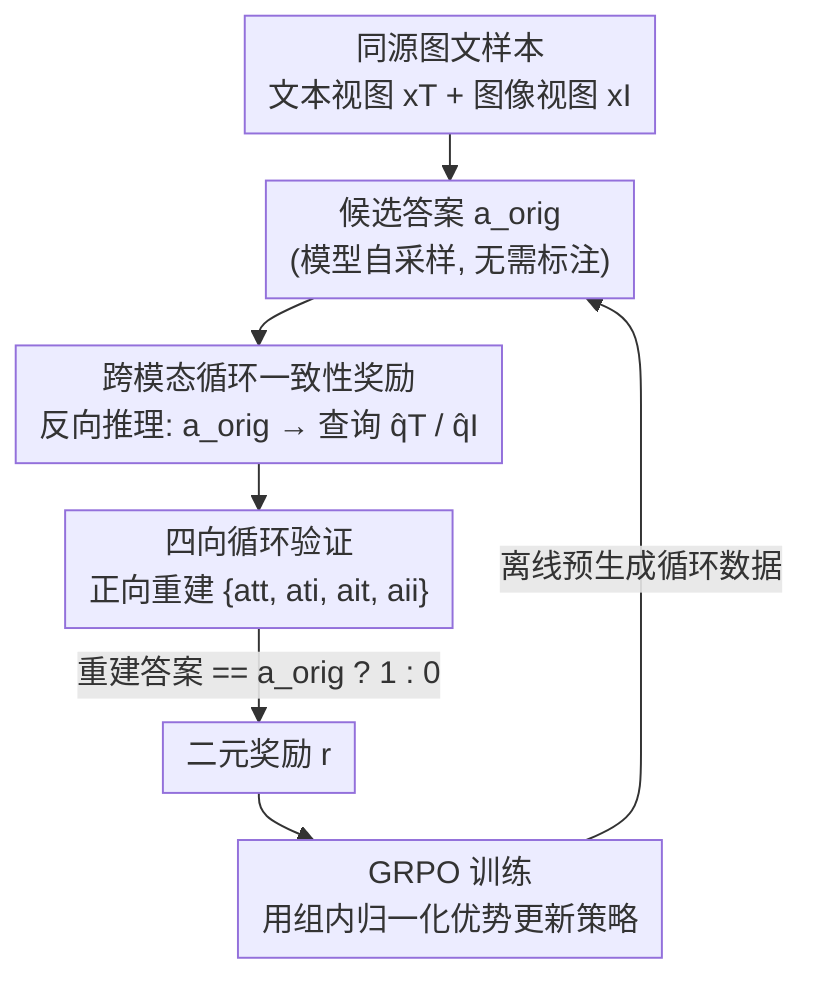

# R-C2: Cycle-Consistent Reinforcement Learning Improves Multimodal Reasoning

**会议**: CVPR 2026  
**论文**: [CVF Open Access](https://openaccess.thecvf.com/content/CVPR2026/html/Zhang_R-C2_Cycle-Consistent_Reinforcement_Learning_Improves_Multimodal_Reasoning_CVPR_2026_paper.html)  
**代码**: https://zirui00.github.io/RC2-Project-Page/  
**领域**: 多模态VLM / LLM推理  
**关键词**: 多模态推理, 循环一致性, 强化学习, 自监督奖励, 模态鸿沟

## 一句话总结
R-C2 把多模态大模型「同一内容、图文两种输入答得不一样」这个模态鸿沟反过来当作免标注的奖励信号：让模型从一个候选答案反推出问题、再切换模态正向重建答案，重建得上就给奖励，用这个稠密的循环一致性信号做 GRPO 强化学习，在 6 个多模态推理基准上最多涨 7.6 个点。

## 研究背景与动机
**领域现状**：多模态大语言模型（MLLM）已经被广泛部署在文档理解、网页 UI 导航、Agent 系统等场景，但它们存在一个根本性的「模态鸿沟」——同一份内容，用截图（图像）喂进去和用 HTML 源码（文本）喂进去，模型常常给出互相矛盾的答案。

**现有痛点**：要提升推理能力，主流做法是在精心标注的大规模数据上微调，这类数据构造昂贵、扩展性差。强化学习是一条替代路线，但它依赖可靠的奖励信号；数学、代码这类任务答案可验证，而复杂的多模态答案几乎无法自动验证。在没有标注 QA 对的情况下，近期的自改进方法退而用**多数投票**（majority voting）生成伪标签。

**核心矛盾**：投票机制有两个内生缺陷。其一是「多数即错」（majority-is-wrong）——如果模型有系统性偏差，多数 rollout 都答错，投票就会把错误答案选成伪标签，RL 反而强化模型自己的错误，导致性能崩溃。其二在多模态场景被放大：当图像分支和文本分支的预测**互相不一致**（这是极常见的情形），投票变得不稳定、武断，往往直接坍缩到某个占优模态，底层的模态冲突始终没被解决，还往训练信号里注入大量噪声。

**切入角度**：作者的关键洞察是——这种跨模态不一致不是「故障」，而是一个**尚未被利用的、天然的自监督学习信号**。与其用投票去掩盖冲突，不如把冲突本身变成奖励，逼模型自己去消解它。

**核心 idea**：从「答案侧投票」转向「答案侧验证」——给定一个候选答案，让模型反向推出能引出该答案的问题，再**切换到另一种模态**正向重建答案；只要重建答案和原答案一致就给奖励。这个循环（cycle）构成一个稠密、免标注的奖励，强迫模型对齐自己的跨模态表示。

## 方法详解

### 整体框架
R-C2 把提升多模态推理建模成一个强化学习问题，核心难点是**在没有人工标签的前提下拿到奖励信号**。它的解法是「跨模态循环一致性奖励」（Cross-Modal Cycle Consistency Reward）：对每个同时拥有文本视图 $x_T$（如 HTML）和图像视图 $x_I$（如截图）的样本，从一个候选答案 $a_{orig}$ 出发，先**反向推理**（backward，answer→query）得到问题，再**正向推理**（forward，query→answer）重建答案，比对重建答案与原答案是否一致来打二元奖励，最后用 GRPO 把这个奖励回灌进策略更新。

整条训练管线分三步：（0）多模态数据准备——保证每个样本都有语义对齐的图、文两份视图（天然成对的直接用，图像-only 的就让 MLLM 生成可靠的文本描述补齐）；（1）从候选答案构造循环数据；（2）用循环奖励做 GRPO 强化学习。作者采用**离线**策略（训练前一次性预生成全部循环数据），相比让数据随模型在线协同演化的 online 版本，离线版能预计算、批处理，训练效率显著更高。

### 关键设计

**1. 把跨模态不一致变成免标注的自监督奖励：从投票到验证**

这一招直接针对「投票伪标签会强化模型自己错误」的痛点。传统自改进方法对一个问题采样 $k$ 个答案，取众数当伪标签：$a' = \mathrm{mode}(\{a_j\}_{j=1}^{k})$，再用 $r_i = R(\hat a_i, a')$ 做奖励。多模态版本把图、文两路 rollout 池化后一起投票：$a'_{multi} = \mathrm{mode}\big(\{a_j^I\}_{j=1}^{k_I} \cup \{a_t^T\}_{t=1}^{k_T}\big)$。但这两种投票都建立在「共识=正确」的假设上，模型有系统偏差时共识本身就是错的，跨模态分歧时共识又坍缩到占优模态。

R-C2 的转变是**从「答案侧投票聚合」改成「答案侧逻辑自洽性验证」**：不再去聚合多个答案找众数，而是拿单个候选答案 $a_{orig}$（可以是模型自己的预测，也可以是任意答案来源，都不需要 query-answer 标注），去检验它在「反推问题→再正推答案」这个闭环里站不站得住。这样奖励来自答案与自身的逻辑一致性，而不是来自一群可能集体犯错的答案的多数表决，从根上绕开了「多数即错」。

**2. 四向跨模态循环一致性：既查模态内稳定，又逼模态间对齐**

光在单一模态里反推-正推还不够，那只能保证模态内自洽，治不了模态鸿沟。R-C2 的核心机制是构造一个**完整的 4 向循环**：在反向步骤，从 $a_{orig}$ 分别基于文本视图和图像视图反推出两个问题 $\hat q_T$（conditioned on $x_T$）和 $\hat q_I$（conditioned on $x_I$）；在正向步骤，每个问题都拿去**两种模态**各重建一遍答案，于是得到四条路径 T→T、T→I、I→T、I→I 和四个重建答案 $\{a_{tt}, a_{ti}, a_{it}, a_{ii}\}$。奖励是二元的：

$$r = \begin{cases} 1, & \text{若重建答案 } \hat a \text{ 与 } a_{orig} \text{ 一致}\\ 0, & \text{否则} \end{cases}$$

关键在于 R-C2 **同时用上全部四条循环**：同模态循环（T→T、I→I）强制模态内稳定性，跨模态循环（T→I、I→T）则强迫模型消解模态鸿沟、把图文语义对齐。这套完整的 4 向评估同时要求「模态内鲁棒」和「模态间一致」，给出的监督信号比单纯同模态自洽丰富得多——消融实验里 Mixed（四路全用）确实优于只用 Single 或只用 Cross。

**3. 用 GRPO 把循环奖励变成策略梯度：离线构造 + 二元奖励驱动**

拿到二元循环奖励后，R-C2 用 GRPO（Group Relative Policy Optimization）优化策略，目标是

$$L_{GRPO} = \mathbb{E}\big[\log \pi_\theta(\hat a_i \mid x_i, q_i)\cdot \hat A(\hat a_i, a_i)\big]$$

其中优势用一个 batch 内的相对归一化值计算：$\hat A(\hat a_i, a_i) = \dfrac{r_i - \mathrm{mean}(r)}{\mathrm{std}(r)}$。这样高奖励（循环闭合）的答案被提概率、低奖励的被压概率，模型逐步收敛到「跨模态都自洽」的回答。具体流程上：先从当前策略用图或文模态采样若干候选答案，每个候选经同一 MLLM 反推一个 backward query，$(\hat q, a_{orig})$ 就构成一对自生成的合成 QA；再让模型对这个 query 做正向重建、与原答案比对得到循环奖励喂给 GRPO。整套数据离线预生成、批处理，训练只跑到 100 步、用验证集做早停即可。

### 损失函数 / 训练策略
统一用 GRPO 目标，学习率 $1\times10^{-6}$，在 4 张 Blackwell 6000 Pro GPU 上做混合精度训练。每次更新每个模态采样 4 个 rollout，温度 1.0、top-p 0.95，经梯度累积得到等效 batch size 256，训练最多 100 步并用验证集早停。投票基线统一每模态 4 个 rollout。

## 实验关键数据

### 主实验
在 ScienceQA、ChartQA、MathVista、VWA（网页购物子集，改成多选题）、DocVQA、InfoVQA 六个基准上评测，骨干为 Qwen2.5-VL-3B-Instruct 与 Qwen3-VL-8B-Instruct，分别报告文本输入精度（Text Acc）和图像输入精度（Vision Acc）。下表为 Qwen2.5-VL-3B 上的代表性结果（括号内为相对 Base 的绝对提升）：

| 数据集 | Base (Text/Vision) | Voting(I+T) (Text/Vision) | R-C2 (Text/Vision) |
|--------|--------|--------|--------|
| ScienceQA | 68.9 / 76.0 | 73.1 / 78.0 | **76.7 (+7.8) / 83.3 (+7.3)** |
| ChartQA | 71.1 / 82.8 | 76.2 / 83.5 | **77.2 (+6.1) / 84.8 (+2.0)** |
| MathVista | 49.8 / 64.8 | 52.1 / 65.7 | **55.8 (+6.0) / 67.6 (+2.8)** |
| VWA | 69.0 / 62.9 | 73.3 / 64.5 | **74.5 (+5.5) / 67.1 (+4.2)** |
| DocVQA | 74.7 / 90.0 | 76.4 / 90.4 | 76.6 (+1.9) / 90.3 (+0.3) |
| InfoVQA | 54.9 / 74.1 | 56.1 / 74.3 | 56.3 (+1.4) / 74.3 (+0.2) |
| **平均** | 64.7 / 75.1 | 67.9 / 76.1 | **69.5 (+4.8) / 77.9 (+2.8)** |

R-C2 在几乎所有基准上都超过文本投票和图文联合投票两条基线，文本/视觉两路精度都涨，提升在 ScienceQA（+7.8）上最大。8B 模型上趋势一致（平均文本 +2.4、视觉 +1.1），说明方法与模型规模互补、底子越强也仍有效。

除精度外，作者还看「一致性比率」（Consistency Ratio，图文预测一致的样本占比）。Qwen2.5-VL-3B 上 R-C2 把 ScienceQA 一致性从 74.9 拉到 84.9（+10.0）、ChartQA 提 +6.1，6 基准平均一致性从 66.9 升到 71.3——证明它不只提精度，还真把图文语义拉到了同一解释上。

### 消融实验
四向循环里到底哪几条有用？作者在 ScienceQA / ChartQA（Qwen2.5-VL-3B）上拆开比较循环路径配置：

| 循环配置 | ScienceQA (Text/Vision/Cons.) | ChartQA (Text/Vision/Cons.) | 说明 |
|---------|--------|--------|------|
| Single（I→I, T→T） | 74.0 / 81.7 / 81.2 | 76.2 / 83.7 / 77.3 | 只用模态内循环 |
| Cross（I→T, T→I） | 75.8 / 80.1 / 83.1 | 76.5 / 83.8 / 78.4 | 只用跨模态循环 |
| Mixed（四路全用） | **76.7 / 83.3 / 84.9** | **77.2 / 84.8 / 79.5** | 完整 R-C2 |

### 关键发现
- **四向全用最优**：Mixed 配置在精度和一致性上都领先 Single / Cross，验证了「模态内稳定 + 模态间对齐」缺一不可——只做模态内（Single）一致性最低，只做跨模态（Cross）精度又不如混合。
- **反向问题生成要用上双模态**：在 9 种 forward-backward 路径组合的热力图分析（图 6）中，反向推理（answer→query）时同时利用图像和文本，能稳定带来更高精度和更强跨模态一致性，说明多模态 grounding 给循环提供了更可靠的信号。
- **投票会丢正确信号**：在案例可视化里，base 和投票基线常因模态分歧给出矛盾答案，而 R-C2 通过循环对齐让图、文两路都输出正确且一致的答案。

## 亮点与洞察
- **把「bug」当「信号」**：最让人「啊哈」的是视角的反转——大家都把跨模态不一致当成要消除的故障，R-C2 反过来把它当成免费的、稠密的监督来源。这种「劣势即资源」的思路可迁移到任何存在多视图/多表示不一致的自监督场景。
- **循环一致性 + RL 的嫁接**：cycle consistency 本是 CycleGAN 等生成任务的老 trick，这里被巧妙搬到「答案→问题→答案」的推理闭环上，并转成 GRPO 的二元奖励，给「答案无法自动验证」的多模态推理找到了一个可验证的代理。
- **离线预生成的工程取舍**：循环数据离线一次性生成、批处理，牺牲了 online 数据随模型协同演化的理论优势，换来显著更高的训练效率，是个务实的工程决定。

## 局限与展望
- **依赖图文双视图**：方法要求每个样本都有语义对齐的图、文两份视图，图像-only 数据得先让 MLLM 生成文本描述补齐——这一步的描述质量会直接影响循环信号的可靠性，若描述本身有偏，循环可能「自洽地错」。
- **二元奖励偏粗**：奖励只看重建答案是否完全匹配原答案，对「部分正确/语义近似」缺乏细粒度区分；「matches」的判定标准在笔记里未细化 ⚠️ 以原文为准。
- **离线策略的固有滞后**：离线预生成的循环数据无法随策略更新而协同演化，模型能力提升后旧循环数据的难度分布可能不再匹配，可能限制后期收益。
- **训练步数很短**（≤100 步），长程训练下循环奖励会不会因模型一致性升高而信号变稀疏，文中未深入。

## 相关工作与启发
- **vs 单模态/多模态多数投票（如 R0）**：投票把「共识」等同于「正确」，模型系统偏差时会强化错误（多数即错），多模态下还会因图文分歧坍缩到占优模态。R-C2 改用答案自身的循环自洽性做奖励，从原理上规避了这两类失败。
- **vs 过程奖励 / 学习型奖励模型**：这类方法在数学、代码等可验证域有效，但在多模态里步级评估含糊、学习型奖励模型会继承模态特定偏差，导致奖励错配。R-C2 的奖励是结构性的、无需额外奖励模型，也不依赖人工或合成 QA 标注。
- **vs 合成图文 QA 微调**：主流做法是先给图像加 caption 再让 LM 生成 QA 对，既要人工筛选又会传播 caption 偏差。R-C2 利用自然多模态数据里**已有的**图文结构，不需要大量人工构造的合成 QA。

## 评分
- 新颖性: ⭐⭐⭐⭐⭐ 把跨模态不一致从「要消除的故障」反转为「免标注奖励」，视角新且自洽
- 实验充分度: ⭐⭐⭐⭐ 6 基准 × 2 规模 + 一致性 + 路径消融 + 热力图分析较完整，但缺与更多 RLHF/过程奖励基线的横向对比
- 写作质量: ⭐⭐⭐⭐ 动机和 4 向循环讲得清楚，但全文 R-C2 与 C3R 命名混用、易让读者困惑
- 价值: ⭐⭐⭐⭐ 给「答案不可验证」的多模态推理提供了一条免标注的强化学习路径，工程上可落地

<!-- RELATED:START -->

## 相关论文

- [\[CVPR 2026\] Reading or Reasoning? Format Decoupled Reinforcement Learning for Document OCR](reading_or_reasoning_format_decoupled_reinforcement_learning_for_document_ocr.md)
- [\[CVPR 2026\] Visual Reasoning through Tool-supervised Reinforcement Learning](visual_reasoning_through_tool-supervised_reinforcement_learning.md)
- [\[CVPR 2026\] Thinking With Videos: Multimodal Tool-Augmented Reinforcement Learning for Long Video Reasoning](thinking_with_videos_multimodal_tool-augmented_reinforcement_learning_for_long_v.md)
- [\[CVPR 2026\] EMO-R3: Reflective Reinforcement Learning for Emotional Reasoning in Multimodal Large Language Models](emo-r3_reflective_reinforcement_learning_for_emotional_reasoning_in_multimodal_l.md)
- [\[CVPR 2026\] MoE-GRPO: Optimizing Mixture-of-Experts via Reinforcement Learning in Vision-Language Models](moe-grpo_optimizing_mixture-of-experts_via_reinforcement_learning_in_vision-lang.md)

<!-- RELATED:END -->
