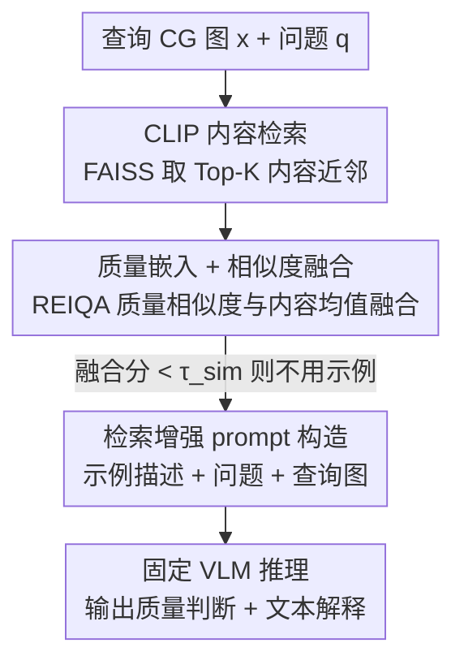

# R4-CGQA: Retrieval-based Vision Language Models for Computer Graphics Image Quality Assessment

**会议**: CVPR 2026  
**论文**: [CVF Open Access](https://openaccess.thecvf.com/content/CVPR2026/html/Li_R4-CGQA_Retrieval-based_Vision_Language_Models_for_Computer_Graphics_Image_Quality_CVPR_2026_paper.html)  
**代码**: https://github.com/lizhuangzi/R4-CGQA  
**领域**: 多模态VLM  
**关键词**: 计算机图形, 图像质量评估, 检索增强生成, 视觉语言模型, 内容-质量双流检索

## 一句话总结
R4-CGQA 针对"计算机图形（CG）图像质量评估缺乏可解释文本描述、且 VLM 直接评判 CG 质量不够准"的问题，先构建首个带六维质量描述的 3.5K CG 数据集，再提出一个**内容相似 + 质量相似双流检索**框架——免微调地把视觉相似 CG 图的质量描述当作示例喂给 VLM，在 LLaVA、Llama 3.2-V、Qwen2.5-VL 等多个 VLM 上一致提升 CG 质量评估能力。

## 研究背景与动机
**领域现状**：CG 渲染（游戏、3D 动画、影视特效）对画质要求极高，工业界需要智能算法来评估和指导 CG 内容渲染质量。

**现有痛点**：① 现有 CG 数据集只提供标量主观分数（MOS），不解释"为什么是这个分"，无法指导后续渲染改进；② 直接把自然图像质量评估（IQA）方法套到 CG 上不合适——CG 完全由仿真构造（物体、纹理、光源、相机视角），其失真和感知特性和自然图像差异很大；③ VLM 虽有质量描述能力，但在 CG 质量评估（CGQA）这种知识不确定的领域容易幻觉，而微调 VLM 又要大量算力和数据、还难保持知识更新。

**核心矛盾**：好的 CGQA 既要给出**可解释的质量原因**（指导改进），又不能依赖昂贵的微调；但 VLM 直接零样本评判 CG 质量精度不够。

**本文目标**：① 造一个系统描述 CG 质量维度的数据集；② 设计一个免微调、通用、能直接增强现有 VLM 的 CGQA 框架。

**切入角度**：作者做了个关键观察（图 2）——给 VLM 提供**视觉相似 CG 图的质量描述**作为参考，能显著提升它回答目标 CG 质量问题的准确率；而提供不相关的描述反而有害。这启发用检索增强（RAG）来做 CGQA。

**核心 idea**：用"内容相似 + 质量相似"的双流检索从 CG 库里挑出最合适的示例描述，拼进 prompt 喂给 VLM，免微调地解锁 VLM 的 CGQA 潜力。

## 方法详解

### 整体框架
R4-CGQA 是一个 RAG 式的两阶段检索 + VLM 推理流水线。输入是一张待评 CG 图 $x$ 和关于它质量的自然语言问题 $q$，系统先从一个带人工质量描述的 CG 库 $D=\{(x_i,t_i)\}_{i=1}^N$ 里检索出最相似的一张库图、取其描述 $t_{I^\star}$，再把"示例描述 + 问题 + 查询图"拼成检索增强 prompt 喂给固定参数的 VLM，输出标量质量判断（如"画质很好"）+ 自由文本解释。检索分两阶段：**阶段 1** 用 CLIP 内容嵌入做粗筛，FAISS 全局索引取 Top-K 内容近邻候选；**阶段 2** 在这 K 个候选里用 REIQA 质量嵌入算质量相似度，与内容相似度融合后选出最终示例。整套框架不改 VLM 权重，只在推理时注入检索到的描述。

### 关键设计

**1. 六维 CG 质量描述数据集：把"为什么"写进标注**

现有 CG 数据集只有 MOS 标量分、低分辨率、且不解释评分理由，无法支撑基于多模态大模型的智能评估。作者先咨询 CG 从业者，抽象出 **6 个 CG 质量维度**：光照质量、材质质量、色彩质量、氛围、真实感、空间。然后招募 15 名有游戏经验或 CG 专业背景的标注员（先培训统一评分尺度），要求每张图至少从 3 个最显著维度描述质量并给出整体结论，标注还经过交叉复核与争议重标。最终数据集含 **3.5K 高分辨率 CG 图**（1080p–4K，涵盖中世纪/现代/暗黑写实、奇幻、卡通等风格，来源含 Wallpaper Engine、游戏 CG 截图、CGIQA-6K 子集等），多数描述超过 1000 字符、细节丰富。数据切分为 base set（3190 张，做训练/微调/检索库）、validation（90 张）、testing（220 张），后两者用 GPT-4o 生成选择题、是非题、普通问答三类问题（每类≥5 题），合计 >5K QA 对作为 benchmark。这是首个系统解释 CG 图质量的数据集。

**2. 内容-质量双流检索：用两种相似度挑出"既像内容又像质量"的示例**

作者前作只用内容相似检索，但**内容相同的 CG 图质量可能差很多**，而 CLIP 对图像退化不敏感——若"相似"图之间质量差异大，把它喂给 VLM 反而会误导。于是引入双流：对任意图 $z$，用 CLIP 算内容嵌入 $f_c(z)$、用 REIQA 算质量嵌入 $f_q(z)$，都做 $\ell_2$ 归一化。**阶段 1 内容检索**：算查询图与库图的内容余弦相似度 $s_c(x,x_i)=\hat f_c(x)^\top\hat f_c(x_i)$，FAISS 全局索引取 Top-K 候选 $S_K(x)$（粗筛，缩小到查询周围的小邻域）。**阶段 2 质量融合**：只在这 K 个候选里算质量相似度 $s_q(x,x_i)=\hat f_q(x)^\top\hat f_q(x_i)$，与内容相似度简单平均融合：

$$S(x,x_i)=\tfrac{1}{2}s_c(x,x_i)+\tfrac{1}{2}s_q(x,x_i),\quad i\in S_K(x)$$

取融合分最高者 $I^\star(x)=\arg\max_{i\in S_K(x)}S(x,x_i)$ 作为示例。这种"先内容粗筛、再质量精排"的设计既保证示例和查询图内容相关、又保证质量水平接近，比单用任一分支都更鲁棒。

**3. 阈值门控的 prompt 构造与 VLM 推理：宁缺毋滥地注入示例**

检索到的描述不一定靠谱——若库里没有足够相似的图，硬塞一个不相关描述会变成噪声、损害 VLM 判断。为此设阈值 $\tau_\text{sim}$：若 $\max_{i\in S_K(x)}S(x,x_i)<\tau_\text{sim}$，则**不注入任何示例描述**，只用查询图 + 问题让 VLM 作答。选定示例 $I^\star$ 后，用固定模板 $\text{FORMAT}(q,t_{I^\star})$ 先呈现示例描述、再问 VLM 评判查询 CG 的质量，把图和文本 prompt 一起送进 VLM 得到标量判断 + 文本解释。这个"够相似才用、不够就不用"的门控是避免检索噪声的关键保险。

### 一个完整示例
给定一张待评 CG 图和问题"这张 CG 的画质如何？"：① CLIP 内容检索从 3190 张 base set 里取出 Top-K（如 K=5）内容近邻；② 对这 5 张分别算 REIQA 质量相似度，与内容相似度各占一半融合，得到 avg 分；③ 若最高 avg ≥ $\tau_\text{sim}$（如 0.8），选出该库图的人写描述作为示例，否则不用示例；④ 把示例描述 + 问题 + 查询图按固定模板拼成 prompt 喂 VLM；⑤ VLM 输出"画质很好"+ 一段关于光照/材质/真实感的解释。整个过程不改 VLM 权重。

## 实验关键数据

### 主实验
在 testing set 上对 10 个代表性 VLM 做对照（"Original"= VLM 直接答，"R4-CGQA"= 加本文检索；Choice/Yes-or-no 用准确率，Q&A 用 GPT-4o-mini 在 5 分制上打分）。R4-CGQA 对每个模型的每个指标都带来提升：

| VLM | Choice (Orig→R4) | Yes-or-no (Orig→R4) | Q&A (Orig→R4) |
|-----|------|------|------|
| LLaVA 1.6-7B | 51.70→58.06 (+6.36) | 49.73→58.84 (+9.11) | 2.20→2.50 |
| LLaVA 1.6-13B | 53.96→61.43 (+7.47) | 51.34→60.37 (+9.03) | 2.22→2.56 |
| Llama 3.2-V-11B | 64.59→67.28 (+2.69) | 56.87→67.26 (+10.39) | 1.93→2.31 |
| MiniCPM-V-8B | 60.05→67.63 (+7.58) | 53.47→61.98 (+8.51) | 1.92→2.34 |
| BakLLaVA-7B | 43.72→55.97 (+12.25) | 52.85→61.17 (+8.32) | 1.67→1.96 |
| Qwen 2.5-VL-32B | 77.71→79.21 (+1.50) | 67.50→70.24 (+2.74) | 2.79→2.87 |

Choice 平均绝对增益 4.26%，Yes-or-no 平均增益 6.94%，Q&A 平均 +0.32 分（占满分的 6.40%）。增益对**较弱的小模型更显著**（如 BakLLaVA Choice +12.25%），对强模型（Qwen 32B、LLaVA-NeXT-32B）也有非平凡提升。在 LLaVA 1.6-13B 上，本方法只带来 4.5% 运行时开销和额外 1748 MB 显存。

### 消融实验
内容/质量双流检索消融（"w/o."= 去掉某分支）：

| 配置 | LLaVA 1.6-7B Choice / Yes-or-no | Llama 3.2-V-11B Choice / Yes-or-no |
|------|------|------|
| Base（不检索） | 50.1% / 48.8% | 65.3% / 55.8% |
| w/o. quality（去质量嵌入） | 56.8% / 59.0% | 61.0% / 68.3% |
| w/o. content | 57.0% / 60.4% | 65.2% / 68.9% |
| **Full（双流）** | **59.8% / 59.9%** | **66.7% / 69.0%** |

完整双流相对 Base 在 LLaVA-7B 上 Choice/Yes-or-no 各 +9.7%/+11.1%，在 Llama 上 Yes-or-no +13.2%，且所有 Full 配置的 Q&A 分最高，证明双流比任一单分支都更鲁棒。⚠️ 原文对 "w/o. content" 的文字说明与表头疑有 OCR/笔误（正文两处都写成 "w/o. quality"），其具体含义以原文为准。

### 关键发现
- **K 有最优值**（LLaVA 1.6-7B，T=0.8）：K 从 1→5 准确率上升（Choice/Yes-or-no 达 59.8%/59.9%），K 再增大反而下降——候选集太小示例不够、太大引入噪声，中等邻域最佳。
- **阈值 T 的作用**：T 在 0.7–0.9 间时准确率较稳定，K=5 比 K=7 更稳；当 T=1.0（即完全不选示例）时 Yes-or-no 准确率急剧下降，直接验证了示例描述的价值。
- **多图输入不是好替代**：在能处理多图的 Pixtral 上，直接把相似图和查询图一起喂（Multi-image only）Choice 反而降 2.3%，即便叠加本方法也比单用 R4-CGQA 低 2.5%——说明常规 VLM 不擅长多图比较分析，"检索描述当文本上下文"优于"直接塞多图"。

## 亮点与洞察
- **"质量也要检索相似"是核心洞察**：CLIP 对退化不敏感，光按内容检索可能挑到内容像但质量天差地别的图、反而误导 VLM；引入 REIQA 质量嵌入做第二流，是该方法比朴素 RAG-IQA 高明的地方。
- **免微调、即插即用**：不改任何 VLM 权重，只在推理时注入检索描述，就能通用地提升 LLaVA/Llama/Qwen 等多个模型——开销极小（4.5% 运行时、1.7GB 显存），对工业部署友好。
- **阈值门控体现"宁缺毋滥"**：检索增强最大的风险是注入噪声，本文用相似度阈值在"没有足够相似示例时主动放弃注入"，这个简单保险对 RAG 类方法普遍可借鉴。
- **首个可解释 CG 质量数据集**：六维度 + 长文本描述把"为什么这个质量"写清楚，不只给标量分，为 CGQA 从"打分"走向"解释 + 指导渲染"打下数据基础。

## 局限与展望
- **检索失败时会注入噪声**：作者自己讨论（图 9），当检索到的 CG 与查询语义不匹配时，注入的质量导向文本会与问题错配、变成误导——阈值门控只能缓解、不能根除。
- **依赖外部质量编码器 REIQA 和内容编码器 CLIP**：双流检索质量受这两个预训练模型在 CG 域的迁移能力限制，CG 与自然图像分布差异大时，CLIP/REIQA 的嵌入是否足够判别仍存疑。
- **数据规模与覆盖**：3.5K 图、6 个维度虽是首创，但相对自然图像 IQA 数据集仍偏小，风格/渲染引擎覆盖有限；benchmark 问题由 GPT-4o 生成，可能带模型偏好。
- 改进方向：可探索面向 CG 的专用质量嵌入（而非借用 REIQA）、可学习的内容-质量融合权重（当前是固定 0.5/0.5 平均），以及更细粒度的逐维度检索。

## 相关工作与启发
- **vs 传统/深度 CGQA（如 Wang et al.、Zhang et al.）**: 他们只产出标量 MOS 分、不解释原因，本文给出六维文本描述 + 可解释评判，并用检索把这些描述用起来。
- **vs Q 系列 VLM-IQA（Q-Bench / Q-Instruct / Q-Adapt）**: 这些工作多靠微调 VLM 或构造大规模 QA 对调教低层视觉能力；R4-CGQA 完全免微调，用 RAG 注入示例，省算力且易保持知识更新。
- **vs CLIP 零样本 IQA**: 纯靠 CLIP 文本-图像相似度做质量代理，对 CG 退化不敏感；本文额外引入 REIQA 质量流弥补 CLIP 的质量盲区。

## 评分
- 新颖性: ⭐⭐⭐⭐ 内容-质量双流检索 + 阈值门控的免微调 CGQA 框架，配首个可解释 CG 质量数据集，切入点清晰
- 实验充分度: ⭐⭐⭐⭐ 覆盖 10 个 VLM + 双流消融 + K/T/多图分析，证据较全，但数据集规模偏小
- 写作质量: ⭐⭐⭐⭐ 动机和方法清楚，公式规范；个别表格说明疑有笔误
- 价值: ⭐⭐⭐⭐ 免微调、即插即用、对小模型增益大，数据集与代码开源，CGQA 方向实用

<!-- RELATED:START -->

## 相关论文

- [\[CVPR 2026\] UARE: A Unified Vision-Language Model for Image Quality Assessment, Restoration, and Enhancement](uare_a_unified_vision-language_model_for_image_quality_assessment_restoration_an.md)
- [\[CVPR 2026\] Probabilistic Prompt Adaptation for Unified Image Aesthetics and Quality Assessment](probabilistic_prompt_adaptation_for_unified_image_aesthetics_and_quality_assessm.md)
- [\[ICLR 2026\] Self-Evolving Vision-Language Models for Image Quality Assessment via Voting and Ranking](../../ICLR2026/multimodal_vlm/self-evolving_vision-language_models_for_image_quality_assessment_via_voting_and.md)
- [\[CVPR 2026\] R4: Retrieval-Augmented Reasoning for Vision-Language Models in 4D Spatio-Temporal Space](r4_retrieval-augmented_reasoning_for_vision-language_models_in_4d_spatio-tempora.md)
- [\[ICLR 2026\] Grounding-IQA: Grounding Multimodal Language Models for Image Quality Assessment](../../ICLR2026/multimodal_vlm/grounding-iqa_grounding_multimodal_language_model_for_image_quality_assessment.md)

<!-- RELATED:END -->
