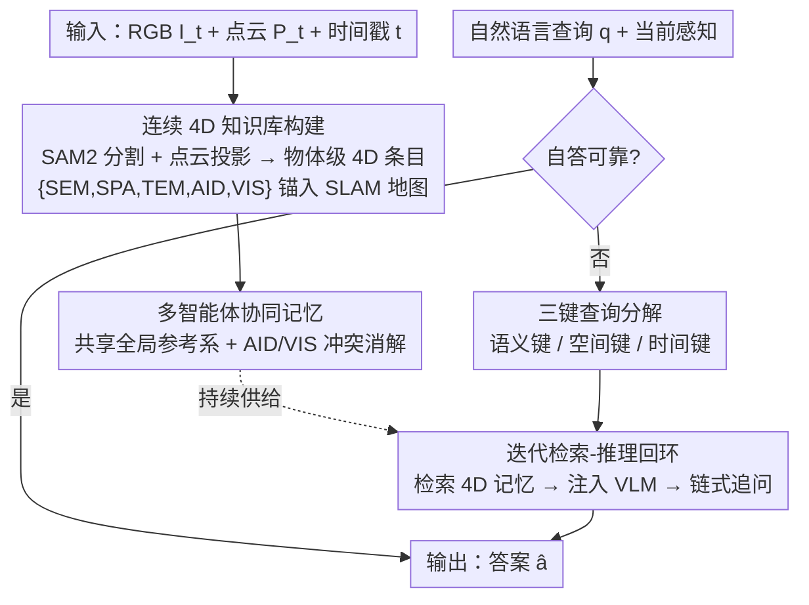

# R4: Retrieval-Augmented Reasoning for Vision-Language Models in 4D Spatio-Temporal Space

**会议**: CVPR 2026  
**论文**: [CVF Open Access](https://openaccess.thecvf.com/content/CVPR2026/html/Sohn_R4_Retrieval-Augmented_Reasoning_for_Vision-Language_Models_in_4D_Spatio-Temporal_Space_CVPR_2026_paper.html)  
**代码**: 待开源（作者声明 upon publication 开源）  
**领域**: 多模态VLM / 具身推理  
**关键词**: 检索增强推理、4D 时空记忆、具身问答、免训练、多智能体协同

## 一句话总结
R4 给冻结的视觉-语言模型外挂一个随时间持续生长的"4D 时空知识库"（语义+三维空间+时间），推理时把自然语言查询拆成语义/空间/时间三把钥匙去检索这块记忆并迭代注入 VLM，从而在不训练任何参数的情况下，让 VLM 能回忆几分钟前看过的物体、推断被遮挡/已消失的实体、并跨智能体协同，在具身问答与导航基准上大幅超越 GPT-5、o3 等强基线。

## 研究背景与动机
**领域现状**：当前 VLM 在视觉问答、具身导航、操作等任务上进展显著，但它们要么完全依赖参数里"背"下来的知识，要么只能看当前这一小段视觉输入。

**现有痛点**：纯参数化 VLM 在知识密集或长程任务上容易幻觉，要吸收新信息得重训（带来灾难性遗忘），且没有持久记忆。已有的检索增强（RAG）方案多在静态文本语料上做检索；多模态扩展如 ReMEmbR 只存"扁平的视频字幕 + GPS 时间戳"，缺少物体级几何，无法做精确的度量空间推理；3D-Mem 存的是无结构的图像快照，等于把所有时空推理又甩回 VLM 的上下文窗口，复杂度量问答精度受限。

**核心矛盾**：人类不是从孤立视觉输入推理的——我们把新观测锚定到一个持久的世界心智模型里，这个模型同时编码"是什么（语义）、在哪（空间）、何时出现/变化（时间）"。机器缺的正是这样一个**结构化、度量锚定、时间持续**的 4D 记忆，以及在其上检索-推理的机制。

**本文目标**：让 VLM 能跨长时序、跨被遮挡实体、甚至跨多个智能体，把过去与协同观测整合进当前决策——且不微调底层 VLM。

**切入角度**：模仿人类记忆机制，把"语义描述"与"度量空间定位 + 时间持续性"耦合成物体级条目，让检索直接发生在结构化 4D 空间里，而非文本/图像的相似度查找。

**核心 idea**：用一个**连续 4D 知识库 + 三键（语义/空间/时间）检索-推理回环**替代传统 RAG 的"静态文本检索"，实现免训练的具身 4D 推理。

## 方法详解

### 整体框架
R4 由两条紧耦合、并行运行的管线组成：**存储管线**随智能体移动持续构建一个终身、连续的 4D 知识库 $D$；**检索-推理管线**在推理时把自然语言查询拆成语义、空间、时间三把钥匙，去 $D$ 里检索证据并迭代注入冻结的 VLM。整个系统靠一个 SLAM 后端提供全局一致参考系，使所有空间特征、智能体自身位姿都对齐到同一坐标，从而支持跨智能体共享同一块记忆。

### 关键设计

**1. 连续 4D 知识库：把每个物体锚成"语义+空间+时间"的终身条目**

这是 R4 解决"缺持久、度量记忆"痛点的根基。每个时间步，给定同步的 RGB 图像 $I_t$、点云 $P_t$ 和时间戳 $t$，先用 SAM2 把图像切成单物体掩码；借助相机内外参把点云投影到图像空间，与掩码 $m_j$ 关联后，对每个物体 $o_j$ 算出世界坐标系下的三维质心 $c^t_j=\text{centroid}(P_t[m_j])$ 与包围盒尺寸 $e^t_j=\text{extent}(P_t[m_j])$；再用一句 self-prompt 让 VLM 生成"简洁的单实例语义描述"。三者拼成一个物体级 4D 条目 $O^t_j=\{\text{SEM},\text{SPA},\text{TEM},\text{AID},\text{VIS}\}$，其中 SEM 是自然语言描述、SPA 是空间属性、TEM 是时间区间、AID 是观测者智能体 ID、VIS 是可见性标志（是否被遮挡）。条目用三套机制分别落库：语义嵌入进向量库、空间存进全局度量欧氏空间、时间按出现/消失时间戳存进列式时序库。质心 $c^t_j$ 作为"特殊点"插进全局一致、持续更新的 SLAM 地图 $M$，把地图位置与对应的 4D JSON 物体 $O^t_j$ 链接起来，于是知识库 $D=(M,\{O_j\}_{j=1}^N)$。这种"地图给精确定位 + JSON 给丰富语义/时间"的双表示，是它能做精确度量问答、又能携带语义的关键。库还会**增量精化**：新观测 $o'_j$ 与已有条目 $o_k$ 按 $\lVert c'_j-c_k\rVert_2<\epsilon_c \wedge \text{sim}(\text{SEM}'_j,\text{SEM}_k)>\delta_s$（空间近 + 语义相似）配对，由智能体判定是旧物体（更新/补属性如颜色、纠正早先不确定的描述）还是新物体（插入）。

**2. 多智能体协同记忆：用 AID/VIS 在共享地图上消解冲突**

针对"单体记忆有限、协同时观测会打架"的问题，多个智能体把各自的 SLAM 地图对齐到同一全局参考系，共建一块共享 4D 知识库。一个智能体进入此前被别人探索过的区域，能直接继承先验物体知识并用自己的感知去精化扩展。融合冲突靠条目里的元数据解决：AID 标记每条记录的来源/出处；若两个智能体对同一空间位置给出矛盾的语义描述，模型用 VIS 标志**优先采信未遮挡观测**而非被遮挡观测；物体是静止还是动态，则通过同一物体 ID 的历史条目做属性匹配隐式推断。

**3. 三键查询分解与结构化检索手册：把自然语言翻译成可执行的 4D 检索命令**

标准 RAG 在文本上做相似度匹配，无法回答"12 秒前在车右边的是什么物体"这类本质 4D 的问题。R4 在系统提示里塞进一份"检索手册"，规定三类键的合法语法：语义键 $k_{sem}$（物体类别/属性/状态/角色，如"树状物""开着的门"）、空间键 $k_{spa}$（相对自我坐标系或绝对世界坐标的空间关系，如"前方 10 米""我视野右侧"）、时间键 $k_{tem}$（绝对/相对时间引用与区间，如"12 秒前""上次经过时"）。VLM 据此把复杂查询拆成一组检索命令——例如"刚才看到的红色公交车"被拆成对"红色公交"的语义搜索 + 一个时间区间搜索。三路检索分别在异质空间上做：语义搜索用嵌入空间余弦相似度比对 SEM；空间搜索在 SLAM 地图 $M$ 的度量空间里按最近邻/方向过滤取质心满足 $k_{spa}$ 的物体；时间搜索按时间区间 TEM 匹配 $k_{tem}$。每把键（单用或耦合）都会取回对应物体的整套 4D 信息。

**4. 迭代检索-推理回环：先自评能否回答，不行再边检索边链式追问**

推理是两步回环。**第 1 步自评可答性**：VLM 先只凭当前感知 + 参数知识尝试作答，若内部判定（置信度 + 思维链一致性）可靠就直接输出；否则进入检索增强推理。**第 2 步结构化检索**：用上面的三键把检索结果序列化成文本上下文 $C(q)$（含 AID 与可见性，让 VLM 能据来源判断信息可靠性），拼回原查询喂给 VLM：$\hat{a}=\text{VLM}(q\oplus C(q))$。模型在一个连续的检索-推理循环里运行，每轮推理输出又成为下一轮查询输入，直到满足终止条件。它不止取静态条目，还会过滤不合理实例、动态把该聚到一起的物体/特征重新聚合。后续迭代可隐式**扩大检索范围**并做**链式查询**——例如要确定"桌子 2 米内有什么"，先检索桌子再查其空间邻域，逐步探索早先检索没覆盖到的、不太确定但可能相关的信息。

### 损失函数 / 训练策略
R4 **完全免训练**：底层 VLM 冻结，没有任何梯度更新或微调，全部能力来自结构化记忆 + 提示工程（检索手册 system prompt）。实现上用 MapAnything 作为 4D 地图后端，SAM2 Hiera Large 做分割，Gemma3-4B-IT 作主干 VLM。

## 实验关键数据

### 主实验
评测覆盖三个互补的具身推理基准：ERQA（物理环境具身推理，多选准确率）、OpenEQA（情景记忆 EM-EQA + 主动 A-EQA，用 LLM-Match 正确率与效率指标）、VLM4D（结构化 4D 知识的形成与跨场景迁移）。R4 仅用 4B 量级、免训练的主干，却全面超越巨型闭源模型。

| 基准 | 指标 | R4 | 次优基线 | 提升 |
|------|------|------|----------|------|
| ERQA | 多选准确率 | **70.25** | GPT-5 65.7 | +4.55 |
| OpenEQA EM-EQA (All) | LLM-Match | **79.77** | GPT-5 64.4 | +15.37 |
| OpenEQA EM-EQA (HM3D) | LLM-Match | **76.96** | — | 比次优 +30.36 |
| OpenEQA A-EQA (HM3D†) | LLM-Match | **74.00** | GPT-4V 41.8 | +21.4 ⚠️ |
| VLM4D Overall | 综合准确率 | **77.31** | Gemini-2.5-Pro 62.0 | +15.31 |

> ⚠️ A-EQA 各列基线分散，缓存中部分数值（如 +21.4 / +21.37）为原文文字叙述，具体对照列以原文为准。在 VLM4D 上，R4 唯独在 FP（假阳性/局部判别）一项不占优——原文解释 FP 衡量的是局部情景判别，记忆本就不该带来优势。

### 消融实验
在 184 道 EM-EQA 子集上拆语义(SEM)/空间(SPA)/时间(TEM)三键的单独与组合贡献：

| 配置 | 启用键 | EM-EQA (All) | 相对基线 |
|------|--------|------|------|
| A1 | 无（baseline） | 49.8 | — |
| A2 | SEM | 56.2 | +6.4 |
| A3 | SPA | 51.3⚠️ | +1.5 |
| A5 | SEM+SPA | 局部组合最大增益 | — |
| A8 (R4) | SEM+SPA+TEM | **全配置最高** | 比最佳部分组合再 +3.9 |

> ⚠️ A3 数值取自缓存被截断处，以原文为准。协同消融（Table 4）显示：R4-Collab. 相对 R4-S.A. 正确率 +1.09（73.91 vs 72.82），探索效率 LLM-Match SPL 大涨 +8.66（70.13 vs 61.47）。

### 关键发现
- **三键缺一不可**：单键最多只比基线 +6.4%，说明孤立线索不足以支撑稳健的情景推理；只有语义+空间+时间三维交互（A8）才释放 4D 记忆的全部潜力。
- **语义是锚**：没有语义接地的"空间+时间"（A7）增益有限——VLM 里的世界知识语义是必须的锚点，要与其余维度整合才有效。
- **协同主要省路**：共享 4D 记忆带来的最大收益不在准确率而在**探索效率**（SPL +8.66），说明智能体能检索并接地他人的观测，实现更短路径、更快作答。
- **小模型打赢大模型**：4B 主干在 ERQA 上反超 GPT-5/o3，尤其在 pointing 与空间定位上强，因为 4D 地图直接支撑几何消歧。

## 亮点与洞察
- **把检索搬进结构化 4D 空间**：传统 RAG 在文本/图像上查相似度，R4 让检索发生在"度量锚定 + 时间索引"的物体级记忆里，于是"几秒前在某方位的物体""被遮挡/已消失的实体"这类本质 4D 的问题第一次能被直接回答。
- **免训练却 SOTA**：全部能力来自记忆结构 + 检索手册提示，冻结 VLM，零梯度——这让方法即插即用、可跨 VLM 复用，也避免了灾难性遗忘。
- **AID/VIS 元数据是协同的点睛之笔**：用"谁观测的 + 可见性"两个标志就把多智能体记忆融合的冲突消解做得很轻量，思路可迁移到任何多源记忆系统。
- **自评可答性门控**：先让模型判断"我能不能直接答"，不行才检索，既省调用又减少不必要的上下文污染。

## 局限与展望
- **依赖外部模块的精度**：质心/尺寸来自 SAM2 分割 + 点云投影 + SLAM，分割漂移、深度噪声或 SLAM 漂移都会污染 4D 条目；缓存中未见对这些误差的鲁棒性分析。
- **检索手册靠提示工程**：三键语法靠 system prompt 约束，跨 VLM 迁移时提示是否仍稳定、复杂查询分解是否会错拆，文中讨论有限。
- **时间状态是隐式推断**：物体静止/动态靠历史条目属性匹配"隐式"判断，对快速运动或频繁出入视野的物体可能不稳。
- **A-EQA 对照口径**：部分提升数字以文字叙述给出，跨设置（不同数据集/难度）不宜直接比大小。
- **改进方向**：把可见性/来源不确定性显式建模进检索打分；引入对分割/SLAM 误差的鲁棒更新；探索更大主干 + 4D 记忆的上限。

## 相关工作与启发
- **vs ReMEmbR**: 它只存"视频字幕 + GPS 时间戳"这类扁平记忆，缺物体级几何，做不了精确度量空间推理；R4 存物体级 4D 条目并锚进终身地图，检索本身就是时空的。
- **vs 3D-Mem**: 它用无结构图像快照，把时空推理又甩回 VLM 上下文窗口；R4 把语义-空间-时间结构化解耦，检索精度更高。
- **vs Embodied-RAG**: 它从层级语义森林检索子图辅助导航，但缺时间 4D 锚定，无法推理物体随时间变化的状态；R4 显式带时间区间。
- **vs SRMT / 协同记忆方法**: 它们广播或压缩个体记忆到共享工作区，但没有可查询的统一时空世界模型；R4 提供共享、可三键检索的 4D 地图。

## 评分
- 新颖性: ⭐⭐⭐⭐⭐ "结构化 4D 检索 + 免训练具身推理"是一个清晰的新范式，区别于文本 RAG。
- 实验充分度: ⭐⭐⭐⭐ 三基准 + 三键消融 + 协同消融较完整，但缺对分割/SLAM 误差的鲁棒性与失败案例分析。
- 写作质量: ⭐⭐⭐⭐ 动机—方法—实验逻辑顺，公式与组件清晰；部分对照口径靠文字叙述略含糊。
- 价值: ⭐⭐⭐⭐⭐ 免训练即插即用、4B 反超 GPT-5、支持多智能体协同，落地具身场景潜力大。

<!-- RELATED:START -->

## 相关论文

- [\[CVPR 2026\] LASAR: Towards Spatio-temporal Reasoning with Latent Cognitive Map](lasar_towards_spatio-temporal_reasoning_with_latent_cognitive_map.md)
- [\[CVPR 2026\] R4-CGQA: Retrieval-based Vision Language Models for Computer Graphics Image Quality Assessment](r4-cgqa_retrieval-based_vision_language_models_for_computer_graphics_image_quali.md)
- [\[CVPR 2026\] Flat-Pack Bench: Evaluating Spatio-Temporal Understanding in Large Vision-Language Models through Furniture Assembly](flat-pack_bench_evaluating_spatio-temporal_understanding_in_large_vision-languag.md)
- [\[CVPR 2026\] CogniVerse: Revolutionizing Multi-Modal Retrieval-Augmented Generation with Cognitive Reflection and Geometric Reasoning](cogniverse_revolutionizing_multi-modal_retrieval-augmented_generation_with_cogni.md)
- [\[CVPR 2026\] 4DP-QA: Scalable QA for 4D Perception in Vision Language Models](4dp-qa_scalable_qa_for_4d_perception_in_vision_language_models.md)

<!-- RELATED:END -->
