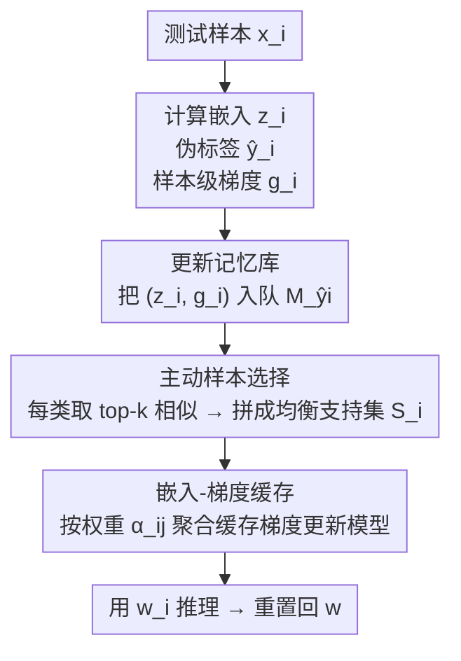

# Ramen: Robust Test-Time Adaptation of Vision-Language Models with Active Sample Selection

**会议**: CVPR 2026  
**arXiv**: [2604.21728](https://arxiv.org/abs/2604.21728)  
**代码**: https://github.com/baowenxuan/Ramen  
**领域**: 多模态VLM / 测试时自适应  
**关键词**: CLIP、Test-Time Adaptation、混合域、主动样本选择、嵌入-梯度缓存

## 一句话总结
针对 CLIP 在「测试流里混杂多个域」时自适应会退化的问题，Ramen 为每个测试样本即时从历史样本里检索一个「同域 + 类别均衡」的支持集做单样本定制更新，并用嵌入-梯度缓存把检索式更新的开销压成几乎零额外前/反向传播，在多个 corruption / 域偏移 benchmark 的混合域设置下稳定领先。

## 研究背景与动机
**领域现状**：CLIP 这类视觉-语言模型零样本泛化很强，但遇到图像损坏（噪声/模糊/天气）和域偏移时精度会显著掉。测试时自适应（TTA）在推理阶段、不碰源数据也不要标签地调模型（通常只更新归一化层的仿射参数，ViT-B/16 上 <0.05% 参数），是给 VLM 续命的实用手段。主流自监督目标是熵最小化，把整批测试样本的预测熵压低来对齐分布。

**现有痛点**：几乎所有 TTA 方法都默认「测试样本来自单一、一致的域」。但真实场景里测试流是混合域的——手机相册里的照片可能横跨不同天气、光照、来源平台，甚至同一个 batch 里的样本就来自不同域。此时 Tent、SAR、Mint 这些方法精度明显下滑（论文 Figure 2 验证：单域设置表现好的新方法，一旦混域就大幅掉点）。

**核心矛盾**：根因是「一个模型被迫同时去适应多个差异很大的域」。模型无法为每个域单独特化，只能收敛到一个跨域的「平均域表示」，对谁都不是最优。已有补丁要么靠 sharpness-aware / 权重集成防崩溃（SAR、ROID，但仍是单模型扛所有域），要么改 BatchNorm 维护多套统计量（UnMix-TNS，但只对 BN 有效，而混域下本就不推荐用 BN）。

**本文目标**：在不知道域标签、不知道域总数的前提下，让 CLIP 对混合测试流里的每个样本都能做「定向」自适应，而不是被平均掉。

**切入角度**：作者的关键观察是——CLIP 的图像嵌入里本身就隐含了域信息（两张图嵌入越近，越可能同域，附录有实证）。既然显式域标签拿不到，就用嵌入相似度当域的代理。

**核心 idea**：与其被动地在整条混合流上更新一个模型，不如为每个测试样本主动构造一个「最相关的小支持集」做专属更新——支持集要满足两条准则：**域一致性**（样本来自相似域）和**预测均衡**（各类别样本数均衡，避免自适应被某个主导类带偏）。

## 方法详解

### 整体框架
Ramen 把标准 TTA 的「一个模型适应整批」改成「每个测试样本 $\bm{x}_i$ 用一份专属权重 $\bm{w}_i$ 推理」，即 $\hat{y}_i=\mathrm{CLIP}(\bm{x}_i;\bm{w}_i),\ \bm{w}_i=\mathrm{TTA}(\bm{w};\mathbb{S}_i)$：每来一个样本，就从历史样本里检索一个定制支持集 $\mathbb{S}_i$，在它上面对预训练权重 $\bm{w}$ 做一步熵最小化得到 $\bm{w}_i$，推理完再把模型**重置回 $\bm{w}$**（不累积污染）。难点是：(a) 怎么在没有域标签的情况下选出「同域 + 均衡」的支持集；(b) 给每个样本都重算支持集梯度会把开销放大 $C\cdot k$ 倍（$C$ 个类、每类取 $k$ 个），在线场景根本扛不住。

为此 Ramen 维护一个**按类别拆分的记忆库**实现选择准则，再用**嵌入-梯度缓存**把「检索式更新」变成「查缓存梯度加权求和」，整条 pipeline 对每个新样本只跑一次前向 + 一次反向。单样本处理流程为下图五步：

### 关键设计

**1. 主动样本选择：用「同域 + 均衡」两条准则替代盲目全流更新**

这是 Ramen 的核心，直接针对「单模型被平均域带偏」的痛点。作者设两条准则：**域一致性**要求支持集样本和 $\bm{x}_i$ 同域或近域——因为域标签未知，就用图像嵌入的内积相似度当域的代理（嵌入越近越可能同域）；**预测均衡**要求支持集各类别样本数均衡，否则若支持集被某个类主导，自适应会引入预测偏置，让模型之后更倾向把样本判给那个类。

实现上维护一个按类拆分的记忆库 $\mathbb{M}=\{\mathbb{M}_1,\cdots,\mathbb{M}_C\}$，每个类一条 FIFO 队列、容量 $K$，存被零样本分类器判为该类的最近 $K$ 个样本。新样本 $\bm{x}_i$ 到来时，用它的嵌入 $\bm{z}_i$ 从**每条**类队列里各取 top-$k$ 最相似样本，再把各类等量拼起来组成 $\mathbb{S}_i$：

$$\mathbb{S}_i=\bigcup_{c=1}^{C}\mathbb{S}_{ic},\quad \mathbb{S}_{ic}=\underset{j\in\mathbb{M}_c}{\mathrm{Top\text{-}}k}\left(\bm{z}_i^\top\bm{z}_j\right).$$

「每类各取 top-$k$」这一步同时满足两条准则：top-$k$ 相似保证域一致性，各类等量保证预测均衡。Figure 3 实测支持集里平均 40.9% 的样本和查询同域，远高于随机选择的 6.7%，说明嵌入相似度确实抓到了域信息。

**2. 嵌入-梯度缓存：把检索式更新的 $C\cdot k$ 倍开销压成 0 额外传播**

主动选择虽然好，但朴素实现要在 $C\cdot k$ 个支持样本上重算梯度，开销直接放大 $C\cdot k$ 倍，在线推理不可接受。作者的关键利用点是：常见 TTA 目标（如熵损失）是**逐样本可加**的——一个 batch 的损失/梯度等于各样本损失/梯度的加权和：

$$H(\mathbb{S}_i)=\sum_{j\in\mathbb{S}_i}\alpha_{ij}H(\bm{x}_j),\qquad \nabla_{\bm{w}}H(\mathbb{S}_i)=\sum_{j\in\mathbb{S}_i}\alpha_{ij}\bm{g}_j,\ \ \bm{g}_j=\nabla_{\bm{w}}H(\bm{x}_j).$$

既然支持集梯度是样本级梯度 $\bm{g}_j$ 的加权和，那就在记忆库里**连同嵌入一起缓存每个历史样本的样本级梯度** $\bm{g}_j$。这样检索到支持集后，无需对它们重新前向/反向，只要把缓存好的 $\bm{g}_j$ 按权重加起来就得到 batch 梯度。每个新样本只在入库时算一次自己的 $\bm{g}_i$，后续被多个查询复用，于是整体只有一次前向 + 一次反向。这正是「检索式定制更新」能在线跑的关键——实测带缓存 14m08s、不带缓存 115h42m，**490× 加速**且精度完全一致。

**3. 梯度聚合权重：熵权重 × 相似度权重，让可靠且同域的样本说话更响**

聚合权重 $\alpha_{ij}$ 不是均匀的，而是融合两种 TTA 常用策略：

$$\alpha_{ij}=\exp(-H(\bm{x}_j))\cdot\exp(-\beta\cdot\|\bm{z}_i-\bm{z}_j\|_2).$$

**熵权重** $\exp(-H(\bm{x}_j))$ 给低熵（高置信、更可靠）的样本更大权重；**相似度权重** $\exp(-\beta\|\bm{z}_i-\bm{z}_j\|_2)$ 给嵌入上离查询更近（更可能同域）的样本更大权重，$\beta$ 控制相似度的影响强度。这一步在已经「同域 + 均衡」的支持集内部再做一次软加权，把更可信、更贴近当前域的样本的梯度放大，进一步收紧自适应的方向。

### 损失函数 / 训练策略
目标仍是预测熵最小化 $H(\bm{x}_i)=-\sum_c p_{ic}\log p_{ic}$，**只更新归一化层的仿射参数**（参数高效、抗灾难性遗忘）；每个样本更新后立刻重置模型回预训练权重 $\bm{w}$，保证样本间不互相污染。理论侧（Theorem 4.1）给出更新后特征重要度 $r_h=\frac{|w_h|}{\sum_l|w_l|}$ 的闭式变化：熵最小化会放大 $(t_{1h}-t_{0h})^2\cdot M_{hh}$ 高于平均的特征，其中 $M_{hh}=\mathbb{E}_{j\in\mathbb{S}}[(p_{j0}p_{j1})\cdot v_{jh}^2]$ 是概率加权的二阶矩（目标域方差）。问题在于混域下「域相关特征」也会有大方差 $M_{hh}$，被误当判别信号放大；而**域一致性**让支持集内域相关特征更一致、$M_{hh}$ 变小从而被有效抑制，**预测均衡**让类相关特征保持大方差继续被放大——理论上解释了两条准则为何有效。⚠️ 公式细节以原文为准。

## 实验关键数据

### 主实验
混合域设置：多个域的测试样本完全交错进自适应流，分域报告精度再取平均。Ramen 在所有数据集 + 架构上都拿第一。

| 数据集 (架构) | 指标 | Ramen | 最强基线 | 提升 |
|--------|------|------|----------|------|
| CIFAR-10-C (ViT-B/32) | 平均 Acc | 72.7 | 71.4 (RoTTA) | +1.3 |
| CIFAR-100-C (ViT-B/16) | 平均 Acc | 46.1 | 42.7 (SAR) | +3.4 |
| ImageNet-C (ViT-L/14) | 平均 Acc | 49.2 | 46.7 (Tent) | +2.5 |
| DomainNet (ViT-B/32) | 平均 Acc | 57.1 | 56.5 (NOTE) | +0.6 |

效率（CIFAR-100-C，15 万张图，Table 3）：

| 方法 | 测试时间 | Acc (%) | Gain |
|------|----------|---------|------|
| CLIP（零样本） | 5m27s | 35.8 | - |
| Tent | 9m27s | 41.2 | +5.4 |
| SAR | 15m50s | 42.7 | +6.9 |
| WATT-S | 18h54m | 42.2 | +6.4 |
| **Ramen** | **14m08s** | **46.1** | **+10.3** |
| Ramen（去掉嵌入-梯度缓存） | 115h42m | 46.1 | +10.3 |

Ramen 时间与普通模型更新型 TTA 相当，但精度大幅领先；缓存带来 490× 加速。

### 消融实验
DC = 域一致性，PB = 预测均衡（Figure 5）。

| 配置 | 关键表现 | 说明 |
|------|---------|------|
| Full (DC + PB) | 单域/混域都稳 | 完整模型 |
| w/o PB | 掉点 | 改用单条不分类队列、取 top-$C\cdot k$，失去类别均衡 |
| w/o DC | 单域↔混域一致性变差 | 队列里随机取 $k$ 个、$\beta=0$，失去同域检索 |
| w/o PB & DC | 退化到随机选历史样本更新 | 两条准则都去掉，近似无选择 |

### 关键发现
- **缓存是落地关键而非精度来源**：去掉嵌入-梯度缓存精度完全不变（46.1）、但时间从 14 分钟暴涨到 115 小时，说明它纯粹是工程上的等价加速（490×），把「逐样本检索式更新」从不可行变可行。
- **两条准则各司其职**：DC 让 Ramen 在单域和混域之间表现更一致（抑制域特征），PB 在两种设置下都稳定加分（保住类判别特征）。
- **域一致性确实抓到了域**：支持集里 40.9% 同域 vs 随机 6.7%，证明 CLIP 嵌入相似度可当域代理。
- **超参鲁棒**：容量 $K$ 越大候选池越丰富但收益递减；检索数 $k$ 和相似度 $\beta$ 太大则混入异域样本削弱域一致性、太小则梯度噪声大；但在很宽的超参范围内 Ramen 都稳定优于 vanilla 熵最小化。

## 亮点与洞察
- **「逐样本可加损失」是整套加速的支点**：熵损失 batch 梯度 = 样本级梯度加权和，这个看似平凡的性质被用来缓存梯度、复用历史计算，把 $C\cdot k$ 倍开销直接抹平——可迁移到任何点式 TTA 目标。
- **用嵌入相似度当「无标签域代理」**：在拿不到域标签时，借 VLM 嵌入隐含的域信息做同域检索，思路干净且有实证（40.9% vs 6.7%）支撑，可复用到其他需要软域聚类的无监督场景。
- **「每样本专属权重 + 用完即重置」**：避开了在线 TTA 最怕的误差累积/模型崩溃，相当于把 TTA 变成一种基于检索的局部一步微调，无状态污染。
- **理论与设计闭环**：Theorem 4.1 不是摆设——它用特征重要度的方差项 $M_{hh}$ 精确解释了「为什么混域会把域特征误放大」以及「两条准则如何各自纠正」，让两个 empirical 准则有了机理支撑。

## 局限性 / 可改进方向
- 理论分析限定在「单层归一化 + 二分类」的简化设定，多层、多类、特征相关（$\bm{M}$ 非对角）时只是定性外推，严格性有限。
- 方法本质仍是熵最小化范式 + 检索增强，依赖伪标签把样本分进类队列；在零样本本身极差的类（如 DomainNet 的 quickdraw，CLIP 仅 12.8%）上，错误伪标签会污染队列，提升也最有限（17.6，绝对值仍很低）。
- 内存开销随类别数 $C$ 和容量 $K$ 线性增长，且要缓存每个样本的样本级梯度（虽然只是归一化层参数）；类别数极大（如 ImageNet 千类）时记忆库与检索成本需进一步评估（附录 C.5 讨论 GPU 显存）。
- 评测集中在 corruption / DomainNet 这类「域可由嵌入区分」的偏移；若不同域在 CLIP 嵌入空间里高度纠缠，域一致性代理会失效，这类难混域未被充分检验。

## 相关工作与启发
- **vs SAR / ROID（混域 TTA）**：它们仍是单模型同时适应所有域，靠 sharpness-aware / 权重集成防崩溃；Ramen 则给每个样本专属支持集与权重，从根上避免「平均域」，混域提升更大（CIFAR-100-C +3.4 over SAR）。
- **vs UnMix-TNS**：UnMix-TNS 靠改 BatchNorm 维护多套统计量处理混域，但只适用 BN、而混域本就不推荐 BN；Ramen 不依赖特定归一化层结构，更新通用仿射参数。
- **vs TDA / DMN-ZS（基于记忆的 VLM TTA）**：它们用记忆库里高置信样本的嵌入相似度去**修正预测**（不更新模型），混域下提升很小（+1.7）；Ramen 同样用记忆库，但用来**检索支持集做模型更新**，并显式加入域一致性 + 预测均衡两条准则。
- **vs 连续 TTA（RoTTA 等）**：连续 TTA 假设相邻样本来自同一域、按域序列依次适应；混域 TTA 里同一 batch 内样本就可能跨域，Ramen 正是为后者设计，靠检索而非时间连续性来组织同域样本。

## 评分
- 新颖性: ⭐⭐⭐⭐ 「主动样本选择 + 嵌入-梯度缓存」组合干净有效，把检索式定制 TTA 做到可在线落地，但底层仍是熵最小化范式的增强。
- 实验充分度: ⭐⭐⭐⭐ 覆盖 3 个 corruption + DomainNet、多架构、单域/混域对照、效率与超参敏感性齐全；不足是偏 corruption 类偏移、缺更纠缠的难混域。
- 写作质量: ⭐⭐⭐⭐⭐ pipeline 五步清晰，理论与两条准则一一对应，动机-机制-效果闭环。
- 价值: ⭐⭐⭐⭐ 混域是 VLM 落地的真实痛点，490× 加速使方法实用，记忆库 + 缓存范式易被后续工作复用。

<!-- RELATED:START -->

## 相关论文

- [\[CVPR 2026\] Dynamic Logits Adjustment and Exploration for Test-Time Adaptation in Vision Language Models](dynamic_logits_adjustment_and_exploration_for_test-time_adaptation_in_vision_lan.md)
- [\[CVPR 2026\] STAR: Test-Time Adaptation Can Enhance Universal Prompt Learning for Vision-Language Models](star_test-time_adaptation_can_enhance_universal_prompt_learning_for_vision-langu.md)
- [\[CVPR 2026\] Test-Time Distillation for Continual Model Adaptation](test-time_distillation_for_continual_model_adaptation.md)
- [\[AAAI 2026\] Panda: Test-Time Adaptation with Negative Data Augmentation](../../AAAI2026/multimodal_vlm/panda_test-time_adaptation_with_negative_data_augmentation.md)
- [\[CVPR 2026\] TTL: Test-time Textual Learning for OOD Detection with Pretrained Vision-Language Models](ttl_test-time_textual_learning_for_ood_detection_with_pretrained_vision-language.md)

<!-- RELATED:END -->
