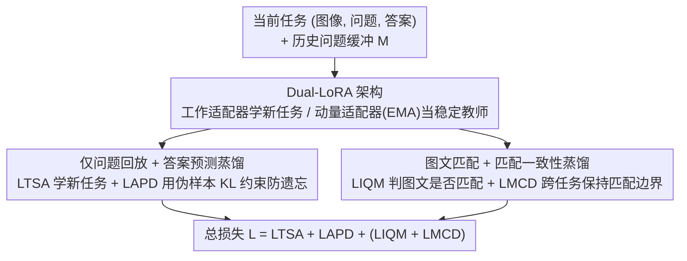

# Re-evaluating Continual VQA: Toward Fair and Robust Evaluation for Multimodal Continual Learning

**会议**: CVPR 2026  
**论文**: [CVF Open Access](https://openaccess.thecvf.com/content/CVPR2026/html/Gao_Re-evaluating_Continual_VQA_Toward_Fair_and_Robust_Evaluation_for_Multimodal_CVPR_2026_paper.html)  
**代码**: https://github.com/Zi-Jian-Gao/MaDQ  
**领域**: 多模态VLM  
**关键词**: 持续学习, 视觉问答, 评测基准去偏, 知识蒸馏, 参数高效

## 一句话总结
本文指出现有持续 VQA 基准存在"跨任务共享答案词表"和"任务内训练/测试答案分布相同"两个结构性缺陷，会高估抗遗忘能力，于是重建了强制答案空间逐 token 互斥、并引入任务内分布漂移的 UCo-VQA 基准；同时提出 MaDQ——只回放历史问题、配合双层蒸馏与图文匹配正则的参数高效方法，在去偏后的更难设定下取得 SOTA。

## 研究背景与动机
**领域现状**：持续视觉问答（Continual VQA）要求预训练视觉-语言模型在一串任务（如 Location → Color → Count …）上增量学习新技能，同时不灾难性遗忘旧任务。主流评测沿用 VQA v2 / GQA 改造的任务序列，用任务对之间的准确率矩阵衡量遗忘。

**现有痛点**：作者发现这套评测本身有两个会"骗人"的缺陷。其一，**跨任务共享答案词表**——早期任务的答案（yes/no、2、red、left）在后续任务里反复出现，模型可以靠记住高频答案先验"假装"记得旧任务，制造出虚假的抗遗忘（spurious anti-forgetting）。论文给的例子很直观：SFT 在 Location 任务上的准确率随训练在 `38.44 → 1.28 → 34.13 → … → 41.58` 之间剧烈反弹，这种回升并非真记住了，而是和后续任务答案撞词。其二，**任务内训练/测试答案分布几乎相同**，掩盖了模型在分布漂移下的脆弱性——模型只是学到了"how many → 2""what color → white"这类问题前缀到高频答案的捷径。

**核心矛盾**：评测想测的是"真正的视觉-语义 grounding 与抗遗忘"，但基准的答案统计结构让模型用"答案记忆 + 语言捷径"就能刷分，于是测出来的遗忘被系统性低估、鲁棒性根本没被考。作者用偏斜 KL 散度量化任务间答案分布重叠矩阵 $S$，并用 Spearman 秩相关证明它和准确率矩阵 $A$ 高度相关（SFT/EWC corr=0.73/0.69，$p<0.001$），坐实"高分主要来自答案共享而非知识保留"。

**本文目标**：（1）造一个让模型刷不了分的公平基准；（2）造一个既抗遗忘又对分布漂移鲁棒、还省内存/护隐私的方法。

**切入角度**：作者的关键观察是——抗遗忘与鲁棒性其实强相关：视觉 grounding 更好的模型在分布漂移下泛化更稳，遗忘也更小。所以把"提升鲁棒性"当成"缓解遗忘"的抓手。

**核心 idea**：评测侧用"逐 token 互斥答案空间 + 任务内训练-测试分布漂移"消除作弊空间（UCo-VQA）；方法侧用"只回放历史问题 + 双层蒸馏 + 图文匹配"在不存图像/答案的前提下保住知识并增强 grounding（MaDQ）。

## 方法详解

### 整体框架
本文有两条主线：**评测基准 UCo-VQA** 和 **持续学习方法 MaDQ**。

**评测侧（UCo-VQA）**：基于 VQA v2 与 GQA 重做。第一，针对答案共享，把数据集改造成答案逐 token 互斥的 VQA v3 / GQA v2——二值答案（yes/no）改用任务专属三位八进制码（如 $T_1$ 用 000/001、$T_2$ 用 002/003，最多 512 个唯一 token 且不与 Count 的数字撞），开放式答案则用"动态前缀变换"系统性改写模板（`it's [answer]` → `that's [answer]` → `there's [answer]`），保语义、去词面重叠。第二，针对鲁棒性，提出 PS（Proposed Splits）设定：在 VQA v3 基础上让每个任务的训练集与测试集答案分布**故意不同**，制造受控的任务内分布漂移；与之对照的是训练测试同分布的 SS（Standard Splits）。VQA v3（8 任务）+ GQA v2（7 任务）× {SS, PS} 共同构成 UCo-VQA 套件。

**方法侧（MaDQ = Matching and Distillation with Question replay）**：在冻结的 BLIP 主干上注入 Dual-LoRA（一支可训练的工作适配器学新任务，一支动量适配器经 EMA 充当稳定教师），训练目标由四个损失分层组成——任务学习 $L_{TSA}$、答案预测蒸馏 $L_{APD}$（抗遗忘）、图文匹配 $L_{IQM}$ 与匹配一致性蒸馏 $L_{MCD}$（鲁棒性），整体写作 $L = L_{TSA} + L_{APD} + (L_{IQM} + L_{MCD})$。关键巧思是回放时**只存历史问题、不存图像和答案**，把历史问题与当前任务图像配成（语义上多半不匹配的）伪样本来唤起旧知识。

### 关键设计

**1. UCo-VQA 基准：逐 token 互斥答案空间 + 任务内分布漂移，让模型作弊不了**

这一设计直击"共享答案词表导致虚假抗遗忘"和"训练测试同分布掩盖脆弱性"两个痛点。作者先用偏斜 KL 散度 $-D_{KL}(p \,\|\, (1-\alpha)p + \alpha q)$（$\alpha=0.99$，用平滑混合分布避免 $q$ 中零概率引起的数值不稳）算出任务间答案重叠矩阵 $S$，证明它与准确率矩阵 $A$ 在展平后秩相关显著，从统计上坐实"高分来自撞词"。然后做两件事：把二值/高频/数值答案映射到任务专属八进制码、把开放答案做动态前缀变换，得到答案空间逐 token 互斥的 VQA v3 / GQA v2（消除跨任务答案共享）；再额外构造 PS 划分，让任务内训练/测试答案分布不同（考鲁棒性）。改造后，SS 下大多数方法掉点明显、原本剧烈反弹的曲线变成更一致的单调退化，PS 下 SFT/LwF 的预测分布紧贴训练分布而非测试真值——说明它们其实没学到真 grounding。这套设计的价值在于：它不是又一个数据集，而是**把作弊通道堵死后的诚实标尺**。

**2. Dual-LoRA 架构：工作适配器学新、动量适配器当稳定教师，蒸馏无需重跑旧模型**

蒸馏式抗遗忘需要一个"旧模型"提供监督，但全量保存历代模型既贵又不稳。本设计在图像编码器 $f_\nu$、问题编码器 $f_\tau$、答案解码器 $f_\omega$ 的所有 Q/K/V、FFN、token embedding 层注入 LoRA，把权重重参数化为 $W = W_0 + BA$（$A \in \mathbb{R}^{r \times k}$、$B \in \mathbb{R}^{d \times r}$、$r \ll \min(d,k)$，取 $r=16$）。训练时只更新工作适配器 LoRA-w $\{A, B\}$；每个 epoch 结束后用指数滑动平均更新动量适配器 LoRA-m $\{\bar{A}, \bar{B}\}$：$\bar{A} \leftarrow \alpha\bar{A} + (1-\alpha)A$、$\bar{B} \leftarrow \alpha\bar{B} + (1-\alpha)B$（$\alpha$ 初始 0.85）。$W_t = W_0 + \bar{B}\bar{A}$ 即一个平滑演化的教师，同时供 $L_{APD}$、$L_{MCD}$ 两路蒸馏与推理使用。答案预测头 $h_{cls}$ 与匹配头 $h_{IQM}$ 在首任务后冻结以防过拟合。相比"存上一时刻完整模型"，这里用一个 EMA 影子分支就拿到了稳定且几乎零额外存储的教师。

**3. 仅问题回放 + 答案预测蒸馏：不存图像/答案也能抗遗忘**

回放类方法效果好但要存完整的（图像, 问题, 答案）三元组，内存大、还有隐私风险。本设计只在缓冲 $M$ 里保存**历史问题**，把它们与当前任务图像 $x^t$ 拼成伪样本 $(x^t, q_i)$——尽管图文语义多半对不上，回放的问题仍是唤起任务专属知识的有效线索。抗遗忘通过对伪样本上"当前模型 vs EMA 教师"的答案分布做 KL 一致性实现：$L_{APD} = \frac{1}{|X^t||M|}\sum_{x^t \in X^t, q_i \in M} L_{KL}(\phi^t(x^t, q_i), \phi^{t-1}(x^t, q_i))$。配合标准交叉熵 $L_{TSA} = \frac{1}{|T^t|}\sum L_{CE}(\phi^t(x^t, q^t), a^t)$ 学新任务。消融显示蒸馏是抗遗忘的主力：去掉 $L_{APD}/L_{MCD}$ 后性能掉到近随机，加回 $L_{APD}$ 后 GQA v2 FAA 直接 +31.9。MaDQ 每任务只存 300–400 条问题，存储占用 0.01 MB，而 ER/CLS-ER 需要数十 MB 存三元组。

**4. 图文匹配 + 匹配一致性蒸馏：把语言捷径掰回视觉 grounding**

PS 设定下测试期语言模式与训练不同，靠"问题前缀→高频答案"捷径的模型会崩。本设计加一个二分类匹配头 $h_{IQM}$ 判断图文是否语义匹配：正样本是当前任务的 $(x^t, q^t)$，负样本是当前图像配回放问题 $(x^t, q_i)$，匹配概率 $\psi^t(x^t, q_j) = h_{IQM}(f_\tau(f_\nu(x^t), q_j))$，损失 $L_{IQM} = \frac{1}{|X^t||Q^t \cup M|}\sum L_{CE}(\psi^t(x^t, q_j), y)$（$y \in \{0,1\}$ 是否匹配）。这迫使模型真正对齐视觉与语言、而非背答案。再用匹配一致性蒸馏 $L_{MCD}$ 对"当前 vs 教师"的匹配概率做 KL，跨任务同时保住"对负样本的拒绝边界"和"新学到的正关联"。有意思的是，$L_{IQM}$ 虽为鲁棒性设计，单独插进 LwF/ER/CLS-ER 也能稳定降遗忘（GQA v2 上 FFM 最多降 2.33%），印证了"鲁棒性提升能反哺抗遗忘"这一中心假设。

### 损失函数 / 训练策略
总目标 $L = \underbrace{L_{TSA}}_{\text{学习}} + \underbrace{L_{APD}}_{\text{保留}} + \underbrace{(L_{IQM} + L_{MCD})}_{\text{鲁棒}}$。主干为 CapFilt 增强的 BLIP（选它是因为未在 VQA 上专门微调，评测更无偏）；权重衰减 0.05，初始学习率 1.25e-3 + 余弦调度，每任务 12 epoch，LoRA 秩 16，动量系数初始 0.85。匹配头/答案头首任务后冻结。

## 实验关键数据

**自定义指标定义**：设 $A_{ij}$ 为训练到任务 $T_i$ 后在 $T_j$ 上的准确率，$AA_i = \frac{1}{i}\sum_{j=1}^{i} A_{ij}$。
- **FAA**（Final Average Accuracy）$= AA_n$，所有任务训完后的最终平均准确率（越高越好，衡量与 Joint Learning 上界的差距）。
- **CAA**（Cumulative Average Accuracy）$= \frac{1}{n}\sum_{i=1}^{n} AA_i$，训练全过程的平均表现（越高越好，反映整体学习质量）。
- **FFM**（Final Forgetting Measure）$= \frac{1}{n-1}\sum_{j=1}^{n-1}(A_{jj} - A_{nj})$，学完最后任务后对旧任务的平均遗忘（越低越好）。

### 主实验
在更难的 PS（任务内分布漂移）设定下，MaDQ 在两个基准上 FAA/CAA 最高、FFM 最低（数据取自论文 Tab.5 的 PS 列，比正文 Tab.2 OCR 更清晰）：

| 方法 | VQA v3·PS FAA↑ | CAA↑ | FFM↓ | GQA v2·PS FAA↑ | CAA↑ | FFM↓ |
|------|------|------|------|------|------|------|
| SFT（下界） | 7.41 | 14.74 | 37.99 | 5.48 | 15.88 | 45.63 |
| LwF | 7.58 | 11.85 | 29.28 | 9.09 | 14.68 | 10.76 |
| GAB（生成式回放） | 13.15 | 27.94 | 29.94 | 17.82 | 24.31 | 29.98 |
| ER（存三元组） | 32.24 | 33.64 | 9.27 | 39.45 | 42.93 | 13.40 |
| CLS-ER（存三元组+蒸馏） | 34.32 | 32.58 | 7.56 | 39.57 | 42.97 | 11.87 |
| **MaDQ（仅存问题）** | **36.15** | **37.82** | **4.54** | **40.72** | **45.18** | **9.37** |

MaDQ 在只回放问题（存储 0.01 MB）的前提下，CAA 比存完整三元组的 ER 在 VQA v3·PS 上高 4.18、GQA v2·PS 上高约 2.21，且 FFM 全面最低。⚠️ 论文正文 Tab.2 的多基线行（尤其 ER/CLS-ER 的列）OCR 存在错位，本表改用 Tab.5 中清晰的 PS 数值，具体以原文为准。

### 消融实验
四个损失项在 VQA v3·PS 上的逐步叠加（依论文正文叙述还原配置名，⚠️ 原表 Tab.4 勾选列与各列对应关系 OCR 有错位，按正文"LAPD alone +31.9"等描述对齐）：

| 配置 | FAA↑ | CAA↑ | FFM↓ | 说明 |
|------|------|------|------|------|
| 全去掉 | 6.56 | 13.41 | 37.75 | 近随机，证明蒸馏不可或缺 |
| 仅 $L_{IQM}$ | 6.75 | 13.12 | 36.33 | 匹配损失单用几乎无效 |
| 仅 $L_{APD}$ | 31.81 | 32.74 | 10.34 | 蒸馏是抗遗忘主力 |
| $L_{APD}+L_{IQM}$ | 35.50 | 36.92 | 6.83 | 匹配加成鲁棒性 |
| 全部（MaDQ） | 36.15 | 37.82 | 4.54 | 完整模型，FFM 最低 |

### 关键发现
- **蒸馏（$L_{APD}$）是抗遗忘的发动机**：去掉后近随机（FAA 6.56），单加 $L_{APD}$ 就把 VQA v3·PS FAA 从 6.56 抬到 31.81；而单加匹配损失 $L_{IQM}$ 几乎不动（6.75），说明匹配需要建立在蒸馏保住的知识之上才发挥作用。
- **鲁棒性反哺抗遗忘**：把 $L_{IQM}$ 作为即插即用项加进 LwF/ER/CLS-ER，普遍降 FFM（GQA v2 最多 −2.33%）并常提 FAA/CAA，直接验证了"更好 grounding → 更稳泛化 → 更少遗忘"的核心假设。
- **去偏后基准更诚实**：在原始 GQA 上各方法 FAA/CAA 虚高、FFM 偏低；换到逐 token 互斥的 GQA v2（SS）后普遍掉点，暴露了旧基准的偏置，而 MaDQ 仍保持低 FFM。
- **换大模型主干会更难适配**：把 BLIP 换成 BLIP2（Tab.3），所有方法 FAA/CAA 明显下降，作者推测 BLIP2 的 LLM 解码器不擅长生成短结构化答案；但简化版 MaDQ*（仅答案预测蒸馏 + 问题回放）仍能在不存真值答案的情况下追平 ER/CLS-ER。

## 亮点与洞察
- **"虚假抗遗忘"的统计揭示很扎实**：不是泛泛吐槽基准有偏，而是用偏斜 KL 重叠矩阵 + Spearman 秩相关把"高分来自答案撞词"量化出来，再用八进制码 / 动态前缀两招精准堵漏，方法论上可复用到其他持续多模态评测。
- **"只回放问题"是省内存又护隐私的巧设计**：图文语义对不上仍能当唤起线索，这个反直觉点配合 EMA 教师，把回放成本压到 0.01 MB，对真实部署（存储受限、隐私敏感）很实用。
- **把鲁棒性当抗遗忘抓手**：$L_{IQM}$ 即插即用就能给别人家方法降遗忘，这条"robustness ↔ forgetting 相关"的洞察可迁移到分类、检测等其他持续学习设定。

## 局限与展望
- 作者承认大型通用 LVLM（BLIP2）在该去偏设定下数据效率低、难适配，简化版 MaDQ* 只做了答案蒸馏，匹配/一致性蒸馏如何迁移到冻结视觉编码器 + 通用 LLM 解码器的架构仍是开放问题。
- 评测构造依赖人工设计的答案编码（八进制码、前缀模板），开放式答案的"语义不变但去词面重叠"变换是否对所有答案类型都成立、会不会引入新的人造偏置，论文讨论有限。
- 伪样本回放假设"图文不匹配的问题仍是有用线索"，当历史任务问题与当前图像完全无关时该假设的边界、以及负样本构造对匹配头的影响未深入分析。
- ⚠️ 论文主表（Tab.2）多基线行的 OCR 错位提示原始排版较密，复现时应以官方表格/代码为准。

## 相关工作与启发
- **vs VQACL**：VQACL 是首个持续 VQA 基准，但用共享答案词表（导致遗忘被低估）且不考分布漂移鲁棒性，还依赖对象级监督的原型策略；本文用逐 token 互斥答案空间 + 训练测试漂移修正前者，方法上不需对象级标注。
- **vs VQA-CP / GQA-OOD**：它们也改答案分布来测鲁棒性，但都是静态单次评测，不涉及持续学习；本文把"鲁棒性"与"抗遗忘"在持续设定下统一起来，证明二者相关。
- **vs ER / CLS-ER**：同为回放，它们存完整三元组（内存大、有隐私顾虑）；MaDQ 只存问题、靠双层蒸馏 + 匹配正则，在更难的 PS 下 CAA 更高、FFM 更低。
- **vs GAB**：GAB 靠微调大 VLM 生成历史任务问答对，对分布漂移很脆（生成对与真实任务一旦偏离就崩）；MaDQ 不依赖额外生成模型，更稳。

## 评分
- 新颖性: ⭐⭐⭐⭐⭐ 把基准的隐性作弊通道用统计量化并系统堵死，同时给出配套的轻量方法，问题切口很新。
- 实验充分度: ⭐⭐⭐⭐ 两数据集 × SS/PS、多类基线、逐损失消融、即插即用与换主干分析都有；但部分主表 OCR 错位、对失败模式分析偏少。
- 写作质量: ⭐⭐⭐⭐ 动机推导（虚假抗遗忘）讲得很清楚，方法分层明确；少数公式/表格排版较密。
- 价值: ⭐⭐⭐⭐⭐ 提供了一个让持续 VQA"测得诚实"的标尺 + 一个省内存护隐私的强基线，对该子领域评测规范有正面推动。

<!-- RELATED:START -->

## 相关论文

- [\[CVPR 2026\] Towards Dynamic Modality Alignment in Multimodal Continual Learning](towards_dynamic_modality_alignment_in_multimodal_continual_learning.md)
- [\[CVPR 2026\] Octopus: History-Free Gradient Orthogonalization for Continual Learning in Multimodal Large Language Models](octopus_history-free_gradient_orthogonalization_for_continual_learning_in_multim.md)
- [\[CVPR 2026\] Enhancing Continual Learning of Vision-Language Models via Dynamic Prefix Weighting](enhancing_continual_learning_of_vision-language_models_via_dynamic_prefix_weight.md)
- [\[CVPR 2026\] Test-Time Distillation for Continual Model Adaptation](test-time_distillation_for_continual_model_adaptation.md)
- [\[CVPR 2026\] PACT: Phase-Like Transition Constraints in Adapter-Based Continual Learning of Vision-Language Models](pact_phase-like_transition_constraints_in_adapter-based_continual_learning_of_vi.md)

<!-- RELATED:END -->
