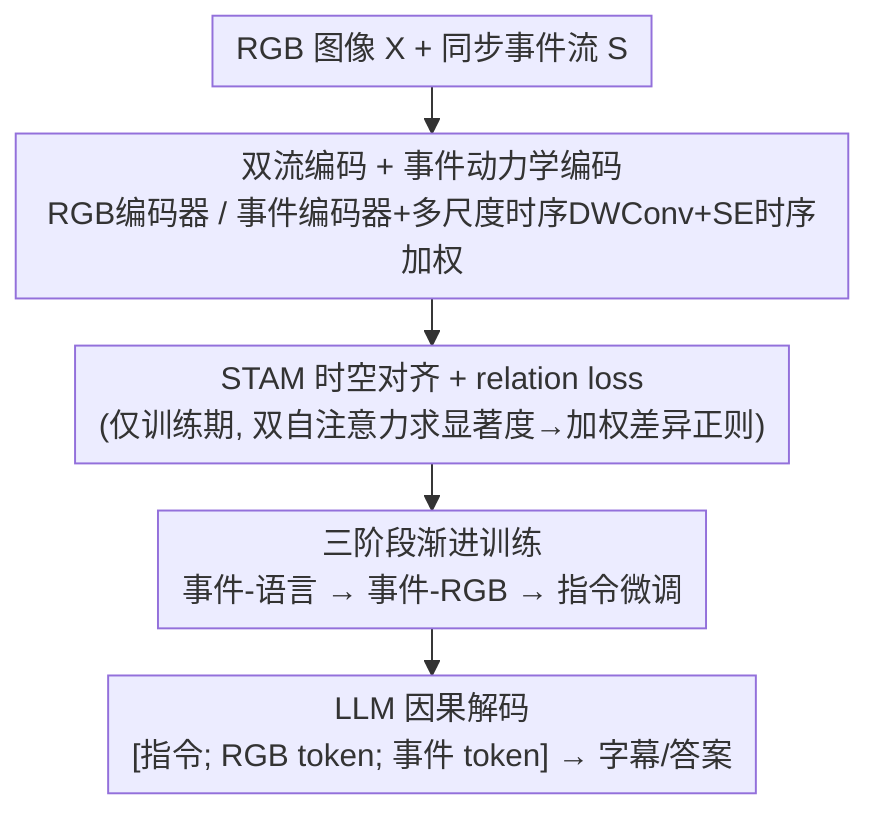

# RE-VLM: Event-Augmented Vision-Language Model for Scene Understanding

**会议**: CVPR 2026  
**论文**: [CVF Open Access](https://openaccess.thecvf.com/content/CVPR2026/html/Liu_RE-VLM_Event-Augmented_Vision-Language_Model_for_Scene_Understanding_CVPR_2026_paper.html)  
**代码**: https://github.com/bupt-ai-cz/RE-VLM  
**领域**: 多模态VLM  
**关键词**: 事件相机, RGB-Event 融合, 视觉语言模型, 场景图数据生成, 恶劣光照

## 一句话总结
针对"常规 RGB 在低光/高动态/快速运动下退化、纯事件流又缺颜色纹理"的痛点，本文提出首个 RGB-Event 双流视觉语言模型 RE-VLM，用并行 RGB/事件编码器 + 三阶段渐进对齐把异构视觉特征对到语言空间，并用图驱动、退化自适应的数据管线把同步 RGB-Event 流转成可核验的场景图来批量合成字幕与问答，在字幕与 VQA 上优于参数相当甚至更大的 RGB-only / event-only 模型，恶劣光照下增益尤其明显。

## 研究背景与动机
**领域现状**：以 LLaVA、InternVL、Qwen2.5-VL、GPT-4V 为代表的视觉语言模型（VLM）在图像字幕与 VQA 上进展迅猛，但几乎都建立在高质量 RGB 图像之上。

**现有痛点**：RGB 在极端低光、过曝、高动态范围转换或高速运动（运动模糊）下严重退化，连 SOTA 的 RGB-only VLM 都会描述错或答非所问。事件相机本可互补——它异步记录每像素亮度变化、微秒级延迟、高动态范围，能在 RGB 失效处保住运动与结构线索；但纯事件 VLM（如 EventGPT）又有先天短板：事件只记录"变化"，没有显式颜色、静态场景细节稀疏，所以能描述运动和高对比结构，却认不出物体颜色、纹理这类外观属性。论文图 1 给的低光路口例子很典型：RGB-only 漏掉了行人和斑马线，event-only 抓到了结构和行人运动却判不出红绿灯状态，只有两者融合才能给出"绿灯 + 行人 + 斑马线 + 其他车辆"的完整描述。

**核心矛盾**：RGB 强于外观（颜色/纹理）、弱于恶劣成像；事件强于动态/HDR、弱于外观。二者天然互补，但**没有大规模的 RGB-Event-Text 三模态监督数据**，而且现有"从 RGB 合成 Event-Text 数据"的管线恰恰在 RGB 退化时失效（RGB 训练的 VLM 在严重退化下推不出正确内容）。

**本文目标**：（1）造一个能在正常与恶劣条件下都鲁棒的 RGB-Event 双流 VLM；（2）解决 RGB-Event-Text 数据稀缺，且数据生成本身要能扛 RGB 退化。

**切入角度**：用一个可核验的中间表示——场景图——来组织两模态事实，并在融合时显式利用"退化标签"做模态仲裁，让 RGB 退化时以事件为锚，从而生成可靠监督。

**核心 idea**：模型侧用双流编码 + STAM 时空对齐 + 三阶段渐进训练把事件对到语言、再对到 RGB；数据侧用"图驱动、退化自适应"管线把同步 RGB-Event 流转成融合场景图再合成字幕/问答。

## 方法详解

### 整体框架
RE-VLM 由两部分组成：**数据生成管线**和**双流模型**。

**数据侧（图驱动、退化自适应管线）**：对每个 RGB 关键帧取一段 $N \times 33\text{ms}$（$N{=}4$）的事件窗口，用事件重建网络（如 NER-Net）重建成 $N$ 帧灰度图、堆成"类视频"张量喂给字幕 VLM，按"主体–运动–地点–关系"模式生成受观测事实约束的描述，再用 LLM 解析成**事件图** $G_e$（节点是最小实参元组，如 `Move(subject=car, motion=forward, place=lane center)`）。同步地在对齐关键帧上构建**RGB 图** $G_r$，侧重外观/静态结构（颜色、纹理、几何、布局），并显式标注低光/过曝/眩光/运动模糊等退化标签。随后用 LLM 做**退化自适应融合**：运动、时序、拓扑相关的事实锚定到 $G_e$（事件对动态/边缘更鲁棒），光源/颜色/可读文本取自 $G_r$（前提是 $G_r$ 未严重退化，否则其结论只作低置信候选、不能覆盖 $G_e$）；几何字段（计数、位置）两图一致则采纳共识、否则 $G_r$ 优先。融合图标注来源 $\in \{G_e, G_r, G_{e+r}\}$ 与置信度，最后据此生成字幕和至多 3 条 VQA。配合人工审校，产出两套数据：PEOD-Chat（侧重恶劣光照，11k）与 RGBE-Chat（通用场景，113.7k）。

**模型侧（双流 + STAM + 三阶段）**：给定 RGB 帧 $X$ 与对齐事件流 $S$，RGB/事件编码器分别得 $F_i = f_{rgb}(X)$、$F_e = f_{event}(S)$；事件分支再经多尺度时序深度可分卷积 + SE 式时序加权得增强表示 $\tilde{F}_e$。两路经适配器映射到 LLM 空间 $T_i = g_i(F_i)$、$T_e = g_e(\tilde{F}_e)$，推理时 LLM 对 $[P; T_i; T_e]$（指令 + 双流 token）做因果解码 $A = f_{LLM}([P; T_i; T_e])$。训练期额外引入轻量 STAM 时空对齐模块算对齐信号与 relation loss（推理时不用）。整套用三阶段课程训练：先把事件对到语言、再把事件对到 RGB、最后指令微调 LLM。

### 关键设计

**1. 图驱动、退化自适应的数据生成管线：用可核验场景图 + 退化仲裁造抗退化的三模态监督**

直击"RGB-Event-Text 数据稀缺、而从 RGB 合成又在 RGB 退化时失效"的痛点。关键不是直接让一个 VLM 看图写答案，而是先把两模态各自解析成结构化场景图（$G_e$ 重运动/时序、$G_r$ 重外观且带退化标签），再做**字段级仲裁融合**：动态/拓扑锚定事件、颜色/文本取自未退化的 RGB、几何字段取共识或 RGB 优先并把分歧方降级为次要。这样即使 RGB 严重退化，其错误结论也只会沦为低置信候选而不会污染监督。图作为"可审计的中间表示"还便于人工校正。效果由人工审计佐证：在 PEOD 上随机抽 855 条，RGB-only 基线（EventGPT 式生成）的需纠正率高达 54.2%（463 条），本管线仅 18.1%（155 条）。

**2. 双流编码 + 事件动力学编码：让事件的高时序分辨率被显式建模**

针对"事件流只记变化、需要专门的时序建模才能用好"。每个原始事件 $e_j = (x_j, y_j, t_j, p_j)$（极性 $p_j \in \{+1,-1\}$）按时间窗切成 $N_w{=}3$ 个 slice、各累积成两通道图 $E_t$，过 ViT 事件编码器得逐 slice 特征、堆成时空张量 $F^e = \{F^e_t\}_{t=1}^{N_w} \in \mathbb{R}^{N_w \times H \times W \times D}$。为捕捉多时间尺度的运动，沿时间轴做**多尺度 1D 深度可分卷积**、拼接后投回 $D$ 通道得 $\tilde{F}^e$，再施加**SE 式时序加权**重点强调显著运动区间、压制背景 slice，最后经 $g_e(\cdot)$ 投到 LLM 空间。这套设计让模型不是把事件帧当静态图看，而是显式吃进时间维度的运动节奏。

**3. STAM 时空对齐 + relation loss：训练期把 RGB 与事件在重要区域拉近，推理零开销**

针对"双流特征异构、直接拼接难对齐"。STAM 仅在训练期工作：先把 RGB 特征 $\tilde{R}^{(t)}$ 与事件特征 $\tilde{E}^{(t)}$ 重采样到共享时空格点并逐通道 L2 归一化，分别算模态内双自注意力 $P_r^{(t)} = \hat{R}^{(t)\top}\hat{R}^{(t)}$、$P_e^{(t)} = \hat{E}^{(t)\top}\hat{E}^{(t)}$，取每个自注意力矩阵的行和（图度）作为 token 显著度、reshape 成重要度图，两模态平均归一得统一重要度 $w^{(t)}$。再算逐帧通道平均绝对差 $D^{(t)}_{h,w} = \frac{1}{D}\sum_c |\tilde{R}^{(t)}_{c,h,w} - \tilde{E}^{(t)}_{c,h,w}|$，用重要度图与差异图的空间内积当对齐惩罚，得跨模态正则 $L_{CA\text{-}WTD} = \frac{1}{T_c}\sum_{t=1}^{T_c} \langle w^{(t)}, D^{(t)}\rangle$。总目标 $L = L_{LLM} + \lambda L_{CA\text{-}WTD}$（$\lambda{=}0.1$）。它在"两模态都觉得重要"的区域施加更强的特征对齐压力；因为只在训练用，推理时 STAM 被丢弃、不增加任何前向开销。

**4. 三阶段渐进训练：先事件-语言、再事件-RGB、最后指令微调，逐步把异构模态对齐**

针对"一次端到端训三模态对齐难收敛"。**阶段 1（事件-语言对齐）**：从预训练 RGB-VLM 主干出发，冻 LLM 与 RGB 分支，只在 RGBE-ImageNet 的 Event-Text 字幕对上训事件编码器 + 事件适配器，得到一条直接对到语言空间的事件通路。**阶段 2（事件-RGB 对齐）**：用 ImageNet/N-ImageNet 的成对 RGB-Event 数据，冻 LLM 与 RGB 分支，优化事件编码器 + STAM（施加 relation loss），把事件分支对到冻结的 RGB 分支，建立连贯的双分支表示。**阶段 3（指令微调）**：冻两条视觉分支与 STAM，给 LLM 挂 LoRA 在字幕/VQA 指令数据上微调，只更新 LoRA 参数，既保住已对齐的编码器又赋予指令跟随能力，且支持 RGB-only / Event-only / RGB+Event 灵活推理。

### 损失函数 / 训练策略
总损失 $L = L_{LLM} + \lambda L_{CA\text{-}WTD}$（$\lambda{=}0.1$）。主干 Qwen2.5-VL-3B，8×4090 训练。三阶段超参：阶段 1 在 130 万对上 lr=1e-4、batch 32；阶段 2 在 60 万对上 lr=1e-4、batch 16；阶段 3 在 12 万样本上 lr=2e-4、batch 16。为公平比较，所有竞品的事件流都渲染成事件图输入。

## 实验关键数据

**自定义指标定义**（沿用 Video-ChatGPT 的 LLM-as-a-judge，GPT-3.5-Turbo 当裁判打 0–5 分）：
- **CI**（Correctness of Information）信息正确性；**DO**（Detail Orientation）细节充分度；**CU**（Contextual Understanding）上下文理解——三者评字幕质量。
- **Ave**：VQA 答案质量的 LLM 平均评分（0–5）。
- **Acc**：属性级 VQA 准确率（每个属性预测正确得 1 分、任一错则该属性 0 分）。

### 主实验
PEOD-Chat（恶劣光照）与 RGBE-Chat（通用场景）上，RE-VLM（4B）在字幕三指标与 VQA 两指标上全面领先，恶劣光照下增益尤其大（节选自论文 Tab.3）：

| 输入 | 模型 | 参数 | PEOD CI | PEOD DO | PEOD CU | PEOD Ave | PEOD Acc | RGBE Acc |
|------|------|------|------|------|------|------|------|------|
| RGB-only | Qwen2.5-VL | 3B | 2.47 | 2.03 | 3.04 | 3.47 | 0.52 | 0.66 |
| RGB-only | DeepSeek2-VL | 7B | 3.25 | 2.42 | 3.73 | 3.37 | 0.50 | 0.52 |
| RGB-only | Qwen2.5-VL*（微调） | 3B | 3.23 | 2.74 | 3.51 | 3.61 | 0.55 | 0.65 |
| Event-only | EventGPT | 7B | 2.51 | 2.06 | 2.65 | 3.04 | 0.40 | 0.39 |
| Event-only | Qwen2.5-VL*（微调） | 3B | 2.74 | 2.48 | 2.97 | 3.24 | 0.45 | 0.58 |
| **RGB+Event** | **RE-VLM** | **4B** | **3.68** | **3.12** | **3.95** | **3.82** | **0.63** | **0.75** |

即便对手是 7B（约 2× 参数）的 RGB-only / event-only 模型，RE-VLM 仍以更小参数取胜；恶劣光照的 PEOD 上差距比通用 RGBE 上更大，印证"事件补运动结构、RGB 补颜色纹理"的互补假设。

### 消融实验
输入模态与 STAM 的消融（PEOD-Chat，Tab.4）：

| 输入 | STAM | CI | DO | CU | Ave | Acc |
|------|------|------|------|------|------|------|
| 仅 RGB | — | 3.05 | 2.51 | 3.32 | 3.63 | 0.57 |
| 仅 Event | — | 2.82 | 2.57 | 3.09 | 3.40 | 0.48 |
| RGB+Event | ✗（朴素拼接） | 3.62 | 3.08 | 3.91 | 3.79 | 0.61 |
| RGB+Event | ✓（STAM） | 3.68 | 3.12 | 3.95 | 3.82 | 0.63 |

### 关键发现
- **双流 > 任一单流**：在 PEOD 与 RGBE 上 RGB+Event 都稳定超过仅 RGB / 仅 Event，且单流推理（丢掉另一路）也仍可用，说明架构真正吃到了互补信息，恶劣条件下尤甚。
- **STAM 带来一致小幅增益**：相比朴素特征拼接，STAM 在两数据集上各指标普遍提升或持平（如 PEOD Acc 0.61→0.63），说明训练期的加权对齐确实改善了双流融合，且推理零开销。
- **数据管线质量是底座**：人工审计中本管线需纠正率 18.1% 远低于 RGB-only 生成的 54.2%，恶劣场景下合成监督更可靠，这是下游模型增益的来源之一。
- **换裁判结论不变**：用开源 Qwen3-Omni-30B 替 GPT-3.5-Turbo 当裁判（Tab.6），RE-VLM 仍在 CI/DO/CU/Ave/Acc 上领先（如字幕 CU 3.85 vs Qwen2.5-VL 2.71、EventGPT 2.50），趋势一致，缓解了"闭源裁判偏置"的质疑。
- **定性互补很直观**：过曝路口场景里 RGB-only 漏判城市公交、event-only 答错车辆颜色，RE-VLM 靠事件运动线索找到公交、靠 RGB 判出白色，两类错误都被补上。

## 亮点与洞察
- **"图作可核验中间表示 + 退化标签做模态仲裁"很巧**：把数据生成从"端到端黑箱"变成"结构化、可审计、可校正"，且天然解决了"RGB 退化时谁说了算"的问题，这套思路可迁移到任何"强弱互补双模态"的数据合成。
- **STAM 训练期对齐、推理期丢弃**：用双自注意力的图度当显著度、只在重要区域施加跨模态差异正则，既避免了某模态主导，又不给推理加任何负担，是"训练增强、推理零成本"的典型可复用 trick。
- **三阶段课程对齐异构模态**：先把弱模态（事件）对到语言、再对到强模态（RGB）、最后只微调 LLM 的 LoRA，分解了三模态联合对齐的难度，对"想给现成 RGB-VLM 加新模态分支"的工作很有借鉴价值。

## 局限与展望
- 数据管线依赖事件重建网络（NER-Net）把事件转灰度帧再喂 VLM，重建质量与 $N{=}4$、窗口 33ms 等设定会影响图的准确性，论文未充分分析重建失真对下游监督的传播。
- 评测主要用 LLM-as-a-judge（Likert 0–5 与属性级 Acc），虽做了开源裁判交叉验证，但仍非人类标注的细粒度评测，绝对分值的可比性有限。
- 训练需 RGB-Event 配对数据（部分事件由仿真生成，如 RGBE-ImageNet 的事件来自合成），真实事件与仿真事件的域差对泛化的影响未深入讨论。
- ⚠️ 缓存中模型架构图区（STAM、relation loss 公式）OCR 较乱，部分公式符号（如重采样网格尺寸、归一化细节）以原文为准。

## 相关工作与启发
- **vs EventGPT（event-only VLM）**：EventGPT 首个面向事件流的 VLM、在极端运动/光照下强，但纯事件先天缺颜色纹理、静态细节稀疏；RE-VLM 加 RGB 分支补外观，恶劣与通用场景都更全。
- **vs EventCLIP / EventBind**：它们把 CLIP 适配到事件域做零样本/检索分类，但没有 LLM、用不上世界知识与语言上下文，做不了自由描述/对话；RE-VLM 接 LLM 支持自由形式场景理解。
- **vs RGB-only 大模型（Qwen2.5-VL / InternVL / DeepSeek-VL / GPT-4V）**：它们依赖高质量 RGB，恶劣成像下崩；RE-VLM 用事件分支在 RGB 失效处兜底，以更小参数（4B）超过 7B 对手。
- **vs 低层视觉的 RGB-Event 融合（检测/跟踪）**：以往融合多在低层任务，本文把 RGB-Event 融合推到高层场景理解（字幕/VQA + LLM），顺应"从 event-only 到 RGB-Event、从低层到高层"的趋势。

## 评分
- 新颖性: ⭐⭐⭐⭐⭐ 首个 RGB-Event 双流 VLM + 图驱动退化自适应数据管线，切口和落点都新。
- 实验充分度: ⭐⭐⭐⭐ 两基准、对比 RGB-only/event-only 多模型、模态与 STAM 消融、开源裁判交叉验证较全；但评测依赖 LLM-judge、缺人工细评。
- 写作质量: ⭐⭐⭐⭐ 动机（双模态互补）讲得直观，管线与三阶段训练清晰；部分架构/公式排版较密。
- 价值: ⭐⭐⭐⭐⭐ 给恶劣条件下的鲁棒场景理解提供了可落地的双流方案 + 两套 RGB-Event-Text 数据集，对事件增强 VLM 是有用基座。

<!-- RELATED:START -->

## 相关论文

- [\[CVPR 2026\] Scene-VLM: Multimodal Video Scene Segmentation via Vision-Language Models](scene-vlm_multimodal_video_scene_segmentation_via_vision-language_models.md)
- [\[CVPR 2026\] µVLM: A Vision Language Model for µNPUs](mvlm_a_vision_language_model_for_mnpus.md)
- [\[CVPR 2026\] VLM-3R: Vision-Language Models Augmented with Instruction-Aligned 3D Reconstruction](vlm-3r_vision-language_models_augmented_with_instruction-aligned_3d_reconstructi.md)
- [\[CVPR 2026\] HOG-Layout: Hierarchical 3D Scene Generation, Optimization and Editing via Vision-Language Models](hog_layout_hierarchical_3d_scene_generation_optimization_and_editing.md)
- [\[CVPR 2026\] Learning to See through Illumination Extremes with Event Streaming in Multimodal Large Language Models](learning_to_see_through_illumination_extremes_with_event_streaming_in_multimodal.md)

<!-- RELATED:END -->
