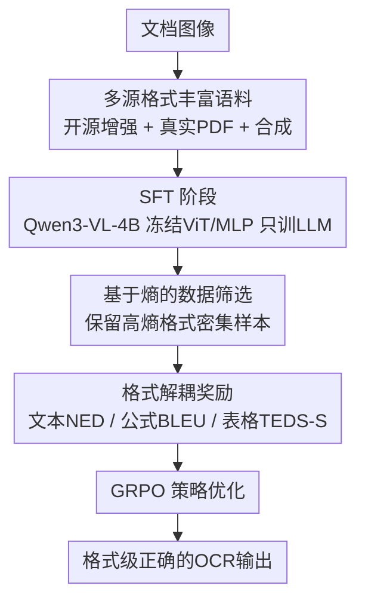

# Reading or Reasoning? Format Decoupled Reinforcement Learning for Document OCR

**会议**: CVPR 2026  
**论文**: [CVF Open Access](https://openaccess.thecvf.com/content/CVPR2026/html/Zhong_Reading_or_Reasoning_Format_Decoupled_Reinforcement_Learning_for_Document_OCR_CVPR_2026_paper.html)  
**代码**: https://github.com/DocTron-hub/FD-RL  
**领域**: 多模态VLM / 文档OCR / 强化学习  
**关键词**: 文档OCR, 强化学习, GRPO, 熵筛选, 格式解耦奖励

## 一句话总结
作者发现 OCR 模型在公式/表格这类「格式化文本」上的输出熵比纯文本高一个数量级，于是提出 Format Decoupled RL（FD-RL）：用熵给样本排序筛出格式密集的难样本，再按文本/公式/表格三类内容各配一套奖励函数做 GRPO 训练，在 OmniDocBench 上拿到端到端模型里很有竞争力的 90.41 分。

## 研究背景与动机
**领域现状**：文档 OCR（把文档图像解析成结构化文本）目前主流分两条路线。一是传统流水线（先版面检测、再分区域调专门解析器，如 MinerU、PP-StructureV3），稳但灵活性差、微调成本高；二是 VLM 端到端直接从图像解码文本（dots.ocr、DeepSeek-OCR 等），流程简洁、泛化好。近期工作几乎都在「堆数据工程 + 精调 SFT」上做文章。

**现有痛点**：哪怕是很强的 OCR 模型，在公式、表格这类格式化文本上仍然表现挣扎。作者做了一个关键的实证观察：把文档按「格式化文本占比」分成 20%/40%/60%/80%/100% 五档，用 Qwen3-VL 统计推理时的平均输出熵，发现格式化占比越高、输出熵越高，且格式化文本的熵常常比纯文本高一个数量级——说明模型在格式密集内容上输出极不确定、很「迷糊」。

**核心矛盾**：纯靠 SFT 的 token 级目标，是让模型去「背」某一条确定的输出序列；但公式有多条语义等价的读法（如 `1/2` 与 `\frac{1}{2}`），表格也有多种合法结构表达。强迫模型记住一条路径既学不稳，格式错误还会被海量纯文本的内容错误「淹没」，得不到针对性反馈。

**切入角度**：已有研究指出高熵 token 是引导语言模型走向多样推理路径的「岔路口」。既然格式化文本天然高熵，那它正好能在 RL 里产生多样的读法、给出多样的奖励信号——也就是把 OCR 从「纯感知阅读」升级成「读完再推理」（reasoning-after-reading）。

**核心 idea**：用熵筛出格式密集的高价值样本，再对文本、公式、表格分别设计奖励函数做 GRPO，让模型学「格式规则」而非「背 token 序列」。

## 方法详解

### 整体框架
FD-RL 采用「先 SFT 打底、再 RL 精修」的两阶段范式，外加一套多源数据工程。整体流向是：先用三种来源构建一个大规模、格式丰富的语料；在此之上对 Qwen3-VL-4B 做 SFT（冻结视觉编码器和投影层、只训语言模型），得到一个强 OCR 底座 FD-RL(SFT)；然后进入 RL 阶段，先用基于熵的数据筛选挑出高熵的格式密集样本，再用格式解耦奖励（文本/公式/表格各一套打分）配合 GRPO 做策略优化，最终输出格式级正确的解析结果。

### 关键设计

**1. 多源格式丰富语料：给「读」打牢底座**

RL 想学得好，前提是 SFT 底座足够强、数据足够覆盖格式密集场景，所以作者花大力气从三条线构建语料。① **开源数据质量增强**：收集 PDFA、DocStruct4M、DocGenome 等，加上手写体/公式数据集（IAM、ORAND-CAR、HME）；抽检发现开源数据普遍有「内容缺失、阅读顺序错乱、句子重复」，于是用轻量 OCR 模型 GOT 重新标注，再做相似度过滤——只保留原始标注与 VLM 标注高相似的样本，且**仍用原始标注当 ground truth**（而非 VLM 输出），避免过拟合到 VLM 自身的风格。② **真实 PDF 构建**：分版面感知（页级用 MinerU 出 Markdown + Mathjax 校验 LaTeX + 去重；区域级跟 Fox 做法用 Mathpix 出带坐标结果、对区域上色标注并合成空框负样本；多页级拼 2–6 页序列）和内容感知（用 dots.ocr 把公式转 LaTeX、表格转 HTML、按阅读序重排）两路。③ **合成 OCR 数据**：从 K12 到成人的练习题、StackExchange 的 STEM 问答里取内容，用带真实字体/间距/配色的 HTML 模板 + MathJax 渲染 + Playwright 截高分辨率图，配对 Markdown 成训练样本，补足教育/学术场景的稀缺标注。最终覆盖九类常见文档（笔记、财报、幻灯片、试卷、合成、杂志、学术论文、图书、报纸）。

**2. 基于熵的数据筛选：把 RL 算力集中到「最迷糊」的样本上**

直接拿全量 SFT 数据做 RL 既浪费、信号也稀（纯文本太确定、给不出有用梯度）。作者先做类型筛选——剔掉只含纯文本的样本、提高结构化数据占比、平衡中英文比例；再做熵筛选：用 SFT 模型对每个样本推理，取每个 token 的 log 概率，算样本的平均输出熵并按阈值 $\tau$ 卡线：

$$D_{filtered} = \left\{ d \in D_{raw} \;\middle|\; -\frac{1}{N_d}\sum_{i=1}^{N_d}\log p_i^{(d)} \geq \tau \right\}$$

其中 $N_d$ 是样本 $d$ 的 token 数、$p_i^{(d)}$ 是第 $i$ 个 token 的概率。熵越高代表结构越复杂、预测越不确定，这样筛出来的就是「最有学习价值的难样本」。消融显示筛选率 50% 时最优（90.41），过低（0% 全留）或过高（75% 太激进）都更差——说明既要去掉噪声样本、又不能把可学样本扔太多。

**3. 格式解耦奖励：按内容类型分别打分，别让格式错误被淹没**

这是全文核心。如果对整段输出只用一个统一的编辑距离奖励，公式/表格里的细微结构错误会被大量纯文本「冲淡」，模型学不到格式级反馈。FD-RL 先用正则把模型输出和 ground truth 各自拆成纯文本、公式、表格三类，再给每类配专门奖励：**纯文本**用归一化编辑距离（NED）做字符级监督；**公式**用 BLEU——相比编辑距离，n-gram 匹配对局部结构错误更敏感、反馈更锐利、RL 更稳；**表格**用 TEDS-S（基于 HTML 表示的树编辑距离），专门盯结构一致性。所有公式/表格先做语法归一化以吸收等价变体。还设了**兜底机制**：当正则解析失败时，所有奖励退化为字符串匹配奖励，保证模型仍拿到字符级监督、而不是稀疏的 0 奖励，维持训练稳定。总奖励对各「非空类型」取平均：

$$R = \frac{\sum_{c=1}^{C} \mathbb{I}[|GT_c| > 0]\cdot f_c(Pred_c, GT_c)}{\sum_{c=1}^{C}\mathbb{I}[|GT_c| > 0]}$$

其中 $C$ 是内容类型总数，$\mathbb{I}[\cdot]$ 在该类型 ground truth 非空时为 1、否则为 0，$f_c$ 是第 $c$ 类的奖励函数。消融里逐项加（统一 NED → 加格式解耦 → 加公式 BLEU → 加表格 TEDS-S）overall 从 88.64 一路升到 90.41，表格 TEDS 涨幅尤其明显（+4 分级别）。

### 损失函数 / 训练策略
RL 阶段用 GRPO：对每个输入 $x$，从旧策略 $\pi_{\theta_{old}}$ 采样一组响应 $\{o_1,\dots,o_G\}$，按上面的格式解耦奖励算出各 $R_i$，再做组内归一化得到优势：

$$A_i = \frac{R_i - \text{mean}(\{R_j\}_{j=1}^{G})}{\text{std}(\{R_j\}_{j=1}^{G})}$$

然后最大化带 clip 的 GRPO 目标（与 PPO 类似但**无需单独的 critic**，直接用组归一化奖励做基线）：

$$J_{GRPO}(\theta) = \mathbb{E}\left[\frac{1}{G}\sum_{i=1}^{G}\min\left(\frac{\pi_\theta(o_i|x)}{\pi_{\theta_{old}}(o_i|x)}A_i,\; \text{clip}\!\left(\frac{\pi_\theta(o_i|x)}{\pi_{\theta_{old}}(o_i|x)}, 1-\epsilon, 1+\epsilon\right)A_i\right)\right]$$

底座为 Qwen3-VL-4B；SFT 时冻结 ViT 视觉编码器和 MLP 投影层、只更新 LLM，把算力集中在序列解码和格式生成上。

## 实验关键数据

### 主实验（OmniDocBench，端到端 VLM 对比）
OmniDocBench 含 1,355 页、九类文档、中英双语。整体分按 $\text{Overall} = \frac{(1-\text{TextEdit})\times 100 + \text{Formula}_{CDM} + \text{Table}_{TEDS}}{3}$ 计。

| 方法 | E2E | Overall↑ | Text Edit↓ | Formula CDM↑ | Table TEDS↑ | Table TEDS-S↑ | RO Edit↓ |
|------|-----|----------|------------|--------------|-------------|---------------|----------|
| DeepSeek-OCR | ✓ | 87.01 | 0.073 | 83.37 | 84.97 | 88.80 | 0.086 |
| dots.ocr | ✓ | 88.41 | **0.048** | 83.22 | 86.78 | 90.62 | **0.053** |
| **FD-RL（本文）** | ✓ | **90.41** | 0.049 | **88.67** | **87.35** | **92.10** | 0.055 |

FD-RL 在端到端模型里 overall 第一，超 dots.ocr 2.0 分、超 DeepSeek-OCR 3.4 分；公式 CDM、表格 TEDS/TEDS-S 都拿第一，文本编辑距离和阅读顺序仅次于 dots.ocr。分文档类型看（Table 2），FD-RL 在 9 类里 4 类第一、其余 5 类第二，幻灯片（0.0235）和试卷（0.0464）编辑距离全场最低。

### 消融实验

| 配置 | Overall↑ | 说明 |
|------|---------|------|
| 仅基线（无训练数据） | 46.06 | 起点 |
| + 开源数据 | 78.25 | +32.19，建立基础 OCR 能力 |
| + 真实 PDF | 84.16 | +5.91，提升版面鲁棒性 |
| + 合成数据 | 87.13 | +2.97，强化公式/表格 |
| + RL 数据（完整） | **90.41** | +3.28，SFT+RL 协同 |

| 消融维度 | 关键对比 | 结论 |
|---------|---------|------|
| 两阶段训练 | 仅 RL 49.37 / 仅 SFT 87.13 / SFT+RL 90.41 | 无 SFT 底座直接 RL 几乎没用；RL 主要在公式(+3.07)、表格(+6.08 TEDS) 上补强 |
| 熵筛选率 | 0%:88.47 / 25%:89.53 / **50%:90.41** / 75%:88.58 | 50% 最优，过低噪声多、过高丢可学样本 |
| 格式解耦奖励 | 统一NED 88.64 → +解耦 89.61 → +公式BLEU 89.80 → +表格TEDS-S 90.41 | 逐项叠加均涨，表格奖励增益最大 |

### 关键发现
- **RL 的增益高度集中在格式化内容**：仅 SFT 已到 87.13，RL 把整体只抬 3.28，但表格 TEDS 涨 6.08、TEDS-S 涨 7.19、公式涨 3.07——印证「格式解耦奖励专治格式密集内容」的设计初衷。
- **SFT 是 RL 的前提**：在通用 VLM 上不做 SFT 直接 RL 只有 49.37（+3.31），底座缺 OCR 能力时 RL 无从发挥。
- **熵筛选存在甜点**：50% 是最优筛选率，说明筛掉低熵噪声样本和保留足够可学样本之间需要权衡。

## 亮点与洞察
- **「熵」作为难度信号**：把「格式化文本输出熵高」这个统计观察直接变成数据筛选准则，是很轻量、可解释的难样本挖掘思路，可迁移到任何「部分子任务比其余更难」的结构化生成任务（如代码、SQL、化学式 OCR）。
- **解耦奖励 + 兜底**：按内容类型拆奖励，避免格式错误被纯文本淹没；解析失败时退化到字符级奖励而非给 0，是个值得复用的稳态训练 trick。
- **把 OCR 重新框成「读完再推理」**：用高熵岔路口的视角解释「为什么 RL 对公式表格有用」，给「感知任务也能从 RL 受益」提供了一个清晰论据。

## 局限与展望
- 整体提升主要靠 SFT（87.13→90.41 仅 +3.28），RL 的边际收益相对有限，且依赖一个已经很强的 SFT 底座，复现成本不低。
- 熵阈值 $\tau$ / 筛选率是敏感超参（50% 与 75% 差近 2 分），换数据分布可能需要重调。
- 仍落后于 pipeline 类的 PaddleOCR-VL（92.56），端到端在纯文本编辑距离上也未夺冠——格式解耦奖励对纯文本本身帮助有限。⚠️ 部分奖励实现细节（如归一化与正则切分的边界情形）以原文为准。

## 相关工作与启发
- **vs 传统流水线 OCR（MinerU / PP-StructureV3）**：它们靠版面检测 + 专门解析器，稳但灵活性差、迁移成本高；FD-RL 端到端一次前向，泛化更好，但纯文本精度尚未全面反超 pipeline。
- **vs 端到端 VLM OCR（dots.ocr / DeepSeek-OCR）**：它们主要堆数据工程 + SFT；FD-RL 在同样有强 SFT 底座的基础上加 RL，专门补强公式/表格格式，overall 反超 2–3 分。
- **vs 早期 RL-based OCR**：它们经验性地构造能提分的 RL 数据集，但没考虑高熵格式化文本、奖励设计也较粗；本文用熵筛选 + 内容类型解耦奖励把 RL 设计做精细化。

## 评分
- 新颖性: ⭐⭐⭐⭐ 「格式化文本高熵 → 熵筛选 + 解耦奖励」的观察到方法链条干净且有解释力
- 实验充分度: ⭐⭐⭐⭐⭐ 数据/训练/筛选/奖励四维消融齐全，主表覆盖 pipeline+通用+专用 VLM
- 写作质量: ⭐⭐⭐⭐ 动机由实证图驱动，方法叙述清晰，奖励与 GRPO 公式给全
- 价值: ⭐⭐⭐⭐ OmniDocBench 端到端 SOTA 级，且熵筛选/解耦奖励思路可迁移到其他结构化生成任务

<!-- RELATED:START -->

## 相关论文

- [\[CVPR 2026\] Visual Reasoning through Tool-supervised Reinforcement Learning](visual_reasoning_through_tool-supervised_reinforcement_learning.md)
- [\[CVPR 2026\] R-C2: Cycle-Consistent Reinforcement Learning Improves Multimodal Reasoning](r-c2_cycle-consistent_reinforcement_learning_improves_multimodal_reasoning.md)
- [\[CVPR 2026\] MoE-GRPO: Optimizing Mixture-of-Experts via Reinforcement Learning in Vision-Language Models](moe-grpo_optimizing_mixture-of-experts_via_reinforcement_learning_in_vision-lang.md)
- [\[CVPR 2026\] Thinking With Videos: Multimodal Tool-Augmented Reinforcement Learning for Long Video Reasoning](thinking_with_videos_multimodal_tool-augmented_reinforcement_learning_for_long_v.md)
- [\[CVPR 2026\] TempR1: Improving Temporal Understanding of MLLMs via Temporal-Aware Multi-Task Reinforcement Learning](tempr1_improving_temporal_understanding_of_mllms_via_temporal-aware_multi-task_r.md)

<!-- RELATED:END -->
