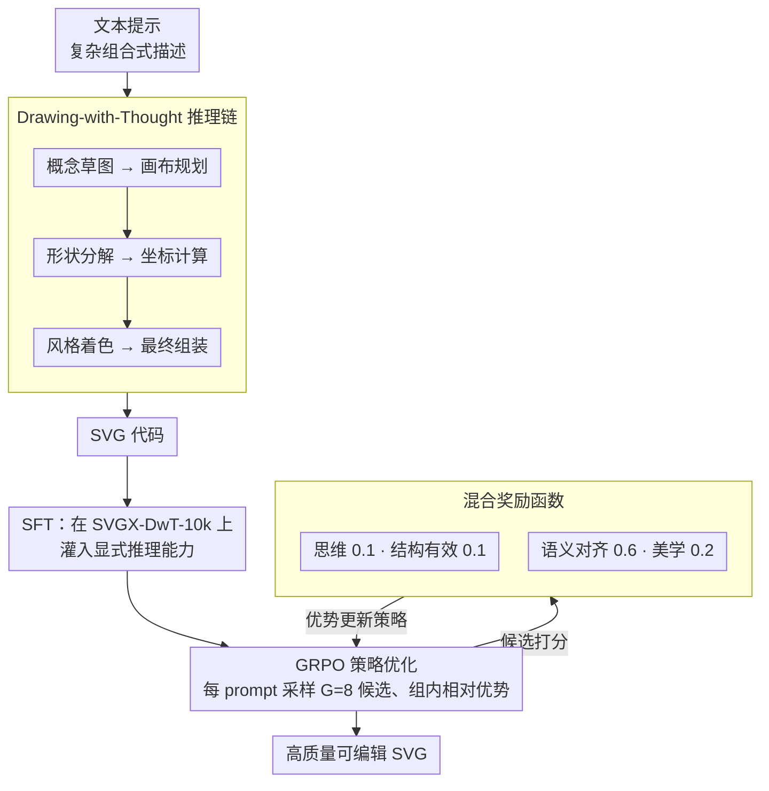

# Reason-SVG: Enhancing Structured Reasoning for Vector Graphics Generation with Reinforcement Learning

**会议**: CVPR2026  
**arXiv**: [2505.24499](https://arxiv.org/abs/2505.24499)  
**代码**: 无  
**领域**: 多模态VLM  
**关键词**: SVG生成, 结构化推理, 强化学习, GRPO, Drawing-with-Thought

## 一句话总结
提出 Reason-SVG 框架，通过"Drawing-with-Thought"(DwT)范式让 LLM 在生成 SVG 之前先进行显式的多阶段设计推理，并结合 SFT + GRPO 强化学习与混合奖励函数进行训练，在语义对齐、结构有效性和视觉质量上全面超越现有方法。

## 研究背景与动机
SVG（可缩放矢量图形）因其无损缩放和可编辑性而广泛应用于字体设计、数据可视化等领域。现有的 Text-to-SVG 方法分为两大范式：(1) 基于优化的方法（如 VectorFusion、SVGDreamer）通过 CLIP/T2I 模型迭代优化 SVG 参数，视觉质量高但速度极慢（>500s/张）且代码不可编辑；(2) 基于 LLM 的方法（如 LLM4SVG、StarVector）将 SVG 生成视为代码生成任务，速度快但对复杂语义理解能力不足。

**核心痛点**：现有 LLM 方法能处理简单描述（如"a castle"），但对复杂组合式提示（如"a white-and-red castle on a floating island among clouds in a blue sky"）往往失败。根本原因在于从高层文本直接映射到低层 SVG 代码存在巨大的**语义鸿沟**——LLM 的预训练数据缺乏将语义概念与具体 SVG 结构元素关联的细粒度标注。

**核心 idea**：在文本提示和最终代码之间引入一个**中间推理过程**作为概念脚手架，将复杂任务分解为"先推理画什么、如何布局"和"再将计划翻译为 SVG 代码"两个更可控的子问题。

## 方法详解

### 整体框架

Reason-SVG 要解决的是 LLM 把复杂组合式提示（如“a white-and-red castle on a floating island among clouds”）直接映射到 SVG 代码时的语义鸿沟。它的思路是“先规划后绘制”：给定文本提示 $\mathcal{T}$，模型先生成一段 DwT 推理链 $C$ 充当概念脚手架，再据此生成 SVG 代码 $O$，整体是 $\Phi: \mathcal{T} \rightarrow (C, O)$。训练分两步走——SFT 先把这套显式推理能力灌进模型，GRPO 再用一个混合奖励把推理质量和生成质量一起拉高。下图把推理链、两阶段训练与混合奖励的反馈回环串起来：

### 关键设计

**1. Drawing-with-Thought 推理机制：把人类设计师的工作流变成显式推理链**

LLM 之所以在复杂 prompt 上失败，是因为预训练数据缺乏“语义概念↔SVG 结构元素”的细粒度标注，从高层文本一步跳到低层代码太难。DwT 模拟人类设计师的流程，把 SVG 生成拆成六个顺序阶段：概念草图（识别关键视觉组件与整体轮廓）→ 画布规划（确定 viewBox 与空间布局）→ 形状分解（拆成圆、曲线等几何基元）→ 坐标计算（定各组件的近似位置）→ 风格与着色（分配调色板与一致样式）→ 最终组装（整合为连贯设计）。SFT 阶段在 SVGX-DwT-10k 上训练模型自回归地生成完整的“DwT 推理 + SVG”序列，相当于先教会它怎么想再让它画。

**2. 混合奖励函数：同时考核推理过程和最终输出，防止模型跳过推理**

只奖励最终输出会导致“推理崩塌”——模型学会绕开推理直接出代码。混合奖励对每个候选生成 $(C_k, O_k)$ 从四个维度加权打分：思维过程奖励 $\mathcal{R}_{\text{think}}$（$\lambda_t=0.1$，检测 DwT 序列是否含预期的 `<think>` 标签，只看结构不看内容）、SVG 结构有效性奖励 $\mathcal{R}_{\text{render}}$（$\lambda_r=0.1$，CairoSVG 渲染成功为 1 否则为 0）、语义对齐奖励 $\mathcal{R}_{\text{semantic}}$（$\lambda_s=0.6$，用 CLIP ViT-L/14 算渲染图与文本的余弦相似度）、视觉美学奖励 $\mathcal{R}_{\text{aesthetic}}$（$\lambda_a=0.2$，用 HPSv2 预测人类美学偏好）。四项加权合成总奖励：

$$R_{\text{hybrid}}^{(k)} = \lambda_t \mathcal{R}_{\text{think}} + \lambda_r \mathcal{R}_{\text{render}} + \lambda_s \mathcal{R}_{\text{semantic}} + \lambda_a \mathcal{R}_{\text{aesthetic}}$$

权重重心压在语义对齐（0.6），消融也证明它对最终效果影响最大；思维奖励刻意做得轻——只查标签在不在，在成本和“逼模型推理”之间取了个便宜的平衡。

**3. GRPO 策略优化：用组内相对比较代替显式价值网络**

基于 DeepSeek-R1 的 Group Relative Policy Optimization，对每个 prompt 采样 $G=8$ 个候选序列，用组内打分的相对高低算出每个候选的优势值 $\hat{A}_k$，再用 PPO-style 裁剪目标（$\epsilon=0.2$）和 KL 散度惩罚（$\beta=0.01$）更新策略。省掉了单独的价值网络，正好契合“一个 prompt 多条候选、靠混合奖励排序”的设定。

### 损失函数 / 训练策略
- **第一阶段 SFT**：在 SVGX-SFT + SVGX-DwT-10k 上训练 3 个 epoch，最大序列长度 4096，学习率 $2\times10^{-5}$（cosine decay + 10% warmup），AdamW 优化器
- **第二阶段 RL**：在 $\mathcal{D}_{\text{RL-Prompt}}$（2000 条 prompt）上进行 8000 步策略更新，参考策略通过 EMA（衰减率 0.99）更新
- 基座模型：Qwen2.5-VL-7B-Instruct，32 张 H800 GPU

## 实验关键数据

### 主实验

| 方法 | FID ↓ | CLIPScore ↑ | HPSv2 ↑ | Aesthetic ↑ | Val% ↑ | DwT-Cover% ↑ |
|------|-------|-------------|---------|-------------|--------|---------------|
| GPT-4o | 35.4 | 0.295 | 16.50 | 5.6 | 95.5 | N/A |
| Claude 3.7 | 38.2 | 0.288 | 15.80 | 5.5 | 94.8 | N/A |
| SVGDreamer | 22.5 | 0.309 | 18.50 | 5.8 | 100 | N/A |
| LLM4SVG | 30.7 | 0.293 | 16.80 | 5.2 | 76.0 | N/A |
| SFT-DwT (w/o RL) | 21.2 | 0.310 | 19.50 | 5.7 | 89.0 | 92.3 |
| **Reason-SVG (Full)** | **18.6** | **0.345** | **21.80** | **5.9** | **99.8** | **100** |

### 消融实验

| 配置 | CLIPScore ↑ | HPSv2 ↑ | Val% ↑ | DwT-Cover% ↑ |
|------|-------------|---------|--------|---------------|
| Full Reason-SVG | 0.345 | 21.40 | 97.8 | 100 |
| w/o DwT | 0.304 | 18.42 | N/A | N/A |
| w/o $\mathcal{R}_{\text{think}}$ | 0.313 | 20.15 | 97.1 | 85.3 |
| w/o $\mathcal{R}_{\text{render}}$ | 0.328 | 20.95 | 82.5 | 95.8 |
| w/o $\mathcal{R}_{\text{semantic}}$ | 0.289 | 20.50 | 97.5 | 98.1 |
| w/o $\mathcal{R}_{\text{aesthetic}}$ | 0.341 | 18.25 | 97.6 | 100 |

### 人类评估

| 方法 | SemAcc ↑ | VisApp ↑ | DwT-Qual ↑ |
|------|----------|----------|------------|
| SVGDreamer | 3.60 | 3.81 | N/A |
| GPT-4o | 3.75 | 3.60 | N/A |
| SFT-DwT | 3.95 | 3.70 | 3.92 |
| **Reason-SVG** | **4.53** | **4.42** | **4.61** |

### 关键发现
- DwT 推理过程至关重要：去掉 DwT 后 CLIPScore 从 0.345 降到 0.304，HPSv2 从 21.40 降到 18.42
- RL 阶段在 SFT-DwT 基础上将 CLIPScore 从 0.310 提升到 0.345，HPSv2 从 19.50 提升到 21.80
- 语义对齐奖励 $\mathcal{R}_{\text{semantic}}$ 对最终效果影响最大（去掉后 CLIPScore 下降 0.056）
- GRPO 训练中模型逐渐学会更长且更结构化的推理链会获得更高奖励
- 人类评估中 Reason-SVG 在 78% 的 pairwise 对比中被偏好（vs SVGDreamer）

## 亮点与洞察
- **"Drawing-with-Thought"范式**：将人类设计师的工作流（概念→布局→细节→组装）显式编码为 LLM 的推理过程，是一个非常优雅的中间表示设计，可迁移到其他结构化代码生成任务
- **混合奖励设计**：同时评估推理过程质量和最终输出质量，避免了"推理崩塌"——仅优化输出奖励可能导致模型跳过推理
- **轻量化思维奖励**：不深入评估推理内容，只检查结构标签是否存在，在成本和效果间取得了好的平衡
- 框架可扩展到 Image-to-SVG（矢量化），SSIM 达 0.9273、DINOScore 达 0.9731

## 局限与展望
- 推理链较长（~3200 tokens），生成速度（12s）虽然远快于优化方法但仍有优化空间
- 数据集 SVGX-DwT-10k 以图标类为主（>80%），在 UI/图表等复杂结构上的泛化性有待更多验证
- DwT 的六阶段结构是人为预定义的，能否让模型自主发现最优推理结构是有趣的后续方向
- 思维奖励仅检查结构标签，未评估推理内容的正确性，可能存在形式正确但内容空洞的情况

## 相关工作与启发
- **vs SVGDreamer**：优化方法视觉质量高但速度极慢（1020s vs 12s），Reason-SVG 在所有指标上反超，且代码可编辑
- **vs LLM4SVG**：同属 LLM 范式但缺乏推理机制，CLIPScore 0.293 vs 0.345，有效性 76% vs 99.8%
- **vs DeepSeek-R1 的 GRPO**：将通用推理 RL 范式迁移到视觉生成领域，奖励函数设计是关键创新

## 评分
- 新颖性: ⭐⭐⭐⭐ DwT 范式和混合推理-生成奖励设计有创新，将 reasoning 引入结构化代码生成是很好的方向
- 实验充分度: ⭐⭐⭐⭐⭐ 对比全面（闭源API/开源LLM/优化方法），消融细致，人类评估扎实
- 写作质量: ⭐⭐⭐⭐ 论文结构清晰，DwT 流程图直观，但公式符号稍多
- 价值: ⭐⭐⭐⭐ SVG 生成领域的重要进展，DwT 范式和混合奖励设计有较好的推广价值

## 亮点与洞察

## 局限与展望

## 相关工作与启发

## 评分
- 新颖性: 待评
- 实验充分度: 待评
- 写作质量: 待评
- 价值: 待评

<!-- RELATED:START -->

## 相关论文

- [\[ICML 2026\] iVGR: Internalizing Visually Grounded Reasoning for MLLMs with Reinforcement Learning](../../ICML2026/multimodal_vlm/ivgr_internalizing_visually_grounded_reasoning_for_mllms_with_reinforcement_lear.md)
- [\[CVPR 2026\] DocSeeker: Structured Visual Reasoning with Evidence Grounding for Long Document Understanding](docseeker_long_document_understanding.md)
- [\[CVPR 2025\] StarVector: Generating Scalable Vector Graphics Code from Images and Text](../../CVPR2025/multimodal_vlm/starvector_generating_scalable_vector_graphics_code_from_images_and_text.md)
- [\[CVPR 2026\] MoE-GRPO: Optimizing Mixture-of-Experts via Reinforcement Learning in Vision-Language Models](moe-grpo_optimizing_mixture-of-experts_via_reinforcement_learning_in_vision-lang.md)
- [\[CVPR 2026\] EMO-R3: Reflective Reinforcement Learning for Emotional Reasoning in Multimodal Large Language Models](emo-r3_reflective_reinforcement_learning_for_emotional_reasoning_in_multimodal_l.md)

<!-- RELATED:END -->
