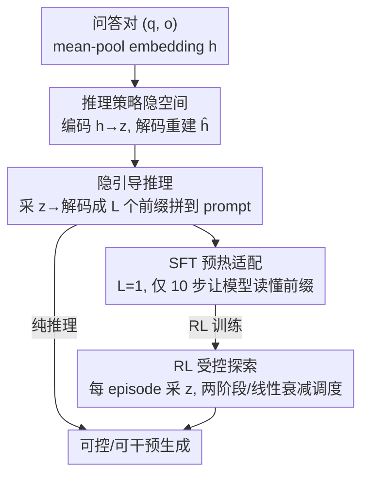

# Reasoning Palette: Modulating Reasoning via Latent Contextualization for Controllable Exploration for (V)LMs

**会议**: CVPR 2026  
**论文**: [CVF Open Access](https://openaccess.thecvf.com/content/CVPR2026/html/Long_Reasoning_Palette_Modulating_Reasoning_via_Latent_Contextualization_for_Controllable_Exploration_CVPR_2026_paper.html)  
**代码**: 无  
**领域**: 多模态VLM / LLM推理  
**关键词**: 受控探索, 隐变量调制, VAE, 前缀注入, 强化学习

## 一句话总结
用一个 VAE 学出"推理策略"的连续隐空间，每次采一个隐变量解码成可学习前缀拼到 prompt 前面，让 (V)LM 在生成第一个 token 之前就在"策略层面"做采样，从而把 RL/推理时的探索从 token 级随机升级成结构化的策略级多样性，在数学推理和视觉 grounding 上都稳定涨点。

## 研究背景与动机
**领域现状**：带可验证奖励的强化学习（RLVR）已经成为大语言/视觉语言模型后训练的主流范式——模型先吐一串中间推理 token，再给最终答案，由规则化的正确性检查给奖励。训练时需要靠采样（temperature / nucleus sampling）来产生多样 rollout 供优势估计。

**现有痛点**：标准采样方案反复落在彼此非常接近的轨迹上，多样性只体现在"措辞不同"，而策略和计划结构几乎不变。已有的补救手段（如熵正则）只鼓励 token 级的局部多样性，没有任何机制去重塑模型的"内部规划"，于是模型探索的还是几条换皮的相似路径，而非真正不同的策略模式。

**核心矛盾**：发现有效推理策略所需的是**高层多样性**（用算术算、用代数推、还是多跳检索），而 token 级采样提供的是**低层多样性**。这两者错配，限制了 RL 训练的效率和稳健性。

**切入角度**：作者观察到一个反直觉现象（论文 Fig.1）——在 Qwen-4B-Base 的 prompt embedding 前面**只拼一个随机高斯噪声 token**，即使每个候选都用 greedy 解码，pass@k 也能大幅提升（GSM8K 上 pass@32 从 52.9% 飙到 85.3%）。这说明涨点不来自 token 级随机，而来自前缀带来的**策略层扰动**。但直接拼裸噪声常常因为和模型原生 embedding 分布不对齐而掉点。

**核心 idea**：用 VAE 在模型自己的 token embedding 空间里学一个"推理策略调色盘"（palette），每采一个隐变量就解码成一小段前缀，在生成开始前调制模型的内部规划——把探索从 token 级随机变成生成前（pre-generative）对推理策略的结构化采样。

## 方法详解

### 整体框架
Reasoning Palette 分三步走：先训一个 VAE 把"问答对的语义"映射到一个连续高斯隐空间 $\mathcal{Z}$，不同区域对应不同推理风格；推理/训练时从该空间采隐变量 $z$，经解码器变成 $L$ 个连续前缀 embedding 拼到 prompt 前；其中夹一段极短的 SFT 让基座模型学会"读懂"这种前缀，最后在 RL 里把 $z$ 当作每个 episode 的辅助控制信号，按调度策略逐步从探索切换到利用。整条链路的关键在于：**前缀不是随机噪声，而是从一个语义有结构的隐空间解码出来的**，所以既有多样性又和模型 embedding 分布对齐。

### 关键设计

**1. 推理策略隐空间：用 VAE 把"怎么想"压成一个可采样的连续坐标**

痛点是 token 级采样动不了"策略"，那就先得有个东西能表示"策略"。作者在一批覆盖数学、问答、代码的高质量推理轨迹 $D=\{(q^{(i)},o^{(i)})\}$ 上训 VAE。对每个问答对，先把 $[q;o]$ 拼起来，**在模型冻结的 token embedding 层 $E(\cdot)$ 上做 mean-pooling** 得到定长摘要 $h=\frac{1}{N}\sum_{i=1}^{N}E([q;o]_i)\in\mathbb{R}^d$。这一步很关键：$h$ 和单个 token embedding 活在同一个空间，所以解码器重建出的 $\hat h$ 天然能当"伪 token"用、和模型输入分布一致；而 mean-pooling 又抹掉了 token 顺序的表面差异，让 $h$ 表征的是"推理风格"而非逐字输出。编码器 $E_\phi$（MLP）把 $h$ 映成对角高斯参数 $\mu,\sigma=E_\phi(h)$，$z\sim\mathcal{N}(\mu,\mathrm{diag}(\sigma^2))$；解码器 $D_\psi$ 重建 $\hat h=D_\psi(z)$。训练最小化 ELBO：

$$\mathcal{L}_{\text{VAE}}=\mathbb{E}_{z\sim q_\phi(z|h)}\big[\lVert h-\hat h\rVert^2\big]+\beta\cdot\mathrm{KL}\big(q_\phi(z|h)\,\Vert\,p(z)\big)$$

其中先验 $p(z)=\mathcal{N}(0,I)$，$\beta$ 平衡重建保真度和隐流形的平滑度。调好的 $\beta$ 让相近隐变量对应相似推理模式、远处的诱导出质上不同的策略——这正是"调色盘"上不同颜色的来源。实验里 t-SNE/PCA 可视化确实看到数学、代码、QA 按推理域聚成可分的簇。

**2. 隐引导推理 + 可调控制强度：采一个 z 解码成前缀，拼到 prompt 前就换了一种"思路"**

有了隐空间，推理时从先验采 $z\sim\mathcal{N}(0,I)$，解码成 $L$ 个前缀 embedding $p_z=(D_\psi(z^{(1)}),\dots,D_\psi(z^{(L)}))\in\mathbb{R}^{L\times d}$，直接拼到 prompt embedding 前：$\tilde q=[p_z;E(q)]$，再让策略自回归生成 $o\sim\pi_\theta(\cdot\mid\tilde q)$。妙在前缀长度 $L$ 是推理时可调的旋钮——$L$ 大则引导更强更结构化（适合复杂多步任务），$L$ 小则轻量干预、开销小。而且因为 VAE 在 SFT 后冻结，隐空间是一套**稳定可解释的坐标系**：可以事后聚类高奖励隐变量、或把已知某个域（如数学）的轨迹编码进去算出该域的均值协方差，推理时只在那块区域采样、解码出"数学风格"前缀，实现**定向干预**。这把探索从"token 级随机"变成了"生成前对推理策略的采样"，也让"模型为什么这么想"变得可分析、可操控。

**3. 极短 SFT 预热：只学"读懂前缀"，不学"背答案"**

直接把陌生前缀塞给基座模型，它要么无视、要么被强信号带偏。所以需要一段轻量 SFT 让模型对 latent 信号"敏感"起来。关键细节有两点：其一，SFT 数据**不是**把真值样本编码成 latent，而是直接从先验 $z\sim\mathcal{N}(0,I)$ 采、解码成前缀 $p=D_\psi(z)$，再和原始 $(q,o)$ 配对——因为后验 $q_\phi(z|h)$ 会偏离先验，推理时用先验采样，训练就得对齐到先验侧，否则泛化会退化。其二，**严格限制 SFT 时长（通常 10 步）且固定 $L=1$**：训练目标是标准语言建模损失

$$\mathcal{L}_{\text{SFT}}=-\mathbb{E}_{(p,q,o)\sim D_{\text{SFT}}}\big[\log p_\theta(o\mid[p;E(q)])\big]$$

之所以要"少而短"，是因为过度 SFT 会让模型把前缀的影响权重压低、过拟合到某个固定回答模式，从而把不同 $z$ 本该带来的多样性"洗掉"。保持最小干预，模型既学会了 condition 在任意前缀上，又保留了对新隐变量灵活反应的随机性。推理和 RL 阶段再放开 $L$（如 4 或 8）做更丰富的组合式引导。

**4. RL 受控探索 + 双轴调度：把 z 当 episode 级控制变量，按计划从探索切到利用**

进入 RL 后，每个 episode 采一个 $z\sim\mathcal{N}(0,I)$ 解码成前缀 condition 策略：$\pi_\theta(o\mid q,z)=\prod_{t}p_\theta(o_t\mid[p;E(q)],o_{<t})$，目标扩展为 $\max_\theta\mathbb{E}_{z\sim p(z)}\mathbb{E}_{q,o}[r(o;q)]$。这让 RL 沿两条互补的轴做多粒度探索控制：**时间调度**（latent 引导强度随训练进程从探索向利用过渡）和**组内多样性控制**（在每个 GRPO group 内调节有多大比例的 rollout 拿到 latent 前缀）。作者把它写成混合目标：

$$J_{\text{sched}}(\theta)=\mathbb{E}_\tau\mathbb{E}_{q}\big[\rho(\tau)\cdot\mathcal{L}_{\text{PPO}}(\theta;q,z)+(1-\rho(\tau))\cdot\mathcal{L}_{\text{PPO}}(\theta;q)\big]$$

其中 $\tau\in[0,1]$ 是归一化训练进度，$\rho(\tau)$ 是该步带 latent 引导的 rollout 占比。两个具体调度：**两阶段**——前 50% 步全部用 $L=8$ 的 latent 前缀最大化策略多样性，后 50% 完全关掉（$L=0$）让策略充分利用已发现的高奖励行为，即 $\rho(\tau)=\mathbb{1}[\tau<0.5]$；**线性衰减**——$\rho(\tau)=1-\tau$，平滑地把"多样轨迹为主"过渡到"高置信生成为主"。两者都在"推理架构"层面而非 token 随机层面实现经典的探索-利用权衡，训练曲线表现为前期涨得慢（探索代价）、后期反超 baseline（前期暴露到了更优的行为空间区域）。

## 实验关键数据

### 主实验
在 DeepMath 上用 GRPO / RLOO 训练，pass@1 评测五个数学基准，三种规模骨干都涨点：

| 骨干 / 算法 | 配置 | MATH500 | OlympiadBench | AMC23 | GSM8K | MinervaMath | 平均 |
|------|------|---------|---------------|-------|-------|-------------|------|
| Qwen3-4B / GRPO | baseline | 68.65 | 41.32 | 50.94 | 91.05 | 39.39 | 58.27 |
| Qwen3-4B / GRPO | + 线性衰减 | 72.67 | 45.29 | 47.50 | 92.64 | 42.53 | 60.12 (+1.85) |
| Qwen3-8B / RLOO | baseline | 69.53 | 43.76 | 55.00 | 91.82 | 39.48 | 59.91 |
| Qwen3-8B / RLOO | + 线性衰减 | 72.20 | 46.61 | 59.38 | 93.03 | 43.77 | 63.00 (+3.09) |

最大增益出现在复杂域（Qwen3-8B+RLOO 上 AMC23 +4.38、MinervaMath +4.29）；线性衰减整体比两阶段略好（平均约 +0.75），说明平滑过渡更利于从探索向利用迁移。

推理时的隐引导（pass@8，Qwen3-4B-Base SFT 后）也验证了**定向干预有效**——用对应域的 latent 采样最优：

| Latent 来源 | MATH500 | Olympiad | GSM8K |
|------|---------|----------|-------|
| codeparrot (代码域) | 70.8 | 42.95 | 94.47 |
| MetaMathQA (数学域) | **72.4** | **46.11** | **95.0** |
| ShareGPT Vicuna (QA域) | 71.0 | 45.47 | 93.63 |

### 消融实验
VLM grounding（referring expression comprehension，IoU≥0.5 算对，pass@32，Qwen2.5VL-3B）上拆解四种配置：

| 配置 | RefCOCO | RefCOCO+ | RefCOCOg | 说明 |
|------|---------|----------|----------|------|
| Baseline (greedy) | 2.0 | 2.0 | 4.67 | 纯 greedy，常因格式不对拿低分 |
| Baseline + 采样 | 65.07 | 62.57 | 72.0 | 只靠 token 级随机 |
| Latent-guided (greedy) | 72.07 | 73.07 | 73.1 | 只加 latent 前缀 |
| Latent-guided + 采样 | **87.53** | **86.03** | **85.7** | 两者叠加最佳 |

关键对比：latent 引导单独带来的增益（greedy→latent-greedy）**超过**采样单独带来的增益（greedy→baseline+采样），证明生成前的结构化探索比 token 级随机更有价值；且 latent 多样性与解码随机性互补叠加最优。⚠️ 注意 VLM 这里用的是一个**随机初始化、未训练的 GPT 式小解码器**（而非训好的 VAE 解码器）把噪声变成前缀，作者发现直接注入裸噪声无效、过这个随机解码器才显著变好。

### 关键发现
- 涨点来源是**策略层扰动而非 token 随机**：greedy 解码下只换前缀就能把 GSM8K pass@32 从 52.9% 拉到 85.3%。
- latent 的作用不是"一次性加成"而是**改变整条探索-利用轨迹**：前期探索慢但暴露到更优行为空间，后期收敛反超 baseline。
- 隐空间确实**按推理域解耦**：t-SNE 看到数学/代码/QA 分簇，且 competition_math 与 PRM800K 高度重叠（都偏形式化数学），MetaMathQA 略偏（偏教学式分步），QA 簇铺得最开（开放问答策略最杂）。
- 前缀长度 $L$ 与控制强度正相关，$L$ 可在推理时自由调节以权衡控制力和开销。

## 亮点与洞察
- **把"探索"从输出空间搬到输入空间**：不去改采样温度，而是在 prompt 前注入一个从语义隐空间采出的前缀，等于在"还没开口前"先选好用哪种思路——这个"pre-generative sampling"的视角很巧。
- **mean-pool 到 token embedding 空间**这一步是让前缀"可被模型吸收"的关键 trick：保证注入物和模型原生输入分布对齐，避免裸噪声的 OOD 问题，可迁移到任何想给冻结模型注入可控引导的场景。
- **SFT 故意只训 10 步且 L=1**：反常识地"少训"是为了不把多样性洗掉，这个"欠拟合是 feature"的设计值得记住。
- 隐空间冻结后成为可解释坐标系，支持事后聚类高奖励区域、定向采样——给"可控/可诊断推理"提供了一个干净的接口。

## 局限与展望
- 主实验几乎只在**数学推理**上做 RL 评测，作者也坦言选数学是因为奖励结构清晰、对策略多样性敏感；代码、agent 等域的 RL 效果未充分验证。
- VLM 侧用的是**随机未训练的小解码器**而非训好的 VAE，两套机制并不统一，说明"为什么裸噪声不行、随机解码器却行"还缺乏充分解释 ⚠️。
- 调度策略（两阶段 / 线性衰减）的优劣随骨干和算法波动（如 Qwen3-4B+RLOO 上两阶段反而更稳、线性衰减 MATH500 掉 3.05），没有一个对所有设置都最优的方案，需逐设置调。
- 增益幅度总体温和（平均 +1~3 点），且依赖一段额外的 VAE 训练 + SFT 预热，工程成本和收益的性价比需视场景权衡。

## 相关工作与启发
- **vs 熵正则 / 温度采样**：它们只在 token 级鼓励局部多样性，无法重塑内部规划；本文在策略层做结构化探索，多样性体现在"用什么思路"而非"措辞不同"。
- **vs prefix-tuning / soft prompt tuning**：那些学一组**固定**的连续前缀去稳定地 steer 行为；本文的前缀是从一个**可采样的 VAE 隐空间**动态解码出来的，目的不是固定一种行为而是诱导多样策略并支持定向干预。
- **vs soft chain-of-thought**：后者用连续表示替代离散推理 trace 来提效；本文不替代推理过程，而是在生成前注入一个"策略上下文"调制后续完整推理。

## 评分
- 新颖性: ⭐⭐⭐⭐ 把 RL 探索从 token 级搬到 VAE 隐空间的策略级，"调色盘"视角清晰且有 Fig.1 现象支撑。
- 实验充分度: ⭐⭐⭐ 三规模骨干 + 双算法 + LLM/VLM 都验证，但 RL 主实验偏数学单一域，VLM 用随机解码器略割裂。
- 写作质量: ⭐⭐⭐⭐ 动机-现象-方法的逻辑链顺畅，公式和调度策略交代清楚。
- 价值: ⭐⭐⭐⭐ 提供了一个轻量、可解释、可定向干预的受控推理接口，思路可迁移到给冻结模型注入可控引导的多种任务。

<!-- RELATED:START -->

## 相关论文

- [\[CVPR 2026\] Monet: Reasoning in Latent Visual Space Beyond Image and Language](monet_reasoning_in_latent_visual_space_beyond_image_and_language.md)
- [\[CVPR 2026\] LASAR: Towards Spatio-temporal Reasoning with Latent Cognitive Map](lasar_towards_spatio-temporal_reasoning_with_latent_cognitive_map.md)
- [\[CVPR 2026\] Controllable Federated Prompt Learning at Test Time](controllable_federated_prompt_learning_at_test_time.md)
- [\[CVPR 2026\] VisMem: Latent Vision Memory Unlocks Potential of Vision-Language Models](vismem_latent_vision_memory_unlocks_potential_of_vision-language_models.md)
- [\[ACL 2026\] Forest Before Trees: Latent Superposition for Efficient Visual Reasoning](../../ACL2026/multimodal_vlm/forest_before_trees_latent_superposition_for_efficient_visual_reasoning.md)

<!-- RELATED:END -->
