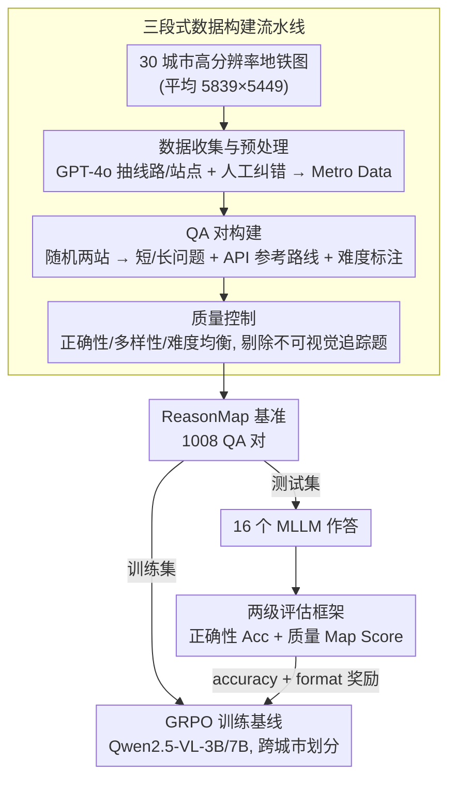

<!-- 由 src/gen_stubs.py 自动生成 -->
# ReasonMap: Towards Fine-Grained Visual Reasoning from Transit Maps

**会议**: CVPR2026  
**arXiv**: [2505.18675](https://arxiv.org/abs/2505.18675)  
**代码**: [fscdc/ReasonMap](https://fscdc.github.io/ReasonMap)  
**领域**: 多模态VLM  
**关键词**: 多模态推理, 视觉推理, 空间推理, 地铁地图, benchmark, 强化微调, GRPO

## 一句话总结

提出 ReasonMap 基准，利用 30 个城市的高分辨率公交地图构建 1,008 个 QA 对，通过两级评估框架（正确性+质量）系统评估 16 个 MLLM 的细粒度视觉推理能力，发现开源模型中 base 优于 reasoning 而闭源模型相反。

## 研究背景与动机

**MLLM 视觉推理评估不足**：现有多模态推理基准（MathVQA、MMMU、MathVerse）主要评估符号/数学推理，视觉理解的作用有限，缺乏对细粒度视觉理解与空间推理的联合评估。

**现有基准粒度偏粗**：VisuLogic、VisualPuzzles 等关注细粒度感知但不涉及空间规划；CityBench、MapBench 涉及空间推理但粒度不够精细，且依赖外部工具（地图 API）完成任务，绕过了真正的视觉推理。

**地图是理想的测试载体**：公交地图作为结构化、信息密集的视觉产物，天然要求精确的空间解读能力，非常适合评测细粒度视觉推理。

**推理型模型表现存疑**：推理型 MLLM 在数学和逻辑任务上表现突出，但在需要视觉接地的空间推理任务上是否同样有效，缺乏系统验证。

**视觉依赖 vs 语言先验**：已有研究指出 MLLM 可能依赖内部知识先验而非真正关注视觉输入，需要通过视觉遮蔽实验来验证。

**缺少训练基线**：在细粒度视觉推理场景下缺少 RL 训练基线，阻碍了后续研究对比与探索。

## 方法详解

### 整体框架

ReasonMap 是一个评测细粒度视觉推理的基准，核心载体是公交/地铁地图——结构化、信息密集、天然要求精确的空间解读。整条流水线分三段：先收集 30 个城市的高分辨率地图并结构化为统一的 Metro Data，再据此自动生成短/长两类 QA 对并配上参考路线，最后做质量控制把不可视觉追踪或错误的题剔掉，得到 ReasonMap 基准。评测侧用一套两级框架（先判对错、再打质量分）来评估 16 个 MLLM；同一套框架的指标又被改造成奖励，驱动一个 GRPO 强化微调基线供后续研究对比。

### 关键设计

**1. 三段式数据构建流水线：把地图变成可追踪、可评分的 QA**

要测真正的视觉推理，就得保证每道题都能在图上视觉追踪、且答案与视觉内容一致。流水线为此分三段：(a) **数据收集与预处理**——从公开来源收集 30 个城市（13 国）的高分辨率地铁图（平均 5,839×5,449，远超现有视觉推理数据集常见的 <1,000×1,000），用 GPT-4o 提取线路与站点名、人工纠错后存成统一 JSON，换乘站/支线起始站等特殊情况单独标注；(b) **QA 对构建**——随机取两站，短问题用 1 个固定模板、长问题从 2 个模板随机选（一个问经停站数、一个要求列出具体经停站），参考路线由高德（中国城市）/ Google Map（其他城市）API 获取，问题难度按换乘次数分（0 次 easy / 1 次 medium / ≥2 次 hard），地图难度按线路与换乘站数分（easy/medium/hard 各 10 张），每张图固定 20:15:5 配额共 40 题；(c) **质量控制**——从正确性、多样性、难度均衡三方面检查，错题人工修正或丢弃，不可视觉追踪的路线直接剔除。

**2. 两级评估框架：先判对错，再用质量分拉开模型差距**

单纯的正确率太粗，区分不出模型间的细微差异。ReasonMap 因此叠两层：**正确性评估（Accuracy）**依次验证出发/到达站正确性 → 每段路线名存在性 → 每段出发/到达站有效性 → 相邻段换乘站一致性，全通过才算正确；**质量评估（Map Score）**对短问题逐段对比答案与参考路线，匹配 stop1/stop2 得 1 分、路线名 2 分、段内出发/到达站各 1 分，上限 10 分、答对额外加分，长问题在此基础上再加经停站数评估（num_via_stop_score，绝对误差映射到 4 分制）或具体经停站评估（via_stop_score，IoU + 精确匹配平均后截断到 10 分）。高难度样本赋更大权重，让分数更能反映鲁棒性。

**3. GRPO 训练基线：补上细粒度视觉推理缺失的 RL 起点**

这一领域此前没有 RL 训练基线，后续研究无从对比。论文在 Qwen2.5-VL-3B/7B-Instruct 上用 GRPO（Group Relative Policy Optimization）做强化微调，奖励由两部分组成——基于正确性评估的二值 accuracy reward，和鼓励可解析输出的 format reward；训练用 AdamW、lr=1e-6、KL 系数 1e-3、每查询采样 8 个响应、全局 batch size 16，并采用训练/测试城市完全不相交的跨城市划分来检验泛化。

## 实验

### 主要结果

| 模型 | 类型 | 短问题加权 Acc | 长问题加权 Acc | Map Score (S/L) |
|---|---|---|---|---|
| Qwen2.5-VL-72B | Base | 26.65% | 24.22% | 5.09 / 8.80 |
| InternVL3-78B | Base | 25.35% | 19.62% | 4.80 / 7.50 |
| QvQ-72B-Preview | Reasoning | 9.03% | 4.25% | 1.59 / 1.55 |
| Kimi-VL-A3B-Thinking | Reasoning | 5.47% | 5.47% | 2.44 / 3.17 |
| OpenAI o3 | Reasoning | **63.02%** | **59.11%** | **9.53 / 17.96** |
| OpenAI 4o | Base | 41.15% | 42.80% | 6.84 / 13.57 |
| Gemini-2.5-Flash | Reasoning | 46.09% | 29.86% | 7.64 / 9.98 |

### RL 训练基线消融

| 模型 | 短问题 Acc 提升 | 长问题 Acc 提升 | Map Score 提升 (S/L) |
|---|---|---|---|
| Qwen2.5-VL-3B + RL | +2.78% | +2.51% | +1.06 / +2.39 |
| Qwen2.5-VL-7B + RL | +12.94% | +18.92% | +1.51 / +3.78 |

### 关键发现

1. **开源 base > reasoning，闭源 reasoning > base**：开源推理模型在思考过程中反复试错引入视觉混淆（先正确后自我否定），而闭源推理模型具备更强的视觉接地能力，即使出现视觉混淆也能在推理链中自我纠正。
2. **缩放律仍然成立**：同系列更大模型准确率更高且 token 用量更少（Qwen2.5-VL-72B 短问题 26.65% vs 3B 的 8.68%）。
3. **视觉遮蔽实验**：去除视觉输入后多数模型性能下降，闭源模型下降更显著（Doubao-415 短问题 Acc 下降 21.61%），说明其有效利用了视觉信息；而 Qwen2.5-VL-3B 几乎不变甚至提升，说明小模型更依赖语言先验。
4. **RL 微调一致有效**：7B 模型在跨城市设置下短问题 Acc 从 13.28% 提升到 26.22%，长问题从 7.12% 到 26.04%，同时 token 用量减少。
5. **错误类型分析**：主要错误包括视觉混淆（相似颜色线路误识别）、格式错误、幻觉（重复正确答案或生成无关内容）和拒答。多种错误可在同一回复中共现。
6. **城市间差异大**：即使地图难度相当，不同城市间的模型表现差异显著，与城市知名度和站名语言密切相关。

## 亮点

- 首个面向细粒度视觉推理的高分辨率地图基准，分辨率远超现有数据集（5,839×5,449 vs 通常<1,000×1,000）
- 两级评估框架（正确性 + 质量）设计精巧，map score 比简单 Acc 更能区分模型差异
- 揭示了开源/闭源 base/reasoning 模型的反直觉表现差异，并通过 case analysis 给出合理解释
- 半自动化可扩展的数据构建流水线，便于后续扩充城市
- 视觉遮蔽实验验证了视觉接地的必要性

## 局限性

- 数据规模偏小（1,008 QA 对、30 个城市），城市覆盖和语言多样性有限
- 仅限地铁/公交地图，未涉及更复杂的地图类型（如道路网络、建筑平面图）
- 参考路线依赖 Google Map/高德 API，可能存在覆盖偏差
- 评估依赖严格格式解析，格式错误直接判错可能低估某些模型的真实推理能力
- RL 训练基线仅在 Qwen2.5-VL 上验证，未涵盖更多架构

## 相关工作

- **多模态推理基准**：MMMU、MathVerse、VisuLogic、VisualPuzzles、VGRP-Bench — 侧重数学/逻辑或抽象视觉推理
- **地图/空间推理**：CityBench、MapBench、MapEval、GeoNav — 空间推理但粒度粗或依赖外部工具
- **推理型 MLLM**：Kimi-VL-Thinking、QvQ、Skywork-R1V（开源）；OpenAI o3、Gemini-2.5-Flash、Doubao-415（闭源）
- **强化微调**：GRPO 在 LLM 推理中的成功经验被迁移到多模态领域

## 评分

- 新颖性: ⭐⭐⭐⭐ — 首次聚焦高分辨率地图的细粒度空间推理评测，选题新颖
- 实验充分度: ⭐⭐⭐⭐⭐ — 16 个模型全面对比 + 视觉遮蔽 + RL 基线 + 错误分析，非常充分
- 写作质量: ⭐⭐⭐⭐ — 结构清晰，评估框架描述严谨
- 价值: ⭐⭐⭐⭐ — 为细粒度视觉推理提供了重要基准，开源/闭源差异发现有启发性

<!-- RELATED:START -->

## 相关论文

- [\[CVPR 2026\] OddGridBench: Exposing the Lack of Fine-Grained Visual Discrepancy Sensitivity in Multimodal Large Language Models](oddgridbench_exposing_the_lack_of_fine-grained_visual_discrepancy_sensitivity_in.md)
- [\[CVPR 2026\] CropVLM: Learning to Zoom for Fine-Grained Vision-Language Perception](cropvlm_learning_to_zoom_for_fine_grained_vision_language_perception.md)
- [\[CVPR 2026\] MA-Bench: Towards Fine-grained Micro-Action Understanding](ma-bench_towards_fine-grained_micro-action_understanding.md)
- [\[CVPR 2026\] HandVQA: Diagnosing and Improving Fine-Grained Spatial Reasoning about Hands in Vision-Language Models](handvqa_diagnosing_and_improving_fine-grained_spatial_reasoning_about_hands_in_v.md)
- [\[CVPR 2026\] Concept-wise Attention for Fine-grained Concept Bottleneck Models](coat_cbm_concept_wise_attention.md)

<!-- RELATED:END -->
