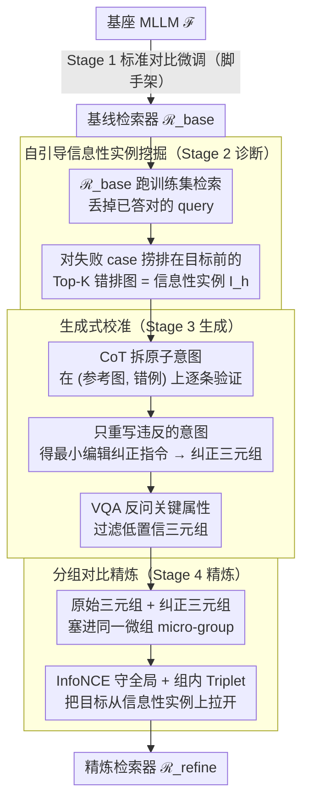

# ReCALL: Recalibrating Capability Degradation for MLLM-based Composed Image Retrieval

**会议**: CVPR 2026  
**arXiv**: [2602.01639](https://arxiv.org/abs/2602.01639)  
**代码**: [https://github.com/RemRico/Recall](https://github.com/RemRico/Recall)  
**领域**: 多模态检索  
**关键词**: 组合图像检索, 能力退化, MLLM自改进, 对比学习, 诊断-生成-精炼

## 一句话总结
揭示了将生成式MLLM适配为判别式检索器时的"能力退化"现象（Capability Degradation），提出ReCALL框架通过诊断检索器盲点→利用基座MLLM的CoT推理生成纠正性三元组→分组对比精炼三阶段管线，有效恢复退化的细粒度组合推理能力，在CIRR上R@1达55.52%、FashionIQ上R@10达57.04%。

## 研究背景与动机

**领域现状**：组合图像检索（CIR）根据参考图+修改文本的混合查询检索目标图。早期双塔VLM方法因浅层跨模态对齐不够，难以做细粒度组合推理。近期开始将MLLM适配为检索器，利用其深度融合和指令跟随能力，通过对比学习微调获得判别式检索能力。

**现有痛点**：将生成式MLLM（聚焦逐步推理）压缩为单嵌入判别式检索器（聚焦向量相似度）引入了**范式冲突**——微调后模型的原生细粒度推理能力（细粒度定位、关系理解）发生退化。实验证明：在基座MLLM能通过VQA正确回答的1k样本上，微调后的检索器R@1仅62.33%(CIRR)和55.80%(FashionIQ)，证明大量已有能力在适配过程中丧失。

**核心矛盾**：生成式范式（强调序列推理、注意力分配到每个token）vs 判别式范式（将全部语义压缩到单个embedding向量）的根本冲突。单embedding无法承载MLLM原本通过多步推理才能完成的细粒度区分。

**本文目标**：如何在保持检索形式（单embedding必须）的前提下，恢复微调过程中退化的组合推理能力？

**切入角度**：不改变检索范式本身，而是利用基座MLLM的原生推理信号反向监督检索器的embedding空间——"从MLLM中蒸馏推理能力到检索空间"。

**核心 idea**：通过诊断检索器的失败案例、让基座MLLM为失败案例生成最小编辑的纠正指令形成新三元组、再用分组对比学习将这些细粒度区分能力内化到检索器中。

## 方法详解

### 整体框架
ReCALL要解决的是同一个尴尬：MLLM本来会逐步推理，可一旦被压成单个检索embedding，那些细粒度推理能力就废了。它不去改检索范式，而是绕一圈把基座MLLM自己的推理能力"找回来"喂给检索器。整条管线分四步走：先用标准对比学习从基座MLLM $\mathcal{F}$ 训出一个基线检索器 $\mathcal{R}_{\text{base}}$（脚手架）；再让 $\mathcal{R}_{\text{base}}$ 自己在训练集上跑一遍，把它搞错的样本挑出来（诊断）；然后请 $\mathcal{F}$ 用CoT推理为这些错例写出"纠正版"指令、组成新三元组并过滤（生成）；最后把原始三元组和纠正三元组放进同一组继续对比训练，得到精炼后的 $\mathcal{R}_{\text{refine}}$（精炼）。下面三个关键设计正对应诊断、生成、精炼三个贡献阶段（Stage 1 只是把生成式MLLM转成检索器的常规起点，不算本文创新）；整个框架与具体骨干无关，换个MLLM也照样跑。

### 关键设计

**1. 自引导信息性实例挖掘（Stage 2 诊断）：只在检索器真正栽跟头的地方花生成预算**

盲目合成大量数据再训练，预算大半浪费在模型本就答对的样本上。ReCALL反其道而行：让 $\mathcal{R}_{\text{base}}$ 在训练集上做一遍检索，把已经检索成功的query直接扔掉（它们判别力够了），只盯住失败的case。对每个失败case，把那些被错误排在ground truth之前的Top-K图像捞出来当作"信息性实例" $\{I_h\}$。这些图之所以信息量大，是因为它们和真正目标只差一点点视觉/语义细节，恰好踩中了检索器退化掉的那部分推理能力。于是后续的生成预算被精准压到模型的实际盲点上，数据效率远高于随机挖掘。

**2. 生成式校准（Stage 3 生成）：用基座MLLM的推理给错例写一条"最小编辑"的纠正指令**

挖到信息性实例后，问题变成怎么给它生成可靠的监督信号，ReCALL让会推理的 $\mathcal{F}$ 来干这件事，分两步。第一步是CoT辅助生成：对每个 $I_h$，先把原始修改指令 $T_m$ 拆成若干原子意图，逐条验证它在参考图与错例图 $(I_r, I_h)$ 这一对上是否成立，凡是成立的意图原样保留、只把不成立的那条重新生成，拼成纠正指令 $\tilde{T}_m$。这样新三元组 $(I_r, \tilde{T}_m, I_h)$ 与原始指令之间只差最小的一处文本改动，而这处改动恰好对应目标 $I_t$ 与错例 $I_h$ 的视觉差异——视觉差异和文本差异被对齐成了一条对称的监督信号。第二步是VQA质量控制：再让 $\mathcal{F}$ 针对 $\tilde{T}_m$ 里的关键属性反问几句，只有高置信、前后一致的三元组才留下，把生成噪声挡在训练之外。

**3. 分组对比精炼（Stage 4 精炼）：把目标和它的"近邻陷阱"塞进同一组，逼模型一次梯度就分开它们**

有了纠正三元组，还得让检索器真的把这份区分能力吃进embedding空间。ReCALL为每个query搭一个微组（micro-group），里面同时放原始正样本三元组 $(I_r, T_m, I_t)$ 和纠正三元组 $(I_r, \tilde{T}_m, I_h)$，再用双目标一起优化：InfoNCE损失负责守住全局的对齐结构，组内的三元组margin损失则显式把目标从信息性实例上拉开，

$$\mathcal{L}_{\text{triplet}} = \max\big(0,\ s(z_q, z_{t^-}) - s(z_q, z_{t^+}) + m\big),\qquad \mathcal{L}_{\text{total}} = \mathcal{L}_{\text{infoNCE}} + \lambda\mathcal{L}_{\text{triplet}}$$

其中 $z_{t^+}$ 是目标、$z_{t^-}$ 是易混淆的信息性实例。把最难区分的那对样本和只差一处的指令一起放进同一batch，等于强迫模型在单次更新里就解决掉最棘手的歧义；相比随机组batch，这种结构化分组让纠正信号的传递效率最大化。

### 一个完整示例
以FashionIQ的一条裙子query为例：参考图是一件短袖连衣裙，修改文本 $T_m$="换成长袖、领口改成圆领"。**诊断阶段**，$\mathcal{R}_{\text{base}}$ 检索后把一件"长袖但仍是V领"的裙子错排在真正目标（长袖圆领）之前——这件V领裙就被捞作信息性实例 $I_h$。**生成阶段**，$\mathcal{F}$ 把 $T_m$ 拆成"长袖"和"圆领"两个原子意图，在 $(I_r, I_h)$ 上验证发现"长袖"已满足、"圆领"不满足，于是只重写违反的那条，得到纠正指令 $\tilde{T}_m$="换成长袖、领口改成V领"，组成纠正三元组 $(I_r, \tilde{T}_m, I_h)$；再用VQA反问"领口是不是V领"确认一致后留下。**精炼阶段**，把 $(I_r, T_m, I_t)$ 和 $(I_r, \tilde{T}_m, I_h)$ 放进同一微组对比训练——模型被迫学会：同样是"长袖"，圆领指令该指向圆领裙、V领指令该指向V领裙，从而把之前混在一起的领口细节在embedding空间里分开。

### 损失函数 / 训练策略
使用Qwen2.5-VL-7B做骨干，LoRA(rank=16)微调。FashionIQ: lr=$4\times10^{-5}$, $\tau=0.03$, batch=512, Stage 1 200步 + Stage 4 250步。CIRR: lr=$2\times10^{-5}$, $\tau=0.02$, Stage 1 300步 + Stage 4 350步。Triplet margin $m=0.05$, $\lambda$=0.30(FashionIQ)/0.25(CIRR)。

## 实验关键数据

### 主实验

| 数据集 | 指标 | ReCALL | 之前SOTA(CIR-LVLM) | ℛ_base | 提升(vs base) |
|--------|------|------|----------|------|------|
| CIRR test | R@1 | **55.52%** | 53.64% | 51.23% | +8.38% |
| CIRR test | R@5 | 84.07% | 83.76% | 82.15% | +2.34% |
| CIRR test | R_subset@1 | **81.49%** | 79.12% | 77.57% | +5.06% |
| FashionIQ val | Avg R@10 | **57.04%** | 56.21% | 53.23% | +7.16% |
| FashionIQ val | Avg R@50 | **76.42%** | 76.14% | 74.37% | +2.76% |
| FashionIQ Dress | R@10 | 51.81% | 50.42% | 46.80% | **+10.71%** |

### 消融实验

| 配置 | Avg R@10 | Avg R@50 | 说明 |
|------|---------|------|------|
| ℛ_base | 53.23% | 74.37% | 基线检索器 |
| + CG (CoT生成) | 55.41% | 75.17% | +2.18%，CoT监督有效 |
| + VC (VQA质控) | 56.13% | 76.04% | +0.72%，过滤噪声有效 |
| + GR (分组精炼) | **57.04%** | **76.42%** | +0.91%，结构化batching关键 |

| 挖掘策略 | Avg R@10 | 说明 |
|------|---------|------|
| Random Mining | 53.80±0.20 | 盲目合成仅+0.57 |
| Self-Guided Mining | **57.04** | 精准挖掘+3.81 |

### 关键发现
- **Self-Guided vs Random Mining差距巨大**：Random Mining在相同数据量下仅提升0.57%，Self-Guided提升3.81%。这证明"在哪里生成数据"远比"生成多少数据"重要
- **每个组件逐步贡献**：CG(+2.18%) > GR(+0.91%) > VC(+0.72%)，CoT辅助生成是核心驱动力
- **Dress类别提升最大(+10.71%)**，因为时装dress的细粒度差异（袖长、领口、图案）恰好是能力退化最严重的地方
- **跨骨干泛化**：在更强的Qwen3-VL-8B上，ReCALL仍然有效（CIRR R@1: 55.93→57.09），证明能力退化是范式冲突的普遍问题而非特定模型的缺陷

## 亮点与洞察
- **"能力退化"概念的提出和量化验证**是本文最大贡献。通过ℱ-solvable子集的对比实验（ℱ在VQA下100% R@1但ℛ_base仅62.33%），清晰量化了生成→判别范式转换造成的能力损失。这个发现对所有将生成式模型转为检索器的工作都有启示
- **最小编辑策略**很精巧——纠正指令和原始指令的文本差异恰好镜像了目标和信息性实例的视觉差异，形成了"视觉差异↔文本差异"的对称监督信号
- **诊断-生成-精炼管线**是一种通用的模型自改进范式。可迁移到任何MLLM→判别式模型的适配场景，如MLLM→分类器、MLLM→重排序器

## 局限与展望
- Stage 2-4是离线的单次管线，如果迭代执行（诊断→生成→精炼→再诊断→...）可能进一步提升
- 当前依赖基座MLLM的CoT推理质量，如果基座模型本身对某些细粒度差异也不擅长，则无法生成有效纠正
- VQA质量控制只做了简单的一致性检查，更细粒度的验证（如对比生成的$\tilde{T}_m$和$T_m$的语义距离）可能进一步提升数据质量
- 训练步数很少（200-350步），说明方法数据效率高但也意味着有进一步训练的空间

## 相关工作与启发
- **vs CIR-LVLM**: CIR-LVLM也将LVLM适配为CIR检索器但用单阶段静态微调，没有考虑能力退化问题。ReCALL通过自改进loop弥补了这一缺陷
- **vs TME/CCIN**: 这些CVPR 2025方法在CIRR上R@1约53.4%，ReCALL达到55.52%，核心区别在于ReCALL额外从基座模型蒸馏了推理能力
- **vs STaR/Self-Refine**: 这些LLM自改进方法是在生成任务内循环改进，ReCALL将自改进范式首次应用于检索任务，桥接了生成推理和判别检索空间

## 评分
- 新颖性: ⭐⭐⭐⭐⭐ "能力退化"的发现和诊断-生成-精炼的解决思路都具有原创性和普适性
- 实验充分度: ⭐⭐⭐⭐⭐ 两个主流基准SOTA，详细消融，跨骨干验证，定性分析
- 写作质量: ⭐⭐⭐⭐⭐ 动机论证有说服力，实验设计严谨，图表清晰
- 价值: ⭐⭐⭐⭐⭐ 对MLLM检索适配提出根本性洞察，框架通用性强

<!-- RELATED:START -->

## 相关论文

- [\[ACL 2026\] TEMA: Anchor the Image, Follow the Text for Multi-Modification Composed Image Retrieval](../../ACL2026/multimodal_vlm/tema_anchor_the_image_follow_the_text_for_multi-modification_composed_image_retr.md)
- [\[CVPR 2026\] CoVR-R: Reason-Aware Composed Video Retrieval](covr-rreason-aware_composed_video_retrieval.md)
- [\[CVPR 2025\] CoLLM: A Large Language Model for Composed Image Retrieval](../../CVPR2025/multimodal_vlm/collm_a_large_language_model_for_composed_image_retrieval.md)
- [\[CVPR 2026\] G-MIXER: Geodesic Mixup-based Implicit Semantic Expansion and Explicit Semantic Re-ranking for Zero-Shot Composed Image Retrieval](g_mixer_geodesic_mixup_based_implicit_semantic_expansion_for_zero_shot_cir.md)
- [\[AAAI 2026\] Heterogeneous Uncertainty-Guided Composed Image Retrieval with Fine-Grained Probabilistic Learning](../../AAAI2026/multimodal_vlm/heterogeneous_uncertainty-guided_composed_image_retrieval_with_fine-grained_prob.md)

<!-- RELATED:END -->
