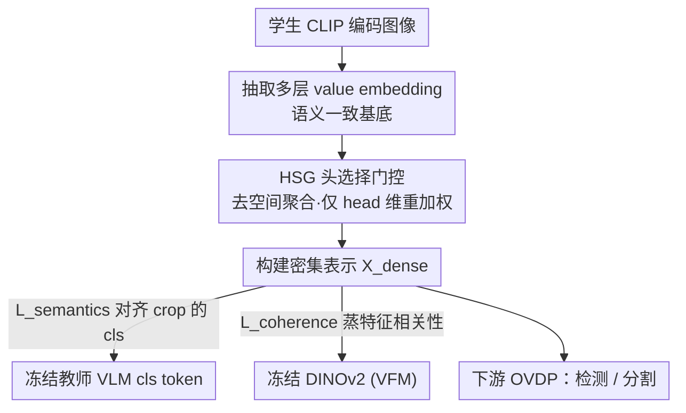

# Reconstructing CLIP for Open-Vocabulary Dense Perception

**会议**: CVPR 2026  
**论文**: [CVF Open Access](https://openaccess.thecvf.com/content/CVPR2026/html/Liu_Reconstructing_CLIP_for_Open-Vocabulary_Dense_Perception_CVPR_2026_paper.html)  
**代码**: 待确认  
**领域**: 多模态 VLM（开放词汇密集感知 / CLIP 自蒸馏）  
**关键词**: 开放词汇密集感知、CLIP、自蒸馏、value embedding、头选择门控

## 一句话总结
DenseRC 针对"如何为 CLIP 构建好的密集特征"这一被忽视的问题，揭示 cls token 的泛化语义其实来自多层 value embedding、而空间聚合会放大语义错位，于是用多层 value 作基底、配一个轻量的头选择门控（HSG）只在 head 维重加权，造出与全局语义对齐的密集表示，在开放词汇检测和分割多个基准上刷新 SOTA。

## 研究背景与动机

**领域现状**：CLIP 这类大规模视觉-语言模型（VLM）在零样本图像分类上很强，于是大家想把它迁到开放词汇密集感知（OVDP，含开放词汇检测 OVD 与分割 OVS），让模型在区域/像素级识别训练时没见过的任意类别。

**现有痛点**：CLIP 是为"全局图文对齐"优化的，其密集特征跨模态对齐弱、特征一致性差。现有两条路各有短板——① 用细粒度区域-文本监督重训 CLIP（如 FineCLIP 造 40M 区域-caption 对），但密集标注成本远高于图文对，难扩展；② 自蒸馏：用冻结 CLIP 的全局表示（cls token）当桥，去监督可训练的密集编码器，无需额外标注。自蒸馏更可扩展，但当前实现都不够好。

**核心矛盾**：自蒸馏要把学生的密集特征对齐到对应图像 crop 的冻结 cls token，因此**怎么构建密集特征**才是关键，但这一步一直没被认真研究。CLIPSelf 直接用 CLIP 最后一层空间输出，残差连接不可避免地注入噪声；DeCLIP 用 self-self 注意力聚合增强 patch 语义，但聚合会混进无关 patch（如天空区域）造成与 crop 教师之间的语义鸿沟；而特征一致性问题（同类内方差大、类间可分性低，尤其 stuff 区域）也没解决好。

**本文目标**：拆成两个子问题——（1）**抽什么特征**作密集基底；（2）**怎么构建**才能既判别又对齐。

**切入角度**：回到 cls token 内部去问"它到底编码了什么视觉语义"。把每层自注意力更新 $c^{(l)} = c^{(l-1)} + \text{Proj}(\text{Attn}^{(l)} \cdot v^{(l)})$ 沿所有层展开，发现最终 cls token 本质是在聚合多层 value embedding。这给"抽什么"一个有原则的答案；再沿空间维和 head 维拆解自注意力，从理论上分析"怎么构建"。

**核心 idea**：用多层 value embedding 作密集特征的语义一致基底，放弃会引入无关 patch 干扰的空间聚合、改用头选择门控（HSG）只在 head 维自适应重加权，再加一路从 DINOv2 蒸特征相关性的一致性约束——构建"与 cls 兼容"的密集表示。

## 方法详解

### 整体框架
DenseRC（Dense Representations Construction）是一个自蒸馏框架：学生 VLM 编码图像后，不再用最后一层空间输出，而是抽取多层 value embedding 作为密集特征的构建基底；这些 value 经头选择门控 HSG 在 head 维自适应重加权（不做任何空间聚合），构建出密集表示 $X_{dense}$；训练时一路用冻结教师 VLM 对图像 crop 的 cls token 做语义对齐（自蒸馏），另一路从冻结 DINOv2 蒸 patch 间特征相关性做一致性约束。最终直接用 DenseRC 替换下游管线里的 CLIP，无需改任何超参，即可服务开放词汇检测/分割。

### 关键设计

**1. 解构 cls token 语义来源：多层 value embedding 才是密集特征的一致基底**

针对"CLIPSelf 用最终空间输出被残差注噪"这个痛点，本文先回答"抽什么"。在 CLIP 的 ViT 里，cls token 每层经自注意力和 MLP 更新；由于 MLP 主要是 token 内变换，分析视觉信息来源时只保留注意力通路并改写为 $c^{(l)} \leftarrow c^{(l-1)} + A^{(l)}v^{(l)}$（$A^{(l)}$ 吸收注意力权重和投影参数）。沿全部 $L$ 层展开（去掉与数据无关的常量初始化 $c^{(0)}$）得到

$$c^{(L)} \leftarrow \sum_{l=1}^{L} A^{(l)} v^{(l)}$$

这说明最终 cls token 根本上是在聚合**多层 value embedding**。于是把学生的密集表示也设计成同样的聚合形式 $X_{dense} = \sum_{l=1}^{L} A_p^{(l)} \cdot v_p^{(l)}$，其中 $v_p^{(l)}$ 是 value 特征、$A_p^{(l)}$ 是构建模块。和直接拿最后一层空间特征（带残差噪声）或只取最后一层单一 value 相比，多层 value 提供了与全局语义最一致的基底（消融 Table 5 证实 multi-v 全面更优）。

**2. HSG 头选择门控：理论证明空间聚合必然放大对齐误差，改成只在 head 维重加权**

这是回答"怎么构建"的核心，针对"DeCLIP 空间聚合混进无关 patch 造成语义鸿沟"的痛点。把构建模块 $A_p$ 沿空间维和 head 维拆开分析：设教师对区域 $r$ 的目标表示 $c_r = \sum_l M^{(l)} v_r^{(l)} + \varepsilon_r$，对比两种策略——"空间-头融合(S)"会跨空间位置聚合 $\tilde{v}_r^{(S)} = \sum_j S_{rj} P v_j$，"仅头建模(H)"逐 patch 独立变换 $\tilde{v}_r^{(H)} = W v_r$。用 MSE 推导期望损失，空间聚合比纯头建模多出一个严格为正的干扰项

$$\Delta L = \sum_{j \in U_r} S_{rj}^2\, \mathbb{E}\|P v_j\|^2 > 0 \quad (\exists j \in U_r,\, S_{rj} \neq 0)$$

即只要空间聚合给区域无关的 off-target token 分了非零权重，就必然 $L^{(H)} < L^{(S)}$，对齐误差被放大。经验上（Fig.3）空间聚合还让少数主导 patch 吞掉大部分梯度（峰值幅度 ~10，均值仅 0.26），多数待优化 patch 几乎收不到监督；去掉空间聚合后梯度分布更均匀（均值 0.7），密集监督更稳。基于此，HSG 彻底放弃空间聚合，只在 head 维做门控：$v = W_v(\text{LN}(x)) \in \mathbb{R}^{H \times N \times (D/H)}$，$A_p = \sigma(W_H(\text{LN}(x))) \in \mathbb{R}^{N \times H}$，$\sigma$ 是 sigmoid，逐 head 产生门控权重；$W_H$ 是跨所有 Transformer 层共享的单层线性投影，几乎不加参数。这样做的依据是：实测各 head 在"对 cls 的跨模态语义贡献"和"局部性偏好（平均注意力距离）"上高度异质，统一聚合是次优的，必须显式按 head 重加权。

**3. 特征一致性蒸馏：从 DINOv2 蒸 patch 相关性，对单一特征流统一施约束**

光对齐语义还不够，密集表示的特征一致性（类内紧凑、类间可分，尤其 stuff 区域）也得管。DenseRC 从冻结的视觉基础模型 DINOv2 直接在密集特征上蒸 patch 间特征相关性，鼓励密集表示呈现类内紧凑、类间可分。和 DeCLIP 的关键区别在于：DeCLIP 把一致性损失（作用在解耦的注意力流）和密集对齐损失（作用在 value 流）分开施加在两条流上；DenseRC 则把两个约束统一加在**同一条**密集特征流 $X_{dense}$ 上，逼它同时拿到跨模态对齐和特征一致性。总目标为

$$L_{total} = L_{semantics} + \lambda\, L_{coherence}$$

$L_{semantics}$ 用余弦相似度对齐 RoIAlign 后的区域特征与教师 crop 的 cls token，$L_{coherence}$ 用 MSE 蒸 DINOv2 的特征相关性，$\lambda$ 是权衡系数（实验取 0.025 最优）。

### 损失函数 / 训练策略
在 COCO train2017 上做自蒸馏，4×A100、每卡 batch 4、训练 6 epoch、AdamW、学习率 $1\times10^{-5}$、weight decay 0.1。训练时每张图随机切成 $m \times n$ 网格（$m,n \in \{1,\dots,6\}$）做局部对齐蒸馏，输入 resize 到 1024×1024。$v_p$ 取最后三层 value embedding（经验最稳最准）。$\lambda = 0.025$。

## 实验关键数据

**自定义/关键指标说明**：**AP$^{Novel}_{50}$**=OV-COCO 新类在 IoU=0.5 下的 mAP；**mAP$_r$**=OV-LVIS 稀有类 mAP（IoU 0.5–0.95 平均）；**mIoU**=分割交并比；**mAcc**=区域零样本分类的 Top-1/Top-5 平均准确率。所有下游设定都只是把 CLIP 直接换成 DenseRC、不改任何超参。

### 主实验：开放词汇检测 / 分割（与 SOTA 对比）

| 任务/基准 | 指标 | CLIPSelf | DeCLIP（前 SOTA） | **DenseRC（本文）** |
|-----------|------|----------|------|------|
| OV-COCO（ViT-B/16） | AP$^{Novel}_{50}$ | 37.6 | 41.1 | **45.6**（+4.5） |
| OV-COCO（ViT-L/14） | AP$^{Novel}_{50}$ | 44.3 | 46.2 | **54.8** |
| OV-LVIS（ViT-B/16） | mAP$_r$ | 25.3 | 26.8 | **29.0**（+2.2） |
| OV-LVIS（ViT-L/14） | mAP$_r$ | 34.9 | 37.2 | **39.6** |
| OVSS A-150（ViT-B/16） | mIoU | 29.0 | 36.3 | **37.6** |
| OVSS PC-59（ViT-B/16） | mIoU | 58.0 | 60.6 | **61.3** |
| OVSS A-150（ViT-L/14） | mIoU | 34.5 | 40.7 | **41.5** |

区域零样本分类（ViT-B/16，无 RPN）上 DenseRC 的 Boxes Top1 76.7、Thing Masks 78.1、Stuff Masks 55.8，全面超过 R-SC-CLIPSelf（76.0 / 76.2 / 53.5）与 CLIPSelf。跨数据集迁移（LVIS 训练→直接测 COCO/Objects365）上 DenseRC 也一致领先（COCO AP 43.4 vs DeCLIP 41.0）。

### 消融：$v_p$ 基底 与 $A_p$ 构建模块（mAP@OV-COCO / mIoU@分割）

| 变体 | A-847 | PC-459 | A-150 | OV-COCO |
|------|-------|--------|-------|---------|
| $v_p$=x+v（最后层空间特征，CLIPSelf 式） | 15.2 | 21.7 | 36.6 | 41.3 |
| $v_p$=v（最后层单一 value，DeCLIP 式） | 15.4 | 22.1 | 36.7 | 41.9 |
| $v_p$=multi-v（多层 value，本文） | 15.7 | 22.3 | 37.2 | 44.4 |
| $A_p$=no attention | 15.7 | 22.3 | 37.2 | 44.4 |
| $A_p$=self attention（Q-K，原 CLIP） | 14.7 | 21.3 | 36.0 | 39.1 |
| $A_p$=self-self attention（Q-Q，DeCLIP） | 15.4 | 21.9 | 36.7 | 42.3 |
| $A_p$=HSG（本文） | **15.9** | **22.7** | **37.6** | **45.6** |

### 关键发现
- **空间聚合确实有害**：在 $A_p$ 上加任何空间聚合（self-attention 41.3→39.1、self-self 42.3）都比 no-attention 基线（44.4）更差，实证了 $\Delta L > 0$ 的理论；HSG（45.6）才是唯一带来正收益的设计。
- **多层 value 是涨点主力**：从 x+v（41.3）到 multi-v（44.4）在 OV-COCO 上 +3.1，验证"抽什么"比"怎么聚合"更关键。
- **层数与权重选择**：$v_p$ 取倒数三层最优（更早的层信噪比低、引入梯度干扰）；$\lambda=0.025$ 在各分割基准最稳；HSG 学到的 head 权重跨 2000 张样本高度一致，说明它刻画的是 head 的固有功能角色而非图像特异模式。

## 亮点与洞察
- **"先问 cls token 编码了什么、再决定抽什么"这套溯因思路很扎实**：把 cls 更新沿层展开得到"多层 value 聚合"这一结论，给密集基底选择一个有原则的答案，而非拍脑袋调特征。
- **用理论而非纯实验说"空间聚合不该要"**：$\Delta L = \sum_{j\in U_r} S_{rj}^2 \mathbb{E}\|Pv_j\|^2 > 0$ 这一项干净地指出空间聚合必然引入 off-target 干扰，结论可迁移到任何"区域级对齐"任务。
- **HSG 几乎零成本**：单层线性 + 跨层共享，却把"head 功能异质性"利用起来，是个很轻、易插拔的模块。
- **统一单流约束**比 DeCLIP 的双流分立更优雅——同一条密集特征同时担起对齐和一致性，避免两路目标互相打架。

## 局限与展望
- 一致性来源依赖外部 DINOv2，等于引入第二个基础模型；DINOv2 本身的偏置/失败模式会怎样传导到密集特征，论文未深究。⚠️ 换用其他 VFM 的鲁棒性缺独立实验。
- 理论分析为简化只推了单层 value、并假设小残差 $\varepsilon_r$，多层情形只说"直接推广、略去"，严格性略弱。
- HSG 只在 head 维建模、彻底弃用空间信息，对那些确实需要局部空间聚合的极端密集任务是否仍最优，未充分边界测试。
- 全部蒸馏只在 COCO 上做，更大规模/更多域的预训练数据下增益是否保持未验证。

## 相关工作与启发
- **vs CLIPSelf**：CLIPSelf 直接用 CLIP 最后层空间输出当密集特征，残差连接注入噪声；DenseRC 改用多层 value embedding 作干净基底，并去掉空间聚合。
- **vs DeCLIP**：DeCLIP 用 self-self 注意力做空间聚合（混入无关 patch、造语义鸿沟），且把一致性损失与对齐损失分施在两条解耦流上；DenseRC 理论证明空间聚合有害、改用 HSG 头门控，并把两约束统一加在单一特征流上，OV-COCO +4.5、OV-LVIS +2.2。
- **vs 区域监督重训（FineCLIP）**：后者造 40M 区域-caption 对重训 CLIP，成本高难扩展；DenseRC 走无额外标注的自蒸馏路线，更可扩展且效果更好。

## 评分
- 新颖性: ⭐⭐⭐⭐⭐ 把 cls token 展开成多层 value、再理论证明空间聚合有害并提 HSG，"抽什么+怎么构建"两问都给出有原则的新答案
- 实验充分度: ⭐⭐⭐⭐⭐ 区域分类/检测/分割/跨数据集迁移全覆盖，$v_p$/$A_p$/层数/$\lambda$ 消融完整
- 写作质量: ⭐⭐⭐⭐ 动机—分析—方法逻辑顺，理论与实证呼应；部分公式/图在 OCR 下有噪声、推导细节在附录
- 价值: ⭐⭐⭐⭐ 轻量即插即用、直接替换 CLIP 就涨点，对开放词汇检测/分割社区实用性强

<!-- RELATED:START -->

## 相关论文

- [\[CVPR 2026\] SynCLIP: Synonym-Coherent Language-Image Pretraining for Robust Open-Vocabulary Dense Perception](synclip_synonym-coherent_language-image_pretraining_for_robust_open-vocabulary_d.md)
- [\[CVPR 2026\] Vocabulary Scaling Law: Tuning Open-vocabulary Predictors for Their Openness](vocabulary_scaling_law_tuning_open-vocabulary_predictors_for_their_openness.md)
- [\[CVPR 2026\] Towards Open-Vocabulary Industrial Defect Understanding with a Large-Scale Multimodal Dataset](towards_open-vocabulary_industrial_defect_understanding_with_a_large-scale_multi.md)
- [\[CVPR 2026\] Reevaluating the Intra-Modal Misalignment Hypothesis in CLIP](reevaluating_the_intra-modal_misalignment_hypothesis_in_clip.md)
- [\[CVPR 2026\] IsoCLIP: Decomposing CLIP Projectors for Efficient Intra-modal Alignment](isoclip_decomposing_clip_projectors_for_efficient_intramodal_alignment.md)

<!-- RELATED:END -->
