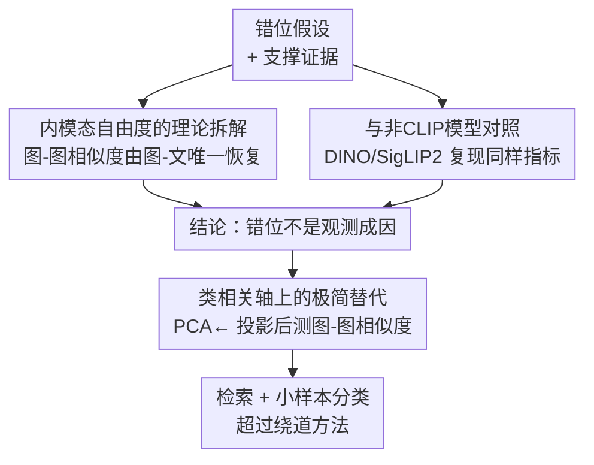

# Reevaluating the Intra-Modal Misalignment Hypothesis in CLIP

**会议**: CVPR 2026  
**论文**: [CVF Open Access](https://openaccess.thecvf.com/content/CVPR2026/html/Herzog_Reevaluating_the_Intra-Modal_Misalignment_Hypothesis_in_CLIP_CVPR_2026_paper.html)  
**代码**: [项目页](https://vision-kek.github.io/IsCLIP-Really-Misaligned)  
**领域**: 多模态VLM  
**关键词**: CLIP, 内模态对齐, 图像检索, 小样本分类, 表示几何

## 一句话总结
这篇论文系统反驳了"CLIP 图像嵌入存在内模态错位（intra-modal misalignment）"这一流行假设：从理论上证明图-图相似度其实被图-文相似度完全决定、并无自由度，从实证上用 DINO/SigLIP2 等非 CLIP 模型复现了所谓"错位指标"，说明这些指标是度量本身的产物而非 CLIP 训练目标的缺陷，最后用一个极简的 PCA 投影方法在检索和小样本分类上超过了那些"为修正错位而设计"的方法。

## 研究背景与动机

**领域现状**：CLIP 这类对比式语言-图像预训练把图像和文本嵌入到同一空间，用余弦相似度比较，撑起了开放词表零样本分类、检测、分割的半壁江山。但它最基础的用法——直接比较两张图的图像嵌入（图-图相似度，用于检索、小样本分类）——近年被一批工作质疑。

**现有痛点**：所谓"内模态错位假设"声称：CLIP 的对比损失只优化跨模态（图-文）对齐，完全忽略内模态（图-图）对齐，于是图像嵌入之间的距离"校准很差"。最常被引用的画面是 Fig. 1：某些猫的图像离一只狗比离另一只猫更近（$d_{\neq} < d_{=}$）。基于这个判断，Tip-X、OTI、CODER 等方法纷纷主张"不要直接比图-图相似度"，而要绕道用图-文相似度作桥梁（如把图像反演成一个伪文本 token）。

**核心矛盾**：作者指出这套叙事内部就有张力。一方面有大量工作只用 CLIP 图像编码器就在分类、生成、检索上拿到了强结果，甚至有报告说图-图检索比图-文检索更好——如果图像嵌入真的"严重错位"，这些结果无法解释。另一方面，支撑错位假设的两根支柱都站不稳：理论上的"自由度论证"和实证上的"错位指标"（余弦相似度直方图、模态间隙、检索/小样本性能）。

**本文目标**：逐一拆解这两根支柱——(1) 自由度论证是否真的成立？(2) 那些错位指标是否真的只在缺少内模态损失的模型上出现？(3) 那些绕道方法的性能提升，到底来自"修正错位"还是别的原因？

**切入角度**：一个关键的可控实验思路——把 CLIP 换成从未用语言监督训练过的纯视觉模型（DINO）或同时含图-图自监督的模型（SigLIP2）。如果同一个"错位指标"在这些模型上同样出现，那它就不可能是 CLIP "缺少内模态损失"造成的。

**核心 idea**：内模态相似度不是"自由漂浮"的，而是图-文结构的必然推论；所谓错位指标只是开放词表模型保留丰富语义/风格的正常表现，被误读成了缺陷。真正该做的不是"修正"图-图距离，而是在与任务相关的语义轴上去测量它。

## 方法详解

这是一篇分析/反驳型论文，"方法"指的是它**重新评估假设的研究设计**，而非提出新模型。作者沿用错位假设的三根支柱，对应设计了三路考察：理论拆解、可控实证对照、以及一个用来解释"绕道方法为何有效"的极简替代方法。

### 整体框架

整篇研究是一个"先证伪理论、再证伪指标、最后给出更简洁解释"的三段式论证链。输入是错位假设及其支撑证据，输出是"错位不是观测现象的成因"这一结论，以及一个不假设错位的简单方法 PCA←。

### 关键设计

**1. 内模态自由度的理论拆解：图-图相似度可被图-文相似度唯一恢复**

错位假设的理论根基（Fig. 4a-c）是：给定一张图到"猫"文本的固定距离 $r$，两张图像嵌入可以落在圆周上任意位置（既可能靠得很近、也可能很远），因此图-图距离存在"自由度"、可以被随意错位校准。作者指出这个论证的破绽在于它**把图像只锚定到单个文本**。一旦把锚点扩展到足够多的文本，自由度就消失了。

形式化地：在含 $n_T$ 个文本、$n_I$ 张图的预训练集中，给定固定的跨模态余弦相似度矩阵 $S_{inter}\in\mathbb{R}^{n_T\times n_I}$，是否还有空间容纳"错位"的内模态相似度 $S_{intra}\in\mathbb{R}^{n_I\times n_I}$？作者证明在 $d$ 维空间里，只需采样 $d$ 个文本锚点（行索引集 $J$，$|J|=d$），就能建立线性方程组唯一解出全部图像嵌入：

$$S_{inter}[J] = X_T[J]\cdot X_I^\top \;\Rightarrow\; X_I = (X_T[J])^{-1}\cdot S_{inter}[J]$$

由于 $X_T$ 每行是唯一的单位向量，采样至少 $d$ 个文本就保证 $X_T[J]$ 可逆；而 $n_T, n_I \gg d$，所需锚点数其实很少。于是 $S_{intra} = X_I X_I^\top$ 被完全确定，没有任何剩余自由度。换句话说，图-图结构不是任意的，而是"学到的图-文结构"的直接推论——这从根上否定了"对比损失只管跨模态、内模态可随意漂"的前提。（作者在附录 A 还给出不依赖固定文本锚点的版本，因为现实中并不存在这种理想锚点。）

**2. 与非 CLIP 模型对照：错位指标是度量的产物，不是训练目标的缺陷**

错位假设的第二根支柱是一组实证指标：按类别画的余弦相似度直方图（同类对 vs 异类对，若重叠大则说"类区分差"）、按模态画的直方图（图-图相似度明显高于图-文，被认为是"模态间隙"问题）、以及检索/小样本性能。作者的核心招式是**模型替换做对照**：把只有跨模态损失的模型（CLIP、SigLIP）与含图-图自监督的模型（DINO、SigLIP2）放在一起测同样的指标。逻辑很干净——如果某个指标真是"缺少内模态损失"造成的，那它应该在 SigLIP2 上被"修好"。

结果（Fig. 5、Tab. 2）显示这些指标在 SigLIP 和 SigLIP2 之间几乎无法区分：同类/异类直方图的高重叠、图-文与图-图分布的分离，两个模型都一样存在。这说明它们是开放词表预训练编码器的正常属性（类内方差大，是因为模型保留了超出窄数据集标签的语义和风格），而非纯文本-图像训练带来的错位。更关键的是，这些"错位信号"在从未见过语言监督的 DINO 上同样出现——这直接证明它们是**度量本身的伪影**，与训练目标无关。

**3. PCA←：在类相关轴上测相似度的极简替代，解释绕道方法为何有效**

OTI 这类方法把图像反演成"a photo of $v^*$"里的一个伪文本 token（通过反传调 $v^*$ 去逼近图像嵌入），声称这样能绕过内模态错位。作者给出另一种解释：它之所以有效，仅仅是因为它**强迫图像信息坍缩到一个词级 token**，相当于在问"用一个单词最能描述这张图的是什么？"，而这个词往往强相关于测试集的待预测类别。

基于这个洞察，作者提出用一步线性投影替代整个反演过程：取 $n$ 个 ImageNet 类名，生成 "a photo of x" 文本嵌入，做 PCA 取解释方差最大的前 $d/2$ 个主成分，把所有测试图像嵌入投影到这个子空间，再在子空间里测图-图余弦相似度，记作 PCA←。注意它**与下游数据集无关**（一律用 ImageNet 类名），却能起到"只保留图像最主要概念、丢掉背景细节"的效果。这既验证了"绕道方法的增益来自聚焦主导概念"这一论断，也提供了一个不假设任何错位的简单基线。

### 损失函数 / 训练策略
本文不训练新模型，所有实验均在冻结的预训练编码器（CLIP/SigLIP/SigLIP2/SLIP/DINOv2/DINOv3，多为 ViT-B）上做。PCA← 只需一次离线 PCA，无梯度训练；小样本分类用原型（类均值）或 LDA 分类器，检索用 mAP。

## 实验关键数据

### 主实验

**Dogs vs Cats 预备实验（Tab. 1）**：复现 OTI 用来"证明 CLIP 错位"的简单实验。若 CLIP 真有图-图错位，换成公认顶级的纯视觉编码器 DINO 应该更好——但事实相反，CLIP 反而最高，说明低指标不是 CLIP 的弱点（更不是错位），而是任务表述的歧义性所致（两张相反标签的图可能在其它概念上确实相似）。

| 模型 | 检索 I-I | 分类 I-I (1-shot) | 分类 I-I (16-shot) |
|------|---------|-------------------|--------------------|
| CLIP ViT-B/16 | **87.1** | **84.2** | **99.7** |
| DINOv2 ViT-B/14 | 81.8 | 76.2 | 97.3 |
| DINOv3 ViT-L/16 | 84.3 | 80.2 | 97.8 |

**纯图像小样本分类（Tab. 2，11 数据集平均）**：不用任何文本提示，只靠图-图相似度，直接检验图像嵌入的内在对齐质量。括号内为 PCA← 投影后结果。

| 模型 | 分类器 | 1-shot | 4-shot | 16-shot |
|------|--------|--------|--------|---------|
| CLIP | Prototype | 43.4 (50.7) | 63.8 (69.7) | 73.5 (77.5) |
| SigLIP（仅跨模态） | Prototype | 57.3 (62.1) | 76.3 (78.5) | 82.5 (83.7) |
| SigLIP2（跨+内模态） | Prototype | 58.0 (63.4) | 77.0 (79.4) | 83.0 (84.5) |
| DINOv2（纯图像） | Prototype | 59.6 | 71.8 | 78.2 |
| SigLIP | LDA | 2.3 | 79.0 | 85.3 |
| SigLIP2 | LDA | 2.3 | 80.5 | **86.5** |
| DINOv2 | LDA | 2.3 | 75.3 | 83.3 |

关键点：纯跨模态训练的 SigLIP 在图-图相似度分类上**超过**纯图像的 DINOv2，且这一排序在不同分类器下一致——纯语言-图像训练完全能产出"对齐到足以打败强视觉编码器"的图像嵌入。

**图-图检索（Tab. 3，13 数据集 mAP 平均）**：PCA← 在所有模型、所有数据集上一致超过 OTI。

| 模型 | Original ⟨I,I⟩ | OTI ⟨T,I⟩ | PCA← ⟨I←,I←⟩ |
|------|----------------|-----------|---------------|
| CLIP B/32 | 41.6 | 42.9 | **49.0** |
| CLIP L/14 | 53.7 | 57.0 | **61.3** |
| SigLIP B/16 | 57.2 | 60.0 | **62.8** |
| SLIP B/16 | 35.6 | 35.7 | **39.4** |
| SigLIP2 B/16 | 58.6 | — | **64.4** |
| DINOv3 L/16（参考上限） | 70.8 | — | — |

### 消融实验

| 配置 | 关键发现 | 说明 |
|------|---------|------|
| SigLIP vs SigLIP2（检索） | 仅差 1.2 mAP | SigLIP2 的图-图自监督并未带来"修正错位"式的大幅提升，只是版本演进的正常进步 |
| PCA← 增益（SigLIP vs SigLIP2） | 5.6 vs 5.8 mAP | 投影帮助的幅度在含/不含内模态损失的模型上相当，说明增益与"是否有内模态训练"无关 |
| PCA← on BDD100k | weather −2.3% mAP、time −1.0% mAP | 当数据集标签**不**对应图像主导概念（天气/时段需要背景信息）时，PCA← 反而掉点 |

### 关键发现
- **指标在非 CLIP 模型上同样出现**是全文最有力的反证：直方图重叠、模态间隙在 DINO、SigLIP2 上都在，故它们不可能源自"CLIP 缺少内模态损失"。
- **PCA← 只在"标签=主导概念"时有效**：BDD100k 的掉点证明它带来的增益来自"丢掉非主导信息"，而不是"修复了某种普遍的错位"——这恰好支持"错位不存在、问题是任务歧义"的解释。
- **模态间隙不是问题**：作者引多篇工作指出缩小间隙往往不带来一致提升、且理论上精确模态对齐对下游预测本就次优，因此图、文嵌入分处两个流形是合理而非有害的。

## 亮点与洞察
- **"模型替换做对照"是极其干净的因果隔离工具**：把"是否缺内模态损失"作为唯一变量，用 DINO/SigLIP2 当对照组，一举把"指标 = 训练缺陷"的因果链切断。这种思路可迁移到任何"某现象被归因于某训练目标缺失"的争论中。
- **理论部分的线性代数论证很漂亮**：用"$d$ 个文本锚点即可唯一解出全部图像嵌入"把"自由度"这个直觉性论证彻底证伪，从单锚点扩展到多锚点这一步是整个反驳的关键转折。
- **把别人复杂方法的有效性"降维解释"**：OTI 用反传调 token，作者一句"它只是把图像坍缩成一个最具描述性的词"就点破本质，并用一步 PCA 投影复现甚至超越——既是反驳也是更简洁的工程方案。
- **诚实的边界声明**："严格说我们没有证伪假设的存在性，只证明了过去当作证据的东西不能作为证据"——这种克制的论证逻辑（类比已有反驳范式）比号称"彻底推翻"更可信。

## 局限与展望
- **作者承认未证伪假设本身**：实验只证明错位不是观测趋势的成因，不能证明错位不可能存在；不同前作对假设的表述各异，作者选择逐条评估而非整体证伪。
- **只评估检索和小样本分类两类任务**：分割、深度估计、VQA 等未测（理由是这些任务的文献从未提及错位问题），PCA← 也不被期望对它们有用——适用范围相对窄。
- **跨模型比较的混淆因素**：SigLIP 超过 DINOv2 这类结论受训练数据不同影响，作者也明确不能据此对"损失函数本身"的影响下定论，只能说"反正没看到错位的证据"。
- **PCA← 是诊断工具而非通用方法**：它依赖"数据集标签对应图像主导概念"这一前提，BDD100k 已暴露其在多语义任务上的退化，作者自己也不建议把这些歧义检索集当作通用基准。

## 相关工作与启发
- **vs OTI（Mistretta et al. [26]）**：OTI 假设只有图-文对齐、需把图像反演成伪文本 token 来绕过图-图错位；本文证明图-图相似度本就由图-文唯一决定、无需反演，并用 PCA← 一步投影在全部模型/数据集上超过 OTI，区别在于"承认 vs 否认错位存在"。
- **vs Tip-X / CODER（Udandarao et al. [40] / Chao et al. [44]）**：它们为规避内模态错位而避免使用图-图相似度；本文实验显示这些方法打不过直接在图像空间做判别的 APE 特征选择或基础 LDA，说明"避开图-图相似度"是不必要的。
- **vs Barbier et al. [2]**：他们通过把余弦相似度分布归一化到相同均值方差来改善小样本检测；本文把这类"分布校准"现象也纳入"指标伪影"的统一解释。
- **vs 模态间隙系列（Mind/Mitigate/Cross/Bridging the Gap）**：这些工作把模态间隙当问题去缩小；本文结合 Qian、Jiang 等理论结果论证精确对齐本就次优，主张应"利用"而非"绕过"预训练的内模态几何。

## 评分
- 新颖性: ⭐⭐⭐⭐ 不提新模型，但用理论+可控对照系统性反驳一个流行假设，视角和论证都很新。
- 实验充分度: ⭐⭐⭐⭐ 覆盖 6 个模型、13 个数据集、检索+小样本两类任务，含跨模型对照与 BDD100k 反例消融，证据链完整。
- 写作质量: ⭐⭐⭐⭐⭐ 论证结构清晰（理论→指标→替代方法），对自身结论边界诚实克制，反驳逻辑严谨。
- 价值: ⭐⭐⭐⭐ 直接影响所有用 CLIP/SigLIP 比较图像嵌入的方法，提醒社区别为不存在的问题打补丁，实践指导性强。

<!-- RELATED:START -->

## 相关论文

- [\[CVPR 2026\] IsoCLIP: Decomposing CLIP Projectors for Efficient Intra-modal Alignment](isoclip_decomposing_clip_projectors_for_efficient_intramodal_alignment.md)
- [\[CVPR 2026\] Reconstructing CLIP for Open-Vocabulary Dense Perception](reconstructing_clip_for_open-vocabulary_dense_perception.md)
- [\[AAAI 2026\] Rethinking Visual Token Reduction in LVLMs under Cross-Modal Misalignment](../../AAAI2026/multimodal_vlm/rethinking_visual_token_reduction_in_lvlms_under_cross-modal_misalignment.md)
- [\[CVPR 2026\] CAPT: Confusion-Aware Prompt Tuning for Reducing Vision-Language Misalignment](capt_confusion-aware_prompt_tuning_for_reducing_vision-language_misalignment.md)
- [\[CVPR 2026\] CLIP-like Model as a Foundational Density Ratio Estimator](clip-like_model_as_a_foundational_density_ratio_estimator.md)

<!-- RELATED:END -->
