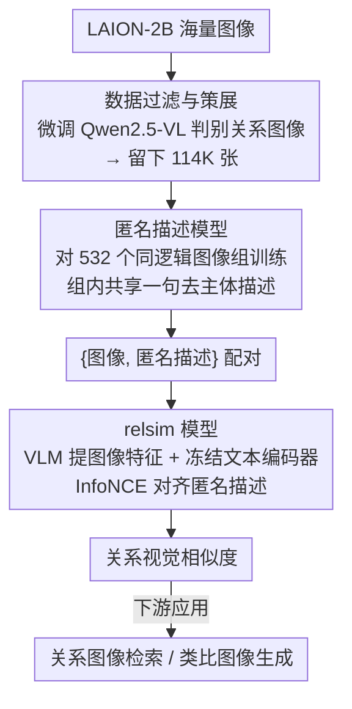

# Relational Visual Similarity

**会议**: CVPR 2026  
**arXiv**: [2512.07833](https://arxiv.org/abs/2512.07833)  
**代码**: [https://thaoshibe.github.io/relsim](https://thaoshibe.github.io/relsim)  
**领域**: 多模态VLM  
**关键词**: 关系相似度, 视觉类比, 匿名描述, 认知科学, 图像检索

## 一句话总结
本文首次形式化定义关系视觉相似度问题（两图像间的内在关系/功能对应，而非表面属性相似），构建114K匿名描述数据集并训练relsim模型，揭示了现有相似度指标（CLIP/DINO等）在捕捉关系相似度方面的根本性缺陷。

## 研究背景与动机
1. **领域现状**：视觉相似度是计算机视觉的基础能力。现有方法（LPIPS、CLIP、DINO等）专注于属性相似度——像素级、语义级或描述级的匹配。
2. **现有痛点**：这些方法无法识别关系相似度——例如，火柴的燃烧阶段与香蕉的成熟阶段具有相同的"时间渐变"逻辑，但它们在属性上完全不同。
3. **核心矛盾**：认知科学认为属性相似度和关系相似度是人类感知的两大核心支柱，但视觉计算完全忽略了后者。关系相似度被认为是区分人类与其他物种的关键认知能力。
4. **本文目标**：将关系视觉相似度形式化为可测量的问题，并构建能捕捉关系结构的模型。
5. **切入角度**：受认知科学启发——人类通过语言或先验知识进行概念抽象来识别关系相似度。因此引入"匿名描述"（描述内在逻辑而非具体对象）作为连接关系相似图像的纽带。
6. **核心idea**：定义匿名描述（如"时间推移下{主体}的变化"），训练模型生成匿名描述，再用这些描述将具有相同关系逻辑的图像拉近。

## 方法详解

### 整体框架
论文要解决的是：让模型学会按"关系逻辑"而非"表面属性"判断两张图像像不像——火柴燃烧和香蕉成熟都是"随时间渐变"，属性上毫无关系，但内在结构同构。难点在于关系是抽象的，没法直接从像素或语义标签里读出来，于是作者借了认知科学的一个观察：人靠语言把图像抽象成概念后才能比关系。整条 pipeline 就把这个"语言中介"做成了三步：先从 LAION-2B 海量图里筛出真正承载关系结构的 114K 张，再训一个模型给每张图写一句"匿名描述"（只讲关系逻辑、不提具体物体），最后用这些匿名描述作监督把关系同构的图像在表示空间里拉到一起，得到 relsim 模型。

### 关键设计

**1. 数据过滤与策展：先把"没有关系可言"的图剔掉**

LAION-2B 里绝大多数是产品照、自拍这类关系无信息的图像，直接拿来训会把噪声当信号。作者因此先做一轮过滤：用 1.3K 正例 + 11K 负例人工标注微调一个 Qwen2.5-VL 判别器（"这张图里有没有可迁移的关系模式/结构？"），它与人工判断有 93% 一致，再扫一遍 LAION-2B，筛出那些可能承载时间序列、结构类比、功能对应等关系模式的图像，最终得到 114K 张。这一步决定了后面学到的"关系"是否成立——如果数据里压根没有同构关系，对比学习只能退化回属性匹配。

**2. 匿名描述模型：用一句"去掉主体的话"把关系显式写出来**

关系相似度的核心矛盾是它藏在概念层、没法直接对齐，于是作者训练一个专门的描述模型，输入图像、输出一句**匿名描述**——刻意不提任何可见的具体对象，只保留图像传达的关系逻辑。比如一张火柴燃烧的图，匿名描述是 "transformation of {subject} over time" 而不是 "burning matchsticks"。把主体抽象成占位符 `{subject}` 之后，火柴燃烧和香蕉成熟会落到同一句描述上，这句描述就成了连接两张关系同构图像的"胶水"。

这里的关键训练技巧是：单看一张图很难写出它的关系逻辑（哪些细节该忽略、哪些才是结构并不显然），但把一组共享同一逻辑的图放在一起，结构立刻浮现。作者因此手工策划了 **532 个图像组**（每组 2-10 张同逻辑图像），把整组喂给冻结的 VLM 让它产出**一句**匿名描述，经人工核验后**赋给组内每一张图**，再用这些 {图像组, 描述} 样本微调描述模型。训练好后把它应用到上一步的 114K 张图上，逐张打上匿名描述，得到 {图像, 匿名描述} 数据集。这正是把认知科学"关系相似需要概念抽象"的说法落地成可计算信号的关键一步。

**3. relsim 模型：以 VLM 为骨干、用匿名描述做对比监督**

标准的视觉-语言对比学习（如 CLIP）拉近的是图像和它**具体描述**的匹配，所以天然偏向属性相似度。relsim 把监督信号换成上一步生成的匿名描述：图像编码器 $f_V$ 与冻结文本编码器 $f_T$（all-MiniLM）分别编码图像和它的匿名描述，用 InfoNCE 对比损失拉近"图像-匿名描述"配对、推远批内其余组合，使得匿名描述相同（即关系抽象相同）的图像在特征空间里更接近。

但 relsim 不只是"换掉描述"这一处改动——更关键的是**换掉了骨干**。作者发现纯视觉编码器（CLIP/DINO 这类）即便重训也学不好关系相似度，因为它们的表示天生强调视觉属性，会和关系理解打架；而关系推理需要的高层语义与世界知识，恰恰是大语言模型里现成就有的。因此作者把视觉提取器 $f_V$ 选为一个 **VLM（Qwen2.5-VL-7B）**：在图像末尾追加一个可学习的 query token 一起送入 LLM，取该 token 在最后一层的特征作为关系特征，并以 LoRA 微调。正是"VLM 骨干 + 匿名描述监督"两处一起，才把优化方向从"长得像"扭转到"逻辑像"。

### 损失函数 / 训练策略
沿用标准视觉-语言对比学习损失，唯一区别是把常规描述替换成匿名描述作为正样本配对。

## 实验关键数据

### 主实验

| 模型 | 属性相似度 | 关系相似度 | 说明 |
|------|----------|----------|------|
| CLIP | 高 | 低 | 仅捕捉属性 |
| DINO | 高 | 低 | 仅捕捉属性 |
| LPIPS | 高 | 极低 | 像素级 |
| relsim | 中高 | 高 | 关系感知 |

### 消融实验

| 配置 | 关键指标 | 说明 |
|------|---------|------|
| Full relsim | 最优 | 匿名描述训练 |
| 常规描述训练 | 关系相似度差 | 属性描述无法编码关系 |
| w/o 数据过滤 | 下降 | 噪声数据干扰 |

### 关键发现
- 所有主流视觉相似度指标在关系相似度上都表现很差，揭示了视觉计算的关键盲区。
- 匿名描述是连接关系相似图像的有效中介。
- relsim在关系图像检索和类比图像生成等应用中展示了实用价值。

## 亮点与洞察
- **开辟了一个全新的视觉理解维度**：从属性到关系的转变是概念层面的突破。
- **匿名描述**是一个非常优雅的概念：去掉具体对象只保留抽象逻辑。
- 认知科学与计算机视觉的跨学科结合值得关注。

## 局限与展望
- 关系相似度的评估本身缺乏明确的ground truth，主观性较强。
- 匿名描述的生成质量仍有提升空间。
- 未来可探索在推理和创意生成中的更多应用。

## 相关工作与启发
- **vs CLIP/DINO**: 专注于属性级别的语义匹配，无法捕捉关系相似度。relsim通过匿名描述训练填补了这一空白。
- **vs NIGHTS**: 关注中层感知相似度，仍是属性驱动的。

## 评分
- 新颖性: ⭐⭐⭐⭐⭐ 全新问题定义，跨学科视角独特
- 实验充分度: ⭐⭐⭐⭐ 多模型对比+应用展示，但缺少大规模用户研究
- 写作质量: ⭐⭐⭐⭐⭐ 叙事引人入胜，认知科学背景丰富
- 价值: ⭐⭐⭐⭐⭐ 揭示了视觉AI的根本性盲区，影响深远

<!-- RELATED:START -->

## 相关论文

- [\[ICML 2026\] Gated Relational Alignment via Confidence-based Distillation for Efficient VLMs](../../ICML2026/multimodal_vlm/gated_relational_alignment_via_confidence-based_distillation_for_efficient_vlms.md)
- [\[ACL 2026\] Structured and Abstractive Reasoning on Multi-modal Relational Knowledge Images](../../ACL2026/multimodal_vlm/structured_and_abstractive_reasoning_on_multi-modal_relational_knowledge_images.md)
- [\[CVPR 2026\] Similarity-as-Evidence: Calibrating Overconfident VLMs for Interpretable and Label-Efficient Medical Active Learning](similarity-as-evidence_calibrating_overconfident_vlms_for_interpretable_and_labe.md)
- [\[AAAI 2026\] The Triangle of Similarity: A Multi-Faceted Framework for Comparing Neural Network Representations](../../AAAI2026/multimodal_vlm/the_triangle_of_similarity_a_multi-faceted_framework_for_comparing_neural_networ.md)
- [\[CVPR 2026\] VQ-VA World: Towards High-Quality Visual Question-Visual Answering](vq-va_world_towards_high-quality_visual_question-visual_answering.md)

<!-- RELATED:END -->
