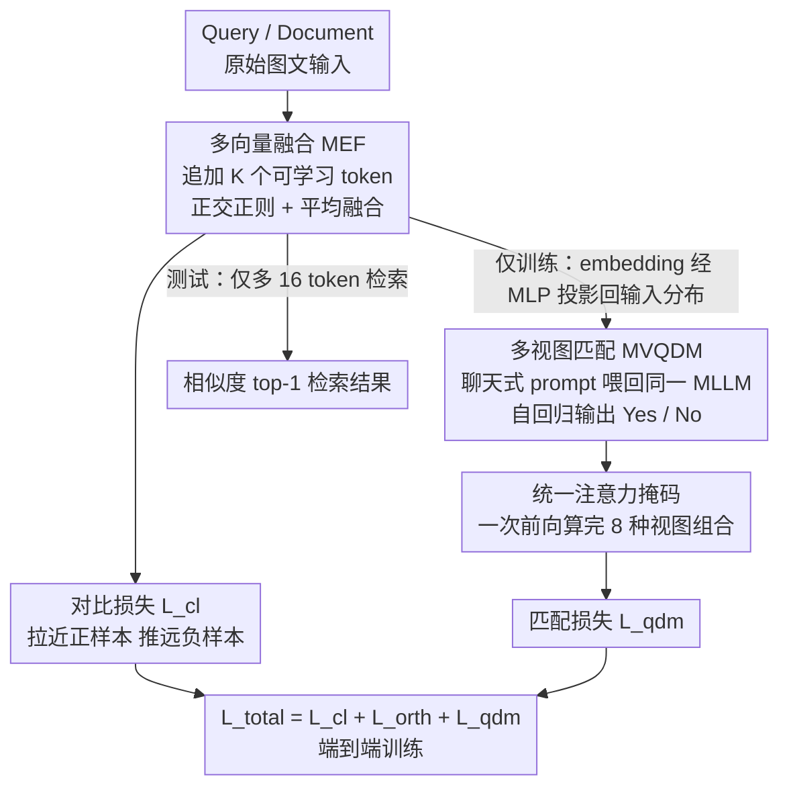

# ReMatch: Boosting Representation through Matching for Multimodal Retrieval

**会议**: CVPR 2026  
**论文**: [CVF Open Access](https://openaccess.thecvf.com/content/CVPR2026/html/Liu_ReMatch_Boosting_Representation_through_Matching_for_Multimodal_Retrieval_CVPR_2026_paper.html)  
**代码**: https://github.com/FireRedTeam/ReMatch  
**领域**: 多模态VLM  
**关键词**: 多模态检索, MLLM embedding, 生成式匹配, 可学习 token, 对比学习  

## 一句话总结
ReMatch 把多模态大模型（MLLM）当 embedding 模型微调时，额外挂上一个「聊天式 Yes/No 匹配」任务和「多可学习 token」表示，让生成能力反过来给检索 embedding 提供逐样本判别信号，在 MMEB 上刷新 SOTA，且推理几乎不增加成本。

## 研究背景与动机
**领域现状**：多模态检索（图搜文、文搜图、视觉问答、视觉定位）依赖把异构输入映射到同一表示空间。CLIP/BLIP/SigLIP 这类双编码器是主流，但跨模态交互浅；近年大家转向 MLLM，把 query 和 document 喂进去后，取最后一层 `[EOS]`（或末 token）的隐状态当 embedding，再用对比学习（InfoNCE）拉近正样本、推远负样本。VLM2Vec 是这一范式的代表。

**现有痛点**：把 MLLM 当成「单向量编码器」其实是浪费。论文指出两个具体问题：（1）`[EOS]` 的最后一层隐状态在预训练里是**为预测词表 logits 服务的**，并不天然保存语义结构；把整个 query/document 压进这一个向量，对图像这种高维模态尤其装不下细粒度信息，还会破坏 MLLM 原有的细粒度 grounding（图 1 的注意力图显示 VLM2Vec 把这种对齐打散了）。（2）只用一个全局对比损失，优化的是 embedding 之间的整体距离，难以捕捉模态间的细对应，也会削弱预训练时学到的视觉-语言**组合推理**能力。

**核心矛盾**：MLLM 的强项是「自回归生成 + 组合推理 + 世界知识」，可现有做法把它阉割成一个静态编码器，生成能力完全没用上；而对比损失对 hard negative 的梯度又偏弱，存在负采样偏置。

**本文目标**：在不抛弃对比学习、也不显著增加推理成本的前提下，把 MLLM 的生成判别能力重新激活，喂回 embedding 学习。

**切入角度**：既然同一个 MLLM 本来就会做「这段文本和这张图相关吗」的判断，那就让它在训练时**用聊天的方式自回归地输出 Yes/No**，把这种逐实例的判别信号当成对比损失的补充；同时用多个可学习 token 替代单个 `[EOS]`，把信息摊开存。

**核心 idea**：用「生成式匹配 + 多 token 表示」两件事，把 MLLM 的生成天性和检索 embedding 端到端拧在一起训练——matching 阶段只在训练时跑，测试时只多 16 个 token，几乎零额外开销。

## 方法详解

### 整体框架
ReMatch 仍然是「输入 → MLLM → embedding → 相似度检索」的检索框架，但在训练时对单向量范式做了两处改造，并叠加一个只在训练用的匹配分支。具体地：每个输入（query 或 document）先追加 $K$ 个可学习 token，取这些 token 位置的末层隐状态得到一组多向量表示，经正交正则后**平均融合**成一个 embedding，由对比损失监督（这是 **MEF**）。同时，原始 query–document 对连同它们各自的 embedding（经一个 MLP 投影回 MLLM 输入分布）被拼成聊天式 prompt 再喂回**同一个** MLLM，训练它自回归输出 "Yes"/"No"，提供逐样本的相对相关性监督（这是 **MVQDM**）。为了让一次前向就算完 8 种 query/document 视图组合，作者设计了**统一注意力掩码**。三个损失 $\mathcal{L}=\mathcal{L}_{cl}+w_{orth}\mathcal{L}_{orth}+w_{qdm}\mathcal{L}_{qdm}$ 端到端联合优化（$w_{orth}=0.5$，$w_{qdm}=0.1$）。

### 关键设计

**1. 多向量融合 MEF：用多个可学习 token 替代单个 `[EOS]`，把信息摊开存**

针对「单个 `[EOS]` 向量装不下细粒度信息、还破坏预训练 grounding」的痛点。作者给每个输入序列追加 $K$ 个可学习 token（query 用 $L_q\in\mathbb{R}^{K\times d}$，document 用 $L_d\in\mathbb{R}^{K\times d}$），这些 token 独立于 MLLM 词表学习，从而与生成输出解耦。Transformer 消费 $z^{(0)}=[m;L_q;L_d]$，在这些 token 位置取末层隐状态得到多向量表示 $ME_q=[e_1,\dots,e_K]$。问题是这 $K$ 个 token 容易塌缩到同一方向、携带重复信息，所以作者加了**软正交约束**：把硬约束 $e_i^\top e_j=0$ 换成对成对内积的可微惩罚，先做 L2 归一化 $\tilde e_i=e_i/\lVert e_i\rVert_2$，再惩罚

$$\mathcal{L}_{orth}=\frac{2}{K(K-1)}\sum_{1\le i<j\le K}\left(\tilde e_i^\top \tilde e_j\right)^2.$$

正则后用简单平均 $E^*=\frac{1}{K}\sum_{i=1}^K e_i$ 把多向量融成一个 embedding 喂给对比损失。关键好处是：测试时这只比单向量基线多 $K$（实验取 16）个 token，开销与 VLM2Vec 相当，却保住了多 token 的细粒度表达力——这正是它和 MetaEmbed 那类 ColBERT 式 late-interaction 多向量方法（推理开销大）的区别。消融显示，只平均不正交时增益在 +0.3~+0.5% 间波动；加上正交正则后增益**单调上升**，$K{=}64$ 时达 +0.9%，说明多样性约束是把多 token 用好的关键。

**2. 多视图 Query–Document 匹配 MVQDM：让同一个 MLLM 聊天式地判 Yes/No，给检索补逐样本判别信号**

针对「只用全局对比损失、细对应弱、hard negative 梯度不足」的痛点。每条训练样本是三元组 $(q_i,d_i^+,d_i^-)$，对比损失 $\mathcal{L}_{cl}$ 形式仍是标准 InfoNCE（含 in-batch 负样本），相似度 $\Phi(a,b)=\exp(\cos(a,b)/\tau)$。MVQDM 在此之上加生成式判别：把 query–document 对填进一个聊天模板（"判断 `<DOC>` 是否与 `<QUERY>` 相关，只回答 Yes 或 No"），训练 MLLM 自回归生成相关性标签，损失为

$$\mathcal{L}_{qdm}=-\log p\big(l\mid P(\tilde q,\tilde d)\big),$$

正样本 $d^+$ 的标签 $l$ 为 "Yes"，负样本为 "No"。和 BLIP 那种「喂原始对 + 外接二分类头」不同，这里是端到端让 MLLM **自己生成** Yes/No token，复用其生成式预训练范式。更关键的是「多视图」：$\tilde q,\tilde d$ 既可以是原始数据 $(q,d)$，也可以是 embedding 经轻量 MLP 投影回输入分布的 $Z^*=\mathrm{MLP}(E^*)$。这样模型既能从 embedding 抓细粒度信号、又能从原始数据抓全局上下文，还顺带逼着 embedding 变得「能被同一个 MLLM 读懂」。消融证实 `Raw/Feat↔Raw/Feat` 全组合视图比任何单视图都好（+0.5%），而只用 `Feat↔Feat` 也只差 0.1%，说明投影后的 embedding 信息量很高——这也提供了一个省算力的轻量版本（只喂 token 级 embedding、省掉原始数据）。这个匹配信号给 hard negative 提供更强梯度，缓解负采样偏置。

**3. 统一注意力掩码：一次前向算完 8 种视图组合，把多视图匹配的开销压下去**

针对「多视图 × 多相关性判断会带来多次 MLLM 前向、训练太贵」的工程痛点。每条样本采一个正 $d^+$ 一个负 $d^-$，配上各自的投影 embedding，共有 $\{q,Z_q\}\times(\{d^+,Z_{d^+}\}+\{d^-,Z_{d^-}\})$ 即 $2\times(2+2)=8$ 种组合。作者设计统一注意力掩码，让每个 answer token **只**注意它对应的那一对 query–document 输入（原始 + 投影）和指令 prompt，从而在**单次前向**里同时算完 8 种组合，且保持标准的 next-token 预测行为。为防位置泄漏相关性信号，把 $d^+$ 随机放进 $d_1,d_2$ 两个槽位之一。这一设计是 MVQDM 能落地的前提：没有它，多视图匹配的算力会随组合数线性爆炸。

### 损失函数 / 训练策略
端到端联合优化三项：$\mathcal{L}=\mathcal{L}_{cl}+w_{orth}\mathcal{L}_{orth}+w_{qdm}\mathcal{L}_{qdm}$，权重固定 $w_{orth}=0.5$、$w_{qdm}=0.1$。在 8×H800 上训 2500 步，global batch 1024；用 LoRA（$r{=}32$，$\alpha{=}64$），学习率 $10^{-4}$ 余弦衰减，对比温度固定 0.02；只用 MMEB-train + 一个显式 hard negative；引入正向 target prompt 解耦任务、稳训练。

## 实验关键数据

### 主实验（MMEB，Hit@1 %）
MMEB 含 36 个任务，覆盖分类(CLS)、视觉问答(VQA)、检索(RET)、视觉定位(VG)四类。ReMatch 在各档模型尺寸上都拿到最优总分。

| 模型 | Backbone | Size | CLS | VQA | RET | VG | Overall |
|------|----------|------|-----|-----|-----|-----|---------|
| VLM2Vec | Qwen2-VL | 2B | 59.0 | 49.4 | 65.4 | 73.4 | 59.3 |
| B3++ | Qwen2-VL | 2B | 67.0 | 61.2 | 70.9 | 79.9 | 68.1 |
| **ReMatch** | Qwen2-VL | 2B | 65.8 | 65.9 | 70.1 | 83.3 | **69.2** |
| MoCa | Qwen2.5-VL | 3B | 59.8 | 62.9 | 70.6 | 88.6 | 67.5 |
| **ReMatch** | Qwen2.5-VL | 3B | 62.4 | 69.6 | 70.0 | 92.0 | **70.2** |
| QQMM | LLaVA-OV | 7B | 69.9 | 70.0 | 72.1 | 86.0 | 72.5 |
| mmE5 | Llama-3.2-V | 11B | 67.6 | 62.7 | 71.0 | 89.7 | 69.8 |
| **ReMatch** | Qwen2.5-VL | 7B | 65.8 | 73.6 | 74.1 | 92.5 | **73.7** |

相比同尺寸次优方法分别 +1.1%(B3++-2B)、+2.7%(MoCa-3B)、+1.2%(QQMM-7B)；相比基线 VLM2Vec，2B/7B 各 +9.9%/+10.4%。VQA 任务涨得最猛（2B +4.7%、7B +3.6%），印证「生成式匹配把 MLLM 的世界知识用上了」。

### 零样本跨模态检索（Recall@1 %）
在五个未训练数据集上做零样本，验证 embedding 的泛化与迁移性。

| 模型 | Size | Flickr30K qt→ci / qi→ct | COCO qt→ci / qi→ct | Urban1K qi→ct | SugarCrepe-Add |
|------|------|------|------|------|------|
| UniME-V2 (Qwen2-VL) | 2B | 79.8 / 89.9 | 53.7 / 65.1 | 92.2 | 70.2 |
| **ReMatch (Qwen2-VL)** | 2B | 82.4 / 94.6 | 56.8 / 76.5 | 96.9 | 90.3 |
| UniME-V2 (Qwen2-VL) | 7B | 84.6 / 93.5 | 57.3 / 70.3 | 96.3 | 79.0 |
| **ReMatch (Qwen2-VL)** | 7B | 85.6 / 95.4 | 62.8 / 79.3 | 98.3 | 93.9 |

2B 上较最强 2B 基线 UniME-V2 在 COCO 图→文 +11.4%；7B 在 SugarCrepe 加属性子集上比 UniME-V2(79.0%) 高 14.9%，组合检索能力提升尤其明显。

### 消融实验（ReMatch-2B, Qwen2-VL, MMEB Overall %）
| 配置 | Overall | 说明 |
|------|---------|------|
| Baseline (VLM2Vec) | 59.7 | 单 `[EOS]` + 对比损失 |
| + Training Tuning | 65.5 | LoRA/LR/温度调优 (+5.8) |
| + Target Instruction | 67.3 | 任务指令解耦 (+1.8) |
| + Hard Negative | 67.9 | 显式难负样本 (+0.6) |
| Exp3 + MVQDM | 68.4 | 多视图匹配 (+0.5) |
| Exp3 + MVQDM++ | 68.8 | 匹配 + 聊天模板对齐 (+0.9) |
| Exp3 + MEF | 68.7 | 多 token 融合 (+0.8) |
| **ReMatch-2B (全部)** | **69.2** | 较基线 +9.5 |

补充消融：(1) 匹配权重 $w_{qdm}$ 从 0.1→0.8 都有 +0.2~+0.5% 稳定增益，0.1 最优；(2) 匹配视图里 `Raw/Feat↔Raw/Feat` 全组合最优(68.4)，`Feat↔Feat` 仅低 0.1%，证明投影 embedding 信息量足；(3) 多 token 数 $K$：纯平均增益波动，加正交正则后从 $K{=}4$ 的 +0.4% 单调升到 $K{=}64$ 的 +0.9%。

### 关键发现
- **生成式匹配对 VQA 增益最大**：MVQDM 把 MLLM 的世界知识激活，VQA 涨幅显著高于其他任务（图 5 中「密西西比州首府」这类知识检索，基线答错而 ReMatch 答对）。
- **正交正则是多 token 能 scale 的关键**：去掉正交约束，多 token 增益随 $K$ 波动甚至下降；加上后单调上升，说明强迫 token 携带互补信息才有意义。
- **base 模型短板会直接传染**：Qwen2-VL 初始化的 ReMatch 分类强但 VQA/grounding 明显弱于 Qwen2.5-VL 初始化版——生成模型在某域的弱点会原样传到 embedding 模型。
- **几乎零推理代价**：matching 只在训练跑，测试只多 16 个 token，开销与 VLM2Vec 持平。

## 亮点与洞察
- **把「判别任务」用生成方式做**：不外接二分类头，而是让 MLLM 自回归吐 Yes/No，最大程度复用预训练的生成范式——这是和 BLIP 系 ITM 模块最本质的区别，也是 VQA 大涨的原因。
- **embedding 喂回自己**：把检索 embedding 经 MLP 投影回 MLLM 输入分布，再让模型据此判相关性，等于逼 embedding 长成「自己能读懂的样子」，是个很巧的自洽闭环；并且由此衍生出只喂 feature 的轻量版。
- **统一注意力掩码**：用一张精心设计的 mask 把 8 种视图塞进单次前向，是让多视图匹配在工程上可承受的关键 trick，可迁移到任何「同一序列内多组条件判别」的训练场景。
- **多向量但不增推理成本**：相比 ColBERT 式 late-interaction，平均融合 + 正交正则保住多向量表达力又回到单向量检索效率。

## 局限与展望
- 作者承认：base MLLM 的领域短板会直接传染到 embedding 性能（Qwen2-VL 的 VQA/grounding 弱点原样体现），方法本身不能补足底座能力。
- ⚠️ 训练成本不低：MVQDM 每条样本要在单次前向里算 8 视图组合 + 多 token，虽用统一掩码摊薄，但相对纯对比学习仍是额外训练负担（推理侧才是几乎零成本）。
- 主要在 text–image 检索设定上验证，视频等更高维模态、以及更长候选集下的表现还需进一步验证。
- 匹配标签是二元 Yes/No，是否能扩展到列表式/多级相关性打分（类似 reranker）是自然的延伸方向。

## 相关工作与启发
- **vs VLM2Vec / E5-V（单向量 MLLM embedding）**：它们取 `[EOS]` 单向量 + 纯对比损失；ReMatch 用多 token 摊开信息 + 生成式匹配补判别信号，2B/7B 上分别 +9.9%/+10.4%。
- **vs MetaEmbed（ColBERT 式多向量）**：同样用可学习 token 做多向量，但 MetaEmbed 走 late-interaction、推理开销大；ReMatch 正交融合成单向量，保留丰富度又回到单向量检索效率。
- **vs LamRA / UniME-V2（两阶段 reranker）**：它们把 matching 当检索之后的独立 rerank 阶段（或用 MLLM 当 judge 挖难负样本）；ReMatch 把 matching **融进 embedding 训练本身**当辅助监督，而非独立推理阶段，测试时无需额外 rerank。

## 评分
- 新颖性: ⭐⭐⭐⭐ 「生成式匹配反哺检索 embedding + embedding 喂回自身」的闭环设计有想法，但多 token、匹配模块的组件多为已有思路的巧妙组合。
- 实验充分度: ⭐⭐⭐⭐⭐ MMEB 36 任务 + 5 个零样本数据集 + 多档尺寸 + 组件/权重/视图/token 数全套消融，非常扎实。
- 写作质量: ⭐⭐⭐⭐ 动机清晰、图示到位，公式完整；个别符号（如 $E_d$ 维度）略有跳跃。
- 价值: ⭐⭐⭐⭐⭐ 刷新 MMEB SOTA 且推理零额外成本、代码开源，对多模态检索社区实用价值高。

<!-- RELATED:START -->

## 相关论文

- [\[CVPR 2026\] Eliciting Complex Spatial Reasoning in MLLMs through Wide-Baseline Matching](eliciting_complex_spatial_reasoning_in_mllms_through_wide-baseline_matching.md)
- [\[CVPR 2026\] Multimodal Distribution Matching for Vision-Language Dataset Distillation](multimodal_distribution_matching_for_vision-language_dataset_distillation.md)
- [\[CVPR 2026\] RMIR: A Benchmark Dataset for Reasoning-Intensive Multimodal Image Retrieval](rmir_a_benchmark_dataset_for_reasoning-intensive_multimodal_image_retrieval.md)
- [\[CVPR 2026\] MOON2.0: Dynamic Modality-balanced Multimodal Representation Learning for E-commerce Product Understanding](moon20_dynamic_modality-balanced_multimodal_representation_learning_for_e-commer.md)
- [\[CVPR 2026\] RetFormer: Multimodal Retrieval for Enhancing Image Recognition](retformer_multimodal_retrieval_for_enhancing_image_recognition.md)

<!-- RELATED:END -->
