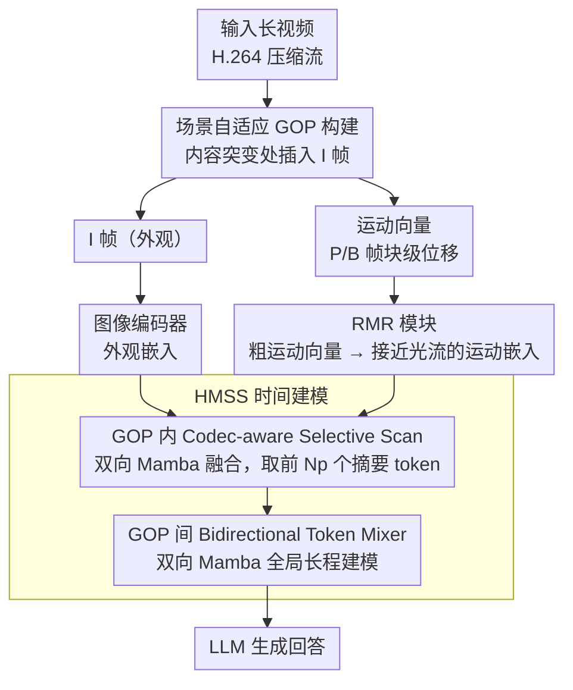

# ReMoRa: Multimodal Large Language Model based on Refined Motion Representation for Long-Video Understanding

**会议**: CVPR 2026  
**arXiv**: [2602.16412](https://arxiv.org/abs/2602.16412)  
**代码**: 无  
**领域**: 多模态VLM  
**关键词**: 长视频理解, 视频压缩表示, 运动向量, 状态空间模型, 光流精化

## 一句话总结
提出 ReMoRa，直接操作视频压缩表示（I帧 + 运动向量），通过 Refined Motion Representation (RMR) 模块将粗糙的块级运动向量精化为接近光流的细粒度运动表征，再用 Hierarchical Motion State Space (HMSS) 模块进行线性时间的长程时间建模，在 LongVideoBench、NExT-QA、MLVU 等基准上超越基线。

## 研究背景与动机
**领域现状**：视频 MLLM 在短视频上取得了显著进展，但长视频理解（分钟到小时级别）仍是重大挑战。

**现有痛点**：
   - 均匀帧采样面临固有 trade-off：稀疏采样遗漏关键事件，密集采样因二次注意力复杂度计算不可行
   - 基于帧的方法反复编码冗余内容（如静态背景），效率极低
   - 密集采样后的 token 压缩（pooling/reduction）会模糊细粒度细节和运动线索

**核心矛盾**：长视频需要密集的时间覆盖以捕捉短暂但重要的事件，但密集帧处理的计算代价过高。

**本文目标**：利用视频压缩格式（H.264）中天然的外观-运动分解，以极低成本实现密集时间覆盖。

**切入角度**：现代视频编码已经做了关键帧选择和运动补偿，运动向量是光流的廉价近似，可以直接利用而非解码全部帧。

**核心idea**：保留少量 I 帧用于外观，用运动向量替代中间帧用于时间动态，通过 RMR 模块弥补运动向量的噪声和粗糙性。

## 方法详解

### 整体框架
ReMoRa 想在不解码全部帧的前提下做到密集的时间覆盖，办法是直接吃 H.264 压缩流里现成的两样东西：少量 I 帧负责外观，大量运动向量负责时间动态。视频先被场景自适应地切成一个个 GOP（Group of Pictures），每个 GOP 抽出一张 I 帧和后续 P/B 帧的块级运动向量序列；I 帧走常规图像编码器（Image Encoder），运动向量则交给 RMR 模块精化成接近光流的细粒度运动；随后 HMSS 模块先在 GOP 内把外观和运动融到一起、压成几个摘要 token，再在 GOP 间做全局长程建模，最后把所有摘要喂给 LLM 生成回答。整条链路里没有任何一步需要把中间帧解码成 RGB，这正是它能在分钟到小时级视频上保持低成本的根源。

### 关键设计

**1. 场景自适应 GOP 构建：让 I 帧落在内容真正切换的地方**

固定间隔切 GOP 会把 I 帧放在内容连续的中段、却在场景突变处缺一张关键帧。ReMoRa 改用 ffmpeg 的场景自适应检测重新编码视频，在视觉不连续处动态插入 I 帧，让 GOP 边界对齐真实的内容结构。这相当于一次隐式的关键帧提取——每个 GOP 内部外观尽量一致，下游运动向量的精化也更稳定。这一步发生在整条 pipeline 的最前端，决定了后续 I 帧外观与运动向量序列怎么切分。

**2. Refined Motion Representation（RMR）：把廉价但粗糙的运动向量精化成接近光流的运动线索**

运动向量是 codec 为了压缩而附带计算的副产品，取出来几乎零成本，但它是按宏块组织的、稀疏、带噪声、时间上也不连贯，直接当运动特征用质量太差。RMR 的做法是预训练一个模块，学习从这些粗糙运动向量到密集光流场的映射——监督信号用 Co-Tracker3 在同一段视频上生成的密集光流，目标是 $L_2$ 重建损失。预训练完成后，这个模块在微调阶段被当作运动特征编码器使用，对第 $k$ 个 GOP、第 $t$ 个时刻输出运动嵌入

$$E_M^{(k,t)} \in \mathbb{R}^{N_m \times d_s}.$$

这样一来，模型既拿到了接近光流的信息量，又完全绕开了在线计算光流的昂贵开销——光流只在预训练时作为"老师"出现一次，推理时根本不需要它。

**3. Hierarchical Motion State Space（HMSS）：用两层 Mamba 在线性时间里同时抓住 GOP 内与 GOP 间的时间结构**

长视频展平后动辄超过 10 万 token，二次复杂度的注意力直接做不动。HMSS 用一个镜像 GOP 层次结构的两层设计来回避这个问题。第一层是 GOP 内的 Codec-aware Selective Scan：把 I 帧外观嵌入和 RMR 给出的运动嵌入拼成完整序列 $Z^{(k)}$，过一遍双向 Mamba 做融合，再从输出里取前 $N_p$ 个 token（即被运动信息浸染过的 I 帧 patch token），作为这个 GOP 的运动增强摘要。第二层是 GOP 间的 Bidirectional Token Mixer：把所有 GOP 的摘要向量串起来，再过一遍双向 Mamba 做全局长程建模。经过第一层的压缩，进入全局建模的序列长度比朴素展平缩短了约 $L_g/N_p$ 倍（$L_g$ 是 GOP 内 token 数），于是整条链路是线性时间复杂度，却仍同时保留了局部（GOP 内细粒度动态）和全局（跨 GOP 长程依赖）两个层级的上下文。

### 一个完整示例
拿一段十几分钟的视频走一遍：经 H.264 编码后它被场景自适应地切成若干 GOP，每个 GOP 最长 32 帧、含 1 张 I 帧加最多 31 张 P/B 帧。对某个 GOP，I 帧过 SigLIP 编码器拿到外观嵌入；那 31 张 P/B 帧的块级运动向量（宏块 4×4，分辨率细）直接从码流里取出、送进 RMR，被精化成密集运动嵌入 $E_M$。HMSS 第一层把这两路嵌入用双向 Mamba 融合，只保留前 $N_p$ 个 token，于是这个原本几十张帧的 GOP 被压成几个摘要 token。全片所有 GOP 都这么处理后，把各自的摘要串成一条短得多的序列，HMSS 第二层再做一次双向扫描得到全局时序表示，最后交给 LLM 回答"某个动作在视频里如何演变"这类需要细粒度运动的问题——整个过程没解码过一张中间 RGB 帧。

### 损失函数 / 训练策略
RMR 模块先单独预训练，用 $L_2$ 光流重建损失对齐 Co-Tracker3 的密集光流；整体模型再用标准 cross-entropy 做指令微调。LLM backbone 用 LoRA、视觉编码器冻结，参数效率较高。

## 实验关键数据

### 主实验

| 方法 | LLM | LongVideoBench | NExT-QA | MLVU | VideoMME | Avg |
|------|-----|:---------:|:-------:|:----:|:--------:|:---:|
| LLaVA-OneVision | Qwen2-7B | 56.5 | 79.4 | 64.7 | 58.2 | 63.2 |
| BIMBA | Qwen2-7B | 59.5 | 83.2 | 70.6 | 63.1 | 68.9 |
| LLaVA-Video | Qwen2-7B | 58.2 | 83.2 | 70.8 | 63.3 | 68.7 |
| **ReMoRa** | **Qwen2-7B** | **60.8** | **84.2** | **72.1** | **64.4** | **69.8** |

### 开放式 VideoQA

| 方法 | ActivityNet-QA Acc | ActivityNet-QA Score |
|------|:---------:|:---------:|
| EMA | 52.1 | 3.5 |
| **ReMoRa** | **60.5** | **3.7** |

### 关键发现
- ReMoRa 在 LongVideoBench (+1.3)、NExT-QA (+1.0)、MLVU (+1.3) 上均取得最佳成绩
- ActivityNet-QA 上准确率超过次优 8.4 个百分点，体现运动表示对时间推理的关键作用
- 与使用相同 codec 信息的 EMA 相比，RMR 精化运动表示带来显著提升
- 定性分析显示 ReMoRa 在需要细粒度动作理解的问题上明显优于 LLaVA-Video

## 亮点与洞察
- **利用视频压缩格式的天然结构**：不解码全部帧而直接操作编码域，这打破了"必须均匀采样RGB帧"的范式。运动向量虽然质量差，但数量可以非常密集，配合精化模块后成为高质量的时间线索
- **RMR 模块的巧妙设计**：预训练时学习"粗运动→密集光流"的映射，微调时作为特征编码器，既享受了光流的信息量又避免了光流的计算开销
- **HMSS 的层次化设计**：GOP 内融合（类似 segment-level attention）→ GOP 间建模（类似 video-level attention），完美匹配编码结构，且线性复杂度

## 局限与展望
- 依赖 H.264 编码器，对不同编码格式（HEVC、AV1）的适应性未验证
- GOP 最大长度固定为 32 帧，极长静态场景可能导致运动信息稀疏
- RMR 预训练需要 Co-Tracker3 生成的光流监督，增加了数据准备成本
- VideoMME 上不是最优（64.4 vs 65.1），说明在部分场景下运动信息可能不是关键

## 相关工作与启发
- **vs Video-LaVIT**：也使用 codec 信息但只做简单的 appearance-motion tokenization，缺少运动精化和层次化建模
- **vs EMA**：EMA 引入了 GOP 编码器但不精化运动向量，ReMoRa 的 RMR 模块填补了这个质量差距
- **vs LongVU（token pruning）**：LongVU 仍处理 RGB 帧只是减少 token 数量，ReMoRa 从源头上避免了冗余帧的处理

## 补充分析
- ReMoRa 使用 200K 的指令微调数据，来自 LLaVA-Video-178K 数据集，涵盖开放式QA、选择题和caption三种任务
- 场景自适应 GOP 构建：ffmpeg 的 scene-adaptive detection 自动在场景切换处插入 I 帧，比固定间隔GOP更合理
- 每个 GOP 最大长度 32 帧，宏块大小 4×4，保证细粒度运动向量分辨率
- 视觉编码器采用 SigLIP ViT-SO 且冻结，LLM backbone 用 LoRA 微调，参数效率高
- 在 ActivityNet-QA 上准确率领先次优（EMA）8.4 个点，主要因为 ActivityNet 中长时间跨度的动作理解对细粒度运动信息依赖更强

## 评分
- 新颖性: ⭐⭐⭐⭐ 利用压缩域信息的视频MLLM，方向有前景
- 实验充分度: ⭐⭐⭐⭐ 6个benchmark全面评估
- 写作质量: ⭐⭐⭐⭐ 背景铺垫充分，方法描述清楚
- 价值: ⭐⭐⭐⭐ 为长视频MLLM提供了高效的新范式

<!-- RELATED:START -->

## 相关论文

- [\[CVPR 2026\] Scaling the Long Video Understanding of Multimodal Large Language Models via Visual Memory Mechanism](scaling_the_long_video_understanding_of_multimodal_large_language_models_via_vis.md)
- [\[CVPR 2026\] MSJoE: Jointly Evolving MLLM and Sampler for Efficient Long-Form Video Understanding](msjoe_jointly_evolving_mllm_and_sampler_for_efficient_long-form_video_understand.md)
- [\[CVPR 2025\] Video-XL: Extra-Long Vision Language Model for Hour-Scale Video Understanding](../../CVPR2025/multimodal_vlm/video-xl_extra-long_vision_language_model_for_hour-scale_video_understanding.md)
- [\[CVPR 2026\] Predictive Regularization Against Visual Representation Degradation in Multimodal Large Language Models](predictive_regularization_against_visual_representation_degradation_in_multimoda.md)
- [\[CVPR 2026\] Video-Only ToM: Enhancing Theory of Mind in Multimodal Large Language Models](video-only_tom_enhancing_theory_of_mind_in_multimodal_large_language_models.md)

<!-- RELATED:END -->
