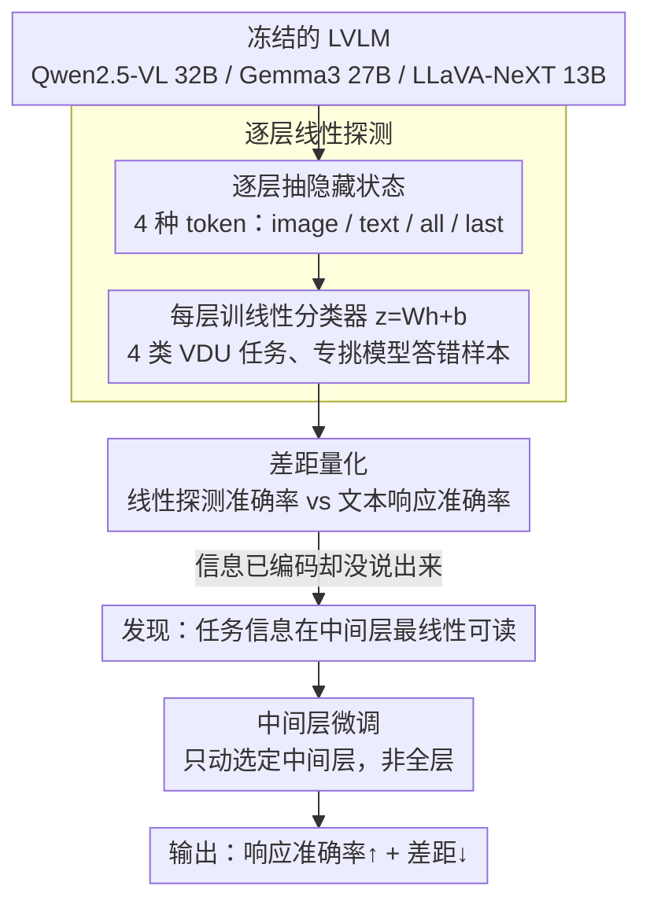

# Responses Fall Short of Understanding: Revealing the Gap between Internal Representations and Responses in VDU

**会议**: CVPR 2026  
**arXiv**: [2604.04411](https://arxiv.org/abs/2604.04411)  
**代码**: 无  
**领域**: 多模态大模型 / 文档理解  
**关键词**: LVLM, visual document understanding, linear probing, internal representations, intermediate layers

## 一句话总结

通过逐层线性探测分析发现 LVLM 在视觉文档理解中存在内部表示与生成响应之间的显著差距，且中间层比最终层编码了更线性可访问的任务信息，微调中间层可同时提升准确率和缩小差距。

## 研究背景与动机

大型视觉语言模型（LVLMs）在视觉文档理解（VDU）任务上取得了进展，但其性能评估主要依赖生成响应的正确性。然而，响应准确性可能并不完全反映模型是否在内部真正捕获了回答问题所需的信息。

先前研究已暗示内部表示可能包含比生成响应更丰富的信息，但在 LVLM 中逐层分析这一现象以及最具信息量的表示是否出现在最终层还是更早层，都尚未被充分探索。VDU 因需整合多模态和结构化推理，提供了分析多模态信息如何在 LVLM 中表示的理想测试平台。

## 方法详解

### 整体框架

这篇论文要回答的问题是：LVLM 在视觉文档理解（VDU）里答错，到底是“不知道”还是“知道但没说出来”。做法是在三个 LVLM（Qwen2.5-VL 32B、Gemma3 27B、LLaVA-NeXT 13B）的每一层接一个线性探针，量出各层信息的线性可编码程度，再和模型实际文本响应的正确率对照——差距有多大、信息在哪层最丰富，就此浮现；最后顺着“信息集中在中间层”这一发现，反过来去微调中间层弥合差距。整体是一条“探测分析 → 发现 → 针对性干预”的回路。

### 关键设计

**1. 逐层线性探测：量化每一层“信息是否线性可读”**

要判断信息有没有被内部编码，最干净的探针是线性分类器——它读不出非线性藏起来的信息，所以一旦它能读出来，就说明该层确实把信息摆在了线性可访问的位置。具体在每层 LLM 上建四种分类器（image-token、text-token、all-token、last-token），用单层线性变换 $\mathbf{z} = W\mathbf{h} + \mathbf{b}$ 把隐藏状态映到二分类输出，覆盖视觉属性识别（easy-VQA）、文字识别（MJSynth）、结构理解（PubLayNet）、图表理解（FigureQA）四类任务，每个任务 10 万训练 + 1 万测试样本。关键是数据专挑模型原始生成答错的样本（78% 被过滤掉），确保探的是“非平凡”情况而不是模型本来就会的简单题。

**2. 差距量化：把“内部信息”和“输出行为”摆在一起比**

光知道某层信息丰富还不够，得证明这信息没被用上。论文系统比较线性探测准确率（衡量内部编码了多少）与文本响应准确率（衡量实际输出了多少），两者之差就是核心发现——信息可以被内部线性编码，却不一定反映到响应里，也就是“模型知道但不说”。

**3. 中间层微调：顺着探测结论只动最该动的层**

既然探测显示任务信息在中间层比最终层更线性可访问，那弥合差距就该对症下药。论文据此选择性微调中间层而非全部层，实验表明全层微调不足以完全弥合差距，而中间层微调能更高效地同时抬高线性探测准确率和响应准确率——等于用探测结论反过来指导该往哪儿加监督。

### 损失函数 / 训练策略

线性探测用交叉熵损失训练，LVLM 参数全程冻结；微调阶段用标准 VQA 训练损失。数据集专门保留模型原始答错的样本（78% 被过滤），确保分析落在非平凡场景上。

## 实验关键数据

### 主实验

| 模型 | 任务 | 线性探测最优层 | 最优准确率 | 响应准确率 | 差距 |
|------|------|-------------|----------|----------|------|
| Qwen2.5-VL 32B | 图表理解 | 中间层 | ~85% | ~50% | ~35% |
| Gemma3 27B | 结构理解 | 中间层 | ~80% | ~50% | ~30% |

### 关键发现

- 内部表示与生成响应之间存在显著差距：信息已被编码但未被利用
- VDU 任务所需信息在中间层比最终层更线性可访问
- 全层微调不足以弥合差距，中间层微调更有效
- 图像 token 在早中期层包含丰富的任务相关信息

## 亮点与洞察

- 首次在 VDU 领域进行系统的逐层线性探测分析
- "模型知道但不说"的发现具有深刻意义，暗示改善生成策略的潜在方向
- 中间层微调比全层微调更高效的发现有实用价值
- 为理解 LVLM 内部工作机制提供了新视角
- 分析中专门选择模型生成错误答案的样本（78% 被过滤），确保研究非平凡场景
- image-token 在早中期层包含丰富任务相关信息，但在深层被语言先验压制
- 实验覆盖 Qwen2.5-VL 32B、Gemma3 27B、LLaVA-NeXT 13B 三种主流 LVLM

## 局限与展望

- 线性探测仅捕获线性可编码的信息，可能低估非线性编码的信息量
- 微调策略需要先进行探测分析来确定目标层，增加了使用成本
- 差距的根本原因（解码偏差？注意力分配？）需要进一步研究
- 数据构建中仅保留模型生成错误答案的样本，可能引入选择偏差
- 对更复杂的 VDU 任务（如多页文档、表格推理）的扩展性待验证

## 评分

- 新颖性：⭐⭐⭐⭐ — VDU 领域首次逐层分析，揭示内部表示与生成响应的差距
- 技术深度：⭐⭐⭐⭐ — 分析方法系统全面，覆盖 4 种任务、多种 token 类型
- 实验充分度：⭐⭐⭐⭐ — 多模型多任务验证
- 实用价值：⭐⭐⭐ — 中间层微调策略有实用参考，但需先进行探测分析

分析中使用了 10 万训练 + 1 万测试的大规模二分类数据集，确保结果的统计显著性。

<!-- RELATED:START -->

## 相关论文

- [\[CVPR 2026\] SciPostGen: Bridging the Gap between Scientific Papers and Poster Layouts](scipostgen_bridging_the_gap_between_scientific_papers_and_poster_layouts.md)
- [\[CVPR 2026\] Circuit Tracing in Vision-Language Models: Understanding the Internal Mechanisms of Multimodal Thinking](circuit_tracing_in_vision-language_models_understanding_the_internal_mechanisms_.md)
- [\[ICCV 2025\] SparseMM: Head Sparsity Emerges from Visual Concept Responses in MLLMs](../../ICCV2025/multimodal_vlm/sparsemm_head_sparsity_emerges_from_visual_concept_responses_in_mllms.md)
- [\[ACL 2025\] iNews: A Multimodal Dataset for Modeling Personalized Affective Responses to News](../../ACL2025/multimodal_vlm/inews_a_multimodal_dataset_for_modeling_personalized_affective_responses_to_news.md)
- [\[ACL 2026\] Long Story Short: Disentangling Compositionality and Long-Caption Understanding in Contrastive VLMs](../../ACL2026/multimodal_vlm/long_story_short_disentangling_compositionality_and_long-caption_understanding_i.md)

<!-- RELATED:END -->
