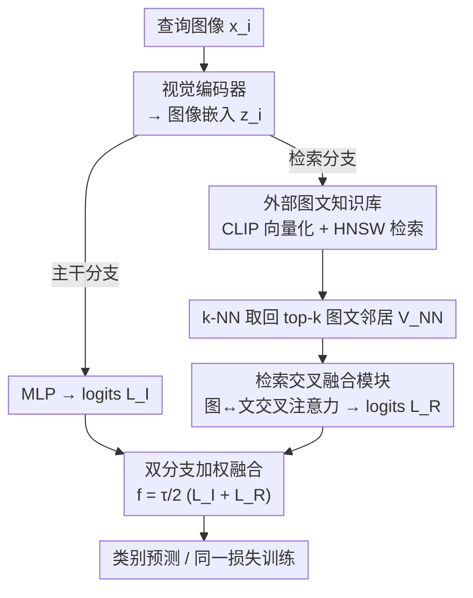

# RetFormer: Multimodal Retrieval for Enhancing Image Recognition

**会议**: CVPR 2026  
**论文**: [CVF Open Access](https://openaccess.thecvf.com/content/CVPR2026/html/Yu_RetFormer_Multimodal_Retrieval_for_Enhancing_Image_Recognition_CVPR_2026_paper.html)  
**代码**: 无  
**领域**: 多模态VLM  
**关键词**: 检索增强分类, 图文多模态, 长尾识别, 噪声标签, 交叉注意力

## 一句话总结
RetFormer 把世界知识从"压进模型权重"改为"存进外部图文知识库"，对查询图像做 k-NN 检索后用一个图文交叉融合注意力模块计算每个邻居的贡献，再和主干分支融合输出 logits，在长尾识别和噪声标签学习上把 ImageNet-LT 整体精度从 78.3% 提到 81.9%。

## 研究背景与动机

**领域现状**：大规模 Transformer + 海量预训练数据（LAION、DataComp）已经在视觉与 NLP 上取得 SOTA。主流范式是把世界知识隐式地"编码进模型参数"，再在下游任务上微调。

**现有痛点**：这种"参数即知识"的范式在真实场景里很别扭——灾难性遗忘、模型更新困难、可解释性差、扩展性受限；而真实数据又天然是长尾分布且常带噪声标签。尾部类别样本太少，模型几乎学不到稳定表示；噪声标签则进一步污染了对真实分布的估计。这些问题经常同时发生。

**核心矛盾**：以往针对长尾/噪声的方法（重加权、噪声过滤、表示校准等）几乎都是 **image-centered** 的——只盯着图像模态做文章，靠堆参数或调采样来"硬扛"数据稀缺。但尾部类别的瓶颈不是模型容量不够，而是**该类别能看到的有效信息太少**。单纯加参数并不能凭空造出尾部类的样本。

**切入角度**：作者观察到，对一张查询图做 k-NN 检索时，**同类邻居的图像模态提供低层不变特征（形状/颜色/纹理），文本模态提供高层抽象语义**；即便是不同类的邻居，也可能跨模态共享可迁移知识；当图像本身带噪声标签时，文本描述还能提供"先验"的纠错信息。也就是说，外部图文知识库里藏着大量能补救尾部类和噪声标签的"免费"信息，关键是怎么把它取出来用上。

**核心 idea**：用"半参数（semi-parametric）"范式取代纯参数范式——把世界知识存进一个外部图文知识库，训练时检索出与查询最相关的若干图文对，用一个交叉融合注意力模块建模"查询 ↔ 邻居"的图文关系并算出各自贡献，把检索分支和主干分支的 logits 加权融合，从而在几乎不增加参数的前提下增强尾部类与噪声样本的预测。

## 方法详解

### 整体框架
RetFormer 解决的是"长尾 + 噪声"下的图像分类。它的核心改动是给传统"图像编码器 → 分类器"的单通路，**并联一条检索通路**：查询图像先经视觉编码器得到嵌入 $z_i$，然后兵分两路——第一路是普通的 MLP 主干分支，直接由 $z_i$ 出 logits $L_I$；第二路先拿 $z_i$ 去外部知识库做 k-NN 检索，取回 top-k 个图文对邻居，送进**检索交叉融合模块**建模查询与邻居之间的图文关系、算出检索 logits $L_R$。两路 logits 加权相加后由同一个损失函数训练：

$$f(x_i) = \frac{\tau}{2}\big(L_I + L_R\big) = \frac{\tau}{2}\big(\text{MLP}(z_i) + h(r(z_i, V_{NN}(z_i; V_D)))\big)$$

其中 $\tau$ 是平衡主干与检索两条分支相对贡献的系数，$V_{NN}$ 是从知识库特征集合 $V_D$ 里取回的 top-k 邻居嵌入，$r(\cdot,\cdot)$ 是检索交叉融合模块。知识库的图文用两个**冻结**的 CLIP 编码器 $\varepsilon_I, \varepsilon_T$ 预先向量化好，检索用 Faiss 的 HNSW 近似最近邻。整条 pipeline 如下：

### 关键设计

**1. 双分支检索增强分类：把"外部知识"并联进决策，而不是塞进权重**

针对"参数即知识"带来的遗忘/更新难/尾部信息缺失，RetFormer 不再要求模型把所有世界知识背进权重，而是引入一个**独立于训练集 $S$ 的外部知识库** $D=\{(I_i,T_i)\}_{i=1}^L$（注意 $D$ 不假设包含 $S$ 的类别标签，它就是一堆额外世界知识）。预测时除了看查询图 $x_i$，还要看从 $D$ 里检索到的相关子集。最终 logits 由主干分支 $L_I=\text{MLP}(z_i)$ 和检索分支 $L_R$ 各出一份、按 $\tau/2$ 加权融合。这样做的好处是：知识库可以随时增删更新而不必重训模型（半参数特性），而尾部类即便自己样本少，也能从知识库里"借"到同类或可迁移的邻居信息。两路用同一损失联合训练，让模型自己学会该信多少检索结果。

**2. 检索交叉融合模块：用图↔文交叉注意力算清每个邻居该贡献多少**

取回的 top-k 邻居是**多类别、多模态**的混合体，直接平均会把无关邻居的噪声也带进来。本文的做法是把查询嵌入 $z_i$ 和邻居拼成图像嵌入矩阵 $E^I_{NN}\in\mathbb{R}^{P\times D}$ 与文本嵌入矩阵 $E^T_{NN}\in\mathbb{R}^{P\times D}$（关键细节：**查询自己对应的文本嵌入被置零，防止数据泄漏**——否则模型能直接从文本看到查询的语义）。两个矩阵各自经线性变换得到图像三元组 $Q^I,K^I,V^I$ 和文本三元组 $Q^T,K^T,V^T$，然后做**跨模态交叉注意力**：

$$r(z_i, V_{NN}) = \big[\,\text{Att}(Q^T, K^I, V^I) + E^I_{NN},\ \text{Att}(Q^I, K^T, V^T) + E^T_{NN}\,\big]$$

即用文本的 query 去注意图像的 key/value、再用图像的 query 去注意文本的 key/value，并带残差。这种"文本问图像、图像问文本"的设计正是建模图文互补关系的核心——文本带来抽象语义和先验纠错，图像带来低层不变特征，交叉注意力让模型按相关性给每个邻居加权，而不是无差别吸收。注意力还可堆叠 $L$ 层（仿 ViT 加位置嵌入和 class token），第 $L$ 层输出在前一层残差上继续累加。实验取 $L=4$。

**3. 知识库构建与向量化：用冻结 CLIP 把十亿级图文对压成可复用索引**

检索质量直接决定上限，所以知识库怎么建很关键。本文给了三种来源：直接用下游数据集（保证每个查询至少有一个同类实例，但文本描述往往贫乏，可能只有标签）、用 DataComp 的 14 亿图文对子集（带世界知识，文本丰富），以及把两者去重过滤后合并的 "All"（约 14 亿对）。为了让十亿级检索可行，作者用在 DataComp-1B 上预训练的 **CLIP 编码器**（与主干视觉编码器同源，避免 ImageNet-21K 预训练造成的数据泄漏）**冻结**后离线把全库向量化，配合 Faiss 的 HNSW 算法做近似 k-NN——HNSW 是亚线性 $O(\log N)$ 复杂度，10 亿规模查询也只在毫秒级。因为编码器冻结，一次预计算的检索结果在后续训练/验证里可反复复用，省下大量算力（ImageNet-LT 约需额外 30GB 存索引）。

**4. 梯度视角：把检索模块解释成"数据相关的虚拟样本增强"**

为什么检索能帮到长尾？作者从梯度传播给出直觉解释。没有检索模块时，损失只在"对应样本-类别"间一对一传梯度。加入检索后，对样本 $x_0$ 及其 $k$ 个检索邻居对应的损失 $L_1,\dots,L_{2k}$，查询的梯度变成：

$$\frac{\partial L_0}{\partial x_0} := \frac{\partial L_0}{\partial x_0} + \sum_{i=1}^{2k}\frac{\partial L_i}{\partial x_0}$$

也就是检索邻居引入了额外的梯度项 $\partial L_i/\partial x_0$，相当于这些邻居 $(I_{2i-1}, T_{2i})$ 成了标签 $y_i$ 的"虚拟样本"。因此检索模块本质上是一种**数据相关（data-dependent）的数据增强**——它隐式地为每个标签补充虚拟样本。这正好解释了它对尾部类特别有效：尾部类缺的就是样本，而虚拟样本恰好补上了这一缺口。消融里 Few-shot 随知识库增大、随 $k$ 增大而稳定提升，与这一理论一致。

### 损失函数 / 训练策略
两条分支的融合 logits 由同一个监督损失训练（交叉熵，或类别不平衡时用 LACE 损失）。训练 25 epoch，学习率 0.0005、batch 256，1 epoch warm-up 后余弦衰减，Adam（weight decay 0.1），并用 label smoothing 和 Mixup 防过拟合。注意力层数 $L=4$，默认检索 $k=32$ 个邻居。

## 实验关键数据

在五个数据集上评测：长尾识别用 CIFAR-100-LT、ImageNet-LT、Places-LT、iNaturalist 2018，噪声标签学习用 WebVision（mini 设定取前 50 类）。主干统一为 CLIP（DataComp-1B 预训练）的 ViT-B/16。

### 主实验

ImageNet-LT 与 Places-LT 上的 top-1 精度（仅列代表性方法）：

| 数据集 | 方法 | Many | Med | Few | Overall |
|--------|------|------|-----|-----|---------|
| ImageNet-LT | LIFT | 81.3 | 77.4 | 73.4 | 78.3 |
| ImageNet-LT | RAC（仅图像检索） | 80.9 | 76.0 | 67.5 | 76.7 |
| ImageNet-LT | MAM（仅图像检索） | 80.6 | 77.5 | 74.5 | 78.3 |
| ImageNet-LT | **RetFormer** | **85.0** | **80.9** | **76.8** | **81.9** |
| Places-LT | LIFT | 51.3 | 52.2 | 50.5 | 51.5 |
| Places-LT | MAM | 52.4 | 52.0 | 48.5 | 51.4 |
| Places-LT | **RetFormer** | 52.7 | 52.1 | **51.9** | **52.3** |

iNaturalist 2018 与 WebVision（噪声标签）：

| 数据集 | 方法 | 关键指标 | RetFormer |
|--------|------|----------|-----------|
| iNaturalist 2018 | RAC（Overall） | 80.2 | **81.1** |
| WebVision（val Top1） | Dynamic Loss | 80.12 | **81.7** |
| ILSVRC12（val Top1） | Sel-CL+ | 76.84 | **77.3**（RCAL+ 半监督 76.32→实际略高） |

RetFormer 在所有用额外数据的方法里全面领先，尤其 ImageNet-LT 整体 +3.6 个点、Few-shot 从 74.5 提到 76.8。关键对比是 RAC/MAM 同样做检索增强，但**只用图像模态**，所以尾部类明显更弱——印证了"文本模态补充检索内容"的价值。

### 消融实验

模态消融（ImageNet-LT，Table 5）：

| 配置 | Many | Med | Few | Overall | 说明 |
|------|------|-----|-----|---------|------|
| CLIP zero-shot | 69.2 | 67.6 | 67.7 | 68.3 | 不微调 |
| CLIP full FT | 84.3 | 73.1 | 52.9 | 74.6 | 全微调，尾部崩 |
| Ours w/o text | 81.3 | 74.8 | 65.9 | 76.0 | 只检索图像 |
| Ours w/o image | 83.1 | 76.9 | 68.4 | 78.1 | 只检索文本 |
| Ours w/ FE | 79.3 | 79.0 | 74.6 | 78.6 | 冻结图像编码器 |
| **Ours（完整）** | **85.0** | **80.9** | **76.8** | **81.9** | 图文双模态检索 |

注意力层数 $L$（Table 3）：$L=1\to81.2$、$L=2\to81.5$、$L=4\to81.9$、$L=8\to82.0$（4→8 仅 +0.11%，收益递减）。

索引消融（Table 6）：精确 k-NN（recall 1.00）整体 81.9、单次查询 23.34ms；HNSW（recall 0.97）整体 81.8、仅 7.69ms——近似检索几乎不掉点却带来约 3× 加速。

### 关键发现
- **文本模态贡献大于图像模态**：去掉文本（w/o text）整体掉到 76.0，去掉图像（w/o image）只掉到 78.1，说明检索到的文本（抽象语义/先验）对长尾比图像更关键，尤其 Few-shot（68.4 vs 65.9）。
- **$k$ 的双面性**：整体精度随 $k$ 增大到 32 后饱和；但 **Many-shot 反而随 $k$ 增大下降**——头部类样本本就够，过大的 $k$ 引入噪声标签反害；Few-shot 则随 $k$ 增大持续受益，与"虚拟样本增强"理论吻合。
- **知识库越大越好、尾部受益最多**：从下游集 → DataComp → All，精度递增，且 Few-shot 涨幅最大。
- **Places-LT 是短板**：场景分类与"以物体为中心"的知识库文本错配，检索文本与场景图协同变弱；且检索可能对已充分覆盖的类别过度纠偏。减小 $k$（8/16）能让 Many 微涨 0.3–0.8% 但 Few 下降。

## 亮点与洞察
- **半参数范式落到视觉识别**：把"世界知识压进权重"换成"存进可检索外库"，让知识可增删更新而不重训，这一思路在长尾/噪声这种"信息稀缺"场景特别贴切——缺的是信息不是容量。
- **跨模态交叉注意力 + 文本置零防泄漏**：用"文本问图像、图像问文本"显式建模图文互补，再把查询自身文本置零堵住捷径，是个干净且可复用的小设计。
- **梯度视角把检索解释成数据增强**：$\partial L_0/\partial x_0$ 多出 $\sum \partial L_i/\partial x_0$ 这一项，把"检索邻居=虚拟样本"讲得很直观，也顺势解释了尾部为何受益最大，理论与消融自洽。
- **工程可行性证明**：冻结 CLIP 预向量化 + HNSW 让 10 亿级检索进毫秒级、近似检索几乎不掉点换 3× 加速，证明检索增强不是只能停在小库玩具实验。

## 局限与展望
- **场景类任务失灵**：Places-LT 上文本知识库以物体为中心、与场景图错配，检索协同明显减弱，作者自己也承认表现"不及预期"。如何为场景/关系类任务构建合适知识库是开放问题。
- **存储与预处理成本**：虽然查询毫秒级，但需冻结编码器预向量化整库并存索引（ImageNet-LT 就要 ~30GB），对更大下游任务或动态库不友好。
- **依赖 CLIP 检索质量**：整套方法的上限被冻结 CLIP 编码器的对齐质量绑死，编码器若对某领域弱，检索就会失准；且为防泄漏只能用同源 CLIP，限制了主干选择。
- **过度纠偏风险**：作者指出检索可能对已充分覆盖的类别"矫枉过正"，Many-shot 随 $k$ 增大反降即为证据，缺少自适应调节 $k$/$\tau$ 的机制。

## 相关工作与启发
- **vs RAC / MAM（视觉检索增强）**: 都从外部记忆检索，但 RAC/MAM **只建模图像模态**关系（RAC 还只用训练集自身、MAM 给文本加权但思路仍偏图像）；RetFormer 主张图文**两个模态都有可挖掘知识**，用跨模态交叉注意力联合建模，故尾部类显著更强（ImageNet-LT 81.9 vs 76.7/78.3）。
- **vs BatchFormer（样本关系）**: BatchFormer 在 mini-batch 的 batch 维上套 Transformer 隐式探索样本关系，关系范围被限制在当前 batch 内；RetFormer 把关系建模拓展到**全局外部知识库**，且显式区分图文模态。
- **vs 长尾"调整"类方法（重加权 / LACE / 表示校准）**: 这些方法在固定数据上调损失或采样，受限于数据集本身的信息量；RetFormer 从外部**补充信息（虚拟样本）**，与调整类方法正交，可叠加使用（不平衡时仍用 LACE 损失）。
- **vs Mixup（数据增强）**: Mixup 在训练样本间线性混合造虚拟样本；RetFormer 的梯度视角表明检索本质也是"数据相关的增强"，但虚拟样本来自语义最近邻而非随机配对，对尾部类更有针对性。

## 评分
- 新颖性: ⭐⭐⭐⭐ 把半参数检索增强 + 图文跨模态交叉注意力引入长尾/噪声识别，并用梯度视角统一解释，思路清晰且有差异化（不只盯图像）。
- 实验充分度: ⭐⭐⭐⭐ 五个数据集 + 模态/层数/$k$/知识库/索引五类消融，比较扎实；但 Places-LT 失效、缺少更大主干和真实大库的端到端开销分析。
- 写作质量: ⭐⭐⭐⭐ 动机—方法—理论—实验逻辑顺，公式与图清楚；个别细节（$\tau$ 取值、LACE 用法）略简。
- 价值: ⭐⭐⭐⭐ 给"长尾/噪声不靠堆参数、靠外部知识"提供了可工程化的范式，文本模态价值与索引可行性的发现对后续检索增强视觉工作有参考意义。

<!-- RELATED:START -->

## 相关论文

- [\[CVPR 2026\] RMIR: A Benchmark Dataset for Reasoning-Intensive Multimodal Image Retrieval](rmir_a_benchmark_dataset_for_reasoning-intensive_multimodal_image_retrieval.md)
- [\[CVPR 2026\] Camouflage-aware Image-Text Retrieval via Expert Collaboration](camouflage-aware_image-text_retrieval_via_expert_collaboration.md)
- [\[CVPR 2026\] ReCALL: Recalibrating Capability Degradation for MLLM-based Composed Image Retrieval](recall_recalibrating_capability_degradation_for_mllm-based_composed_image_retrie.md)
- [\[CVPR 2026\] CodeMMR: Bridging Natural Language, Code, and Image for Unified Retrieval](codemmr_bridging_natural_language_code_and_image_for_unified_retrieval.md)
- [\[CVPR 2026\] Self-guided Semantic Inspection for Zero-Shot Composed Image Retrieval](self-guided_semantic_inspection_for_zero-shot_composed_image_retrieval.md)

<!-- RELATED:END -->
