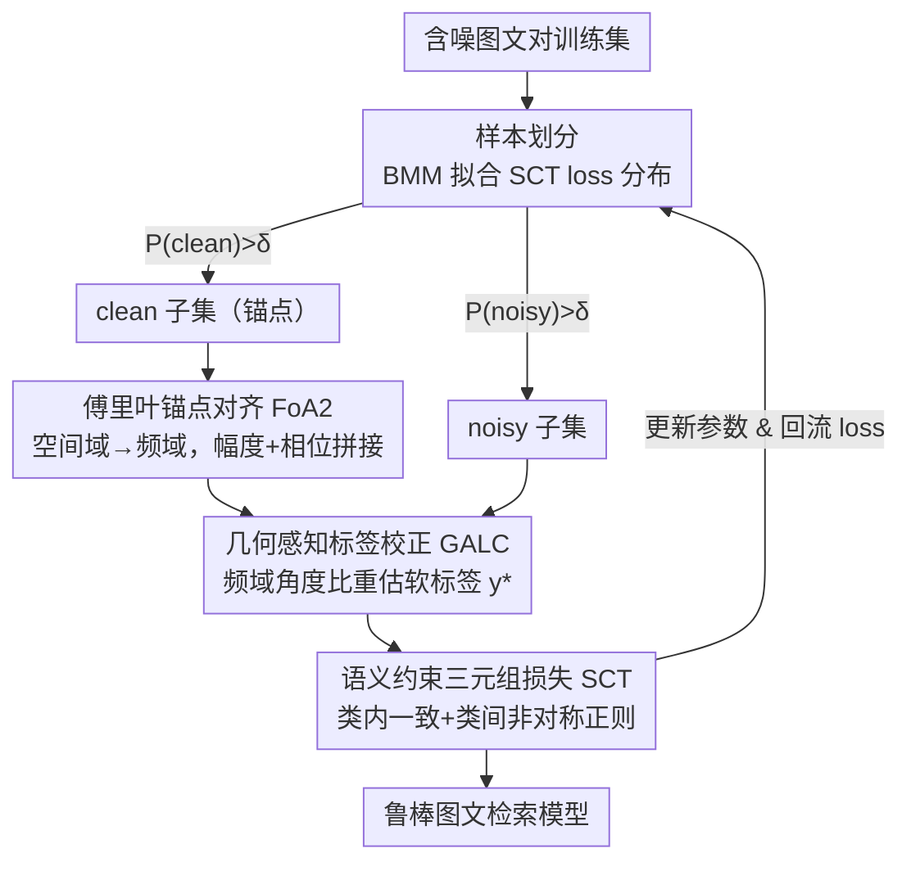

# Rethinking Cross-Modal Anchor Alignment for Mitigating Error Accumulation

**会议**: CVPR 2026  
**论文**: [CVF Open Access](https://openaccess.thecvf.com/content/CVPR2026/html/Liu_Rethinking_Cross-Modal_Anchor_Alignment_for_Mitigating_Error_Accumulation_CVPR_2026_paper.html)  
**代码**: 无  
**领域**: 多模态VLM / 跨模态检索 / 噪声对应学习  
**关键词**: 噪声对应, 锚点对齐, 傅里叶变换, 软标签校正, 三元组损失

## 一句话总结
针对图文检索中"噪声对应学习"长期被忽视的一个误差来源——干净锚点对自身也存在跨模态不一致（anchor correlation discrepancy），本文用傅里叶变换在频域对齐锚点表示、再据此做几何感知的软标签校正，并配一个语义约束三元组损失来抑制误差累积，在三个数据集上一致刷新检索精度。

## 研究背景与动机
**领域现状**：图文检索（cross-modal matching）默认训练数据是完美对齐的正负对。但 Conceptual Captions 这类网络爬取的大规模数据里混入了大量错配的图文对，即"噪声对应"（noisy correspondence）。主流应对思路是先把样本划分成 clean / noisy 两堆，再对 noisy 样本重估一个 0~1 的"软对应标签"作为更可靠的监督。

**现有痛点**：这套流程会"误差累积"——一旦样本划分判错、或软标签估偏，错误监督会在后续迭代里被放大。已有工作几乎把误差累积的锅都甩给"noisy 样本对本身的错误"，于是从更细粒度划分、更鲁棒损失、更准的标签校正三个方向打补丁。其中标签校正这一支依赖"锚点"（anchor，即被判为干净的参考样本）：通过 query 与锚点之间的跨模态几何一致性来反推 noisy 样本的标签。

**核心矛盾**：本文发现了一个被所有人忽略的新误差源——**即便是干净的锚点对，其图模态相似度与文模态相似度本身也对不上**。论文把它定义为锚点相关性差异 $\Delta d = |S_V - S_T|$，其中 $S_V, S_T$ 分别是锚点对在图、文模态内的相似度。根因在于：从空间域抽出的特征里除了高层语义，还混着大量**局部细节成分**，而图像模态的局部细节远比文本丰富，两模态局部成分的不对称把"理想几何一致性"（图 1a）扭曲成"真实几何结构"（图 1b）。作者在 Flickr30K（噪声率 0.2）上实测，约 23% 的样本 $\Delta d > 0.3$——这个被扭曲的几何结构直接污染了所有基于锚点的标签校正。

**本文目标**：(1) 让锚点表示本身跨模态对齐、削掉局部细节带来的不一致；(2) 在更干净的几何结构上重估软标签；(3) 把样本划分从"只看 loss 大小"升级为带语义约束的判别。

**核心 idea**：把锚点对齐和标签校正从扰动严重的**空间域搬到频域**——傅里叶变换天然把"全局语义（相位）"和"局部纹理（幅度）"解耦，从而可控地压低对局部细节的依赖；再用频域里更稳的角度一致性去校正软标签，外加语义约束三元组损失稳住样本划分。

## 方法详解

### 整体框架
GSL（Geometric-Semantic Learning）是一个端到端的噪声对应学习框架，输入是含噪声的图文对训练集，输出是一个鲁棒的检索模型。它把每一轮训练拆成"先划分、再对齐、后校正、用约束损失更新"四步串行：用上一轮的 SCT loss 值经贝塔混合模型把样本切成 clean / noisy 两个子集；对 clean 子集里的锚点用傅里叶锚点对齐（FoA2）压掉局部细节差异，得到频域里跨模态一致的锚点表示；在这个频域空间里用几何感知标签校正（GALC）给 noisy 样本算出新的软对应标签；最后把校正后的全集喂给语义约束三元组损失（SCT）更新模型，下一轮的样本划分又用这个 loss——形成闭环。

### 关键设计

**1. 傅里叶锚点对齐 FoA2：把锚点对齐搬到频域，可控地削掉局部细节**

这一步直接对着"锚点相关性差异"开刀。痛点是：空间域特征里局部细节成分（图像模态尤其多）让两模态锚点的相似度结构对不上。FoA2 先用贝塔混合模型（BMM）做锚点选择——基于深度网络的"记忆效应"（训练早期 clean 样本 loss 低、noisy 样本 loss 高），用 SCT loss 拟合一个 BMM：$P(\ell|\gamma,\beta)=\frac{\Gamma(\gamma+\beta)}{\Gamma(\gamma)\Gamma(\beta)}\ell^{\gamma-1}(1-\ell)^{\beta-1}$，按后验概率 $P(k|\ell_i)$ 卡阈值 $\delta=0.5$ 选出 clean 子集 $\tilde{D}_c$。

然后把选出的特征 $x\in\mathbb{R}^{B\times D}$（图像 $D{=}2048$、文本 $D{=}1024$）做离散傅里叶变换 $F(x)[m]=\sum_{d=0}^{D-1}x[d]\cdot e^{-2j\pi\frac{d}{D}m}$，取出幅度与相位后拼成一个联合频域表示。关键在于频域的天然解耦：**相位编码全局结构与高层语义，幅度刻画局部纹理与低层模态特性**——把两者拼接，模型就能在优化时自适应地降低对局部细节的依赖，从而稳住语义表示。再叠一个均值中心化（mean-centering）抵消模态异质带来的能量漂移。两步合起来把 $\Delta d$ 压下去，后续所有标签校正都在这个更一致的频域空间里做。

**2. 几何感知标签校正 GALC：用频域里的角度比重估软标签**

有了对齐后的锚点，就能可靠地给 noisy 样本算软标签。核心假设是：对干净图文对，"query 图像↔视觉锚点"形成的几何结构应该和"对应文本↔文本锚点"的结构一致；noisy 样本则不满足。对 noisy 子集里的第 $i$ 对 $(I_i^n, T_i^n)$，先从 clean 子集挑出最相似和次相似的两个图像锚点 $I_i^{a1}, I_i^{a2}$，分别在图、文模态算 query 到两个锚点的余弦相似度，再取**模态内相似度比**捕捉结构关系：$R_I=\frac{S_I^{n\to a1}}{S_I^{n\to a2}}$，$R_T=\frac{S_T^{n\to a1}}{S_T^{n\to a2}}$。

跨模态的几何一致性就用两个比值再相除来度量两个方向：$S_{I2T}=\frac{R_I}{R_T}$、$S_{T2I}=\frac{R_T}{R_I}$，最终软标签取双向平均 $y_i^*=(S_{I2T}+S_{T2I})/2$。直觉是：若图、文两边相对锚点的角度结构一致，两个比值就接近、$y^*$ 接近 1（判为真正配对）；结构越扭曲、$y^*$ 越低。校正后 noisy 与 clean 子集的标签都更新并合并成新训练集。相比直接拿空间域相似度做校正，在频域上算这个角度比能避开被局部细节污染的几何结构，标签更可信。

**3. 语义约束三元组损失 SCT：给样本划分和优化注入语义信号**

痛点是：原始三元组损失对不同类型噪声的敏感度不一致，单看 loss 值来分 clean/noisy 容易失败，也拖累训练稳定性。SCT 在三元组损失外显式加两条语义正则。**类内语义一致性** $L_{intra}=\|M_I-M_T\|_2^2=\sum_{i}\sum_{j}(S(I_i,I_j)-S(T_i,T_j))^2$：一个 batch 内不同图像之间的相似度，应该和它们对应文本之间的相似度成比例（图相似的，文也该相似），用 MSE 把图、文相似度矩阵拉齐，对 clean 样本施加更强约束。**类间语义非对称性** $L_{inter}=-\|M_{IT}-M_{TI}\|_2^2=-\sum_{i}\sum_{j}(S(I_i,T_j)-S(I_j,T_i))^2$：约束相似度矩阵非对角元素（错配对）之间的非对称关系来提升鲁棒性（注意符号为负，是鼓励非对称差异）。

总损失 $L_{SCT}=L_w+\zeta L_{intra}+\eta L_{inter}$，其中三元组项 $L_w=[\hat\alpha-S(I_i,T_i)+S(I_i,\hat T_i)]_+ + [\hat\alpha-S(I_i,T_i)+S(\hat I_i,T_i)]_+$，$\hat I_i,\hat T_i$ 是当前 batch 内最难负样本，$\hat\alpha$ 为软间隔。训练分两段：warmup 阶段只用 $L_w$，正式阶段切到 $L_{SCT}$ 提升判别力与抗噪性。这个 loss 同时是样本划分（设计 1 的 BMM 输入）和参数更新的依据，把语义信号灌进了整条闭环。

### 损失函数 / 训练策略
Adam 优化器，初始学习率 $2\times10^{-4}$，batch size 128，词嵌入维度 300，联合嵌入空间维度 2048，软间隔 $\hat\alpha=0.2$。正则平衡系数 $\zeta=1.0$、$\eta=0.1$（超参分析中分别固定一个调另一个得到的最优）。warmup 10 个 epoch（仅 $L_w$），之后 40 个 epoch 用 $L_{SCT}$。

## 实验关键数据

### 主实验
三个图文检索数据集 Flickr30K、MS-COCO、CC152K，指标为 R@1/5/10 及双向召回之和 RSum；Flickr30K 与 MS-COCO 模拟 20%/40%/60% 噪声，CC152K 为真实噪声。下表为 RSum 对比（GSL vs 最强基线）：

| 数据集 / 噪声 | 指标 | GSL | 最强基线 | 提升 |
|--------------|------|-----|----------|------|
| Flickr30K / 0.2 | RSum | 507.5 | 504.7 (BiCro) | +2.8（论文称 +3.0） |
| Flickr30K / 0.4 | RSum | 498.6 | 493.8 (PC2) | +4.8 |
| Flickr30K / 0.6 | RSum | 484.1 | 477.1 (ESC) | +7.0 |
| MS-COCO / 0.2 | RSum | 525.1 | 524.7 (L2RM) | +0.4 |
| MS-COCO / 0.4 | RSum | 520.9 | 518.9 (SPS) | +2.0 |
| MS-COCO / 0.6 | RSum | 513.2 | 511.3 (SPS) | +1.9 |
| CC152K（真实噪声） | RSum | 379.6 | 374.2 (L2RM) | +5.4 |

噪声越高、增益越大（Flickr30K 从 +3.0 → +7.0），说明 GSL 在更脏的数据上更能稳住监督信号；真实噪声 CC152K 上同样领先所有基线。

### 消融实验
Flickr30K 40% 噪声下逐组件叠加（GALC 为基底）：

| 配置 | RSum | 说明 |
|------|------|------|
| 仅 GALC | 488.4 | 只做几何标签校正 |
| GALC + FoA2 | 495.8 | 加频域锚点对齐，+7.4 |
| GALC + FoA2 + SCT（Full） | 498.6 | 再加语义约束损失，+2.8 |

### 关键发现
- **FoA2 贡献最大**：在 GALC 基础上加入频域锚点对齐单步带来 +7.4 RSum，远超 SCT 的 +2.8，直接验证了"锚点相关性差异"才是误差累积的主因——先把锚点对齐了，标签校正才有意义。
- **超参不敏感但有最优点**：$\zeta=1.0$、$\eta=0.1$ 时最佳；类间非对称项权重 $\eta$ 明显小于类内一致项，暗示类内一致性约束是主力。
- **可视化佐证**：施加 FoA2 后，Flickr30K（噪声 0.2）上锚点相关性差异分布显著收窄，直接证明频域对齐确实压低了 $\Delta d$。

## 亮点与洞察
- **重新定义了误差来源**：以往都假设"锚点是干净对齐的"，本文指出干净锚点对自身也存在跨模态几何不一致，并给出可量化的 $\Delta d$ 定义和 23% 占比的实测——把噪声对应学习的归因往前推了一层，这是最大的"啊哈"。
- **频域解耦用得很巧**：借相位=全局语义、幅度=局部纹理的性质，把"压低局部细节依赖"这件本来很玄的事变成了拼接频域分量 + 均值中心化两步可操作的运算，思路可迁移到任何"想削局部扰动、保语义"的跨模态对齐任务。
- **角度比做标签校正**：用模态内相似度比再跨模态相除（$S_{I2T}=R_I/R_T$）来度量几何一致性，是个轻量且无需额外参数的软标签估计器，可直接嫁接到其他基于锚点的校正框架。

## 局限与展望
- 方法绑定在"图文检索 + 噪声对应"这一具体设定，FoA2 的频域假设（相位/幅度分别承载语义/纹理）是否在视频、音频等模态同样成立未验证。
- ⚠️ 类间非对称损失 $L_{inter}$ 取负号"鼓励非对称差异"的具体作用机制论文叙述较简，其与鲁棒性的因果链条以原文为准。
- BMM 样本划分依赖深度网络的记忆效应，在极高噪声（>60%）或记忆效应不明显的骨干上是否稳健，论文未做压力测试。
- 频域变换 + 双子集维护带来的额外计算/显存开销没有报告，工程落地成本不明。

## 相关工作与启发
- **vs NCR / DECL / BiCro**：这些方法把误差累积归因于 noisy 样本本身，靠更细划分或鲁棒 loss 缓解；本文指出真正被忽略的是**干净锚点的跨模态不一致**，从频域对齐锚点这个全新角度切入。
- **vs GSC / 基于锚点的标签校正**：它们直接在空间域用锚点几何一致性校正标签，但被局部细节污染；GSL 先 FoA2 把锚点搬到频域对齐，再做 GALC 校正，几何结构更可信。
- **vs L2RM / PC2 / SPS**：同为近期 SOTA，GSL 在三数据集多噪声档位上一致领先，且噪声越高优势越明显，说明对齐锚点比单纯改进划分/损失更触及问题根因。

## 评分
- 新颖性: ⭐⭐⭐⭐⭐ 首次识别并量化"锚点相关性差异"这一被忽视的误差源，频域对齐切入角度新颖
- 实验充分度: ⭐⭐⭐⭐ 三数据集 × 三噪声档位 + 真实噪声 + 消融 + 可视化齐全，但缺计算开销与高噪声压力测试
- 写作质量: ⭐⭐⭐⭐ 动机递进清晰、公式完整，个别正则项机制叙述偏简
- 价值: ⭐⭐⭐⭐ 重新归因 + 即插即用的频域对齐/角度比校正，对噪声对应学习方向有实际推动

<!-- RELATED:START -->

## 相关论文

- [\[CVPR 2026\] DeepAlign: Mitigating Modality Conflict through Modality-Specific Alignment](deepalign_mitigating_modality_conflict_through_modality-specific_alignment.md)
- [\[CVPR 2026\] Anchor-Guided Gradient Alignment for Incomplete Multimodal Learning](anchor-guided_gradient_alignment_for_incomplete_multimodal_learning.md)
- [\[AAAI 2026\] Rethinking Visual Token Reduction in LVLMs under Cross-Modal Misalignment](../../AAAI2026/multimodal_vlm/rethinking_visual_token_reduction_in_lvlms_under_cross-modal_misalignment.md)
- [\[CVPR 2026\] CoV-Align: Efficient Fine-grained Cross-Modal Alignment with Cohesive Visual Semantics Priority](cov-align_efficient_fine-grained_cross-modal_alignment_with_cohesive_visual_sema.md)
- [\[CVPR 2026\] Decoupled and Reusable Adaptation for Efficient Cross-Modal Transfer](decoupled_and_reusable_adaptation_for_efficient_cross-modal_transfer.md)

<!-- RELATED:END -->
