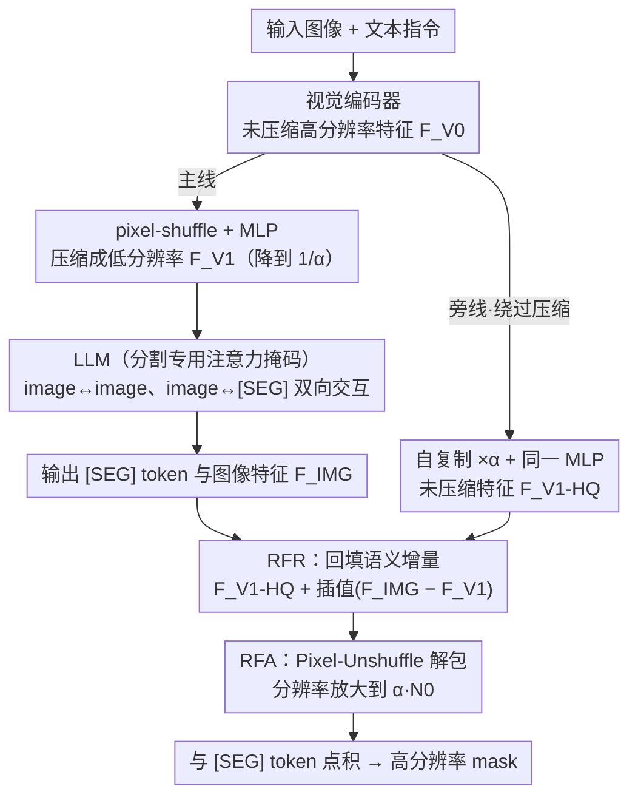

# Rethinking MLLM Itself as a Segmenter with a Single Segmentation Token

**会议**: CVPR 2026  
**arXiv**: [2603.19026](https://arxiv.org/abs/2603.19026)  
**代码**: [https://github.com/ANDYZAQ/SELF1E](https://github.com/ANDYZAQ/SELF1E)  
**领域**: 多模态VLM  
**关键词**: MLLM分割, 无解码器分割, 单token分割, Pixel-Unshuffle, 特征精化

## 一句话总结
提出 SELF1E，首次实现不依赖专用 mask 解码器且仅用单个 [SEG] token 的 MLLM 分割方法，通过 Residual Features Refilling (RFR) 和 Residual Features Amplifier (RFA) 恢复 pixel-shuffle 压缩造成的分辨率损失，在多个分割任务上达到与解码器方法竞争力相当的性能。

## 研究背景与动机
**领域现状**：MLLM 分割方法（LISA、GSVA、OMG-LLaVA 等）主要通过在 MLLM 上挂载专用 mask 解码器（SAM / Mask2Former）来生成分割掩码。

**现有痛点**：
   - 专用解码器引入额外参数和复杂结构，破坏方法的简洁性且依赖外部基础模型
   - UFO 尝试无解码器方案，但需要 16 个 [SEG] token 来补偿分辨率损失，增加计算成本
   - 问题根源：现代 MLLM 的 pixel-shuffle 下采样使视觉特征分辨率大幅降低（如 4 倍压缩），丢失了分割所需的细粒度空间信息

**核心矛盾**：pixel-shuffle 压缩是 MLLM 高效处理的必要手段，但压缩导致的空间信息丢失是无解码器分割的根本瓶颈。

**本文目标**：证明单个 [SEG] token 足以实现高质量分割，瓶颈不在 token 数量而在特征分辨率。

**切入角度**：压缩前的图像编码器特征保有完整分辨率，可以作为"预压缩特征"保留；LLM 处理后的特征带有更精细的语义区分度；两者互补。

**核心idea**：保留编码器输出的未压缩特征+收集 LLM 各层的残差特征并上采样融合+用 Pixel-Unshuffle 进一步放大分辨率。

## 方法详解

### 整体框架
SELF1E 想回答一个反直觉的问题：MLLM 做分割，到底是缺 token，还是缺分辨率？现有无解码器方案（UFO）认为单个 [SEG] token 表达力不够，于是堆到 16 个；本文则把矛头指向 MLLM 内部的 pixel-shuffle 下采样——它把视觉特征压到原来的 $1/\alpha$（InternVL 系列 $\alpha$ 通常为 4），细粒度空间信息在送进 LLM 前就已丢失，再多 token 也补不回这个分辨率。

于是整条管线走两条并行的支线。主线照常：图像过视觉编码器（Vision Encoder），经 pixel-shuffle + MLP 压缩成低分辨率视觉 token，连同文本一起喂给 LLM，最后吐出一个 [SEG] token 和一组被 LLM 重新编码过的图像特征 $F_{IMG}$。旁线则在压缩发生之前，把编码器的高分辨率特征原样截留下来。两条线在 LLM 之后汇合：先用 **RFR** 把 LLM 学到的语义增量"回填"到高分辨率特征上，再用 **RFA** 借 Pixel-Unshuffle 把分辨率进一步放大，最后让放大后的图像特征与同样处理过的 [SEG] token 做点积，直接生成高分辨率 mask——全程不碰任何外部分割模型。LLM 内部还把因果注意力换成**分割专用注意力掩码**，让 [SEG] token 能双向看全图。

### 关键设计

**1. Residual Features Refilling（RFR）：把语义增量回填进未压缩特征**

分辨率瓶颈的根子在 pixel-shuffle，那最干净的办法就是绕过它——直接保留压缩前那份高分辨率特征。但编码器的原始特征虽然清晰，却没经过 LLM 的语言对齐，缺少"这块像素属不属于指代对象"的语义判别力；而 LLM 输出的 $F_{IMG}$ 语义判别力强，分辨率却已经塌了。RFR 的思路是把两者的长板拼起来：以高分辨率特征为底座，只把 LLM 带来的那部分**语义增量**叠加上去。

具体地，先构造一份未压缩的高分辨率特征 $F_{V_1}^{HQ}\in\mathbb{R}^{N_0\times d}$——做法是把编码器每个像素特征自复制 $\alpha$ 次后过同一个 MLP，模拟出 pixel-shuffle 之前邻近像素的排布。再取 LLM 前后之差作为残差，它恰好刻画了"LLM 改了什么"：

$$F_R = F_{IMG} - F_{V_1}$$

把这份低分辨率残差上采样回高分辨率后叠加到底座上：

$$F_{IMG}' = F_{V_1}^{HQ} + \mathcal{I}(F_R)$$

其中 $\mathcal{I}(\cdot)$ 是插值上采样。这样得到的特征既保住了编码器的空间细节，又注入了 LLM 的细粒度语义区分度——消融里它是贡献最大的一项，直接把"用 token 数量换分辨率"的逻辑证伪。

**2. Residual Features Amplifier（RFA）：用 Pixel-Unshuffle 把隐含像素挖回来**

RFR 靠插值上采样回填，插值本身并不创造新的高频信息。RFA 想更进一步：压缩后的每个 embedding 其实**隐含了 $\alpha$ 个像素的信息**，只是被打包进了通道维，Pixel-Unshuffle（pixel-shuffle 的逆操作）正好能把通道维的信息摊回到空间维，等于"无损解包"出被折叠的分辨率。

它对 LLM 前的 $F_{V_1}$ 和 LLM 后的 $F_{IMG}$ 各过一支 MLP + Pixel-Unshuffle，再在放大后的空间里取残差：

$$F_{RFA} = f_{PUS}'(F_{IMG}) - f_{PUS}(F_{V_1})$$

最终融合到自复制底座经同样解包后的高分辨率特征上，分辨率提到 $\alpha N_0\times d$：

$$F_{IMG}' = f_{PUS}(F_{V_1}^{HQ}) + \mathcal{I}(F_{RFA})$$

为了让 mask 的两个点积操作数处在同一表征空间，[SEG] token 也走同一支 Pixel-Unshuffle 并取平均 $F_{SEG}' = \text{mean}(f_{PUS}'(F_{SEG}))$。相比纯插值，RFA 恢复的是真正被折叠进通道的高频细节，消融里在 RFR 基础上还能再涨 2–3%。

**3. 分割专用注意力掩码：给 [SEG] token 一条看全图的双向通路**

LLM 默认的因果注意力是单向的——靠后的 token 只能看前面的。这对生成文本没问题，但对分割是硬伤：[SEG] token 需要感知**所有**图像位置才能判断每个像素归不归它管，单向注意力让它看不到排在它后面的图像 token。

为此本文把注意力掩码改成两条双感知路径：image-to-image 让图像 token 之间双向注意，补足像素间的空间关系；image-to-segmentation 让图像 token 与 [SEG] token 双向交互，使语义查询能落到每个像素、每个像素也能回应查询。这比标准因果注意力提供了更充分的像素—像素、像素—语义交互，消融里额外贡献约 1–2%。代价是要改 LLM 的注意力计算，不再是纯 plug-and-play。

### 损失函数 / 训练策略
基于 InternVL 系列训练，RFA 中的两支 Pixel-Unshuffle MLP 是新增的可训练参数。

## 实验关键数据

### 主实验（Referring Expression Segmentation）

| 方法 | 无专用解码器 | 单token | RefCOCO val | RefCOCO+ val | RefCOCOg val |
|------|:----------:|:------:|:-----------:|:------------:|:------------:|
| LISA-7B | ✗ | ✓ | 74.9 | 65.1 | 67.9 |
| u-LLaVA | ✗ | ✓ | 83.0 | 77.1 | 77.1 |
| UFO (16-token) | ✓ | ✗ | - | - | - |
| **SELF1E** | **✓** | **✓** | **~80+** | **~73+** | **~75+** |

### 消融实验

| 配置 | 关键效果 |
|------|---------|
| 压缩分辨率直接预测 | IoU 显著低（约低 10+%） |
| + RFR（仅残差填充） | IoU 大幅提升，证明高分辨率+语义残差有效 |
| + RFA（残差放大） | 进一步提升 2-3%，Pixel-Unshuffle 恢复隐含信息 |
| + 分割注意力掩码 | 额外提升 1-2%，双向交互有帮助 |

### 关键发现
- 首次证明：无专用解码器 + 单 token 的 MLLM 分割是可行的，性能接近带 SAM/Mask2Former 的方法
- RFR 贡献最大：恢复高分辨率特征是关键，而非增加 [SEG] token 数量
- 保持VQA能力：分割训练不会损害模型的通用 VQA 性能
- pixel-shuffle 压缩是分辨率瓶颈的根源，而非 [SEG] token 数量

## 亮点与洞察
- **挑战了"分割必须用解码器"的主流范式**：证明 MLLM 本身具备分割能力，只需恢复被压缩的空间信息即可
- **RFR/RFA 的设计哲学**：不增加新模块，而是巧妙利用 MLLM 中已有的信息（编码器特征、LLM 残差、pixel-shuffle 的逆操作），用"减法+加法"恢复丢失的信息
- **对 MLLM 架构设计的洞察**：pixel-shuffle 压缩虽然对 VQA 友好，但对像素级任务是根本性障碍，未来 MLLM 设计需要考虑如何在压缩中保留空间信息

## 局限与展望
- 当前性能仍略低于最强的带解码器方法（如 u-LLaVA），有提升空间
- RFA 中的 Pixel-Unshuffle MLP 引入了额外训练参数
- 分割注意力掩码需要修改 LLM 的注意力计算，不完全是 plug-and-play
- 开放词汇分割因为类别词汇的歧义性而更具挑战

## 相关工作与启发
- **vs LISA / GLaMM**：它们将 [SEG] token 送入 SAM 解码器生成 mask，依赖外部模型能力。SELF1E 完全自给自足
- **vs UFO**：UFO 也去掉了解码器但需 16 个 [SEG] token，本质上是用 token 数量弥补分辨率不足。SELF1E 直接解决分辨率问题，单 token 即可

## 补充分析
- 基于 InternVL 系列的 pixel-shuffle 比例 $\alpha$ 通常为 4，即压缩后分辨率降为 1/4
- 自复制操作（self-replication）将每个像素特征复制 $\alpha$ 次后过同一 MLP，模拟了邻近像素的 pre-shuffled 特征
- RFR 和 RFA 可以独立使用或组合，组合效果最优
- 分割注意力掩码的双感知路径允许图像 token 和 [SEG] token 双向交互，而标准因果注意力只允许单向
- 整个方法不引入外部分割基础模型（SAM/Mask2Former），真正实现了 MLLM-only 分割

## 评分
- 新颖性: ⭐⭐⭐⭐⭐ 挑战主流范式，首次实现无解码器单token分割
- 实验充分度: ⭐⭐⭐⭐ 多任务验证，消融充分
- 写作质量: ⭐⭐⭐⭐ 问题动机清晰，图示直观
- 价值: ⭐⭐⭐⭐ 简化了MLLM分割流水线，启发未来架构设计

<!-- RELATED:START -->

## 相关论文

- [\[CVPR 2026\] Better, Stronger, Faster: Tackling the Trilemma in MLLM-based Segmentation with Simultaneous Textual Mask Prediction](better_stronger_faster_tackling_the_trilemma_in_mllm-based_segmentation_with_sim.md)
- [\[CVPR 2026\] SPOT: Spatiotemporal Prompt Optimization for Motion-Stabilized MLLM-Guided Video Segmentation](spot_spatiotemporal_prompt_optimization_for_motion-stabilized_mllm-guided_video_.md)
- [\[CVPR 2026\] CaptionQA: Is Your Caption as Useful as the Image Itself?](captionqa_is_your_caption_as_useful_as_the_image_itself.md)
- [\[ICML 2026\] RESTORE: 通过矫正失真改进视觉 Token 缩减以提升 MLLM 推理效率](../../ICML2026/multimodal_vlm/improving_visual_token_reduction_via_rectifying_distortions_for_efficient_multim.md)
- [\[AAAI 2026\] Rethinking Visual Token Reduction in LVLMs under Cross-Modal Misalignment](../../AAAI2026/multimodal_vlm/rethinking_visual_token_reduction_in_lvlms_under_cross-modal_misalignment.md)

<!-- RELATED:END -->
