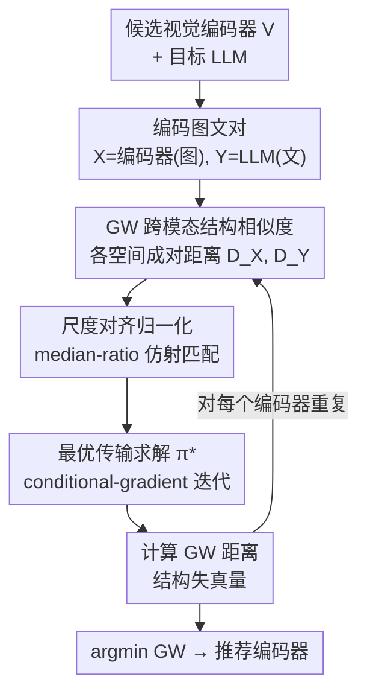

# Rethinking Model Selection in VLM Through the Lens of Gromov-Wasserstein Distance

**会议**: CVPR 2026 (Highlight)  
**arXiv**: [2605.01325](https://arxiv.org/abs/2605.01325)  
**代码**: 无（论文未提供）  
**领域**: 多模态VLM  
**关键词**: 视觉编码器选择, Gromov-Wasserstein 距离, 跨模态结构相似性, 免训练评估, 最优传输

## 一句话总结
针对「该给 VLM 选哪个视觉编码器」这个老大难问题，本文系统验证了「选最大/zero-shot 精度最高」的传统直觉几乎与最终 VLM 性能不相关，转而提出用 **Gromov-Wasserstein（GW）距离** 度量视觉表征与 LLM 文本表征之间的「结构相似性」，作为一个**免训练、纯推理**的代理指标；理论上证明 GW 距离能 bound 跨模态投影器的 Lipschitz 常数（即可学习性），实验上在 60+ 次完整 VLM 训练中比所有基线指标都更强地相关于最终性能，从而能在完整训练前 1 分钟级别地预测哪个编码器最优。

## 研究背景与动机
**领域现状**：当前 SOTA 的 VLM 基本沿用 LLaVA 的「pre-training then fine-tuning」范式——先训一个 projector 把视觉编码器和 LLM 的表征空间对齐，再联合微调两座塔。社区已经试过大量「视觉编码器 × LLM」的组合，但选编码器时靠的还是朴素经验：要么挑参数量最大的，要么挑 ImageNet zero-shot 精度最高的。

**现有痛点**：本文在 18 个 SOTA 视觉编码器上跑完整的 visual instruction tuning，发现这些经验**系统性地失效**——挑最大的、挑 zero-shot 精度最高的，都常常选不到最优编码器。更扎心的是相关性分析：视觉编码器的单模态能力（精度、尺寸）与最终 VLM 性能之间，**几乎没有统计上有意义的相关性**（Pearson |r| 仅 0.46 左右，且 Spearman 更弱）。

**核心矛盾**：如果编码器自身的视觉能力解释不了 VLM 的好坏，那真正起作用的因素是什么？作者的直觉是：除了「原始视觉能力」，视觉编码器和 LLM 之间还存在一种**兼容性（compatibility）**——编码器产出的视觉表征相对 LLM 的表征空间可能更同质或更异质，这直接决定了对齐它们的难度。一个 zero-shot 很强但与 LLM 表征「结构上格格不入」的编码器，微调后照样表现差。

**本文目标**：把这种兼容性形式化为两个模态表征分布之间的「结构相似性」，并找到一个不用真正训练就能算出来的代理指标。

**切入角度**：跨模态比较有个本质障碍——视觉和文本表征住在**不同的度量-测度空间（mm-space）**：维度不同、生成它们的可测函数不同，所以「直接算两个模态表征的距离」根本没有规范意义。作者由此想到 **Gromov-Wasserstein 距离**：它不比较点的绝对位置，而是比较两个空间各自**内部的成对距离结构**是否一致（在等距变换下不变），天然适合衡量异构空间的结构相似度。

**核心 idea**：用「视觉表征空间与 LLM 文本表征空间的 GW 距离」作为编码器选择指标——GW 距离越小，结构越兼容，跨模态映射越容易学，最终 VLM 越强。

## 方法详解

### 整体框架
方法本质是一个**免训练的打分-排序流程**：给定一批候选视觉编码器和一个目标 LLM，对每个编码器，用它编码一批图像得到视觉表征 $X$、用 LLM 编码对应文本得到文本表征 $Y$；分别算出两个空间各自的**成对距离矩阵** $D^X, D^Y$（用角距离），做**尺度对齐归一化**消除单位差异，再**解一个最优传输（OT）问题**找到跨空间的对应关系 $\pi^*$，据此算出该编码器到 LLM 的 GW 距离；最后在所有候选里取 **GW 距离最小者** 作为推荐编码器（Algorithm 1）。整个过程纯推理、零梯度，默认只采样 1000 个图文对、约 1 分钟算完。

### 关键设计

**1. GW 距离作为跨模态结构相似性代理：在不同 mm-space 之间做「等距意义下」的比较**

这一设计直接针对「不同模态表征住在不同度量空间、直接算距离无意义」的痛点。GW 距离不看点的绝对坐标，而是看两个空间各自的**内部几何**是否一致：给定一个跨空间对应关系（耦合）$\pi$，从空间 $X$ 取一对点 $(x,x')$、它们在 $Y$ 中匹配到 $(y,y')$，GW 检查 $d_X(x,x')$ 与 $d_Y(y,y')$ 是否相等，并对所有点对累计这种「结构失真」。形式上失真量为

$$E(\pi)=\sum_{x,x',y,y'} L\big(d_X(x,x'),\,d_Y(y,y')\big)\,\pi_{x,y}\,\pi_{x',y'},$$

其中本文取 $\ell\text{-}1$ 距离作惩罚函数 $L$；GW 距离则是在所有可行耦合上取下确界 $\mathrm{GW}=\inf_{\pi\in\Pi} E(\pi)^{1/2}$。度量函数 $d_X,d_Y$ 统一取**角距离** $d_X(x,x')=\cos^{-1}\!\frac{x\cdot x'}{\|x\|\|x'\|}$。它的好处是对度量/测度的具体选择不变（等距不变），所以即便视觉与文本表征维度不同、生成方式不同，也能比较它们的结构是否同构——这正是 zero-shot 精度、CCA 等指标做不到的。论文还把它与 Platonic Representation Hypothesis 的 MutualNN 指标对照：两者都先算「域内」距离再跨域比较，但 MutualNN 只看局部近邻重叠，GW 则先求全局最优耦合再加权累计成对距离差异，刻画更细。

**2. 跨模态尺度对齐（median-ratio matching）：让两个模态的成对距离落在同一量纲**

GW 的惩罚函数（$\ell\text{-}1$/$\ell\text{-}2$）对不同域的**单位尺度**很敏感，视觉与文本空间的成对距离量级天然不同，直接算会被尺度差异污染。本文先用一个**严格仿射变换**把视觉侧的成对距离矩阵缩放到与文本侧同量纲：取缩放因子

$$s=\frac{\mathrm{med}(D^Y)}{\mathrm{med}(D^X)},\qquad D^X \leftarrow s\cdot D^X,$$

其中 $\mathrm{med}(\cdot)$ 是矩阵非对角元素的中位数。用中位数比值而非均值是为了对离群点更鲁棒；因为变换是严格仿射的，它**不破坏语义结构信息**，只统一了量纲。归一化后的 $D^X$ 才是真正送进 GW 计算的距离矩阵。

**3. 用 conditional-gradient 求解最优传输耦合 $\pi^*$：把 GW 目标当作传输多胞形上的二次泛函**

算 GW 距离要先解出最小化结构失真的最优耦合 $\pi^*=\arg\min_{\pi\in\Pi}E(\pi)$，这是个二次问题。本文沿用 Peyré 等人的条件梯度（Frank-Wolfe）方案：从初始耦合 $\pi^0$ 出发，每步先对当前耦合算 GW 目标的梯度 $C^t=\nabla_\pi E(\pi^t)$，再解一个**线性 OT 子问题** $\tilde\pi^t=\arg\min_{\pi\in\Pi}\langle C^t,\pi\rangle$（标准线性最优传输，代价矩阵为 $C^t$），最后以步长 $\tau_t$ 做凸组合更新 $\pi^{t+1}=(1-\tau_t)\pi^t+\tau_t\tilde\pi^t$。在传输多胞形（紧致凸集）上，该方案在温和正则条件下收敛到 GW 目标的驻点。实现上用 Python Optimal Transport（POT）库，默认迭代 1000 次。

**4. 理论保证：GW 距离 bound 住最优跨模态投影器的 Lipschitz 常数（即可学习性）**

前三点把指标算出来了，这一点回答「为什么 GW 小就更容易学好」。作者定义 Bayes 最优跨模态映射 $g^*$ 的可实现误差 $R^*(D)=\inf_g \mathbb{E}_{(x,y)\sim D}\,d_Y(g(x),y)$，并证明（Theorem 1）：在最优耦合支撑集上的视觉点集 $S_X$ 上，$g^*$ 是 $L_{g^*}$-Lipschitz 的，且

$$L_{g^*}\le 1+r^{-1}\big(2\epsilon_\pi^*+\mathrm{GW}_\infty\big),$$

其中 $\mathrm{GW}_\infty$ 是 1-norm（$\infty$-范数）GW 距离——在最优耦合下成对距离失真的**最大间隙**，$r$ 是 $S_X$ 中点的最小间距，$\epsilon_\pi^*$ 是最坏情形 Bayes 误差。直观含义是：两个 mm-space 在 GW 意义下越兼容（$\mathrm{GW}_\infty$ 越小），Bayes 最优投影器就能用**更小 Lipschitz 常数、即更低函数复杂度**的假设实现。又因为现代神经网络的 PAC 泛化界普遍依赖预测器的 Lipschitz 常数（谱范数），这个 bound 可直接代入得到「依赖 GW 的泛化保证」，从形式上把 GW 距离与跨模态映射的**可学习性**挂上了钩。⚠️ 定理常数与符号细节以原文为准。

### 损失函数 / 训练策略
本方法本身**不涉及训练**（指标是免训练、纯推理算出来的）。用于验证的 VLM 训练沿用 LLaVA-1.5 两阶段配方：阶段一只训 MLP projector（lr=2e-3、batch=256、cosine、warmup 0.03），阶段二解锁视觉编码器与 LLM 全参微调（lr=2e-5、batch=128）；预训练用 595K 图文对（LAION/CC/SBU 经 BLIP 重标注），指令微调用 LLaVA-1.5 的 665K 图文对；全部在 8×GH200 上训练。GW 估计默认采样 1000 个图文对，视觉特征取最后一层 CLS token，文本特征取 LLM 倒数第二层隐藏表征。

## 实验关键数据

### 主实验
设置：18 个 SOTA 视觉编码器，按参数量分成 Small（<500M）与 Large（≥500M）两组分别做选择（因为只有在能力没有明显代差时，选型才真正困难）；两个基座 LLM（Qwen-2.5-7B-Instruct、LLaMa-3.1-8B-Instruct），9 个 benchmark 取平均；共 60+ 次完整 VLM 训练。下表为 Qwen-2.5-7B「Large」组的平均分（GW 选中的编码器恰好命中 Optimal）：

| 选择指标 | Average | 是否命中最优 | 说明 |
|--------|------|------|------|
| Worst（最差编码器） | 60.17 | — | 选型可挽回的性能下限 |
| Accuracy（zero-shot 精度） | 64.63 | 否 | 偏向 DFN5B-ViT-H-378 |
| RSA | 62.92 | 否 | 硬 1-1 对应，不够灵活 |
| CCA | 61.39 | 否 | 投到联合空间，丢结构信息 |
| MutualNN | 64.63 | 否 | 与 Accuracy 同选，未命中 |
| **GW（本文）** | **66.43** | **是** | 选中 Siglip-SO400M-384 |
| Optimal（事后最优上界） | 66.43 | — | GW 与之持平 |

在 Large 组，zero-shot 精度和 MutualNN 都偏向 DFN5B，而 GW 指出真正与 LLM 结构最相似的是 SigLIP-SO400M-384（尽管它 zero-shot 精度并不占优），结果证明 GW 选对了。在 Small 组 GW 与 Accuracy 打平；但 Accuracy 在两组间表现不一致（Large 组失手），意味着若把所有模型放进同一池子，Accuracy 会显著差于 GW。换 LLaMa-3.1-8B 时，CCA 在 Large 组偶然选中最优，但其与 VLM 性能的相关性极弱（见下），属于「侥幸」而非可靠指标。

**相关性分析**（Qwen-2.5-7B，14 个可比编码器；因部分非 CLIP 编码器无法直接算 zero-shot 精度而剔除）：

| 指标 | \|Pearson r\| | \|Spearman ρ\| | R² |
|------|------|------|------|
| Accuracy | 0.4629 | 0.3934 | 0.2142 |
| RSA | 0.4759 | 0.430 | 0.265 |
| CCA | 0.0430 | 0.072 | 0.018 |
| MutualNN | 0.6081 | 0.1780 | 0.3697 |
| **GW（本文）** | **0.6568** | **0.5341** | **0.4314** |

GW 是**唯一**一个 Pearson 和 Spearman 都 >0.5 的指标，简单线性拟合即可解释 43% 的方差。MutualNN 的 Pearson 看着不低（>0.5），但 Spearman/R² 明显弱，且相关方向是**负的**（按理应正相关），说明它的高相关是虚假的。

### 消融实验
论文没有传统的「模块开关」消融，而是用**鲁棒性/泛化实验**来支撑指标的有效性：

| 配置 | 关键结果 | 说明 |
|------|---------|------|
| 换基座 LLM（Qwen ↔ LLaMa） | 编码器排名高度一致 | 视觉编码器的「适配性」近似 LLM-agnostic，选型可跨 LLM 迁移 |
| 换预训练数据（LCS-558k → CC3M-595k） | GW 仍命中最优（Qwen Large 65.94、Small 65.56 均为 Optimal） | 相关性不依赖具体预训练数据集 |
| 效率（GW vs 完整训练） | GW ≈ 1 分钟 vs 完整训练 ≈ 8.5 小时 / 68 GPU-hours | 训练前即可预测，且运行时间随样本量线性增长 |

### 关键发现
- **单模态能力≈无关**：编码器尺寸、zero-shot 精度与最终 VLM 性能几乎无统计相关，传统选型经验系统性失效。
- **结构兼容性才是关键变量**：GW 距离是唯一稳定相关（双相关均 >0.5、R²=0.43）的指标，且选出的编码器常与「精度最高」不同（如 SigLIP-SO400M 胜过 DFN5B）。
- **LLM-agnostic + 数据无关**：编码器排名跨 LLM、跨预训练数据集都稳定，意味着一次选型结论可复用。
- **极低成本**：1 分钟级推理换 68 GPU-hours 训练前的可靠预测，性价比极高。

## 亮点与洞察
- **把「选编码器」从玄学变成可量化的几何问题**：核心洞察是「编码器好不好」要看它和 LLM 表征空间的**结构是否同构**，而不是它自己多强——这是一个反直觉但被数据强力支撑的视角转换。
- **GW 距离用得很贴题**：跨模态维度不同、绝对距离无意义，正好是 GW「等距不变、只比内部几何」的主场；median-ratio 仿射归一化这个小设计干净地解决了量纲问题，值得借鉴到任何异构空间比较任务。
- **理论与实践闭环**：不止给经验相关，还证明 GW 能 bound 最优投影器的 Lipschitz 常数，把「结构相似 → 易学」这件事落到泛化界上，这种「指标—可学习性」的桥接思路可迁移到其他模态配对/迁移学习选型。
- **免训练 NAS 式思路**：1 分钟选型 vs 68 GPU-hours，这套「先用结构相似度筛 backbone、再训」的范式对算力受限的 VLM 研发非常实用。

## 局限性 / 可改进方向
- **作者承认**：这是该方向的初步工作，模型池可以更大（更多 SOTA 编码器）才更有说服力；目前只验证了图像-文本一对模态，虽然框架本身与模态无关，但音频/视频等其他模态配对尚未验证。
- **自己发现的局限**：相关性虽是最强但 R² 仅 0.43，离「精确预测」还有距离，GW 更像是强先验筛选器而非完美预言；实验只在 LLaVA-1.5 配方与 ≤8B 的两个 LLM 上做，更大模型 / 不同对齐范式（如更复杂 projector、多分辨率视觉 token）下是否成立未知；采样 1000 图文对、取 CLS token / 倒数第二层这些实现选择对 GW 估计稳定性的影响也未充分消融。
- **改进思路**：把 GW 距离与少量轻量探针训练结合做两阶段选型，或把指标推广到「编码器 + projector 结构」联合选型；探索熵正则 GW 等变体以提升估计平滑性与可扩展性。

## 相关工作与启发
- **vs zero-shot Accuracy / 模型尺寸**：传统经验只看编码器单模态能力，本文证明它们与 VLM 性能几乎不相关；GW 转而看跨模态结构兼容性，相关性显著更强。
- **vs MutualNN（Platonic Representation Hypothesis）**：两者都「先算域内距离再跨域比」，但 MutualNN 只看局部近邻重叠、且本文实验中相关方向为负（虚假相关）；GW 先求全局最优耦合再加权累计成对距离差异，刻画更细、相关更可靠。
- **vs RSA（表征相似性分析）**：RSA 也比成对距离矩阵的相关，但假设固定的硬 1-1 对应，不如 GW 的软最优传输灵活。
- **vs CCA（典型相关分析）**：CCA 找线性投影把两空间塞进联合空间以最大化相关，虽缓解了度量不匹配，但**抹掉了结构信息**，无法刻画异构空间的几何相似性，本文中相关性几乎为零（R²=0.018）。

## 评分
- 新颖性: ⭐⭐⭐⭐⭐ 把视觉编码器选型重构为跨模态结构相似性问题，并用 GW 距离 + 可学习性理论给出免训练代理，视角新且有理论支撑。
- 实验充分度: ⭐⭐⭐⭐ 60+ 次完整训练、2 个 LLM、9 个 benchmark、跨数据集鲁棒性都覆盖；但模型池仅 18 个、只到 8B、相关 R² 仍偏低。
- 写作质量: ⭐⭐⭐⭐ 动机清晰、问题切入漂亮，理论与实验衔接好；公式符号偏密、缺开源代码略减分。
- 价值: ⭐⭐⭐⭐⭐ 1 分钟换 68 GPU-hours 的可靠选型预测，对算力受限的 VLM 研发实用性极高。

> ⚠️ 摘要写「19 个编码器」、正文写「18 个」，本文以正文 18 为准；相关性分析因部分编码器不可比而限定在 14 个。具体数值/定理常数以原文为准。

<!-- RELATED:START -->

## 相关论文

- [\[ICLR 2026\] Through the Lens of Contrast: Self-Improving Visual Reasoning in VLMs](../../ICLR2026/multimodal_vlm/through_the_lens_of_contrast_self-improving_visual_reasoning_in_vlms.md)
- [\[CVPR 2026\] µVLM: A Vision Language Model for µNPUs](mvlm_a_vision_language_model_for_mnpus.md)
- [\[CVPR 2026\] RE-VLM: Event-Augmented Vision-Language Model for Scene Understanding](re-vlm_event-augmented_vision-language_model_for_scene_understanding.md)
- [\[CVPR 2026\] Beyond Graph Model: Reliable VLM Fine-Tuning via Random Graph Adapter](beyond_graph_model_reliable_vlm_fine-tuning_via_random_graph_adapter.md)
- [\[NeurIPS 2025\] Metacognitive Sensitivity for Test-Time Dynamic Model Selection](../../NeurIPS2025/multimodal_vlm/metacognitive_sensitivity_for_test-time_dynamic_model_selection.md)

<!-- RELATED:END -->
