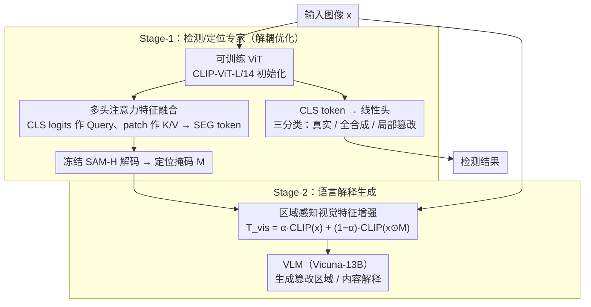

# Rethinking VLMs for Image Forgery Detection and Localization

**会议**: CVPR 2026  
**arXiv**: [2603.12930](https://arxiv.org/abs/2603.12930)  
**代码**: [sha0fengGuo/IFDL-VLM](https://github.com/sha0fengGuo/IFDL-VLM)  
**领域**: 多模态VLM  
**关键词**: 图像伪造检测, 视觉语言模型, 伪造定位, 可解释性, AIGC安全

## 一句话总结

提出 IFDL-VLM 框架，发现 VLM 固有的语义合理性偏向（而非真实性）会阻碍伪造检测性能，因此将检测/定位与语言解释解耦为两阶段优化，并利用定位掩码作为 VLM 的辅助输入增强可解释性，在 9 个基准上全面达到 SOTA。

## 研究背景与动机

随着 AIGC 技术（扩散模型、GAN、自回归 Transformer）的发展，图像篡改变得极为便利，图像伪造检测与定位（IFDL）面临严峻挑战。现有方法尝试将 VLM（如 CLIP + LLM + SAM）引入 IFDL 以增强可解释性，但作者发现：

**语义合理性 vs 真实性**：CLIP 等 VLM 在预训练时优化的是高层语义与语言的对齐，导致篡改图像即使物体被替换/添加，其视觉 token 表征仍与原图高度相似（余弦相似度高达 96-98%），VLM 无法区分真伪。

**现有流水线的耦合问题**：如 SIDA、FakeShield 等方法将检测、定位和语言解释在同一 VLM 中联合优化，但 VLM 缺乏伪造相关概念的先验，反而拖累检测/定位性能。

核心洞察：定位掩码本身就显式编码了伪造概念，可以反过来作为 VLM 的额外先验，简化其训练优化。

## 方法详解

### 整体框架

这篇论文要解决的核心矛盾是：VLM 天生擅长判断一张图"语义上合不合理"，却不擅长判断它"是不是被篡改过"——而后者才是伪造检测真正需要的能力。既有方法（SIDA、FakeShield）让一个 VLM 同时扛起检测、定位、生成解释三件事，结果 VLM 的语义偏向反而把检测/定位拖下水。IFDL-VLM 的破局思路是把任务拆成两段、各司其职。Stage-1 先训练一套不含语言模型的视觉专家——可训练 ViT 配上冻结的 SAM-H——专心把"这张图是不是假的、假在哪块"判准；Stage-2 再把第一阶段产出的定位掩码当作显式的"伪造线索"喂回 VLM，让 VLM 只负责它擅长的事：用自然语言把篡改区域和内容讲清楚。整条链路是"图像 → 专家模型出检测结果 + 定位掩码 → 掩码增强视觉特征 → VLM 生成解释"。

### 关键设计

**1. 解耦优化：把检测/定位从 VLM 的语义偏向里摘出来**

作者观察到 CLIP 这类 VLM 在预训练时对齐的是高层语义，篡改图像即使物体被换掉，视觉 token 与原图的余弦相似度仍高达 96–98%，这种"语义合理性优先"的本能会直接干扰低层伪造痕迹的判别。所以 IFDL-VLM 索性不让 VLM 碰检测/定位：Stage-1 用一个以 CLIP-ViT-L/14 初始化的可训练 ViT，提取 $\langle\text{SEG}\rangle$ token 送入冻结的 SAM-H 解码出定位掩码，同时用全局 $\langle\text{CLS}\rangle$ token 做三分类（真实 / 全合成 / 局部篡改）。检测和定位都在这个纯视觉专家里完成，不再被 VLM 的偏向裹挟，这也是后面所有提升的根基。

**2. 多头注意力特征融合：一套 ViT 同时供给定位和检测两个出口**

Stage-1 的 ViT 并不各任务各训一套，而是用同一份 patch-level 特征分流出两个出口。全局 $\langle\text{CLS}\rangle$ token 走一个线性头做图像级三分类（真实 / 全合成 / 局部篡改）；同时它产生的分类 logits 作为 Query、patch tokens 作为 Key/Value，经多头注意力融合成 $\langle\text{SEG}\rangle$ token，当作冻结 SAM-H 的 prompt embedding 去解码像素级定位掩码。一份特征喂两个出口，让定位与检测共享同一套伪造表征，既省参数也保证两个任务对"哪里可疑"的判断一致。

**3. 区域感知视觉特征增强：让定位掩码反过来当 VLM 的先验**

这是 Stage-2 的核心创新，也是"解耦"之后的"反哺"环节。常规做法是把整张图丢给 VLM，让它自己从数据里隐式学出"哪里被改了"——但 VLM 既然缺乏伪造概念的先验，这一步学起来很吃力。IFDL-VLM 改成把 Stage-1 已经算好的定位掩码 $M$ 与原图 $x$ 逐元素相乘，抠出伪造区域，再和原图分别过 CLIP 编码后加权融合：

$$T_{vis} = \alpha \cdot \text{CLIP}(x) + (1 - \alpha) \cdot \text{CLIP}(x \odot M)$$

其中 $\alpha = 0.5$。这样融合出来的视觉特征里，一半来自全图语境、一半来自被高亮的伪造区域，等于把"伪造概念"直接写进了 VLM 的输入，省去它从数据里隐式摸索的过程，真伪图像的表征也因此更可分。推理阶段没有真值掩码，就用 Stage-1 预测的 $\hat{M}$ 顶替 $M$，整条链路闭合——比如一张人脸被局部换过的图，Stage-1 先框出下巴附近的篡改区，Stage-2 拿到这块区域增强后的特征，VLM 才能稳定地说出"下颌轮廓被替换"。

### 损失函数 / 训练策略

**Stage-1 损失**：

$$\mathcal{L}_{st\text{-}1} = \mathcal{L}_{det} + \mathcal{L}_{loc} = \lambda_{det}\mathcal{L}_{ce}(\hat{D}, D) + \lambda_{bce}\mathcal{L}_{bce}(\hat{M}, M) + \lambda_{dice}\mathcal{L}_{dice}(\hat{M}, M)$$

其中 $\lambda_{bce} = \lambda_{dice} = \lambda_{det} = 1.0$。

**Stage-2 损失**：

$$\mathcal{L}_{st\text{-}2} = \mathcal{L}_{ce}(\hat{y}_{des}, y_{des})$$

即 LLM 输出语言解释的自回归交叉熵损失。LLM 骨干采用 Vicuna-13B。

训练细节：AdamW 优化器，学习率 1e-5，线性 warmup-decay，batch size 4 + 梯度累积 10，FP16/BF16 混合精度。

## 实验关键数据

### 主实验

**SID-Set 检测性能**：

| 方法 | 整体 Acc | 整体 F1 | 说明 |
|------|---------|---------|------|
| SIDA-13B | 0.94 | 0.94 | 之前 SOTA |
| UnivFD | 0.65 | 0.80 | 传统方法 |
| **IFDL-VLM** | **0.997** | **0.998** | 近乎完美 |

**SID-Set 定位性能**：

| 方法 | AUC | F1 | IoU | 提升 |
|------|-----|----|----|------|
| SIDA-7B | 0.87 | 0.74 | 0.44 | - |
| **IFDL-VLM** | **0.99** | **0.87** | **0.65** | +21% IoU |

**跨数据集泛化（8 数据集平均）**：

| 方法 | 平均 IoU | 平均 F1 | 提升 |
|------|---------|---------|------|
| FakeShield | 0.39 | 0.45 | - |
| SIDA-13B* | 0.38 | 0.45 | - |
| **IFDL-VLM** | **0.47** | **0.58** | +13% IoU, +19% F1 |

### 消融实验

**可解释性评估（GPT-5 自动评分，0-5 分）**：

| 维度 | SIDA-13B | IFDL-VLM | 说明 |
|------|----------|----------|------|
| Mask | 1.22 | **2.28** | 定位掩码质量 |
| Tampered Content | 1.14 | **1.98** | 篡改内容描述 |
| 综合 Overall | 1.44 | **2.36** | 提升 63.9% |

**CSS 语义相似度评估**：

| 维度 | SIDA-13B | IFDL-VLM | 说明 |
|------|----------|----------|------|
| Areas | 0.61 | **0.67** | 篡改区域 |
| Tampered Content | 0.44 | **0.49** | 篡改内容 |
| CSS(weighted) | 0.57 | **0.62** | 加权提升 8.8% |

### 关键发现

- **VLM 先验对检测/定位无益**：CLIP 视觉特征在真伪图像间余弦相似度 96-98%，几乎无法区分。解耦后检测/定位性能大幅提升
- **定位掩码辅助 VLM**：将掩码作为显式伪造概念输入 VLM，可解释性显著提升（GPT-5 评分 +63.9%，CSS +8.8%）
- **人类评估**：50 名评估者中 65.2% 偏好 IFDL-VLM 的解释，仅 11.3% 偏好 SIDA-13B
- **跨数据集泛化**：在 8 个跨域数据集中 7 个上取得最佳性能，验证了框架的泛化能力

## 亮点与洞察

- 深刻揭示了 VLM "语义合理性偏向"对伪造检测的负面影响——这是一个反直觉但极有价值的发现
- "解耦+反哺"的设计哲学优雅：先训练专家模型做好检测/定位，再用结果辅助 VLM 做解释，而非让 VLM 同时承担所有任务
- 方法简洁但效果显著——Stage-1 仅加入 ViT + SAM 冻结解码器，Stage-2 仅修改视觉输入，没有复杂架构设计

## 局限与展望

- Stage-2 依赖 Stage-1 定位掩码质量，若定位失败则解释也会受影响（级联误差）
- 仅在 Vicuna-13B 上验证，未探索更强 LLM（如更大规模模型）是否能进一步提升可解释性
- 跨数据集泛化实验中在 IMD2020 上未超越 FakeShield，特定数据集仍有提升空间
- 未讨论计算效率——两阶段流水线在推理时的延迟开销

## 相关工作与启发

- **SIDA / FakeShield**：当前 IFDL + VLM 的代表方法，将 CLIP + LLM + SAM 耦合训练，本文证明解耦更优
- **MVSS-Net / CAT-Net**：传统 IFDL 方法，依赖手工先验（BayarConv、DCT）检测低层异常
- **SAM**：本文冻结 SAM-H 图像编码器，仅微调掩码解码器，有效利用其分割能力
- 启发：对于多模态辅助任务，先让专家模型做好基础判断，再将结果反哺给大模型做高层理解，可能是更好的范式

## 评分

- 新颖性: ⭐⭐⭐⭐ (VLM 偏向分析+解耦反哺设计，洞察深刻)
- 实验充分度: ⭐⭐⭐⭐⭐ (9 基准 + 检测/定位/可解释性三维评估 + 人类评估)
- 写作质量: ⭐⭐⭐⭐⭐ (动机清晰，从观察到方案的推导逻辑严谨)
- 价值: ⭐⭐⭐⭐⭐ (对 IFDL 领域有范式级贡献)

<!-- RELATED:START -->

## 相关论文

- [\[CVPR 2026\] Activation Matters: Test-time Activated Negative Labels for OOD Detection with Vision-Language Models](activation_matters_test-time_activated_negative_labels_for_ood_detection_with_vi.md)
- [\[CVPR 2026\] MODIX: Training-Free Multimodal Information-Driven Positional Index Scaling for VLMs](modix_positional_index_scaling.md)
- [\[CVPR 2026\] Do Vision Language Models Need to Process Image Tokens?](do_vision_language_models_need_to_process_image_tokens.md)
- [\[CVPR 2026\] Mind the Way You Select Negative Texts: Pursuing the Distance Consistency in OOD Detection with VLMs](mind_the_way_you_select_negative_texts_pursuing_the_distance_consistency_in_ood_.md)
- [\[CVPR 2026\] Rethinking MLLM Itself as a Segmenter with a Single Segmentation Token](rethinking_mllm_itself_as_a_segmenter_with_a_single_segmentation_token.md)

<!-- RELATED:END -->
