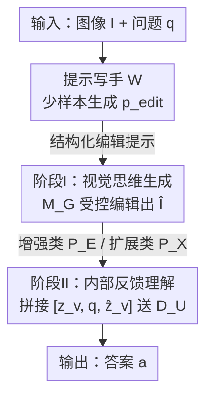

# Reversing the Flow: Generation-to-Understanding Synergy in Large Multimodal Models

**会议**: CVPR 2026  
**arXiv**: [2605.15792](https://arxiv.org/abs/2605.15792)  
**代码**: 待确认  
**领域**: 多模态VLM（统一理解-生成模型）  
**关键词**: 统一多模态模型、生成增强理解、视觉思维、零样本提示、BAGEL

## 一句话总结
本文反转了统一多模态模型里"理解→生成"的单向流，提出"生成→理解"（G→U）协同：让模型先用自身生成能力对输入图像做受控编辑（去模糊 / 外扩 / 换视角等）造出一张"视觉思维"图，再把它喂回模型辅助作答；在 12 个 benchmark 上零训练、零外部工具地稳定提升了多模态理解，并揭示生成保真度是理解增益的上界、模型"能想象却不知道该想象什么"。

## 研究背景与动机
**领域现状**：统一多模态模型（BAGEL、Janus、BLIP3-o、Show-o 等）把自回归推理和扩散生成塞进同一个 Transformer，号称既能"看懂"又能"画出"。理想中这是一个闭环——理解指导生成、生成又验证理解，两种能力互相增强。

**现有痛点**：但现实里这种"统一"是**单向**的。所有现有系统都遵循"视觉/语言骨干先理解、再 condition 一个 decoder 去生成图像"的流水线（即 U→G 范式），生成永远是推理的**终点**，从不反哺回理解。更糟的是，为增强生成而持续训练，往往会以**削弱模型原有的理解能力**为代价。于是即便推理和合成共享参数，它们的交互本质上仍是一条单行道。

**核心矛盾**：架构上统一了，**认知上仍然不对称**——生成受益于理解，而理解从生成里什么也得不到。这门领域花了多年教模型"从理解去生成"，却几乎没问过："生成本身能不能教会理解？"

**本文切入角度**：人类从不把想象当作输出。当感知不确定时，我们会**重建缺失细节、想象其他视角、模拟上下文**，直到意义变清晰——想象是理解的手段而非终点。作者由此提出：模型能不能用它**自己的生成能力**来改善理解？

**核心 idea**：反转信息流，提出 **Generation-to-Understanding（G→U）协同**——把视觉生成重新定义为推理**之前**的一个内部分析步骤：给定图像和问题，先让模型做一次受控生成（增强细节 / 扩展上下文 / 可视化结构关系），产出一张"视觉思维"图，再把它作为额外证据喂回模型来精化感知。整个机制**纯靠两阶段零样本提示实现，不重训、不调外部工具**。

## 方法详解

### 整体框架
G→U 是一个**两阶段、自包含的零样本闭环**，跑在一个本身就同时具备理解通路 $\mathcal{M}_U$ 和生成通路 $\mathcal{M}_G$（共享参数）的统一模型 $\mathcal{M}$ 上。给定图像 $I$ 和文本问题 $q$：

$$\hat{I}=\mathcal{M}_G(I,q;p_{edit}),\qquad a=\mathcal{M}_U(I,\hat{I},q)$$

**阶段 I（视觉思维生成）**：用生成通路 $\mathcal{M}_G=\mathcal{D}_G\circ f_v$，在一条结构化编辑提示 $p_{edit}$ 的引导下，把原图 $I$ 变换成辅助图 $\hat{I}$（称为 *visual thought*）。这一步是"内部分析"——它在重建 / 精化能帮助理解的视觉证据，而**不是**事后合成。**阶段 II（内部反馈理解）**：把生成的 $\hat{I}$ 重新塞回模型，与原始输入拼成增强上下文 $\mathcal{C}=\{I,\hat{I},q\}$，理解通路同时编码两张图得到 $z_v=f_v(I)$、$\hat{z}_v=f_v(\hat{I})$，拼接成 $[z_v,q,\hat{z}_v]$ 送入推理 decoder 出答案 $a=\mathcal{D}_U([z_v,q,\hat{z}_v])$。当 $\hat{I}=I$ 时，流程自然退化为标准 baseline，保证完全向后兼容。

编辑提示 $p_{edit}$ 既可以手工设计，也可以由一个基于 GPT-4o-mini 的**自动提示写手**少样本生成，从而把这个闭环扩展到任意新任务。整体实例化在 BAGEL (7B) 上——它的集成 Transformer 把扩散合成和自回归推理耦合在共享 self-attention 层里，天然支持 $\mathcal{M}_G$ 与 $\mathcal{M}_U$ 之间的双向信息流，是 G→U 的理想载体。

### 关键设计

**1. 受控生成作为推理前置步：把生成放在理解之前而非之后**

这是全文的认知重构。传统 U→G 里生成是推理的产物（$\hat{I}=\mathcal{D}_G(f_v(I),q)$），生成完就结束了；G→U 把它移到推理**前面**，让 $\hat{I}$ 成为推理时的"额外证据"。形式化地，原本一次性的 $a=\mathcal{M}_U(I,q)$ 被改写成 $\hat{I}=\mathcal{M}_G(I,q;p_{edit})$ 后接 $a=\mathcal{M}_U(I,\hat{I},q)$ 的两步闭环 $\{I\to\hat{I}\to a\}$。这样有效的关键在于：每张 $\hat{I}$ 可被理解为模型对"如果遮挡 / 歧义被解决、场景该长什么样"的**内部假设**，它把模型潜在的世界知识**外化成视觉形式**，给后续推理提供显式证据。所有提示都被刻意设计成**不泄露答案、不给 trivial 提示**，确保增益来自感知证据而非作弊。

**2. 双族编辑提示库：用"增强"和"扩展"两条互补路径覆盖不同推理需求**

作者把编辑提示库 $\mathcal{P}$ 分成两个功能互补的家族，对应两种帮助理解的方式。**增强类 $\mathcal{P}_E$**（low-level）：去噪、去模糊、曝光校正等底层精化，提升感知保真度、锐化轮廓、恢复对比度，直接利好依赖局部视觉证据的任务（数数、属性识别、颜色推理）——对应"感知富化"。**扩展类 $\mathcal{P}_X$**（high-level）：外扩补全、背景重建、视角变换、移除干扰物、辅助线生成等语义操作，调用模型内部世界模型来扩展上下文、模拟反事实，补上缺失的空间 / 关系线索——对应"上下文补充"，支撑高层推理。这种分类不是凑数：实验显示增强类对感知任务、扩展类（如 novel view、zoom-in）对空间 / 逻辑推理任务各有侧重，**不同提示族对不同任务类型表现出截然不同的迁移模式**。

**3. 自动提示写手：让模型用少样本上下文学习"决定怎么想象"**

手工提示有效但无法扩展到多样任务。作者引入一个基于 GPT-4o-mini 的提示写手 $\mathcal{W}$，给它 $K$ 个示例三元组 $\{(I_i,q_i,p_i)\}_{i=1}^K$，通过上下文学习产出任务专属编辑提示 $p_{edit}=\mathcal{W}(I,q;\{(I_i,q_i,p_i)\}_{i=1}^K)$，默认 $K=5$，并用语义一致性 + 词汇多样性过滤生成的提示以保证鲁棒。它在把编辑语义泛化到新任务的同时防止答案泄露，是迈向"自反思视觉推理"的早期一步。值得注意的是，作者也测了让 **BAGEL 自己当写手（Self-Prompt）**——结果它能造出语法合法、视觉连贯的编辑指令，却常聚焦肤浅改动、缺乏任务意识，这正是本文最重要的负面发现（见亮点）。

### 损失函数 / 训练策略
**无训练**。整个框架在零样本设定下运行，不做任何 fine-tuning、不加额外参数。BAGEL 的编辑用其默认扩散设置：30 步去噪、文本 CFG=4.0、图像 CFG=1.0。自动提示写手用 5 个上下文示例。所有"代价"只是一次额外的图像生成 + 一次额外的视觉编码。

## 实验关键数据

### 主实验
评测构建了专用套件 **VisThink-Bench**（1595 个 VQA 样本，取自 12 个 benchmark 的 34 个细粒度子任务，分感知 / 逻辑推理 / 空间推理三大类），并在 7 个标准 benchmark 上对比。下表为 G→U 加持的 BAGEL 与各类模型在标准 benchmark 上的结果（均为 7B 量级）：

| 模型 | MMB | MME-P | MME-S | MMVet | MMStar | KiVA | HallBench | R-Bench |
|------|-----|-------|-------|-------|--------|------|-----------|---------|
| Qwen2.5-VL 7B（理解专用） | 83.5 | - | 2347 | 67.1 | 63.9 | - | - | - |
| Janus-Pro 7B（统一） | 79.2 | 1567 | - | 50.0 | - | - | - | - |
| MetaQuery-XL 7B（统一） | 83.5 | 1685 | - | 66.6 | - | - | - | - |
| **BAGEL（baseline）** | 83.7 | **1686** | **2320** | 62.7 | 66.7 | 32.9 | 50.9 | 70.1 |
| **BAGEL + G→U（本文）** | **85.5** | 1662 | 2315 | 62.1 | **67.9** | **35.2** | **55.1** | **71.7** |

相对 vanilla BAGEL：MMBench +1.8%、MMStar +1.2%、HallusionBench +4.2%、R-Bench +1.6%、KiVA +2.3。说明生成反馈强化了上下文推理、并在失真下稳定了感知。专用理解模型（Qwen2.5-VL、InternVL2.5）绝对分更高，但依赖领域调优、且生成与推理之间没有认知耦合；本文**零微调**就缩小了差距。

在 VisThink-Bench 上按 34 类细分：3D 高度估计、错觉推理、颜色识别等任务增益**超过 10%**（这些恰好依赖局部对比 / 空间布局 / 细尺度细节——正是视觉思维强化的线索）；人 / 物计数、形状识别等复杂场景为中等增益；而文字 / 图案识别等**符号密集任务略有下降**（生成先验缺乏离散 token 保真度）。

### 消融实验
| 配置 | R-Bench | HallBench | MMStar | AVG | 说明 |
|------|---------|-----------|--------|-----|------|
| BAGEL（baseline） | 70.1 | 50.9 | 66.7 | 62.6 | 原始模型 |
| BAGEL Textual CoT | 63.6 | 50.4 | 59.4 | **57.8** | 文本思维链反而掉 4.8 |
| ① Replace（换图） | 70.1 | 50.5 | 67.2 | 62.6 | 用编辑图替换原图 |
| ② Concat（拼接，本文用） | 70.9 | 53.1 | 66.5 | **63.5** | 两图并列，增益最高 |
| ③ VAE Concat | 69.9 | 42.2 | 65.2 | 59.1 | 特征级融合，崩溃 |
| ④ Self-Prompt | 70.1 | 53.3 | 66.8 | 63.4 | 模型自己写提示 |
| ⑤ Gemini-2.5-Flash | 72.9 | 52.4 | 67.7 | 64.3 | 外部写手 |
| ⑥ GPT-4o-mini（本文） | 71.7 | 55.1 | 67.9 | **64.9** | 最佳 |

### 关键发现
- **生成保真度是理解增益的上界**：用 VIE 指标量化 BAGEL 编辑质量（平均语义一致性 5.12、感知质量 5.41），与下游准确率增益做线性回归，二者呈统计显著正相关（$R^2=0.27$，$p<0.01$）——"想象得越好，理解得越好"，但相关性中等，说明增益还取决于任务和提示。
- **视觉思维 > 文本思维链**：文本 CoT 把平均准确率从 62.6 拉到 57.8，因为言语推理在视觉理解上引入了虚假语言偏置；视觉思维在**图像空间**做 pre-hoc 推理（重塑感知再理解），文本 CoT 只是 post-hoc 事后解释。
- **拼接 > 替换 >> VAE 融合**：Concat（63.5）最稳，Replace 也优于 baseline，但 VAE Concat（59.1）崩溃——用 VAE 特征后模型陷入**模态混淆**，分不清自己该"生成"还是"理解"。
- **模型能想象，却不知道该想象什么**：Self-Prompt（63.4）能造出合法连贯的编辑指令，但常聚焦肤浅改动、缺乏任务意识、多样性低；外部写手（Gemini 64.3、GPT-4o-mini 64.9）任务对齐更好。这暴露当前统一模型缺乏指导想象的**元认知**。

## 亮点与洞察
- **"反转信息流"是一个被整领域忽视的视角**：所有人都在做 U→G，本文第一个系统性论证为什么 U→G 范式天然阻断了感知与合成的互惠，并给出第一个可操作的 G→U 框架。这种"把别人当终点的东西挪到起点"的重构思路非常可迁移。
- **零训练、零外部工具、纯提示**：不像 "thinking with images" 那条线要么 textualize 成长串图文 CoT、要么外挂 OCR / 检测器 / Python 解释器，G→U 完全用模型**自身**的生成能力当"视觉思维"机制，理论上生成函数的多样性能映射更广的推理过程，做到"想象超越图像"而非仅"用图像思考"。
- **诚实的负面结论同样有价值**："模型能想象但不知道想象什么"这条发现，把统一模型的认知缺口讲透了——它指出下一步不是更强的生成，而是**决定该想象什么**的元认知能力。论文标题"想象不是理解的终点而是开端"由此立住。
- **可迁移 trick**：把生成当作可控的"证据合成器"前置到任意 VQA/感知任务前，用保真度指标（如 VIE）来**预测**该不该信任这条视觉思维——这套"先想象-再判断想象质量-再决定是否采纳"的范式可以搬到其他需要中间表征的推理任务。

## 局限性 / 可改进方向
- **生成保真度封顶**：当生成器无法忠实重建细粒度 / 符号细节（文字、图表、小数字）时，视觉思维不带来新证据，生成沦为"重复"而非"反思"——理解无法超越想象能忠实重建的范围。这也解释了符号密集任务为何掉点。
- **抽象提示的循环推理**："提取最显著物体""画一幅同风格的画"这类高层提示需要先理解才能生成，形成自指闭环——模型无法生成它本就不理解的东西，生成因此提供不了额外洞察。
- **缺乏外推式想象**：当前模型是**插值式**而非预测式推理。要求因果预期或时间模拟（预测运动、推断未来事件）的提示一致失败，暴露多模态系统缺乏因果世界模型。视觉思维在这里退化成模式补全。
- **元认知缺口（作者主张的核心未解问题）**：模型能在被指示时想象，却不能可靠判断"该想象什么"。如何让模型自主、任务对齐地决定编辑类型，是迈向真正自反思认知的下一关。
- （自己观察）增益绝对值偏小：除 HallusionBench +4.2% 外，多数 benchmark 提升在 1–2 个点，且需多一次完整图像生成，推理成本接近翻倍——实际部署需权衡 cost/gain；$R^2=0.27$ 也说明可解释方差有限。

## 相关工作与启发
- **vs U→G 统一模型（BAGEL / Janus / BLIP3-o / Show-o）**：它们在共享参数下做"理解驱动生成"，本文反过来做"生成服务理解"，区别在于把生成从推理终点挪到推理前置步；优势是零训练即给已有统一模型加一条互惠通路，劣势是受限于该模型自身的生成保真度。作者选 BAGEL（集成扩散 Transformer）正因其原生具备双向信息流。
- **vs "Thinking with Images" 外部工具/代码路线（agentic 框架、可执行代码）**：它们把视觉推理外包给固定工具库或外部解释器，本文用模型**内生**生成能力当思维机制，不依赖外部执行，理论覆盖更广的"想象"空间（自由编辑 / 增强 / 换视角）。
- **vs 文本链式思维（Textual CoT）**：CoT 把推理 textualize，本文论证在视觉任务上文本 CoT 会引入语言偏置反而掉点（57.8 vs 62.6），视觉思维在图像空间做 pre-hoc 推理更对齐感知。
- **vs 外接扩散器的功能分离设计（MetaQuery 等）**：那类用 adapter 把 LLM 接到独立 diffuser、传"语义条件"token，本文认为这种功能分离从根上限制了深层双向知识交互，因此选共享 Transformer 的集成方案。

## 评分
- 新颖性: ⭐⭐⭐⭐⭐ 第一个系统性提出并论证"生成→理解"反向协同，重构了统一多模态的认知框架，视角稀缺。
- 实验充分度: ⭐⭐⭐⭐ 12 benchmark + 自建 VisThink-Bench + 保真度相关性 + 多写手/拼接策略消融，覆盖广；但绝对增益偏小、只在 BAGEL 一个底座验证。
- 写作质量: ⭐⭐⭐⭐⭐ 动机叙事（人类想象类比）清晰有力，负面发现诚实，标题升华到位。
- 价值: ⭐⭐⭐⭐ 零训练即用、思路高度可迁移，且指出了统一模型的元认知缺口这一重要未解问题，方向价值大于当前数值收益。

<!-- RELATED:START -->

## 相关论文

- [\[CVPR 2026\] Modeling Cross-vision Synergy for Unified Large Vision Model](modeling_cross-vision_synergy_for_unified_large_vision_model.md)
- [\[CVPR 2026\] UniCompress: Token Compression for Unified Vision-Language Understanding and Generation](unicompress_token_compression_for_unified_vision-language_understanding_and_gene.md)
- [\[CVPR 2026\] VQRAE: Representation Quantization Autoencoders for Multimodal Understanding, Generation and Reconstruction](vqrae_representation_quantization_autoencoders_for_multimodal_understanding_gene.md)
- [\[CVPR 2026\] DuoGen: Towards Autonomous Interleaved Multimodal Generation](duogen_towards_autonomous_interleaved_multimodal_generation.md)
- [\[CVPR 2026\] HBridge: H-Shape Bridging of Heterogeneous Experts for Unified Multimodal Understanding and Generation](hbridge_h-shape_bridging_of_heterogeneous_experts_for_unified_multimodal_underst.md)

<!-- RELATED:END -->
