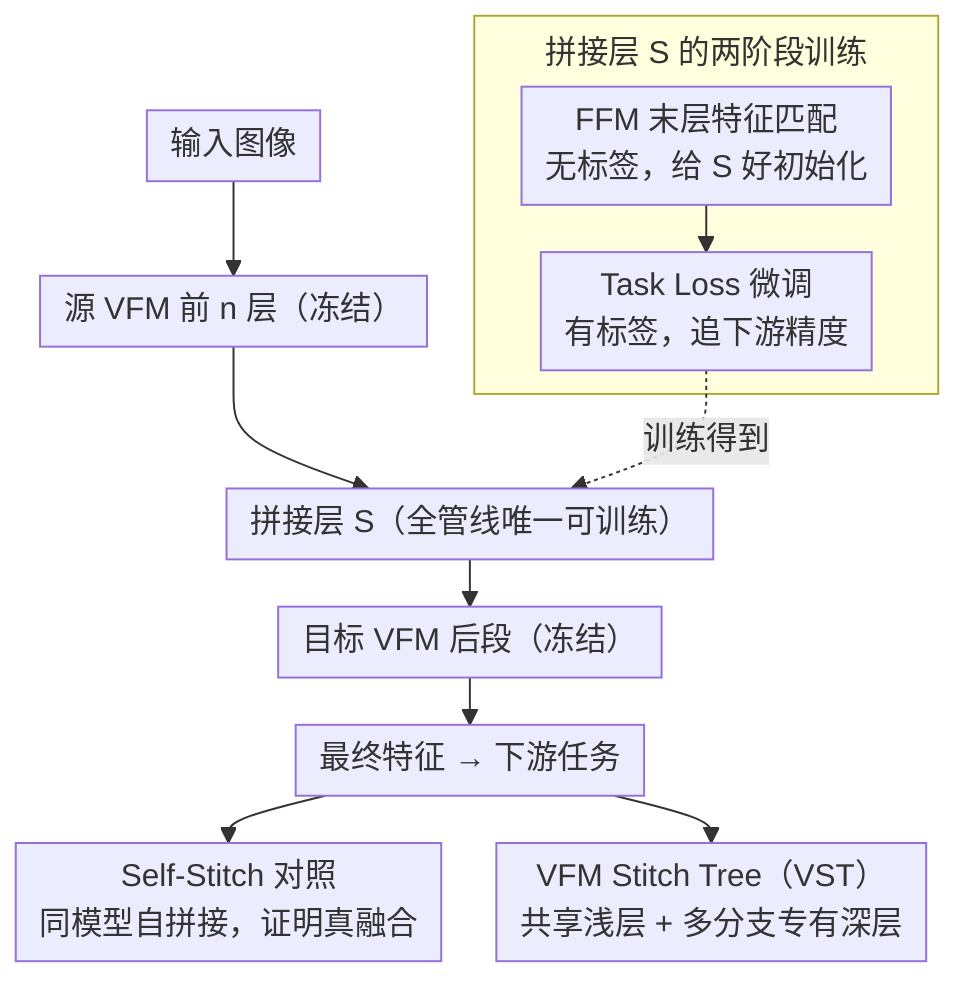

# Revisiting Model Stitching in the Foundation Model Era

**会议**: CVPR 2026  
**arXiv**: [2603.12433](https://arxiv.org/abs/2603.12433)  
**代码**: 无  
**领域**: 多模态VLM / 模型融合  
**关键词**: 模型拼接, 视觉基础模型, 表示相容性, VFM Stitch Tree, 多模态LLM

## 一句话总结
本文系统研究视觉基础模型（VFM）之间的拼接可行性，发现传统方法在VFM上失效，提出"Final Feature Matching + Task Loss"两阶段训练策略使异构VFM可靠拼接，拼接模型甚至能超越两个单独VFM，进而提出VFM Stitch Tree（VST）架构为多VFM系统提供可控的精度-效率权衡方案。

## 研究背景与动机

1. **领域现状**：视觉基础模型（如CLIP、DINOv2、SigLIP 2）在不同目标函数、数据集和模态组合下预训练，已成为各类下游任务的默认backbone。多模态系统（如MoF-LLaVA、Cambrian-1）越来越多地同时使用多个VFM以捕获互补视觉信息。
2. **现有痛点**：
    - 模型拼接（model stitching）作为测量表示兼容性的探针工具，已有研究表明同数据集训练的小模型（如ResNet-18 on CIFAR-10）可以拼接，但对异构VFM是否可拼接是未知的。
    - 传统拼接训练方法（Layer Feature Matching和Task Loss Training）在VFM上失效——前者在浅层拼接时中间层匹配误差会累积放大导致最终特征偏差大，后者在浅层拼接时梯度需穿过长链冻结层导致优化困难。
    - 使用多个VFM带来线性计算/内存开销（k个VFM就是k倍），缺乏高效的共享机制。
3. **核心矛盾**：VFM在预训练数据（LAION vs LVD-142M vs WebLI）、目标函数（对比学习 vs 自监督重建）、模态组合（纯视觉 vs 视觉-语言）上差异巨大，直接用简单变换桥接它们的中间表示是不够的。
4. **本文要解决什么？** ①探清异构VFM是否可拼接；②找到可靠的拼接训练方法；③将拼接从诊断工具升级为实用的VFM融合方案。
5. **切入角度**：系统分析拼接失败的原因（中间匹配≠最终对齐、梯度衰减），提出对症下药的两阶段方法。
6. **核心idea一句话**：用Final Feature Matching在目标VFM的倒数第二层对齐特征作为初始化，再用Task Loss微调，使异构VFM变得可靠可拼接且能融合互补知识。

## 方法详解

### 整体框架
本文想回答一个之前没人系统验证过的问题：两个目标函数、数据、模态都迥异的视觉基础模型，能不能像早年同构小模型那样"拼"在一起、甚至互补增益？做法是把源VFM $f_\theta$ 的前 $n$ 层和目标VFM $f_\phi$ 的后 $N-n$ 层拿出来（两者都是 $N$ 层 Transformer），在中间塞一个可训练的拼接层 $S$，源和目标的权重全部冻结，只训练这块"接头"。整条管线就是 $F(x) = T_\phi^N \circ S \circ R_\theta^n(x)$：源模型把图像编码到第 $n$ 层，$S$ 做表示对齐，再交给目标模型的后半段输出最终特征。核心难点在于怎么训练这块接头：先用 FFM 给它一个好的对齐目标，再用两阶段训练把它优化到位，并用 Self-Stitch 对照证明拼接带来的增益是真正的知识融合；最后把这套单点拼接推广成 VFM Stitch Tree——共享浅层、保留多个 VFM 的专有深层，让多 VFM 系统在精度与开销之间连续调档。

### 关键设计

**1. Final Feature Matching（FFM）：把对齐目标从拼接点挪到最终层**

传统的 Layer Feature Matching 在拼接点 $n$ 处对齐中间特征，看起来很合理——拼接处误差能压到 $10^{-3}$ 量级。但问题在于这个小误差会被后续几十层冻结网络逐层累积放大，到最终层时特征已经严重偏移，浅层拼接尤其严重。FFM 干脆跳过中间环节，直接最小化经过整条拼接管线后在最终层 $N$ 处的特征差异：

$$\mathcal{L}_{FFM} = \frac{1}{M}\sum_{i=1}^M \|T_\phi^N(S(R_\theta^n(x_i))) - T_\phi^N(R_\phi^n(x_i))\|_2^2$$

即让"源前段 + 接头 + 目标后段"的输出，去逼近"目标模型自己跑完整条路"的输出。它优化的虽然是终点，却意外地在中间层也维持了较低的特征距离（一个隐式的局部对齐效果），最终特征距离远小于 Layer Feature Matching。而且这条 loss 完全不依赖标签，可以在无监督数据上预训练接头。

**2. 两阶段训练（FFM 初始化 + Task Loss 微调）：先把接头放到好起点，再追下游性能**

如果直接用下游任务 loss（如分类交叉熵）从随机初始化训练接头，在浅层拼接时会非常难优化——监督信号只能从 pooled token 反传，梯度要穿过后半段一长串冻结层才到接头，loss landscape 条件极差。本文的方案是分两步：Stage 1 用 FFM（无标签）把接头预训练到一个良好的初始化，Stage 2 再用下游任务 loss（有标签）微调接头追求最终精度。FFM 初始化的作用就是把接头从随机起点挪到 landscape 里一个好走的位置，把"难以优化"变成"顺利收敛"。效果很直接：DINOv2→SigLIP2 在浅层（L6）直接用 Task Loss 只有 25.1%，远低于两个模型各自的 linear probing（46.7% 和 53.5%）；加上 FFM 初始化跳到 51.7%，再叠 Task Loss 微调到 55.8%。

**3. Self-Stitch 对照：把"真融合"和"只是多了参数"分开**

跨VFM拼接涨点之后，一个绕不开的质疑是：VFM 在大规模异构数据上预训练，接头又在下游数据上训练，涨点会不会只是接头当成了额外的微调参数、适配了下游分布，而不是两个模型在融合互补知识？为排除这种解释，本文设计了 Self-Stitch 对照：在同一个 VFM 内部自拼接（如 SigLIP2→SigLIP2），接头、拼接点、训练损失、下游数据全部保持一致，唯一区别是源和目标是不是同一个模型。如果跨VFM拼接能稳定超过自拼接，那多出来的增益就只能归因于异构知识的互补融合，而非容量。实验确认跨VFM拼接一致性高于自拼接（约 +2.3% 到 +2.6%），坐实了"真融合"这个结论。

**4. VFM Stitch Tree（VST）：把单点拼接推广成精度-开销可调的多VFM架构**

前三个设计证明了"两个异构VFM可以可靠拼接且能互补融合"，VST 把这个结论落到实际系统里。现代多模态系统（MoF-LLaVA 用 CLIP+DINOv2、Cambrian-1 用四个 VFM）靠并联多个 VFM 捕获互补视觉线索，但没有免费午餐——$k$ 个 VFM 就要 $k$ 倍显存、跑 $k$ 遍输入、约 $k$ 倍延迟。既然 VFM 可拼接，VST 干脆让多个 VFM **共享同一段浅层**（只跑一次），在某个拼接点之后再**分叉成各自的专有深层**、用拼接层连接，从而避免端到端跑完每个完整 VFM。这把原来"加不加第二个 VFM"的二选一，变成了一个连续的精度-开销旋钮：在 MoF-LLaVA（CLIP+DINOv2）+ Qwen-3B 上，VST-22 只加 1 个专有层（4.3% 额外开销）就拿回双 VFM 性能增益的 45%，VST-14（39% 开销）拿到 84%；放到 Cambrian-1 的四 VFM 上，第 14 层拼接相比全量跑可省 54% 显存与计算。作者把它定位为"early exploration"，意在示范可拼接性的实用价值。

### 损失函数 / 训练策略
- Stage 1: FFM loss（无标签数据），可以预提取源和目标特征加速训练
- Stage 2: 下游任务交叉熵loss（有标签数据）
- 拼接层：默认使用2层MLP with ReLU（同LLaVA-1.5的特征投影器）
- 评估VFM对：DINOv2-L, SigLIP2-L, CLIP, DINOv3（均24层Transformer）
- 拼接点：$n \in [2, 6, 10, 14, 18, 22]$

## 实验关键数据

### 主实验：两阶段方法 vs 原始Task Loss Training

| 拼接 | 初始化 | L2 | L6 | L10 | L14 | L18 | L22 |
|------|--------|-----|-----|------|------|------|------|
| DINOv2→SigLIP2 | 无 | 25.1 | 39.4 | 52.6 | 62.3 | 68.6 | 68.6 |
| DINOv2→SigLIP2 | FFM | **51.7** | **55.8** | **59.3** | **68.0** | **72.0** | **71.8** |
| SigLIP2→DINOv2 | 无 | 38.7 | 56.7 | 58.3 | 64.4 | 70.4 | 70.1 |
| SigLIP2→DINOv2 | FFM | **53.8** | **53.8** | **61.9** | **69.6** | **70.4** | **72.2** |

### 跨数据集/任务一致性验证

| 配置 | fMoW(L6/14/22) | iNaturalist(L6/14/22) | Aircraft(L6/14/22) | ADE20K seg(L14/22) |
|------|------------|-----------|----------|---------|
| DINOv2→DINOv2(自拼接) | 41.5/59.7/69.9 | 56.9/81.5/91.2 | 37.8/79.3/91.2 | 35.4/50.9 |
| SigLIP2→SigLIP2(自拼接) | 50.5/62.0/68.9 | 71.2/88.5/87.3 | 67.9/88.1/89.3 | 44.5/50.5 |
| **DINOv2→SigLIP2** | **55.8/68.0/71.8** | **75.9/89.1/92.8** | **77.8/87.6/92.4** | **44.9/51.2** |
| **SigLIP2→DINOv2** | **53.8/69.6/72.2** | **86.3/88.9/91.9** | **80.7/89.0/91.0** | **49.0/51.4** |

### 消融：拼接层类型

| 拼接层 | L2 | L6 | L10 | L14 | L18 | L22 |
|--------|-----|-----|------|------|------|------|
| Linear | 26.1/50.3 | 54.3/56.4 | 59.5/60.0 | 66.5/65.7 | 69.1/69.6 | 69.6/71.9 |
| **MLP** | **51.7/53.8** | **55.8/53.8** | **59.3/61.9** | **68.0/69.6** | **72.0/70.4** | **71.8/72.2** |
| LoRA | 49.1/48.3 | 49.4/56.2 | 57.4/62.4 | 61.7/65.3 | 67.7/66.2 | 67.3/65.0 |

### 关键发现
- FFM初始化对浅层拼接效果最显著（L2: 25.1→51.7），在深层拼接也有稳定增益（L22: 68.6→71.8）。
- 跨VFM拼接一致性超越自拼接（+0.7%到+5.5%），在分类和语义分割上都成立，确认了真正的互补知识融合。
- MLP拼接层整体最优，LoRA虽然表达力更强但反而不如MLP——可能因为适度的mismatch有助于互补信息融合。
- CLIP作为源模型时拼接效果差（弱编码器丢失了任务关键信息），但作为目标模型时效果好，类似encoder-decoder架构中升级encoder的效果。
- VST-22仅用4.3%额外资源即可获得双VFM45%的性能增益，VST-14用39%额外资源获得84%增益。

## 亮点与洞察
- **"FFM同时实现了隐式局部对齐"**这个意外发现非常有insight：虽然只在最终层匹配，但监督信号可以隐式传导到中间层促进局部对齐，说明深层的匹配可以有效约束浅层的表示。
- **Self-Stitch基线**的实验设计非常严谨，彻底排除了"只是多了点参数"的替代解释，是负责任的实验方法论典范。
- **VFM Stitch Tree的accuracy-latency旋钮**思想非常实用：不再是"用不用第二个VFM"的二选一，而是可以在4.3%-100%额外开销之间连续调节，适合不同部署预算。
- 将Model Stitching从纯诊断工具升级为实用融合方案，是一个有意义的范式转变。

## 局限性 / 可改进方向
- VST的评估仅在VQAv2和MME上进行了初步验证（称为"early exploration"），后续需扩展到更多多模态benchmark（如SEED-Bench、MMVet等）以全面衡量融合增益。
- 当前仅测试了ViT-L规模的VFM，对更大规模（如ViT-G）或不同架构的VFM的拼接性待验证。
- 拼接层训练需要无标签数据上的VFM前向推理（FFM阶段），对于非常大的VFM可能计算成本不低。
- 可以探索自适应拼接点选择（而非手动选择哪层拼接），以及多于两个VFM的拼接树设计。
- FFM loss is label-free但仍需在下游domain的数据上训练，zero-shot场景下效果未知。

## 相关工作与启发
- **vs SN-Net [35]**: SN-Net在训练时显式设计可拼接性做模型压缩，本文是post-hoc地拼接独立训练的异构VFM，场景完全不同。
- **vs [2] (Bansal et al.)**: 原始stitching工作在同数据集同架构下发现可拼接性（Anna Karenina假说），本文将其扩展到异构数据/目标/模态的VFM，发现naive方法失败但定制方法可行。
- **vs [7] (Collins et al.)**: 该工作argue TLT优于LFM，本文在VFM上发现两者都有问题，FFM是更好的替代方案。

## 评分
- 新颖性: ⭐⭐⭐⭐ FFM和两阶段方案虽然简洁但有效，VST应用有新意，但整体属于careful engineering
- 实验充分度: ⭐⭐⭐⭐⭐ 多VFM对、多数据集、多任务、多拼接层类型的系统验证，Self-Stitch控制实验设计精巧
- 写作质量: ⭐⭐⭐⭐⭐ 逻辑推导清晰，从诊断到处方再到应用层层推进，示范性的研究论文写法
- 价值: ⭐⭐⭐⭐ 对理解VFM表示兼容性有重要贡献，VST为多VFM部署提供了实用方案

<!-- RELATED:START -->

## 相关论文

- [\[CVPR 2026\] Revisiting Visual Corruptions in LVLMs: A Shape-Texture Perspective on Model Failures](revisiting_visual_corruptions_in_lvlms_a_shape-texture_perspective_on_model_fail.md)
- [\[CVPR 2026\] µVLM: A Vision Language Model for µNPUs](mvlm_a_vision_language_model_for_mnpus.md)
- [\[CVPR 2026\] RealBirdID: Benchmarking Bird Species Identification in the Era of MLLMs](realbirdid_benchmarking_bird_species_identification_in_the_era_of_mllms.md)
- [\[CVPR 2026\] Test-Time Distillation for Continual Model Adaptation](test-time_distillation_for_continual_model_adaptation.md)
- [\[CVPR 2026\] OneThinker: All-in-one Reasoning Model for Image and Video](onethinker_all-in-one_reasoning_model_for_image_and_video.md)

<!-- RELATED:END -->
