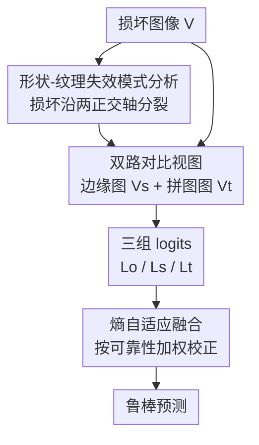

# Revisiting Visual Corruptions in LVLMs: A Shape-Texture Perspective on Model Failures

**会议**: CVPR 2026  
**论文**: [CVF Open Access](https://openaccess.thecvf.com/content/CVPR2026/html/Qiu_Revisiting_Visual_Corruptions_in_LVLMs_A_Shape-Texture_Perspective_on_Model_CVPR_2026_paper.html)  
**代码**: https://github.com/EdyQiu/ST-CD  
**领域**: 多模态VLM  
**关键词**: 视觉损坏鲁棒性, 形状-纹理, 对比解码, 训练无关推理, 失效模式分析

## 一句话总结
本文从"损坏类型异质性"出发，发现图像损坏会沿**形状**和**纹理**两个互补维度破坏 LVLM 感知并诱发两种相反的误判模式，据此提出训练无关的双路对比解码 ST-CD——用边缘图和拼图图作探针放大各自的偏差、再按熵自适应融合校正信号，在多个 LVLM 和鲁棒性基准上一致提升了对异质损坏的鲁棒性。

## 研究背景与动机
**领域现状**：LVLM（LLaVA-1.5、Qwen-VL、mPLUG-Owl2 等）在开放视觉推理上表现强，但严重依赖"输入图像质量高"这一假设。一旦图像被噪声、模糊、几何形变污染，性能会大幅下降，在安全攸关场景里是硬伤。

**现有痛点**：以往工作把性能下降归因于"视觉接地不足""过度依赖语言先验""视觉-文本表征不对齐"，并据此设计缓解方法。但它们都把损坏当成一团笼统的"视觉噪声"来处理——要么用一种通用扰动（如 VCD 加扩散噪声），要么把一堆随机增强统计平均（如 VACoDe 聚合 7 种增强）。

**核心矛盾**：损坏其实是**异质**的——不同损坏来自不同的退化机制，对感知的干扰方式根本不同，却被现有方法用同一套"通用扰动"一刀切，自然顾此失彼（论文实测发现没有任何单一对比解码方法能在所有损坏类型上稳定占优）。

**切入角度**：作者采用"以损坏为中心"的视角，去观察损坏到底沿哪些感知维度破坏表征。他们在一个**形状-纹理感知子空间**里测量 LLaVA 特征的位移，发现五花八门的损坏会自然聚成两类：模糊/几何形变主要破坏全局结构（形状退化），噪声/颜色扰动主要破坏局部外观（纹理退化）；且这两个方向近乎正交。更关键的是这两类损坏诱发**相反**的误判：形状退化时模型转而依赖纹理、误判成纹理相似的类别（狗→熊）；纹理退化时模型转而依赖形状、误判成结构相似的类别（狗→狼）。

**核心 idea**：既然失效模式沿形状/纹理两轴分裂，就分别构造一条强调形状、一条强调纹理的对比路径，用它们各自放大对应的偏差、再按不确定性自适应融合校正，做成训练无关的推理框架（ST-CD）。

## 方法详解
ST-CD 是一个推理期、训练无关的对比解码框架。它接收一张已损坏图像，输出更鲁棒的预测；中间通过"原图 + 两个对比视图"三组 logits 的比较来诊断并扣除形状/纹理两类偏差。整条 pipeline 分三步：生成 logits → 对比校准 → 自适应融合。

### 整体框架
给定损坏图像 $V$，LVLM 先产出基础 logits $L_o = f(V)$。然后构造两个语义上有据可循的对比视图：**边缘图** $V_s$（Canny 提取，保留全局轮廓、压制细纹理）和**拼图图** $V_t$（把图块随机置换，破坏全局结构、保留局部纹理统计），分别得到 $L_s = f(V_s)$ 和 $L_t = f(V_t)$。这两条路径会各自**放大**对应的退化偏差：边缘路径放大形状退化导致的误判，拼图路径放大纹理退化导致的误判。最后用 $L_o$ 减去两个对比 logits 得到校正信号，并按熵自适应加权融合回 $L_o$，得到修正后的预测。整个过程不更新任何参数。

### 关键设计

**1. 形状-纹理感知子空间：把异质损坏归约成两条正交轴**

这一条是全文的分析基石，回答"为什么用形状和纹理两个维度就够"。作者用 LLaVA 提取特征，对干净图、边缘图、拼图图分别算平均特征向量 $f_{clean}$、$f_{edge}$、$f_{jigsaw}$，定义两个位移方向 $v_{shape} = f_{edge} - f_{clean}$（强调形状时表征往哪挪）和 $v_{texture} = f_{jigsaw} - f_{clean}$（强调纹理时往哪挪），再用 Gram-Schmidt 正交化得到一组单位正交基 $\{u_{shape}, u_{texture}\}$。对任意一种损坏子集 $c$，算它相对干净图的平均位移 $\Delta f_c = f_c - f_{clean}$，投影到这组基上得到坐标 $x_c = \Delta f_c^\top u_{shape}$、$y_c = \Delta f_c^\top u_{texture}$。结果（论文 Fig. 2）非常干净：模糊和几何形变在 x 轴负向（远离边缘视图）→ 形状退化；噪声和颜色扰动在 y 轴负向（远离拼图视图）→ 纹理退化；两类位移方向近乎正交。这就把"19/29/17 种五花八门的损坏"压缩成可解释的二维结构，为后面的双路设计提供了"最小但充分"的感知基底。

**2. 双路语义对比视图：用边缘和拼图当探针，分别放大形状/纹理偏差**

光知道损坏分两类还不够，得有办法在推理时把每一类偏差**显式暴露**出来。作者跟随 Geirhos 把形状定义为描述物体 3D 形态的轮廓集合，用 Canny 边缘检测捕捉它的 2D 投影；跟随 Feng 把纹理定义为图像里与形状无关的成分，用拼图块置换来保留局部纹理统计而摧毁全局结构。这两个视图不是随机增强，而是**针对性探针**：边缘图喂进去，模型对形状的过度依赖会被放大（$L_s$ 在"熊"上更夸张），$\Delta_s = L_o - L_s$ 就抓到了"形状退化诱发的偏差"；拼图图喂进去同理放大纹理偏差。与 VCD（单一扰动做语义去偏）、VACoDe（堆 7 种随机增强求统计多样性）相比，ST-CD 是第一个在**推理期**利用形状-纹理互补性的方法，且框架与具体算子解耦——Canny/jigsaw 只是即插即用的简单实例，低分辨率等困难场景可换成 PiDiNet/DexiNed 这类可学习边缘提取器。

**3. 熵自适应融合：按各路可靠性给校正信号动态加权**

两条路径的校正不能等权相加——当某个对比视图本身就很不可靠时（例如弹性形变 + 拼图置换导致 $L_t$ 几乎是均匀分布、没有判别力），盲目融合它只会引入噪声。作者用熵作不确定性代理：原始预测熵 $E_o$ 高表示模型没把握、需要更强校正；对比 logits 的熵 $E_s$、$E_t$ 低表示该路径的校正可信。两个校正信号为 $\Delta_s = L_o - L_s$、$\Delta_t = L_o - L_t$，融合公式为

$$\tilde{L} = L_o + \frac{E_o}{E_s}(L_o - L_s) + \frac{E_o}{E_t}(L_o - L_t)$$

权重比 $\frac{E_o}{E_s}$、$\frac{E_o}{E_t}$ 实现"双向置信调制"：模型越不确定、对比越可靠时放大校正，反之抑制校正以免过度调整。这样在形状退化样本上自动偏向形状校正项、纹理退化样本上偏向纹理校正项，做到样本级、按需的自适应。论文也试了固定权重、距离权重、可学习权重等替代方案（见消融）。

### 一个例子：形状退化样本怎么被纠回
拿一张被弹性形变扭曲的狗图（形状信息严重受损）：LVLM 原始预测 $L_o$ 偏向纹理相似的"熊"。生成边缘图 $V_s$ 后 $L_s$ 对"熊"的偏好被进一步夸大——说明模型确实在过度依赖被污染的形状线索，于是 $\Delta_s = L_o - L_s$ 提供了有意义的形状校正、压低虚高的"熊"。而拼图图 $V_t$ 因为既被弹性形变又被置换破坏，$L_t$ 几乎均匀、没有判别信息，$\Delta_t$ 几乎没用。融合时由于 $L_t$ 熵高，它的贡献被自动下调，形状校正项 $\frac{E_o}{E_s}(L_o - L_s)$ 被强调，最终把预测拉回正确类别。整个机制相当于一个"形状偏差正则器"，专门抵消对被污染结构特征的过度依赖。

## 实验关键数据

三种 LVLM × 四个鲁棒性基准（ImageNet10-C、MMBench-C、POPE-MSCOCO-C、真实世界 RWIC-VQA），对比 VCD/ICD/LCD/VACoDe 等对比解码方法。

### 主实验（ImageNet10-C 平均准确率）

| 模型 | Baseline | VCD | VACoDe | ST-CD（本文） |
|------|----------|-----|--------|---------------|
| LLaVA-1.5 | 74.1 | 82.1 | 82.9 | **84.1** |
| mPLUG-Owl2 | 67.6 | 70.8 | 72.1 | **74.1** |
| Qwen-VL | 58.4 | 63.8 | 63.7 | **67.8** |

跨四个基准平均，ST-CD 相对 baseline 提升 10.0% / 6.5% / 8.4%（LLaVA / Qwen / mPLUG），相对标准 VCD 再提升 3.2% / 3.1% / 4.7%。真实世界 RWIC-VQA 上 ST-CD 同样最优（如 LLaVA 75.8 vs baseline 67.9），说明从合成损坏到真实退化都能泛化。效率上 ST-CD 只需标准 VCD 的 **1.5×** 推理开销，而堆 7 个视图的 VACoDe 要 4.2× 却仍落后——增益来自原理性的双路解耦，而非简单堆分支。

### 消融一：对比视图生成方式（LLaVA-1.5，单路 VCD 框架，ImageNet10-C）

| 对比视图 | 模糊 | 几何 | 噪声 | 颜色 | 平均 |
|---------|------|------|------|------|------|
| vanilla（无对比） | — | — | — | — | 73.9 |
| Diffusion Noise | — | — | — | — | 80.9 |
| Crop | — | — | — | — | 82.5 |
| Blank image | — | — | — | — | 82.7 |
| Canny Edge（形状探针） | **最优** | **最优** | — | — | 83.1 |
| Jigsaw Puzzle（纹理探针） | — | — | **最优** | **最优** | 83.7 |

边缘视图在模糊/几何损坏上最强（专治形状退化），拼图视图在噪声/颜色损坏上最强（专治纹理退化），两者互补——这正是双路设计的实验依据。

### 消融二：融合权重策略（LLaVA-1.5，ImageNet10-C 平均）

| 策略 | 噪声 | 模糊 | 颜色 | 几何 | 平均 |
|------|------|------|------|------|------|
| Fix（等权） | 80.0 | 81.4 | 89.9 | 82.5 | 83.5 |
| Distance | 80.5 | 81.2 | 89.8 | 82.7 | 83.6 |
| Entropy（本文默认） | 80.4 | 82.1 | 90.9 | 83.1 | 84.1 |
| Learned（轻量 ResNet-18） | 83.2 | 84.9 | 92.9 | 84.1 | **86.3** |

### 关键发现
- 现有对比解码方法都"挑食"：同一 backbone 下 VCD 擅长模糊、LCD 擅长颜色、VACoDe 擅长噪声/几何，没有谁全能；ST-CD 靠形状-纹理解耦做到跨损坏类型稳定占优，这正对应它的设计目标。
- 启发式权重里熵策略最好（84.1%）；数据驱动的 Learned 变体更高（86.3%，超启发式 2+ 个点），但要 30% 损坏验证数据训练频域预测器，在零样本场景不实用——熵加权是无需数据、模型无关的强替代。
- ST-CD 的增益不靠"加更多分支"：VACoDe 用 7 个视图、4.2× 开销仍输给只用 2 路、1.5× 开销的 ST-CD，说明原理性解耦比统计多样性更值钱。

## 亮点与洞察
- **把"损坏异质性"形式化成可测的二维子空间**：用边缘/拼图位移向量正交化出形状-纹理基，再投影各损坏——这套诊断协议本身就可复用到任何想分析"模型对何种扰动敏感"的场景。
- **对比视图从"随机扰动"升级为"针对性探针"**：边缘放大形状偏差、拼图放大纹理偏差，让对比解码从"语义去偏/增强多样性"推进到"感知级校正"，是个清晰的概念跃迁。
- **熵当可靠性闸门很巧**：当某条对比路径因双重破坏退化成均匀分布时，靠它的高熵自动降权，避免被无信息的校正项带偏，这个"自适应关阀"思路可迁移到任何多探针融合。

## 局限与展望
- 形状/纹理虽近乎正交，但作者承认它们"张成全部空间视觉信息"是一个简化假设；混合损坏、频域损坏等是否还能被这两轴覆盖，需要更多验证（⚠️ 论文在附录有 mixed corruption 实验但正文未给数）。
- Canny/jigsaw 是手工算子，低分辨率/极端损坏下边缘探针会失效，需换可学习边缘提取器——即框架虽解耦，实例化质量仍依赖探针本身。
- 最优的 Learned 加权需要损坏验证数据，破坏了"训练无关"的卖点；如何在纯零样本下逼近 Learned 的 86.3% 仍是开放问题。
- 推理开销 1.5×（要多跑两次前向），实时部署仍有成本。

## 相关工作与启发
- **vs VCD（Leng et al.）**：VCD 用扩散噪声等单一扰动构造对比 logits，目标是抑制语言先验导致的幻觉，属语义级去偏；ST-CD 用两个互补、语义有据的视图显式解耦形状/纹理退化，属感知级校正，且在损坏鲁棒性上一致优于 VCD。
- **vs VACoDe（Kim et al.）**：VACoDe 聚合多种随机增强求统计多样性，开销 4.2×；ST-CD 用最小的双路结构、1.5× 开销取得更高鲁棒性，证明"原理性解耦 > 增强堆叠"。
- **vs 形状-纹理表征研究（Geirhos / Shi / Li / Qiu 等）**：以往都在**训练期**（图像级或特征级）注入形状-纹理偏好；ST-CD 是首个在**推理期解码**阶段利用二者互补性的工作，无需重训。

## 评分
- 新颖性: ⭐⭐⭐⭐⭐ 把"损坏异质性"形式化成正交的形状-纹理子空间，并首次在推理期解码利用其互补性，视角和方法都新。
- 实验充分度: ⭐⭐⭐⭐ 3 模型 × 4 基准 + 真实世界集 + 两组消融，覆盖全面；但混合/频域损坏等只在附录，正文缺数。
- 写作质量: ⭐⭐⭐⭐⭐ 从现象分析到方法推导逻辑顺，Fig.1/2 把失效模式讲得很直观。
- 价值: ⭐⭐⭐⭐ 训练无关、即插即用、开销可控，对安全攸关部署有实际意义；但 1.5× 开销和探针手工化限制了上限。

<!-- RELATED:START -->

## 相关论文

- [\[CVPR 2026\] Revisiting Model Stitching in the Foundation Model Era](revisiting_model_stitching_in_the_foundation_model.md)
- [\[CVPR 2026\] HBridge: H-Shape Bridging of Heterogeneous Experts for Unified Multimodal Understanding and Generation](hbridge_h-shape_bridging_of_heterogeneous_experts_for_unified_multimodal_underst.md)
- [\[CVPR 2026\] Dr. Seg: Revisiting GRPO Training for Visual Large Language Models through Perception-Oriented Design](dr_seg_revisiting_grpo_training_for_visual_large_language_models_through_percept.md)
- [\[CVPR 2026\] Is the Modality Gap a Bug or a Feature? A Robustness Perspective](is_the_modality_gap_a_bug_or_a_feature_a_robustness_perspective.md)
- [\[CVPR 2026\] SoPE: Spherical Coordinate-Based Positional Embedding for 3D LVLMs](sope_spherical_positional_encoding_3d_lvlm.md)

<!-- RELATED:END -->
