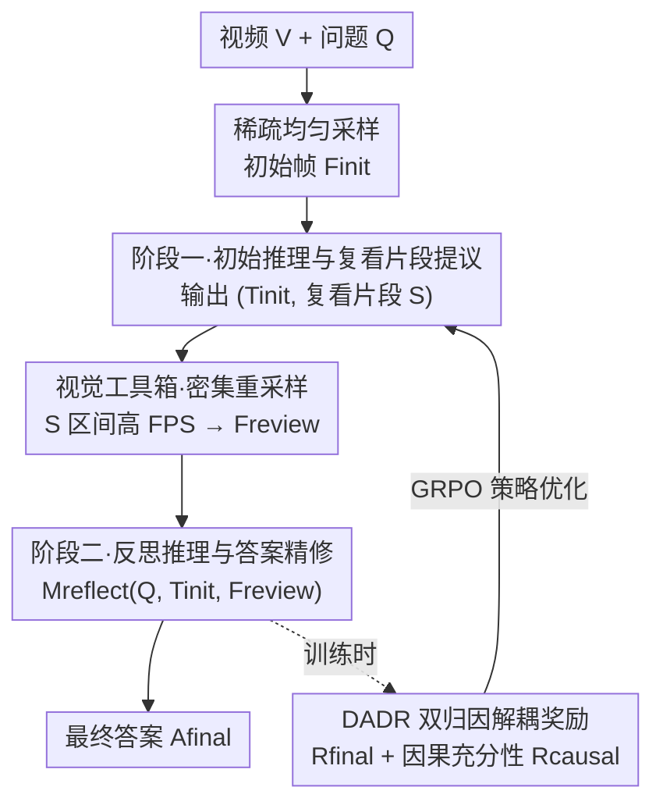

# REVISOR: Beyond Textual Reflection, Towards Multimodal Introspective Reasoning in Long-Form Video Understanding

**会议**: CVPR 2026  
**论文**: [CVF Open Access](https://openaccess.thecvf.com/content/CVPR2026/html/Li_REVISOR_Beyond_Textual_Reflection_Towards_Multimodal_Introspective_Reasoning_in_Long-Form_CVPR_2026_paper.html)  
**代码**: 无  
**领域**: 多模态VLM / 视频理解  
**关键词**: 长视频理解, 多模态反思, 工具增强推理, 强化学习, 视频时序定位

## 一句话总结
REVISOR 把"文字反思"升级成"视觉反思"——让多模态大模型在初次推理后自己提议一段值得复看的视频区间、调用工具去密集重采样这段画面，再带着新画面二次推理；配合 DADR 双归因解耦奖励逼模型选对片段，在 VideoMME / LongVideoBench / MLVU / LVBench 上把 Qwen2.5-VL-7B 平均提升约 2%。

## 研究背景与动机
**领域现状**：自我反思（self-reflection）是近年提升大模型复杂推理的主流手段——让模型显式地"回看、评估、修正"自己的推理轨迹，剪掉错误路径。这套机制从纯文本 LLM 迁移到多模态后，在图像理解任务（MathVista、MMMU 等）上确实能带来明显增益，代表方法如 VL-Rethinker。

**现有痛点**：作者在 Sec. 2.1 做了一个关键观察——把这些反思机制直接搬到长视频理解上，性能不升反降。VL-Rethinker 在长视频场景下相对基座模型是退步的；他们还专门训了一个"用视频数据训练的纯文本反思模型"做对照，依然没能提升。也就是说，问题不是"没在视频上训练"，而是反思机制本身的形态不对。

**核心矛盾**：现有反思全都是"纯文本重想"（text-only reconsideration）。但长视频和静态图像有本质差异——视频包含远更丰富、更动态的视觉信息，光靠重新组织文字根本不足以纠正推理错误；而且纯文本反思天生缺乏跨模态交互能力，反思时无法把视觉线索重新拉进来。模型第一次看的是稀疏采样的几帧，错过的关键瞬间，二次纯文字反思永远补不回来。

**本文目标**：让反思过程能够"重新看视频"，而不只是"重新想文字"，并且要让模型学会精准定位到该复看哪一段。

**切入角度**：作者先做了一个 oracle 验证实验（Sec. 2.2）——在 NExT-GQA / ReXTime / CG-Bench 这些标注了"答案所需关键片段"的数据集上，先让模型基于原始帧初次推理，再把标注的关键片段喂回去让它二次作答，平均涨了约 7.3%，而纯文本反思几乎零增益。这直接证明：视频任务里"视觉反思"远比"文字反思"重要。

**核心 idea**：把传统的文本反思改造成"工具增强的多模态反思"——模型初次推理时顺便指出"哪段最该复看"，由视觉工具箱去那段密集重采样补充画面，再带着新画面做第二次推理。

## 方法详解

### 整体框架
REVISOR（REflective VIsual Segment Oriented Reasoning）是一个两阶段推理框架。输入是一段长视频 $V$ 和用户问题 $Q$，输出是精修后的最终答案 $A_{final}$。整条流程的核心转折在于：模型不再"一次性看完做答"，而是"先粗看、自己挑出疑点片段、把这段画面看清楚、再回头改答案"。

具体地，先对整段视频做稀疏均匀采样得到初始帧集 $F_{init}$（控制 token 成本）；**阶段一**模型基于 $(Q, F_{init})$ 做链式思考，产出初始推理轨迹 $T_{init}$ 并额外输出一个它认为最关键/最不确定的时间区间 $S=[t_{start}, t_{end}]$；视觉工具箱接到 $S$ 后在原视频该区间内做高帧率密集重采样得到 $F_{review}$；**阶段二**模型带着 $(Q, T_{init}, F_{review})$ 重新推理，在更清晰的画面下验证或纠正初次结论，给出 $T_{refine}$ 和 $A_{final}$。训练侧用 DADR 双归因解耦奖励 + GRPO 把"选对片段"这件事单独教会模型。

### 关键设计

**1. 阶段一：初始推理与复看片段提议**

针对"模型只看稀疏几帧、错过关键瞬间却无从补救"的痛点，REVISOR 让模型在第一次推理时就承担一个额外职责：不仅要输出推理内容，还要主动指出"哪一段视频值得重看"。模型 $M$ 在初次推理模式下接收 $(Q, F_{init})$，输出一个结构化二元组 $(T_{init}, S) = M_{infer}(Q, F_{init})$，其中 $S=[t_{start}, t_{end}]$ 是它认为最关键或最模糊的时间窗。关键在于这个 $S$ 不是外挂模块预测的，而是从模型自己的推理过程 $T_{init}$ 中"自然涌现"——模型在思考时会显式表达"这一段最关键/我不确定"，框架顺势把这个时间戳提取出来。这相当于把"该复看哪里"这个决策交给最懂上下文的模型本身，而不是靠固定规则或额外检索器。

**2. 视觉工具箱：密集重采样复看片段**

光提议片段还不够，得真的把那段画面看清楚。视觉工具箱 $T$ 接到 $S$ 后，只在 $[t_{start}, t_{end}]$ 这个窗口内对原视频做密集重采样：$F_{review} = \text{SampleDense}(V, [t_{start}, t_{end}])$，以远高于初始稀疏采样的帧率（更高 FPS）抽帧。这个设计的巧妙之处是把"定位细粒度视觉细节"的计算与流程负担外包给工具：模型不必以全分辨率处理整段视频，却能对关键时刻做聚焦式细看——既绕开了 MLLM 的上下文长度限制，又保证疑点区间的画面密度足够支撑二次判断。

**3. 阶段二：反思推理与答案精修**

有了新画面，模型被重新调用，这次输入变成 $(Q, T_{init}, F_{review})$ 三件套：原问题、自己的初次推理、以及新采到的密集视觉证据。$(T_{refine}, A_{final}) = M_{reflect}(Q, T_{init}, F_{review})$。把初次推理 $T_{init}$ 显式喂回去是为了形成"上下文内反思"（in-context reflection）——模型能对照自己之前的结论，在更强的视觉证据下验证假设、消解阶段一标出的歧义、或纠正先前的误读。这模拟了人类专家"先整体浏览、再聚焦关键证据、最后下结论"的分析节奏，把推理从一次性 Markov 式生成变成带回看的迭代过程。

**4. DADR 双归因解耦奖励：用因果充分性逼模型选对片段**

这是把上述框架真正训出来的关键。如果只用"最终答案是否正确"这一个奖励信号跑 GRPO，会出问题：REVISOR 的轨迹 $\tau=(T_{init}, S, T_{refine}, A_{final})$ 由三部分组成，即使模型恰好输出了正确的复看片段 $S$，也只能从最终答案那里拿到稀薄的间接反馈；选错片段同样得不到足够惩罚。论文实验（Tab. 3）显示纯最终答案奖励训出来的模型在长视频上甚至跌破基座。

DADR 的做法是把"片段定位"的奖励从总奖励里解耦出来，总奖励写成 $R(\tau) = \lambda_1 R_{final} + \lambda_2 R_{causal}$。其中 $R_{final}$ 是常规的最终答案正确性奖励；$R_{causal}$ 是新提出的**因果片段充分性奖励（CSSR）**，它做一次充分性检验——用同一个模型在"只给问题 $Q$ 和密集证据 $F_{review}$、不给任何其他上下文"的条件下作答：$\hat{A} = M_{suff}(Q, F_{review})$，然后

$$R_{causal} = \mathbb{I}(\hat{A} = A^*)$$

只有当模型仅凭这段重采样画面就能推出正确答案时才给正奖励。这等于在问"你挑的这段，是不是真的足够、且因果相关到能独立支撑答案？"——它隐式鼓励模型选真正有信息量、紧凑的片段，惩罚选无关或冗长区间的行为。论文设 $\lambda_1=0.6 > \lambda_2=0.3$：$\lambda_2$ 过大模型会过度沉迷于定位片段而忽略如何用片段作答（时序定位涨、长视频理解反降）。

### 损失函数 / 训练策略
基座为 Qwen2.5-VL-7B，单阶段强化学习，沿用 DAPO，基于 verl 框架扩展实现。训练数据共 25K 样本，来自 STAR、PerceptionTest、NExT-QA、CLEVRER、LLaVA-Video-178K、TimeRFT、CG-Bench、ReXTime。优化器 AdamW，学习率 $1\times10^{-6}$，batch size 32，rollout 数 8，训练与评测均把输入视频 token 上限设为 8192。值得注意的是 REVISOR 不需要额外的监督微调（SFT）或外部模型。

## 实验关键数据

### 主实验
四个长视频理解基准上，REVISOR（8K video tokens）相对基座 Qwen2.5-VL-7B 平均提升约 2%，视频越长增益越大（VideoMME 长子集 +2.8%、含 120 分钟视频的 MLVU +2.5%）：

| 模型 | VideoMME(Overall) | VideoMME(Long) | LongVideoBench | MLVU | LVBench |
|------|------|------|------|------|------|
| VL-Rethinker-7B（文本反思） | 62.1 | 51.9 | 56.4 | 63.2 | 37.2 |
| Video-R1-7B（纯文本推理） | 61.4 | - | - | - | - |
| Qwen2.5-VL-7B⋆（复现基座） | 64.3 | 53.4 | 56.5 | 67.3 | 40.2 |
| **REVISOR（本文）** | **65.7** | **56.2** | **57.5** | **69.8** | **42.0** |

相对纯文本推理 Video-R1，VideoMME 上 +4.3%；相对文本反思 VL-Rethinker 和自家"视频训练的纯文本反思"基线，分别 +3.6% / +2.3%，直接量化了"视觉反思"相对"文本反思"的必要性。

时序视频定位任务上（Tab. 2），REVISOR 在 Charades-STA 达 51.4% mIoU，超过 SFT-based SOTA iMOVE 4.1%、超过 RL-based 的 TVG-R1 4.7%；NExT-GQA mIoU 比 TVG-R1 高 3.9%——说明"选对复看片段"这件事让模型顺带学会了精准定位。

### 消融实验
DADR 双归因解耦奖励的奖励权重消融（Tab. 3，灰行为基座）：

| $\lambda_1$ | $\lambda_2$ | VideoMME | LongVideoBench | LVBench | MLVU | NExT-GQA |
|------|------|------|------|------|------|------|
| - | - | 64.3 | 56.5 | 40.2 | 67.3 | 20.9 |
| 0.3 | 0.6 | 64.0 | 56.0 | 41.1 | 68.7 | 33.9 |
| 0.6 | 0.0 | 62.2 | 54.0 | 40.8 | 68.3 | 32.1 |
| **0.6** | **0.3** | **65.7** | **57.5** | **42.0** | **69.8** | 33.2 |

### 关键发现
- **CSSR 是不能去的**：$\lambda_2=0$（只用最终答案奖励）时 VideoMME 从 65.7% 跌到 62.2%，甚至低于 64.3% 的基座——没有因果充分性信号，模型从稀疏奖励里学不会定位正确复看片段 $S$，框架反而成了负担。
- **奖励要"重作答、轻定位"**：当 $\lambda_2 > \lambda_1$（0.3/0.6）时，时序定位能力上去了，但长视频理解反降（MLVU 69.8%→68.7%），因为模型过度专注于"找对片段"而忽略"如何用片段推出答案"。所以最终设 $\lambda_1 > \lambda_2$。
- **NExT-GQA 上定位增益最戏剧**：mIoU 从基座 20.9 一路到 33.2，印证 DADR 确实把"答案所需的时序证据"精准召回了。
- **视觉反思 > 文本反思**：oracle 实验里喂入标注关键片段平均涨约 7.3%，而纯文本反思几乎零增益，这是整篇方法的实证地基。

## 亮点与洞察
- **把"反思该看哪里"交给模型自己涌现**：复看片段 $S$ 不靠外挂检索器或固定规则，而是从初次推理轨迹里自然提取——最懂上下文的就是模型本身，这个设计比额外训练一个 grounding 模块更轻、更自洽。
- **CSSR 是一个很漂亮的"因果充分性"代理奖励**：用"只凭这段画面能不能独立答对"来定义片段质量，巧妙地把"片段相关性"这个难以直接监督的目标转成了一个可验证的二值奖励，且天然抑制选过长/无关片段。这个思路可迁移到任何"agent 要选证据子集"的 RL 任务（如检索增强、多跳问答的证据选择）。
- **工具增强 = 用计算换上下文**：把密集重采样外包给工具箱，让模型在 8K token 预算内既能纵览全片又能细看疑点，是处理长视频上下文瓶颈的实用范式。
- **无需 SFT/外部模型**：纯 RL 单阶段就能拿到增益，部署成本低。

## 局限与展望
- **增益幅度温和**：四基准平均约 +2%，VideoMME Overall 仅 +1.4%，相对训练复杂度（多阶段推理 + 解耦奖励 + 工具调用）而言提升不算激进。
- **单段复看的假设**：阶段一只提议一个区间 $S$，对需要跨多个分散片段联合推理的问题（如比较视频首尾两个远距离事件）可能力不从心，框架未讨论多片段提议或多轮复看。⚠️ 多轮/多片段是否支持以原文为准。
- **CSSR 充分性检验的额外开销**：每条轨迹要多跑一次 $M_{suff}(Q, F_{review})$ 来算 $R_{causal}$，训练时的 rollout 成本会上升，论文未给出明确的训练开销数字。
- **依赖模型自身定位质量**：若初次稀疏采样就漏掉了关键瞬间所在的大致时段，模型可能根本提议不到正确的 $S$，工具箱也就无从补救——稀疏采样的初始覆盖率是潜在瓶颈。

## 相关工作与启发
- **vs VL-Rethinker / 纯文本反思**: 它们在反思阶段只重组文字、不重新看画面，本文指出这对长视频是致命的（甚至掉点），改成"重新采样视觉证据"的多模态反思，长视频上 +3.6%。核心区别是反思的载体从 text 变成 vision。
- **vs Video-R1 等纯文本推理**: 它们靠加长链式思考提升，本文证明"看清关键画面"比"想更多文字"更管用，VideoMME +4.3%。
- **vs 时序定位专用模型（TVG-R1 / iMOVE）**: 它们专门为定位训练，本文把定位当作多模态推理的副产品（靠 CSSR 隐式监督），却在 Charades-STA / NExT-GQA mIoU 上反超，说明"为答题选证据"是比"为定位而定位"更强的训练信号。

## 评分
- 新颖性: ⭐⭐⭐⭐ "视觉反思 vs 文本反思"的问题诊断很清晰，CSSR 因果充分性奖励设计巧妙。
- 实验充分度: ⭐⭐⭐⭐ 四基准 + 时序定位 + oracle 动机实验 + 奖励权重/数据消融，证据链完整。
- 写作质量: ⭐⭐⭐⭐ 动机—诊断—方法—验证逻辑顺畅，图示清楚。
- 价值: ⭐⭐⭐⭐ 给长视频 MLLM 推理提供了一个无需 SFT、可复用的工具增强反思范式。

<!-- RELATED:START -->

## 相关论文

- [\[CVPR 2026\] MSJoE: Jointly Evolving MLLM and Sampler for Efficient Long-Form Video Understanding](msjoe_jointly_evolving_mllm_and_sampler_for_efficient_long-form_video_understand.md)
- [\[CVPR 2026\] ReMoRa: Multimodal Large Language Model based on Refined Motion Representation for Long-Video Understanding](remora_multimodal_large_language_model_based_on_refined_motion_representation_fo.md)
- [\[CVPR 2026\] TimeViper: A Hybrid Mamba-Transformer Vision-Language Model for Efficient Long Video Understanding](timeviper_a_hybrid_mamba-transformer_vision-language_model_for_efficient_long_vi.md)
- [\[CVPR 2026\] CURVE: A Benchmark for Cultural and Multilingual Long Video Reasoning](curve_a_benchmark_for_cultural_and_multilingual_long_video_reasoning.md)
- [\[CVPR 2026\] Scaling the Long Video Understanding of Multimodal Large Language Models via Visual Memory Mechanism](scaling_the_long_video_understanding_of_multimodal_large_language_models_via_vis.md)

<!-- RELATED:END -->
