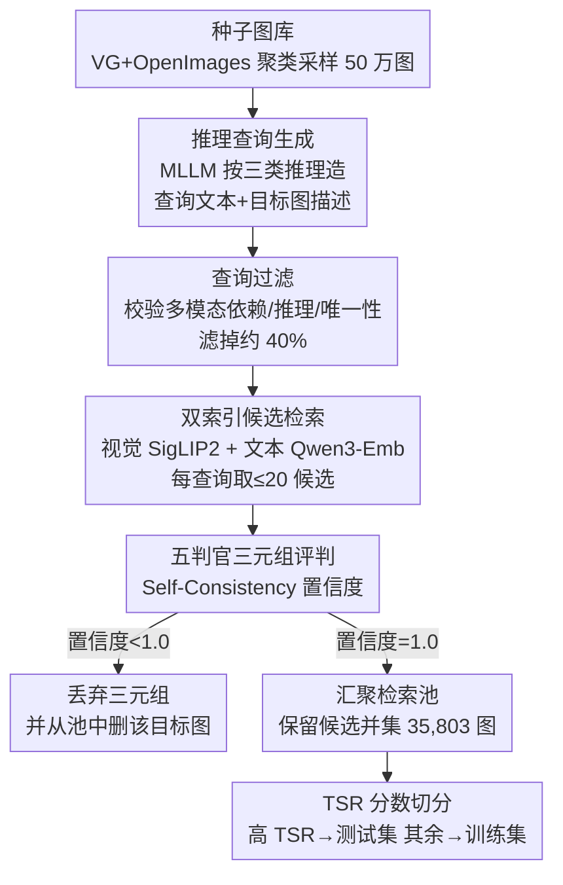

# RMIR: A Benchmark Dataset for Reasoning-Intensive Multimodal Image Retrieval

**会议**: CVPR 2026  
**论文**: [CVF Open Access](https://openaccess.thecvf.com/content/CVPR2026/html/Li_RMIR_A_Benchmark_Dataset_for_Reasoning-Intensive_Multimodal_Image_Retrieval_CVPR_2026_paper.html)  
**代码**: https://github.com/amazon-science/rmir  
**领域**: 多模态VLM  
**关键词**: 多模态检索, 推理检索, benchmark, 自动数据生成, 生成式 embedding

## 一句话总结
RMIR 提出一个"看图+读文需要 1-2 步逻辑推理才能找到答案图"的多模态图像检索基准（1,634 条测试查询，覆盖功能/时间/因果三类推理），并配套一条全自动、可扩展的数据生成流水线；评测显示最强模型也只有 46.53% 的 R@20，且带显式推理的生成式 embedding 远胜判别式编码器。

## 研究背景与动机

**领域现状**：图像检索从早期的单模态（以图搜图、以文搜图）演进到 composed image retrieval（CIR）——给一张参考图 + 一句"怎么改"的文本，去找改后的目标图（如 CIRR、FashionIQ）。这类任务本质上还是"表层语义匹配 + 简单组合"。

**现有痛点**：当检索目标无法靠表面特征直接确定、而需要对图文做复杂的多步推理时（例如"这只鸟为什么偏要站在这片湍急的水域？"→ 答案图是一只在浅水捕鱼的大蓝鹭），现有基准几乎覆盖不到。少数几个推理检索基准要么是纯文本文档检索（BRIGHT），要么聚焦专家级/技术图/视觉谜题（MRMR、MR2-Bench），且都靠专家人工标注、无法规模化扩展。

**核心矛盾**：构建这种数据集存在四个相互冲突的诉求——**复杂性**（查询要真需要推理、且必须真正多模态，不能光看图或光看文就答得出）、**正确性**（标为正例的图必须真能回答查询）、**检索完备性**（候选池里所有真正例都要被找全，否则模型答对了反被判错）、**成本可扩展性**（生成要便宜、能放大）。提高复杂性会抬高判定成本、增加错标风险；扩大候选池利于造难题，却容易引入假阴性。

**本文目标**：① 填补"日常推理（非专家）多模态图像检索"这一基准空白；② 给出一条能在上述四诉求间取得平衡、可任意放大的自动数据生成流水线。

**核心 idea**：用一条"MLLM 生成查询 → 多判官交叉验证 → 显式处理假阴性"的全自动流水线，把任意现成图库转化成需要推理的检索三元组，从而既保质量又可规模化，无需专家逐条标注。

## 方法详解

### 整体框架

RMIR 的"方法"主体是**数据集本身的构造方式**：把一个 I+T→I 的推理检索任务定义清楚，再用一条 7 阶段全自动流水线把任意图库变成带正确性与完备性保证的检索数据。任务设定是——给模型一张输入图和一句关于该图、需要 1-2 步逻辑推理的查询文本，模型要从一个共享候选图池里检索出"能回答该查询"的目标图；查询分为功能（物体用途/affordance）、时间（时序变化）、因果（因果关系）三类。

流水线先准备一个种子图库（从 Visual Genome + Open Images v7 共约 201.8 万图聚成 5 万簇、每簇随机取 10 张得到 50 万张种子图，兼顾"图间不太像"与"目标描述能找到好匹配"），再依次走 7 个阶段：生成查询 → 过滤查询 → 检索候选目标图 → 多判官评判三元组 → 按置信度过滤 → 汇聚检索池 → 用 TSR 分数切出可靠测试子集。

### 关键设计

**1. 三类"日常推理"检索任务的设定：把检索从表层匹配推进到逻辑推断**

RMIR 的第一层创新是任务本身。它要求目标图同时依赖输入图与查询文本（真多模态），且需要 1-2 步逻辑推断、不能靠单纯目标检测解决，但难度仍控制在"普通成年人 30 秒内能想通"的非专家范围——查询文本的 Flesch-Kincaid 可读性中位数仅为 8（初中阅读水平），说明"难"在推理而非辞藻。三类推理各有侧重：功能推理判断"完成某任务需要什么工具/物件"，时间推理判断"时序/先后/同时关系"（如"8 小时后这个场景大概什么样"），因果推理判断"为什么会这样"。这与并行工作 MRMR、MR2-Bench 的专家级/技术图路线互补，也与 CIR 这类"按文本指令改图再找图"的表层组合检索本质不同——RMIR 的目标图不是输入图的变体，而是"逻辑上回答了关于输入图的问题"的另一张图。

**2. 全自动查询生成 + 多判官交叉验证：在没有专家标注的前提下保证正确性**

为兼顾质量与可扩展，流水线用 MLLM 替代人工。生成阶段对每张种子图用 Claude Sonnet 4.5（temp=0.25）按三类推理各产出"查询文本 + 目标图自然语言描述"，prompt 施加三条约束：多模态依赖、需 1-2 步推理、目标唯一。但生成难免有不达标的，于是紧接一个过滤阶段用 Claude Sonnet 4.5（temp=0）逐条核验这三条约束是否满足，**滤掉约 40%** 的候选——这步放在昂贵的候选检索与判官评判之前，既保质量又省下游成本。三元组凑齐后（输入图 + 查询 + 候选目标图），再用**五个 MLLM 判官**（1 个 Sonnet 4.5 + 4 个 Haiku 4.5，temp=0.85）评判"目标图是否逻辑上回答了查询"，判官可接受/拒绝/弃权。借鉴 Self-Consistency，在高温下多次采样，用"投多数票的判官比例"当置信度代理（如 4 票 True、1 票 False 即置信度 0.8）。这条"生成-过滤-多判官"链条让正确性不依赖任何人工标注，是流水线可规模化的关键。

**3. 检索完备性的显式处理：删图 + 反向汇聚候选池，避免把模型的正确答案误判为错**

推理检索数据最隐蔽的坑是**假阴性**——某张图其实能回答查询却没被标为正例，导致模型检索到它反被扣分。RMIR 用两步显式缓解。其一，置信度过滤阶段把所有置信度 < 1.0 的三元组整条丢弃；但仅丢弃不够，因为被丢弃三元组的目标图可能因出现在别的三元组里而仍留在共享池中，模型检到它又会被冤判，所以作者**连带把该目标图从整个种子库里删除**。其二，检索池不取"整个种子库减去删掉的图"，而是取所有通过高置信过滤的候选目标图的**并集**（最终 35,803 张）——这虽降低了检索难度，却大幅压低了假阴性的可能，作者明确选择了完备性优先于难度。

**4. TSR（Test Set Reliability）分数：用"尾部负例浓度"挑出最可靠的测试子集**

即便如此，仍有一类假阴性会漏网：判官只看每查询前 K 张候选，万一第 K+1 张才是有效答案就漏标了。直觉是——如果前 K 张里负例越多、且正例越集中在最前面几位，那么"停在 K 处漏掉后续正例"的概率就越低。作者把这个直觉形式化为 TSR 分数。先定义元素 $L_i$ 的"负例度"为判定其为负的判官比例（若不足半数判负则记 0），$\text{mean\_negativeness}(L[i{:}j])$ 为 $L_i,\dots,L_j$ 负例度的平均值，则

$$\text{TSR}(L)=\frac{1}{K}\sum_{i=1}^{K}\text{mean\_negativeness}(L[i{:}K]).$$

它刻画一种"尾部负例性"：检索列表尾端看到的负例越多，越有信心没有漏掉其他正例，TSR 就越高。实践中用视觉索引返回的 $K_{img}$ 张图来算（不足则用人造负例补齐），把 TSR 高于阈值的查询划入测试集、其余留作训练集。⚠️ 论文坦言 TSR 的有效性仍待深入研究，仅在附录给了轻量人工验证作为旁证。

### 损失函数 / 训练策略
本文是 benchmark 论文，不训练自己的模型；流水线中各 MLLM（生成 / 过滤 / 判官）均为现成模型按温度采样调用，无训练目标。最终产出 1,634 条测试查询 + 6,687 条可用于训练的查询 + 35,803 张共享检索池。

## 实验关键数据

### 主实验：与现有检索基准的定位对比

RMIR 在"需要推理 + 可规模化"这一组合上独树一帜——既要推理（不同于 M-BEIR/MMEB/CIRR 等表层匹配基准），又可自动扩展（不同于 BRIGHT/MRMR/MR2-Bench 等专家人工标注基准）。

| 数据集 | 任务/模态 | 规模 | 需推理 | 专家标注 | 可扩展 |
|--------|-----------|------|--------|----------|--------|
| CIRR | Composed I+T→I | 36K | × | × | × |
| M-BEIR | 通用检索 Mixed | 190K | × | × | ✓ |
| BRIGHT | 文档检索 T→T | 1.4K | ✓ | ✓ | × |
| MRMR | 专家推理 I+T→I+T | 1.4K | ✓ | ✓ | × |
| MR2-Bench | 专家推理 I+T→Mixed | 1.3K | ✓ | ✓ | × |
| **RMIR（本文）** | 推理检索 I+T→I | 1.6K | ✓ | × | ✓ |

### 模型评测：11 个 SOTA 检索模型在 RMIR 上的表现

在 1,634 条测试查询上评测 11 个模型（开源 MLLM、判别式通用 embedding VLM2Vec 系列、生成式 embedding UME-R1 系列），用 R@20 / R@50 衡量。最强的 UME-R1-7B 也仅 46.53% R@20，说明任务远未被解决。

| 检索模型 | 功能 R@20 | 时间 R@20 | 因果 R@20 | 平均 R@20 | 平均 R@50 |
|----------|----------|----------|----------|----------|----------|
| Qwen2.5-VL-3B | 34.40 | 28.35 | 31.69 | 31.71 | 43.84 |
| Qwen2.5-VL-7B | 36.42 | 36.76 | 37.38 | 36.89 | 48.88 |
| Phi-4-Multimodal-5.6B | 25.46 | 25.80 | 27.41 | 26.33 | 36.86 |
| VLM2Vec-Qwen2-VL-7B | 42.34 | 32.59 | 39.64 | 38.68 | 52.03 |
| VLM2Vec-V2 (Qwen2-VL-2B) | 31.53 | 28.33 | 32.35 | 31.01 | 41.67 |
| UME-R1-2B (Qwen2-VL-2B) | 39.08 | 35.53 | 38.95 | 38.09 | 52.68 |
| **UME-R1-7B (Qwen2-VL-7B)** | **51.34** | **40.58** | **46.46** | **46.53** | **60.48** |

### 关键发现
- **生成式 embedding + 显式推理 >> 判别式编码 + 规模**：UME-R1 先生成中间推理轨迹再产出 embedding，全面碾压直接编码的 VLM2Vec（7B 上领先 7.85 个百分点）；甚至 UME-R1-2B（38.09% R@20）就超过判别式的 Qwen2.5-VL-7B——"为推理而训练"比"单纯堆参数"更有效。
- **时间推理最难**：所有模型在时间类查询上都最弱，连 UME-R1-7B 也只有 40.58% R@20，比它自己的功能推理低 10.76 个百分点，说明从静态图推断时序动态是当前模型的短板；功能推理（物体 affordance）最容易，可能因预训练视觉特征已较好支持物体功能性理解。
- **规模有用但不够**：同族内放大稳定涨点（Qwen2.5-VL 7B 比 3B 高 5.18 点，UME-R1 7B 比 2B 高 8.44 点），但天花板仍只有 46.53% R@20，留有大量提升空间。

## 亮点与洞察
- **把"完备性"当一等公民来设计**：多数检索基准只管"标对正例"，RMIR 显式直面假阴性，用"删目标图 + 候选并集做池"两招主动压低误判风险——这套思路可迁移到任何"共享候选池 + 自动标注"的检索数据构造。
- **TSR 是个可复用的小工具**：用"尾部负例浓度"来给自动标注的可靠性打分、并据此切测试集，是一种不需要额外人工就能筛出高可信子集的巧思，思路可借用到其他自动标注流水线的质量分层。
- **"生成-过滤-多判官-置信度"四件套**：用便宜小模型（Haiku）凑判官团 + Self-Consistency 置信度，是在无人工标注下逼近正确性的实用配方；先过滤再昂贵评判的顺序也是省成本的工程经验。
- **评测结论本身有指导意义**：它给检索社区一个清晰信号——做推理检索要走"生成式 + 推理感知 embedding"路线，而非继续在判别式对比学习上加规模。

## 局限与展望
- 作者承认**没有验证训练集的效用**：虽然释放了 6,687 条训练查询，但未真正训模型证明它能涨点，流水线"训练价值"这一半尚未被实证。
- **多模态依赖只靠 prompt 约束、未量化**：没有用单模态基线测"shortcut 率"（光看文或光看图就能答对的比例），无法定量保证查询真的非多模态不可解。
- **流水线的模型偏置**：候选检索只用 SigLIP 2 + Qwen3-Embedding 两个 embedding，可能漏掉它们不擅长的有效候选；判官全来自 Claude 单一家族，可能有共享盲点——作者建议多家族集成。
- **TSR 有效性仍待证**：作者自己标注 TSR 的合理性证据偏轻量（仅附录小规模人工验证），⚠️ 这是该指标最需补强之处。
- 图库仅来自 VG + Open Images，日常场景为主，覆盖面有限；但流水线与图库无关，可换更大更广的图源扩展。

## 相关工作与启发
- **vs CIR（CIRR/FashionIQ）**：CIR 是"按文本指令改图再找改后图"的表层组合检索，目标图是输入图的变体；RMIR 要求目标图在逻辑上回答关于输入图的推理问题，是从"组合匹配"跨到"逻辑推断"。
- **vs BRIGHT**：同为推理检索，但 BRIGHT 是纯文本文档检索且专家领域、人工标注不可扩展；RMIR 是真多模态 I+T→I、日常推理、可自动扩展。
- **vs MRMR / MR2-Bench（并行工作）**：两者聚焦专家级推理且逐条人工审核保质量，RMIR 聚焦非专家日常推理且释放可规模化流水线——质量上限 vs 规模化的取舍，两类数据互补，未来模型应在两种域上都评测。

## 评分
- 新颖性: ⭐⭐⭐⭐ 把"日常推理多模态检索"做成可自动扩展的基准，并显式处理假阴性与可靠性切分，定位清晰
- 实验充分度: ⭐⭐⭐⭐ 11 个 SOTA 模型 × 三类推理的系统评测，结论扎实；但未验证训练集效用、TSR 证据偏轻
- 写作质量: ⭐⭐⭐⭐ 四诉求-权衡的叙事主线清晰，流水线七阶段交代完整
- 价值: ⭐⭐⭐⭐ 给推理检索社区提供了训练/评测数据 + 可复用的生成流水线与质量工具

<!-- RELATED:START -->

## 相关论文

- [\[CVPR 2026\] RetFormer: Multimodal Retrieval for Enhancing Image Recognition](retformer_multimodal_retrieval_for_enhancing_image_recognition.md)
- [\[CVPR 2026\] Camouflage-aware Image-Text Retrieval via Expert Collaboration](camouflage-aware_image-text_retrieval_via_expert_collaboration.md)
- [\[CVPR 2026\] ReMatch: Boosting Representation through Matching for Multimodal Retrieval](rematch_boosting_representation_through_matching_for_multimodal_retrieval.md)
- [\[CVPR 2026\] MMSD3.0: A Multi-Image Benchmark for Real-World Multimodal Sarcasm Detection](mmsd30_a_multi-image_benchmark_for_real-world_multimodal_sarcasm_detection.md)
- [\[CVPR 2026\] ReCALL: Recalibrating Capability Degradation for MLLM-based Composed Image Retrieval](recall_recalibrating_capability_degradation_for_mllm-based_composed_image_retrie.md)

<!-- RELATED:END -->
