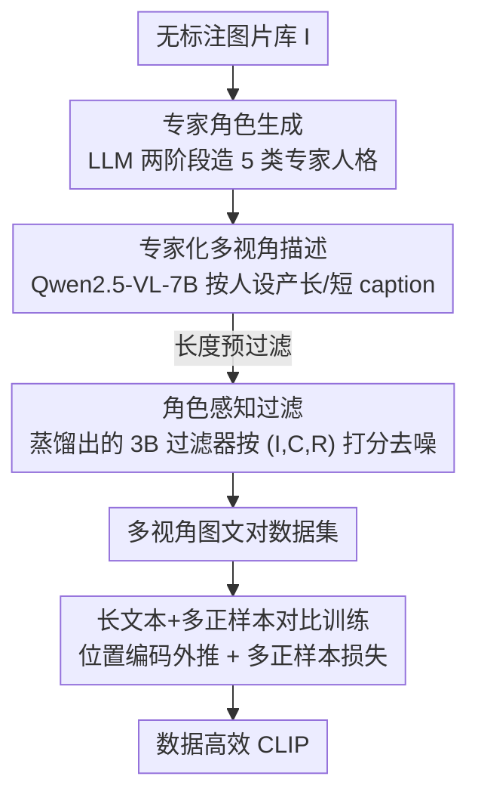

# Role-SynthCLIP: A Role-Play Driven Diverse Synthetic Data Approach

**会议**: CVPR 2026  
**论文**: [CVF Open Access](https://openaccess.thecvf.com/content/CVPR2026/html/Huangfu_Role-SynthCLIP_A_Role-Play_Driven_Diverse_Synthetic_Data_Approach_CVPR_2026_paper.html)  
**代码**: https://github.com/huangfu170/Role-SynthCLIP  
**领域**: 多模态VLM  
**关键词**: CLIP预训练, 合成数据, 角色扮演提示, 多视角caption, 数据高效  

## 一句话总结
用「多专家角色扮演提示」驱动 MLLM 从构图、叙事、情感等不同认知视角为同一张图生成多条互补 caption，再用蒸馏出的角色感知过滤器去噪，只用 1M 张图就把 CLIP-B/16 在 MS-COCO 的 Recall@1 推到 64.1%，反超用了 5M 对的最强合成数据基线。

## 研究背景与动机
**领域现状**：CLIP 这类视觉-语言模型的能力高度依赖训练数据的语义多样性与质量。传统路线靠从网上爬几百万到几十亿对图文，但这条「堆数据量」的路越走越贵，且不可避免混进大量噪声、低质、冗余样本。于是「可控的高质量合成数据」成为替代方案——SynthCLIP 证明纯合成语料（多达 30M 对）也能打出有竞争力的效果。

**现有痛点**：当注意力从「数据规模」转向「数据质量」，一个新问题浮现——**语义贫化（semantic impoverishment）**。用通用提示（generic prompt）让 MLLM 描述图片，生成的 caption 往往单一视角、措辞雷同、语义重复，抓不住视觉内容丰富的多面性。现有改进要么调分布平衡（SynthCLIP 平衡实体分布），要么堆提示模板（FIX-CLIP 用 20 个通用提示集成、LaCLIP 用 LLM 改写原 caption），但这些集成方法**缺乏认知深度**：它们的"多样性"只是浅层换词，没有引入构图、语境、情感这类真正不同的解读维度。

**核心矛盾**：同一张图本可以从很多视角解读，但「随机/通用提示」只会让模型反复给出同一个表层视角的描述——多样性的瓶颈不在采样次数，而在提示没有刻意去激活模型不同的认知能力。

**本文目标**：在**固定训练图片数量**的前提下，通过给每张图配多条语义互补、视角不同的 caption，提升合成图文对的语义多样性与细粒度对齐。

**切入角度**：作者借用 LLM 里已被验证有效的「角色扮演提示」——给模型指派一个专家身份（如某领域专家），无需改架构、无需额外训练就能激发更丰富、更专业的回答。把这套范式迁移到 MLLM 的 caption 生成上，就能灵活地"操纵"模型产出想要的语义多样性。

**核心 idea**：用「多专家角色扮演提示」代替「通用提示」，让 MLLM 从多个互补认知视角描述同一张图，从而在不增图的情况下把语义多样性做上去。

## 方法详解
### 整体框架
Role-SynthCLIP 把任务定义为：给定一批**没有配对 caption 的图片** $I=\{I_i\}$，合成出语义多样且准确的图文对用于对比训练。整条流水线分三阶段串行：先**生成专家角色**（造出一批分工明确的"标注人格"），再让 MLLM **以专家身份观察图片**（严格按各角色人设产出多视角 caption），最后用一个**角色感知过滤器**剔除幻觉和与角色不符的脏数据。拿到高质量多视角图文对后，再用一套针对长 caption、多正样本的训练目标去训 CLIP。

### 关键设计

**1. 专家角色生成：让多样性来自"刻意分工"而非随机提示**

针对「通用提示只给单一表层视角」的痛点，作者主张每个提示都应**刻意聚焦某一种能力维度**，让它们作为一个整体互补，而不是随机选几个提示凑数。具体借鉴 LLM-Discussion 的结构化 agent 生成，用两阶段流程造角色：第一阶段让 LLM 提出一批适合"生成精确、信息丰富的图像描述"的初始角色；第二阶段用两轮对话把这些高层信息转成结构化格式——含专家的**名字、专长、对应职责（responsibilities）**。这保证角色既专业化又在语法上一致。最终落地 5 类角色，刻意横跨图像理解的关键维度：Observer（细粒度特征）、Interpreter（场景语境）、Compositional Analyst（视觉结构/构图）、Narrative Setter（隐含叙事）、Emotional Responder（主观情感）。这一步是整套方法多样性的源头——后面所有 caption 的"视角差异"都由这批角色定义。

**2. 专家化多视角描述：用同一个 MLLM、不同人设榨出语义密度**

拿到角色后，用 Qwen2.5-VL-7B 当核心 captioner（选它是因为视觉 grounding 和指令跟随都强），让它**严格遵守每个角色人设**，对同一张图分别产出长、短两种粒度的 caption。为了不让生成结果掺进无信息量的、标题式的噪声，作者加了一条朴素但有效的**基于长度的预过滤**：长 caption 少于 10 词、短 caption 少于 4 词的直接丢弃。过滤后得到的多视角数据集里，长 caption 平均 92.4 词、短 caption 平均 17.7 词——这个长度恰恰为后面"长文本对比训练"埋了伏笔。这一设计的价值在于：同样一个模型，靠人设切换就把单图扩成多条互补描述，**训练图片数完全不增加**。

**3. 角色感知过滤：把"对不对图 + 合不合角色"两件事一起判**

MLLM 生成的 caption 天生容易有类别/属性幻觉；而多专家策略又额外要求 caption 必须**与所指派角色的视角一致**。普通的纯打分过滤器判不了后者。作者因此设计了一个角色感知过滤器，并用知识蒸馏把它训出来：以大模型 GPT-5 当**教师**，微调轻量的 Qwen2.5-VL-3B 当**学生**。教师数据生成阶段，对采样的 $(I, C, R)$ 三元组（图、caption、角色职责），让 GPT-5 输出两个相关结果——一个 1~100 的相关性分数 $S_{\text{GPT-5}}$ 和一段解释判断依据的 rationale $T_{\text{rationale}}$；随后用**多任务蒸馏**让 3B 学生同时模仿教师的分数、并生成对应理由，做到"既学会过滤什么、也学会为什么过滤"。过滤器的关键在于它的**三输入结构**：同时以图像 $I$、caption $C$、角色职责 $R$ 为条件打分

$$\text{Relevance Score} = \text{MLLM}_{\text{filter}}(I, C, R)$$

这样它打的分既反映视觉准确性、又反映与指定视角的语义一致性。最后按相关性分数把**固定比例**的低分图文对滤掉，整体提升数据集质量。

**4. 长文本外推 + 多正样本对比损失：让长 caption 和"一图多 caption"真正可训**

标准 CLIP 文本编码器最多吃 77 token，而本文的长 caption 平均 90+ 词，直接截断会丢语义。作者采用 Long-CLIP 的**位置编码外推**：冻结前 20 个 token 的原始位置编码（因为开头 token 携带的信息不成比例地关键），对后续 token 做线性插值扩展

$$\text{PE}_{\text{long}} = \text{Concat}\big(\text{PE}_{\text{orig}}[:20],\ \text{Intpol}(\text{PE}_{\text{orig}}[20:], q)\big)$$

其中 $\text{Intpol}(\text{PE}, q)[i] = (1-\lambda)\,\text{PE}_{\text{orig}}[j] + \lambda\,\text{PE}_{\text{orig}}[j+1]$，$\lambda = (i \bmod q)/q$，$j = \lfloor i/q \rfloor$，从而把可支持文本长度提到 248 token。更关键的是，由于一张图现在对应多条 caption，作者把标准对比目标改成**多正样本变体**：给定 batch 内的图文对应矩阵 $M\in\{0,1\}^{B\times B}$（$M_{ij}=1$ 表示图 $i$ 与文 $j$ 同源），图到文损失为

$$L_{i2t} = -\frac{1}{B}\sum_i \sum_j \frac{M_{ij}}{\sum_k M_{ik}} \log \frac{\exp(s_{ij}/\tau)}{\sum_l \exp(s_{il}/\tau)}$$

文到图损失 $L_{t2i}$ 对称计算，总目标 $L=\frac12(L_{i2t}+L_{t2i})$。这么改是为了避开**假负样本**问题：在约 1M 图、全局 batch 2048 的规模下，同一张图的两条 caption 落进同一 batch 的概率按生日悖论估计超过 80%，标准 one-hot 目标会在多数 batch 里把这些真正的正样本当负样本惩罚，损害表征一致性和训练稳定性；多正样本形式让同图的所有 caption 互相强化而非竞争。

## 实验关键数据

### 主实验
训练集统一用 ShareGPT4V 的 1M 张图（只取图、不取其原 caption），与 Long-CLIP / FIX-CLIP 一致。检索任务报 Recall@1，分类报 Top-1 Acc。

零样本图文检索（Recall@1，Avg 为三数据集 6 项指标均值）：

| 方法 | 数据量 | COCO I→T | Urban I→T | Avg(B/16) |
|------|--------|----------|-----------|-----------|
| CLIP | 400M | 53.1 | 67.2 | 58.87 |
| Long-CLIP | 1M | 57.6 | 79.0 | 69.53 |
| FIX-CLIP | 1M | 60.9 | 80.9 | 72.25 |
| FIX-CLIP | 5M | 61.3 | 88.0 | 75.95 |
| SynthCLIP | 20M | 57.8 | 73.1 | 65.53 |
| **Role-SynthCLIP** | **1M** | **64.1** | **96.3** | **77.01** |

只用 1M 数据，平均 Recall@1 达 77.01%，比同规模 Long-CLIP 高 7.48 个点，并反超用 5M 的 FIX-CLIP（75.95%）、12B 的 SigLIP、100M 的 LoTLIP。L/14 上 Avg 进一步到 80.43%，比同规模最强基线 Long-CLIP 高 5.85 个点。COCO 上的 Recall@1 64.1% 即标题所述"反超 5M 基线 2.8 个点"。

零样本分类（B/16，Top-1 Acc）：Role-SynthCLIP 平均 69.62%，几乎追平原版 CLIP（70.30%），且在 OOD 数据集 ImageNet-O 上取得最高 44.5%，说明多视角 caption 训出的特征空间更鲁棒、更能抗域偏移。

### 消融实验

逐个移除专家角色（L/14，COCO/Urban 部分指标）：

| 配置 | COCO I→T | COCO T→I | Urban I→T | 说明 |
|------|----------|----------|-----------|------|
| Full（5 专家） | 68.6 | 48.8 | 97.3 | 完整模型 |
| w/o observer | 66.7 | 47.2 | 96.9 | 去 Observer 掉点最多 |
| w/o com analyst | 67.4 | 47.4 | 96.4 | 去构图分析师次之 |
| w/o narrative setter | 67.6 | 47.5 | 96.9 | 叙事视角 |
| w/o interpreter | 67.0 | 48.2 | 96.9 | 语境解读 |
| w/o emotion | 67.7 | 48.0 | 96.9 | 情感视角 |

caption 生成策略对比（COCO，I→T / T→I）：

| 策略 | COCO I→T | COCO T→I | 说明 |
|------|----------|----------|------|
| Role-SynthCLIP（直接生成） | 68.6 | 48.8 | 本文 |
| Multi Prompts（FIX-CLIP 式） | 64.3 | 45.2 | 次优 |
| Summarization | 60.1 | 41.2 | LLM 摘要长 caption |
| First Sentence | 58.7 | 40.2 | 取首句当短 caption |
| Random Extract | 56.1 | 34.2 | 随机抽一句 |

过滤器消融：去掉角色感知过滤、改为按 $1/N_{\text{experts}}$ 随机下采样到同等规模后，COCO I→T 从 68.6 掉到 67.0、Urban I→T 从 97.3 掉到 96.1，证明过滤器在剔除噪声和角色不一致对上的必要性。

### 关键发现
- **Observer 和构图分析师贡献最大**：去掉它们掉点最明显，说明把 caption 锚定到视觉结构与上下文连贯性最关键；其余角色也都有可测增益，印证"每个专家捕捉一个互补维度、联合条件才是鲁棒跨模态对齐的关键"。
- **直接生成 > 后处理**：从零生成"简洁、视角感知"的短 caption，明显优于对原长 caption 做抽取（首句/随机句）或摘要——后处理会引入语义噪声和对齐歧义。
- **质量可以胜过数量**：1M 精心策划的多样数据反超 5M~100M 的大语料，验证了核心假设"curated diversity 能克服对数据量的依赖"。
- **T2I 检索增益偏温和**（COCO T→I 43.2%，落后 5M FIX-CLIP）：作者归因于"语义蒸馏瓶颈"——固定的 CLIP 文本编码器（尤其 ViT-B/16）难以把密集的多视角语义压进单个判别性特征向量。

## 亮点与洞察
- **把"角色扮演提示"从纯文本 LLM 迁移到 MLLM 数据合成，是首个系统性这么做的工作**：不改架构、不加训练，仅靠人设切换就把单图扩成多条互补 caption，思路轻、可复用性强。
- **过滤器同时判"对图"和"对角色"**：三输入 $(I,C,R)$ 结构 + GPT-5→3B 的多任务蒸馏（学分数也学理由），把"为什么过滤"也蒸进去，比纯打分过滤更可解释，这个 (image, caption, role-responsibility) 三元判别范式可迁移到任何带"视角/人设"约束的数据清洗。
- **多正样本损失的动机用生日悖论量化**：在 1M 图 + batch 2048 下同图 caption 撞 batch 概率 >80%，因此 one-hot 必然误伤——这个定量论证比"我们觉得多正样本更好"扎实得多。
- TAM 激活分析揭示：抽象角色（叙事/情感）会激发更广的全图激活，构图角色则更局部，说明角色确实在重塑模型的注意力分配，而非只换措辞。

## 局限与展望
- **T2I 检索的文本编码器瓶颈**：作者自己点明，richer 的多视角输入被固定文本编码器压成单向量时信息损失明显，B/16 上 T2I 反而落后 5M 基线——多样性的红利没能完全传导到检索侧。
- **依赖强专有教师（GPT-5）**：过滤器质量上限被教师能力和调用成本绑定，复现门槛不低；⚠️ 文中"GPT-5"作为教师模型按原文记录，是否泛化到更弱教师未充分验证。
- **角色集是人工设计的 5 类**：横跨维度虽合理，但角色数量/种类如何随数据集/任务自适应、是否存在更优组合，论文未系统探索（仅做了逐个移除的消融）。
- **改进思路**：可探索让文本编码器也吸收多视角（如多向量/分视角 embedding）以解 T2I 瓶颈；或让角色生成对目标下游任务自适应。

## 相关工作与启发
- **vs SynthCLIP**: 他们用 LLM 引导的文生图造纯合成图文对、并平衡实体分布，靠堆量（10M~30M）取胜；本文固定图片数、在 caption 侧做多视角扩展，1M 即反超，区别在于"多样性来自认知视角而非数据规模"。
- **vs FIX-CLIP**: 它用多个固定通用提示（20 个变体）做集成来求多样性；本文指出这种集成只是浅层换词、没有不同解读维度，改用刻意分工的专家角色，消融里 Multi Prompts（64.3）明显输给本文（68.6）。
- **vs LaCLIP**: 它用 LLM 改写原 caption 改变措辞；本文是从零按人设生成，避开了改写引入的语义噪声与对齐歧义。
- **vs Long-CLIP**: 本文直接复用其位置编码外推策略处理长 caption，但在数据侧（多视角 + 过滤）和损失侧（多正样本）做了正交改进，架构保持一致，便于 SDXL 等下游直接继承更强文本理解。

## 评分
- 新颖性: ⭐⭐⭐⭐ 首次把多专家角色扮演系统性引入 MLLM 多模态数据合成，角度新颖但建立在角色扮演提示的成熟范式上。
- 实验充分度: ⭐⭐⭐⭐ 检索+分类+T2I 生成 8 个下游任务，专家/生成策略/过滤器三组消融齐全，还有 TAM 机制分析。
- 写作质量: ⭐⭐⭐⭐ 动机—方法—验证逻辑清晰，多正样本的生日悖论论证尤其漂亮。
- 价值: ⭐⭐⭐⭐ 数据高效 CLIP 训练的实用路线，1M 反超 5M，代码开源，过滤范式可迁移。

<!-- RELATED:START -->

## 相关论文

- [\[CVPR 2026\] Socratic-Geo: Synthetic Data Generation and Cross-Modal Geometric Reasoning via Multi-Agent Interaction](socratic-geo_synthetic_data_generation_and_cross-modal_geometric_reasoning_via_m.md)
- [\[ACL 2026\] WikiSeeker: Rethinking the Role of Vision-Language Models in Knowledge-Based Visual Question Answering](../../ACL2026/multimodal_vlm/wikiseeker_rethinking_the_role_of_vision-language_models_in_knowledge-based_visu.md)
- [\[ACL 2025\] The Role of Visual Modality in Multimodal Mathematical Reasoning: Challenges and Insights](../../ACL2025/multimodal_vlm/the_role_of_visual_modality_in_multimodal_mathematical_reasoning_challenges_and_.md)
- [\[CVPR 2026\] DSERT-RoLL: Robust Multi-Modal Perception for Diverse Driving Conditions](dsert_roll_robust_multi_modal_perception_for_diverse_driving_conditions.md)
- [\[CVPR 2026\] Concept Regions Matter: Benchmarking CLIP with a New Cluster-Importance Approach](concept_regions_matter_benchmarking_clip_with_a_new_cluster-importance_approach.md)

<!-- RELATED:END -->
